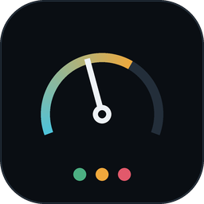
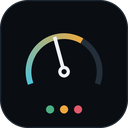

# Panorama del Servicio — código fuente completo

Todo el código fuente propio del proyecto (excluye node_modules, dist_build,
vendor/ [librerías de terceros ya minificadas], assets binarios e imágenes, y
package-lock.json [ruido de dependencias, sin interés]).

Nota histórica: hasta la 2.0.29 había también un `plantilla_directorio.html`
suelto en la raíz del repo (copia vieja sin usar, residuo de una prueba
anterior — la que realmente carga la app siempre fue
`directorio/plantilla_directorio.html`, referenciada en `main.js`). Nunca
estuvo en este snapshot porque nunca estuvo en la lista FILES de abajo; se
eliminó del repo en la 2.0.30 (Fase 4), así que esta nota ya no aplica a
partir de esa versión.

**Snapshot actualizado a la versión 2.0.41** (ver `claude/panorama-app-project-context.md`
para el historial completo). Incluye ya "Aplicar parche (app.asar)" (0.1.22),
el export CSV/Excel del bloque Equipo en Directorio de Talento (0.1.23),
"Partes mensuales" en Directorio de Talento como vista propia vía menú
(0.1.24/0.1.25), y en el launcher: reordenar tarjetas arrastrando y el
borde de color por urgencia de hitos/riesgos (0.1.26), con 4 correcciones
de usabilidad sobre eso mismo — parpadeo al arrastrar, primera tarjeta
difícil de reemplazar, colores sin refrescar en vivo, contraste
amarillo/naranja (0.1.27), un cuarto escalón de color (amarillo-claro)
con umbrales más ajustados más fecha/hora de cada marca en Partes
mensuales (0.1.28), exportar CSV/Excel de Partes mensuales, exportar
los bloques del dashboard aunque estén vacíos (para usarlos de
plantilla) y recuperar la ventana de un proyecto/Directorio ya abierto
si está minimizada al pulsar "Abrir" (0.1.29), y en Configuración:
"Cambiar ubicación de los datos..." / "Volver a la ubicación de datos
por defecto" — mover toda la carpeta de datos (por ejemplo, a una
carpeta sincronizada por Google Drive/OneDrive para usar la app desde
varios PCs) sin tocar accesos directos ni flags de línea de comandos
(0.1.30). La 0.1.31 desactivó experimentalmente
`app.setAppUserModelId(...)` para arreglar el icono en blanco en la
barra de tareas de una copia PORTABLE (confirmado por el usuario); la
0.1.32 lo reactiva porque a partir de ahí se distribuye un instalador
NSIS de verdad (que registra ese mismo id en sus accesos directos) y
además es el primer instalador NSIS real construido en esta sesión
(no parche de asar, no zip portable), pensado para que la
desinstalación desde "Programas y características" funcione bien. La
0.1.33 recorta el export de Partes mensuales a 4 columnas (Nombre,
Proyecto(s), Estado, Nota (incidencia)) y reconfirma que el export de
los bloques del dashboard (Riesgos, Skill Matrix, etc.) sigue
funcionando vacío como plantilla (ya estaba desde 0.1.29). La 0.1.34
arregla que "Próximo hito" en el Estado Ejecutivo pudiera mostrar un
hito recurrente en vez del siguiente hito real pendiente. La 0.1.35
arregla la causa de fondo por la que ese fix (y en teoría cualquier fix
anterior de dashboard/plantilla_dashboard.html) podía no llegar a un
proyecto ya existente del usuario: cada proyecto tiene su propia copia
horneada del código, que ahora se renueva automáticamente cada vez que
se abre (antes solo se renovaba al crear el proyecto o en un backup
automático, y aun así la ventana ya abierta se quedaba con el código
viejo hasta cerrarla y reabrirla). La 0.1.36 arregla la causa real de
por qué esos dos fixes (y en teoría cualquier parche anterior) nunca
llegaban a la copia real del usuario: "Aplicar parche" ahora comprueba
ANTES de nada si puede escribir en la carpeta de instalación, y si no
puede (típico de una instalación "para todos los usuarios" dentro de
Archivos de programa, que requiere administrador) avisa con un diálogo
claro en el momento en vez de fallar en silencio en un proceso
separado que arrancaba después de cerrar la app — que es justo lo que
le pasó al usuario con los parches 0.1.33/0.1.34/0.1.35, confirmado con
su propio `patch-log.txt` (tres fallos seguidos con `EPERM`). La 0.1.37
arregla un bug real y reproducido en local: proyectos ya existentes se
veían completamente vacíos al abrirlos porque el refresco automático de
la 0.1.35 machacaba en cada apertura la fecha de inicio de servicio (a
`null`, por no tener dónde leer la real), y esa fecha forma parte de la
clave con la que se guardan y buscan los datos de cada proyecto — los
datos nunca se borraron, solo quedaban "perdidos de vista" bajo la
clave antigua correcta. Se corrigió por dos vías: dejar de reconstruir
esa ficha de datos de fábrica desde cero en cada apertura (se conserva
la que ya había), y añadir una búsqueda de recuperación automática en
el dashboard que encuentra y readopta datos huérfanos por este mismo
bug, con solo volver a abrir el proyecto. La 0.1.38 añade la versión
instalada visible junto al título del lanzador (se lee en vivo con
`app.getVersion()`, así que se actualiza sola con cada parche) y deja
documentado, con prueba incluida, que el color dorado de la barra de
menú de arriba (Archivo/Editar/Seguridad/Configuración) lo pone el
tema/color de énfasis de Windows del propio usuario, no la app — el
mismo código de menú se ve blanco con texto negro en el entorno de
pruebas Linux de esta sesión. La 0.1.39 adelanta al arranque (mientras
se ve la pantalla de carga) la primera lectura en memoria de la
plantilla del dashboard, que antes ocurría en el momento de abrir el
primer proyecto o el Directorio de Talento de cada sesión — así esa
pequeña espera queda escondida detrás del arranque en vez de notarse
al entrar al primer proyecto. La 0.1.40 es un cambio de fondo: las
claves de almacenamiento de cada proyecto (localStorage) pasan de
calcularse por título+fecha (mutables — causa real del bug de la
0.1.37) a calcularse por el ID interno del proyecto (estable, igual
que ya hace la tabla `backups`), con migración automática de los datos
existentes a la primera apertura; se añade un aviso visible cuando la
app no encuentra datos donde debería (en vez de un dashboard vacío
indistinguible de un proyecto nuevo), con guardas para que un backup
automático no pueda sobrescribir uno bueno mientras ese aviso esté
activo; un panel de diagnóstico nuevo en Configuración (versión, rutas
de instalación/datos/BD, registro de parches); y un script de prueba
de humo reutilizable (`scripts/smoke_test.js`) para futuras entregas.
Durante las propias pruebas de esta versión se encontró y arregló un
bug real: cerrar un proyecto con el aviso de datos-no-encontrados
activo podía guardar un backup vacío que luego tapaba a los backups
buenos en "Restaurar último backup". La 0.1.41 corrige el texto de
"Acerca de" (ya no dice "Prototipo"); arregla un bug real encontrado
investigando un texto que señaló el usuario — el aviso "Archivo abierto
fuera de Claude.ai: guardando en Chrome..." se pintaba SIEMPRE en todos
los proyectos dentro de la app de escritorio (la variable que lo
controla, heredada de la skill original pensada también para uso
suelto en navegador, queda siempre en modo "fallback" dentro de
Electron); añade códigos de error cortos (PS-xxxx) a los diálogos de
fallo real de la app, con un listado nuevo en Configuración → "Ver
códigos de error..."; y añade un registro general de la aplicación
(`app.log`, Configuración → "Ver registro de la aplicación") con
auto-rotación por tamaño (2 MB) para que nunca crezca sin límite —
separado de `patch-log.txt`, que sigue igual. La 0.1.42 corrige un bug real
de pérdida de datos: si la carpeta de datos personalizada (por ejemplo, una
unidad de Google Drive) no está montada al arrancar, la app ya no cae en
silencio a la carpeta local tras un solo intento — reintenta con espera
(primero unos segundos antes de mostrar nada, luego más con la pantalla de
carga visible) y, si de verdad no puede acceder, para el arranque con un
diálogo que hay que atender (reintentar o seguir con datos locales a
sabiendas), código nuevo PS-1005; además, mientras la app está en marcha con
un proyecto abierto, vigila cada 45s si sigue pudiendo escribir en esa
carpeta — si detecta un corte a media sesión avisa con un banner en el
dashboard (PS-1006) y empieza a guardar copias de seguridad extra en la
carpeta local mientras dure, para no depender de encontrar los datos a mano
como pasó en el caso real que motivó este arreglo. La 0.1.43 corrige otro bug
real de la misma familia: un hito completado hoy podía dejar la tarjeta de su
proyecto en naranja en la pantalla de "Proyectos" incluso después de
reiniciar la app entera, aunque el propio dashboard ya mostrara el estado
correcto. Causa: el color de la tarjeta se calcula desde el último backup
guardado en la base de datos interna, no desde el estado en vivo, y ese
guardado final al cerrar dependía de una llamada a `beforeunload` que lanzaba
una petición asíncrona sin esperar a que terminara — si se cerraba el
proyecto o la app justo después de un cambio (antes del guardado automático
de cada 15s), ese guardado podía quedar en el aire, más fácil aún con
proyectos grandes o con la carpeta de datos en Drive (más lenta que un disco
local). Ahora, al cerrar cualquier ventana de proyecto (o el Directorio de
Talento, que reutiliza el mismo mecanismo), la app retiene el cierre hasta
confirmar que ese guardado final ha terminado de intentarlo, con un máximo de
4 segundos de margen para no bloquear al usuario si algo va mal. La 0.1.44 es
solo un cambio de texto: el panel "Versiones anteriores" del dashboard es un
mecanismo interno (una foto del proyecto una vez al día) totalmente distinto
de la carpeta de backups automáticos en disco, y el usuario confundió una
cosa con la otra al ver pocos archivos ahí frente a muchos en la carpeta. Se
aclaran el título y los textos de ese panel para que quede explícito que son
cosas distintas; no cambia ningún comportamiento ni corrige ningún dato. El
parche `app.asar` de la 0.1.44 se entregó ROTO por un error de empaquetado
(se construyó copiando archivos a mano en vez de con `electron-builder`, y
se quedó fuera `node_modules/sql.js` — la app no llegaba a arrancar,
"Cannot find module 'sql.js'"); además, la prueba bajo Wine antes de
entregarlo verificó por error un app.asar distinto al que se envió, así que
no lo detectó. La 0.1.45 es el mismo código, empaquetado correctamente con
`electron-builder` esta vez, con `sql.js` confirmado dentro del asar y
probado bajo Wine usando el archivo exacto entregado. Aparte, se creó
`claude/Restaurar-backup.bat`, una herramienta suelta (no parte de
`app.asar`, a propósito) que restaura en un clic el backup de `app.asar`
más reciente si un parche futuro vuelve a dejar la app sin arrancar — el
usuario la copió a mano una vez. La 0.1.46 hace que los instaladores
futuros ya la incluyan de fábrica en `resources\`, vía `extraResources` en
`package.json` (fuera del asar, para que sobreviva aunque `app.asar` se
rompa). La 0.1.47 va un paso más allá: `main.js` registra
`process.on('uncaughtException', ...)` antes de los requires de `./db` y
`./security` (los más frágiles del arranque), y si cualquiera de los dos
revienta —por ejemplo, otro parche mal empaquetado como el de la 0.1.44—
hace automáticamente lo mismo que `Restaurar-backup.bat`: busca el último
`app.asar.bak-*` y lo restaura sola, con un diálogo propio en vez del
diálogo genérico de Electron. Se desarma sola en cuanto `app.whenReady()`
resuelve, para no arriesgar un rollback silencioso ya con la app en marcha.
Probado repitiendo el incidente exacto de la 0.1.44 bajo Wine (asar sin
`sql.js`, con backup bueno esperando): detecta, restaura, dialoga, y la
app vuelve a abrir normal después. La 0.1.48 sustituye el botón flotante
rojo "⏻ Salir" (dashboard y Directorio de Talento) por dos botones en la
cabecera: "💾 Guardar" (fuerza un backup ahora mismo, con estado visible —
"Guardando…" → "✓ Guardado" / "— Nada que guardar aún" / "⚠ Revisa el
aviso de datos" / "✗ No se pudo guardar" — sin depender solo del guardado
automático) y "⏻ Salir" (mismo diálogo de confirmación de siempre, cierra
solo esa ventana). Probado con Xvfb+CDP+xdotool en ambas ventanas
(estados del botón Guardar, diálogo de confirmación de Salir con clics
reales de `xdotool` porque `confirm()` bloquea `Runtime.evaluate`), sin
regresión en `scripts/smoke_test.js` (6/6), y con el `.exe` compilado
arrancando bajo Wine con el asar exacto entregado. La 0.1.49 afina ese
mismo botón "⏻ Salir": ahora solo pide confirmación cuando de verdad hay
cambios sin guardar (comparando el estado actual contra el último
guardado, sin tocar disco) — si el proyecto está vacío o ya está todo
guardado, cierra directo sin preguntar nada. El guardado automático al
cerrar (mecanismo de la 0.1.43) sigue funcionando igual en ambos casos.
Probado con Xvfb+CDP+xdotool los tres estados (vacío, con cambios sin
guardar, recién guardado) en dashboard y Directorio de Talento, sin
regresión en `scripts/smoke_test.js` (6/6). La 0.1.50 añade
"Proyecto → Restaurar un backup concreto..." (dashboard y Directorio de
Talento): una ventana nueva lista TODOS los backups guardados de ese
proyecto por fecha (motivo, tamaño, 🔒 si está cifrado) y deja elegir cuál
restaurar, en vez de solo poder restaurar "el último" automáticamente —
pedido por un usuario con la carpeta de datos compartida entre dos PCs por
Google Drive, cuyo "Restaurar último backup..." no encontraba cambios
hechos en el otro PC. No se creó ningún IPC nuevo: reutiliza
`backup:list`/`backup:restore`, que ya existían en main.js (usados hasta
ahora solo por el lanzador, y `listBackups` nunca se llegaba a invocar
desde ningún sitio). Probado creando dos backups distintos a propósito y
restaurando explícitamente el más antiguo de los dos, confirmando que trae
el contenido correcto de ESE backup y no solo el más reciente. La 0.1.51
arregla la CAUSA RAÍZ de que el usuario no encontrara aquellos cambios en
ningún backup del Directorio de Talento: `saveState()` ahí retrasa 350ms
la escritura real a `localStorage` (debounce), y el mecanismo de backup
(al cerrar la ventana, cada 15s, o "Guardar") podía leer justo ANTES de
que ese guardado pendiente terminara — si el usuario marcaba un parte y
cerraba la ventana casi al momento, ese cambio se perdía de verdad, sin
llegar a ningún backup ni siquiera a persistir en el propio PC. Nueva
`flushPendingSave()` fuerza ese guardado pendiente antes de leer
`localStorage`, en `maybeBackup()` y en `hasUnsavedChanges()`. Verificado
con la app en marcha (Xvfb+CDP): reproducida la ventana de carrera real
(el dato falta en `localStorage` justo tras marcar, antes de los 350ms) y
confirmado que, con el arreglo, un backup disparado en ese mismo instante
sí contiene el cambio (comprobado en el `.json` de backup real en disco,
no solo en pantalla). Este debounce es exclusivo del Directorio de
Talento — el dashboard de proyecto normal guarda de forma síncrona, así
que no le afecta este bug. La 0.1.52 encuentra la CAUSA RAÍZ real (el
usuario aclaró que la marca perdida llevaba DÍAS puesta, no segundos —
la 0.1.51 no lo explicaba): el Directorio de Talento nunca tuvo el
mecanismo "aviso de carga fallida" (`dataLoadWarning`) que el dashboard
de proyecto normal SÍ tiene desde la 0.1.40. Al vincular un PC nuevo a
la carpeta compartida por Drive, `panorama.sqlite3` puede sincronizar
bien (confirmado con el usuario: vio el diálogo "ya tiene datos, usar
tal cual" y lo usó, no copió nada encima) mientras la carpeta
`Partitions/<proyecto>/` (donde vive el `localStorage` real de cada
proyecto, aparte del .sqlite3) todavía no ha terminado de sincronizar —
sin ningún aviso, ese arranque se comporta igual que un Directorio
recién estrenado (Equipo se ve bien porque se auto-reconstruye desde los
proyectos reales) y sigue guardando backups automáticos con total
normalidad. Esos backups nuevos, sin marcas, comparten el mismo cupo
`BACKUP_KEEP=15` (main.js, por proyecto, no por PC) que los backups
reales — bastaba con dejar la ventana abierta un rato para que fueran
expulsando, uno a uno, a los backups de verdad. Se porta al Directorio
de Talento el mismo mecanismo ya probado del dashboard: banner de aviso
(mismo código PS-2001), `hasAnyBackup()` al arrancar si no hay datos
locales, y dos candados en `maybeBackup()`/`hasUnsavedChanges()` (uno
por el aviso activo, otro genérico si el dump de localStorage no tiene
ni rastro de los datos propios del proyecto) que impiden guardar
CUALQUIER backup nuevo mientras el aviso esté activo. Verificado en
vivo (Xvfb+CDP): se vació a mano la clave de localStorage del
Directorio con sus backups reales intactos en la base, se recargó la
ventana, se confirmó el aviso activo, y se comprobó leyendo
`panorama.sqlite3` directamente que 18 segundos después (tiempo de
sobra para el backup de arranque y el periódico de 15s) el número de
backups no había cambiado ni un poco. Este arreglo evita que vuelva a
pasar; no recupera lo que ya se perdió en el incidente real del
usuario, cuyos backups con las marcas ya fueron expulsados antes de
esta versión. La 0.1.53 va un escalón más allá, a raíz de una pregunta
del propio usuario ("si no sincronizo todo del drive ni siquiera los
backups me dará como nuevo, ¿no?"): `getDb()` en `db.js` crea una base
de datos VACÍA y la persiste a disco DE INMEDIATO si `panorama.sqlite3`
no existe todavía en la carpeta configurada — sin distinguir "carpeta
por defecto, normal que empiece vacía" de "carpeta personalizada
compartida entre PCs, donde estar vacía es sospechoso". Esto es más
grave que lo de la 0.1.52: afecta a TODA la base de datos (todos los
proyectos, no solo el Directorio de Talento), y no solo no avisa —
escribe activamente un archivo vacío justo donde Drive puede estar
sincronizando el real. Nueva `checkCustomLocationDatabaseSanity()` en
`main.js`, llamada justo antes de `dbmod.getDb()`: si se usa una
carpeta personalizada sin `panorama.sqlite3`, espera ~20s y si sigue
sin aparecer para el arranque con un diálogo (nuevo código PS-1009) con
tres opciones — esperar más, empezar aquí desde cero (a propósito), o
volver a la carpeta por defecto por ahora (reutilizando sin código
nuevo el aviso ya existente de la 0.1.42). Verificado con la app en
marcha (Xvfb+xdotool+CDP), las tres opciones probadas con clics reales:
confirmado que no se crea nada hasta confirmar, que la carpeta
personalizada queda intacta si se elige volver a la por defecto, y que
si el archivo aparece a mitad de una espera la app lo detecta sola sin
volver a preguntar. De paso, se evaluó y se descartó (por un fallo
técnico probable: los scripts de apagado de Windows corren después de
cerrar sesión, cuando Drive ya está muerto) un script PowerShell que el
propio usuario propuso para retrasar el apagado de Windows hasta que
Drive esté inactivo — queda anotado el motivo por si se retoma. La 0.1.54
retoma justo eso, a petición explícita del usuario tras la 0.1.53
("ahora hay que buscar la seguridad de que no se apague el pc hasta que
no se sincronice drive o one"): nuevo `drive-sync-guard/DriveSyncGuard.ps1`
(empaquetado vía `extraResources`, fuera del asar), un proceso de fondo
por-usuario (sin admin, arrancado por `HKCU\...\Run` al iniciar sesión)
que usa la API real de Windows para esto — `ShutdownBlockReasonCreate`/
`ShutdownBlockReasonDestroy` sobre `WM_QUERYENDSESSION`, vía una clase C#
compilada en caliente con `Add-Type` — en vez del enganche de Directiva
de Grupo del script original del usuario (descartado en la 0.1.53 por
correr después de cerrar sesión, cuando Drive ya está muerto). Mismo
heurístico de "delta de CPU" que el script del usuario, generalizado a
`GoogleDriveFS.exe` Y `OneDrive.exe`. Tope de seguridad fijo de 600s:
nunca bloquea el apagado para siempre. Activar/desactivar desde
Configuración (dos entradas nuevas, dos códigos de error PS-1010/PS-1011,
un `openDriveSyncGuardLog` a juego con `openAppLog`). Verificado en vivo
bajo Wine que activar/desactivar hace de verdad lo que dice (archivo de
estado, entrada de Registro, `app.log`) — pero el mecanismo de bloqueo de
apagado EN SÍ no se ha podido probar de extremo a extremo desde este
entorno: Wine no trae PowerShell real, solo un `powershell.exe` de
mentira que no ejecuta nada, así que el script nunca ha llegado a correr
aquí. Queda pendiente que el usuario lo pruebe en un Windows real. La 0.1.55
responde a cinco peticiones en un solo mensaje: (1) esta vez se entrega el
instalador NSIS COMPLETO, no un parche suelto de `app.asar` como las
0.1.51-0.1.54; (2) nueva espera al ARRANCAR (`waitForCloudSyncIdleAtStartup`,
mismo heurístico de "delta de CPU" de la 0.1.54, tope de 20s, con el texto
de estado visible en la pantalla de carga vía `setSplashStatus`) — la otra
mitad de la protección de apagado, para que la base de datos esté completa
también al ABRIR la app, no solo al cerrar Windows; (3) página nueva en el
instalador para elegir si los datos van en este PC o en una carpeta
compartida (Drive/OneDrive), que escribe `location.json` automáticamente en
vez de tener que configurarlo a mano después de instalar — un bug real de
saltos relativos de NSIS mal contados se encontró y arregló probando esta
página con clics reales; (4) `allowElevation: false` para quitar la opción
de instalar "para todos los usuarios" (fuente de problemas reales en la
0.1.36) — cambio verificado correcto leyendo el código fuente de
electron-builder, pero su efecto en pantalla NO se puede demostrar en Wine
porque el usuario "root" de Wine siempre es admin-equivalente; (5) los
parches de `app.asar` ahora pueden nombrarse con el SHA-256 incrustado
(`<hash>-App0155.asar`) y `applyAsarPatch()` comprueba solo, al cargarlos,
si el contenido real coincide con lo que dice el nombre — verificado en
vivo bajo Wine la rama de archivo con hash que NO coincide (bloqueada con
un diálogo de error), la rama de hash que SÍ coincide se revisó por código
pero no se llegó a confirmar por pantalla en esta sesión. La 0.1.56 nace de
un script de PowerShell de otra IA que el usuario pasó como idea: se
rechazan explícitamente dos partes (auto-elevación a administrador, que iría
contra la 0.1.55; y un script de apagado por GPO, el mismo enfoque ya
descartado en la 0.1.53 porque corre después de cerrar sesión, cuando
Drive/OneDrive ya están muertos) y se adopta la idea del lockfile
multi-PC, implementada dentro de `main.js` (no como script envoltorio
aparte) con aviso-y-dejar-elegir en vez de bloqueo duro:
`.panorama-lock.json` dentro de la carpeta de datos compartida, heartbeat
cada 30s, aviso si la señal de otro equipo tiene menos de 2 minutos, con
opción de abrir igualmente — nuevo código PS-1012. De paso, a petición
explícita del usuario, la protección de apagado (0.1.54) deja de ser un
interruptor manual: se activa/desactiva sola según si se usa una carpeta de
datos personalizada (`syncDriveSyncGuardWithLocation`, en cada arranque). Se
confirma además que la espera al arrancar (0.1.55) ya tenía esa misma guarda
desde el principio, sin necesitar ningún cambio. De paso se cierra un hueco
de verificación pendiente de la 0.1.55: la rama "VÁLIDO" del checksum en el
nombre del parche, probada ahora en vivo con el propio parche de esta
entrega. Todo verificado en vivo bajo Wine con clics/estado reales (los 4
casos del lockfile, el menú sin el interruptor manual, la rama VÁLIDO del
checksum) — pendiente de confirmar solo el caso de dos PCs físicos DE
VERDAD a la vez (aquí solo se pudo simular con arranques sucesivos en la
misma máquina).

La 0.1.57 corrige un hueco que señaló el usuario: hasta entonces la app
NUNCA comprobaba de verdad si una carpeta de datos personalizada era
compartida (Drive/OneDrive) o simplemente local — se asumía siempre
compartida, sin preguntar. Ahora `location.json` guarda un campo
`"shared": true|false` explícito; si falta (configuración de antes de la
0.1.57) se trata como compartida por compatibilidad hacia atrás, sin
cambiar el comportamiento existente sin avisar. Desde "Configuración →
Cambiar ubicación de los datos..." aparece una pregunta directa
("¿Esa carpeta la vas a compartir entre varios PCs?"); el instalador
escribe `"shared": true` explícito al elegir la carpeta compartida. La
nueva `isUsingSharedDataLocationNow()` (en vez de la anterior
`isUsingCustomDataLocationNow()`, que solo miraba "¿hay carpeta
personalizada?") pasa a controlar la protección de apagado, la espera al
arrancar y el bloqueo multi-PC — el chequeo de sanidad de la base de datos
en carpeta personalizada sigue sin ese filtro a propósito, porque también
aplica a una carpeta local en otro disco. Además, a petición explícita del
usuario, se quita el mensaje de la pantalla de arranque que iba contando
segundos de espera por sincronización ("Esperando a que termine de
sincronizar Drive/OneDrive... (4s) (5s)...") — se deja fija en "Iniciando..."
con la barra de progreso animada de siempre; el detalle sigue quedando en
`app.log`, solo se dejó de mostrar en pantalla. Instalador completo
reconstruido (cambió `installer.nsh`) y verificado en vivo: el camino "no
compartida" probado en Electron nativo (confirma `shared: false` y que no
se crea lockfile), el camino "compartida" del instalador probado con el
mismo arnés aislado de la 0.1.55/0.1.56, arranque bajo Wine mostrando
"0.1.57".

La 0.1.58 corrige un bug real y confirmado con evidencia de Windows real
(no adivinado): la protección de apagado nunca ha llegado a ejecutarse en
ninguna de sus versiones (0.1.54-0.1.57). Causa: `DriveSyncGuard.ps1` se
guardaba en UTF-8 sin BOM, y Windows PowerShell 5.1 (el `powershell.exe`
de serie) lee un `.ps1` sin BOM con la página de códigos ANSI del
sistema en vez de UTF-8 — cualquier tilde se decodificaba mal, y eso
rompía la sintaxis del script de verdad, con un error de parseo que
impedía ejecutarlo desde la primera línea (por eso `guard.log` nunca se
creaba pese a que la app marcaba la protección como "activa"). Se
confirmó pidiendo al usuario ejecutar el script a mano con
`-ExecutionPolicy Bypass` sin ventana oculta: la cascada de errores de
parseo mostró literalmente el texto mal decodificado
("Límite de seguridad" en vez de "Límite de seguridad"). Arreglo: se
quitó todo carácter fuera de ASCII del archivo (tildes, la raya "—"),
verificado que el resultado es 100% ASCII y que el recuento de
llaves/paréntesis/comillas es idéntico al original — no se tocó
sintaxis, solo texto. Sin `pwsh` ni red disponibles en este entorno de
desarrollo para reconfirmar con un parser de PowerShell real, la
verificación final queda pendiente de que el usuario repita su misma
prueba manual. Entrega en dos vías: el `.ps1` corregido suelto (para
sustituir a mano, ya que vive fuera de `app.asar` como `extraResources`
y el parche no lo toca) y el instalador completo partido en 5 archivos
(por tamaño, en vez de los 4 habituales).

La 0.1.59 corrige una carrera real que el propio usuario señaló
razonando sobre el mecanismo (no probando): `WM_QUERYENDSESSION` se
contesta una sola vez, en el instante exacto en que Windows empieza a
apagar — si en ese momento Drive/OneDrive todavía no habían reaccionado
al último guardado de la app, el guard podía contestar "adelante" antes
de que hubiera nada que objetar, sin una segunda oportunidad. Se
encontró además, revisando el código, un bug en el sentido contrario:
si el guard llegaba a bloquear, solo soltaba el bloqueo a los 10
minutos, nunca cuando Drive se detectaba inactivo de forma normal. El
arreglo: la primera vez que llega `WM_QUERYENDSESSION` el guard SIEMPRE
bloquea un margen mínimo fijo de 25s, haya o no actividad de CPU
detectada todavía (mismo espíritu que ya tenía el arranque); se sustituyó
`Update-SafetyCap` por `Update-ShutdownGrace`, anclada al instante del
aviso de apagado en vez de a cuánto llevaba Drive "ocupado" en
abstracto. Mismas dos vías de entrega que la 0.1.58 (`.ps1` suelto +
instalador completo en 5 partes), y misma limitación honesta: sin
Windows/PowerShell real aquí, la verificación queda pendiente de que el
usuario repita la prueba de "guardar y apagar seguido".

La 0.1.60 es una auditoría completa del mecanismo de sincronización,
pedida por el usuario ("no haya nada redundante... no haya restos...
profesional y segura en todos sus aspectos"), no un bug reportado.
Cuatro cambios: (1) el guard ahora escribe un `heartbeat.txt` en cada
sondeo (cada 5s) y la app lo usa para relanzarlo solo si deja de dar
señales de vida, cerrando el tipo de hueco que dejó pasar el bug de la
0.1.58 sin detectar durante tres versiones — antes solo se comprobaba
`enabled.flag`, que dice lo que debería pasar, no lo que pasa de
verdad; (2) el sondeo de CPU al arrancar pasa de hasta ~10 procesos
`powershell.exe` (uno por muestra) a uno solo que hace todo el sondeo
internamente y va imprimiendo su progreso, leído en streaming desde
Node; (3) las escrituras de disco durante una sesión ya en marcha
(vigilancia de la carpeta compartida, bloqueo multi-PC) pasan de
síncronas a asíncronas, para que una carpeta colgada no pueda congelar
la ventana entera — la versión síncrona se deja solo en la fase de
arranque, donde bloquear es una decisión ya consciente; (4) se quitan
dos restos sin ningún uso real (`setSplashStatus` en main.js,
`CapExceeded` en el `.ps1`). A diferencia de la 0.1.58/0.1.59, esta vez
el `.ps1` suelto no basta por sí solo — dos de los cuatro cambios viven
en `main.js`, dentro de `app.asar` — hace falta el instalador completo.

Investigando en vivo con el usuario en dos PCs (uno corporativo con
Sophos, otro personal solo con el Defender de serie) se encontró que el
guard, lanzado a mano por el usuario, funciona perfecto en los dos — pero
el mismo lanzamiento hecho por la app (oculto, separado de la consola) no
deja ningún rastro en NINGUNO de los dos, sin error visible por ningún
lado ni en los logs de la app ni en los de Defender/Sophos. Descarta que
sea específico de una política corporativa de un antivirus concreto. La
0.1.61 no arregla esto (no se sabe todavía la causa exacta) — instrumenta
el lanzamiento automático para poder verla: la salida de PowerShell, antes
descartada (`stdio: 'ignore'`), ahora se captura en
`spawn-diagnostico.log`, junto con el código de salida del proceso.

La 0.1.62 sí es un bug real de pérdida de datos, encontrado leyendo el
código a raíz de una prueba muy detallada del usuario (añadir hito,
guardar, esperar un minuto, backup con marca de tiempo nueva pero sin el
hito dentro). Causa: `maybeBackup()` (duplicada en
`dashboard/plantilla_dashboard.html` y
`directorio/plantilla_directorio.html`) actualizaba su "sello" de último
guardado antes de comprobar si el guardado en disco había funcionado de
verdad, y nunca miraba el resultado real de `saveBackup()` — un fallo de
escritura pasajero (p.ej. un hipo de la carpeta compartida de
Drive/OneDrive) se daba por bueno para siempre, y los guardados
automáticos siguientes ya no reintentaban. Fix: comprobar el resultado
real antes de actualizar el sello, más diagnóstico nuevo en `app.log`
(una línea por cada intento de guardado, éxito o no, sin contenido real)
y forzado explícito del guardado al cerrar la ventana. El usuario pidió
expresamente no solo diagnóstico sino solución ("me parece bien que
incluyas diagnostico pero quiero solucion"), y esta versión entrega el
fix de código, no solo instrumentación.

La 0.1.63 retoma el misterio del guard que no deja rastro (0.1.61): el
usuario compartió por fin spawn-diagnostico.log, que muestra el proceso
terminando en 315-507ms con codigo=0 y CERO salida — el único punto del
script capaz de terminar así de rápido es el chequeo de enabled.flag al
arrancar. Hipótesis (no confirmada del todo): demora de visibilidad
entre procesos por el antivirus/EDR ante un archivo recién escrito por
un ejecutable sin firmar. Cambio: el chequeo ahora reintenta hasta 5
veces con 300ms entre cada uno antes de rendirse, y deja constancia en
guard.log si hizo falta el reintento — barato, sin riesgo si la causa
fuera otra. Todo el cambio vive en DriveSyncGuard.ps1 (extraResources,
fuera de app.asar), así que hace falta el instalador completo otra vez.

La 0.1.64 llega porque el usuario probó la 0.1.63 en caliente (mató el
proceso del guard a mano para forzar un relanzamiento real) y el fallo
se reprodujo en ~280ms -- demasiado rapido para que el reintento de la
0.1.63 (minimo 1.2-1.5s si no encuentra el flag) se hubiera agotado.
Contradice la hipotesis anterior. Ademas se cae en la cuenta de que
nunca se confirmo que la captura de stdout/stderr del hijo (0.1.61)
funcionara de verdad -- todo lo visto hasta ahora lo escribe el proceso
padre, nunca una linea real del script. Cambio de estrategia: el propio
DriveSyncGuard.ps1 ahora escribe su propia traza paso a paso
(trace-arranque.log, funcion Write-StartupTrace, 16 puntos desde la
primera linea ejecutable hasta el final), independiente de si Node
consigue capturar su salida. Puramente diagnostico, no un intento de
arreglo -- pendiente de que el usuario repita la prueba y comparta ese
archivo.

La 0.1.65 llega tras pegar el usuario el app.log completo de varios dias
(31/08-02/09): el ciclo "relanzando" fallo sin excepcion en todo ese
tiempo, en las versiones 0.1.60-0.1.64. Se aclara que la linea "activada
sola" en app.log se escribe siempre, fuera del try/catch del spawn() --
no prueba que el proceso se lanzara de verdad. En vez de otra version
especulativa, se aislan variable a variable las tres cosas que usa el
spawn() real y que un lanzamiento manual no usa, reproduciendolas en vivo
desde PowerShell en la propia maquina del usuario: detached:true (via
Start-Process) y windowsHide:true / CreateNoWindow (via
ProcessStartInfo.CreateNoWindow=$true, un flag DISTINTO de -WindowStyle
Hidden aunque el nombre confunda) -- ambas, aisladas, llegan limpias
hasta Application.Run, con trace-arranque.log completo. Queda sin poder
descartar una unica variable: la redireccion de stdout/stderr del hijo
hacia descriptores de archivo reales (fs.openSync, de la 0.1.61) -- y
nunca se vio una linea real del script ahi, solo lo que escribe el
proceso padre. Cambio: se quita esa redireccion, vuelve a stdio:'ignore'
como antes de la 0.1.61. detached y windowsHide se dejan igual (ya
descartados). Solo main.js -- entrega como parche app.asar suelto, no
instalador completo.

Resultado real: la hipotesis de la 0.1.65 tambien fallo -- mismo patron
de siempre (codigo=0 en ~280ms, trace-arranque.log vacio), confirmado
tras matar dos procesos manuales que habian quedado vivos de pruebas
anteriores (mantenian el heartbeat fresco y por eso la app no habia
necesitado relanzar nada).

La 0.1.66 encuentra la causa real, confirmada en vivo, no una hipotesis
mas. Con las tres variables del spawn() ya descartadas, quedaba una
diferencia sin probar: en las pruebas manuales el padre siempre era la
consola del usuario, nunca Electron. Con Process Explorer se descarta un
Job Object restrictivo (Breakaway OK y Silent Breakaway OK activados,
sin limites de recursos) pero se encuentra el dato decisivo en la
pestana Environment: el proceso de Electron tiene PROCESSOR_ARCHITECTURE
AMD64 pero PROCESSOR_IDENTIFIER de un chip ARM real -- la maquina del
usuario es un Surface Pro con Snapdragon/ARM64, y la app (compilada x64
por defecto, sin arquitectura fijada en electron-builder) corre bajo el
emulador de Windows. Confirmado que la consola del usuario es ARM64
nativa. Reproduccion decisiva sin escribir codigo: usando el propio .exe
instalado en modo Node puro (ELECTRON_RUN_AS_NODE=1), el mismo spawn()
exacto falla igual que el guard real -- primera vez que se reproduce el
fallo a voluntad. Y la solucion tambien se prueba en vivo antes de
escribir nada: el mismo lanzamiento hecho por una tarea temporal del
Programador de tareas de Windows llega limpio hasta Application.Run (el
Programador ejecuta desde su propio servicio, nativo ARM64, fuera del
arbol de procesos de Electron). Cambio: enableDriveSyncGuardSilently ya
no usa spawn() directo -- crea/actualiza una tarea programada
(PanoramaDriveSyncGuardLaunch, disparo unico en el pasado para que nunca
se dispare sola) y la dispara con schtasks /run cada vez que hay que
arrancar o relanzar el guard; disableDriveSyncGuardSilently la borra. El
arranque al iniciar sesion (reg.exe, via explorer.exe, que si es nativo)
no cambia. Pendiente: otro spawn('powershell.exe') en main.js (deteccion
de actividad de Drive/OneDrive al arrancar, ~linea 3570) no se toco --
corre en primer plano sin la logica de relanzamiento, no es el origen de
este bug, pero podria sufrir lo mismo en teoria. Solo main.js -- parche
app.asar suelto.

Resultado real: la causa raiz de la 0.1.66 esta confirmada -- por primera
vez en toda la investigacion, un relanzamiento AUTOMATICO real (PID 3300)
llego completo hasta Application.Run con heartbeat.txt avanzando solo.
Pero aparecieron dos efectos secundarios nuevos: el guard se paraba solo
a los ~50s, y el usuario reporto una ventana cmd negra parpadeando cada
ciertos segundos.

La 0.1.67 corrige ambos. El paro a los 50s: confirmado con
Get-ScheduledTask que schtasks /create basico crea la tarea con
DisallowStartIfOnBatteries=True y StopIfGoingOnBatteries=True por
defecto -- el Programador de tareas mataba el proceso al detectar
bateria, justo el escenario en que mas falta hace el guard. Confirmado
via WebFetch sobre ss64.com que no existe parametro de linea de comandos
para esto -- hace falta /create /xml con una definicion XML completa
para desactivar esas condiciones. El parpadeo: ninguna llamada
execFile('reg.exe'/'schtasks.exe', ...) llevaba windowsHide:true de
Node -- sin eso, cada proceso de consola lanzado desde una app sin
consola parpadea brevemente; antes de la 0.1.66 solo pasaba una vez, con
el ciclo de relanzamiento pasa varias veces por minuto. Cambio:
enableDriveSyncGuardSilently ahora escribe task-definition.xml (con
DisallowStartIfOnBatteries=false, StopIfGoingOnBatteries=false,
LogonType=InteractiveToken, ExecutionTimeLimit=PT0S sin limite) y crea
la tarea con /create /xml en vez de los parametros sueltos; nueva
funcion escapeXmlText() para insertar la ruta del script con seguridad.
Las seis llamadas execFile de activar/desactivar el guard llevan ahora
{ windowsHide: true }. No se ha podido probar la sintaxis XML en este
entorno Linux -- depende de que el usuario confirme que schtasks
/create /xml acepta esta definicion. Solo main.js -- parche app.asar
suelto.

El usuario confirmo en vivo que la 0.1.67 arreglo el paro a los 50s
(DisallowStartIfOnBatteries/StopIfGoingOnBatteries en False, PID estable
varios minutos), pero la ventana negra seguia apareciendo. Primera
comprobacion (LastRunTime estatico, app cerrada) hizo descartarla como
causa nuestra -- conclusion prematura. El usuario reporto despues "abri
panorama y salto la ventana de cmd" con Get-ScheduledTaskInfo mostrando
PanoramaDriveSyncGuardLaunch disparandose justo en ese instante -- si era
nuestra tarea.

Causa real 0.1.68: windowsHide:true (0.1.67) solo cubre las llamadas
execFile que la app hace para crear/lanzar/borrar la tarea -- no cubre el
parpadeo que puede darse cuando el propio SERVICIO del Programador de
tareas crea el proceso de la accion (powershell.exe -WindowStyle Hidden
...), un comportamiento distinto y ya documentado de Windows: el
parametro -WindowStyle Hidden lo interpreta powershell.exe una vez
arrancado, pero quien crea el proceso es el servicio del Programador de
tareas, no la app -- windowsHide del execFile no tiene control sobre eso.
Cambio: la tarea ya no ejecuta powershell.exe directamente, ejecuta
wscript.exe, que lanza un script auxiliar nuevo
(drive-sync-guard/LaunchHidden.vbs, nuevo extraResources) via
WScript.Shell.Run(comando, 0, False) -- tecnica estandar de Windows para
lanzar un proceso realmente sin ventana desde una tarea programada. La
logica del guard (DriveSyncGuard.ps1) no cambia. Por tocar extraResources,
instalador completo, no vale el parche suelto. No se ha podido probar en
este entorno si el parpadeo realmente desaparece en la maquina ARM64 del
usuario -- pendiente de su confirmacion en caliente.

El usuario confirmo en vivo: ventana negra arreglada de verdad ("la negra
ya no sale"). Pero al pedirle los mismos chequeos de siempre aparecio un
dato nuevo: heartbeat.txt clavado mientras la tarea ya mostraba un
disparo "exitoso" -- algo se disparaba pero el guard no volvia a dar
señales de vida. guard.log confirmo que el proceso se corto sin salida
limpia ni error capturado (cortado desde fuera). La prueba decisiva: un
disparo manual (schtasks /run) con comprobacion inmediata de procesos --
ningun powershell.exe nuevo llevaba los argumentos esperados, y
trace-arranque.log no gano ninguna linea nueva. Conclusion con evidencia
dura: el mecanismo wscript.exe + LaunchHidden.vbs de la 0.1.68 no estaba
lanzando el guard en absoluto, ni en el relanzamiento automatico ni a
mano.

La 0.1.69 corrige el propio mecanismo. Causa razonada (no reproducible
el parseo exacto de argv de wscript.exe en este entorno Linux): la 0.1.68
pasaba a LaunchHidden.vbs el COMANDO COMPLETO de powershell.exe como un
unico argumento con comillas internas ya escapadas -- dos niveles de
comillas anidadas que debian sobrevivir XML -> argv de wscript.exe ->
WScript.Arguments. (Get-ScheduledTask ...).Actions confirmo que lo
registrado en la tarea era correcto, asi que la corrupcion pasa en el
parseo/interpretacion de wscript.exe, no reproducible aqui. Fix: reducir
al minimo las comillas -- la tarea ahora le pasa a LaunchHidden.vbs SOLO
LA RUTA del script (una unica cadena entre comillas, sin comillas
internas), y es el propio VBScript quien construye la linea de comandos
de powershell.exe con Chr(34). Solo main.js + LaunchHidden.vbs (fuera de
app.asar) -- instalador completo, no vale el parche suelto. No se ha
podido probar en este entorno si esta version simplificada si lanza el
guard -- pendiente de confirmacion en caliente, esta vez con un disparo
manual (schtasks /run) pedido como prueba principal por ser mas rapido y
directo que esperar el ciclo del watchdog.

El usuario confirmo el disparo manual: powershell.exe nuevo con
CommandLine correcto, trace-arranque.log completo, heartbeat.txt fresco.
El mecanismo de lanzamiento de la 0.1.69 SI funciona -- cerrado.

El usuario hizo entonces la prueba real que quedaba pendiente desde hace
varias versiones: apagar con Drive sincronizando. Aparecio la pantalla
"esperando a que termine de sincronizar", guard.log confirmo que a los
25s el guard soltaba el bloqueo correctamente, pero el apagado NUNCA se
completo -- espero casi 1 minuto y tuvo que cancelarlo el mismo.

La 0.1.70 encuentra y arregla un bug real de fondo, confirmado contra la
documentacion OFICIAL de Microsoft (learn.microsoft.com/windows/win32/
shutdown/wm-queryendsession y /shutdown/shutting-down, consultada antes
de tocar nada): el WndProc que contesta a WM_QUERYENDSESSION devolvia
SIEMPRE FALSE ((IntPtr)0), con un comentario que decia "pide a Windows
que espere" -- exactamente al reves de lo documentado. FALSE significa
"esta app SE NIEGA al apagado" (solo para cuando apagar corromperia
datos), no es la forma de pedir mas tiempo; para eso hay que devolver
SIEMPRE TRUE y usar ShutdownBlockReasonCreate/Destroy aparte -- Windows
retoma el apagado solo en cuanto se llama a Destroy, sin repreguntar. Con
FALSE, la unica respuesta a WM_QUERYENDSESSION (llega una sola vez por
intento) quedaba registrada como una negativa definitiva; soltar
ShutdownBlockReasonDestroy despues no la revierte. Encaja exacto con lo
visto: el guard.log decia "se suelta el bloqueo", pero Windows nunca iba
a continuar solo porque ya le habian contestado que no.

Fix: un solo cambio, m.Result = (IntPtr)1 en vez de (IntPtr)0 en el
WndProc de DriveSyncGuard.ps1. El resto del mecanismo (25s de margen,
600s de tope) no cambia. Solo DriveSyncGuard.ps1 (fuera de app.asar) --
instalador completo. No se ha podido probar en este entorno si esto
resuelve el apagado real del usuario -- pendiente de su confirmacion, es
la prueba mas importante de toda la investigacion.

El usuario confirmo antes de probar: .ps1 instalado con el fix (grep OK),
un solo guard vivo, trace y heartbeat sanos. Probo el apagado real: "no
apaga, lo mismo". Pero guard.log mostro un ciclo LIMPIO esta vez (una
sola WM_QUERYENDSESSION, suelta correcta 28s despues) -- el fix de la
0.1.70 en si funciono. Preguntado si en la pantalla de apagado aparecia
otra app ademas de Panorama, el usuario confirmo que si: Outlook -- app
ajena al proyecto, con su propio bloqueo de apagado independiente. El
"no apaga" no era un bug de Panorama, era Outlook reteniendo tambien.

Se dio la investigacion por cerrada, con la salvedad honesta de que
faltaba la prueba "cristalina" (solo Panorama bloqueando, sin ninguna
otra app). El usuario hizo esa prueba y AUN ASI no apagaba (captura:
"Cerrando 1 aplicacion y apagando", solo Panorama en la lista) -- el bug
seguia ahi de verdad, esta vez sin ninguna otra explicacion posible.

La 0.1.71 encuentra la segunda pieza del mismo bug, otra vez confirmada
contra documentacion OFICIAL de Microsoft antes de tocar nada
(learn.microsoft.com/windows/win32/shutdown/wm-endsession): el fix de la
0.1.70 (TRUE a WM_QUERYENDSESSION) era correcto pero incompleto. Segun
esa documentacion, tras soltar el bloqueo Windows envia WM_ENDSESSION, y
la sesion puede terminar en cuanto TODAS las apps devuelvan ese mensaje
-- la app "debe terminar", si no Windows la fuerza. El guard soltaba
ShutdownBlockReasonDestroy correctamente pero seguia vivo indefinidamente
en segundo plano -- lo contrario de lo que este mecanismo espera (esta
pensado para apps que se CIERRAN tras el margen de gracia, no que
sobreviven al apagado).

Fix: en el momento de soltar el bloqueo (las dos ramas de
Update-ShutdownGrace), el guard ahora tambien llama a
[System.Windows.Forms.Application]::Exit() para terminar su proceso, en
vez de seguir corriendo. No se pierde proteccion: si se cancela el
apagado, el watchdog de la app principal (cada 45s) relanza el guard
solo en menos de un minuto -- mismo mecanismo ya probado desde la 0.1.66.
El mismo patron (soltar + Application.Exit()) ya existia en este script
para otro caso (enabled.flag desactivado) desde hace versiones. Solo
DriveSyncGuard.ps1 (fuera de app.asar) -- instalador completo. No se ha
podido probar en este entorno si esto resuelve el apagado real del
usuario -- pendiente de su confirmacion.

CONFIRMADO por el usuario con dos apagados reales independientes (uno con
la app cerrada, otro con la app abierta): el fix de la 0.1.71 funciona de
punta a punta. Se dio por cerrada la investigacion completa del guard
(0.1.60 -> 0.1.71), con auditoria posterior de las funciones relacionadas
que no encontro restos muertos de ninguna de las iteraciones anteriores.

La 0.1.72 anade corrector ortografico con menu de clic derecho (peticion
del usuario): setSpellCheckerLanguages(['es-ES']) por sesion y un handler
context-menu que arma sugerencias, "Agregar al diccionario" y
Cortar/Copiar/Pegar/Seleccionar todo. Probado de verdad: el mecanismo del
menu contextual en si, con un clic derecho real via CDP + captura de
pantalla. NO probado aqui: que aparezcan sugerencias de correccion --
la carpeta de diccionarios de Chromium queda vacia porque este entorno
tiene bloqueado el acceso de red al servidor de Google del que se
descarga el diccionario es-ES la primera vez; limitacion de este entorno
de pruebas, no del codigo, y queda pendiente de que el usuario lo
confirme en su Windows real. Solo main.js -- entregado como parche
app.asar.

La 0.1.73 anade "Evaluacion de Candidatos" integrada en la app (menu
Proyecto -> Evaluacion de Candidatos...), 3a iteracion de la misma
peticion tras rechazarse una plantilla Excel y una app HTML suelta.
Un solo documento vivo por proyecto (puestos + evaluaciones): tabla
candidate_evals (project_id como PRIMARY KEY) solo con metadatos
ligeros, el JSON real vive en un archivo dentro de la carpeta de
backups del proyecto -- mismo principio ya aplicado a los backups
para no penalizar cada guardado de la app con contenido voluminoso
en SQLite. Renderer nuevo evaluacion-candidatos/plantilla_evaluacion_
candidatos.html, adaptado de una app HTML/JS ya probada con Playwright
(sin localStorage, sin datos de ejemplo, guardado vía panoramaBridge
con debounce de 400ms salvo en acciones discretas). Probado de verdad
con Xvfb+CDP+xdotool contra la app real: menu, ventana, +anadir puesto/
tarea/evaluacion, calculo de nota ponderada y veredicto, exportar CSV
via dialogo nativo, borrar puesto con evaluacion asociada, y sobre
todo persistencia real tras cerrar y reabrir proyecto y ventana. NO
probado: guardado con cifrado activado, y el caso limite de cerrar la
ventana dentro del debounce de 400ms tras escribir texto libre.
Entregado como parche app.asar.

La 0.1.74 cambia el peso de las tareas en "Evaluacion de Candidatos" de
porcentaje (0-100, debia sumar 100%) a una escala de importancia 0-5,
igual que en el Excel anterior del usuario. Solo toco el renderer
(evaluacion-candidatos/plantilla_evaluacion_candidatos.html): limites
del input, textos, y la insignia por puesto (ya no exige que sumen
100%, solo avisa si no hay ningun peso asignado). El calculo de nota
ponderada (media sumWN/sumW) no cambio -- ya era agnostico a la escala.
Probado con Playwright: limites 0-5 con clamp, sin rastro de "100%" en
pantalla, calculo peso 5 + nota 4 -> 4.0/5 APTO correcto, 0 errores JS.
Cambio confirmado en el asar compilado. Exe arranca bajo Wine (los
"GPU process exited" del log son ruido de Wine con render por software,
no de la app). No se retesteo persistencia/cifrado/export porque no se
tocaron. Entregado como parche app.asar comprimido en zip porque al
usuario le fallaba la descarga del asar suelto.

La 0.1.75 anade telefono y CV adjunto al candidato en "Evaluacion de
Candidatos". Campo telefono junto a TAP/Manager, y bloque CV con
+Adjuntar/Ver/Cambiar/Quitar. El CV se copia a una carpeta cv/ hermana
del estado.json (nunca al JSON en si, y nunca cifrado aunque la
Seguridad este activa -- limitacion documentada). Tres IPC nuevos en
main.js: candidateEval:pickCv (dialog.showOpenDialogSync + copia,
limite 15MB), candidateEval:openCv (shell.openPath), candidateEval:
removeCv -- los dos ultimos validan el nombre de archivo recibido
contra path traversal. Probado con la app real (Xvfb+CDP+xdotool, no
solo Playwright) porque toca un dialogo nativo real: adjuntar un PDF
de verdad copia el archivo byte a byte (diff), Ver CV lo abre de
verdad con el lector disponible (LibreOffice en este sandbox), Quitar
lo borra de disco, y telefono+CV sobreviven cerrar/reabrir proyecto y
ventana por completo. Cambio confirmado en el asar compilado, exe
arranca bajo Wine. No probado: Windows real, CV con cifrado activado.
Entregado como parche app.asar comprimido en zip.

La 0.1.76 anade "N entrevista(s) pendiente(s)" como texto de color en
las tarjetas del launcher. Se descarto vincular entrevistas con hitos
del dashboard (los hitos viven en localStorage de la ventana del
dashboard, no en un archivo -- sync automatico fragil si esa ventana
esta cerrada). En su lugar: nueva computeCandidatePendingInterviews()
en main.js (reutiliza readCandidateEvalPayloadForProject, extraida de
candidateEval:get) que lee el estado.json de Evaluacion de Candidatos
de cada proyecto -- sin depender de ninguna ventana abierta -- y cuenta
evaluaciones con fecha puesta y no completadas, con los MISMOS
umbrales de dias que ya usa computeProjectSemaforo para hitos (rojo/
naranja/amarillo/amarillo-claro/sin nivel). Anadido a projects:list
como pendingInterviewsCount/Level. launcher/renderer.js pinta la linea
solo si count>0, con clases txt-<nivel> reutilizando las mismas
variables de color que el borde del semaforo de hitos. Sin cambios en
db.js/preload.js ni en el renderer de Evaluacion de Candidatos --
calculo de solo lectura. Probado con la app real (Xvfb+CDP) forzando
datos para cada umbral: rojo (vencida+manana combinadas, excluyendo la
completada), singular sin color (>7 dias), naranja (1 dia) y amarillo
(3 dias) por separado confirmados con captura, y el caso sin pendientes
(linea ausente). Cambio confirmado en el asar, exe arranca bajo Wine.
No probado: seguridad activada y bloqueada, Windows real. Entregado
como parche app.asar comprimido en zip.

La 0.1.77 arregla el color del campo Telefono en Evaluacion de
Candidatos (le faltaba input[type=tel] en el selector CSS que pinta el
fondo/texto ambar de TAP/Manager -- se quedaba blanco por defecto),
anade el campo Entrevistador (entre Manager y Telefono, en la UI y en
el export CSV), y hace clicable el aviso "N entrevista(s)
pendiente(s)" del launcher: abre (o enfoca si ya esta abierta) la
ventana de Evaluacion de Candidatos de ese proyecto directamente en la
pestana Evaluaciones. openCandidateEvalWindow(row, opts) gana
opts.focusEvaluaciones -- si la ventana ya existe le manda el IPC
candidateEval:focusEvaluaciones, si no existe la crea con
--panorama-initial-tab=evaluaciones en los argv (mismo patron que
--panorama-project-id). Nuevo IPC candidateEval:openWindow en main.js,
nuevo openCandidateEval(id) en preload-launcher.js, nuevo
onFocusEvaluaciones/initialTab en preload.js. El listener de clic
delegado de launcher/renderer.js paso de mirar solo button[data-act] a
[data-act] para capturar tambien el nuevo <span data-act="openEval">.
El camino de menu nativo (Proyecto -> Evaluacion de Candidatos...) no
cambia -- sigue sin pasar opts, arranca en Puestos como siempre.
Probado con la app real (Xvfb+CDP) sin inyectar JSON a mano -- puesto y
evaluacion creados desde la propia UI, campos rellenados escribiendo en
los inputs reales: Telefono con el mismo getComputedStyle que TAP,
Entrevistador visible/guardado/en el CSV, persistencia real tras cerrar
y reabrir la ventana, y los dos caminos del clic (ventana cerrada ->
abre ya en Evaluaciones; ventana abierta en otra pestana -> cambia de
pestana sin duplicar ventana) confirmados via el estado del DOM antes y
despues del clic. Cambio confirmado en el asar compilado, exe arranca
bajo Wine sin excepcion propia de la app. No probado: el camino de
menu nativo tras este cambio concreto (no deberia haberse tocado, pero
no se repitio la comprobacion visual), Windows real. Entregado como
parche app.asar comprimido en zip.

La 0.1.78 anade guia libre por TAREA (no por puesto) en Evaluacion de
Candidatos, a peticion del usuario tras planteale 3 opciones en
conversacion (texto por puesto, texto por tarea, adjuntar archivo tipo
CV) sin tocar codigo primero. Cada tarea gana campo guide (string,
vacio en tareas nuevas, tratado como '' si no existe en tareas viejas
-- sin migracion). En Puestos: textarea "Guia de esta tarea" bajo
nombre+peso de cada tarea, mismo patron data-action que task-name/
task-weight. En Evaluaciones: si la tarea tiene guia, se muestra en
cursiva bajo su nombre en la tabla de tareas -- SOLO LECTURA ahi (se
edita solo desde Puestos), pensada para tenerla a la vista al puntuar.
Sin guia no anade nada visual. El click de pestanas gano refresco de
renderEvaluaciones() al entrar en esa pestana (antes solo resultados
se refrescaba asi) para que una guia editada en Puestos no se quede
obsoleta en el DOM. Sin cambios en main.js/preload.js/db.js -- todo
dentro de plantilla_evaluacion_candidatos.html, mismo documento
estado.json de siempre. No anadida al CSV (resumen por candidato, no
por tarea) pero si sale en el JSON (vuelca state completo). Probado
con la app real (Xvfb+CDP) desde la UI real sin inyectar JSON a mano:
guia escrita en una tarea real confirmada en state, mostrada en modo
lectura en Evaluaciones tras asignar el puesto, una segunda tarea sin
guia confirmada sin bloque de mas, y persistencia real tras cerrar y
reabrir la ventana. Cambio confirmado en el asar compilado, exe
arranca bajo Wine sin excepcion propia de la app. No probado:
seguridad activada y bloqueada, Windows real, resto de funciones no
tocadas por este parche. Entregado como parche app.asar comprimido en
zip.

La 0.1.79 anade dos campos por evaluacion, junto a TAP/Manager/
Entrevistador/Telefono: Formacion y "SBA valorado (cambio)" (salario
bruto anual). Texto libre, informativos, NO entran en la ponderacion
ni en la nota final. Reutilizan el mismo data-action="ev-field"
generico que ya manejaba TAP/Manager -- no hizo falta tocar el
listener de input, solo anadir la fila row-flex en la tarjeta y los
dos campos en la forma por defecto de evaluacion nueva. Sin cambios en
main.js/preload.js/db.js. Deliberadamente NO anadidos al CSV de
resultados (resumen pensado para compartir, el dato salarial no
encajaba ahi por defecto). Probado con la app real (Xvfb+CDP) desde la
UI real: orden de etiquetas confirmado, datos rellenados y
confirmados en state, mismo getComputedStyle que TAP, y persistencia
real tras cerrar y reabrir la ventana. Cambio confirmado en el asar
compilado, exe arranca bajo Wine sin excepcion propia de la app. No
probado: seguridad activada y bloqueada, Windows real, resto de
funciones no tocadas (guia por tarea de 0.1.78, hitos/riesgos,
Directorio de Talento). Entregado como parche app.asar comprimido en
zip.

La 0.1.80 responde a que el usuario pego guias reales largas en las
tareas (0.1.78) y en Evaluaciones se veia todo como un parrafo gris
sin jerarquia -- mas el pedido de Formacion minima/Anios requeridos
por puesto con aviso si el candidato no llega. Guia: sigue siendo
texto libre (no se toco lo ya pegado), pero en Evaluaciones ahora va
dentro de un <details><summary>Ver guia</summary> plegado por defecto
(nativo, sin JS de toggle), y el contenido pasa por la nueva
renderGuideRich() que reconoce lineas "- " como <ul><li>, lineas
cortas acabadas en ":" como mini-titular, y el resto como parrafos --
todo con escapeHtml antes de montar las etiquetas. Formacion minima y
Anios minimos nuevos a nivel de PUESTO (puesto.formacionMinima/
aniosMinimos), editables en Puestos con la nueva accion generica
data-action="puesto-field" (mismo patron que ev-field). Anios de
experiencia nuevo por evaluacion; Formacion+Anios de experiencia se
movieron a la primera fila de campos (antes de TAP/Manager/
Entrevistador/Telefono) porque el usuario dijo que siempre son la
primera pregunta de la entrevista. Si el puesto tiene minimos, la
etiqueta muestra "(minimo del puesto: ...)"; si los anios del
candidato quedan por debajo, aviso automatico "Por debajo del minimo".
Decision deliberada: el aviso automatico es SOLO para anios (numero,
sin ambiguedad) -- Formacion es texto libre con matices de equivalencia
reales, solo se muestra el minimo al lado sin que la app decida.
Anadido input[type=number] al selector CSS del fondo ambar de .field
(si no, el campo de anios se habria quedado en blanco -- mismo bug que
el telefono de 0.1.77). Probado con la app real (Xvfb+CDP) desde la UI
real: puesto con minimos reales, tarea con guia real de varias lineas,
evaluacion asignada -- confirmado el HTML generado por renderGuideRich
(parrafo/titular/lista separados de verdad, no solo que no diera
error), el aviso aparece/desaparece cruzando el umbral en ambos
sentidos, mismo getComputedStyle que TAP en el campo de anios, y
persistencia real tras cerrar y reabrir la ventana (puesto+minimos y
evaluacion+anios). Cambio confirmado en el asar compilado, exe arranca
bajo Wine sin excepcion propia de la app. No probado: seguridad
activada y bloqueada, Windows real, resto de funciones no tocadas.
Entregado como parche app.asar comprimido en zip.

La 0.1.81 arregla un bug reportado tras probar 0.1.80 en real: el aviso
"por debajo del minimo" de Anios de experiencia no se actualizaba al
teclear, solo si algo mas de casualidad forzaba un repintado completo
(cambiar de pestana, tocar el peso de una tarea). Causa confirmada
releyendo el archivo: el listener generico ev-field guardaba el valor
pero nunca volvia a comprobar el aviso (ese div se calcula solo dentro
de renderEvaluaciones()). Fix: nueva updateAniosWarning(inputEl, ev)
que actualiza SOLO ese div con DOM directo desde ev-field cuando el
campo es aniosExperiencia -- deliberadamente sin llamar a
renderEvaluaciones() a secas, que reconstruye toda la pestana mientras
el usuario sigue tecleando y le haria perder el foco a media cifra.
Ademas dos pedidos nuevos del mismo mensaje: boton "Desplegar todas las
guias" por tarjeta de evaluacion (data-action="toggle-guides", abre/
cierra de golpe todos los <details> de guia de esa tarjeta, sin
renderEvaluaciones(), solo aparece si el puesto tiene alguna tarea con
guia); y SBA de referencia a nivel de PUESTO (puesto.sbaReferencia,
mismo patron que formacionMinima/aniosMinimos), mostrado como
"(referencia del puesto: ...)" junto a "SBA valorado (cambio)" del
candidato en Evaluaciones, sin aviso automatico (texto libre, mismo
motivo que Formacion). Probado esta vez cargando el HTML real del
parche (mismo texto, sin copia) con Playwright y tecleo real caracter a
caracter (no fill() ni JS a mano) -- el aviso aparece/desaparece en
caliente sin tocar nada mas y el campo conserva el foco; boton
desplegar/plegar confirmado por el atributo open de cada <details>;
etiqueta SBA muestra la referencia; Formacion sigue sin aviso
automatico; sin errores de consola. Cambio confirmado en el asar
compilado, exe arranca bajo Wine sin excepcion propia de la app. No
probado esta vez: persistencia a disco/recarga de ventana de estos
campos concretos (no se toco el mecanismo de guardado), seguridad
activada y bloqueada, Windows real, resto de funciones no tocadas.
Entregado como parche app.asar comprimido en zip.

La 0.1.82 corrige un malentendido de la 0.1.81: el boton "Desplegar
todas las guias" no era lo pedido. El usuario mando 3 capturas
aclarando: las guias por tarea (el <details> "Ver guia" de cada fila)
estan bien, no tocarlas; lo que queria plegado por defecto es la FICHA
de evaluacion entera -- la tabla completa Tarea/Peso/Nota/Comentario --
para que la lista de candidatos evaluados no ocupe tanto, con un boton
que la despliegue mostrando el mismo aspecto de siempre. Cambios:
eliminado del todo el boton/accion toggle-guides de 0.1.81 (no se deja
desactivado). Nueva variable de interfaz let expandedEvalIds = new
Set() (fuera de state, no se persiste a disco -- memoria de la ventana
abierta). La tabla de tareas de cada evaluacion va envuelta en
<div class="eval-tasks-wrap" data-id="..." hidden> (atributo nativo
hidden, sin CSS a medida) precedida de un boton data-action=
"toggle-tasks" con texto "Ver tareas"/"Ocultar tareas" segun
expandedEvalIds.has(ev.id) -- el contenido de dentro (tabla, columnas,
guia por tarea) es exactamente el mismo HTML de siempre, sin tocar su
formato. Handler toggle-tasks alterna wrap.hidden con DOM directo (sin
renderEvaluaciones(), mismo motivo de siempre: no perder foco de otros
campos) y sincroniza expandedEvalIds. Importante: puntuar una nota o
cambiar el puesto asignado siguen forzando un renderEvaluaciones()
completo (ya existente, no tocado) -- sin guardar el estado en
expandedEvalIds la tabla se habria vuelto a plegar sola cada vez que el
usuario puntuaba una tarea, justo mientras la estaba usando; al leer
expandedEvalIds en cada render, el estado desplegado sobrevive a esos
refrescos forzados. Probado con el HTML real del parche cargado en
navegador de pruebas con interaccion real (clics y select_option
reales, no JS a mano): por defecto oculta con boton "Ver tareas"; al
pulsar se despliega con las 4 columnas y filas correctas, boton pasa a
"Ocultar tareas"; se puntuo una nota real (fuerza re-render completo) y
se confirmo que sigue desplegada despues -- el caso que se habria roto
sin el Set, comprobado explicitamente que no ocurre; al pulsar otra vez
vuelve a plegarse. Sin errores de consola. Confirmado en el asar
compilado que toggle-tasks existe y toggle-guides (el boton equivocado
de 0.1.81) ya no. Exe arranca bajo Wine sin excepcion propia de la app.
No probado: no aplica persistencia a disco (cambio puramente de
interfaz), seguridad activada y bloqueada, Windows real, resto de
funciones no tocadas (fix de anios/SBA de 0.1.81, hitos, riesgos,
Directorio de Talento, CV). Entregado como parche app.asar comprimido
en zip.

La 0.1.83 responde a dos pedidos del mismo mensaje: mismo plegado de
0.1.82 pero tambien en Puestos, y un bug real en el borrador de
feedback. Plegado en Puestos: mismo patron, nueva
let expandedPuestoIds = new Set() (fuera de state, no se persiste). La
tabla de tareas de cada puesto (si tiene alguna) va envuelta en
<div class="puesto-tasks-wrap" data-id="..." hidden> con boton
data-action="toggle-puesto-tasks" ("Ver tareas"/"Ocultar tareas").
Diferencia deliberada frente a Evaluaciones: aqui SI se auto-expande al
crear un puesto nuevo y al anadirle una tarea (en Puestos el usuario
esta construyendo activamente, no solo consultando), para ver al
momento lo que se acaba de crear. Comprobado que el estado plegado
sobrevive a un renderPuestos() global disparado por otro puesto
distinto. Fix del feedback: feedbackDraft() usaba rows.find(r => r.nota
=== maxN) -- con empate, .find() solo devuelve la PRIMERA coincidencia,
las demas se ignoraban en silencio (mismo problema simetrico para el
minimo). Fix: filter+sort por peso descendente -- con empate en nota,
elige como principal la de MAYOR PESO (la que mas cuenta en la
ponderacion final) y menciona tambien las demas empatadas en la nota en
vez de descartarlas ("Tambien obtuvo la nota maxima en X e Y"); solo
anade "aunque con menos peso en la ponderacion de este puesto" cuando
eso es cierto para TODAS las que menciona -- si alguna tiene el MISMO
peso que la principal, no se afirma eso. Aplicado igual al area de
mejora (empates en nota minima) por coherencia, aunque el usuario solo
menciono el caso de los puntos fuertes. Nueva joinListEs() para juntar
nombres al estilo espanol (y/e). Probado con el HTML real del parche en
navegador de pruebas con interaccion real: puesto sin tareas -> sin
boton; 1a tarea -> desplegada sola; plegar manual -> se oculta; crear
OTRO puesto con tarea (re-render global) -> el primero sigue plegado;
anadir 2a tarea al plegado -> se despliega; feedback con 4 tareas
(pesos 5/3/5/2, notas 5/5/5/2, dos empatadas en nota Y peso, una
tercera empatada en nota con menor peso) -> elige la de mayor peso como
principal, menciona las otras dos sin decir "menos peso" (porque una
tiene el mismo peso -- se confirmo que decirlo habria sido inexacto), y
el area de mejora sale correcta. Se repitio tambien la prueba de
plegado de Evaluaciones de 0.1.82 sin regresion. Sin errores de
consola. Cambio confirmado en el asar compilado, exe arranca bajo Wine
sin excepcion propia de la app. No probado: persistencia a disco del
plegado de Puestos (no aplica, es interfaz), guardado/recarga del texto
de feedback en esta entrega concreta (mecanismo ya probado, no tocado),
seguridad activada y bloqueada, Windows real, resto de funciones no
tocadas. Entregado como parche app.asar comprimido en zip.

La 0.1.84 corrige un bug de redaccion que el propio usuario destapo al
pegar un resultado real para analizar. El calculo (3.1/5) y la eleccion
por peso del fix de 0.1.83 estaban bien -- verificado recalculando a
mano sus 14 tareas reales, da 3.14. El bug: una tarea se llama "Gestion
de logs, rsyslog, ELK..." (con comas DENTRO del nombre). Al juntarla
con las demas tareas empatadas en nota usando tambien comas como
separador (joinListEs de 0.1.83), el texto salia "tambien obtuvo la
nota maxima en ha servidores, gestion de logs, rsyslog, elk... y
proactividad" -- se lee como 4 tareas sueltas en vez de 3, porque no
hay forma de distinguir la coma que separa la lista de las que forman
parte de un nombre. Fix: joinListEs() entrecomilla cada elemento antes
de juntarlos (la conjuncion y/e se sigue decidiendo sobre el nombre sin
comillas); tambien se entrecomilla, por consistencia, el nombre de la
tarea "principal" (punto mas fuerte/area de mejora elegido por peso).
Probado con el HTML real del parche, reproduciendo exactamente las 14
tareas/pesos/notas reales del usuario via state/feedbackDraft()
directamente (logica pura de texto, no hace falta clicar modales): nota
ponderada da 3.14 -> "3.1/5" igual que vio el usuario; "Gestion de
logs, rsyslog, ELK..." aparece entrecomillada como una sola unidad;
"Adm. Jboss y Tomcat" sigue de principal (peso 5, el mayor entre los 4
empatados a nota 5) y las otras tres se siguen mencionando,
entrecomilladas; "Adm. Nagios" sigue de area de mejora principal y
"Moodle bajo LAMP" se sigue mencionando. Se repitieron las pruebas de
plegado de Puestos/Evaluaciones de 0.1.82/0.1.83 sin regresion. Sin
errores de consola. Cambio confirmado en el asar compilado, exe arranca
bajo Wine sin excepcion propia de la app. No probado: un nombre de
tarea con comillas dobles literales dentro (caso muy raro) no se ha
reforzado explicitamente; guardado/recarga a disco del texto de
feedback en esta entrega concreta (mecanismo ya probado, no tocado);
seguridad activada y bloqueada, Windows real, resto de funciones no
tocadas. Entregado como parche app.asar comprimido en zip.

La 0.1.85 quita la coletilla "aunque con menos peso en la ponderacion
de este puesto" (0.1.83) que el usuario vio repetitiva y poco clara --
no decia CUANTO menos peso tenia cada tarea empatada, y se repetia
igual para todo el grupo. joinListEs() sustituida por
joinTareasConPeso(rows): recibe {name, weight} y formatea cada tarea
como "nombre" (peso N) -- el peso real de cada una, siempre, sin frase
generica. Se elimina el calculo menorPeso (el .every(...) que decidia
si anadir la coletilla) -- ya no hace falta, mostrar el peso real es
siempre exacto, incluso si una tarea empatada en nota tiene TAMBIEN el
mismo peso que la principal (antes ese caso se quedaba sin decir nada
especial). Probado con el HTML real del parche repitiendo el mismo
caso real de 0.1.84 (14 tareas de Daniel Romano Rodriguez) y el caso de
empate en peso ademas de en nota (de 0.1.83): texto ahora "tambien
obtuvo la nota maxima en "ha servidores" (peso 4), "gestion de logs,
rsyslog, elk..." (peso 4) y "proactividad" (peso 3)" -- coletilla vieja
ausente, nota ponderada sigue en 3.1/5. En el caso de empate en peso,
cada tarea muestra su peso real en vez de la vieja frase que ahi se
omitia sin mas. Se repitieron las pruebas de plegado de
Puestos/Evaluaciones de 0.1.82/0.1.83 sin regresion. Sin errores de
consola. Cambio confirmado en el asar compilado, exe arranca bajo Wine
sin excepcion propia de la app. No probado: guardado/recarga a disco
del texto de feedback en esta entrega concreta (mecanismo ya probado,
no tocado), seguridad activada y bloqueada, Windows real, resto de
funciones no tocadas. Entregado como parche app.asar comprimido en zip.

La 0.1.86 anade tres mejoras pedidas juntas (nombre de puesto editable,
buscador, boton Salir), tras aclarar con AskUserQuestion el alcance del
buscador y el destino de Salir. Nombre de puesto: cabecera de la
tarjeta paso de span a input con data-action="puesto-field"
data-field="name" -- reusa el listener generico ya existente, sin JS
nuevo. Buscador (#searchBox, cabecera, visible en las 3 pestanas): un
solo cuadro compartido, cada pestana filtra con su propio contenido de
forma independiente via matchesSearch() + applyPuestosFilter()
(nombre, formacion minima, SBA referencia, nombre/guia de cada tarea)
+ applyEvalFilter() (candidato, puesto, TAP, Manager, Entrevistador,
Formacion, SBA, anios experiencia) + applyResultadosFilter()
(candidato, puesto, TAP, Manager de la tabla -- el resumen de arriba
sigue mostrando totales reales sin filtrar). data-puesto-card/
data-eval-card/data-eval-row anadidos para localizar sin re-renderizar
(mismo patron de actualizacion dirigida del DOM desde 0.1.81). Aviso
"No se encontro nada..." cuando no hay coincidencias en la pestana.
Boton Salir (#btnSalir): window.close(), mismo mecanismo que la X
nativa. Probado con Playwright (interaccion real, clics y escritura,
sin JS inyectado a mano): edicion de nombre de puesto persiste en
state; busqueda "selinux" encuentra solo el puesto con esa palabra en
la guia de una tarea (aunque plegada); "sap" encuentra solo el otro
puesto; texto inexistente muestra el aviso; "daniel" en Evaluaciones
encuentra solo esa evaluacion, y el MISMO texto "daniel" en la pestana
Puestos no deja nada visible y muestra su propio aviso -- confirma
independencia real entre pestanas, no busqueda global. Salir no lanza
excepcion. Se repitieron las pruebas de plegado (0.1.82/0.1.83) y
feedback (0.1.83/0.1.84/0.1.85) sin regresion. Sin errores de consola.
Cambio confirmado en el asar compilado, exe arranca bajo Wine sin
excepcion propia de la app. No probado: cierre real de la ventana
dentro de Electron empaquetado (solo se probo en navegador de
pruebas); guardado/recarga a disco de nombre de puesto editado
cerrando y reabriendo la ventana en esta entrega concreta (mecanismo
ya probado, no tocado); busqueda no normaliza acentos (es texto plano
literal, tal como se pidio); seguridad activada y bloqueada, Windows
real, resto de funciones no tocadas. Entregado como parche app.asar
comprimido en zip.

La 0.1.87 corrige tres quejas sobre la 0.1.86: el buscador no
encontraba nada, la raya bajo el nombre editable se veia fea, y el
boton Salir pedia ser rojo. Se reprodujo el bug del buscador ANTES de
tocar codigo (puesto "Tecnico de Soporte N1", buscar "tecnico" sin
tilde -> 0 resultados confirmado): matchesSearch (0.1.86) comparaba
con toLowerCase() a secas sin quitar acentos, una tilde de diferencia
dejaba la busqueda sin resultados. Fix: normalizeSearchText(s) hace
normalize('NFD') + replace de las marcas diacriticas (rango unicode
U+0300-U+036F) + toLowerCase(), aplicada tanto en matchesSearch como
en el listener de #searchBox -- ahora "tecnico" encuentra "Tecnico"
con tilde y viceversa (sigue siendo texto plano, no sustituye letras
distintas -- una "n" normal no encuentra una "enie"). Nombre de puesto: se quita el
border-bottom dashed permanente, el input queda sin borde en reposo
igual que antes de 0.1.86, se anade un icono de lapiz (span
name-edit-icon) al lado, el fondo claro de resaltado solo aparece en
hover/focus. Boton Salir: pasa de gris translucido a rojo solido
(#DC2626, hover #B91C1C), mismo window.close() de siempre. Probado
con Playwright: bug reproducido y confirmado ANTES del fix; tras el
fix, "tecnico" y "tecnico" con tilde encuentran el mismo puesto;
"jose ramon" sin tildes encuentra "Jose Ramon Nunez"; boton Salir
con getComputedStyle().backgroundColor = rgb(220, 38, 38) confirmado;
input de nombre con borderBottomStyle = "none" confirmado, icono de
lapiz presente, edicion se sigue guardando en state. Se repitieron
todas las pruebas de 0.1.82 a 0.1.86 sin regresion. Sin errores de
consola. Cambio confirmado en el asar compilado (grep de
name-edit-icon, normalizeSearchText, DC2626, y confirmado que ya NO
aparece el border-bottom dashed viejo). Exe arranca bajo Wine con
procesos renderer/utility activos varios segundos, sin excepcion
propia de la app. No probado: cierre real de ventana dentro de
Electron empaquetado (solo navegador de pruebas); normalizacion de
acentos no sustituye letras distintas (una "n" normal no encuentra
una "enie"); guardado/
recarga a disco en esta entrega concreta (mecanismo ya probado, no
tocado); seguridad activada y bloqueada, Windows real, resto de
funciones no tocadas. Entregado como parche app.asar comprimido en
zip.

La 0.1.88 responde a la pregunta del usuario: "cuando busco se debe
marcar lo que ponga linux, no?". La logica ya ocultaba lo que no
coincidia (0.1.87), pero nada marcaba lo que SI coincidia -- con un
solo resultado visible parecia que no pasaba nada (confusion de UX,
no bug de logica). Ademas penalizaba el flujo de edicion del nombre
de puesto: paso de input siempre editable (0.1.86/0.1.87) a
display/edit explicito con Aceptar/Cancelar. Cambios: nueva funcion
highlightMatches(text) que compara sobre texto normalizado (mismo
normalize('NFD') + strip de acentos de matchesSearch) caracter a
caracter, guardando en un array `map` a que indice del texto ORIGINAL
corresponde cada caracter normalizado, para que el fragmento resaltado
conserve mayusculas/tildes reales; envuelve el match en <mark
class="search-hit">. Se aplica al nombre de puesto (ahora un span
en reposo, ver mas abajo) y a las celdas de Candidato/Puesto/TAP/
Manager en Resultados (ya eran texto plano). En Evaluaciones y en
los demas campos de un puesto (Formacion minima, Anios minimos, SBA,
tareas, guias) son inputs/textareas -- no se puede insertar un mark
dentro de un input, asi que ahi la marca es la tarjeta entera: clase
.search-match (contorno azul) en applyPuestosFilter/applyEvalFilter,
y en las filas de Resultados sobre el tr. Nombre de puesto: se
sustituye el input siempre editable por dos modos gestionados con el
nuevo estado de interfaz editingPuestoNameId (mismo patron que
expandedPuestoIds, no se guarda en disco) -- puestoNameWrapHtml(puesto)
devuelve un span.name-display (con highlightMatches) + boton lapiz en
reposo, o un input.name-edit-input con foco automatico + boton
Aceptar (verde) + boton Cancelar (translucido) en edicion.
refreshPuestoNameWrap(puesto) sustituye SOLO el bloque del nombre de
esa tarjeta (actualizacion dirigida del DOM, no renderPuestos()
completo). Aceptar (clic o Intro) guarda y llama saveState(true);
Cancelar (clic o Escape) descarta sin tocar state. Se quita del todo
el CSS/HTML del diseno anterior (.name-input, el lapiz decorativo sin
accion). test85.py y test87.py quedan obsoletos (referencian
input.name-input, ya no existe) -- sus escenarios se retoman en
test88.py/test88b_independencia.py con los selectores nuevos.
Probado con Playwright: nombre en reposo muestra span + lapiz, sin
input visible; pulsar el lapiz muestra input con foco automatico +
Aceptar/Cancelar; escribir y Cancelar NO cambia state.puestos[0].name
(confirmado leyendo el dato); escribir y Aceptar SI lo cambia; Intro
guarda igual que Aceptar, Escape descarta igual que Cancelar; buscar
"linux" con "Adm Linux Sr" y "Consultora SAP MM" resalta "Linux"
dentro del nombre del primero y marca su tarjeta con search-match, el
segundo queda oculto; buscar "linux" en Resultados con "Daniel Romano
Linux" resalta "Linux" en su celda; buscar "daniel" en Evaluaciones
marca la tarjeta con search-match (sin mark, son inputs); repetida la
independencia entre pestanas de 0.1.86 (mismo texto "daniel" en
Puestos no deja nada visible, aviso propio de sin resultados, sin
ningun mark suelto). Se repitieron plegado (0.1.82/0.1.83), feedback
(0.1.83/0.1.84/0.1.85) y color rojo de Salir (0.1.87) sin regresion.
Sin errores de consola. Cambio confirmado en el asar compilado (grep
de name-display, name-edit-icon-btn, btn-name-ok, btn-name-cancel,
highlightMatches, search-hit, search-match; confirmado que ya NO
aparece class="name-input" del diseno anterior). Exe arranca bajo
Wine con renderer/gpu/utility activos, sin excepcion propia de la
app. No probado: resaltado con multiples coincidencias del mismo
termino en el mismo campo, ni con nombres muy largos que se corten
visualmente; guardado/recarga a disco en esta entrega concreta
(mecanismo ya probado, no tocado); seguridad activada y bloqueada,
Windows real, resto de funciones no tocadas. Entregado como parche
app.asar comprimido en zip.

La 0.1.89 corrige lo que el usuario reporto como "no busca bien" tras
mandar capturas de Puestos ("linux", "superior") y Evaluaciones
("Daniel"): la logica de busqueda de 0.1.88 YA era correcta en los
tres casos (resaltado amarillo para "linux", tarjeta marcada por
"superior" al coincidir solo en un input, tarjeta de "Daniel"
marcada) -- el problema real confirmado con las capturas es que el
texto del buscador se quedaba puesto al cambiar de pestana
(0.1.86-0.1.88 nunca lo vaciaban), y como cada pestana busca en
campos distintos, ese texto heredado a menudo no encontraba nada en
la pestana nueva y parecia que el buscador estaba roto. Pidio
explicitamente: vaciar la busqueda al cambiar de pestana, y anadir un
boton "x" para borrarla. Cambios: el listener de clic de nav.tabs
button ahora llama a la nueva funcion clearSearch() en cada cambio de
pestana. Nuevo boton btnClearSearch (oculto por defecto) dentro de un
div.search-wrap que envuelve el searchBox. Nueva funcion
applyAllSearchFilters() centraliza las 3 llamadas a los filtros que
antes se repetian solo en el listener de input, y ademas muestra/
oculta btnClearSearch segun si searchQuery tiene contenido.
clearSearch() vacia el valor del input y searchQuery, llama
applyAllSearchFilters() -- la usan tanto el clic en "x" como el
cambio de pestana. Bug propio detectado y corregido ANTES de
entregar: la primera version de .search-clear-btn fijaba "display:
flex" directamente en la clase, que por ser CSS de autor con la MISMA
especificidad que la regla [hidden]{display:none} del navegador (y el
CSS de autor siempre gana a la hoja de estilos por defecto aunque
empate en especificidad) dejaba el boton "x" visible SIEMPRE,
ignorando el atributo hidden -- lo detecto la propia prueba
automatica (test89.py, primer intento) antes de tocar nada mas.
Arreglado anadiendo .search-clear-btn[hidden] { display: none; } con
mayor especificidad (clase + atributo). test88.py y
test88b_independencia.py quedan obsoletos -- daban por hecho que el
MISMO texto de busqueda se mantenia al cambiar de pestana, que es
justo el comportamiento que este parche cambia a proposito; sus
escenarios se retoman sin cruces de pestana en
test89b_sin_cambiar_pestana.py. Probado con Playwright: boton "x"
oculto al principio (confirmado tras corregir el bug propio), visible
tras escribir, tarjeta marcada; pulsar "x" vacia el input (confirmado
leyendo input_value(), no solo la pantalla), oculta el boton, quita
la marca, devuelve el foco; buscar "daniel" en Puestos (sin match)
muestra el aviso, al cambiar a Evaluaciones el buscador queda vacio
solo (confirmado leyendo input_value() = ""), el boton "x" se oculta,
la evaluacion de Daniel se ve sin filtro, y al volver a Puestos el
aviso ya no esta; repetido sin cambiar de pestana que el resaltado, la
marca de tarjeta y la edicion del nombre de 0.1.88 siguen
funcionando. Se repitieron plegado (0.1.82/0.1.83) y feedback
(0.1.83/0.1.84/0.1.85) sin regresion. Sin errores de consola. Cambio
confirmado en el asar compilado (grep de btnClearSearch,
clearSearch, applyAllSearchFilters, y del selector
.search-clear-btn[hidden]). Exe arranca bajo Wine con renderer/gpu/
utility activos, sin excepcion propia de la app. No probado:
guardado/recarga a disco en esta entrega concreta (mecanismo ya
probado, no tocado); seguridad activada y bloqueada, Windows real,
resto de funciones no tocadas. Si el usuario encuentra un caso
concreto de texto que deberia encontrar algo y no lo encuentra (mas
alla del arrastre entre pestanas ya corregido), queda pendiente de
reproducir con el texto y la pestana exactos, igual que se hizo con
"tecnico"/"Tecnico" en 0.1.87. Entregado como parche app.asar
comprimido en zip.

La 0.1.90 corrige una decision de diseno de la 0.1.88 que al usuario
no le gusto: "no quiero contorno en azul quiero que me busque texto
[...] no que me marque el bloque en azul quiero el texto". El
contorno .search-match (tarjeta/fila entera marcada cuando el termino
solo coincidia dentro de un input) se quita COMPLETO -- clase CSS,
regla de la tabla de Resultados, y las 3 llamadas
classList.toggle('search-match', ...) en applyPuestosFilter,
applyEvalFilter y applyResultadosFilter. No se toca el resaltado de
texto real (highlightMatches/mark.search-hit) que sigue funcionando
igual en el nombre de puesto y en las celdas de Resultados -- eso es
justo "el texto" que el usuario pide. Tampoco se toca el ocultado de
lo que no coincide, ni el vaciado de busqueda al cambiar de pestana,
ni el boton "x" (0.1.89). Probado con Playwright: buscando "linux"
con "Adm Linux Sr", outlineStyle de la tarjeta = "none", sin la clase
search-match, "Linux" resaltado en mark dentro del nombre; buscando
"superior" (coincide solo en un input) la tarjeta se queda visible
sin ningun contorno ni marca extra; en Resultados con "Daniel Romano
Linux" la fila no tiene contorno y su celda sigue resaltando "Linux";
en Evaluaciones confirmado que ninguna tarjeta lleva contorno.
Repetidas las pruebas de plegado (0.1.82/0.1.83), feedback (0.1.83/
0.1.84/0.1.85), edicion del nombre (0.1.88) y vaciado de busqueda +
boton "x" (0.1.89) sin regresion. Sin errores de consola. Cambio
confirmado en el asar compilado -- grep confirma que search-match ya
NO aparece en ningun sitio funcional (solo en comentarios del
historial), y que highlightMatches/mark.search-hit siguen presentes.
Exe arranca bajo Wine con renderer/gpu/utility activos, sin excepcion
propia de la app. test88.py y test89.py/test89b se ejecutaron tal
cual sobre esta version y siguen pasando -- sus impresiones de
search-match ahora dan False donde antes daban True, resultado
correcto tras quitar la funcionalidad, no una regresion. Se anadio
test90.py centrado en confirmar la ausencia real de contorno
(getComputedStyle().outlineStyle) en los escenarios de arriba. No
probado: guardado/recarga a disco en esta entrega concreta (mecanismo
ya probado, no tocado); seguridad activada y bloqueada, Windows real,
resto de funciones no tocadas. Entregado como parche app.asar
comprimido en zip.

La 0.1.91 responde a la escalada del usuario tras la 0.1.90: "no ves
que no busca! puedes probarlo bien antes de darmelo!!! quiero que
busque TODOSSS LOS TEXTOS". Quitar el contorno azul en 0.1.90 dejo un
hueco: si la unica coincidencia estaba dentro de un input (ej.
"Superior" solo en Formacion minima), la tarjeta se quedaba visible sin
ninguna marca -- indistinguible de "no encuentra nada". Sigue vigente
la limitacion real (no se puede insertar mark letra a letra dentro del
value de un input/textarea), pero ahora se resalta el CAMPO CONCRETO
con una clase nueva field-search-hit (mismo amarillo que
mark.search-hit, con !important a proposito en vez de perseguir
especificidad exacta contra las reglas de fondo ambar existentes --
leccion del bug de especificidad de .search-clear-btn[hidden] en
0.1.89). Nuevas funciones fieldMatches()/markFieldMatch() (marcan un
campo sin tocar su value ni el foco) y autoExpandTasksIfMatch()
(despliega sola una seccion de tareas plegada si la coincidencia esta
dentro). applyPuestosFilter ahora tambien marca Formacion minima, Anos
minimos, SBA, y nombre/guia de cada tarea; Anos minimos se anade a la
busqueda (antes no formaba parte). applyEvalFilter marca Candidato,
Formacion, Anos de experiencia, TAP, Manager, Entrevistador, Telefono,
SBA y el comentario de cada tarea; el nombre del candidato en la
CABECERA (span de texto plano, no input) pasa a resaltarse con
highlightMatches() letra a letra igual que ya hacia en Resultados, y lo
mismo el nombre de tarea en la tabla propia de la evaluacion
(envuelto en un span task-name-display para no romper el details de la
guia). Telefono y comentario de tarea se anaden a matchesSearch() --
ninguno de los dos formaba parte de la busqueda antes. No se toca el
contorno de tarjeta/fila entera: sigue sin existir, confirmado que
search-match no reaparece. Al revisar test90.py se confirmo que nunca
rellenaba ningun campo con "Superior" antes de buscarlo -- probaba la
ausencia de contorno con tarjetas vacias, sin datos reales que
coincidieran, y "pasaba" solo porque no tenia ninguna asercion que
fallara. Es exactamente el fallo que senalo el usuario: parecia
probado y no lo estaba. test91.py corrige el habito, no solo el bug:
reproduce el caso exacto reportado (FP Superior en Formacion minima,
buscar "Superior") con aserciones reales que hacen sys.exit(1) si algo
falla, verificando incluso el color de fondo real via
getComputedStyle().backgroundColor. Probado: el campo se marca (y el
que no coincide no se marca), la seccion de tareas plegada se despliega
sola, el contorno sigue sin existir, Evaluaciones marca TAP/comentario/
telefono y expande su propia tabla de tareas, el nombre de candidato en
cabecera resalta mark. Repetida la suite completa (test82-84, test89,
test89b, test90) sin regresion, sin errores de consola. Cambio
confirmado en el asar compilado. Exe arranca bajo Wine sin excepcion
propia de la app. No probado: guardado/recarga a disco en esta entrega
concreta, seguridad activada y bloqueada, Windows real, resto de
funciones no tocadas. Entregado como parche app.asar comprimido en
zip.

La 0.1.92 cambia de tema: no es Evaluacion de Candidatos, es el informe
ejecutivo en PowerPoint que exporta dashboard/plantilla_dashboard.html
(exportExecutivePPTX). El usuario adjunto un .pptx real de 7 diapositivas
señalando que cuando el informe ocupa varias diapositivas no aplica el
mismo tema. Diagnostico extrayendo el .pptx con unzip y convirtiendolo a
PNG por diapositiva (soffice + pdftoppm, no solo leyendo codigo): la
diapositiva 4, continuacion de la tabla "Hitos del servicio" (17 filas,
no caben en una sola pagina), sale con fondo BLANCO sin cabecera ni pie
de pagina, mientras el resto del informe esta en oscuro. Causa raiz: las
4 tablas largas (Hitos, Riesgos, Equipo, Entregables) usan addTable con
autoPage:true -- cuando la tabla no cabe, pptxgenjs crea ELLA SOLA una
diapositiva extra para las filas que sobran, por dentro, sin pasar por
la funcion bgSlide() que pone el fondo oscuro a mano en cada diapositiva
normal -- asi que la extra nunca recibia ese fondo. Confirmado leyendo
el propio vendor/pptxgen.bundle.js (no adivinando): la funcion interna
de autopaginado crea la diapositiva nueva con
r.addSlide({masterName: i.masterSlideName || null}) -- solo hereda un
slide master si la diapositiva de origen de la tabla tiene uno asociado.
Como bgSlide() llamaba a pptx.addSlide() a secas, la extra salia sin
master y sin fondo. Primer intento descartado: pasar background como
opcion de addTable() no funciona (comprobado con una reproduccion
aislada, la diapositiva extra seguia en blanco). Lo que si funciona:
pptx.defineSlideMaster({title:'PANORAMA_DARK', background:{color:
COL.bg}}) una vez por informe, y bgSlide() crea cada diapositiva
asociada a ese master (pptx.addSlide({masterName:'PANORAMA_DARK'}) en
vez de a secas, manteniendo tambien el s.background= manual de siempre)
-- asi la diapositiva extra que genera autoPage hereda el mismo master.
Cambio de una sola pieza reutilizada por las 6 diapositivas de
bgSlide(), no hace falta tocar cada addTable() por separado. Probado:
se aislo el patron exacto de la app (mismo pptxgen.bundle.js, mismas
opciones) en un HTML de prueba con Playwright con una tabla de 30 filas
para forzar el desbordamiento -- sin el arreglo la segunda diapositiva
sale blanca (reproduce el bug), con el arreglo sale con el fondo oscuro
correcto (comprobado exportando ambas a PDF y comparando las imagenes
PNG resultantes). La primera diapositiva (la que no se parte) da el
mismo PNG exacto antes y despues del arreglo, confirmando que no afecta
a las diapositivas que no necesitan autopaginado. Cargado el archivo
real ya parcheado en un navegador de pruebas: exportExecutivePPTX sigue
existiendo como funcion, sin errores de sintaxis ni de ejecucion al
cargar la pagina. Cambio confirmado en el asar compilado (grep de
defineSlideMaster y PANORAMA_DARK). Exe arranca bajo Wine sin excepcion
propia de la app. No probado: generar el informe completo dentro de la
app de escritorio con un proyecto real de 17+ hitos (la reproduccion
aislada usa una tabla de prueba fuera de la app para acotar la pieza
exacta que fallaba); tampoco una tabla partida en 3+ diapositivas
(aunque el arreglo no depende de cuantas extra se generen). Entregado
como parche app.asar comprimido en zip.

La 0.1.93 arregla un bug de directorio/plantilla_directorio.html
reportado con captura: una persona con un contrato que termina (6M) y
otro que arranca justo despues en el mismo cliente (2026, dentro de 15
dias) aparecia como activo en LOS DOS a la vez, y se contaba como
multi-proyecto sin serlo de verdad. Causa raiz: el estado de cada
asignacion que muestra el Directorio es el que sincroniza tal cual del
proyecto de origen, y ese estado en el dashboard solo se actualiza via
checkScheduledExits() cuando alguien abre ese proyecto concreto y la
fecha ya ha llegado -- ademas esa funcion solo maneja la salida
(activo->rotado), no existe ninguna transicion automatica de entrada
(pendiente->activo) en todo el codigo, solo un boton manual. Cambio:
el Directorio ya no confia en el campo estado sincronizado, lo calcula
el solo en cada render a partir de las fechas ya sincronizadas
(fechaIncorporacion, fechaSalida, fechaSalidaPrevista) con dos
funciones nuevas, estadoEfectivoAsignacion(a, hoy) y
personOverallEstado(p) -- pendiente si la incorporacion no ha llegado,
baja si ya paso una fecha de salida (real o prevista), activo en
cualquier otro caso. Todo el cambio vive dentro del Directorio, no se
toco el dashboard ni su toggle manual. De paso arreglado: el contador
multi-proyecto ahora solo cuenta asignaciones ACTIVAS de verdad a la
vez (antes contaba el total historico); los chips de proyecto muestran
pendiente ademas de baja; la ficha de detalle muestra el estado
calculado con el mismo indicador de color del resto de la app y la
fecha de salida prevista cuando aplica; la exportacion de personas usa
el mismo calculo. Probado con Playwright inyectando el caso exacto del
usuario en el archivo real ya parcheado: estadoEfectivoAsignacion da
activo para el 6M y pendiente para el 2026, el contador de
multi-proyecto pasa de 1 a 0 para esta persona, la ficha de detalle y
los chips muestran los estados correctos con la salida prevista,
simulando el reloj un dia despues de la fecha de corte el 6M pasa a
baja y el 2026 a activo automaticamente sin tocar nada (el
comportamiento a la inversa que pidio el usuario). Regresion aparte
confirma que un caso real de multi-proyecto (dos asignaciones activas
a la vez de verdad) se sigue detectando, y que una baja real ya
registrada se sigue mostrando bien. Sin errores de consola. Cambio
confirmado en el asar compilado (grep de estadoEfectivoAsignacion y
personOverallEstado). Exe arranca bajo Wine sin excepcion propia de la
app. No probado: sincronizacion real desde los backups de los
proyectos IMUS dentro de la app de escritorio (la prueba inyecta el
caso directamente en el archivo, sin pasar por el sync real); un caso
con 3+ asignaciones solapadas/consecutivas. No se toco el
comportamiento del dashboard de origen. Entregado como parche app.asar
comprimido en zip.

La 0.1.94 corrige que la 0.1.93 no arreglaba nada de verdad: el usuario
reporto con capturas que seguia igual, activo en las dos asignaciones,
incluso despues de poner el a mano el estado del proyecto 2026 en
pendiente en el dashboard de origen. Causa real confirmada con las
capturas: estadoEfectivoAsignacion de la 0.1.93 calculaba por
fechaIncorporacion (columna Fecha de la pestaña Equipo), que en la
practica no representa el inicio real de un contrato -- en el caso
real valia 16 MAR 2026 en las DOS asignaciones, fecha heredada sin
relacion con el arranque de cada proyecto -- y encima ignoraba el
estado pendiente sincronizado (solo miraba baja). Revisado
dashboard/plantilla_dashboard.html: el alta normal de un perfil crea
siempre con status activo por defecto, solo el flujo de rotacion con
reemplazo EN EL MISMO proyecto pone pendiente si la fecha es futura --
pero el usuario tiene 6M y 2026 como dos proyectos SEPARADOS, ese
mecanismo nunca se activo. Cambio: ahora se sincroniza y se usa la
fecha de Inicio servicio/Fin estimado del PROYECTO entero
(serviceStart/serviceEnd, el mismo dato que ya usa el dashboard para
su % de progreso), no la fecha por persona. main.js anade
proyectoInicio/proyectoFin a cada perfil sincronizado;
upsertAsignacion los guarda igual que las demas fechas;
estadoEfectivoAsignacion se reescribe: baja manda siempre (estado
explicito, fechaSalida/fechaSalidaPrevista de la persona, o
proyectoFin, cualquiera cumplido); si no es baja y hay proyectoInicio
sincronizado, esa fecha manda en los dos sentidos -- pendiente si no ha
llegado, activo en cuanto llega, AUNQUE el boton pendiente se haya
quedado pulsado a mano sin tocar -- solo sin fecha de proyecto
sincronizada cae al respaldo de fiarse del estado tal cual. Anadida una
nota Proyecto arranca/Proyecto finalizado en la ficha cuando el estado
viene de la fecha del proyecto. Importante para el usuario: hace falta
volver a sincronizar tras aplicar el parche porque el dato es nuevo.
Probado con Playwright inyectando el caso real en dos variantes (con y
sin el toggle manual pendiente puesto): las dos dan 6M activo, 2026
pendiente, confirmando que ya no hace falta tocar nada a mano.
Contador de multi-proyecto correcto en ambas. Simulado el reloj pasando
la fecha de corte: 6M pasa a baja por fin de proyecto y 2026 pasa a
activo automaticamente en las dos variantes, incluida la que tenia el
toggle pendiente pulsado a mano -- confirma el "a la inversa sin tocar
nada" que pidio el usuario. Repetida la regresion de la 0.1.93 (multi-
proyecto real, baja real): sigue pasando. Sin errores de consola. Cambio
confirmado en el asar compilado (grep de proyectoInicio en main.js y en
el directorio). Exe arranca bajo Wine sin excepcion propia de la app. No
probado: la sincronizacion real completa dentro de la app de escritorio
con los backups reales del usuario (la prueba inyecta el resultado ya
calculado, no pasa por el IPC real) -- depende de que el usuario
sincronice tras aplicar el parche; tampoco un proyecto sin
serviceStart/serviceEnd configurado con datos reales. No se toco el
dashboard de origen. Entregado como parche app.asar comprimido en zip.

La 0.1.95 hace que la Fecha estimada de un hito RECURRENTE (reunion
periodica, informe mensual) sirva de recordatorio de verdad, pedido
textual del usuario tras enseñar una captura del formulario de un hito
recurrente: "igual que los demas avisos de hitos". Antes,
milestoneStatus() para un recurrente devolvia siempre el mismo
resultado neutro (semaforo cian, texto fijo Recurrente) sin mirar la
fecha -- no avisaba de nada. Ojo respetado: el recuadro Proximo hito del
Estado Ejecutivo excluye recurrentes desde la 0.1.34 por un bug real
reportado entonces, y esa exclusion se mantiene intacta, no se toco.
Cambio: milestoneStatus() para un recurrente ahora usa el mismo calculo
de dias que un hito normal sobre su fecha -- rojo si ya paso sin
actualizar, ambar si es hoy, gris si queda -- devolviendo tambien
recurrente:true y texto propio. Nunca done. Como todo en la app lee de
esta misma funcion, el cambio se propaga solo a tres sitios sin
tocarlos por separado: la fila del hito en la lista, el punto en la via
de despliegue del servicio (antes siempre cian, confirmado con el SVG
real que ahora sale en rojo), y los contadores msRojo/msAmbar que
alimentan el Estado Ejecutivo (antes los recurrentes no contaban para
nada). Se mantiene la bandera/emoji para distinguir que es recurrente.
Corregido de paso un efecto colateral: la frase del Estado Ejecutivo
para avisos ambar decia siempre completado con retraso, falso para uno
previsto para hoy (normal o recurrente) -- separada en dos frases
correctas. Probado con Playwright: 3 recurrentes (vencido/hoy/futuro)
mas un hito normal retrasado calculan y renderizan el color/texto
esperado, confirmado en el HTML real y en el SVG de la via de
despliegue; Estado Ejecutivo sube a rojo con la frase correcta y no
dice completado para el previsto-hoy; el recuadro Proximo hito
confirmado que sigue sin devolver ningun recurrente. Sin errores de
consola. Cambio confirmado en el asar compilado. Exe arranca bajo Wine
limpio. No probado: hitos recurrentes reales del usuario dentro de la
app; el informe PowerPoint tambien lee de milestoneStatus() asi que
heredara el mismo cambio de color (antes los recurrentes quedaban fuera
del grafico de barras del todo) -- consecuencia esperada y razonada,
pero no se genero un PPTX real de prueba con recurrentes esta vez.
Entregado como parche app.asar comprimido en zip.

Entre la 0.1.95 y la 0.1.96 se evaluo y se descarto: el usuario
pregunto si el color de las tarjetas del launcher (computeProjectSemaforo
en main.js, calculo independiente de milestoneStatus()) deberia cambiar
tambien con hitos recurrentes. Se llego a implementar y se estaba
verificando en vivo por Xvfb+CDP cuando el usuario interrumpio pidiendo
lo contrario: que el aviso se quede solo dentro del dashboard del
proyecto, en rojo, sin salir en la tarjeta del launcher. Se revirtio el
cambio en main.js antes de compilar o entregar nada -- nunca llego a un
asar publicado. Decision anotada en el propio codigo para no repetir la
pregunta en el futuro.

La 0.1.96 corrige que la tabla de Entregables del informe ejecutivo
(PowerPoint) no salia ordenada por fecha, reportado con capturas reales
del propio informe generado. Causa: exportExecutivePPTX() construia la
lista de filas recorriendo los HITOS ordenados por su fecha estimada, y
por cada hito iba anadiendo sus entregables -- el orden final dependia
del orden de los hitos, no de la fecha real de cada entregable, asi que
entregables de hitos distintos con fechas intercaladas salian
mezclados. Cambio: una vez construida la lista completa de filas, se
anade un reordenado final por la misma fecha ISO que se muestra en la
columna Fecha de cada una. Probado con Playwright interceptando
slide.addTable() (hubo que envolver PptxGenJS.prototype.addSlide, ya
que addTable no vive en el prototipo de PptxGenJS sino como propiedad
de instancia de cada slide -- un parche directo sobre
PptxGenJS.prototype.addTable no intercepta nada) para leer las filas
exactas antes de escribir el pptx: con 3 hitos de fechas desordenadas
entre si (uno recurrente con dos entregables de periodos distintos),
las 4 filas salen en orden cronologico ascendente exacto. Prueba de
regresion explicita: quitando temporalmente el reordenado, la tabla
vuelve a salir desordenada reproduciendo el bug reportado -- confirma
que el fix es real, no casualidad. Sin errores de consola nuevos.
Cambio confirmado en el asar compilado. Exe arranca bajo Wine limpio.
No probado: un pptx real de un proyecto del usuario abierto en
PowerPoint/Teams. Entregado como parche app.asar comprimido en zip.

La 0.1.97 anade un boton Posponer sobre el aviso de un hito recurrente
(rojo o ambar), pedido tras la 0.1.95 con dos escenarios reales del
usuario: documentos que no se actualizan a diario, donde el aviso N
dias sin actualizar es util pero no quiere que parezca que algo va mal
si ya lo ha visto; y reuniones de seguimiento, que casi nunca llegan a
rojo porque la fecha de la siguiente se estima con antelacion. Se
evaluo primero un modelo distinto (antelacion configurable por hito)
con AskUserQuestion, el usuario respondio otra cosa a las tres
preguntas y aclaro con una captura que queria posponer/silenciar
temporalmente un aviso ya disparado, no una antelacion fija -- se
descarto el primer modelo sin implementar nada de el. Cambio: campo
nuevo avisoPospuestoHasta (fecha ISO, opcional) por hito, que no toca
la Fecha estimada real. milestoneStatus() para un recurrente, si esta
pospuesto y hoy es anterior o igual a esa fecha, devuelve
semaforo:verde, pospuesto:true, con un texto que conserva el dato real
(N dias sin actualizar) y anade proximo aviso en N dias -- si la
posposicion ya vencio, no hace falta limpiar el campo, deja de aplicar
sola. En la fila del hito aparece un boton Posponer que abre, en el
mismo sitio (mismo patron que confirmar borrado/confirmar completado,
no un popover flotante), tres presets 7/14/30 dias mas un campo a mano,
y mientras esta pospuesto el boton cambia a Quitar posp. Nueva funcion
addDaysISO() para sumar dias a una fecha ISO sin pasar por
toISOString() sobre el resultado (que convierte a UTC y puede devolver
el dia equivocado cerca de medianoche). Como todo lee de
milestoneStatus(), el efecto se propaga solo a la via de despliegue y a
los contadores msRojo/msAmbar del Estado Ejecutivo, y el informe
PowerPoint lo hereda automaticamente -- con un matiz avisado al
usuario sin arreglar: en el grafico Hitos por estado del PPTX, un
recurrente pospuesto cae en la misma barra A tiempo que uno completado,
simplificacion que ya existia antes, no nueva de este cambio. Probado
con Playwright: hito recurrente vencido de 92 dias (mismo escenario de
la captura del usuario) -- estado inicial rojo correcto, clic en
Posponer abre la ventanita, clic en 7 dias pasa a verde con el texto
correcto y el boton cambia a Quitar posp., Estado Ejecutivo pasa de 1
hito rojo a 0 mientras esta pospuesto, Quitar posp. vuelve a rojo,
campo personalizado (45 dias) aplica y se verifico contra el dato
guardado que la fecha es exactamente hoy mas 45 dias, forzando que la
posposicion ya haya vencido vuelve sola al calculo normal. Sin errores
de consola nuevos. Cambio confirmado en el asar compilado. Exe arranca
bajo Wine limpio. No probado: un hito recurrente real del usuario
dentro de la app; un pptx real generado con un hito pospuesto para ver
el matiz de la barra A tiempo. Entregado como parche app.asar
comprimido en zip.

La 0.1.98 ajusta el aspecto del boton Posponer de la 0.1.97 -- el
usuario mando capturas mostrando que el emoji del reloj salia mas
grande que los iconos de al lado (lapiz, papelera), y pidio quitar el
texto Posponer. Causa: es un emoji a color, no un glifo de texto, y al
mismo font-size de 13px que comparten todos los iconos de la fila
renderiza visiblemente mas grande. Cambio: el boton (y Quitar posp.)
pasan a mostrar solo el icono, sin texto (el texto sigue en el title
como tooltip), con una clase nueva a 10.5px solo para estos dos
botones. Sin cambios de comportamiento. Probado con Playwright: solo
icono, tooltip completo, font-size 10.5px frente a 13px del lapiz de
referencia, captura de la fila para verificacion visual. Sin errores de
consola nuevos. Cambio confirmado en el asar compilado. Exe arranca
bajo Wine limpio. No probado: en la app real a la resolucion real de
pantalla del usuario. Entregado como parche app.asar comprimido en zip.

La 0.1.99 anade una ventana temporal (Todo / Ultimos 3 meses / Proximos
3 meses / Personalizado) a la Via de despliegue -- el usuario mando una
captura con hitos cercanos entre si saliendo amontonados alrededor de
hoy, y pregunto (evaluativo, no orden directa) si se podria aplicar mas
zoom y una barra para ver vistas anteriores. Causa: renderRail()
reparte siempre el rango completo del servicio en el mismo ancho fijo,
asi que con un servicio largo varios hitos en la misma semana quedan
comprimidos en pocos pixeles. Se propuso, con opciones y trade-offs
antes de tocar codigo (regla del proyecto para peticiones evaluativas):
zoom continuo + scroll (mas fiel a zoom literal, mas riesgo) vs
reutilizar el concepto de periodo que ya existe en el informe ejecutivo
como ventana de fechas visible (menos riesgo, reutiliza patrones ya
probados) -- el usuario eligio la segunda via AskUserQuestion. Cambio:
estado nuevo ui.railWindow (null=todo el servicio, si no
start/end/mode) y ui.railCustomOpen; barra nueva sobre la via con los
presets y flechas anterior/siguiente que desplazan la ventana su propio
ancho en dias; renderRail() gana un 4o parametro isWindowed -- con
ventana activa, los hitos fuera se excluyen (antes pctOf() los
clampeaba al borde y salian amontonados ahi), HOY solo se dibuja si cae
dentro (comparado por dia/medianoche, no por instante exacto, porque el
limite de una ventana es medianoche y today trae la hora real), FIN
ESTIMADO se recalcula contra el fin real del servicio y solo se dibuja
si cae en la ventana visible (antes se forzaba siempre al borde
derecho). En modo Todo (isWindowed:false) el comportamiento es
identico al de siempre, nada de esto se aplica. Efecto colateral
corregido de paso: el filtro de limites de fase tenia una comparacion
que nunca se activaba en la practica (pctOf ya clampea, era codigo
muerto), inofensivo mientras el rango siempre era el servicio completo
pero con ventanas si importa. Probado con Playwright: servicio de un
año con 8 hitos reproduciendo el escenario apretado de la captura --
Todo muestra los 8 + FIN ESTIMADO + HOY igual que antes, Ultimos 3
meses excluye los lejanos y mantiene HOY, Proximos 3 meses incluye el
hito de fin y FIN ESTIMADO, flecha adelante saca HOY de la vista y
atras lo devuelve, Personalizado filtra correctamente, volver a Todo
tras navegar reproduce la vista original completa. Capturas de cada
paso confirmando visualmente que los hitos que salian pegados ahora
quedan repartidos. Sin errores de consola nuevos. Cambio confirmado en
el asar compilado. Exe arranca bajo Wine limpio. No probado: dentro de
la app real con datos reales del usuario; el informe PowerPoint no se
toca, sigue con su propio selector de periodo. Entregado como parche
app.asar comprimido en zip.

La 2.0.0 hace que la ventana temporal de la Via de despliegue (0.1.99)
sobreviva a guardar y reabrir -- el usuario pidio "si doy a guardar
ultimos 3 meses todo o anteriores que guarde esa vista", y ademas pidio
explicitamente numerar esta entrega 2.0 y no 0.1.100. Causa: railWindow
vivia en ui, el objeto de estado de sesion que se reinicializa desde su
literal en cada apertura del dashboard -- solo state se serializa via
saveState()/JSON.stringify(state), asi que la ventana elegida se perdia
siempre al recargar por diseño del propio mecanismo, no por un bug
puntual. Cambio: railWindow se mueve de ui a state (mismo formato,
null=todo el servicio) en render(), shiftRailWindow() y
renderRailWindowControls(); ui.railCustomOpen se queda en ui a
proposito (formulario Desde/Hasta, comodidad de sesion, no debe
reaparecer abierto solo). Los tres sitios que cambian state.railWindow
(preset, flecha, aplicar personalizado) llaman explicitamente a
saveState() antes de render(), igual que el resto de la app tras
cualquier mutacion -- necesario porque el boton manual Guardar llama a
maybeBackup(), que lee lo ya escrito en el almacenamiento
(collectLocalStorageDump()) y no state directamente, asi que sin el
guardado explicito el cambio se quedaria solo en memoria. defaultState()
inicializa railWindow:null y applyStateCompatibilityPatches() lo rellena
si falta, para backups antiguos. Probado con Playwright: reemplazando
document.getElementById('factory-seed') para saltar el asistente
inicial y poder hacer un ciclo real de guardar + page.reload() contra el
mismo almacenamiento que usa la app de escritorio -- elegir Ultimos 3
meses queda escrito de inmediato, desplazar una vez atras con la flecha
(el caso "anteriores" del pedido) guarda el rango ya desplazado y no el
preset recalculado desde hoy, recargar de verdad restaura exactamente
esa ventana desplazada, rango Personalizado persiste tras recargar pero
el formulario Desde/Hasta no reaparece abierto, volver a Todo y recargar
mantiene Todo. Sin errores de consola nuevos. Cambio confirmado en el
asar compilado. Exe arranca bajo Wine limpio. No probado: dentro de la
app real de escritorio con un proyecto real del usuario. El salto de
version a 2.0.0 es instruccion explicita del usuario, no cambio de
arquitectura. Entregado como parche app.asar comprimido en zip.

La 2.0.1 hace que un candidato sin fecha de entrevista cuente tambien
como pendiente en la tarjeta del launcher. El usuario mando capturas
mostrando que metio un candidato nuevo sin fecha y no le aparecia como
pendiente, con su propio diagnostico ("es porque no puse fecha") y la
peticion explicita de que cuente igual. Causa confirmada leyendo el
codigo: en la propia pantalla de Evaluacion de Candidatos el estado
Pendiente nunca dependio de la fecha (evalStatus() solo mira si las
tareas estan puntuadas) y ya funcionaba bien ahi, visible en la propia
captura del usuario. El problema real estaba en
computeCandidatePendingInterviews() en main.js -- la funcion que
alimenta el contador "N entrevista(s) pendiente(s)" de la tarjeta del
launcher -- que tenia if (!ev.fecha) return; como primera linea del
bucle, saltandose enteros a los candidatos sin fecha. Decision de diseno
original de 0.1.76 (documentada en el propio comentario): Pendiente =
tiene fecha Y no esta puntuada del todo -- se quita la primera
condicion. Cambio: se quita ese return temprano: ahora cualquier
evaluacion sin completar suma al contador tenga o no fecha; la fecha,
cuando existe, se sigue usando igual que antes solo para decidir el
color de urgencia (bump()) -- sin fecha, cuenta pero sin nivel de
urgencia asignado (level null si todos los pendientes carecen de
fecha), y el badge del launcher ya tenia previsto ese caso desde 0.1.76
(sin clase de color cae en el tono neutro), asi que no hizo falta tocar
el renderer del launcher, solo main.js. Probado con Playwright
conectado por CDP a la aplicacion Electron real en marcha bajo Xvfb (no
simulado, SQLite real, mismo canal IPC que usa la app): proyecto de
prueba creado desde el launcher, guardado un puesto con una tarea y un
candidato sin fecha y sin puntuar, projects:list devuelve
pendingInterviewsCount:1 y level:null, refrescada la UI real del
launcher y leido el texto real del badge en el DOM: aparece "1
entrevista pendiente". Regresion: fecha pasada anadida al mismo
candidato -- sigue contando y pasa a nivel rojo, el caso con fecha sigue
igual que antes. Regresion: tarea puntuada -- deja de contar (count:0,
level:null). Proyecto de prueba borrado al terminar. Cambio confirmado
en el asar compilado. Exe arranca bajo Wine limpio. No probado: con un
proyecto real del usuario ni con el candidato concreto que menciono
(escenario equivalente, no su dato literal). No se toco nada mas de la
pantalla de Evaluacion de Candidatos ni del launcher. Entregado como
parche app.asar comprimido en zip.

La 2.0.2 anade exportar el informe de un candidato (datos + tareas con
comentarios + borrador de feedback) en Evaluacion de Candidatos. El
usuario pidio directamente, sin ser evaluativo: "necesito que tenga la
opcion de exportar el candidato, tareas con comentarios y borrador
feedback". Cambio: boton nuevo "Exportar informe (.txt)" en la cabecera
de la tarjeta de cada candidato (pestaña Evaluaciones), junto al badge
de estado y Eliminar. Genera un .txt con los datos del candidato
(nombre, puesto, TAP, manager, entrevistador, telefono, fecha,
formacion, anios de experiencia, SBA), el resultado (nota + veredicto si
esta completa, o Pendiente con cuantas notas faltan si no), la lista de
tareas con peso/nota/comentario (o sin puntuar si falta), y el borrador
de feedback tal cual esta en ese momento (editado a mano o el generado
automaticamente, misma fuente que el boton Copiar ya existente). Nueva
funcion buildCandidateReportText(ev) junto a feedbackDraft(), nuevo caso
export-eval en la delegacion de clics de evalList, mismo patron Blob +
a-download que ya usan Exportar resultados CSV y Exportar datos json en
este mismo archivo -- sin anadir ninguna libreria nueva (se descarto PDF
o Word por no haber ya ninguna vendorizada en este modulo y el pedido no
especificaba formato). Probado con Playwright conectado por CDP a la
aplicacion Electron real en marcha: candidato con evaluacion COMPLETA,
se pulso de verdad el boton, se capturo la descarga real y se leyo su
contenido -- confirmado candidato, resultado, cada tarea con su
comentario real, y el borrador de feedback completo. Repetido con un
candidato con evaluacion INCOMPLETA -- Pendiente con el conteo correcto
de notas que faltan, tarea sin nota como sin puntuar, campos vacios como
guion, y el aviso correcto en vez de un feedback inventado. Sin errores
de consola nuevos. Cambio confirmado en el asar compilado. Exe arranca
bajo Wine limpio. No probado: con un candidato real del usuario (datos
de prueba equivalentes). No se toco nada mas de Evaluacion de
Candidatos. Entregado como parche app.asar comprimido en zip.

La 2.0.3 ordena por fecha de entrevista en Evaluaciones, Resultados y el
CSV de Evaluacion de Candidatos. El usuario mando capturas de la pestaña
Resultados con los candidatos fuera de orden respecto a su fecha (orden
de alta, no de fecha) y pidio "aqui que ordene por fecha. en evaluaciones
tambien". Causa: tanto renderEvaluaciones() como renderResultados() (y
la exportacion btnExportCsv, que refleja la tabla de Resultados)
recorrian state.evaluaciones directamente en el orden de alta del array,
sin ordenar nunca por fecha -- mismo tipo de bug ya corregido en 0.1.96
para los entregables del informe ejecutivo del dashboard. Cambio: nueva
funcion sortedEvaluacionesByFecha() que devuelve una copia de
state.evaluaciones ordenada por fecha ascendente (comparacion de cadena
ISO AAAA-MM-DD, ya cronologica), con los candidatos sin fecha todavia al
final (sort estable, conservan su orden de alta entre ellos); se usa en
los tres sitios que muestran/exportan la lista -- el array real
state.evaluaciones no se reordena ni se toca, es solo un cambio de que
se pinta/exporta. Probado con Playwright conectado por CDP a la
aplicacion Electron real en marcha: proyecto de prueba con 4 candidatos
guardados deliberadamente en otro orden que su fecha, reproduciendo el
escenario exacto de la captura del usuario mas un cuarto sin fecha. Se
leyeron los nombres tal cual aparecen en el DOM real de cada pestaña:
Evaluaciones y Resultados quedan en el mismo orden correcto (por fecha,
sin fecha al final). Se descargo de verdad el CSV pulsando el boton real
y se confirmo que las filas vienen en ese mismo orden. Sin errores de
consola nuevos. Cambio confirmado en el asar compilado. Exe arranca bajo
Wine limpio. No probado: con los candidatos reales del usuario (escenario
equivalente, mismos nombres y fechas de su captura). No se toco nada mas
de Evaluacion de Candidatos. Entregado como parche app.asar comprimido en
zip.

La 2.0.4 hace que la Skill Matrix del dashboard admita cualquier numero
de columnas de rol, en vez de las 3 fijas de siempre. El usuario penso
que era un bug (capturas mostrando solo ROL 1/ROL 2/ROL 3 sin poder
añadir mas); investigado y confirmado que era un limite de diseño
heredado, no un bug -- tocaba el modelo de datos de cada skill (3
campos fijos sr/n1/sm), la rejilla CSS, la cabecera/fila/formulario de
edicion, las columnas de CSV/Excel, y el modal de renombrar columnas.
Se le presentaron 3 opciones al usuario via AskUserQuestion y eligio la
completa: soportar N roles de verdad. Cambio: cada skill pasa a guardar
sus niveles en un array `levels` (uno por rol de
state.skillMatrixRoles, cualquier longitud) en vez de sr/n1/sm fijos;
applyStateCompatibilityPatches() migra los datos antiguos sin perder
valores y ajusta la longitud de levels si cambia el numero de roles; el
modal "Editar columnas (roles)" gana botones "+ Añadir columna" y
"Quitar ultima columna" (siempre por el final), trabajando sobre un
borrador aparte que Cancelar descarta sin tocar el estado real;
cabecera/fila/formulario de skill y las columnas de CSV/Excel se
generan en bucle segun el numero de roles actual; el ancho de la
rejilla (antes CSS fijo) se calcula en JS segun cuantos roles haya. La
importacion de CSV/Excel tambien detecta cualquier numero de columnas
de rol (antes exigia exactamente 3), y ya no intenta adivinar con un
recorte de posicion fijo si falla la deteccion por nombre. Probado con
Playwright conectado por CDP a la aplicacion Electron real en marcha:
migracion de un skill con formato antiguo confirmada sin perdida de
datos; añadida una 4a columna desde la interfaz real, con los skills
existentes quedando en nivel 1 ahi sin tocar los demas; alta de un
skill nuevo con el formulario dinamico de 4 niveles; la funcion real de
exportacion CSV genera las 4 columnas correctas; quitar la ultima
columna recorta los niveles de todos los skills conservando los 3
primeros; Cancelar tras "+ Añadir columna" no deja cambios aplicados;
guardado real verificado leyendo el dato tal cual quedo en el
almacenamiento persistente; cierre y reapertura completa de la ventana
del proyecto (no reload(), que se colgo en este entorno) confirma
persistencia real de columnas y niveles. Sin errores de consola nuevos.
Cambio confirmado en el asar compilado. Exe arranca bajo Wine limpio.
No probado: con los datos reales de Skill Matrix del usuario, ni la
importacion end-to-end de un CSV/Excel con un numero de columnas
distinto al actual. El informe ejecutivo PPTX no toca la Skill Matrix
(confirmado en el codigo), no se vio afectado. Entregado como parche
app.asar comprimido en zip.

La 2.0.5 corrige un bug real de la propia 2.0.4: con nombres de rol
largos (Tecnico N1, Coordinador, Jefe de Proyecto...) y varias columnas
a la vez, la cabecera de la Skill Matrix aparecia amontonada, con los
nombres solapandose unos con otros (capturas del usuario, "aparece mu
apelotonado"). Causa: skillMatrixGridCols() dejaba fijo el ancho de
cada columna en 34px (pensado para nombres cortos tipo Rol 1) y
.sm-head-row span no tenia word-break, asi que un nombre largo se
desbordaba sobre la columna vecina en vez de romper de linea. Cambio:
cada columna calcula su propio ancho segun la longitud de su nombre
(minimo 34px como antes, maximo 74px), .sm-head-row span rompe la
palabra si aun asi no cupiera, y #skills-container gana scroll
horizontal propio por si la suma de columnas supera el ancho del
panel. Probado con Playwright conectado por CDP a la app Electron real:
reproducido el escenario exacto de la captura del usuario (5 roles con
nombres reales largos), medidos por codigo los rectangulos reales de
cada etiqueta de la cabecera y confirmado que ya no se solapan (antes
si, con el mismo escenario), mas una captura de pantalla real
confirmando el resultado visual. Sin errores de consola nuevos. Cambio
confirmado en el asar compilado. Exe arranca bajo Wine limpio. No
probado: los nombres de rol reales exactos del usuario, ni el caso
extremo de muchas columnas (7, 8) todas con nombres largos a la vez.
Entregado como parche app.asar comprimido en zip.

La 2.0.6 hace que, en el Directorio de Talento, el filtro "Rol" y el
filtro "Categoria" muestren solo las opciones del proyecto seleccionado
en "Proyecto" -- antes mezclaban roles/categorias de todos los
proyectos aunque ya hubiera uno filtrado (capturas del usuario:
"dentro de directorio de talento. si filtro por proyecto los roles y
los demas filtros que me muestre los de ese proyecto"). Causa: allRoles()
y allCategorias() (directorio/plantilla_directorio.html) recorrian
state.people completo sin mirar ui.filters.proyecto, y cambiar
"Proyecto" solo refiltraba la tabla (renderFilteredViews()) sin
repintar la barra de filtros, asi que aunque se hubieran acotado las
funciones no se habria notado. Cambio: ambas funciones admiten un
parametro opcional `proyecto` (allRoles mira a.proyecto de cada
asignacion; allCategorias solo cuenta personas con alguna asignacion en
ese proyecto); el <select> de Proyecto tiene ahora su propio listener
que repinta la barra entera al cambiar, y limpia Rol/Categoria si el
valor que tenian ya no existe en el proyecto nuevo (evita el desajuste
entre lo que se ve en el desplegable y el filtro real aplicado por
debajo). Sin proyecto seleccionado, se comporta igual que antes. Los
demas filtros (SBA, DISC, Antiguedad, Estado) no dependen de datos por
proyecto y no se tocaron. Probado con Playwright conectado por CDP a la
app Electron real: con 2 proyectos de prueba con roles/categorias
distintos y una persona con asignaciones en ambos, se comprobo que con
Proyecto=Todos el combo de Rol trae los 5 roles, con Proyecto=MICIU
trae solo los 3 de MICIU (leido del DOM real), la Categoria igual, y
que un Rol/Categoria que dejan de aplicar al cambiar de proyecto se
limpian solos -- mas una captura de pantalla real confirmando el
resultado visual y la tabla de Equipo ya filtrada. Sin errores de
consola nuevos. Cambio confirmado en el asar compilado. Exe arranca
bajo Wine limpio. No probado: con los datos reales del Directorio del
usuario, ni con un volumen grande de proyectos con roles/categorias muy
parecidos. Entregado como parche app.asar comprimido en zip.

La 2.0.7 anade, en Fases del servicio, la fecha de inicio de cada fase
junto a la de fin (antes solo se veia "hasta DD MES AAAA"), y en
Riesgos: fecha discreta (9.5px) en cada fila y boton para desplegar
Mitigacion/Contingencia sin depender de la caja destacada de arriba
(capturas del usuario, pedido explicitamente como propuesta a discutir
antes de implementar: "como lo ves? te leo"). Via AskUserQuestion se
pregunto que hacer con la caja destacada del riesgo mas critico ahora
que las filas tambien son desplegables; el usuario respondio mantenerla
pero quitando el ID interno (RSK_xxxxx) que mostraba. Cambios:
renderPhases() deriva el inicio de cada fase del fin de la fase
anterior (o serviceStart para la primera), sin dato nuevo que rellenar
a mano; si no hay serviceStart se mantiene el texto de antes. Cada fila
de riesgo "en seguimiento" ahora muestra fechaDeteccion en el mismo
estilo discreto que ya usaban materializado/cerrado (el dato ya
existia, solo no se pintaba). Cada fila gana boton toggle
(data-toggle-risk-detail) calcado del mecanismo ya existente de Hitos
(ui.expandedMilestones -> aqui ui.expandedRisks, nuevo, en ui y no en
state, no persiste entre sesiones). La caja destacada ya no muestra el
ID del riesgo, solo "En seguimiento"/"MATERIALIZADO"; su logica de
seleccion no cambio. Probado con Playwright conectado por CDP a la app
Electron real: 3 fases encadenando bien "desde X hasta Y" leido del DOM
real; .rh-id sin "RSK_"; cada fila "en seguimiento" con fecha
"detectado..." a 9.5px confirmado por getComputedStyle; boton de
despliegue pulsado de verdad, .ms-detail con Mitigacion/Contingencia
reales de ESE riesgo, ninguna otra fila se despliega a la vez,
colapsa de nuevo al repulsar; saveState() real sin errores; dos
capturas de pantalla reales vistas y confirmadas. Sin errores de
consola nuevos. Cambio confirmado en el asar compilado. Exe arranca
bajo Wine limpio. No probado: con las fases/riesgos reales del usuario,
ni el caso de una fase sin serviceStart en vivo. No se toco ni probo
Hitos, Skill Matrix, Equipo, Cobertura ni el resto de paneles.
Entregado como parche app.asar comprimido en zip.

La 2.0.8 hace mas visuales Mitigacion/Contingencia en el detalle
desplegable de cada riesgo (antes texto plano) y anade Observaciones de
materializacion/cierre con fecha (capturas del usuario, pedido de nuevo
como propuesta a discutir: "que te parece?"). Via AskUserQuestion (dos
preguntas) se pregunto estilo visual y estructura de Observaciones; el
usuario eligio en ambas la opcion recomendada: tarjetas con icono/color,
y dos campos independientes (uno por materializacion, otro por cierre)
en vez de uno generico. Cambios: riskDetailHtml() pasa Mitigacion/
Contingencia a dos tarjetas (icono 🛡️ cian / 🧯 ambar, mismas variables
de color que ya usa el resto de la app). Si el riesgo tiene
fechaMaterializacion y obsMaterializacion con texto aparece una tarjeta
con esa observacion y su fecha en 9.5px; igual para fechaCierre/
obsCierre; sin texto no aparece tarjeta vacia. riskFieldsTemplate()
suma dos textarea (Observaciones de materializacion/cierre)
condicionados con el mismo showMat/showClose que ya gobernaba las
fechas -- no se anade ninguna fecha nueva, las observaciones cuelgan de
las que ya existian. Nuevos campos obsMaterializacion/obsCierre en el
modelo de datos, con migracion para riesgos guardados antes de la
2.0.8. Exportacion/importacion CSV y Excel de Riesgos con las dos
columnas nuevas. Probado con Playwright conectado por CDP a la app
Electron real: 3 riesgos de prueba (en seguimiento, materializado con 1
observacion, cerrado con 2); confirmado por getComputedStyle que las
tarjetas tienen colores de borde distintos; el riesgo en seguimiento no
muestra ninguna tarjeta de observaciones; el materializado muestra
exactamente 1, el cerrado las 2, cada una con fecha y texto correctos;
en edicion los campos son textarea visibles con el valor guardado
cuando aplican, e input hidden cuando no; editado un campo de verdad
desde el formulario y confirmado releyendo state.risks que persiste;
saveState() real sin errores; captura de pantalla real confirmando el
resultado visual. Sin errores de consola nuevos. Cambio confirmado en
el asar compilado. Exe arranca bajo Wine limpio. No probado: con los
riesgos reales del usuario, ni una exportacion/importacion real a un
archivo CSV/Excel con las columnas nuevas. No se toco ni probo Fases,
Hitos, Skill Matrix, Equipo, Cobertura ni el resto de paneles.
Entregado como parche app.asar comprimido en zip.

La 2.0.9 hace fondo completo (no solo borde) en las tarjetas de
Mitigacion/Contingencia y tambien en la fila de cada riesgo segun su
criticidad; anade un desplegable de Estado en el formulario de editar
que revela al momento los campos de fecha/observaciones que
correspondan; y anade Responsable de mitigacion/contingencia, siempre
visible (capturas del usuario, de nuevo pedido como propuesta a
discutir: "se puede mejorar? ... que opinas?"). Dos partes eran
ambiguas y se preguntaron antes de tocar codigo (AskUserQuestion, dos
preguntas): que significaba "la de arriba tambien" (la fila del riesgo,
o la caja destacada del mas critico) y si el responsable debia ser uno
por plan o uno solo; el usuario eligio en ambas la recomendada: la fila
del riesgo, y dos campos de responsable independientes. Cambios:
.risk-detail-card pasa a fondo completo (cyan-bg/amber-bg, mismas
variables que Skill Matrix y botones de prorroga/restaurar). La fila
"en seguimiento" (la mayoria) pasa de fondo transparente a fondo segun
criticidad (sev-rojo/amarillo/verde, mismo riskLevel() que ya usaba la
etiqueta C9/C4/C1); materializado/cerrado mantienen su tratamiento
propio, sin mezclarse. riskFieldsTemplate() suma un select Estado solo
en el formulario de EDITAR (no en Añadir, un riesgo nuevo siempre
arranca en seguimiento); un listener de change muestra/oculta al
momento -- sin re-renderizar el formulario, para no perder lo que se
este escribiendo -- los campos de fecha/observaciones segun el estado
elegido, autocompletando la fecha con hoy si falta; al guardar, si el
estado final no aplica materializado/cerrado se limpian fecha y
observacion (ya no tendria sentido dejarlas fantasma). El pill de la
fila sigue funcionando igual para el cambio rapido. Dos campos nuevos
respMitigacion/respContingencia siempre visibles (a diferencia de
Observaciones, que son retrospectivas, el responsable se planifica de
antemano junto con el plan) en ambos formularios, mostrados en las
tarjetas del detalle si tienen contenido. Migracion para riesgos
guardados antes de la 2.0.9; columnas nuevas en exportacion/importacion
CSV y Excel. Probado con Playwright conectado por CDP a la app
Electron real: 4 riesgos de prueba (alta/media/baja criticidad en
seguimiento, uno materializado); confirmado por getComputedStyle que
cada fila tiene fondo real y distinto segun su criticidad y que la
materializada mantiene su fondo propio sin mezclarse; tarjetas con
fondos reales y distintos entre si; riesgo con responsables los
muestra, uno sin ellos no deja linea vacia; en edicion, cambiado el
Estado a Materializado SIN guardar, los campos aparecen al momento con
fecha autocompletada; guardado y releido state.risks confirmando que
persiste todo (estado, fecha, observacion, ambos responsables) y que
cierre sigue vacio; revertido a En seguimiento y guardado, confirmado
que fecha/observacion de materializacion se limpian; confirmado que
Añadir riesgo no tiene el select de Estado pero si los responsables, y
que un riesgo nuevo los guarda bien; saveState() real sin errores;
captura de pantalla real confirmando el resultado visual. Sin errores
de consola nuevos. Cambio confirmado en el asar compilado. Exe arranca
bajo Wine limpio. No probado: con los riesgos reales del usuario, ni
una exportacion/importacion real a un archivo CSV/Excel con las
columnas de responsable nuevas. No se toco ni probo Fases, Hitos, Skill
Matrix, Equipo, Cobertura ni el resto de paneles.
Entregado como parche app.asar comprimido en zip.

La 2.0.10 son correcciones directas sobre la 2.0.9 tras verla en
marcha (no una pregunta abierta esta vez): sustituir el desplegable
Estado del formulario de editar por un check de materializado y otro
de cierre, revertir el fondo de color por criticidad en las filas "en
seguimiento" (no gusto), y no tocar las tarjetas de Mitigacion/
Contingencia (fondo completo, esas si estan bien). El punto de los
checkboxes tenia una ambiguedad real: "responsable de cada caso" podia
significar mover los ya existentes Responsable de mitigacion/
contingencia a depender de los checkboxes, o anadir dos campos nuevos
ligados al propio evento. Se resolvio con la restriccion "no toques
las tarjetas" (que muestran precisamente esos dos responsables): si
esas no se tocan, el responsable del punto 1 tiene que ser un
concepto nuevo -- implementado con esa lectura, dejada explicita en la
entrega para que el usuario corrija si hace falta. Cambios: el select
de Estado se sustituye por dos checkboxes independientes
(Materializado/Cerrado, estilo calcado de .ent-done-toggle de Hitos).
Al marcar uno aparecen fecha, Observaciones (ya existia) y Responsable
-- nuevo, respMaterializacion/respCierre, distinto de
respMitigacion/respContingencia que no se tocan. Al ser independientes
ahora se puede marcar Cerrado sin Materializado (un riesgo cerrado sin
haber llegado a ocurrir), caso que el modelo de 3 estados no
distinguia bien. r.status se sigue derivando para mantener compatible
el pill de la fila/caja destacada/contadores (cerrado manda si ambos
estan marcados), pero fechaMaterializacion/obsMaterializacion/
respMaterializacion solo se guardan si su checkbox esta marcado -- si
se marca Cerrado sin Materializado, fechaMaterializacion se queda
null, reflejando fielmente que nunca se materializo. En el detalle
desplegable, el responsable de materializacion/cierre aparece junto a
su observacion (se muestra el bloque si hay observacion O responsable,
antes exigia observacion si o si); las tarjetas de Mitigacion/
Contingencia no se tocaron. Revertido el CSS sev-rojo/amarillo/verde y
el rowClass de la 2.0.9 -- la fila "en seguimiento" vuelve a no tener
fondo propio. Migracion para los campos nuevos; columnas nuevas en
exportacion/importacion CSV y Excel. Probado con Playwright conectado
por CDP a la app Electron real: confirmado por getComputedStyle que la
fila ya no tiene fondo de color y que las tarjetas siguen sin cambios;
confirmado que el select de Estado desaparecio y los dos checkboxes
funcionan; marcado solo Cerrado sin Materializado y guardado,
confirmado fechaMaterializacion en null; marcados ambos checkboxes con
los 4 campos de responsable rellenados y guardado, releido
state.risks confirmando que persisten de forma independiente;
confirmado en el detalle que el responsable de materializacion/cierre
aparece junto a su observacion y que las tarjetas no cambiaron;
saveState() real sin errores; dos capturas de pantalla reales
confirmando el resultado visual. Sin errores de consola nuevos. Cambio
confirmado en el asar compilado. Exe arranca bajo Wine limpio. No
probado: con los riesgos reales del usuario, ni una exportacion/
importacion real a CSV/Excel con las columnas nuevas. No se toco ni
probo Fases, Hitos, Skill Matrix, Equipo, Cobertura ni el resto de
paneles. La interpretacion de "responsable de cada caso" como campos
nuevos no se confirmo explicitamente con el usuario antes de
implementar -- se dedujo de la restriccion de no tocar las tarjetas.
Entregado como parche app.asar comprimido en zip.

La 2.0.11 responde a una pregunta abierta sobre "Via de despliegue del
servicio"/"Fases del servicio": que pasa con el estado del Equipo
cuando el servicio termina por fecha, si el launcher avisa de algo, y
como representar una prorroga posible pero aun no confirmada (ejemplo
del usuario: contrato de 36 meses + "supuesta prorroga" de 24 meses no
materializada). Investigacion previa confirmo por lectura de codigo que
t.status (Equipo) es 100% manual salvo la rotacion individual por
scheduledExit de cada persona (ya independiente de serviceEnd, no se
toco), y que el launcher no tenia ninguna referencia a serviceEnd antes
de este parche. Resuelto via AskUserQuestion (3 de 4 preguntas con la
opcion recomendada, la 4a con una propuesta propia del usuario,
implementada tal cual). Cambios: nueva funcion computeServiceEndWarning
en main.js (mismo mecanismo que computeProjectSemaforo, lee el ultimo
backup), llamada desde projects:list como badge INDEPENDIENTE del
semaforo de hitos/riesgos (mezclarlo ahi habria hecho ambiguo un borde
rojo). Umbral fijo de 30 dias: amarillo si faltan <=30 dias, rojo si ya
paso. Se muestra en la tarjeta del launcher (span .service-end-warning,
mismo esquema de color que "N entrevista(s) pendiente(s)" pero sin
cursor:pointer) y en el dashboard (renderServiceEndWarning, funcion
local equivalente ya que no se puede compartir codigo con el proceso
principal). Prorroga ESTIMADA: campo nuevo state.prorrogaEstimada
({fecha} o null). El boton "Marcar prorroga" ahora ofrece dos radio
buttons: "Confirmar prorroga (ya acordada)" (de siempre) y "Estimar
segun contrato (aun sin confirmar)" (nuevo, guarda solo la estimacion
sin tocar serviceEnd). Con una estimacion guardada aparece su propia
franja con "Confirmar esta prorroga" (aplica la fecha de verdad via el
nuevo helper compartido applyProrroga(newEnd)) y "Quitar estimacion"
(descarta sin tocar nada mas). Si la fecha estimada se acerca o pasa
sin confirmarse, dispara el mismo aviso de fin de servicio. En la Via
de despliegue (SVG), si la prorroga estimada cae mas alla del fin real
y estamos en la vista "Todo" (una ventana personalizada no se ensancha
sola), la escala visual (railEnd, NUNCA start/end que alimentan
progreso/fase/KPIs) se amplia para dibujar un tramo discontinuo y
semitransparente "PRORROGA ESTIMADA (sin confirmar)" mas alla de "FIN
ESTIMADO", con trazo distinto para no confundirse con una prorroga
confirmada. FIX de un bug real encontrado por lectura de codigo:
"Desmarcar prorroga" solo apagaba enProrroga sin restaurar serviceEnd
desde prorrogaDesde -- ahora si lo restaura de verdad. Probado con
Playwright/CDP en la app real: aviso ambar/rojo confirmado en
dashboard Y en la tarjeta del launcher (esperando al guardado
automatico real de fondo, no simulado -- hizo falta saveState() +
esperar el setInterval de 15s para que el backup que lee el launcher
se actualizara). Flujo completo de "Estimar segun contrato" confirmado
con el estado real releido (prorrogaEstimada se rellena sin tocar
serviceEnd). Confirmado el texto "PRORROGA ESTIMADA (sin confirmar)"
en el SVG real, con capturas de dos escenarios (estimacion antes del
fin real, y el caso del usuario: fin real proximo + estimacion mas
alla, con la escala ensanchandose y el rango KPI de cabecera sin
cambiar). Confirmado que "Quitar estimacion" no toca serviceEnd y que
"Confirmar esta prorroga" si la aplica de verdad. FIX del bug de
"Desmarcar prorroga" verificado con el estado real (serviceEnd vuelve
a su valor anterior, no solo desaparece la franja). Sin errores de
consola nuevos. Cambio confirmado en el asar compilado. Exe arranca
bajo Wine limpio. No probado: con proyectos reales del usuario, el
umbral de 30 dias no se confirmo explicitamente (es un valor por
defecto propuesto), ni el aspecto de una prorroga estimada dentro de
una ventana personalizada de la Via. No se toco ni probo Riesgos,
Hitos, Skill Matrix, Equipo, Cobertura ni el resto de paneles.
Entregado como parche app.asar comprimido en zip.

La 2.0.12 cambia el color de la barra de titulo nativa de Windows (la
que lleva minimizar/maximizar/cerrar) de gris oscuro a un cian claro
#CDE7ED, muestreado con PIL de una captura de referencia que envio el
usuario, con simbolo/texto en #2B2B2B para mantener contraste. Unica via
en Electron para recolorear esa barra: Window Controls Overlay
(titleBarStyle:'hidden' + titleBarOverlay:{color, symbolColor, height}),
normalmente la pinta el propio Windows (DWM) siguiendo el tema del
sistema. Nuevo objeto compartido LIGHT_TITLEBAR_OPTS en main.js, aplicado
con spread a las 7 BrowserWindow de cara al usuario (launcher, proyecto/
Directorio de Talento, Preparacion de Reunion, Evaluacion de Candidatos,
selector de backup, Seguridad, prompt de contrasena); no aplicado a
splashWin (ya frame:false) ni a las dos ventanas internas show:false
(restoreWin, seedWin). Probado: node --check sin errores; cambio
confirmado en el asar compilado (LIGHT_TITLEBAR_OPTS aparece 8 veces,
version 2.0.12); app arranca sin errores bajo Xvfb/Linux con la nueva
config (puerto de depuracion remota respondio con panorama-app/2.0.12);
captura de pantalla del launcher en marcha sin errores visibles; exe
empaquetado arranca bajo Wine sin errores ni cuelgues nuevos. NO
probado -- importante para este cambio: el aspecto visual final (si el
color coincide con la referencia, contraste del simbolo, alineacion de
los botones nativos) no se puede verificar desde este entorno, porque
Linux/Xvfb no dibuja una barra de titulo nativa de Windows y Wine no
reproduce fielmente el renderizado DWM real; queda pendiente de
confirmacion visual del usuario tras instalar en su Windows real.
Entregado como parche app.asar comprimido en zip.

La 2.0.13 revierte POR COMPLETO el cambio de la 2.0.12. El usuario
probo la 2.0.12 en su Windows 11 real y confirmo dos problemas: el
color seguia gris (no salio como se esperaba) y, mucho mas grave, el
menu de la aplicacion (Archivo/Configuracion, etc.) desaparecio en
todas las ventanas. Diagnostico confirmado con evidencia directa (no
hipotesis): esta app nunca llama a Menu.setApplicationMenu, usa el menu
por defecto de Electron, que cuelga del marco clasico de la ventana;
titleBarStyle:'hidden' (necesario para poder recolorear via
titleBarOverlay) esconde ese marco clasico y con el el menu por
defecto. No es un problema de tono de color ni de version de Windows:
la unica via de Electron para recolorear la barra nativa es
incompatible con conservar el menu nativo tal y como esta montada esta
app. Cambio: se quita LIGHT_TITLEBAR_OPTS y sus 7 usos de las 7
BrowserWindow donde se habian anadido en main.js, dejando solo un
comentario con el historial. La app vuelve exactamente al
comportamiento de la 2.0.11. Probado: node --check sin errores; cambio
confirmado en el asar compilado (no queda codigo funcional de
titleBarStyle/titleBarOverlay, solo comentario; version 2.0.13); exe
empaquetado arranca bajo Wine sin errores nuevos. No probado: que el
menu vuelve a aparecer en Windows 11 real (no se puede verificar un
menu nativo de Windows desde este entorno Linux) -- deberia volver
porque el codigo queda identico al de la 2.0.11, pero la confirmacion
visual real queda pendiente del usuario. Si se retoma el color de la
barra de titulo en el futuro, la unica via que quedaria es mas
invasiva: quitar el marco nativo del todo y construir una barra de
titulo propia dentro de la app, lo que obligaria a reconstruir tambien
el menu como controles propios (arrastre de ventana, doble clic para
maximizar, menu entero a mano) -- anotado como opcion con su coste, no
se reintenta sin que el usuario lo pida explicitamente sabiendolo.
Entregado como parche app.asar comprimido en zip.

La 2.0.14 es una PRUEBA PILOTO: el usuario probo la opcion de Windows de
colorear la barra de titulo con el color de enfasis (sugerida como
alternativa gratis a la 2.0.13), confirmo que funciona pero se apaga al
perder el foco (comportamiento normal de Windows), y pidio evaluar el
costo real de quitar el marco nativo. Tras la explicacion del desglose
completo, propuso probarlo minimamente y aplicarlo a las 7 ventanas si
sale bien, o revertir si no. Cambio: SOLO createLauncherWindow() pasa a
frame:false (las otras 6 ventanas no se tocan, siguen con marco nativo
igual que en 2.0.13). Dentro de launcher/index.html se construye a mano:
barra de titulo propia con el color #CDE7ED pedido desde el principio
(ya no titleBarOverlay, sino contenido normal de la pagina sin
restriccion de Windows), icono, titulo, botones de minimizar/maximizar/
cerrar; debajo, menu Archivo/Editar/Seguridad/Configuracion como
desplegables propios, cada uno en su propio contenedor position:relative
para que se abra bajo SU boton (bug de posicionamiento encontrado y
corregido durante la propia implementacion, antes de entregar). Seguridad
se repuebla segun security:isEnabled (mismo criterio que
securityMenuItems() nativo); Configuracion llama a las MISMAS funciones
que el menu nativo (applyAsarPatch, showDiagnosticsDialog, openPatchLog,
openAppLog, showErrorCodesDialog, showAboutDialog, openInstallFolder,
changeUserDataLocation, resetUserDataLocationToDefault,
openDriveSyncGuardLog) via nuevo IPC launcherMenu:action -- mismo
comportamiento, solo cambia el disparador. Archivo/Editar se resuelven
en el renderer sin IPC (reutilizan botones/funciones ya existentes;
Editar usa document.execCommand). Ctrl+N reimplementado a mano con
keydown (ya no hay Menu nativo del que colgar el acelerador). Arrastre
de ventana (-webkit-app-region:drag con no-drag explicito en botones/
menu/icono) y doble clic para maximizar/restaurar, reimplementados a
mano. Nuevos IPC genericos win:minimize/win:toggleMaximize/win:close/
win:isMaximized via BrowserWindow.fromWebContents, reutilizables si el
piloto se extiende. Probado: node --check sin errores; cambio confirmado
en el asar compilado; con Xvfb+Playwright sobre la app real: barra y
menu aparecen, cada desplegable se abre alineado bajo su boton, Seguridad
muestra las opciones correctas segun estado real, Ctrl+N sigue abriendo
el modal, los botones que ya existian en la pagina siguen funcionando
sin errores nuevos en consola, las llamadas IPC de minimizar/maximizar/
cerrar se ejecutan sin lanzar error. Exe empaquetado arranca bajo Wine
sin errores nuevos. No probado -- mas que de costumbre, porque se
sustituye comportamiento que antes daba Windows gratis: arrastrar la
ventana de verdad con el raton, que el doble clic maximice/restaure de
verdad, que redimensionar desde los bordes siga funcionando sin marco
nativo, el aspecto de esquinas/sombra en Windows 11 sin marco. Ni
siquiera "maximizar" se pudo verificar visualmente en las pruebas de
este entorno -- la Xvfb de aqui no tiene gestor de ventanas activo, asi
que win.maximize() no produce ningun cambio visible aunque la llamada no
de error. Perdida ya aceptada de antemano por el usuario: se pierde el
menu de "ajustar a media pantalla" (snap layouts) de Windows 11 al pasar
el raton por maximizar, porque ya no es el boton nativo. Entregado como
parche app.asar comprimido en zip. Pendiente de confirmacion del usuario
en Windows real antes de decidir si se extiende a las otras 6 ventanas o
se revierte solo el lanzador.

La 2.0.15 ajusta el color de la barra propia del lanzador: el usuario
confirmo que la 2.0.14 funciona bien en su Windows real (arrastre, menu,
botones) y pidio cambiar el cian plano por un degradado gris/azul-lila,
mandando una captura de referencia. Cambio: solo el background de
.titlebar en launcher/index.html, de #CDE7ED plano a
linear-gradient(to right, #dadada 0%, #dadada 20%, #d1dbed 50%, #dadada
80%, #dadada 100%), con los tonos muestreados con PIL en varios puntos
de la captura del usuario (gris #dadada en los bordes, azul-lila palido
#d1dbed en el centro). Nada mas de la 2.0.14 se toca. Probado: colores
muestreados con PIL (no a ojo); verificado visualmente en Xvfb que el
degradado se aplica y se parece a la referencia; cambio confirmado en el
asar compilado; exe empaquetado arranca bajo Wine sin errores nuevos. No
probado: el aspecto exacto en Windows real -- como con cualquier cambio
de color, la comparacion final la hace el usuario en pantalla. Entregado
como parche app.asar comprimido en zip.

La 2.0.16 responde al pedido explicito del usuario tras confirmar el
piloto del lanzador: "quiero todo igual claro" -- extender el mismo
tratamiento (frame:false + barra propia con el degradado de la 2.0.15 +
menu propio donde antes habia menu nativo) a las 6 ventanas que faltaban:
ventana de Proyecto/Dashboard (menu completo Archivo/Editar/Proyecto/
Seguridad, reproduciendo TODO buildProjectMenu() via nuevo IPC
projectMenu:action), Directorio de Talento (mismo patron pero menu
Proyecto recortado sin Prep/Eval, mas el boton suelto "Partes mensuales"
como en el menu nativo), Preparacion de Reunion y Evaluacion de
Candidatos (solo barra, nunca tuvieron menu), selector "Restaurar un
backup concreto" (barra con min/max/cerrar, sin menu), y las ventanas de
Seguridad y de contrasena (barra con SOLO boton cerrar, no son
maximizables). Mecanismo compartido generalizado desde el lanzador: IPC
genericos win:minimize/toggleMaximize/close/isMaximized via
BrowserWindow.fromWebContents, eventos maximize/unmaximize ->
win:maximizedChanged, winControls expuesto en los 4 preload afectados,
execCommand para Editar. fixVendorScriptPaths extendido para arreglar
tambien la ruta del icono de la barra en las plantillas horneadas
(mismo problema ya resuelto antes para vendor/xlsx y vendor/pptxgen).
Probado de verdad con Xvfb+Playwright sobre la app real: las 7 ventanas
abren con su barra (y menu donde toca); menu Proyecto completo y
alineado en la ventana de proyecto; menu Proyecto recortado + boton
Partes mensuales funcional en Directorio; Editar (execCommand) sin
excepciones; Seguridad se rellena dinamicamente segun estado real;
Preparacion de Reunion, Evaluacion de Candidatos y el selector de backup
se abrieron en vivo desde el nuevo menu Proyecto con su barra y titulo
correctos; la ventana de Seguridad se abrio en vivo con SOLO boton
cerrar (confirmado con captura ampliada) y se confirmo que cerrar
funciona de verdad; Ctrl+N/Ctrl+O sin errores; cero errores NUEVOS de
consola -- aparecieron 7 errores pero se investigaron uno a uno y son
ajenos (1 de red cargando Google Fonts sin internet en el sandbox, 6 de
NaN en el grafico SVG por proyectos de prueba sinteticos sin fechas de
servicio configuradas, reproducido en dos proyectos distintos y
confirmado leyendo su backup JSON). asar extract confirma frame:false en
las 7 ventanas nuevas (+1 preexistente: la ventana de splash, sin
relacion, ya lo era desde antes). Exe empaquetado arranca bajo Wine sin
errores nuevos (GPU se cae por swiftshader/ALSA bajo Wine, limitacion
conocida ajena a la app). No probado: arrastre/redimension/maximizado
real y aspecto fino en Windows real (mismo limite de siempre: Xvfb aqui
sin gestor de ventanas); la ventana de contrasena NO se disparo en vivo
esta vez (requiere un flujo de cifrado+importacion no montado en esta
sesion) -- se verifico solo por revision de codigo, siendo
estructuralmente identica a la de Seguridad que si se probo en vivo.
Entregado como parche app.asar comprimido en zip.

La 2.0.17 corrige 4 problemas reportados por el usuario con capturas
reales de Windows 11 tras la 2.0.16: (1) franja oscura sobre la barra de
Preparacion de Reunion -- causa real: el padding superior vivia en
<body> en vez de en un contenedor interno, y la barra nueva es el primer
hijo de body, asi que quedaba empujada hacia abajo dejando ver el fondo
oscuro por encima; fix: mover el padding a .wrap. (2) "No aplica" saltaba
de linea en Partes mensuales de Directorio de Talento -- la celda Estado
no tenia ancho minimo reservado y competia con el input de Nota oculto,
que aun invisible reservaba 120px en todas las filas; fix:
white-space:nowrap + min-width:300px en la celda Estado, y el input de
Nota oculto ya no reserva ancho cuando no aplica. (3) la prorroga prevista
desaparecia en vistas de 3 meses/personalizada de la Via de despliegue --
era intencional desde 2.0.11 pero mal pensado: tentativeEnd solo se
CALCULABA en la vista "Todo"; fix: se calcula siempre que exista, solo se
sigue ensanchando railEnd automaticamente en "Todo", y se anadio un guard
de rango en renderRail() (mismo patron que FIN ESTIMADO/HOY) para que se
dibuje solo si cae dentro de la ventana visible actual. (4) parpadeo en
blanco al abrir ventanas -- al quitar el marco nativo en 2.0.16 las
ventanas se muestran enseguida por defecto de Electron, antes de tener
contenido pintado; fix: generalizado a las 5 ventanas que no lo tenian
(Proyecto/Dashboard, Preparacion de Reunion, Evaluacion de Candidatos,
selector de backup, ventana de contrasena) el mismo patron show:false +
mostrar en 'ready-to-show' + backgroundColor de reserva que YA usaban el
lanzador y la ventana de Seguridad desde 2.0.14, sin montar un popup de
carga aparte. Probado de verdad: la franja oscura y el salto de linea se
verificaron visualmente en Xvfb con capturas y con datos sinteticos en
anchos estrechos; la prorroga prevista se verifico con datos sinteticos
confirmando que el marcador SVG aparece donde antes no aparecia; las 5
ventanas con el nuevo show:false siguen abriendo correctamente sin
errores nuevos de consola. No probado: el parpadeo en blanco en si no se
puede medir desde este sandbox (efecto visual de milisegundos) -- mismo
patron ya confirmado por el usuario en su Windows real para el lanzador,
pendiente de que confirme que tambien funciona en las otras 5. Entregado
como parche app.asar comprimido en zip.

La 2.0.18 corrige 3 problemas reportados con capturas reales tras la
2.0.17, mas 1 mejora pedida explicitamente: (1) en Partes mensuales de
Directorio de Talento, marcar el estado de una fila (Aprobado, Incidencia,
etc.) ya no la hace saltar sola al fondo de la tabla -- causa real: la
tabla se reordenaba automaticamente por un rank fijo
(pendientes/incidencias arriba, aprobados/no aplica abajo) en cada
render, y marcar un estado dispara justo ese render; fix: se quito el
reordenamiento automatico por completo. (2) nuevo, para compensar (1):
las cabeceras Nombre/Proyecto(s)/Estado de esa misma tabla ahora se
pueden pinchar para ordenar, con flecha de sentido -- mismo mecanismo
(ui.sortKey/sortDir + columnas data-sort) que ya usaba la tabla de
Equipo, replicado como ui.partesSortKey/partesSortDir +
PARTES_SORT_COLUMNS. (3) en la Via de despliegue, las etiquetas de fecha
de varios hitos quedaban literalmente superpuestas e ilegibles cuando el
servicio dura años pero los hitos caen muy juntos en el tiempo (semanas)
-- causa real diagnosticada con coordenadas SVG extraidas: sus posiciones
X reales quedan a pocos px de distancia, mucho menos de lo que ocupa cada
etiqueta de texto, y el escalonado en altura (tiers) ya existente no
compensa eso porque solo separa en Y, no en X; fix: nueva funcion
layoutLabelsX() (greedy de dos pasadas) que calcula una posicion de
etiqueta lx separada de la posicion real del hito cx -- el circulo se
queda en cx, el texto se dibuja en lx, la linea de guia va de (cx,Y) a
(lx,ty) y se inclina cuando hace falta separar; el marcador HOY entra en
el mismo calculo porque en el caso real del usuario caia casi encima de
un hito. (4) mejora pedida: el dialogo de "Aplicar parche" (main.js,
applyAsarPatch) ahora muestra un icono propio -- check verde si el hash
del archivo se valida correctamente contra el nombre, triangulo ambar si
no -- en vez del triangulo de aviso generico de Windows que salia incluso
en el caso valido; se paso icon:<ruta-png> a dialog.showMessageBoxSync(),
con dos PNG nuevos en assets/. Probado de verdad: (1) confirmado con 4
filas sinteticas marcadas una a una que el orden no cambia tras marcar
estado; (2) confirmado en vivo que el orden por defecto es alfabetico y
que pinchar "Estado" reordena correctamente; (3) reproducido el caso
denso real del usuario con datos sinteticos y capturas del #rail-svg
antes/despues -- las 5 etiquetas (incluido HOY) pasan de superpuestas a
legibles por separado; verificado tambien que un caso normal (fechas bien
separadas) no sufre cambios no deseados, y que la vista con ventana
(railWindow) sigue funcionando; (4) el mecanismo de icono personalizado
en dialog.showMessageBox() se probo con un script Electron aislado bajo
Xvfb, con captura de pantalla real (X11) de cada icono (verde y ambar)
dentro de un dialogo nativo real -- NO se pudo probar el flujo completo
de applyAsarPatch() de principio a fin (esa funcion solo corre sobre la
version empaquetada, no en modo desarrollo, sin Windows real disponible
para verificar tamaño/escalado exacto del icono en un MessageBox nativo
de Windows). Entregado como parche app.asar comprimido en zip.

La 2.0.19 corrige dos errores propios de la 2.0.18 (senalados con razon
por el usuario) y arregla de verdad un bug que llevaba dos rondas sin
quedar bien resuelto: (1) se revirtieron por completo las lineas
diagonales de separacion de etiquetas anadidas en la 2.0.18
(layoutLabelsX) -- el usuario NO las habia pedido, fueron una
interpretacion erronea de una captura suya; renderRail() vuelve a su
forma de la 2.0.17 (lineas de guia siempre verticales), layoutLabelsX()
eliminada del todo. (2) arreglada de verdad la prorroga estimada
desaparecida en vistas "Proximos 3 meses"/"Personalizado" -- bug real que
el usuario ya habia reportado antes de la 2.0.17 y que esa version no
dejo bien resuelto: el guard exigia que tentativeEnd cayera COMPLETAMENTE
dentro de la ventana visible, pero esa fecha suele estar meses/anos por
delante de una ventana de pocos meses, asi que en uso real casi nunca se
cumplia (aunque si se cumplia en los datos sinteticos usados para
"probar" el fix de 2.0.17, sesgados a proposito); fix real: el guard pasa
a ser tentativeEnd >= start (ya no exige <= end) -- pctOf() ya clampea a
[0,100], asi que si la fecha cae mas alla del borde visible, el marcador
se dibuja "recortado" en ese borde (circulo + etiqueta con flecha "->" +
fecha real sin recortar) en vez de desaparecer. (3) Partes mensuales:
Nombre/Proyecto(s)/Estado quedaban a distinta altura dentro de la misma
fila (efecto "escalera") -- causa real: la celda de Nombre reutilizaba
.name-cell (pensada para la tabla de Equipo, que apila nombre+DNI+chips y
por eso necesita display:flex/column), pero en Partes esa celda solo
tiene el nombre y el flex hacia que su texto quedara pegado arriba
mientras las demas columnas (celdas normales) se centran verticalmente;
fix: `#partes-table .name-cell{ display:table-cell; }`, override
localizado que no toca la tabla de Equipo. Tambien se aclaro al usuario
(sin cambio de codigo) que una captura del "onboarding-gate" que le
llego no es de una version HTML antigua -- es la funcionalidad actual,
disparada por un proyecto de pruebas sintetico reutilizado en esta sesion
cuyo nombre nunca se personalizo de verdad. Probado con datos sinteticos:
(1) capturas del SVG confirmando lineas rectas de nuevo; (2) "Proximos 3
meses" y "Personalizado" (ventana estrecha lejos de ambas fechas)
muestran el marcador recortado en el borde derecho (coordenadas SVG
confirmadas, cx=970 exacto), "Todo" sin cambios; (3) captura confirmando
las 4 columnas alineadas en la misma linea horizontal en filas de
distinta altura (con y sin timestamp bajo los botones de Estado).
Entregado como parche app.asar comprimido en zip.

La 2.0.20 corrige 3 fallos reales que el usuario senalo sobre la 2.0.19,
verificados con evidencia dura ANTES de entregar (pedido explicito:
"analiza todo que ya esta bien !! antes de entregarlo analiza!"): (1) en
la via de despliegue faltaba la linea discontinua ambar ("- - - -") que
conecta FIN ESTIMADO con la prorroga estimada -- la 2.0.19 solo arreglo
que el MARCADOR se viera recortado en el borde, pero la linea que lo
conecta seguia exigiendo que FIN ESTIMADO tambien cayera dentro de la
ventana visible; en el caso real del usuario (viendo "Proximos 3 meses"
con FIN ESTIMADO ya pasado antes del arranque de esa ventana) la linea
desaparecia del todo dejando el marcador flotando solo; fix:
segStartDate = realServiceEnd > start ? realServiceEnd : start, la linea
se recorta al borde izquierdo en vez de omitirse. (2) en Partes mensuales
el campo "Motivo" quedaba mas abajo que los botones de Estado de su
misma fila -- causa real: vertical-align:middle centra cada celda en el
alto TOTAL de la fila, y la celda de Estado (2 lineas: botones + fecha)
es mas alta que una celda de 1 linea como Nota, asi que el centrado la
dejaba por debajo de los botones; fix: `#partes-table td{
vertical-align:top; }`, las 4 columnas se alinean arriba en vez de
centrarse. (3) los iconos del dialogo de "Aplicar parche" (2.0.18) se
veian mal ("espantoso", literal) -- generados a 128px sin supersampling,
bordes con dientes de sierra; regenerados a 8x supersampling (2048px
reducido a 256px con LANCZOS) con sombra y brillo sutil para dar volumen.
Probado con evidencia dura: (1) captura confirmando la linea discontinua
cruzando toda la ventana "Proximos 3 meses" hasta el marcador recortado,
"Todo" sin cambios; (2) getBoundingClientRect() del nombre, primer boton
de Estado y campo de Nota en la misma fila dando el mismo top exacto
(476.5px); (3) capturas X11 reales de ambos iconos dentro de un dialogo
nativo real confirmando bordes limpios, muy por encima de la version
anterior. Entregado como parche app.asar comprimido en zip.

La 2.0.21 corrige 3 fallos reales que el usuario senalo sobre la 2.0.20,
cada uno reproducido en la app REAL (Xvfb+CDP, datos sinteticos) antes de
tocar codigo, no solo razonado: (1) en Partes mensuales el alto de fila
variaba segun hubiera fecha de ultima marca o no -- causa real: el <div>
de fecha/hora solo se renderizaba si existia entry.updatedAt, asi que una
fila "Pendiente" nunca tocada no dibujaba esa linea y quedaba mas baja
(44.5px medidos vs 64.75px de las demas, con 24 filas sinteticas); fix: el
<div> siempre se renderiza (reserva el hueco), se oculta con
visibility:hidden si no hay fecha -- mismo truco que ya usa el campo Nota.
(2) la fila seguia cambiando de posicion al marcar un estado, pese a que
la 2.0.18 ya habia quitado el reordenamiento automatico por rank -- causa
real: si el usuario ordena la tabla por la columna "Estado", CADA render
(incluido el que dispara marcar una fila) recalculaba el sort entero, y
como el campo de orden es el mismo que acaba de cambiar, la fila saltaba
de grupo sola; fix: ui.partesOrder congela el orden de ids mostrado, solo
se recalcula de verdad en 4 puntos que cuentan como "el usuario ordena"
(pinchar cabecera, cambiar de mes, boton "Mes actual", entrar a la vista)
-- marcar una fila ya no es uno de ellos. (3) la via de despliegue
pintaba una linea azul (cyan) llenando TODA la ventana "Ultimos 3 meses"
-- causa real: esa linea de "progreso transcurrido" se calcula con
todayPct = pctOf(today, start, end) usando los limites de la VENTANA
visible, no del servicio real; en "Ultimos 3 meses" el limite derecho de
la ventana ES hoy, asi que todayPct sale 100% y la linea ocupa el ancho
completo; fix: esa linea cyan ahora solo se dibuja en la vista "Todo"
(!isWindowed), se omite en cualquier vista con ventana. Probado con
evidencia dura: (1) getBoundingClientRect().height de 24 filas sinteticas
antes/despues del fix (44.5px -> 64.75px uniforme); (2) array completo de
ids mostrados + getBoundingClientRect().top de una fila antes/despues de
marcarla con la tabla ordenada por Estado, identicos en ambos casos
(antes del fix la fila saltaba de la posicion 7 a la 22); (3) capturas X11
reales (Page.captureScreenshot de CDP se colgo contra esa ventana en
concreto sin causa clara, se uso import -window de ImageMagick en su
lugar) en las 3 vistas de la via de despliegue -- "Ultimos/Proximos 3
meses" sin linea azul, "Todo" sin cambios respecto a como estaba.
Entregado como parche app.asar comprimido en zip.

La 2.0.22 corrige 2 fallos que el usuario senalo sobre la 2.0.21: (1) el
check verde del dialogo "Aplicar parche" seguia viendose mal -- segunda
vez que se reporta (2.0.18 bastos sin supersampling, 2.0.20 regenerados
con 8x supersampling pero seguian mal EN EL DIALOGO real); causa real
distinta a la de 2.0.20: el PNG de origen si era nitido, el problema es
que se pasaba un unico PNG grande de 256x256 como icon y es WINDOWS quien
lo reescala en tiempo real al tamano real del dialogo (ronda 32px
logicos) con un filtro sin calidad; fix: scripts/generate_patch_icons.py
genera 11 tamanos exactos (32 a 256px) reducidos por separado con LANCZOS
desde el master de alta resolucion, guardados en assets/patch-icons/, y
main.js construye un nativeImage con las 11 como representations
(buildPatchIcon(), scaleFactor:size/32) en vez de pasar una ruta -- mismo
mecanismo que un .ico multi-resolucion, Windows elige el tamano exacto
sin reescalar nada el mismo. Probado con matiz honesto: no hay Windows
real disponible en este entorno; verificado con un dialogo GTK real bajo
Linux (mismo dialog.showMessageBox, mismo nativeImage multi-resolucion),
captura X11 ampliada 4x a nivel de pixel confirmando bordes con
anti-aliasing suave, no a bloques -- confirma que el mecanismo funciona,
NO confirma el resultado exacto en el TaskDialog real de Windows con su
DPI, que sigue sin poder probarse aqui. (2) en Partes mensuales el campo
"Motivo, opcional..." empujaba el resto de la fila al marcar Incidencia
-- causa real: el input oculto (ancho casi cero) pasaba a width:100% de
su columna SIN limite maximo al hacerse visible, reclamando todo el
espacio que la tabla pudiera darle; fix: .partes-nota{ max-width:170px }
anadido, ya no reclama espacio de mas. Probado con evidencia dura:
getBoundingClientRect() de las columnas Nombre y Estado de una fila
antes/despues de marcar Incidencia con la ventana en ancho realista (no
maximizada) -- identicos en ambos casos; simulado tambien el CSS anterior
sin max-width con una regla temporal por JS para confirmar que el input
salia mas ancho sin el fix (192px vs 170px). Entregado como parche
app.asar comprimido en zip.

La 2.0.23 corrige que los Riesgos se "desajustaban" al marcar materializado
o cerrado (reportado con captura) -- eran dos causas distintas mezcladas
en la misma imagen, reproducidas primero con los mismos textos de riesgo
del usuario antes de tocar nada: (1) la fila materializado quedaba mas
alta de lo debido -- .risk-row.materialized sumaba su propio padding
vertical (6px arriba/abajo) POR ENCIMA del que ya pone .risk-item (8px
arriba/abajo), 12px de mas que rompian el ritmo vertical de la lista; fix:
margin:-8px -8px; padding:8px 8px (antes margin:0 -8px; padding:6px 8px)
-- el fondo rojo ahora se come el hueco que .risk-item ya reservaba en vez
de sumar uno nuevo, altura identica a una fila normal. (2) la flecha y el
titulo arrancaban en una X distinta segun el estado -- esto explicaba que
"cerrado" (sin fondo de color) tambien se viera desajustado; causa real:
.risk-status-btn sin ancho fijo, "EN SEGUIMIENTO" (14 caracteres) mucho
mas largo que "CERRADO" (7), desplazando todo lo demas de la fila un
numero distinto de px segun el estado; fix: min-width:98px; text-align:
center anadido a .risk-status-btn, los 3 estados reservan el mismo ancho.
Se investigo tambien si cambiar el estado REORDENA la lista (el usuario
dijo "cambian de posicion") -- no, el orden es por criticidad p*i y
status no la toca; lo que parecia "cambio de posicion" era el salto
visual de la causa (1). Probado con evidencia dura: getBoundingClientRect()
de los mismos 4 riesgos de la captura del usuario -- altura de fila
antes/despues del fix de padding, y posicion X de la flecha en las 4
filas (antes: 120/154/160/160px segun estado: despues 162px en las 4,
exacto); confirmado tambien que cambiar el estado no reordena el array
mostrado. Entregado como parche app.asar comprimido en zip.

La 2.0.24 corrige que en Partes mensuales el campo "Motivo, opcional..."
seguia empujando el resto de la fila hacia la izquierda al marcar
Incidencia, pese al max-width:170px de la 2.0.22 -- el usuario dio la
instruccion de arreglo directamente: "deja el espacio del campo
reservado para que no lo empuje mas". Causa real: el estilo inline de
renderPartesTable() colapsaba el input a 1px de ancho (sin padding ni
borde) cuando el estado no era Incidencia, y volvia a su CSS normal
(hasta 170px) cuando si lo era -- el max-width de la 2.0.22 solo limitaba
CUANTO podia crecer, no evitaba el SALTO de 1px a 170px, que era lo que
realmente empujaba el resto de la fila. Fix: el input ahora reserva
SIEMPRE su ancho completo (~170px) y solo alterna visibility:hidden,
igual que ya hace desde la 2.0.21 el div de fecha bajo los botones de
Estado (tsHtml), que tuvo el mismo problema en su momento. Se comprobo
explicitamente que esto no reintroduce el bug antiguo (v2.0.16->v2.0.17)
de "No aplica" saltando a una segunda linea cuando la columna Estado se
queda sin sitio: con la ventana de la app a 900px de ancho y 24 personas
activas, los 4 botones de Estado midieron el mismo top (misma linea) en
todas las filas, incluida una marcada "No aplica", y la altura de fila
se mantuvo uniforme (64.75px) en todas -- el min-width:300px de
.partes-estado-cell (ya anadido en aquel arreglo) sigue siendo proteccion
suficiente. Probado con evidencia dura: getBoundingClientRect() de las
columnas Estado (izq. 274.36px) y Nota (izq. 630.47px) en 6 filas antes y
despues de marcar una de ellas como Incidencia -- identico en ambos
casos, ni un pixel de diferencia; ancho del input de Nota medido en
170px tanto oculto como visible (antes saltaba de 1px a 170px). Capturas
X11 a 900px de ancho confirman visualmente las columnas alineadas con y
sin Incidencia marcada. Entregado como parche app.asar comprimido en zip.

La 2.0.25 corrige que la tarjeta de un proyecto en la pantalla principal
(launcher) no se refrescaba sola tras completar una entrevista pendiente
en la ventana de Evaluacion de Candidatos -- el usuario pregunto si tener
que cerrar la app entera para que desapareciera el badge "N entrevista(s)
pendiente(s)" era el comportamiento esperado. Diagnostico: el conteo se
recalcula en fresco en cada llamada a projects:list (sin cache), pero
candidateEval:save (el guardado de esa ventana, separada del dashboard
del proyecto) nunca avisaba al launcher con el IPC projects:changed que
si usan backup:save y el borrado de proyecto -- el dato en disco/BD
quedaba correcto al guardar, pero el launcher no se enteraba de que debia
volver a pedirlo hasta cerrar/reabrir la app entera. Reproducido en real
ANTES del fix: tras completar una evaluacion pendiente, projects:list ya
devolvia pendingInterviewsCount:0 por IPC, pero el badge en pantalla
seguia mostrando la entrevista vieja sin refrescarse. Fix: candidateEval:
save manda ahora el mismo projects:changed que ya usan los otros dos
puntos, justo tras guardar con exito. Probado tras el arreglo (reinicio
de la app, cambio en el proceso principal): completando la ultima
evaluacion pendiente de otro proyecto de prueba, el badge desaparecio de
la tarjeta sin cerrar ni recargar ninguna ventana. Entregado como parche
app.asar comprimido en zip.

La 2.0.26 es la FASE 1 de 5 de una mejora mas grande: el usuario pregunto
por que la app "es HTML" (analisis largo Electron vs Tauri vs nativo,
sin tocar codigo, concluyendo que el motor no es lo que hace que una app
"se sienta pro" -- eso es diseno/pulido) y luego señalo que la app de un
companero "se ve mas de Windows, menos web". Se audito el codigo a fondo
(subagente de solo lectura sobre main.js y las 9 plantillas) y se
encontraron 9 hallazgos priorizados; el usuario eligio entregarlos en 5
fases por version en vez de todo de golpe. Fase 1 (esta entrega), cuatro
cambios: (1) fuentes Inter/JetBrains Mono auto-hospedadas localmente
(vendor/fonts/fonts.css, via @fontsource de npm ya que fonts.gstatic.com
no era alcanzable desde este entorno) en vez de cargarse en vivo desde
fonts.googleapis.com en cada apertura de dashboard/directorio -- el tell
mas literal de "esto es una web" en una app que se vende como todo en
local; de paso se añadio el <link> que preparacion-reunion nunca tuvo
(Inter estaba declarada en su CSS pero jamas cargaba). Tuvo que
extenderse fixVendorScriptPaths() (el mismo mecanismo que ya arregla las
rutas de xlsx/pptx en la copia horneada de cada proyecto) para que el
nuevo <link> tambien resolviera bien fuera de la carpeta de la app. (2)
scrollbar propia en las 7 ventanas de la app (antes 0 ocurrencias de
::-webkit-scrollbar en cualquiera). (3) minWidth/minHeight en las 4
ventanas redimensionables. (4) persistencia de tamaño/posicion de
ventana entre sesiones (restoreWindowBounds/persistWindowBoundsOnClose,
guardado en app_meta por ROL de ventana no por proyecto, valida que el
rectangulo siga cayendo en algun monitor conectado, no guarda si esta
maximizada/minimizada/fullscreen). Probado con evidencia dura: fuentes
confirmadas como loaded y cero referencias a googleapis/gstatic en las 5
ventanas abiertas durante la prueba; scrollbar confirmado por CSS y
visualmente en una lista real de 24 personas; bounds verificado de
punta a punta a traves de la propia app (redimensionar+mover+cerrar+
reabrir, con los valores exactos confirmados en app_meta). Unico punto
no verificable en este sandbox: el clamping real de minWidth al
arrastrar el borde con el raton, por falta de gestor de ventanas real en
este entorno Linux (misma limitacion ya conocida que Wine/SmartScreen).
Entregado como parche app.asar comprimido en zip. Quedan pendientes las
fases 2 (tema oscuro unificado en Evaluacion de Candidatos), 3
(transiciones/motion), 4 (atajos de teclado + limpieza de un archivo
plantilla_directorio.html huerfano en la raiz del repo) y 5 (los 39
dialogos nativos de Windows -> modales propios, la mas cara).

La 2.0.27 es la FASE 2 de 5: el usuario pidio "la fase 2 me gusta pero
tambien crea el tema para aplicar la evaluacion de candidatos a todos o es
mucho lio?" -- la Fase 2 original era solo tema oscuro unificado en
Evaluacion de Candidatos. Al investigar salio a la luz algo no
documentado hasta entonces: Dashboard/Directorio YA tenian un selector de
tema completo (THEMES/applyTheme, 4 temas: Medianoche/Nube/Cielo/Niebla)
pero era un ajuste POR PROYECTO (state.theme en la particion de storage de
cada proyecto), y las otras 5 ventanas no tenian tema ninguno. Se le
presento esto al usuario con una propuesta ampliada (AskUserQuestion):
tema GLOBAL (un solo ajuste para toda la app) + un 5o tema nuevo basado en
la paleta que ya tenia Evaluacion de Candidatos, aplicado a las 7
ventanas. Confirmo la opcion recomendada. Arquitectura: THEMES/applyTheme
se sacaron a vendor/theme.js (antes duplicados palabra por palabra en
dashboard/directorio) -- mismo patron que vendor/fonts/fonts.css de la
2.0.26, incluida la extension de fixVendorScriptPaths() para que la copia
horneada de cada proyecto resuelva bien la ruta. Evaluacion de Candidatos
usa nombres de variable de color propios (--navy/--bg-page/--text/etc,
distintos de --bg/--cyan/--ink del resto) -- en vez de reescribir su CSS,
cada tema en vendor/theme.js lleva TAMBIEN esos 9 valores propios
(derivados a mano por tema, salvo el 5o "Marfil" que es su paleta original
exacta) y applyTheme() los aplica todos via document.documentElement.style
(mas prioridad que el :root de la hoja de estilos, asi que no hizo falta
tocar ni una regla CSS de esa plantilla). Guardado global: getGlobalTheme/
setGlobalTheme en main.js, tabla app_meta (clave app_theme), IPC theme:get/
theme:set expuestos como window.themeAPI en los 4 preloads que cubren las
7 ventanas; setGlobalTheme difunde el cambio a
BrowserWindow.getAllWindows() (no hizo falta enumerar cada variable de
ventana rastreada). Selector nuevo: boton "Tema visual..." en el menu
Configuracion del launcher (unico sitio, panel HTML propio con 5 muestras
generadas desde THEMES/THEME_ORDER, no en cada proyecto como antes) -- el
panel "Apariencia" de Dashboard/Directorio se quedo solo con el logo
corporativo (eso si sigue siendo por proyecto) y un aviso que remite a
Configuracion. Probado con evidencia dura: las 7 ventanas resuelven los
tokens correctamente al arrancar (incluidas las 2 copias horneadas);
cambio de tema en caliente confirmado con 5 ventanas abiertas a la vez
(Proyectos/Dashboard/Directorio/Preparacion de Reunion/Evaluacion de
Candidatos), las 5 cambiaron de color sin recargar ni cerrar nada, en 2
cambios de tema distintos; Restaurar backup y Seguridad abren ya con el
tema global aplicado; persistencia real confirmada matando el proceso de
Electron entero y relanzandolo (no solo releyendo en el mismo proceso) --
el tema elegido antes de matar el proceso seguia aplicado al reabrir;
capturas X11 reales del panel de temas y de la app en Marfil/Medianoche
sin texto ilegible ni contraste roto; sin errores de JS propios de la app
en ninguna ventana durante las pruebas. Unico punto no verificado a fondo:
la armonia visual fina de Evaluacion de Candidatos bajo los 4 temas que no
son Marfil -- se probo que FUNCIONA (todo se resuelve, nada ilegible) pero
no se revisaron a mano las ~20 combinaciones posibles para pulir remates
esteticos finos. Entregado como parche app.asar comprimido en zip. Quedan
pendientes las fases 3 (transiciones/motion), 4 (atajos de teclado +
limpieza de plantilla_directorio.html huerfano) y 5 (dialogos nativos ->
modales propios).

La 2.0.28 es un arreglo rapido pedido tras probar la 2.0.27: "el tema
visual de evaluacion de candidatos dejale como estaba que queda horroroso
con el oscuro que tengo, me gustaba mucho mas antes". No era pedir tocar
el sistema de temas en si (las otras 6 ventanas siguen igual) -- solo que
Evaluacion de Candidatos deje de cambiar de color segun el ajuste global.
Cambio, solo en plantilla_evaluacion_candidatos.html: se quito el <script
src="../vendor/theme.js"> y la llamada a initGlobalTheme() que se habian
anadido en la 2.0.27 -- no se toco ni una linea de su CSS ni de sus
valores de color propios. Al no cargar vendor/theme.js, esta ventana ya no
tiene forma de recibir ni el tema inicial ni los avisos theme:changed en
caliente -- vuelve a comportarse exactamente como antes de la 2.0.27. La
paleta en si sigue disponible como el tema "Marfil" para las otras 6
ventanas (eso no se toco). Probado con evidencia dura: con el tema global
en Medianoche, Evaluacion de Candidatos sigue mostrando --navy:#1D4ED8/
--bg-page:#F1F5F9 (sus valores originales) mientras la ventana del
proyecto abierta a la vez SI cambio a los colores de Medianoche; cambio de
tema global otra vez con Evaluacion de Candidatos abierta: no reacciono y
no dio error de JS; typeof THEMES ahi da undefined, confirma que ya no
carga vendor/theme.js en absoluto. Entregado como parche app.asar
comprimido en zip.

La 2.0.29 es la FASE 3 de 5 (transiciones y movimiento), elegida junto
con la fase 4 para la misma sesion, dejando la fase 5 (39 dialogos
nativos -> modales) aparte por ser la mas cara. Nuevo archivo compartido
vendor/motion.css cargado por <link> en las 7 ventanas (mismo patron que
vendor/theme.js), fixVendorScriptPaths() en main.js extendido para
resolver su ruta en las copias horneadas por proyecto. Anade: entrada
con fundido+escala al pintarse cada ventana; microinteraccion de hover
en .btn/.card con transicion; fundido de color en el cambio de tema
global (fase 2) para el resto de contenedores; animacion app-tab-in
reutilizable para pestanas/vistas dentro de una ventana (los 3 tabs de
Evaluacion de Candidatos, el toggle Directorio/Partes mensuales),
apoyada en que una animacion CSS no corre en display:none y se reinicia
sola al volver a display:block, sin JS nuevo; clase .motion-flash +
truco de reflow (remove/void offsetWidth/add) para que los avisos
flotantes de Dashboard/Directorio (showIOFeedback) reinicien su
animacion aunque el aviso anterior siguiera visible; bloque
prefers-reduced-motion:reduce con !important que anula toda
animacion/transicion si el sistema operativo lo pide. Evaluacion de
Candidatos mantiene su paleta fija (2.0.28) pero si recibe
vendor/motion.css (el movimiento es independiente del color); su .toast
se retoco para transicion de opacidad+posicion.

Dos bugs reales de cascada CSS encontrados y corregidos con
getComputedStyle (no a ojo): transition es shorthand, dos reglas de
igual especificidad sobre el mismo selector no se combinan, gana entera
la que va despues en la cascada. Paso dentro del propio motion.css (una
lista amplia de selectores al final pisaba la .btn declarada antes) y en
launcher/index.html (su propia regla .card{transition:opacity,
box-shadow} preexistente, en su <style> propio que carga despues del
<link> a motion.css, pisaba el transform del hover). Arreglo en ambos
casos: consolidar todas las propiedades necesarias en una sola
declaracion, en el archivo que gana la cascada. Se repaso a mano (grep)
el resto de transiciones preexistentes en las 7 plantillas para
descartar una tercera colision -- la duda en preparacion-reunion
(.dropzone) se confirmo sin relacion con la lista amplia de
motion.css.

Probado con Xvfb+CDP sobre un proyecto real ya existente (no ventana en
blanco): launcher (.card con transform incluido, .btn con las 7
propiedades, body con animation-name:app-window-in), dashboard
(showIOFeedback invocado de verdad, motion-flash + app-feedback-in
aplicados), directorio (ambas vistas con app-tab-in, showIOFeedback
verificado igual), evaluacion de candidatos (theme.js sigue sin
cargarse, cambio real de pestana confirma el reinicio de animacion via
display:none->block, .toast con la transicion esperada), preparacion de
reunion (motion.css cargado, fundido de entrada; .dropzone no estaba en
el DOM en el estado probado, sin riesgo de regresion porque no comparte
selector). Sin errores de JS en consola en las 5 ventanas. Confirmado en
el app.asar compilado via asar extract + grep. Arranque bajo Wine sin
errores propios de la app. NO probado: aspecto visual en Windows real,
prefers-reduced-motion activado en vivo (sandbox no lo permite
facilmente). Entregado como parche app.asar comprimido en zip.

La 2.0.30 es la FASE 4 de 5 (atajos de teclado + limpieza), la segunda de
las dos fases elegidas para esta sesion junto con la 2.0.29 (queda la
fase 5 -- 39 dialogos nativos a modales -- aparte, para otra sesion, la
mas cara con diferencia). Limpieza: se elimino plantilla_directorio.html
suelto en la raiz (1656 lineas), confirmado de nuevo con grep en todo el
codigo y en package.json/build.files que nada lo referenciaba antes de
borrarlo -- residuo de una prueba anterior, la copia real siempre fue
directorio/plantilla_directorio.html.

Atajos de teclado: hallazgo de partida -- las 7 ventanas son frame:false
(sin marco nativo), asi que los accelerator de un Menu nativo
(Menu.buildFromTemplate/win.setMenu) NO llegan de forma fiable, ver el
comentario ya existente junto al Ctrl+N del launcher ("ya no llega via
acelerador de un Menu nativo -- se reimplementa aqui a mano"). Los
accelerator que quedan en buildLauncherMenu/buildProjectMenu (main.js)
son vestigiales; el mecanismo real es un listener document.keydown en
cada ventana, mismo patron que ya usaba Ctrl+N. Anadido siguiendo ese
mismo patron: Ctrl+W (cerrar ventana) en las 7 ventanas via
window.winControls.close() (misma llamada que ya usaba el boton "X" de
cada barra de titulo propia); Ctrl+S (Guardar backup ahora) en Panorama
del proyecto y Directorio de Talento, reutilizando la accion de menu
proyecto-backup-ahora ya existente sin tocar maybeBackup() ni su
deduplicado; Ctrl+1/Ctrl+2 en Directorio de Talento para cambiar entre
vista Directorio y Partes mensuales (Ctrl+2 reutiliza la accion de menu
partes-mensuales, Ctrl+1 reproduce el boton "Volver al Directorio");
Ctrl+1/2/3 en Evaluacion de Candidatos para cambiar de pestana (esta
ventana nunca tuvo menu ni atajos -- listener nuevo desde cero, dispara
.click() sobre el boton de pestana correspondiente, mismo mecanismo que
ya usaba el propio codigo en otros dos sitios del archivo); Escape cierra
"Restaurar un backup concreto" (backup-picker), que no tenia ningun
atajo antes, mismo criterio que security-window (que ya usaba Escape).
Deliberadamente NO se tocaron Deshacer/Rehacer/Cortar/Copiar/Pegar/
Seleccionar todo -- ya funcionan solos en campos de texto por
comportamiento nativo de Chromium, anadir un atajo explicito a nivel de
document podia interferir sin necesidad.

Probado con Xvfb+CDP, eventos de teclado sinteticos reales despachados
sobre document (no solo revision de codigo): Ctrl+W confirmado en
Preparacion de Reunion y Evaluacion de Candidatos (la ventana desaparecio
de verdad de la lista de destinos CDP) -- NO probado en vivo en el
Lanzador para no cortar la sesion de pruebas (cerrarlo habria cerrado
toda la app al ser la unica ventana abierta en ese momento), mismo codigo
exacto que en las 4 ventanas si probadas. Ctrl+S confirmado leyendo
app.log tras despachar el atajo: aparecen entradas motivo=manual en el
momento exacto de cada pulsacion. Ctrl+1/Ctrl+2 en Directorio confirmado
con el DOM (style.display de las dos vistas) en ambas direcciones.
Ctrl+1/2/3 en Evaluacion de Candidatos confirmado con el DOM
(classList.contains('active')) en las tres direcciones. Escape en
backup-picker confirmado, la ventana se cerro de verdad. Sin errores de
JS en consola durante toda la sesion. Confirmado en el app.asar compilado
via asar extract + grep. Arranque bajo Wine sin errores propios de la
app. NO probado: aspecto/comportamiento en Windows real, Ctrl+W del
Lanzador en vivo (ver arriba). Entregado como parche app.asar comprimido
en zip.

La 2.0.31 es la FASE 5a+5b de 5 (33 de 57 dialogos nativos -> modal
propio), primera mitad de la fase que quedo aparte en la 2.0.30 por ser
la mas cara. Inventario hecho con un subagente de solo lectura: 19
confirm()/alert() de renderer + 37 dialog.* de main.js (6 inconvertibles
antes de que exista ventana, 4 selectores nativos de archivo/carpeta que
Electron obliga a dejar nativos). El usuario eligio explicitamente con
AskUserQuestion: 5a+5b (renderer + los main.js simples) juntas aqui, 5c
(los 17 sitios encadenados de main.js) aparte para otra sesion, y los 10
dialogos previos a que exista ventana con infraestructura de modal se
dejan nativos para siempre ("Dejarlos nativos", tras aclarar que es la
ventana de "splash").

Componente nuevo vendor/modal.js (mismo patron de distribucion que
theme.js/motion.css): window.psConfirm(mensaje,opts)->Promise<boolean> y
window.psAlert(mensaje,opts)->Promise<void>, DOM construido en tiempo de
ejecucion, usa las variables CSS de vendor/theme.js (se adapta solo a los
5 temas), clases propias ps-modal-* para no chocar con el modal-backdrop/
modal-box distinto que ya tenia cada ventana. psConfirm enfoca por
defecto el boton Cancelar (no el de confirmar), danger:true pinta el
boton de confirmar en rojo, Escape/clic-fuera cancelan siempre. Puente
nuevo en main.js -- modalAlert(win,msg,opts)/modalConfirm(win,msg,opts) --
que usa win.webContents.executeJavaScript() para disparar y esperar el
modal de la propia ventana desde el proceso principal, sin montar un
canal IPC nuevo por sitio.

Convertidos: los 19 de renderer (directorio: eliminar persona + cerrar
ventana; launcher: restaurar/eliminar proyecto + salir app; preparacion
de reunion: eliminar preparacion guardada + 2 avisos de error + empezar
de nuevo; dashboard: olvidar contrasena backup admin + borrar datos del
asistente de primer uso + cadena de 6 avisos de importar backup en ese
asistente + salir del proyecto; backup-picker: restaurar backup elegido).
14 de main.js sin ramas complejas: showErrorCodesDialog/showAboutDialog/
showDiagnosticsDialog/openAppLog/openPatchLog/openDriveSyncGuardLog (6,
informativos); Restaurar-ultimo-backup y Eliminar-proyecto por las DOS
vias (menu nativo buildProjectMenu() Y el handler IPC projectMenu:action,
mismo mensaje/logica -- 4 sitios); aviso de error de exportacion fallida
(will-download) y aviso de "usando datos locales temporalmente" tras
fallo de ubicacion personalizada al arrancar (2 mas). NO tocado a
proposito: 17 sitios encadenados de main.js (changeUserDataLocation/
resetUserDataLocationToDefault/applyAsarPatch, requieren reescribir cada
funcion con await en cada paso, aparte para la 5c); 3 dialogos de arranque
fatal (handleFatalStartupError, antes de que exista ventana); 3 dialogos
con solo la ventana splash visible (decision explicita del usuario,
nativos para siempre); 4 selectores nativos de archivo/carpeta (Electron
no permite sustituirlos). Verificado con grep que quedan exactamente 27
dialog.* reales en main.js (3+3+17+4 del inventario).

Probado con Xvfb+CDP, clics reales por la ruta real de la interfaz: los 6
dialogos informativos de main.js via clic real en el menu Configuracion
del launcher (openAppLog solo en su rama "archivo encontrado" -- la rama
convertida "no encontrado" no se disparo en vivo por tener ya un log real
de tanto probar en la sesion, verificada por simetria de codigo con
openPatchLog/openDriveSyncGuardLog que si se probaron en esa rama).
Restaurar-ultimo-backup/Eliminar-proyecto del dashboard via el menu
propio HTML (la ruta real -- clic en "Proyecto" -> boton): texto y
estilo (rojo en Eliminar) correctos, cancelado sin tocar datos; la via
del menu nativo de Electron NO se probo con clic real (mismo motivo que
en la 2.0.30: frame:false, el menu nativo no se muestra de forma fiable),
verificado que el codigo es identico caracter a caracter entre las dos
vias. Borrar-todos-los-datos y las 2 primeras alertas de importacion
(extension invalida, JSON invalido) del asistente del dashboard:
correctas; las 2 ramas restantes de ese asistente (contrasena incorrecta,
forma no reconocida) y su aviso fatal no se dispararon en vivo, mismo
psAlert() ya probado dos veces ahi. Eliminar-persona del directorio:
correcto (rojo), cancelado, confirmado que la persona seguia en la lista
(24 antes y despues). Empezar-nueva-preparacion y Eliminar-preparacion-
guardada (con su aviso de error dinamico real, id inexistente) en
Preparacion de Reunion: ambos correctos. Sin errores de JS en consola en
toda la sesion. Confirmado en el app.asar compilado via asar extract +
grep (vendor/modal.js, modalAlert/modalConfirm, las 5 referencias en
plantillas). Arranque bajo Wine sin errores propios de la app. NO probado
con clic real (razonado por simetria de codigo, misma psConfirm() ya
probada en otros 9 sitios): boton "Salir" con cambios sin guardar en
dashboard/directorio (la comprobacion vive en una funcion interna no
accesible desde fuera); Restaurar-backup-elegido del selector de backups
(mismo problema de cierre interno, y el proyecto de pruebas no tenia
ningun backup real). Entregado como parche app.asar comprimido en zip.

La 2.0.32 responde a feedback tras la 2.0.31: apertura/cierre de ventana
"brusco" (pide que la ventana de proyecto "salga de la tarjeta" al abrir
y algo similar al cerrar), apertura en ventana maximizada, parpadeo al
arrastrar tarjetas del lanzador cuando se pisan dos, y alinear los
botones Guardar/Salir con el estilo "profesional" del lanzador. Causa
raiz encontrada del corte seco: ya existia una animacion CSS
(app-window-in en vendor/motion.css) pero nunca se veia -- Electron crea
la ventana con show:false y esa animacion arrancaba y terminaba entera
durante la fase oculta, antes de win.show(). Componente nuevo
vendor/entrance.js (mismo patron theme.js/motion.css/modal.js): se
engancha a document.visibilitychange (el evento real que marca oculta->
visible en Electron) en vez de una animacion CSS declarativa. Al abrir
desde una tarjeta del lanzador, el <body> nace con transform
translate()/scale() apuntando al rectangulo exacto de esa tarjeta y se
anima a transform:none -- genio "de mentira" con CSS, nunca redimensiona
la ventana real (evitaria reflow visible). Pipeline del origen:
launcher/renderer.js captura getBoundingClientRect() de la tarjeta ->
launcherAPI.openProject(id, cardRect) -> IPC projects:open la convierte a
coordenadas de pantalla con getContentBounds() (try/catch, nunca bloquea
la apertura) -> openProjectWindow(row, originRect) la codifica en
additionalArguments como JSON -> cada preload.js la lee de process.argv
(mismo patron que --panorama-project-id) y la expone como
panoramaBridge.openOriginRect. Cierre: se descarto llamar desde el
preload a una funcion de pagina (contextIsolation aisla los dos
"window", pero el DOM se comparte entre mundos) -- cada preload*.js anade
document.documentElement.classList.add('ps-exit-playing') directamente y
espera ~190ms con su propio setTimeout antes de invocar el cierre real.
Aplicado a closeWindow y winControls.close en las 7 ventanas; quitApp
(salida completa) sin tocar. win.maximize() anadido en openProjectWindow
tras crear el BrowserWindow. Parpadeo de tarjetas: tecnica FLIP en
launcher/renderer.js -- captura rects antes de reordenar el DOM, aplica
el transform inverso sin transicion a las tarjetas desplazadas, lo suelta
un frame despues para que la transicion CSS existente (transform .14s)
las lleve a su sitio nuevo. Unificacion de botones: clase nueva
.btn.header-action (estilo lanzador) SOLO en los botones de cabecera
Guardar/Salir de dashboard y directorio -- el resto de botones (estilo
monoespaciado deliberado) sin tocar. Padding inferior de .card del
lanzador ampliado (Eliminar quedaba muy pegado al borde).

Probado con Xvfb+CDP (con fluxbox como gestor de ventanas minimo para que
win.maximize() funcione en el sandbox -- sin gestor Xvfb ignora la
peticion, no es bug de la app): apertura desde tarjeta con rectangulo de
origen correcto y animacion completa; apertura maximizada confirmada;
cierre del dashboard por el boton "X" de la barra de titulo medido con
precision (polling del listado de targets CDP) en 210ms, coherente con
190ms de animacion + margen -- ni instantaneo ni colgado; boton "Salir"
de cabecera confirmado (mismo closeWindow(), en el proyecto de pruebas
sin cambios sin guardar se salta la confirmacion, comportamiento ya
existente desde 0.1.49); directorio de talento con entrada y cierre
verificados igual (cierre medido en 244ms); preparacion de reunion con
entrada verificada; capturas de pantalla confirman el nuevo estilo de
los botones de cabecera y el espaciado de tarjetas; sin errores nuevos en
app.log durante toda la ronda; confirmado con asar extract + grep que
todos los cambios estan en el app.asar compilado; arranque bajo Wine sin
errores propios de la app (version v2.0.32 correcta en la ventana). NO
probado con clic real (razonado por simetria de codigo, mismo
vendor/entrance.js y closeWithExitAnimation ya probados en dashboard y
directorio): evaluacion de candidatos, selector de backup, ventana de
seguridad, prompt de contrasena; tampoco la rama de psConfirm() del boton
"Salir" con cambios sin guardar de verdad pendientes (mismo motivo que en
2.0.31). Entregado como parche app.asar comprimido en zip.

La 2.0.33 es la FASE 5c, cierra la serie 5a/5b/5c de conversion de
dialogos nativos a modal propio empezada en la 2.0.31: las 3 funciones de
main.js con dialogos ENCADENADOS dejadas aparte en la 2.0.31 por ser las
mas caras -- changeUserDataLocation (Cambiar ubicacion de los datos),
resetUserDataLocationToDefault (Volver a la ubicacion por defecto) y
applyAsarPatch (Aplicar parche, el mismo mecanismo que entrega esta
version). 17 dialogos convertidos (7+3+7), las 3 funciones pasadas a
async, cada showMessageBoxSync/showErrorBox sustituido por await
modalConfirm()/modalAlert() (mismo puente executeJavaScript de la 2.0.31).

Dos decisiones documentadas por cambiar algo del original: (1) el paso
"copiar los datos actuales" de changeUserDataLocation tenia 3 botones a
la vez (Cancelar/No copiar/Copiar todo) en un solo dialogo nativo;
psConfirm solo admite 2 opciones -- descompuesto en DOS preguntas
encadenadas que cubren las mismas 3 salidas (seguir o cancelar todo;
si se sigue, copiar o no). (2) la pregunta "es compartida" tenia
cancelId:1 (Escape = "si, compartida", opcion segura por defecto);
psConfirm siempre trata Escape como cancelar (=no compartida aqui) --
ese caso limite concreto cambia de comportamiento, documentado como
consecuencia conocida del modal propio, no un descuido. Tambien
retirado (codigo muerto): los iconos propios (check verde/triangulo
ambar, PATCH_VALID_ICON_PATH etc., de la 2.0.18/2.0.21) del dialogo de
Aplicar parche -- el modal propio no tiene hueco para icono de imagen,
la señal ✓/✗ sigue en el texto del mensaje. nativeImage se quito del
require de electron al quedar sin uso.

Probado con Xvfb+CDP, selector de carpetas NATIVO real manejado con
xdotool (Ctrl+L para escribir ruta, Enter para confirmar, no atajos que
salten el codigo): changeUserDataLocation completo con carpeta vacia
elegida de verdad -- las 3 preguntas nuevas salieron con texto/botones
correctos, elegido no-copiar + no-compartida, config escrita con
shared:false, la app se reinicio sola con --user-data-dir apuntando a la
carpeta nueva (confirmado en los argv de los procesos hijos), arranco
bien ahi disparando el aviso YA EXISTENTE de "carpeta sin base de datos"
(seguido desde cero, cargo normal). Mismo flujo con carpeta que ya tenia
un panorama.sqlite3 de mentira: salio "la carpeta elegida ya tiene
datos" correcto, cancelado, confirmado que no toco nada.
resetUserDataLocationToDefault: las 2 ramas y ambos botones de la
confirmacion probados -- cancelar no toca nada, confirmar borra la
config Y reinicia la app, confirmado que volvio a la carpeta de datos de
siempre con su sqlite3 original intacto. applyAsarPatch: solo se probo
en vivo la rama "no disponible en desarrollo" (correcta) -- el resto
exige app.isPackaged===true, que en este sandbox no se cumple ni en
Linux dev ni bajo Wine con el win-unpacked compilado (isPackaged lee
false ahi por motivo propio de Wine, mismo tipo de falso negativo ya
documentado para SmartScreen/NSIS bajo Wine, no un bug de la app);
razonado por simetria de codigo, mismo modalConfirm/modalAlert ya
probado de punta a punta en las otras dos funciones. Sin errores nuevos
en app.log durante toda la ronda. Confirmado con asar extract + grep:
las 3 funciones son async, 19 llamadas a modalConfirm/modalAlert
repartidas 8+3+8 (17 dialogos + 2 divisiones), los 4 selectores nativos
de archivo/carpeta siguen sin tocar, solo quedan los 6 dialogos nativos
ya decididos como permanentes. Arranque bajo Wine sin errores propios de
la app, version v2.0.33 correcta en la ventana. Entregado como parche
app.asar comprimido en zip.

La 2.0.34 revierte por completo dos cosas de la 2.0.32 tras feedback del
usuario en Windows real (aqui solo hay Xvfb+CDP+Wine, sin Windows de
verdad): la animacion de entrada/salida de ventana ("milisegundos en
negro y flash, se abre desde abajo, horroroso" al abrir; "eso no es
animacion ni nada" al cerrar) y el movimiento FLIP al arrastrar tarjetas
("funciona peor aun"). vendor/entrance.js se BORRA (no se desactiva); su
script se quita de los 8 templates que lo cargaban; openProjectWindow
pierde el parametro originRect y el IPC projects:open vuelve a su forma
simple sin cardRect; los 5 preload*.js pierden closeWithExitAnimation y
vuelven a invocar cierre directo; launcher/renderer.js pierde la captura
FLIP (firstRects, transform compensado) y el cardRect del boton Abrir,
el reordenamiento vuelve a mover el nodo directamente. Se mantiene sin
tocar lo que el usuario NO reporto como problema: win.maximize() al
abrir, el restyling .btn.header-action, el padding de tarjetas.
Respondida tambien la pregunta "por que quitas los check de aplicar
parche": vendor/modal.js gana una opcion `icon` (glifo/emoji sobre el
titulo) en psConfirm/psAlert, sin volver a generar PNG a mano;
applyAsarPatch la usa (✅ valido, ⚠️ no valido).

Probado con Xvfb+CDP contra la app en marcha (no solo el codigo en
disco): body de una ventana de proyecto recien abierta con opacity:1 y
transform:none desde el primer instante; cierre inmediato (invoke
directo, ~1ms); win.maximize() confirmado con isMaximized(); el
renderer.js que CARGA la ventana del lanzador (via fetch desde dentro de
la propia pagina, no el archivo en disco) confirmado sin firstRects, sin
compensacion de transform, sin cardRect; icono del modal probado en vivo
(psConfirm con icon:'✅', el glifo aparece en el DOM a 30px). Confirmado
con asar extract + grep que vendor/entrance.js no existe en el asar
compilado. Arranque bajo Wine sin errores propios de la app, version
v2.0.34 correcta en la ventana. NO verificable desde aqui: que la
apertura/cierre instantaneos y el arrastre revertido se SIENTAN bien en
un Windows real -- es el comportamiento previo a la 2.0.32, no algo
nuevo, pero el veredicto es del usuario. Respondida tambien la pregunta
de acceso a Windows real: ningun dispositivo estaba vinculado a la
sesion en el momento de responder (comprobado con la herramienta de
estado del dispositivo); se explico como vincularlo desde la app de
escritorio de Claude para trabajar directamente sobre la maquina real
dentro de la misma sesion. Entregado como parche app.asar comprimido en
zip.

La 2.0.35 es la primera version de todo el proyecto probada de verdad
sobre el Windows real del usuario: vinculo su Surface Pro 11 a la sesion
(Cowork -> vincular esta computadora), dio acceso a carpetas concretas y
control de pantalla real. Verificado en vivo que la 2.0.34 abre/cierra
proyectos limpio, sin parpadeo. Un arrastre MANUAL paso a paso (no un
gesto atomico) revelo un bug nuevo nunca visto en Xvfb: al pasar la
tarjeta arrastrada por encima de otra, su texto se veia mezclado e
ilegible con el de la tarjeta de debajo. Causa: sin
dataTransfer.setDragImage() explicito, el navegador genera su propia
miniatura de arrastre capturada a opacidad TOTAL, antes de que la clase
.dragging (opacity:.35) se aplique -- tapaba el texto de debajo. Bug
nativo del navegador desde que existe el arrastre (v0.1.26), no algo
relacionado con el FLIP de la 2.0.32 (ya retirado), simplemente nunca
antes visible sin arrastre real. Arreglo en launcher/renderer.js:
setDragImage a una imagen 1x1 transparente, cero miniatura visible,
mismo patron que Trello/Notion.

Probado de la forma mas fuerte hasta ahora en este proyecto: reproducido
el bug en la 2.0.34 en vivo (capturas reales de Windows). Con el fix
compilado (2.0.35), aplicado el parche usando el propio mecanismo de la
app ("Aplicar parche"), no copiando el asar a mano -- primera vez que esa
ruta de codigo se ejercita con exito en Windows real (antes topaba con
app.isPackaged=false bajo Wine). Hash verificado exacto por la propia
app. El modal con icono de la 2.0.34 confirmado renderizando bien en
Windows real. Repetido el mismo arrastre sobre la 2.0.35 ya aplicada:
tarjeta de debajo legible en todo momento. Re-verificado abrir/cerrar un
proyecto real: sigue abriendo maximizado, cerrando al instante.
device_bash no funciono en esta sesion (error conocido de una
actualizacion de Windows del 8 de septiembre, virtiofs roto) -- no
afecto al trabajo, hecho todo con computer_* y device_stage_files/
device_commit_files/device_list_dir. Entregado como parche app.asar
comprimido en zip; ya aplicado directamente en el Surface Pro 11 del
usuario durante la misma sesion.

La 2.0.36 responde a tres reportes de una sola vez tras usar la 2.0.35 en
Windows real: (1) arrastrar tarjetas -- "si toca la mitad no mueve,
vertical tampoco". Causa en cardToInsertBefore() de launcher/renderer.js:
zona muerta de v0.1.27 del 15% del ANCHO de la tarjeta (~66px con las
tarjetas de 440px del usuario) -- mas de un tercio de la tarjeta sin
decidir nada. Explica los dos sintomas a la vez porque la funcion solo
mira la X respecto al centro de la tarjeta mas cercana (la Y solo elige
"cual es la mas cercana", nunca decide antes/despues) -- un arrastre
vertical mantiene X casi constante, cae siempre dentro de esa franja
muerta horizontal. Arreglo: deadZone pasa de "15% del ancho" a un margen
FIJO de 6px. Verificado con numeros exactos via Xvfb+CDP (antes: no
cambiaba hasta pasar ~66px del centro; despues: cambia ya a los 7px) y
confirmado en vivo en el Surface Pro 11 que el reordenamiento SI se
dispara con movimientos pequenos (antes no pasaba nada) -- aunque mis
propias pruebas de arrastre sintetico dieron resultados a veces confusos
sobre que tarjeta exacta quedaba marcada como "arrastrando" en capturas
intermedias (probable latencia de red entre cada mousemove), asi que no
hubo una demostracion tan limpia paso a paso como la de la 2.0.35; como
efecto colateral, el orden de tarjetas del usuario quedo ligeramente
alterado durante las pruebas (dos proyectos intercambiados, sin perdida
de datos) -- avisado explicitamente en la entrega.
(2) "al abrir proyectos se agranda la informacion" -- intentado capturar
en vivo dos veces, las dos el frame ya estaba asentado (el fenomeno es
mas rapido que el viaje de ida y vuelta de una captura remota), asi que
NO se ha visto reproducirse con evidencia directa. Hipotesis razonada por
codigo: las 9 reglas @font-face en vendor/fonts/fonts.css usaban
font-display:swap (pinta con fuente de reserva y sustituye al cargar la
real -- reflow visible si ocurre despues de win.show() en 'ready-to-show').
Cambiado a font-display:block. Diagnostico razonado, no fix confirmado
viendolo reproducirse y desaparecer.
(3) temas -- "el unico premium es medianoche, los otros un desastre".
Probado en vivo tema por tema: Nube y Cielo sin problemas (lanzador +
proyecto completo). Niebla y Marfil: bug real confirmado -- el aviso
"Servicio finaliza en N dias" de una tarjeta se leia casi ilegible,
amarillo palido sobre fondo claro. Causa: --sem-naranja/--sem-amarillo/
--sem-amarillo-claro vivian hardcodeadas en el :root de launcher/index.html
desde v0.1.26/27/28, FUERA de vendor/theme.js -- applyTheme() nunca las
reasignaba, se quedaban siempre con el tono pensado para el fondo casi
negro de Medianoche (perfecto ahi, ilegible en los 4 temas claros).
Arreglo: las 3 variables pasan a THEMES en vendor/theme.js (una entrada
por tema) y se reasignan en applyTheme(). Medianoche mantiene EXACTAMENTE
los mismos valores de siempre; los 4 temas claros reciben una terna
ambar/naranja oscura con contraste real. Verificado con CDP (el valor
cambia por tema y vuelve exacto en Medianoche) y en vivo en el Surface
Pro 11 (el aviso ya se lee bien bajo Marfil).
Version bump a 2.0.36, rebuild, verificado con asar extract + grep que
los tres fixes estan en el asar compilado, smoke test bajo Wine, entregado
como parche app.asar comprimido en zip con INSTRUCCIONES.txt honesto
(distingue lo verificado de lo razonado en cada uno de los tres puntos),
ya aplicado en el Surface Pro 11 del usuario durante la misma sesion.

La 2.0.37 responde a dos pedidos del mismo mensaje: rediseno "premium" de
los 4 temas claros, y no conformarse con el diagnostico razonado del
"agrandado" -- seguir intentando capturarlo en vivo.
Temas: diagnostico de partida -- los 4 temas claros eran variaciones casi
indistinguibles de un mismo azul-grisaceo desaturado, 2 de ellos (Nube,
Cielo) con tarjetas blancas sobre fondo casi blanco, cero profundidad.
Se aplico a los temas claros el mismo principio de capas que ya usa
Medianoche (fondo oscuro / superficie mas clara): fondo de pagina TINTADO
con el acento propio de cada tema, tarjetas blancas encima. Identidad
nueva por tema -- Nube: azul electrico #2554E8. Cielo: teal #0A7A70
(antes casi el mismo azul palido que Nube). Niebla: indigo/violeta
#5A4FE5 (antes reutilizaba el tono de los otros dos). Marfil: azul marino
#1E3A6E sobre marfil calido #FBF8F0 (antes compartia literalmente la
paleta de Nube). Los --sem-*/--amber (semanticos, no de marca,
introducidos en 2.0.36) se mantienen iguales en los 4 temas claros a
proposito. Medianoche: sin cambios visuales (solo token interno nuevo
cyanInk con su mismo valor de siempre).
Dos bugs encontrados y corregidos con evidencia real durante el diseno:
(1) el --cyan inicial de Cielo y el --amber compartido inicial no
llegaban a contraste AA (4.5:1) en varios pares texto/fondo -- medido con
formula WCAG contra los valores REALMENTE aplicados via CDP, oscurecidos
hasta pasar AA en los 5 temas. (2) tres ventanas (launcher, backup-picker,
security-window) llevaban color de texto de boton FIJO (#06222a) sobre
fondo --cyan, asumiendo que --cyan siempre seria claro -- con los temas
nuevos ese texto casi negro se volvia ilegible sobre acentos medios/
oscuros. Arreglo: token --cyan-ink por tema. password-prompt.html no se
toco (confirmado que no carga theme.js, se pinta siempre igual a
proposito).
Verificado con Xvfb+CDP+capturas X11: las 5 paletas pasan AA en los
pares clave; capturas de la pantalla de Proyectos con los 5 temas
confirman color propio y texto legible en cada uno (con sleep entre
applyTheme y captura -- sin eso, capturar 3 temas seguidos sin pausa
desfasaba cada captura al tema anterior, compositado de Xvfb no llegaba
a tiempo); capturas dentro de un proyecto real (KPIs, estado ejecutivo,
riesgos, skill matrix) con Niebla y Cielo aplicados por la via real de
la app (window.themeAPI.set(), que persiste en app_meta y avisa a las
demas ventanas -- NO applyTheme() directo por consola, que solo cambia
la ventana actual sin persistir, confirmado al ver que un dashboard
recien abierto no heredaba el tema puesto asi en el lanzador). Sin
confirmar: verificacion en vivo en el Surface Pro 11 -- el puente al
dispositivo del usuario no estaba disponible esta sesion.
El "agrandado": mas de 7 capturas encadenadas en 2 rondas, varios
proyectos, disparadas justo tras "Abrir" -- en todas, incluida la
primera de cada rafaga, el frame ya estaba asentado. Conclusion
razonada: la captura remota usada aqui tiene ~1s de latencia minima,
probablemente demasiado lenta para un reflow de pocos cientos de
milisegundos -- limitacion de la herramienta, no evidencia de que el fix
de 2.0.36 funcione o falle para este sintoma. Sigue siendo, para el
"agrandado" en concreto, diagnostico razonado por codigo, nunca
confirmado viendolo pasar. Se pidio al usuario un video/GIF corto grabado
en su propia maquina si le sigue pasando.
Version bump a 2.0.37, rebuild, verificado con asar extract + grep que
las 5 paletas, cyanInk y el fix de contraste estan en el asar compilado,
smoke test bajo Wine (arranca sin excepcion fatal), entregado como
parche app.asar + zip + INSTRUCCIONES.txt honesto (distingue el rediseno
de temas, confirmado visualmente, del "agrandado", sin confirmacion
directa). NO aplicado aun en el Surface Pro 11 -- puente al dispositivo
no disponible esta sesion.

La 2.0.38 encuentra, esta vez con evidencia real (no adivinada), la causa
del "agrandado" al abrir ventanas que en 2.0.36/2.0.37 seguia sin
confirmarse. Causa: openProjectWindow() (compartida por ventanas de
proyecto y Directorio de Talento) construia el BrowserWindow con el
tamano pequeno recordado, llamaba a maximize() y ACTO SEGUIDO a
loadFile() sin esperar la propagacion asincrona del resize del SO -- el
primer layout podia pintarse al tamano pequeno, con un resize tardio
llegando justo despues de show(). El lanzador nunca llamaba a maximize(),
por eso el maximizado por defecto era un pedido nuevo, no el mismo bug.
Verificado con logs temporales [DEBUG38] (bounds en construccion, tras
maximize(), en cada 'resize', en ready-to-show y en show(), con
timestamps): CERO eventos 'resize' entre construccion y carga completa
tras el fix, para ventana de proyecto y para Directorio -- confirmado,
no razonado. Logs retirados del todo antes de compilar (diff contra copia
de respaldo sin diferencias).
Fix: dos funciones nuevas en main.js, workAreaForMaximizedWindow()
(area de trabajo del monitor via screen.getDisplayMatching()/
getPrimaryDisplay()) y normalRectFor() (tamano "normal" al restaurar
manualmente). createLauncherWindow() y openProjectWindow() ahora
construyen el BrowserWindow DIRECTAMENTE a tamano de area de trabajo
completa -- maximize() ya solo sincroniza el estado interno de Electron,
sin resize real pendiente. Efecto colateral cubierto: al crearse ya a
tamano completo, se pierde la referencia implicita de "tamano normal
pre-maximizar" que Windows usaba para restaurar solo -- se anadio un
handler 'unmaximize' en ambas ventanas que aplica el rect de
normalRectFor() (tamano recordado o centrado por defecto).
Limitacion de entorno descubierta esta sesion: Xvfb aqui no tiene gestor
de ventanas -- aunque isMaximized() cambia bien, los eventos nativos
'maximize'/'unmaximize' de Electron no se disparan de forma fiable sin
uno. Se intento verificar el restaurar-a-tamano-recordado via CDP
(toggleMaximize()): isMaximized() paso a false pero ni innerWidth/Height
cambiaron ni el log temporal del handler 'unmaximize' del proceso
principal llego a imprimir nada -- el evento simplemente no se disparo
aqui. Esa parte del fix queda SIN verificar en Xvfb (limitacion del
entorno, no evidencia de fallo) y necesita confirmacion en vivo en el
Surface Pro 11.
Animacion de carga premium (funcionalidad nueva): overlay #boot-loading
pequeno y contenido (icono, barra con barrido animado, "Cargando...") en
dashboard/plantilla_dashboard.html y directorio/plantilla_directorio.html,
visible desde el primer paint, retirado con fundido de 280ms cuando el
contenido real ya renderizo. Deliberadamente limitado a un recuadro
pequeno del DOM (no ventana/body completos) para no repetir el fallo ya
documentado de vendor/entrance.js (animacion de entrada de ventana
completa, anadida en 2.0.32, retirada en 2.0.34 tras verse "un parpadeo
negro y la ventana apareciendo desde abajo" en Windows real -- Xvfb no
detecto ese problema en su momento, paralelismo de cautela con la
limitacion de Xvfb de este mismo parche). Respeta prefers-reduced-motion
via la regla global ya existente en vendor/motion.css. Sin confirmar: el
aspecto visual/timing real del overlay no se ha capturado en ningun
entorno -- solo confirmado por CDP que el elemento se elimina del DOM al
terminar de cargar.
Lanzador maximizado por defecto (funcionalidad nueva): mismo mecanismo
corregido de workAreaForMaximizedWindow() -- confirmado con captura de
pantalla en Xvfb que aparece ya a tamano completo desde el primer
fotograma. La parte de "restaurar manualmente" tiene la misma limitacion
de verificacion que arriba.
Version bump a 2.0.38, rebuild, verificado con asar extract + grep que
workAreaForMaximizedWindow/normalRectFor (10 coincidencias) y el overlay
boot-loading (14/15 coincidencias) estan en el asar compilado, sin
ningun resto de los logs [DEBUG38], smoke test bajo Wine (arranca sin
excepcion fatal), entregado como parche app.asar + zip +
INSTRUCCIONES.txt honesto. NO aplicado aun en el Surface Pro 11 --
puente al dispositivo no disponible al momento de empaquetar esta
entrega.

La 2.0.39 responde a que, con capturas reales del usuario delante (2.0.37
ya aplicado en su Surface Pro 11), los 4 temas claros seguian sin verse
"premium". Causa concreta: cada tema ya tenia su propio color de ACENTO
desde 2.0.37, pero `surface` (el fondo de CADA TARJETA -- .panel, .stat,
tarjetas del lanzador, paneles de Directorio) seguia siendo #FFFFFF puro
en los 4 -- como las tarjetas son ~95% de la superficie visible, el
resultado seguia leyendose "todo blanco" con un acento aislado encima.
Bug real encontrado de paso (no buscado): --green/--red (variables de
TEXTO, distintas de --green-bg/--red-bg) nunca las asignaba applyTheme()
-- se quedaban fijas en el valor de Medianoche (afinado para fondo casi
negro) en los 4 temas claros tambien, dando un verde/rojo lavados sobre
fondo claro.
Diseno: se buscaron referencias de dashboards SaaS premium con tarjetas
de color solido (no blancas) antes de tocar codigo. Patron elegido:
pagina con fondo casi blanco tintado, TARJETA con color solido y claro
del tono del tema, segundo nivel (surface2) mas profundo para KPIs/
inputs, borde con cuerpo real. Paletas generadas programaticamente en
HSL por matiz de cada tema (Nube 221, Cielo 174, Niebla 248, Marfil 42)
e iteradas con script propio de contraste WCAG hasta pasar AA real en
~20 pares por tema: ink/inkSoft/inkFaint contra bg/surface/surface2
(>=4.5:1 / >=3:1 texto tenue), verde/rojo/ambar nuevos contra su chip
(>=4.5:1), texto de boton contra el acento (>=4.5:1), borde de tarjeta
contra la tarjeta bajo el umbral real de WCAG 1.4.11 (>=3:1, componentes
de UI). Ajuste encontrado en el proceso: --cyan sirve de acento (fondo
de boton) Y de color de texto plano sobre la tarjeta en varias plantillas
(p.ej. .ent-tipo-badge) -- con la tarjeta ya mas saturada, el cyan de
Nube/Cielo/Niebla se quedaba corto como texto (~4.0-4.3:1). Se resolvio
oscureciendo un poco el propio cyan de esos 3 temas (Nube L52.7->49.7%,
Cielo L25.9->24.9%, Niebla L60.4->55.4%; Marfil no necesito tocarse, ya
daba 8.81:1) en vez de aclarar la tarjeta -- mantiene identidad, el
acento queda mas rico no diluido, y como boton el contraste con texto
blanco mejora.
Paleta final (bg/surface/surface2/border/cyan): Nube #F0F3FA/#C9D6F2/
#AFC3EE/#346CE5/#184AE5. Cielo #F1F9F8/#CCF0EC/#B2EBE5/#198F83/#0A756C.
Niebla #F2F0F9/#D0CBF1/#B9B1EC/#4F38E0/#4539E2. Marfil #F8F6F1/#EEE4CD/
#E8D9B5/#9C7721/#1E3A6E (sin cambios). --green/--red nuevos compartidos
por los 4 claros: #0F6B31/#B91C1C (>=5.5:1 contra su chip). Medianoche:
green/red anadidos con el MISMO valor ya hardcodeado (#4caf82/#e2596b)
-- cero regresion.
Verificado de verdad: los 20 pares por tema calculados antes de tocar
codigo, RELEIDOS en vivo desde la app corriendo (Xvfb+CDP,
getComputedStyle tras themeAPI.set() + espera de 400ms) para los 5
temas -- coinciden exactamente con lo disenado, Medianoche sale byte a
byte igual que antes. Capturas X11 del lanzador con los 5 temas y de un
proyecto real (KPIs, Estado Ejecutivo) con Niebla/Marfil/Cielo -- cada
tema con su color propio, texto legible, verde/rojo ya no lavados.
Directorio de Talento con Cielo tambien probado, sin regresiones. Smoke
test bajo Wine (arranca con arbol de procesos completo).
Sin confirmar: como se ve en la pantalla real del Surface Pro 11 -- Xvfb
reproduce el motor de render pero no es su maquina; el puente al
dispositivo no estaba disponible al empaquetar esta entrega.
Version bump a 2.0.39, node --check vendor/theme.js, rebuild, verificado
con asar extract + diff contra el codigo fuente que vendor/theme.js
compilado es IDENTICO byte a byte al editado. Entregado como parche
app.asar + zip + INSTRUCCIONES.txt honesto + 3 capturas de muestra.

## `README.md`

```markdown
# Panorama del Servicio — prototipo de app de escritorio

Prototipo funcional (no la skill de Claude, que sigue intacta en tu cuenta) que
demuestra que el dashboard "Panorama del Servicio" puede vivir como una
aplicación de escritorio instalable, con base de datos interna y varios
proyectos dentro de la misma app, en vez de como archivos `.html` sueltos.

## Qué contiene

- `main.js` / `preload.js` / `preload-launcher.js` — la app Electron (proceso
  principal + puentes seguros hacia las ventanas).
- `db.js` — base de datos interna vía `sql.js` (SQLite compilado a
  WebAssembly). Se eligió en vez de un módulo nativo porque no necesita
  compilarse para cada arquitectura/SO destino — funciona igual en desarrollo
  y ya empaquetado.
- `launcher/` — la ventana "un proyecto más" que lista, crea, abre, restaura y
  localiza los backups de cada proyecto.
- `dashboard/plantilla_dashboard.html` — **copia exacta, sin tocar ni una
  línea de su lógica**, de `assets/plantilla_dashboard.html` de la skill
  `dashboard-panorama-servicio`. Solo se cambiaron las dos etiquetas
  `<script src="https://...">` (xlsx.js y pptxgen.js) por copias locales en
  `vendor/`, para que Excel/PowerPoint funcionen sin conexión.
- `vendor/` — `xlsx.full.min.js` y `pptxgen.bundle.js` vendorizados (misma
  librería que ya usaba la skill, solo que ahora vive en el propio paquete en
  vez de bajarse de un CDN).

## Cómo funciona "una app, muchos proyectos"

Cada proyecto que creas desde el launcher recibe:

1. Una fila en la tabla `projects` de `panorama.sqlite3` (nombre, cliente,
   fechas).
2. Su propia **partición de Electron** (almacenamiento completamente aislado
   del resto de proyectos — así, aunque el dashboard internamente use
   `localStorage`, dos proyectos nunca pueden pisarse los datos).
3. La primera vez, se abre la plantilla en blanco y pasas por su propio
   asistente de configuración (el mismo que ya tenía la skill — no se ha
   tocado). En cuanto rellenas nombre + fecha, la app "hornea" automáticamente
   una copia HTML propia de ese proyecto (con su `factory-seed` ya relleno,
   igual que hace la skill al generar un archivo por cliente) en
   `<datos de la app>/projects/<id>/dashboard.html`. Las siguientes veces que
   abras ese proyecto, carga directamente esa copia — no vuelve a pedir el
   asistente.

## Backups

Cada vez que el dashboard guarda algo (detectado por un script propio y
aditivo al final del archivo — no toca ninguna función existente), la app:

- Guarda una copia en la tabla `backups` de la base de datos SQLite.
- Escribe un `.json` con marca de tiempo en `<datos de la
  app>/backups/<id>-<slug>/`.
- Conserva las últimas 15 copias de cada proyecto (purga las más antiguas).

Desde el launcher puedes "Restaurar último backup" (reescribe el
almacenamiento del proyecto con esa copia) o "Ver carpeta de backups" (abre la
carpeta en el explorador de archivos del sistema).

Import/export de JSON, CSV y Excel por bloque (hitos, riesgos, skill matrix,
equipo, cobertura) es la misma funcionalidad que ya traía la plantilla — no se
ha añadido ni quitado nada ahí.

## Menú y navegación (añadido tras la primera prueba)

Cada ventana tiene ahora su propia barra de menú nativa (antes estaba oculta):

- **Launcher** (lista de proyectos): `Archivo` (Nuevo proyecto, Salir),
  `Editar` (deshacer/copiar/pegar estándar), `Configuración` (abrir carpeta de
  datos de la app, Acerca de). También hay un botón **"Salir"** visible junto
  a "+ Nuevo proyecto", para cerrar la app entera sin tener que forzarla.
- **Ventana de un proyecto**: `Archivo` (Nuevo proyecto, **Elegir
  proyecto...** para volver al launcher, Cerrar ventana, Salir de la
  aplicación), `Editar`, y `Proyecto` (Guardar backup ahora, Ver carpeta de
  backups, Restaurar último backup...).

También se desactivó el diálogo nativo "¿Vincular carpeta de backup?" que
mostraba el propio dashboard al configurar un proyecto — es el mecanismo
original de la plantilla (File System Access API del navegador) y quedaba
redundante con el backup automático de la app. Se sigue mostrando con
normalidad si abres `dashboard/plantilla_dashboard.html` suelto, fuera de esta
app (por ejemplo en un navegador).

## Seguridad: cifrado de backups y login (añadido tras la segunda prueba)

Menú **Seguridad**, presente tanto en el launcher como en cada ventana de
proyecto:

- **Activar cifrado de backups...** (cuando está desactivada): pide una
  contraseña nueva. A partir de ese momento, todos los backups de TODOS los
  proyectos se guardan cifrados en disco (AES-256-GCM, clave derivada de la
  contraseña vía scrypt — ver `security.js`). Los backups ya existentes se
  vuelven a escribir cifrados en el momento de activar.
- **Cambiar contraseña...** / **Desactivar cifrado de backups...** (cuando ya
  está activada): piden la contraseña actual; al cambiarla, todos los backups
  se vuelven a cifrar con la clave nueva, y al desactivarla se descifran y
  quedan en claro de nuevo. Un solo backup dañado o ilegible no bloquea la
  operación sobre el resto.
- Si se marca "Recordar en este equipo" (solo si el sistema operativo soporta
  `safeStorage` — en Windows, respaldado por DPAPI), la contraseña se guarda
  cifrada por el propio sistema operativo y la app se desbloquea sola la
  siguiente vez que arranque, sin volver a pedirla.
- **Al arrancar la app**, si la seguridad está activada y no hay contraseña
  recordada (o no se pudo desbloquear con ella), aparece una ventana de login
  antes que el launcher — cancelarla cierra la aplicación entera, para que no
  quede accesible sin contraseña.
- Ni la contraseña ni la clave derivada se guardan nunca en la base de
  datos — solo una sal aleatoria y un verificador (HMAC) que permite
  comprobar si una contraseña tecleada es la correcta sin poder reconstruirla
  a partir de lo guardado.

## Eliminar un proyecto

Desde el launcher (botón "Eliminar" en cada tarjeta) o desde el menú
`Proyecto > Eliminar este proyecto...` de la propia ventana del proyecto,
ambos con confirmación explícita. Borra sus filas de la base de datos, su
carpeta de backups en disco, la copia HTML horneada, y el almacenamiento
(partición de Electron) del proyecto. No se puede deshacer.

Detalle técnico (relevante solo si se toca el código): cuando se elimina
desde el propio menú de la ventana del proyecto, cerrar esa ventana de forma
síncrona en mitad del evento del menú nativo llegó a colgar el proceso
(SIGSEGV) en Linux/GTK durante las pruebas — el cierre se difiere un tick con
`setImmediate` en `deleteProjectById` (ver comentario en `main.js`) para
evitarlo.

## Que la base de datos no se sature con el tiempo

`panorama.sqlite3` solo guarda metadatos (proyectos, referencias a backups) —
el contenido real de cada backup vive en su propio archivo `.json` en disco,
nunca dentro de la base de datos. Los backups creados por versiones antiguas
de la app (que sí guardaban el JSON completo dentro de la base de datos) se
migran automáticamente a archivo la primera vez que se abre la app con esta
versión (`migrateLegacyInlineBackupsToFiles` en `main.js`), y la base de
datos se compacta (`VACUUM`) justo después. Resultado: por muchos proyectos o
backups que se acumulen con los años, `panorama.sqlite3` se mantiene del
tamaño de unos pocos metadatos, nunca del tamaño de los backups en sí.

## Cómo probarla en tu máquina
```

## `backup-picker/index.html`

```html
<!DOCTYPE html>
<html lang="es">
<head>
<meta charset="UTF-8" />
<title>Restaurar un backup concreto</title>
<!-- v2.0.29: transiciones y movimiento (Fase 3), ver vendor/motion.css. -->
<link rel="stylesheet" href="../vendor/motion.css">
<style>
  :root{
    --bg:#0a0e13; --surface:#121821; --surface-2:#171f2a;
    --border:#232e3a; --ink:#eef2f6; --ink-soft:#93a3b5; --ink-faint:#546578;
    --amber:#f0a83c; --amber-bg:#2a2010; --cyan:#4fc3d9; --cyan-dim:#2a4a52; --cyan-ink:#06222a;
    --green:#5fd08a; --green-bg:#0f2419; --red:#e2596b; --red-bg:#2a0a0e;
    --sans:'Segoe UI', system-ui, sans-serif; --mono:'Consolas', monospace;
  }
  *{box-sizing:border-box;}
  /* v2.0.26: scrollbar propia, ver el mismo comentario en
     dashboard/plantilla_dashboard.html -- mismos tokens de color. */
  ::-webkit-scrollbar{ width:10px; height:10px; }
  ::-webkit-scrollbar-track{ background:var(--surface); }
  ::-webkit-scrollbar-thumb{ background:var(--border); border-radius:99px; border:2px solid var(--surface); background-clip:padding-box; }
  ::-webkit-scrollbar-thumb:hover{ background:var(--ink-faint); background-clip:padding-box; }
  ::-webkit-scrollbar-corner{ background:var(--surface); }
  body{
    margin:0; background:var(--bg); color:var(--ink); font-family:var(--sans);
    height:100vh; display:flex; flex-direction:column; overflow:hidden;
  }
  /* v2.0.16 — barra de título propia, sin fila de menú (esta ventana nunca
     tuvo menú). El padding que antes llevaba <body> pasa a .content, para
     que la barra pueda ocupar todo el ancho por encima de él. */
  .titlebar{
    -webkit-app-region: drag;
    display:flex; align-items:center; gap:8px;
    height:32px; padding:0 0 0 10px; flex-shrink:0;
    background:linear-gradient(to right, #dadada 0%, #dadada 20%, #d1dbed 50%, #dadada 80%, #dadada 100%);
    color:#2b2b2b; font-family:var(--sans); font-size:12.5px; user-select:none;
  }
  .titlebar img{ width:16px; height:16px; -webkit-app-region: no-drag; pointer-events:none; }
  .titlebar .tb-title{ font-weight:600; }
  .titlebar .tb-spacer{ flex:1; }
  .win-controls{ display:flex; height:100%; -webkit-app-region: no-drag; }
  .win-controls button{
    width:44px; height:100%; border:none; background:transparent; color:#2b2b2b;
    cursor:pointer; font-family:var(--sans); font-size:13px; line-height:1;
  }
  .win-controls button:hover{ background:rgba(43,43,43,.12); }
  .win-controls button.close:hover{ background:#e2596b; color:#fff; }
  .content{ flex:1; min-height:0; display:flex; flex-direction:column; padding:18px 20px; overflow:hidden; }
  h1{ font-size:15px; margin:0 0 3px; }
  .sub{ font-size:11.5px; color:var(--ink-soft); margin:0 0 12px; line-height:1.5; }
  #status{ font-size:11.5px; color:var(--ink-faint); margin-bottom:8px; min-height:14px; }
  #list{
    flex:1; overflow-y:auto; border:1px solid var(--border); border-radius:8px;
    background:var(--surface); padding:6px;
  }
  .row{
    display:flex; align-items:center; justify-content:space-between; gap:10px;
    padding:9px 10px; border-radius:6px; margin-bottom:4px; background:var(--surface-2);
  }
  .row:last-child{ margin-bottom:0; }
  .row-info{ min-width:0; }
  .row-date{ font-size:12.5px; font-weight:600; }
  .row-meta{ font-size:10.5px; color:var(--ink-faint); margin-top:2px; }
  .lock{ color:var(--amber); }
  .btn{
    background:var(--cyan); color:var(--cyan-ink); border:none; border-radius:7px;
    padding:6px 12px; font-size:11.5px; font-weight:600; cursor:pointer; white-space:nowrap;
  }
  .btn:hover{ filter:brightness(1.08); }
  .btn:disabled{ opacity:0.5; cursor:default; filter:none; }
  .btn.ghost{ background:transparent; color:var(--ink-soft); border:1px solid var(--border); }
  .btn.ghost:hover{ color:var(--ink); border-color:var(--ink-faint); }
  #empty, #loading{ padding:20px 10px; text-align:center; color:var(--ink-faint); font-size:12px; }
  #error{
    font-size:11.5px; color:var(--red); background:var(--red-bg); border:1px solid #4a2229;
    border-radius:7px; padding:9px 10px; margin-top:10px; display:none; line-height:1.5;
  }
  .actions{ display:flex; justify-content:flex-end; margin-top:12px; }
</style>
</head>
<body>
  <div class="titlebar" id="titlebar">
    
    <span class="tb-title">Restaurar un backup concreto</span>
    <span class="tb-spacer"></span>
    <div class="win-controls">
      <button id="tb-minimize" title="Minimizar">─</button>
      <button id="tb-maximize" title="Maximizar">▢</button>
      <button id="tb-close" class="close" title="Cerrar">✕</button>
    </div>
  </div>
  <div class="content">
    <h1 id="title">Restaurar un backup concreto</h1>
    <p class="sub" id="subtitle">Elige por fecha cuál de los backups guardados quieres restaurar. Reemplaza los datos actuales — no se puede deshacer desde la propia app.</p>
    <div id="status"></div>
    <div id="list"><div id="loading">Cargando backups guardados…</div></div>
    <div id="error"></div>
    <div class="actions">
      <button class="btn ghost" id="btn-close">Cerrar</button>
    </div>
  </div>
  <!-- v2.0.27: tema visual GLOBAL de toda la app, ver vendor/theme.js. -->
  <script src="../vendor/theme.js"></script>
  <!-- v2.0.31: modal de confirmación/aviso propio (Fase 5a/5b), ver vendor/modal.js. -->
  <script src="../vendor/modal.js"></script>
  <script src="renderer.js"></script>
  <script>
    // v2.0.16 — barra de título propia (ver el <style> de arriba).
    if (window.winControls) {
      document.getElementById('tb-minimize').addEventListener('click', () => window.winControls.minimize());
      document.getElementById('tb-maximize').addEventListener('click', () => window.winControls.toggleMaximize());
      document.getElementById('tb-close').addEventListener('click', () => window.winControls.close());
      const titlebar = document.getElementById('titlebar');
      titlebar.addEventListener('dblclick', (e) => {
        if (e.target.closest('.win-controls')) return;
        window.winControls.toggleMaximize();
      });
      const btnMax = document.getElementById('tb-maximize');
      function setMaximizedIcon(isMax) {
        btnMax.textContent = isMax ? '❐' : '▢';
        btnMax.title = isMax ? 'Restaurar' : 'Maximizar';
      }
      window.winControls.isMaximized().then(setMaximizedIcon).catch(() => {});
      window.winControls.onMaximizedChanged(setMaximizedIcon);
    }
    // v2.0.30 — FASE 4: Escape cierra esta ventana (es un diálogo de
    // selección, no un espacio de trabajo -- mismo criterio que
    // security-window, que ya usa Escape para cancelar/cerrar).
    document.addEventListener('keydown', (e) => {
      if (e.key === 'Escape' && window.winControls) window.winControls.close();
    });
  </script>
</body>
</html>
```

## `backup-picker/renderer.js`

```javascript
(function () {
  // v2.0.27: tema visual GLOBAL, ver vendor/theme.js.
  initGlobalTheme();

  const listEl = document.getElementById('list');
  const statusEl = document.getElementById('status');
  const errorEl = document.getElementById('error');
  const titleEl = document.getElementById('title');
  const closeBtn = document.getElementById('btn-close');

  titleEl.textContent = `Restaurar un backup — ${window.backupPickerAPI.projectName || 'proyecto'}`;
  closeBtn.addEventListener('click', () => window.close());

  const REASON_LABELS = {
    interval: 'Guardado automático (periódico)',
    beforeunload: 'Guardado automático (cierre de ventana)',
    startup: 'Guardado automático (al abrir)',
    closing: 'Guardado automático (al cerrar)',
    manual: 'Guardado manual',
    'manual-button': 'Guardado manual (botón Guardar)',
    'restaurar-backup': 'Restauración previa',
  };

  function reasonLabel(reason) {
    return REASON_LABELS[reason] || (reason ? `Guardado (${reason})` : 'Guardado');
  }

  function formatDate(iso) {
    try {
      const d = new Date(iso);
      return d.toLocaleString('es-ES', {
        day: '2-digit', month: '2-digit', year: 'numeric',
        hour: '2-digit', minute: '2-digit', second: '2-digit',
      });
    } catch (e) {
      return iso;
    }
  }

  function formatSize(bytes) {
    if (!bytes && bytes !== 0) return '';
    if (bytes < 1024) return `${bytes} B`;
    return `${(bytes / 1024).toFixed(1)} KB`;
  }

  function showError(message) {
    errorEl.textContent = message;
    errorEl.style.display = 'block';
  }
  function clearError() {
    errorEl.style.display = 'none';
    errorEl.textContent = '';
  }

  const MAX_SHOWN = 60;

  async function load() {
    let backups;
    try {
      backups = await window.backupPickerAPI.listBackups();
    } catch (e) {
      listEl.innerHTML = '';
      showError('No se pudo leer la lista de backups: ' + ((e && e.message) || e));
      return;
    }
    if (!backups || !backups.length) {
      listEl.innerHTML = '<div id="empty">Todavía no hay ningún backup guardado para este proyecto.</div>';
      return;
    }
    const shown = backups.slice(0, MAX_SHOWN);
    if (backups.length > MAX_SHOWN) {
      statusEl.textContent = `Mostrando los ${MAX_SHOWN} más recientes de ${backups.length} guardados en total.`;
    }
    listEl.innerHTML = '';
    shown.forEach((bk) => {
      const row = document.createElement('div');
      row.className = 'row';
      const info = document.createElement('div');
      info.className = 'row-info';
      const dateEl = document.createElement('div');
      dateEl.className = 'row-date';
      dateEl.textContent = formatDate(bk.created_at) + (bk.encrypted ? ' 🔒' : '');
      const metaEl = document.createElement('div');
      metaEl.className = 'row-meta';
      metaEl.textContent = `${reasonLabel(bk.reason)} · ${formatSize(bk.size)}`;
      info.appendChild(dateEl);
      info.appendChild(metaEl);
      const btn = document.createElement('button');
      btn.className = 'btn';
      btn.textContent = 'Restaurar';
      btn.addEventListener('click', () => restore(bk, btn));
      row.appendChild(info);
      row.appendChild(btn);
      listEl.appendChild(row);
    });
  }

  async function restore(bk, btn) {
    clearError();
    const ok = await psConfirm(
      'Esto reemplaza los datos actuales por los de ese backup. ' +
      'Esta acción no se puede deshacer desde la propia app.',
      { title: `¿Restaurar el backup del ${formatDate(bk.created_at)}?`, confirmLabel: 'Restaurar' }
    );
    if (!ok) return;
    const allButtons = listEl.querySelectorAll('button');
    allButtons.forEach((b) => { b.disabled = true; });
    const originalText = btn.textContent;
    btn.textContent = 'Restaurando…';
    try {
      await window.backupPickerAPI.restoreBackup(bk.id);
      statusEl.textContent = 'Backup restaurado — la ventana del proyecto se ha reabierto.';
      setTimeout(() => window.close(), 900);
    } catch (e) {
      showError((e && e.message) || String(e));
      allButtons.forEach((b) => { b.disabled = false; });
      btn.textContent = originalText;
    }
  }

  load();
})();
```

## `build/installer.nsh`

```text
; ------------------------------------------------------------------
; Personalización del instalador NSIS (electron-builder).
;
; Por qué existe esto: el .exe "portable" original se rompía si el usuario
; lo movía de carpeta (arrastraba solo el .exe sin la carpeta resources/
; que lo acompaña). La solución es un instalador de Windows normal: se
; ejecuta una vez, copia todo a una carpeta de instalación fija (el usuario
; puede elegir cuál), y deja accesos directos que apuntan ahí — así nunca
; hay nada que "mover" a mano.
;
; Esta personalización añade una página propia al asistente, justo después
; de elegir la carpeta de instalación, con una casilla para crear (o no) un
; acceso directo en el escritorio — tal y como se pidió: "preguntando".
; El acceso directo del menú Inicio se sigue creando siempre automáticamente
; (createStartMenuShortcut en package.json), igual que hace cualquier
; instalador de Windows normal.
; ------------------------------------------------------------------
!include "MUI2.nsh"
!include "nsDialogs.nsh"
!include "LogicLib.nsh"
!include "StrFunc.nsh"

; electron-builder compila este script DOS veces: una para el instalador y
; otra (con BUILD_UNINSTALLER definido) solo para generar el desinstalador.
; El hook customPageAfterChangeDir solo se invoca en la primera pasada (ver
; assistedInstaller.nsh) — si la página y sus funciones se definieran
; incondicionalmente, en la segunda pasada NSIS las ve "no referenciadas" y
; aborta la build (warning tratado como error). Por eso todo esto va dentro
; de este !ifndef: en la pasada del desinstalador simplemente no existe.
!ifndef BUILD_UNINSTALLER
  Var DesktopShortcutCheckbox
  Var DesktopShortcutState

  ; v0.1.55: pedido explícito del usuario — que el instalador pregunte si el
  ; almacenamiento va a ser local o en una carpeta compartida (Google Drive/
  ; OneDrive/etc.), en vez de tener que ir luego a "Configuración → Cambiar
  ; ubicación de los datos..." dentro de la app ya instalada. Si se elige
  ; "en la nube" y una carpeta, se escribe DIRECTAMENTE el mismo archivo de
  ; configuración que la app ya sabe leer sola al arrancar
  ; (userDataConfigPath() en main.js → %APPDATA%\panorama-app-config\
  ; location.json) — cero código nuevo en el lado de la app para leerlo, se
  ; reutiliza tal cual el mecanismo de la 0.1.30.
  ${StrRep} ; declara la macro StrRep de StrFunc.nsh (ver documentación: hay
            ; que "usarla" una vez, sin argumentos, para que genere la
            ; función antes de poder llamarla más abajo con argumentos)

  Var StorageLocalRadio
  Var StorageCloudRadio
  Var StorageCloudPathField
  Var StorageCloudBrowseButton
  Var StorageIsCloud
  Var StorageCloudPathValue

  !macro customPageAfterChangeDir
    Page custom panoramaDesktopShortcutPageShow panoramaDesktopShortcutPageLeave
    Page custom panoramaStorageLocationPageShow panoramaStorageLocationPageLeave
  !macroend

  Function panoramaDesktopShortcutPageShow
    !insertmacro MUI_HEADER_TEXT "Acceso directo" "Elige si quieres un acceso directo en el escritorio."
    nsDialogs::Create 1018
    Pop $0
    ${If} $0 == error
      Abort
    ${EndIf}

    ; La etiqueta llevaba solo 24u de alto: con el texto de dos líneas que
    ; lleva, en pantallas con la letra del sistema más grande (DPI >100%,
    ; frecuente en portátiles) esa altura no bastaba y la segunda línea
    ; quedaba cortada. 40u da margen de sobra para dos líneas incluso con
    ; letra grande, y el checkbox baja para no solaparse.
    ${NSD_CreateLabel} 0 0 100% 40u "Panorama del Servicio se va a instalar. ¿Quieres también un acceso directo en el escritorio?"

    ${NSD_CreateCheckbox} 0 46u 100% 12u "Crear acceso directo en el escritorio"
    Pop $DesktopShortcutCheckbox
    ${NSD_Check} $DesktopShortcutCheckbox

    nsDialogs::Show
  FunctionEnd

  Function panoramaDesktopShortcutPageLeave
    ${NSD_GetState} $DesktopShortcutCheckbox $DesktopShortcutState
  FunctionEnd

  ; Activa/desactiva el campo de ruta y el botón "Examinar..." según qué
  ; radio esté marcado — se llama desde los dos ${NSD_OnClick} de abajo.
  Function panoramaStorageLocationRefreshEnabled
    ${NSD_GetState} $StorageCloudRadio $StorageIsCloud
    ${If} $StorageIsCloud == ${BST_CHECKED}
      EnableWindow $StorageCloudPathField 1
      EnableWindow $StorageCloudBrowseButton 1
    ${Else}
      EnableWindow $StorageCloudPathField 0
      EnableWindow $StorageCloudBrowseButton 0
    ${EndIf}
  FunctionEnd

  Function panoramaStorageLocationOnRadioClick
    Call panoramaStorageLocationRefreshEnabled
  FunctionEnd

  Function panoramaStorageLocationOnBrowseClick
    nsDialogs::SelectFolderDialog "Elige la carpeta compartida (Google Drive, OneDrive, u otra)" ""
    Pop $0
    ${If} $0 != error
      ${NSD_SetText} $StorageCloudPathField $0
    ${EndIf}
  FunctionEnd

  Function panoramaStorageLocationPageShow
    !insertmacro MUI_HEADER_TEXT "Dónde guardar los datos" "Elige si los proyectos y backups se guardan en este PC o en una carpeta compartida."
    nsDialogs::Create 1018
    Pop $0
    ${If} $0 == error
      Abort
    ${EndIf}

    ${NSD_CreateLabel} 0 0 100% 32u "Puedes cambiar esto más adelante desde Configuración -> Cambiar ubicación de los datos... dentro de la propia app, sin tener que reinstalar nada."

    ${NSD_CreateRadioButton} 0 38u 100% 12u "En este PC (recomendado si solo lo vas a usar desde aquí)"
    Pop $StorageLocalRadio
    ${NSD_Check} $StorageLocalRadio
    ${NSD_OnClick} $StorageLocalRadio panoramaStorageLocationOnRadioClick

    ${NSD_CreateRadioButton} 0 54u 100% 12u "En una carpeta compartida (Google Drive, OneDrive... para usarlo desde varios PCs)"
    Pop $StorageCloudRadio
    ${NSD_OnClick} $StorageCloudRadio panoramaStorageLocationOnRadioClick

    ${NSD_CreateText} 14u 72u 65% 13u ""
    Pop $StorageCloudPathField
    EnableWindow $StorageCloudPathField 0

    ${NSD_CreateBrowseButton} 82% 72u 18% 13u "Examinar..."
    Pop $StorageCloudBrowseButton
    EnableWindow $StorageCloudBrowseButton 0
    ${NSD_OnClick} $StorageCloudBrowseButton panoramaStorageLocationOnBrowseClick

    ${NSD_CreateLabel} 14u 90u 100% 24u "Si esa carpeta vive dentro de Google Drive/OneDrive, elige la carpeta YA sincronizada en este PC (no una ruta de la nube que no exista todavía aquí)."

    nsDialogs::Show
  FunctionEnd

  Function panoramaStorageLocationPageLeave
    ${NSD_GetState} $StorageCloudRadio $StorageIsCloud
    StrCpy $StorageCloudPathValue ""
    ${If} $StorageIsCloud == ${BST_CHECKED}
      ${NSD_GetText} $StorageCloudPathField $StorageCloudPathValue
      ${If} $StorageCloudPathValue == ""
        MessageBox MB_ICONEXCLAMATION|MB_OK "Elige una carpeta (o pulsa 'Examinar...') antes de continuar, o vuelve a marcar 'En este PC'."
        Abort
      ${EndIf}
      ; Se usan etiquetas con nombre (en vez de saltos relativos "+N") a
      ; propósito: un desajuste de "+N" es un error clásico y silencioso en
      ; NSIS (aterriza en la instrucción equivocada sin ningún aviso de
      ; compilación) — ya pasó una vez escribiendo esto mismo, así que se
      ; deja así de explícito para no repetirlo.
      IfFileExists "$StorageCloudPathValue\*.*" panoramaStorageFolderOk 0
        ClearErrors
        CreateDirectory "$StorageCloudPathValue"
        IfErrors panoramaStorageFolderFailed panoramaStorageFolderOk
        panoramaStorageFolderFailed:
          MessageBox MB_ICONEXCLAMATION|MB_OK "No se pudo crear/acceder a esa carpeta — elige otra."
          Abort
      panoramaStorageFolderOk:
      ; JSON no admite "\" suelto dentro de una cadena — en vez de escaparlo
      ; (\\), se cambia por "/": Windows (y Node/Electron) aceptan barras
      ; normales en una ruta exactamente igual que contrabarras, así que el
      ; resultado funciona igual y se evita toda la complicación de escapar
      ; contrabarras a mano en NSIS.
      ${StrRep} $StorageCloudPathValue $StorageCloudPathValue "\" "/"
    ${EndIf}
  FunctionEnd

  !macro customInstall
    ${If} $DesktopShortcutState == ${BST_CHECKED}
      ; El acceso directo del menú Inicio lo crea electron-builder con
      ; addStartMenuLink (installUtil.nsh), y SIEMPRE pasa el icono de forma
      ; explícita (archivo + índice) además de fijar el AUMI (Application
      ; User Model ID) del acceso directo con WinShell::SetLnkAUMI — eso es
      ; lo que hace que Windows asocie bien el icono (y el agrupado en la
      ; barra de tareas) con la app real. Nuestro acceso directo del
      ; escritorio se crea a mano justo aquí (porque createDesktopShortcut
      ; está a false en package.json, para poder preguntar antes) y se
      ; creaba SIN esos dos detalles — solo con la ruta al .exe, dejando que
      ; Windows "adivinara" el icono. Se ha visto reportado como icono en
      ; blanco/genérico tanto en el propio acceso directo como en la app; se
      ; iguala aquí a exactamente lo mismo que hace electron-builder para el
      ; del menú Inicio, para que no haya ninguna diferencia entre los dos.
      CreateShortCut "$DESKTOP\${PRODUCT_NAME}.lnk" "$appExe" "" "$appExe" 0 "" "" "${APP_DESCRIPTION}"
      ClearErrors
      WinShell::SetLnkAUMI "$DESKTOP\${PRODUCT_NAME}.lnk" "${APP_ID}"
    ${EndIf}

    ; v0.1.55: si se eligió "en una carpeta compartida" en la página de
    ; almacenamiento, se escribe AQUÍ el mismo archivo que la app ya sabe
    ; leer sola en cada arranque (userDataConfigPath() en main.js,
    ; mecanismo de la 0.1.30 "Cambiar ubicación de los datos...") — así la
    ; primera vez que se abra la app ya usa esa carpeta, sin ningún paso
    ; manual adicional. Si se eligió "en este PC" (el caso normal, y el
    ; que ya existía antes de esta versión), no se toca nada aquí — la app
    ; usa su carpeta de datos local de siempre.
    ${If} $StorageIsCloud == ${BST_CHECKED}
    ${AndIf} $StorageCloudPathValue != ""
      CreateDirectory "$APPDATA\panorama-app-config"
      FileOpen $9 "$APPDATA\panorama-app-config\location.json" w
      ; v0.1.57: "shared": true explícito — esta página solo escribe
      ; location.json cuando se elige la carpeta COMPARTIDA, así que ya se
      ; sabe la respuesta sin tener que preguntarla de nuevo dentro de la
      ; app (compárese con "Cambiar ubicación de los datos..." en
      ; main.js, que si pregunta, porque ahí sí puede ser una carpeta
      ; local cualquiera).
      FileWrite $9 '{$\r$\n  "userDataDir": "$StorageCloudPathValue",$\r$\n  "shared": true$\r$\n}$\r$\n'
      FileClose $9
    ${EndIf}
  !macroend
!else
  ; Pasada del desinstalador: hay que borrar a mano el acceso directo del
  ; escritorio, porque lo creamos nosotros mismos en customInstall (arriba)
  ; en vez de dejar que electron-builder lo gestione (createDesktopShortcut
  ; está a false en package.json, precisamente para poder preguntar nosotros
  ; "¿quieres acceso directo?" en vez de crearlo siempre) — y por eso mismo el
  ; desinstalador estándar no sabe que existe ni intenta quitarlo. $newDesktopLink
  ; y $oldDesktopLink ya vienen calculados (ver !insertmacro setLinkVars, que
  ; se ejecuta justo antes de este hook) con el nombre real usado — cubre
  ; también el caso de que el acceso directo viniera de una versión anterior
  ; con otro nombre.
  !macro customUnInstall
    Delete "$newDesktopLink"
    ${if} $oldDesktopLink != $newDesktopLink
      Delete "$oldDesktopLink"
    ${endIf}
  !macroend
!endif
```

## `build/launcher-stub.nsi`

```text
; ------------------------------------------------------------------
; Abrir-Instalador.exe — "lanzador" que se ejecuta ANTES del instalador
; real (PanoramaDelServicio-Instalador-X.X.X.exe).
;
; Por qué existe: el instalador real pesa ~80 MB y no lleva firma digital
; (comprar un certificado de firma de código es una decisión de coste que
; le corresponde al usuario, no algo que se pueda generar aquí) — Windows
; (SmartScreen + Defender) se para a comprobarlo a fondo antes de dejarlo
; arrancar, y ese hueco puede durar bastantes segundos sin que aparezca
; nada en pantalla, dando la sensación de que no ha pasado nada al hacer
; doble clic.
;
; Este lanzador es un ejecutable mucho más pequeño y sencillo (sin los 80 MB
; de la app dentro) que:
;   1. Se muestra en pantalla enseguida, con un mensaje de "preparando..."
;      y una barra indeterminada en movimiento.
;   2. Lanza el instalador real (buscándolo en la misma carpeta, así sirve
;      para cualquier versión sin tener que volver a generarlo cada vez).
;   3. Se cierra solo a los pocos segundos, dejando que el instalador real
;      siga cargando por su cuenta.
;
; IMPORTANTE — qué SÍ y qué NO se puede garantizar desde aquí: al ser un
; archivo bastante más pequeño y simple, Windows debería tardar mucho menos
; en dejarlo arrancar a él que al instalador real de 80 MB — pero esto no
; se ha podido comprobar de forma directa (no hay manera de probar el
; comportamiento real de Windows Defender/SmartScreen fuera de un Windows
; de verdad). Lo que sí está comprobado aquí es que el lanzador encuentra
; el instalador real, lo lanza correctamente y se cierra solo.
; ------------------------------------------------------------------

Unicode true
!include "nsDialogs.nsh"
!include "WinMessages.nsh"
!include "LogicLib.nsh"

!define PBS_MARQUEE 0x08

Name "Panorama del Servicio"
OutFile "..\dist_build\Abrir-Instalador.exe"
Icon "..\assets\icon.ico"
RequestExecutionLevel user
SilentInstall normal
ShowInstDetails nevershow
XPStyle on

Page custom StubPageCreate StubPageLeave

Var Dialog
Var LabelTitle
Var LabelSub
Var ProgressBar
Var InstallerPath
Var TimerTicks

Function .onInit
  ; Busca el instalador real en la misma carpeta que este lanzador —
  ; así este mismo lanzador sirve para cualquier versión futura, sin
  ; tener que volver a compilarlo cada vez que cambia el número de
  ; versión del instalador.
  StrCpy $InstallerPath ""
  FindFirst $0 $1 "$EXEDIR\PanoramaDelServicio-Instalador-*.exe"
  ${DoWhile} $1 != ""
    StrCpy $InstallerPath "$EXEDIR\$1"
    FindNext $0 $1
  ${Loop}
  FindClose $0

  ${If} $InstallerPath == ""
    MessageBox MB_ICONEXCLAMATION|MB_OK "No se ha encontrado el instalador de Panorama del Servicio (PanoramaDelServicio-Instalador-X.X.X.exe) en esta misma carpeta.$\r$\n$\r$\nAsegúrate de que el archivo del instalador está en la misma carpeta que este programa, y vuelve a intentarlo."
    Quit
  ${EndIf}
FunctionEnd

Function StubPageCreate
  nsDialogs::Create 1018
  Pop $Dialog
  ${If} $Dialog == error
    Abort
  ${EndIf}

  ; Oculta "Atrás" y "Siguiente" — esta pantalla no espera ninguna
  ; decisión del usuario, avanza sola. Deja "Cancelar" visible como
  ; salida de emergencia.
  GetDlgItem $0 $HWNDPARENT 1
  ShowWindow $0 ${SW_HIDE}
  GetDlgItem $0 $HWNDPARENT 3
  ShowWindow $0 ${SW_HIDE}

  ${NSD_CreateLabel} 0 20u 100% 20u "Preparando el instalador de Panorama del Servicio…"
  Pop $LabelTitle

  ${NSD_CreateLabel} 0 44u 100% 20u "El instalador es un archivo grande y Windows puede tardar unos segundos en comprobarlo. Esta ventana se cerrará sola."
  Pop $LabelSub

  nsDialogs::CreateControl "msctls_progress32" "${DEFAULT_STYLES}|${WS_VISIBLE}|${PBS_MARQUEE}" "${WS_EX_WINDOWEDGE}|${WS_EX_CLIENTEDGE}" 0 78u 100% 12u ""
  Pop $ProgressBar
  SendMessage $ProgressBar ${PBM_SETMARQUEE} 1 100

  ; Lanza el instalador real ya, en cuanto esta ventana está lista para
  ; mostrarse — no espera a que el usuario haga nada.
  Exec '"$InstallerPath"'

  StrCpy $TimerTicks 0
  ${NSD_CreateTimer} StubTimerTick 500

  nsDialogs::Show
FunctionEnd

Function StubTimerTick
  IntOp $TimerTicks $TimerTicks + 1
  ; 10 ticks x 500 ms = 5 segundos visibles — tiempo de sobra para que se
  ; note que algo ha pasado, sin quedarse una eternidad estorbando encima
  ; del instalador real una vez que este ya ha arrancado.
  ${If} $TimerTicks >= 10
    ${NSD_KillTimer} StubTimerTick
    ; Un Quit normal, llamado desde dentro del callback de un temporizador
    ; de nsDialogs (que se ejecuta desde el propio procedimiento de ventana,
    ; no desde el flujo normal de "el usuario pulsa un botón"), NO cierra el
    ; proceso de verdad — comprobado: se queda la ventana abierta sin más.
    ; En vez de eso, se simula la pulsación del botón "Siguiente" (comando
    ; estándar de Windows, WM_COMMAND con el id del control), dejando que
    ; sea el propio asistente de NSIS quien cierre todo por su camino
    ; normal — al no haber más páginas después de esta, cierra el
    ; asistente entero. Comprobado que esto sí termina el proceso.
    SendMessage $HWNDPARENT ${WM_COMMAND} 1 0
  ${EndIf}
FunctionEnd

Function StubPageLeave
FunctionEnd

Section "Dummy"
  ; Esta sección nunca se ejecuta de verdad — no hay página "InstFiles"
  ; en el flujo, así que el asistente nunca llega a "instalar" nada. Existe
  ; únicamente porque NSIS exige al menos una Section para compilar.
SectionEnd
```

## `claude/Restaurar-backup.bat`

```batch
@echo off
setlocal enabledelayedexpansion
echo === Panorama del Servicio - Restaurar copia de seguridad de app.asar ===
echo.

set "DEFAULT_DIR=%APPDATA%\panorama-app"
set "CONFIG_FILE=%APPDATA%\panorama-app-config\location.json"
set "DATA_DIR=%DEFAULT_DIR%"

if exist "%CONFIG_FILE%" (
  set "RAW="
  for /f "tokens=1,* delims=:" %%A in ('findstr "userDataDir" "%CONFIG_FILE%"') do set "RAW=%%B"
  if defined RAW (
    set "RAW=!RAW:"=!"
    set "RAW=!RAW:,=!"
    if "!RAW:~0,1!"==" " set "RAW=!RAW:~1!"
    set "RAW=!RAW:\\=\!"
    if exist "!RAW!" set "DATA_DIR=!RAW!"
  )
)

echo Carpeta de datos: %DATA_DIR%
echo.

set "LATEST="
for /f "delims=" %%F in ('dir /b /o-n "%DATA_DIR%\app.asar.bak-*" 2^>nul') do (
  if not defined LATEST set "LATEST=%%F"
)

if not defined LATEST (
  echo No se ha encontrado ningun archivo "app.asar.bak-*" en esa carpeta.
  echo Si tu carpeta de datos real es otra ^(revisa Configuracion -^> "Ver registro de la
  echo aplicacion..." si la app abre, o busca a mano una carpeta con "panorama.sqlite3"
  echo dentro^), copia el archivo app.asar.bak-... de ahi junto a este .bat y vuelve a
  echo ejecutarlo, o restauralo a mano como se explico antes.
  echo.
  pause
  exit /b 1
)

echo Copia de seguridad mas reciente encontrada: %LATEST%
set "TARGET=%~dp0app.asar"

if exist "%TARGET%" (
  copy /y "%TARGET%" "%~dp0app.asar.broken.bak" >nul
  echo Copia del app.asar actual guardada, por si acaso, como: app.asar.broken.bak
)

copy /y "%DATA_DIR%\%LATEST%" "%TARGET%" >nul
if errorlevel 1 (
  echo.
  echo ERROR: no se pudo copiar el archivo. Prueba a ejecutar este .bat como
  echo administrador ^(clic derecho sobre el -^> "Ejecutar como administrador"^).
) else (
  echo.
  echo HECHO. Se ha restaurado "%LATEST%" sobre app.asar.
  echo Ya puedes abrir "Panorama del Servicio" con normalidad.
)

echo.
pause
```

## `dashboard/plantilla_dashboard.html`

```html
<!DOCTYPE html>
<html lang="es">
<head>
<meta charset="UTF-8">
<meta name="viewport" content="width=device-width, initial-scale=1">
<title>Service Overview — Nombre del Servicio</title>
<!-- v2.0.26: fuentes auto-hospedadas localmente, ver vendor/fonts/fonts.css
     -- antes se cargaban desde fonts.googleapis.com en cada apertura de
     ventana (petición HTTP real a un CDN externo en una app que guarda
     todo en local; ver comentario completo en ese archivo). -->
<link rel="stylesheet" href="../vendor/fonts/fonts.css">
<script src="../vendor/xlsx.full.min.js"></script>
<script src="../vendor/pptxgen.bundle.js"></script>
<!-- v2.0.27: tema visual GLOBAL de toda la app -- THEMES/applyTheme ya NO
     están definidos aquí abajo, viven en vendor/theme.js (antes estaban
     duplicados palabra por palabra en esta plantilla y en
     directorio/plantilla_directorio.html). Ver ese archivo para el detalle
     completo. -->
<script src="../vendor/theme.js"></script>
<!-- v2.0.29: transiciones y movimiento (Fase 3), ver vendor/motion.css. -->
<link rel="stylesheet" href="../vendor/motion.css">
<!-- v2.0.31: modal de confirmación/aviso propio (Fase 5a/5b), ver vendor/modal.js. -->
<script src="../vendor/modal.js"></script>
<!-- v2.0.40: scrollbar personalizado y barra de título/controles propios,
     unificados en vendor/window-chrome.css -- antes duplicados carácter
     por carácter en esta plantilla, directorio y preparacion-reunion
     (auditoría 2026-09-12, secciones 1.6 y 3). -->
<link rel="stylesheet" href="../vendor/window-chrome.css">
<style>
  :root{
    --bg:#0a0e13; --surface:#121821; --surface-2:#171f2a;
    --border:#232e3a; --border-soft:#1a2330;
    --ink:#eef2f6; --ink-soft:#93a3b5; --ink-faint:#546578;
    --amber:#f0a83c; --amber-bg:#2b2211;
    --cyan:#4fc3d9; --cyan-bg:#0f242b; --cyan-dim:#1e3540;
    --green:#4caf82; --green-bg:#102a20;
    --red:#e2596b; --red-bg:#2b1418;
    --bg-glow-1:#10202b; --bg-glow-2:#1a1409;
    --mono:'JetBrains Mono', ui-monospace, Consolas, monospace;
    --sans:'Inter', system-ui, sans-serif;
    --shadow:0 1px 2px rgba(0,0,0,.3), 0 8px 24px rgba(0,0,0,.28);
  }
  *{box-sizing:border-box;}
  /* v2.0.26: scrollbar propia -- v2.0.40: movida a vendor/window-chrome.css. */
  body{
    margin:0; background:
      radial-gradient(1100px 420px at 15% -10%, var(--bg-glow-1) 0%, transparent 60%),
      radial-gradient(900px 380px at 100% 0%, var(--bg-glow-2) 0%, transparent 55%),
      var(--bg);
    color:var(--ink); font-family:var(--sans); -webkit-font-smoothing:antialiased;
  }
  .page{ max-width:1280px; margin:0 auto; padding:36px 32px 60px; }
  .head{ display:flex; justify-content:space-between; align-items:flex-end; gap:24px; flex-wrap:wrap; margin-bottom:24px; padding-bottom:22px; border-bottom:1px solid var(--border-soft); }
  .eyebrow{ font-family:var(--mono); font-size:11px; font-weight:600; letter-spacing:.18em; text-transform:uppercase; color:var(--cyan); margin-bottom:10px; display:flex; align-items:center; gap:8px; }
  .eyebrow .blip{ width:7px; height:7px; border-radius:50%; background:var(--green); box-shadow:0 0 0 3px var(--green-bg); animation:pulse 2.2s ease-in-out infinite; }
  @keyframes pulse{ 0%,100%{opacity:1;} 50%{opacity:.35;} }
  h1{ font-family:var(--mono); font-size:26px; font-weight:700; letter-spacing:-.01em; margin:0 0 8px; }
  .subtitle{ font-size:12.5px; color:var(--ink-soft); max-width:640px; line-height:1.5; }
  .head-meta{ text-align:right; font-family:var(--mono); }
  .head-meta .clock{ font-size:20px; font-weight:700; color:var(--ink); }
  .head-meta .date-label{ font-size:11px; color:var(--ink-faint); text-transform:uppercase; letter-spacing:.08em; margin-top:4px; }

  .strip{ display:grid; grid-template-columns:repeat(4,1fr); gap:12px; margin-bottom:20px; }
  .stat{ background:linear-gradient(160deg, color-mix(in srgb, var(--surface) 100%, white 10%) 0%, var(--surface) 65%); border:1px solid var(--border); border-radius:10px; padding:14px 16px; box-shadow:var(--shadow); position:relative; overflow:hidden; }
  .stat::before{ content:""; position:absolute; top:0; left:0; width:3px; height:100%; background:var(--accent, var(--cyan)); }
  .stat .label{ font-family:var(--mono); font-size:9.5px; text-transform:uppercase; letter-spacing:.08em; color:var(--ink-faint); margin-bottom:7px; }
  .stat .value{ font-family:var(--mono); font-size:22px; font-weight:700; color:var(--ink); line-height:1; }
  .stat .value small{ font-size:12px; color:var(--ink-soft); font-weight:500; }
  .stat .sub{ font-size:11px; color:var(--ink-soft); margin-top:6px; }
  .stat.amber{ --accent:var(--amber); } .stat.amber .value{ color:var(--amber); }
  .stat.red{ --accent:var(--red); } .stat.red .value{ color:var(--red); }
  .stat.green{ --accent:var(--green); } .stat.green .value{ color:var(--green); }

  .panel{ background:linear-gradient(160deg, color-mix(in srgb, var(--surface) 100%, white 8%) 0%, var(--surface) 60%); border:1px solid var(--border); border-radius:12px; padding:20px 22px 18px; box-shadow:var(--shadow); margin-bottom:16px; }
  .panel-head{ display:flex; justify-content:space-between; align-items:baseline; margin-bottom:6px; flex-wrap:wrap; gap:8px; }
  .panel h2{ font-family:var(--mono); font-size:11px; font-weight:650; text-transform:uppercase; letter-spacing:.08em; color:var(--ink); margin:0; display:flex; align-items:center; gap:8px; }
  .panel h2::before{ content:""; width:6px; height:6px; background:var(--cyan); }
  .panel .hint{ font-size:10.5px; color:var(--ink-faint); font-family:var(--mono); }

  .settings-row{ display:flex; gap:16px; flex-wrap:wrap; margin:12px 0 4px; font-family:var(--mono); font-size:10.5px; color:var(--ink-faint); }
  .settings-row label{ display:flex; flex-direction:column; gap:3px; }
  .settings-row input[type=date]{ background:var(--surface-2); border:1px solid var(--border); color:var(--ink); border-radius:5px; padding:4px 6px; font-family:var(--mono); font-size:11px; }
  .settings-row select{ background:var(--surface-2); border:1px solid var(--border); color:var(--ink); border-radius:5px; padding:5px 7px; font-family:var(--mono); font-size:11px; width:100%; }

  .rail-wrap{ margin-top:14px; }
  /* v0.1.99: barra de ventana temporal de la Vía de despliegue (Todo / Últimos 3 meses / etc.) */
  .rail-window-row{ display:flex; align-items:center; gap:10px; flex-wrap:wrap; margin-top:10px; }
  .rail-window-row .hint{ font-family:var(--mono); }
  .rail-svg{ width:100%; height:180px; display:block; }
  .rail-legend{ display:flex; gap:20px; margin-top:6px; font-size:11px; color:var(--ink-soft); flex-wrap:wrap; }
  .rail-legend span{ display:inline-flex; align-items:center; gap:6px; }
  .rail-legend .dot{ width:8px; height:8px; border-radius:50%; }

  .grid-main{ display:grid; grid-template-columns:1fr 1.15fr; gap:16px; margin-bottom:16px; align-items:start; }

  /* ---- botones genéricos ---- */
  .btn{ font-family:var(--mono); font-size:10.5px; font-weight:600; border-radius:6px; padding:6px 11px; cursor:pointer; border:1px solid var(--border); background:var(--surface-2); color:var(--ink-soft); }
  .btn:hover{ color:var(--ink); border-color:var(--ink-faint); }
  .btn.primary{ background:var(--cyan-bg); border-color:var(--cyan-dim); color:var(--cyan); }
  .btn.danger{ background:var(--red-bg); border-color:var(--red-border); color:var(--red); }
  .btn.ghost{ background:transparent; border-color:transparent; padding:6px 8px; }
  .btn-row{ display:flex; gap:8px; margin-top:10px; }
  /* v2.0.32: los botones de acción de la CABECERA (Guardar/Salir) pasan a
     usar la misma tipografía/forma que los botones "profesionales" del
     lanzador (sans-serif, radio 8px, más padding) en vez del estilo
     monoespaciado compacto que sigue usando el resto de .btn del dashboard
     -- ese resto se queda igual a propósito: es el lenguaje visual de
     "lectura técnica" que ya usan las cifras/KPIs de toda esta ventana, y
     tocarlo entero es un cambio mucho más grande que el pedido (unificar
     los botones de cabecera, no rediseñar el dashboard). El color de cada
     botón lo sigue poniendo el style="" inline de cada uno (cian para
     Guardar, rojo para Salir) -- esta clase solo cambia forma/tipografía. */
  .btn.header-action{
    font-family:var(--sans); font-size:12.5px; font-weight:600;
    border-radius:8px; padding:8px 15px;
  }
  .icon-btn{ background:transparent; border:none; color:var(--ink-faint); cursor:pointer; font-size:13px; padding:3px 5px; border-radius:4px; }
  /* v0.1.98: el emoji ⏰ (color, no glifo de texto) renderiza visualmente más grande que
     ✎/🗑 al mismo font-size -- se reduce solo para este botón para que quede a juego */
  .icon-btn.ms-snooze-btn{ font-size:10.5px; }
  .appearance-panel{ background:var(--surface); border:1px solid var(--border); border-left:3px solid var(--cyan); border-radius:10px; padding:16px 18px; margin:10px 0 16px; display:flex; flex-direction:column; gap:14px; box-shadow:var(--shadow); }
  .ap-row{ display:flex; align-items:center; gap:12px; flex-wrap:wrap; }
  .ap-row > label{ font-family:var(--mono); font-size:10px; text-transform:uppercase; letter-spacing:.04em; color:var(--ink-faint); min-width:140px; }
  .ap-logo-preview{ height:34px; max-width:180px; border-radius:4px; background:#fff; padding:2px 6px; object-fit:contain; }
  .icon-btn:hover{ color:var(--ink); background:var(--surface-2); }
  .add-toggle{ display:flex; align-items:center; gap:6px; margin-top:14px; }

  .inline-form{
    background:linear-gradient(180deg, color-mix(in srgb, var(--cyan-bg) 80%, white 8%) 0%, var(--cyan-bg) 100%);
    border:1px solid var(--cyan-dim);
    border-left:3px solid var(--cyan);
    border-radius:8px; padding:12px 14px; margin-top:10px;
    display:flex; flex-direction:column; gap:8px;
    box-shadow:0 4px 16px rgba(0,0,0,.25), inset 0 1px 0 rgba(255,255,255,.02);
  }
  .inline-form .fld-row{ display:flex; gap:8px; flex-wrap:wrap; }
  .inline-form-error{ color:var(--red); background:var(--red-bg); border:1px solid var(--red); border-radius:6px; padding:7px 11px; font-size:12px; font-family:var(--mono); }
  .inline-form label{ display:flex; flex-direction:column; gap:3px; font-family:var(--mono); font-size:9.5px; color:var(--ink-faint); text-transform:uppercase; letter-spacing:.04em; flex:1; min-width:110px; }
  .inline-form input, .inline-form select, .inline-form textarea{
    background:var(--bg); border:1px solid var(--border); color:var(--ink); border-radius:5px;
    padding:6px 8px; font-family:var(--sans); font-size:12.5px; width:100%;
  }
  .inline-form input:focus, .inline-form select:focus, .inline-form textarea:focus{
    outline:none; border-color:var(--cyan);
  }
  .inline-form textarea{ resize:vertical; min-height:44px; font-family:var(--sans); }
  /* Campos de fecha: sin esto el navegador pinta el icono y el desplegable nativo
     del selector de fecha con su paleta clara por defecto, ilegible sobre fondo oscuro. */
  input[type="date"]{ color-scheme: dark; }
  input[type="date"]::-webkit-calendar-picker-indicator{ cursor:pointer; }
  .confirm-bar{ display:flex; align-items:center; gap:8px; background:var(--red-bg); border:1px solid var(--red-border); border-radius:6px; padding:6px 10px; font-size:11.5px; color:var(--red); }
  /* v0.1.97: "ventanita" de posponer aviso de un hito recurrente — mismo layout que .confirm-bar
     pero en tono neutro (no es una acción destructiva, así que no debe leerse en rojo) */
  .snooze-bar{ display:flex; align-items:center; gap:8px; flex-wrap:wrap; background:var(--surface-2); border:1px solid var(--border); border-radius:6px; padding:6px 10px; font-size:11.5px; color:var(--ink-soft); }
  .snooze-bar input[type="number"]{ width:64px; background:var(--surface); border:1px solid var(--border); border-radius:5px; color:var(--ink); padding:5px 7px; font-family:var(--mono); font-size:11.5px; }
  .snooze-bar input[type="number"]:focus{ outline:none; border-color:var(--cyan); }

  /* ---- riesgos ---- */
  .risk-bar{ display:flex; height:10px; border-radius:5px; overflow:hidden; margin:12px 0 10px; background:var(--border-soft); }
  .risk-bar div{ height:100%; transition:width .3s ease; }
  .risk-counts{ display:flex; gap:16px; font-family:var(--mono); font-size:11px; color:var(--ink-soft); margin-bottom:14px; }
  .risk-counts b{ color:var(--ink); font-size:13px; }
  .risk-highlight{ background:var(--surface-2); border:1px solid var(--red); border-left-width:3px; border-radius:8px; padding:12px 14px; margin-bottom:12px; }
  .risk-highlight .rh-top{ display:flex; justify-content:space-between; align-items:center; margin-bottom:5px; }
  .risk-highlight .rh-id{ font-family:var(--mono); font-size:10.5px; color:var(--red); font-weight:700; }
  .risk-highlight .rh-crit{ font-family:var(--mono); font-size:10.5px; background:var(--red-bg); color:var(--red); padding:2px 7px; border-radius:4px; font-weight:700; }
  .risk-highlight .rh-title{ font-size:13px; font-weight:600; margin-bottom:5px; }
  .risk-highlight .rh-mit{ font-size:11.5px; color:var(--ink-soft); line-height:1.5; }
  .risk-highlight .rh-mit b{ color:var(--ink); font-weight:600; }
  .risk-item{ border-bottom:1px solid var(--border-soft); padding:8px 0; }
  .risk-item:last-child{ border-bottom:none; }
  .risk-row{ display:flex; align-items:flex-start; gap:9px; font-size:11.5px; }
  .risk-row.closed{ opacity:.42; }
  .risk-row.closed .risk-title{ text-decoration:line-through; }
  /* v2.0.23: el fondo rojo de "materializado" sumaba SU PROPIO padding vertical (6px arriba y
     abajo) por encima del padding vertical que YA pone .risk-item (8px arriba y abajo) alrededor
     de cada fila -- una fila materializada quedaba 12px más alta que una fila normal, así que el
     ritmo vertical de la lista se rompía justo en esa fila (y en la siguiente, empujada hacia
     abajo) -- lo que el usuario vio como "cambian de posición y se desajustan". Ahora el margen
     negativo y el padding son iguales en los 4 lados (-8px / 8px): el fondo rojo SE COME el hueco
     que .risk-item ya reservaba (en vez de añadir uno nuevo encima), así que la fila ocupa
     exactamente el mismo alto total que una fila normal -- solo cambia el color de fondo, no la
     posición ni el tamaño. */
  .risk-row.materialized{ background:var(--red-bg); margin:-8px -8px; padding:8px 8px; border-radius:6px; }
  /* v2.0.23: "EN SEGUIMIENTO"/"MATERIALIZADO"/"CERRADO" tienen textos de distinta longitud, y sin
     un ancho mínimo común cada botón ocupaba solo lo que su propio texto necesitaba -- así que la
     flecha (▸) y el título de cada fila arrancaban en una posición horizontal distinta según el
     estado (el botón más corto, "CERRADO", dejaba todo lo demás de la fila varios px más a la
     izquierda que "EN SEGUIMIENTO"). El usuario lo señaló como filas "desajustadas" tanto en
     materializado como en cerrado. min-width (con el texto centrado) hace que los 3 estados
     reserven el mismo ancho, así el resto de la fila arranca siempre en la misma X. */
  .risk-status-btn{ font-family:var(--mono); font-size:9px; font-weight:700; text-transform:uppercase; letter-spacing:.03em; border-radius:5px; padding:3px 7px; cursor:pointer; border:1px solid transparent; flex-shrink:0; white-space:nowrap; margin-top:0; min-width:98px; text-align:center; }
  .risk-status-btn.seguimiento{ background:var(--surface-2); color:var(--ink-faint); border-color:var(--border); }
  .risk-status-btn.materializado{ background:var(--red); color:#1a0507; border-color:var(--red); }
  .risk-status-btn.cerrado{ background:var(--green-bg); color:var(--green); border-color:transparent; }
  .risk-title{ flex:1; color:var(--ink-soft); line-height:1.4; }
  .risk-crit{ font-family:var(--mono); font-size:10px; font-weight:700; padding:1px 6px; border-radius:4px; flex-shrink:0; height:fit-content; }
  .risk-crit.rojo{ color:var(--red); background:var(--red-bg); }
  .risk-crit.amarillo{ color:var(--amber); background:var(--amber-bg); }
  .risk-crit.verde{ color:var(--green); background:var(--green-bg); }
  .risk-actions{ display:flex; gap:2px; flex-shrink:0; }
  /* v2.0.8: Mitigación/Contingencia como tarjetas (antes texto plano en .ms-detail) + Observaciones.
     v2.0.9: pedido del usuario -- fondo completo (no solo borde) para distinguirlas mejor; mismas
     variables *-bg que ya usa el resto de la app (skill matrix, KPIs), sin paleta nueva. */
  .risk-detail-grid{ display:grid; grid-template-columns:repeat(auto-fit, minmax(180px, 1fr)); gap:8px; width:calc(100% - 20px); margin:2px 0 8px 20px; }
  .risk-detail-card{ border-radius:6px; padding:9px 12px; font-size:11.5px; color:var(--ink-soft); line-height:1.5; border:1px solid var(--border); }
  .risk-detail-card.mit{ background:var(--cyan-bg); border-color:var(--cyan-dim); }
  .risk-detail-card.cont{ background:var(--amber-bg); border-color:var(--amber-border); }
  .risk-detail-card .rdc-label{ display:flex; align-items:center; gap:5px; font-size:9.5px; font-weight:700; text-transform:uppercase; letter-spacing:.05em; margin-bottom:4px; }
  .risk-detail-card.mit .rdc-label{ color:var(--cyan); }
  .risk-detail-card.cont .rdc-label{ color:var(--amber); }
  .risk-detail-card .rdc-resp{ margin-top:6px; font-size:10px; color:var(--ink-faint); font-style:italic; }
  .risk-detail-obs{ width:calc(100% - 20px); margin:0 0 8px 20px; padding:7px 12px; background:var(--surface-2); border-left:2px solid var(--border); border-radius:0 6px 6px 0; font-size:11px; color:var(--ink-soft); line-height:1.5; }
  .risk-detail-obs + .risk-detail-obs{ margin-top:-4px; }
  .risk-detail-obs b{ color:var(--ink); }
  .risk-detail-obs .rdo-date{ color:var(--ink-faint); font-size:9.5px; margin-left:5px; }
  .risk-detail-obs .rdo-resp{ margin-top:4px; font-size:10px; color:var(--ink-faint); font-style:italic; }
  .risk-legend-note{ font-size:10.5px; color:var(--ink-faint); margin:-4px 0 12px; line-height:1.5; }

  /* ---- skills ---- */
  .sm-group-label{ font-family:var(--mono); font-size:10px; text-transform:uppercase; letter-spacing:.06em; color:var(--cyan); margin:14px 0 8px; display:flex; justify-content:space-between; align-items:center; }
  /* v2.0.4.1: grid-template-columns ya lo fija skillMatrixGridCols() por fila (ancho por
     columna según la longitud de cada nombre de rol) -- lo de aquí es solo el valor por
     defecto para el primer pintado, antes de que el JS lo sobreescriba. #skills-container
     con scroll horizontal propio: si hay muchos roles con nombres largos, la tabla se
     desborda ahí y no empuja el resto del panel. */
  #skills-container{ overflow-x:auto; }
  .sm-row{ display:grid; grid-template-columns:1fr 34px 34px 34px 50px; align-items:center; gap:5px; padding:5px 0; border-bottom:1px solid var(--border-soft); min-width:fit-content; }
  .sm-row:last-child{ border-bottom:none; }
  .sm-row .sm-name{ font-size:11px; color:var(--ink-soft); line-height:1.3; padding-right:6px; }
  .sm-cell{ height:22px; border-radius:4px; display:flex; align-items:center; justify-content:center; font-family:var(--mono); font-size:10px; font-weight:700; cursor:pointer; }
  .sm-head-row{ display:grid; grid-template-columns:1fr 34px 34px 34px 50px; gap:5px; margin-bottom:2px; min-width:fit-content; }
  .sm-head-row span{ font-family:var(--mono); font-size:8.5px; text-transform:uppercase; letter-spacing:.03em; color:var(--ink-faint); text-align:center; line-height:1.25; overflow-wrap:break-word; word-break:break-word; hyphens:auto; }
  .sm-head-row span:first-child{ text-align:left; }
  .sm-pending{ display:inline-block; margin-left:5px; font-family:var(--mono); font-size:8.5px; color:var(--amber); }

  /* ---- hitos ---- */
  .milestone-list{ margin-top:14px; display:flex; flex-direction:column; gap:2px; }
  .ms-row{ display:flex; align-items:center; gap:9px; padding:7px 0; border-bottom:1px solid var(--border-soft); font-size:12px; flex-wrap:wrap; cursor:pointer; border-radius:6px; }
  .ms-row:hover{ background:var(--surface-2); }
  .ms-row.selected{ background:var(--cyan-bg,rgba(80,200,255,.08)); box-shadow:inset 0 0 0 1px var(--cyan); }
  .ms-row:last-child{ border-bottom:none; }
  .ms-label{ flex:1; min-width:140px; color:var(--ink); }
  .ms-date{ font-family:var(--mono); font-size:10.5px; color:var(--ink-faint); }
  .ms-semaforo{ width:11px; height:11px; border-radius:50%; flex-shrink:0; display:inline-block; }
  .ms-semaforo.verde{ background:var(--green); }
  .ms-semaforo.ambar{ background:var(--amber); }
  .ms-semaforo.rojo{ background:var(--red); box-shadow:0 0 0 3px var(--red-bg); }
  .ms-semaforo.gris{ background:transparent; border:2px solid var(--ink-faint); }
  .ms-semaforo.recurrente{ background:var(--cyan); }
  .ms-status-text.recurrente{ color:var(--cyan); }
  .ms-detail{ width:100%; margin:2px 0 8px 20px; padding:8px 12px; background:var(--surface-2); border-left:2px solid var(--cyan-dim); border-radius:0 6px 6px 0; font-size:11.5px; color:var(--ink-soft); }
  .ms-desc{ margin-bottom:6px; white-space:pre-wrap; line-height:1.5; }
  .ms-entregable-item{ margin:3px 0; }
  .ent-tipo-badge{ display:inline-block; padding:1px 6px; border-radius:4px; background:var(--surface); border:1px solid var(--border); font-size:9.5px; color:var(--cyan); margin-right:5px; font-family:var(--mono); }
  .inline-form label.entregable-toggle{
    display:inline-flex; flex-direction:row; align-items:center; gap:7px; flex:0 0 auto;
    text-transform:none; letter-spacing:normal; font-size:12px; color:var(--ink-soft); cursor:pointer; margin-top:2px;
  }
  .inline-form label.entregable-toggle input[type=checkbox]{ width:14px; height:14px; margin:0; accent-color:var(--cyan); cursor:pointer; }
  .entregables-box{ border:1px solid var(--border); border-radius:7px; padding:10px 10px 4px; background:rgba(0,0,0,.15); }
  .entregable-row-header{ display:flex; gap:6px; padding:0 2px 4px; font-family:var(--mono); font-size:9px; color:var(--ink-faint); text-transform:uppercase; letter-spacing:.04em; }
  .entregable-row-header span:nth-child(1){ width:110px; flex:0 0 auto; }
  .entregable-row-header span:nth-child(2){ flex:1 1 140px; }
  .entregable-row{ display:flex; gap:6px; align-items:center; margin-bottom:6px; }
  .entregable-row .ent-tipo{ width:110px; flex:0 0 auto; }
  .entregable-row .ent-tipo-custom{ width:96px; flex:0 0 auto; }
  .entregable-row .ent-nombre{ flex:1 1 140px; width:auto; }
  .entregable-row .ent-ruta{ flex:1 1 140px; width:auto; }
  .entregable-row .ent-fecha{ width:140px; flex:0 0 auto; }
  .entregable-row select, .entregable-row input{ background:var(--surface-2); border:1px solid var(--border); color:var(--ink); border-radius:5px; padding:5px 7px; font-family:var(--mono); font-size:11px; }
  .inline-form label.ent-done-toggle{ display:inline-flex; flex-direction:row; align-items:center; gap:4px; flex:0 0 auto; font-family:var(--mono); font-size:10px; color:var(--ink-faint); cursor:pointer; text-transform:none; letter-spacing:normal; white-space:nowrap; margin-top:0; }
  .inline-form label.ent-done-toggle input[type=checkbox]{ width:13px; height:13px; margin:0; accent-color:var(--green); cursor:pointer; }
  /* v2.0.10: checkboxes de Materializado/Cerrado en el formulario de editar riesgo -- mismo
     patrón visual que .ent-done-toggle de Hitos, para no introducir un estilo de checkbox nuevo. */
  .inline-form label.rk-check-label{ display:inline-flex; flex-direction:row; align-items:center; gap:5px; flex:0 0 auto; font-family:var(--mono); font-size:10.5px; color:var(--ink-faint); cursor:pointer; text-transform:none; letter-spacing:normal; white-space:nowrap; margin-top:0; }
  .inline-form label.rk-check-label input[type=checkbox]{ width:13px; height:13px; margin:0; accent-color:var(--cyan); cursor:pointer; }
  .ent-status-toggle{ font-family:var(--mono); font-size:9.5px; background:transparent; border:none; cursor:pointer; padding:1px 4px; }
  .ms-status-text{ font-family:var(--mono); font-size:9.5px; text-transform:uppercase; letter-spacing:.03em; padding:2px 7px; border-radius:4px; white-space:nowrap; }
  .ms-status-text.verde{ color:var(--green); background:var(--green-bg); }
  .ms-status-text.ambar{ color:var(--amber); background:var(--amber-bg); }
  .ms-status-text.rojo{ color:var(--red); background:var(--red-bg); }
  .ms-status-text.gris{ color:var(--ink-faint); background:var(--surface-2); }
  .scheduled-note{ font-family:var(--mono); font-size:9px; text-transform:uppercase; letter-spacing:.03em; }

  /* ---- equipo ---- */
  .team-table{ width:100%; border-collapse:collapse; font-size:12px; margin-top:12px; }
  .team-table th{ text-align:left; font-family:var(--mono); font-size:9.5px; text-transform:uppercase; letter-spacing:.06em; color:var(--ink-faint); padding:7px 10px; border-bottom:1px solid var(--border); }
  .team-table td{ padding:10px; border-bottom:1px solid var(--border-soft); vertical-align:middle; }
  .team-table tr:last-child td{ border-bottom:none; }
  .status-pill{ display:inline-flex; align-items:center; gap:6px; font-family:var(--mono); font-size:10.5px; font-weight:600; padding:3px 9px; border-radius:20px; cursor:pointer; border:none; }
  .status-pill .dot{ width:6px; height:6px; border-radius:50%; }
  .status-pill.active{ background:var(--green-bg); color:var(--green); }
  .status-pill.pending{ background:var(--amber-bg); color:var(--amber); }
  .status-pill.rotado{ background:var(--surface-2); color:var(--ink-faint); cursor:default; }
  .team-actions{ display:flex; gap:2px; }

  /* ---- cobertura / rotación ---- */
  .cov-item{ border-bottom:1px solid var(--border-soft); padding:10px 0; }
  .cov-item:last-child{ border-bottom:none; }
  .cov-row{ display:flex; align-items:flex-start; gap:10px; font-size:12px; }
  .cov-row.finished{ opacity:.55; }
  .cov-badge{ font-family:var(--mono); font-size:9.5px; font-weight:700; text-transform:uppercase; letter-spacing:.03em; padding:3px 8px; border-radius:20px; flex-shrink:0; margin-top:1px; }
  .cov-badge.ongoing{ background:var(--amber-bg); color:var(--amber); }
  .cov-badge.finished{ background:var(--surface-2); color:var(--ink-faint); }
  .cov-badge.salida{ background:var(--red-bg); color:var(--red); }
  .cov-badge.entrada{ background:var(--green-bg); color:var(--green); }
  .cov-body{ flex:1; }
  .cov-title{ color:var(--ink); font-weight:600; margin-bottom:2px; }
  .cov-meta{ font-family:var(--mono); font-size:10.5px; color:var(--ink-soft); }
  .cov-notes{ font-size:11px; color:var(--ink-faint); margin-top:3px; line-height:1.4; }
  .cov-actions{ display:flex; gap:2px; flex-shrink:0; }

  .footer-note{ margin-top:22px; font-size:10.5px; color:var(--ink-faint); text-align:center; font-family:var(--mono); letter-spacing:.02em; }
  .footer-actions{ display:flex; justify-content:center; gap:10px; margin-top:12px; }
  .reset-btn{ font-family:var(--mono); font-size:10px; color:var(--ink-faint); background:transparent; border:1px solid var(--border); border-radius:6px; padding:6px 12px; cursor:pointer; }
  .reset-btn:hover{ color:var(--ink-soft); border-color:var(--ink-faint); }
  .save-note{ font-family:var(--mono); font-size:9.5px; color:var(--ink-faint); text-align:center; margin-top:8px; min-height:14px; }

  #btn-scroll-top{
    position:fixed; bottom:22px; right:22px; width:44px; height:44px; border-radius:50%;
    background:var(--cyan-bg); border:1.5px solid var(--cyan-dim); color:var(--cyan);
    font-size:18px; font-weight:700; cursor:pointer; box-shadow:0 4px 14px rgba(0,0,0,.4);
    opacity:0; pointer-events:none; transform:translateY(8px);
    transition:opacity .2s ease, transform .2s ease; z-index:50;
  }
  #btn-scroll-top.visible{ opacity:1; pointer-events:auto; transform:translateY(0); }
  #btn-scroll-top:hover{ background:var(--cyan-dim); }
  .csv-controls{ display:flex; gap:4px; flex-wrap:wrap; }

  /* ---- estado ejecutivo ---- */
  .exec-panel{ border-width:1.5px; }
  .exec-body{ display:flex; flex-wrap:wrap; gap:20px; align-items:flex-start; margin-top:14px; }
  .exec-semaforo-block{ display:flex; align-items:center; gap:14px; min-width:220px; }
  .exec-semaforo{ width:46px; height:46px; border-radius:50%; flex-shrink:0; box-shadow:0 0 0 6px var(--surface-2); }
  .exec-semaforo.verde{ background:var(--green); }
  .exec-semaforo.ambar{ background:var(--amber); }
  .exec-semaforo.rojo{ background:var(--red); animation:pulse 1.8s ease-in-out infinite; }
  .exec-label{ font-family:var(--mono); font-size:15px; font-weight:700; color:var(--ink); }
  .exec-sub{ font-size:11.5px; color:var(--ink-soft); margin-top:3px; }
  .exec-reasons{ list-style:none; margin:0; padding:0; flex:1; min-width:220px; display:flex; flex-direction:column; gap:6px; }
  .exec-reasons li{ font-size:12px; color:var(--ink-soft); display:flex; align-items:flex-start; gap:8px; line-height:1.4; }
  .exec-reasons li .r-icon{ flex-shrink:0; font-size:12px; margin-top:1px; }
  .exec-reasons li.ok .r-icon{ color:var(--green); }
  .exec-reasons li.ambar .r-icon{ color:var(--amber); }
  .exec-reasons li.rojo .r-icon{ color:var(--red); }
  .exec-reasons li.ok{ color:var(--ink-soft); }
  .exec-kpis{ display:grid; grid-template-columns:repeat(auto-fit, minmax(120px,1fr)); gap:8px; min-width:260px; flex:1; }
  .exec-kpi{ background:linear-gradient(160deg, color-mix(in srgb, var(--surface-2) 100%, white 8%) 0%, var(--surface-2) 65%); border:1px solid var(--border); border-left:3px solid var(--border); border-radius:8px; padding:9px 11px; cursor:pointer; transition:transform .1s ease; }
  .exec-kpi:hover{ transform:translateY(-1px); border-color:var(--ink-faint); }
  .exec-kpi.rojo{ border-left-color:var(--red); background:var(--red-bg); }
  .exec-kpi.ambar{ border-left-color:var(--amber); background:var(--amber-bg); }
  .exec-kpi.verde{ border-left-color:var(--green); background:var(--green-bg); }
  .exec-kpi .k-label{ font-family:var(--mono); font-size:9px; text-transform:uppercase; letter-spacing:.04em; color:var(--ink-faint); }
  .exec-kpi .k-value{ font-family:var(--mono); font-size:17px; font-weight:700; color:var(--ink); margin-top:3px; }
  .exec-kpi.rojo .k-value{ color:var(--red); }
  .exec-kpi.ambar .k-value{ color:var(--amber); }
  .exec-kpi.verde .k-value{ color:var(--green); }
  .csv-btn{ font-family:var(--mono); font-size:9px; font-weight:600; border-radius:5px; padding:3px 7px; cursor:pointer; border:1px solid var(--border); background:var(--surface-2); color:var(--ink-faint); white-space:nowrap; box-sizing:border-box; display:inline-flex; align-items:center; height:24px; }
  .csv-btn:hover{ color:var(--ink-soft); border-color:var(--ink-faint); }
  .csv-controls span[id^="undo-slot-"]{ position:relative; display:inline-block; }
  .csv-controls span[id^="undo-slot-"] button.armed{ position:absolute; left:0; top:0; z-index:5; }

  @media (max-width:980px){
    .strip{ grid-template-columns:repeat(2,1fr); }
    .grid-main{ grid-template-columns:1fr; }
    .head{ flex-direction:column; align-items:flex-start; }
    .head-meta{ text-align:left; }
    .sm-row, .sm-head-row{ grid-template-columns:1fr 30px 30px 30px 40px; }
  }

  /* ------------------------------------------------------------------
     v2.0.16 — barra de título y menú PROPIOS, mismo patrón que el lanzador
     desde 2.0.14/15 (ver createLauncherWindow en main.js: frame:false).
     El icono usa "../assets/icon-256.png" tal cual, IGUAL que los <script>
     de vendor/ más arriba en este archivo — fixVendorScriptPaths() en
     main.js lo reescribe a una ruta absoluta cuando esta plantilla se
     hornea dentro de la carpeta de cada proyecto (si no, la ruta relativa
     apuntaría a un sitio que no existe, igual que le pasaba a xlsx/pptx
     antes de la 0.1.35).
     v2.0.40: las reglas .titlebar/.win-controls en sí se movieron a
     vendor/window-chrome.css (estaban duplicadas carácter por carácter en
     esta plantilla, directorio y preparacion-reunion).
     ------------------------------------------------------------------ */
  .menubar{
    -webkit-app-region: no-drag;
    display:flex; align-items:center; gap:2px;
    height:28px; padding:0 10px; background:var(--surface); border-bottom:1px solid var(--border);
    font-size:12.5px; flex-shrink:0;
  }
  .menu-group{ position:relative; }
  .menubar .menu-item{
    background:transparent; border:none; color:var(--ink-soft);
    padding:5px 10px; border-radius:4px; cursor:pointer; font-family:var(--sans); font-size:12.5px;
  }
  .menubar .menu-item:hover, .menubar .menu-item.open{ background:var(--surface-2); color:var(--ink); }
  .menu-dropdown{
    display:none; position:absolute; top:100%; left:0; margin-top:2px; min-width:250px;
    background:var(--surface-2); border:1px solid var(--border); border-radius:8px;
    box-shadow:0 8px 24px rgba(0,0,0,.4); padding:5px; z-index:50; flex-direction:column; gap:1px;
  }
  .menu-dropdown.open{ display:flex; }
  .menu-dropdown button{
    background:transparent; border:none; color:var(--ink); text-align:left;
    padding:7px 10px; border-radius:5px; font-size:12.5px; font-family:var(--sans); cursor:pointer;
    white-space:nowrap;
  }
  .menu-dropdown button:hover{ background:var(--bg); }
  .menu-dropdown .sep{ height:1px; background:var(--border); margin:4px 2px; }

  /* v2.0.38: overlay de carga inicial premium -- ver hideBootLoading() y su
     llamada en init(). Antes, entre que la ventana se enseña (ya al tamaño
     final, ver main.js openProjectWindow) y que el primer render() termina
     de pintar (tema + identidad del proyecto + historial, todo por IPC), no
     había ninguna señal propia -- solo lo que este <style> estático ya
     pintaba. Se retira con un fundido corto en cuanto el dashboard tiene
     contenido real que enseñar. */
  #boot-loading{
    position:fixed; inset:0; z-index:100000;
    display:flex; flex-direction:column; align-items:center; justify-content:center;
    gap:14px; background:var(--bg);
  }
  #boot-loading img{ width:56px; height:56px; border-radius:14px; opacity:.92; }
  #boot-loading .boot-loading-bar{
    width:160px; height:3px; border-radius:99px; background:var(--border); overflow:hidden;
  }
  #boot-loading .boot-loading-bar-fill{
    width:40%; height:100%; border-radius:99px; background:var(--cyan);
    animation:boot-loading-sweep 1.1s ease-in-out infinite;
  }
  #boot-loading .boot-loading-label{
    font-family:var(--mono); font-size:11px; letter-spacing:.04em;
    color:var(--ink-faint); text-transform:uppercase;
  }
  @keyframes boot-loading-sweep{
    0%{ transform:translateX(-120%); }
    100%{ transform:translateX(360%); }
  }
  #boot-loading.boot-loading-done{ opacity:0; pointer-events:none; transition:opacity .28s ease; }
</style>
</head>
<body>
  <div id="boot-loading" aria-hidden="true">
    
    <div class="boot-loading-bar"><div class="boot-loading-bar-fill"></div></div>
    <span class="boot-loading-label">Cargando…</span>
  </div>
  <div class="titlebar" id="titlebar">
    
    <span class="tb-title" id="tb-title">Panorama del Servicio</span>
    <span class="tb-spacer"></span>
    <div class="win-controls">
      <button id="tb-minimize" title="Minimizar">─</button>
      <button id="tb-maximize" title="Maximizar">▢</button>
      <button id="tb-close" class="close" title="Cerrar">✕</button>
    </div>
  </div>
  <nav class="menubar" id="menubar">
    <div class="menu-group">
      <button class="menu-item" data-menu="archivo">Archivo</button>
      <div class="menu-dropdown" data-dropdown="archivo">
        <button data-action="archivo-nuevo">Nuevo proyecto…&emsp;&emsp;Ctrl+N</button>
        <button data-action="archivo-elegir">Elegir proyecto…&emsp;&emsp;Ctrl+O</button>
        <button data-action="archivo-directorio">Directorio de Talento</button>
        <div class="sep"></div>
        <button data-action="archivo-cerrar">Cerrar ventana&emsp;&emsp;Ctrl+W</button>
        <button data-action="archivo-salir">Salir de la aplicación</button>
      </div>
    </div>
    <div class="menu-group">
      <button class="menu-item" data-menu="editar">Editar</button>
      <div class="menu-dropdown" data-dropdown="editar">
        <button data-action="editar-deshacer">Deshacer</button>
        <button data-action="editar-rehacer">Rehacer</button>
        <div class="sep"></div>
        <button data-action="editar-cortar">Cortar</button>
        <button data-action="editar-copiar">Copiar</button>
        <button data-action="editar-pegar">Pegar</button>
        <button data-action="editar-todo">Seleccionar todo</button>
      </div>
    </div>
    <div class="menu-group">
      <button class="menu-item" data-menu="proyecto">Proyecto</button>
      <div class="menu-dropdown" data-dropdown="proyecto">
        <button data-action="proyecto-backup-ahora">Guardar backup ahora&emsp;&emsp;Ctrl+S</button>
        <button data-action="proyecto-prep-reunion">Preparación de Reunión…</button>
        <button data-action="proyecto-eval-candidatos">Evaluación de Candidatos…</button>
        <button data-action="proyecto-ver-backups">Ver carpeta de backups</button>
        <button data-action="proyecto-restaurar-ultimo">Restaurar último backup…</button>
        <button data-action="proyecto-restaurar-concreto">Restaurar un backup concreto…</button>
        <div class="sep"></div>
        <button data-action="proyecto-eliminar">Eliminar este proyecto…</button>
      </div>
    </div>
    <div class="menu-group">
      <button class="menu-item" data-menu="seguridad">Seguridad</button>
      <div class="menu-dropdown" data-dropdown="seguridad"></div>
    </div>
  </nav>
<div class="page">

  <div id="data-load-warning-slot"></div>
  <div id="drive-outage-slot"></div>
  <div id="reauth-banner-slot"></div>
  <div id="header-logo-banner"></div>
  <div class="head">
    <div>
      <div class="eyebrow"><span class="blip"></span>Live Service Dashboard · Editable in real time</div>
      <div style="display:flex; align-items:center; gap:8px;">
        <h1 id="page-title" style="margin:0;">Service Overview — Nombre del Servicio</h1>
        <button class="icon-btn" id="btn-edit-title" title="Editar el nombre del servicio">✎</button>
      </div>
      <div id="title-edit-slot"></div>
      <div class="subtitle">Fecha y progreso en tiempo real. Añade, edita o elimina hitos, riesgos, skills y perfiles del equipo directamente aquí; los cambios se guardan solos.</div>
    </div>
    <div class="head-meta">
      <div style="display:flex; gap:8px; justify-content:flex-end; margin-bottom:10px;">
        <button class="btn header-action" id="btn-header-save" title="Guardar una copia de seguridad ahora mismo" style="border-color:var(--cyan-dim); color:var(--cyan); background:var(--cyan-bg); min-width:96px;">💾 Guardar</button>
        <button class="btn header-action" id="btn-header-exit" title="Cerrar esta ventana de proyecto" style="border-color:var(--red-border); color:var(--red); background:var(--red-bg);">⏻ Salir</button>
        <button class="icon-btn" id="btn-open-appearance" title="Personalizar apariencia" style="font-size:16px;">⚙</button>
      </div>
      <div class="clock" id="clock-date">—</div>
      <div class="date-label" id="clock-time">Fecha actual</div>
    </div>
  </div>
  <div id="appearance-panel-slot"></div>

  <div class="strip">
    <div class="stat cyan" id="stat-fase">
      <div class="label">Fase actual</div>
      <div class="value" id="fase-value">—</div>
      <div class="sub" id="fase-sub">—</div>
    </div>
    <div class="stat" id="stat-progreso">
      <div class="label">Progreso del servicio</div>
      <div class="value" id="progreso-value">—</div>
      <div class="sub" id="progreso-sub">—</div>
    </div>
    <div class="stat green" id="stat-tecnicos">
      <div class="label">Perfiles del equipo activos</div>
      <div class="value" id="tecnicos-value">—</div>
      <div class="sub" id="tecnicos-sub">—</div>
    </div>
    <div class="stat red" id="stat-riesgos">
      <div class="label">Riesgos alta en seguimiento</div>
      <div class="value" id="riesgos-value">—</div>
      <div class="sub" id="riesgos-sub">Sobre riesgos actualmente en seguimiento</div>
    </div>
  </div>

  <div class="panel exec-panel">
    <div class="panel-head">
      <h2>Estado Ejecutivo</h2>
      <span class="hint">lectura rápida para dirección / comité</span>
    </div>
    <div class="exec-body">
      <div class="exec-semaforo-block">
        <div class="exec-semaforo" id="exec-semaforo"></div>
        <div>
          <div class="exec-label" id="exec-label">—</div>
          <div class="exec-sub" id="exec-sub">—</div>
        </div>
      </div>
      <ul class="exec-reasons" id="exec-reasons"></ul>
      <div class="exec-kpis" id="exec-kpis"></div>
    </div>
    <div class="add-toggle">
      <button class="btn primary" id="btn-export-pptx">⭳ Descargar informe ejecutivo (PowerPoint)</button>
      <button class="btn ghost" id="btn-copy-summary" title="Copia el resumen ejecutivo como texto, listo para pegar en un email o chat">📋 Copiar resumen</button>
    </div>
    <div id="pptx-range-slot"></div>
  </div>

  <div class="panel">
    <div class="panel-head">
      <h2>Vía de despliegue del servicio</h2>
      <span class="hint" id="rail-range-hint">—</span>
    </div>
    <div class="csv-controls" style="margin:-6px 0 4px;">
      <button class="csv-btn" data-csv-export="milestones" title="Exportar Hitos en formato CSV (texto separado por comas)">⭳ Exportar CSV</button>
      <button class="csv-btn" data-csv-import-trigger="milestones" title="Importar Hitos desde un archivo CSV — podrás elegir añadir solo lo nuevo o reemplazar todo">⭱ Importar CSV</button>
      <input type="file" accept=".csv" style="display:none;" data-csv-import-file="milestones">
      <button class="csv-btn" data-xlsx-export="milestones" title="Exportar Hitos como archivo Excel (.xlsx) ya formateado">⭳ Exportar Excel</button>
      <button class="csv-btn" data-xlsx-import-trigger="milestones" title="Importar Hitos desde un archivo Excel (.xlsx) — podrás elegir añadir solo lo nuevo o reemplazar todo">⭱ Importar Excel</button>
      <input type="file" accept=".xlsx,.xls" style="display:none;" data-xlsx-import-file="milestones">
      <span id="undo-slot-milestones"></span>
    </div>
    <div class="settings-row">
      <label>Inicio servicio <input type="date" id="cfg-start"></label>
      <label>Fin estimado <input type="date" id="cfg-end"></label>
      <label style="justify-content:flex-end;">&nbsp;<button class="btn" id="btn-prorroga" style="border-color:var(--amber-border); color:var(--amber); background:var(--amber-bg);">🔄 Marcar prórroga</button></label>
    </div>
    <div id="service-end-warning-slot"></div>
    <div id="prorroga-badge-slot"></div>
    <div id="prorroga-form-slot"></div>
    <div class="panel-head" style="margin:14px 0 2px;"><h2 style="font-size:10px;">Fases del servicio</h2><span class="hint">la última fase no lleva fecha fin: llega hasta el "fin estimado"</span></div>
    <div class="milestone-list" id="phase-list"></div>
    <div class="add-toggle"><button class="btn primary" id="btn-add-phase">+ Añadir fase</button></div>
    <div id="phase-form-slot"></div>
    <div id="rail-window-controls"></div>
    <div class="rail-wrap">
      <svg class="rail-svg" viewBox="0 0 1000 190" xmlns="http://www.w3.org/2000/svg" id="rail-svg"></svg>
      <div class="rail-legend">
        <span><span class="dot" style="background:var(--ink-faint)"></span>Completado a tiempo</span>
        <span><span class="dot" style="background:var(--amber)"></span>Completado con retraso</span>
        <span><span class="dot" style="background:var(--red)"></span>Retrasado (sin fecha real)</span>
        <span><span class="dot" style="background:transparent;border:2px solid var(--ink-faint)"></span>Pendiente, en plazo</span>
      </div>
    </div>
    <div class="milestone-list" id="milestone-list"></div>
    <div class="add-toggle"><button class="btn primary" id="btn-add-milestone">+ Añadir hito</button></div>
    <div id="milestone-form-slot"></div>
  </div>

  <div class="grid-main">

    <div class="panel">
      <div class="panel-head">
        <h2>Riesgos</h2>
        <span class="hint" id="risk-count-hint">—</span>
      </div>
      <div class="csv-controls" style="margin-bottom:8px;">
        <button class="csv-btn" data-csv-export="risks" title="Exportar Riesgos en formato CSV (texto separado por comas)">⭳ Exportar CSV</button>
        <button class="csv-btn" data-csv-import-trigger="risks" title="Importar Riesgos desde un archivo CSV — podrás elegir añadir solo lo nuevo o reemplazar todo">⭱ Importar CSV</button>
        <input type="file" accept=".csv" style="display:none;" data-csv-import-file="risks">
      <button class="csv-btn" data-xlsx-export="risks" title="Exportar Riesgos como archivo Excel (.xlsx) ya formateado">⭳ Exportar Excel</button>
      <button class="csv-btn" data-xlsx-import-trigger="risks" title="Importar Riesgos desde un archivo Excel (.xlsx) — podrás elegir añadir solo lo nuevo o reemplazar todo">⭱ Importar Excel</button>
      <input type="file" accept=".xlsx,.xls" style="display:none;" data-xlsx-import-file="risks">
        <span id="undo-slot-risks"></span>
      </div>
      <div class="risk-bar" id="risk-bar"></div>
      <div class="risk-counts" id="risk-counts"></div>
      <div id="risk-legend-slot"></div>
      <div id="risk-highlight-slot"></div>
      <div id="risk-list"></div>
      <div class="add-toggle"><button class="btn primary" id="btn-add-risk">+ Añadir riesgo</button></div>
      <div id="risk-form-slot"></div>
    </div>

    <div class="panel">
      <div class="panel-head">
        <h2>Skill Matrix — Nivel requerido</h2>
        <span class="hint">1 = información · 2 = con ayuda · 3 = autónomo</span>
      </div>
      <div class="add-toggle" style="margin-top:0; margin-bottom:10px;">
        <button class="btn ghost" id="btn-edit-roles" title="Cambiar los nombres de las columnas de esta tabla, o añadir/quitar columnas">✎ Editar columnas (roles)</button>
      </div>
      <div id="roles-edit-slot"></div>
      <div class="csv-controls" style="margin-bottom:8px;">
        <button class="csv-btn" data-csv-export="skills" title="Exportar la Skill Matrix en formato CSV (texto separado por comas)">⭳ Exportar CSV</button>
        <button class="csv-btn" data-csv-import-trigger="skills" title="Importar la Skill Matrix desde un archivo CSV — podrás elegir añadir solo lo nuevo o reemplazar todo">⭱ Importar CSV</button>
        <input type="file" accept=".csv" style="display:none;" data-csv-import-file="skills">
      <button class="csv-btn" data-xlsx-export="skills" title="Exportar la Skill Matrix como archivo Excel (.xlsx) ya formateado">⭳ Exportar Excel</button>
      <button class="csv-btn" data-xlsx-import-trigger="skills" title="Importar la Skill Matrix desde un archivo Excel (.xlsx) — podrás elegir añadir solo lo nuevo o reemplazar todo">⭱ Importar Excel</button>
      <input type="file" accept=".xlsx,.xls" style="display:none;" data-xlsx-import-file="skills">
        <span id="undo-slot-skills"></span>
      </div>
      <div id="skills-container"></div>
      <div class="add-toggle"><button class="btn primary" id="btn-add-skill">+ Añadir skill</button></div>
      <div id="skill-form-slot"></div>
    </div>

  </div>

  <div class="panel">
    <div class="panel-head">
      <h2>Equipo del servicio</h2>
      <span class="hint">roles, sin nombres propios</span>
    </div>
    <div class="csv-controls" style="margin-bottom:8px;">
      <button class="csv-btn" data-csv-export="team" title="Exportar el Equipo en formato CSV (texto separado por comas)">⭳ Exportar CSV</button>
      <button class="csv-btn" data-csv-import-trigger="team" title="Importar el Equipo desde un archivo CSV — podrás elegir añadir solo lo nuevo o reemplazar todo">⭱ Importar CSV</button>
      <input type="file" accept=".csv" style="display:none;" data-csv-import-file="team">
      <button class="csv-btn" data-xlsx-export="team" title="Exportar el Equipo como archivo Excel (.xlsx) ya formateado">⭳ Exportar Excel</button>
      <button class="csv-btn" data-xlsx-import-trigger="team" title="Importar el Equipo desde un archivo Excel (.xlsx) — podrás elegir añadir solo lo nuevo o reemplazar todo">⭱ Importar Excel</button>
      <input type="file" accept=".xlsx,.xls" style="display:none;" data-xlsx-import-file="team">
      <span id="undo-slot-team"></span>
    </div>
    <table class="team-table">
      <thead><tr><th>Nombre</th><th>Rol</th><th>Fecha</th><th>Estado</th><th></th></tr></thead>
      <tbody id="team-body"></tbody>
    </table>
    <div class="add-toggle"><button class="btn primary" id="btn-add-team">+ Añadir perfil</button></div>
    <div id="team-form-slot"></div>
  </div>

  <div class="panel">
    <div class="panel-head">
      <h2>Cobertura y rotación</h2>
      <span class="hint" id="coverage-hint">ausencias, sustituciones y refuerzos temporales</span>
    </div>
    <div class="csv-controls" style="margin-bottom:8px;">
      <button class="csv-btn" data-csv-export="coverage" title="Exportar Cobertura y rotación en formato CSV (texto separado por comas)">⭳ Exportar CSV</button>
      <button class="csv-btn" data-csv-import-trigger="coverage" title="Importar Cobertura y rotación desde un archivo CSV — podrás elegir añadir solo lo nuevo o reemplazar todo">⭱ Importar CSV</button>
      <input type="file" accept=".csv" style="display:none;" data-csv-import-file="coverage">
      <button class="csv-btn" data-xlsx-export="coverage" title="Exportar Cobertura y rotación como archivo Excel (.xlsx) ya formateado">⭳ Exportar Excel</button>
      <button class="csv-btn" data-xlsx-import-trigger="coverage" title="Importar Cobertura y rotación desde un archivo Excel (.xlsx) — podrás elegir añadir solo lo nuevo o reemplazar todo">⭱ Importar Excel</button>
      <input type="file" accept=".xlsx,.xls" style="display:none;" data-xlsx-import-file="coverage">
      <span id="undo-slot-coverage"></span>
    </div>
    <div id="coverage-list"></div>
    <div class="add-toggle"><button class="btn primary" id="btn-add-coverage">+ Añadir cobertura</button></div>
    <div id="coverage-form-slot"></div>
  </div>

  <div class="panel">
    <div class="panel-head">
      <h2>Versiones anteriores (copia interna, no la carpeta de backups)</h2>
      <span class="hint" id="history-source-note">foto interna de este proyecto — se guarda 1 vez al día (no coincide con los archivos de la carpeta de backups en disco)</span>
    </div>
    <div class="settings-row" style="align-items:flex-end;">
      <label style="min-width:260px;">Restaurar a <select id="history-select"></select></label>
      <label>&nbsp;<button class="btn" id="btn-restore-history" style="border-color:var(--amber-border); color:var(--amber); background:var(--amber-bg);">↺ Restaurar esta versión</button></label>
    </div>
    <div id="history-confirm-slot"></div>
    <div class="hint" id="history-empty-hint" style="display:block; margin-top:8px;"></div>
  </div>

  <div class="footer-note">Panorama del servicio · Panel editable · Los datos se guardan de forma personal y persisten al reabrir el archivo</div>
  <div class="footer-actions">
    <button class="reset-btn" id="btn-export">⭳ Exportar copia (.json)</button>
    <button class="reset-btn" id="btn-import-trigger">⭱ Importar copia</button>
    <input type="file" id="btn-import-file" accept="application/json" style="display:none;">
    <button class="reset-btn" id="btn-reset">Restablecer a los datos originales del proyecto (día 0)</button>
  </div>
  <div class="save-note" id="save-note"></div>
  <div class="save-note" id="storage-mode-note"></div>
  <div id="backup-folder-panel"></div>
  <div id="io-feedback" style="display:none; max-width:640px; margin:10px auto 0; padding:9px 14px; border-radius:8px; font-family:var(--mono); font-size:11px; text-align:center; line-height:1.5;"></div>
  <div id="import-mode-prompt" style="display:none; max-width:720px; margin:10px auto 0;"></div>

</div>

<button id="btn-scroll-top" title="Volver arriba">↑</button>

<script type="application/json" id="factory-seed">{"projectTitle":"Nombre del Servicio","serviceStart":null,"serviceEnd":null,"skillMatrixRoles":["Rol 1","Rol 2","Rol 3"],"phases":[]}</script>

<script>
// ============================================================
// DATOS POR DEFECTO
// ============================================================
function readFactorySeed(){
  const fallback = { projectTitle:'Nombre del Servicio', serviceStart:null, serviceEnd:null, skillMatrixRoles:['Rol 1','Rol 2','Rol 3'], phases:[] };
  try{
    const el = document.getElementById('factory-seed');
    if(!el) return fallback;
    const parsed = JSON.parse(el.textContent);
    return { ...fallback, ...parsed };
  }catch(e){ return fallback; }
}
function defaultState(){
  const seed = readFactorySeed();
  return {
    projectTitle: seed.projectTitle, // el asistente inicial obligatorio pedirá cambiarlo si sigue siendo el de fábrica (o importar un backup existente)
    skillMatrixRoles: seed.skillMatrixRoles, // edítalos con "✎ Editar nombres de columna (roles)" en el panel de Skill Matrix
    serviceStart: seed.serviceStart, // el asistente inicial obligatorio pedirá la fecha de inicio real si no la trae de fábrica
    serviceEnd: seed.serviceEnd,     // ajústala luego en "Ajustes del servicio"
    phases: seed.phases,
    // añade fases con "+ Añadir fase" en "Ajustes del servicio" (o deja solo 1-2 fases genéricas)
    enProrroga: false,
    prorrogaDesde: null,
    prorrogaEstimada: null, // v2.0.11: prórroga TENTATIVA aún no confirmada -- { fecha:'YYYY-MM-DD' } o null. No toca serviceEnd hasta que se confirma (ver applyProrroga()).
    lastSavedDate: null,
    milestones: [],
    // añade hitos con "+ Añadir hito", o impórtalos por CSV/Excel con "⭱ Importar CSV/Excel"
    risks: [],
    // añade riesgos con "+ Añadir riesgo", o impórtalos por CSV/Excel — cada uno necesita Mitigación y Contingencia
    skills: [],
    // añade skills con "+ Añadir skill" (usa los 3 roles de arriba como columnas), o impórtalas por CSV/Excel
    team: [],
    // añade perfiles del equipo con "+ Añadir perfil" (usa un alias interno, nunca un nombre real), o impórtalos por CSV/Excel
    coverage: [],
    // registros de ausencias/rotaciones: { id, roleSnapshot, motivo, fechaInicio, fechaFin, cubiertoPor, notas }
    themeAccent: 'cian',      // obsoleto, se mantiene solo por compatibilidad con datos ya guardados
    themeIntensity: 'media',  // obsoleto, se mantiene solo por compatibilidad con datos ya guardados
    theme: 'medianoche',      // 'medianoche' | 'nube' | 'cielo' | 'niebla'
    corporateLogo: null,      // dataURL de la imagen del logo/banner corporativo, o null
    railWindow: null          // v2.0.0: ventana de fechas visible en la "Vía de despliegue" -- null = todo el
                               // servicio, si no {start, end (ISO), mode:'last3m'|'next3m'|'custom'}
  };
}

let state = defaultState();
function slugify(s){
  return (s||'').toString().toLowerCase()
    .normalize('NFD').replace(/[\u0300-\u036f]/g,'') // quita acentos
    .replace(/[^a-z0-9]+/g,'-')
    .replace(/^-+|-+$/g,'')
    .slice(0,40) || 'proyecto';
}
const DEFAULT_PROJECT_TITLE = 'Nombre del Servicio'; // el que trae la plantilla en blanco sin configurar
// Identificador estable del proyecto.
//
// v0.1.40 — CAMBIO DE FONDO, no un parche más: hasta la 0.1.39 este
// identificador se calculaba a partir del TÍTULO y la FECHA DE INICIO
// (mutables), lo que fue la causa raíz de dos bugs reales de datos en esta
// misma sesión (ver el comentario largo junto a computeProjectKeys() en
// main.js). Dentro de la app de escritorio (window.panoramaBridge
// presente) ahora se usa el id numérico del proyecto — estable de por
// vida, ya expuesto por preload.js sin cambios (panoramaBridge.projectId)
// y ya usado tal cual por la tabla `backups` de la base de datos — así que
// renombrar un proyecto, o cualquier fallo al hornear la fecha en el
// factory-seed, deja de poder afectar a si sus datos se encuentran o no.
//
// Fuera de la app (archivo .html abierto suelto en un navegador, sin
// panoramaBridge — modo ya soportado desde antes, ver storageGet/Set más
// abajo) no existe un id de verdad al que agarrarse, así que ahí se
// mantiene el esquema anterior (título+fecha) tal cual, incluido el
// recálculo en runMandatoryOnboardingGate con los datos reales que
// introduzca el usuario.
let PROJECT_SLUG, STORAGE_KEY, HISTORY_KEY, HANDLE_KEY, BACKUP_FILE_MARKER;
function applyProjectKeys(title, start){
  if(window.panoramaBridge && Number.isFinite(window.panoramaBridge.projectId)){
    PROJECT_SLUG = `proj-${window.panoramaBridge.projectId}`;
  } else {
    PROJECT_SLUG = `${slugify(title)}-${start || 'sin-fecha'}`;
  }
  STORAGE_KEY = `panorama-servicio-full__${PROJECT_SLUG}`;
  HISTORY_KEY = `panorama-servicio-historial__${PROJECT_SLUG}`;
  HANDLE_KEY = `backup-dir-handle__${PROJECT_SLUG}`;
  BACKUP_FILE_MARKER = `__${PROJECT_SLUG}__`;
}
applyProjectKeys(state.projectTitle, state.serviceStart); // estimación inicial con lo que trae el archivo; se puede recalcular en resolveProjectIdentity()
let history = [];
// v2.0.40: antes `hex` clavaba los 3 colores de Medianoche en JS -- la
// barra/contador de riesgos por severidad se quedaba siempre con esos
// tonos oscuros sin importar el tema activo (mismo tipo de bug que el de
// --green/--red corregido en 2.0.39, pero aquí ni pasaba por la variable
// CSS). renderRisks() ahora usa var(--red)/var(--amber)/var(--green)
// directamente en el `style=` inline, igual que el resto de la app.

// ============================================================
// APARIENCIA: logo/banner corporativo (por proyecto, se queda igual que
// siempre). El TEMA VISUAL (color de acento + fondo/superficies) dejó de
// ser un ajuste por proyecto en la v2.0.27: ahora es un ajuste GLOBAL de
// toda la aplicación (menú Configuración del launcher) — THEMES/applyTheme
// viven en vendor/theme.js, cargado como <script> en el <head> de este
// archivo. Ver ese archivo para el porqué completo del cambio.
// ============================================================
// currentTheme: la clave de tema actualmente aplicada en ESTA ventana, para
// poder resolver accentHex(currentTheme) al exportar a PPTX (que no puede
// leer variables CSS directamente). Se rellena al arrancar con
// initGlobalTheme() (ver más abajo, cerca de donde antes se leía
// state.theme) y se mantiene al día si el tema cambia en caliente desde
// otra ventana.
let currentTheme = 'medianoche';
let appearancePanelOpen = false; // no se persiste: el panel siempre arranca cerrado al abrir el archivo
function renderAppearancePanel(){
  const slot = document.getElementById('appearance-panel-slot');
  if(!slot) return;
  if(!appearancePanelOpen){ slot.innerHTML = ''; return; }
  slot.innerHTML = `<div class="appearance-panel">
    <div class="ap-row">
      <label>Logo / banner corporativo</label>
      <input type="file" id="ap-logo-input" accept="image/*" style="display:none;">
      <button class="btn ghost" id="ap-logo-upload-btn">${state.corporateLogo ? 'Cambiar imagen' : 'Subir imagen'}</button>
      ${state.corporateLogo ? `<button class="btn ghost" id="ap-logo-remove-btn">Quitar</button>` : `<span class="hint">Aparecerá en la cabecera del dashboard y en el informe ejecutivo (PowerPoint)</span>`}
    </div>
    <div class="ap-row">
      <label>Tema</label>
      <span class="hint">El tema visual ahora es un ajuste de toda la aplicación — cámbialo desde Configuración → Tema visual en la ventana de Proyectos.</span>
    </div>
    <div class="btn-row"><button class="btn ghost" id="ap-close-btn">Cerrar</button></div>
  </div>`;

  document.getElementById('ap-close-btn').addEventListener('click', ()=>{ appearancePanelOpen = false; renderAppearancePanel(); });
  const logoInput = document.getElementById('ap-logo-input');
  document.getElementById('ap-logo-upload-btn').addEventListener('click', ()=> logoInput.click());
  logoInput.addEventListener('change', (e)=>{
    const file = e.target.files[0];
    if(!file) return;
    if(file.size > 800*1024){
      showIOFeedback('La imagen pesa mucho (más de 800 KB) — prueba con una más ligera para no hinchar el archivo de guardado.', false);
      return;
    }
    const reader = new FileReader();
    reader.onload = async (ev)=>{
      state.corporateLogo = ev.target.result;
      await saveState(); render(); renderAppearancePanel();
    };
    reader.readAsDataURL(file);
  });
  const removeBtn = document.getElementById('ap-logo-remove-btn');
  if(removeBtn) removeBtn.addEventListener('click', async ()=>{
    state.corporateLogo = null;
    await saveState(); render(); renderAppearancePanel();
  });
}

// Baseline por bloque para el botón "revertir cambios" de cada panel: se fija al cargar, importar,
// restaurar una versión o restablecer a origen; el botón ↺ vuelve el bloque a como estaba entonces.
let blockBaseline = {};
let undoTimers = {}; // solo guarda los identificadores de setTimeout, no estado visual
function snapshotBaseline(keys){
  (keys || ['milestones','risks','skills','team','coverage']).forEach(k=>{
    blockBaseline[k] = JSON.parse(JSON.stringify(state[k] || []));
  });
}
let ui = { addingMilestone:false, addingRisk:false, addingSkill:false, addingTeam:false, addingCoverage:false, addingPhase:false,
           editingMilestone:null, editingRisk:null, editingSkill:null, editingTeam:null, editingCoverage:null, editingPhase:null,
           rotatingTeamId:null, completingCandidateId:null, rotSearching:false, editingTitle:false, editingRoles:false,
           rolesEditDraft:null, // v2.0.4: borrador de "Editar nombres de columna (roles)" mientras está abierto -- ver renderRolesEdit()
           undoArmed: {}, // key de bloque -> true mientras espera confirmación; lo repinta render() en cada pasada
           confirmDelete:null, // confirmDelete: {type, id}
           backupFolderNeedsReauth:null, // FileSystemDirectoryHandle pendiente de que el usuario reconceda permiso (clic requerido)
           reauthBannerDismissed:false,  // true si el usuario ha pulsado "ahora no" en el banner — solo dura esta sesión (se resetea al reabrir el archivo)
           relinkDismissed:false,        // idem para el banner de "reconectar carpeta" cuando no hay ni handle guardado
           folderBackupOffer:null,       // { filename, exportedAt, parsed } cuando hay un backup en carpeta más reciente que lo local
           backupFolderInfo:null,        // { lastWrite, count } de la última escritura de backup en carpeta
           expandedMilestones: {},        // id de hito -> true mientras esté desplegado su detalle (descripción/entregables)
           expandedRisks: {},             // v2.0.7: id de riesgo -> true mientras esté desplegado su detalle (mitigación/contingencia)
           selectedMilestoneId: null,     // id de hito seleccionado en la lista, para resaltar su círculo en la vía de despliegue
           confirmComplete: null,         // id de hito pendiente de confirmar como completado (clic en ✓)
           snoozingMilestone: null,       // id de hito recurrente con la "ventanita" de posponer aviso abierta (v0.1.97)
           // railWindow vivió aquí en 0.1.99; en v2.0.0 se movió a `state.railWindow` (ver declaración de
           // `state` más abajo) para que la ventana elegida en la "Vía de despliegue" sobreviva a guardar/
           // reabrir -- `ui` nunca se serializa, así que aquí se perdía siempre al recargar.
           railCustomOpen: false };       // true mientras se ve el formulario "Desde/Hasta" del modo Personalizado -- este sí es
                                           // puramente de sesión (no tendría sentido reabrir el dashboard con el formulario ya desplegado)

// ============================================================
// PERSISTENCIA
// Capa doble: intenta window.storage (Claude.ai); si no existe o falla
// (p.ej. archivo abierto suelto en el navegador), usa localStorage del navegador.
// ============================================================
const LS_PREFIX = 'panorama_servicio_ib__';
let usingFallback = false;

async function storageGet(key){
  try{
    const res = await window.storage.get(key, false);
    return res ? res.value : null;
  }catch(e){
    usingFallback = true;
    try{ return localStorage.getItem(LS_PREFIX + key); }catch(e2){ return null; }
  }
}
async function storageSet(key, value){
  try{
    await window.storage.set(key, value, false);
    return true;
  }catch(e){
    usingFallback = true;
    try{ localStorage.setItem(LS_PREFIX + key, value); return true; }catch(e2){ return false; }
  }
}

function detectBrowserName(){
  const ua = navigator.userAgent;
  if(/Edg\//.test(ua)) return 'Edge';
  if(/OPR\//.test(ua)) return 'Opera';
  if(/Chrome\//.test(ua) && !/Edg\//.test(ua)) return 'Chrome';
  if(/Firefox\//.test(ua)) return 'Firefox';
  if(/Safari\//.test(ua) && !/Chrome\//.test(ua)) return 'Safari';
  return 'este navegador';
}

// ============================================================
// BACKUP AUTOMÁTICO A CARPETA LOCAL (File System Access API)
// Solo disponible en navegadores basados en Chromium (Chrome, Edge, Opera).
// El handle de la carpeta se guarda en IndexedDB para no tener que volver a elegirla
// cada vez; el permiso puede requerir una reconfirmación de 1 clic tras reabrir el navegador.
// ============================================================
// Dentro de la app de escritorio (window.panoramaBridge presente) el backup ya
// lo gestiona la propia app (SQLite + carpeta en disco vía IPC, ver el bloque
// aditivo al final de este archivo) — así que se desactiva deliberadamente el
// mecanismo de "vincular carpeta" basado en File System Access API del
// navegador: es redundante ahí y solo añadía un diálogo de más al configurar
// cada proyecto nuevo.
const fsApiSupported = (typeof window.showDirectoryPicker === 'function') && !window.panoramaBridge;
const BACKUP_MAX_FILES = 10;
// BACKUP_FILE_MARKER y HANDLE_KEY se calculan en applyProjectKeys() (ver más arriba), a partir de
// PROJECT_SLUG — así reconocen de forma robusta los backups de ESTE proyecto en la carpeta vinculada,
// aunque la carpeta se comparta entre varios dashboards de distintos proyectos.
const HANDLE_DB_NAME = 'panorama_servicio_handles';
const HANDLE_STORE = 'handles';

let backupDirHandle = null;

function openHandleDB(){
  return new Promise((resolve,reject)=>{
    const req = indexedDB.open(HANDLE_DB_NAME, 1);
    req.onupgradeneeded = ()=>{ req.result.createObjectStore(HANDLE_STORE); };
    req.onsuccess = ()=> resolve(req.result);
    req.onerror = ()=> reject(req.error);
  });
}
async function idbGet(key){
  try{
    const db = await openHandleDB();
    return await new Promise((resolve,reject)=>{
      const tx = db.transaction(HANDLE_STORE,'readonly');
      const req = tx.objectStore(HANDLE_STORE).get(key);
      req.onsuccess = ()=> resolve(req.result || null);
      req.onerror = ()=> reject(req.error);
    });
  }catch(e){ return null; }
}
async function idbSet(key, value){
  try{
    const db = await openHandleDB();
    return await new Promise((resolve,reject)=>{
      const tx = db.transaction(HANDLE_STORE,'readwrite');
      tx.objectStore(HANDLE_STORE).put(value, key);
      tx.oncomplete = ()=> resolve(true);
      tx.onerror = ()=> reject(tx.error);
    });
  }catch(e){ return false; }
}
async function idbDelete(key){
  try{
    const db = await openHandleDB();
    return await new Promise((resolve)=>{
      const tx = db.transaction(HANDLE_STORE,'readwrite');
      tx.objectStore(HANDLE_STORE).delete(key);
      tx.oncomplete = ()=> resolve(true);
      tx.onerror = ()=> resolve(false);
    });
  }catch(e){ return false; }
}

function backupFileName(date){
  const stamp = `${date.toISOString().slice(0,10)}_${date.toTimeString().slice(0,5).replace(':','-')}`;
  const titleSlug = slugify(state.projectTitle);
  return `panorama_${titleSlug}${BACKUP_FILE_MARKER}${stamp}.json`;
}
function extractBackupStamp(filename){
  // el título (y por tanto su longitud) puede cambiar entre backups, así que la fecha no siempre
  // está en la misma posición del nombre — se localiza a partir del marcador fijo del proyecto.
  const idx = filename.indexOf(BACKUP_FILE_MARKER);
  if(idx === -1) return '';
  return filename.slice(idx + BACKUP_FILE_MARKER.length).replace(/\.json$/,'');
}

async function listFolderBackupFiles(){
  if(!backupDirHandle) return [];
  const files = [];
  try{
    for await (const [name, handle] of backupDirHandle.entries()){
      if(handle.kind === 'file' && name.includes(BACKUP_FILE_MARKER) && name.endsWith('.json')){
        files.push({ name, handle });
      }
    }
  }catch(e){ /* ignorar: la carpeta puede haberse movido o eliminado */ }
  files.sort((a,b)=>{ const sa=extractBackupStamp(a.name), sb=extractBackupStamp(b.name); return sa < sb ? -1 : (sa > sb ? 1 : 0); }); // ordena por fecha real, no por el nombre completo (el título puede variar)
  return files;
}

async function pruneOldFolderBackups(){
  const files = await listFolderBackupFiles();
  if(files.length <= BACKUP_MAX_FILES) return;
  const toDelete = files.slice(0, files.length - BACKUP_MAX_FILES);
  for(const f of toDelete){
    try{ await backupDirHandle.removeEntry(f.name); }catch(e){ /* ignorar */ }
  }
}

// ============================================================
// CIFRADO OPCIONAL DE LOS BACKUPS EN CARPETA (Web Crypto API, AES-GCM)
// Pensado para cuando la carpeta vinculada es una carpeta sincronizada a la nube
// (OneDrive/Drive/Dropbox personal). La contraseña NUNCA se guarda en ningún sitio
// (ni disco, ni localStorage, ni IndexedDB) — solo vive en una variable en memoria
// mientras dure la pestaña. Si se cierra el navegador, hay que volver a introducirla
// para seguir cifrando (o para poder leer un backup cifrado existente).
// ============================================================
let backupEncryptionPassword = null; // en memoria durante la sesión (se recarga automáticamente si hay contraseña admin guardada)
const ADMIN_PWD_KEY = 'panorama-servicio-admin-backup-password'; // clave deliberadamente genérica (no ligada a un proyecto): es la misma contraseña para todos los dashboards que abras en este navegador

async function deriveAesKey(password, saltBytes){
  const enc = new TextEncoder();
  const keyMaterial = await crypto.subtle.importKey('raw', enc.encode(password), 'PBKDF2', false, ['deriveKey']);
  return crypto.subtle.deriveKey(
    { name:'PBKDF2', salt: saltBytes, iterations: 150000, hash:'SHA-256' },
    keyMaterial,
    { name:'AES-GCM', length:256 },
    false,
    ['encrypt','decrypt']
  );
}
function bufToB64(buf){ return btoa(String.fromCharCode(...new Uint8Array(buf))); }
function b64ToBuf(b64){ const bin = atob(b64); const arr = new Uint8Array(bin.length); for(let i=0;i<bin.length;i++) arr[i]=bin.charCodeAt(i); return arr.buffer; }

async function encryptBackupPayload(jsonString, password, exportedAtIso){
  const salt = crypto.getRandomValues(new Uint8Array(16));
  const iv = crypto.getRandomValues(new Uint8Array(12));
  const key = await deriveAesKey(password, salt);
  const enc = new TextEncoder();
  const ciphertext = await crypto.subtle.encrypt({ name:'AES-GCM', iv }, key, enc.encode(jsonString));
  // exportedAt viaja SIN cifrar (metadato, no es sensible) para poder comparar fechas de backups
  // sin tener que pedir la contraseña solo para saber si hay uno más reciente.
  return JSON.stringify({ encrypted:true, exportedAt: exportedAtIso, salt: bufToB64(salt), iv: bufToB64(iv), ciphertext: bufToB64(ciphertext) });
}
async function decryptBackupPayload(envelope, password){
  const salt = new Uint8Array(b64ToBuf(envelope.salt));
  const iv = new Uint8Array(b64ToBuf(envelope.iv));
  const key = await deriveAesKey(password, salt);
  const dec = new TextDecoder();
  const plainBuf = await crypto.subtle.decrypt({ name:'AES-GCM', iv }, key, b64ToBuf(envelope.ciphertext));
  return dec.decode(plainBuf);
}

// Punto único usado por CUALQUIER vía de importación (botón "Importar copia", asistente inicial,
// oferta de backup de carpeta): si el JSON parseado es un sobre cifrado, lo descifra (probando antes
// la contraseña admin guardada, y si no, preguntándola) y devuelve el JSON real ya en claro.
// Si no está cifrado, lo devuelve tal cual. Devuelve null si el usuario cancela o la contraseña falla.
async function resolveImportedPayload(parsedRaw){
  if(!parsedRaw || !parsedRaw.encrypted) return parsedRaw;
  let pwd = backupEncryptionPassword || await storageGet(ADMIN_PWD_KEY);
  if(!pwd) pwd = prompt('Este archivo está cifrado. Introduce la contraseña para descifrarlo:');
  if(!pwd) return null;
  try{
    const decryptedJson = await decryptBackupPayload(parsedRaw, pwd);
    backupEncryptionPassword = pwd; // se recuerda para el resto de esta sesión
    return JSON.parse(decryptedJson);
  }catch(e){
    return null;
  }
}

async function enableBackupEncryption(){
  const existing = await storageGet(ADMIN_PWD_KEY);
  let pwd;
  if(existing){
    // ya hay una contraseña admin guardada en este navegador (de este u otro proyecto): se reutiliza sin volver a pedirla
    pwd = existing;
  } else {
    const pwd1 = prompt('Escribe una contraseña para cifrar los backups.\nSe recordará en este navegador y se reutilizará automáticamente para todos los proyectos que abras aquí — no hace falta volver a escribirla cada vez.\nGuárdala también en un sitio aparte: si la pierdes Y borras los datos de este navegador, esos backups no se podrán recuperar.');
    if(!pwd1) return false;
    const pwd2 = prompt('Repite la contraseña para confirmarla:');
    if(pwd1 !== pwd2){
      showIOFeedback('Las dos contraseñas no coinciden — no se ha activado el cifrado.', false);
      return false;
    }
    pwd = pwd1;
    await storageSet(ADMIN_PWD_KEY, pwd);
  }
  backupEncryptionPassword = pwd;
  state.backupEncryptionEnabled = true;
  await saveState();
  await writeBackupToFolder(true); // reescribe ya una copia cifrada, para no dejar la última en claro
  showIOFeedback('Cifrado activado para los backups de este proyecto.', true);
  renderBackupPanel();
  return true;
}
async function disableBackupEncryption(){
  backupEncryptionPassword = null;
  state.backupEncryptionEnabled = false;
  await saveState();
  showIOFeedback('Cifrado desactivado para este proyecto — los próximos backups se guardarán sin cifrar. La contraseña admin sigue guardada para otros proyectos que la usen.', true);
  renderBackupPanel();
}
async function forgetAdminBackupPassword(){
  const ok = await psConfirm('Se usa para descifrar backups en todos los proyectos. Tendrás que volver a escribirla la próxima vez que la necesites.', { title:'¿Olvidar la contraseña admin guardada en este navegador?', confirmLabel:'Olvidar' });
  if(!ok) return;
  try{ await window.storage.delete(ADMIN_PWD_KEY, false); }catch(e){}
  try{ localStorage.removeItem(LS_PREFIX + ADMIN_PWD_KEY); }catch(e){}
  backupEncryptionPassword = null;
  showIOFeedback('Contraseña admin olvidada en este navegador.', true);
  renderBackupPanel();
}
async function reenterBackupEncryptionPassword(){
  const stored = await storageGet(ADMIN_PWD_KEY);
  if(stored){ backupEncryptionPassword = stored; renderBackupPanel(); return; }
  const pwd = prompt('Introduce la contraseña de cifrado de los backups:');
  if(!pwd) return;
  backupEncryptionPassword = pwd;
  renderBackupPanel();
}

async function writeBackupToFolder(force){
  if(!backupDirHandle) return;
  try{
    const perm = await backupDirHandle.queryPermission({ mode:'readwrite' });
    if(perm !== 'granted'){
      // se perdió el permiso (p.ej. tras reabrir el navegador); se pide reconfirmación con un clic desde el panel
      ui.backupFolderNeedsReauth = backupDirHandle;
      backupDirHandle = null;
      renderBackupPanel();
      return;
    }
    const nowDate = new Date();
    const rawPayload = JSON.stringify({ state, history, exportedAt: nowDate.toISOString() }, null, 2);
    let payload = rawPayload;
    if(state.backupEncryptionEnabled && backupEncryptionPassword){
      try{ payload = await encryptBackupPayload(rawPayload, backupEncryptionPassword, nowDate.toISOString()); }
      catch(e){ console.warn('Fallo al cifrar el backup, se guarda sin cifrar esta vez:', e); payload = rawPayload; }
    }
    const fileHandle = await backupDirHandle.getFileHandle(backupFileName(nowDate), { create:true });
    const writable = await fileHandle.createWritable();
    await writable.write(payload);
    await writable.close();
    await pruneOldFolderBackups();
    const files = await listFolderBackupFiles();
    ui.backupFolderInfo = { lastWrite: nowDate.toISOString(), count: files.length };
    renderBackupPanel();
  }catch(e){
    console.warn('No se pudo escribir el backup en la carpeta local:', e);
  }
}

async function checkForNewerFolderBackup(){
  const files = await listFolderBackupFiles();
  if(files.length === 0){ ui.backupFolderInfo = { lastWrite:null, count:0 }; return; }
  ui.backupFolderInfo = { lastWrite: ui.backupFolderInfo?.lastWrite || null, count: files.length };
  const latest = files[files.length - 1];
  try{
    const file = await latest.handle.getFile();
    const parsed = JSON.parse(await file.text());
    if(!parsed || !parsed.exportedAt) return;
    const backupTime = new Date(parsed.exportedAt).getTime();
    const localTime = state.lastSaveTimestamp ? new Date(state.lastSaveTimestamp).getTime() : 0;
    // más de 1 minuto de diferencia, para no disparar el aviso con el propio backup recién escrito por esta sesión
    if(backupTime > localTime + 60000){
      ui.folderBackupOffer = { filename: latest.name, exportedAt: parsed.exportedAt, parsed, encrypted: !!parsed.encrypted };
    }
  }catch(e){ /* ignorar: archivo corrupto o inaccesible */ }
}

async function tryRestoreBackupFolder(){
  if(!fsApiSupported){ renderBackupPanel(); return; }
  if(state.backupEncryptionEnabled){
    const savedPwd = await storageGet(ADMIN_PWD_KEY);
    if(savedPwd) backupEncryptionPassword = savedPwd; // se recarga sola: no hace falta reintroducirla cada sesión
    // si sigue sin haber contraseña (sesión/almacenamiento nuevo), se pide ya aquí, antes de
    // comprobar si hay un backup más reciente que aplicar automáticamente.
    if(!backupEncryptionPassword) await reenterBackupEncryptionPassword();
  }
  const stored = await idbGet(HANDLE_KEY);
  if(!stored){ renderBackupPanel(); return; }
  try{
    const perm = await stored.queryPermission({ mode:'readwrite' });
    if(perm === 'granted'){
      backupDirHandle = stored;
      await checkForNewerFolderBackup();
      // Se resuelve AQUÍ MISMO, antes del renderBackupPanel() final de esta función — así, en el caso
      // normal (hay backup más reciente y se puede aplicar sin problema), el aviso manual "¿Cargarlo?"
      // no llega a pintarse en pantalla ni un instante. Solo queda visible si acceptFolderBackupOffer()
      // no consigue aplicarlo (p.ej. archivo cifrado y contraseña incorrecta/cancelada), como red de
      // seguridad para que el usuario decida a mano en ese caso concreto.
      if(ui.folderBackupOffer){
        await acceptFolderBackupOffer();
      }
    } else {
      ui.backupFolderNeedsReauth = stored; // requiere un clic del usuario para volver a pedir permiso
    }
  }catch(e){
    // el handle guardado ya no es válido (carpeta movida/eliminada): se ignora, el usuario puede vincular otra
  }
  renderBackupPanel();
}

async function linkBackupFolder(){
  if(!fsApiSupported){
    showIOFeedback('Este navegador no permite vincular una carpeta local (función disponible en Chrome, Edge u Opera). Usa "⭳ Exportar copia" manualmente mientras tanto.', false);
    return;
  }
  try{
    const dir = await window.showDirectoryPicker({ mode:'readwrite' });
    backupDirHandle = dir;
    ui.backupFolderNeedsReauth = null;
    ui.relinkDismissed = false;
    await idbSet(HANDLE_KEY, dir);
    state.lastLinkedFolderName = dir.name; // se conserva aunque luego se desvincule, para poder sugerir reconectar con la misma
    await saveState();
    showIOFeedback('Carpeta de backup vinculada correctamente. A partir de ahora se guardará ahí una copia automática con cada cambio (se conservan las últimas 10).', true);
    await writeBackupToFolder(true);
  }catch(e){
    if(e.name !== 'AbortError'){
      showIOFeedback('No se ha podido vincular la carpeta: ' + e.message, false);
    }
  }
  renderBackupPanel();
}

async function reauthBackupFolder(){
  const handle = ui.backupFolderNeedsReauth;
  if(!handle) return;
  try{
    const perm = await handle.requestPermission({ mode:'readwrite' });
    if(perm === 'granted'){
      backupDirHandle = handle;
      ui.backupFolderNeedsReauth = null;
      ui.reauthBannerDismissed = false;
      await checkForNewerFolderBackup();
      await writeBackupToFolder(true); // guarda ya una copia fresca, no espera al siguiente cambio
      showIOFeedback('Permiso concedido — backup automático reactivado y copia guardada.', true);
    } else {
      showIOFeedback('No se ha concedido permiso sobre la carpeta. Puedes vincular otra desde el panel.', false);
    }
  }catch(e){
    showIOFeedback('No se ha podido reactivar la carpeta: ' + e.message, false);
  }
  renderBackupPanel();
}
function dismissReauthBanner(){
  ui.reauthBannerDismissed = true;
  renderReauthBanner();
}
function renderReauthBanner(){
  // v0.1.21 — DESACTIVADO EN LA FUENTE, no solo tapado desde fuera: este aviso
  // (junto con renderRelinkBanner(), justo debajo) depende de la File System
  // Access API del navegador, que no existe en la app de escritorio
  // (fsApiSupported es siempre false aquí — ver la constante más arriba). Ya
  // se había anulado dos veces desde fuera (override de la función + CSS
  // sobre #reauth-banner-slot, ver el bloque añadido al final del body) pero
  // el usuario seguía viéndolo en un proyecto ya abierto de antes — lo más
  // seguro, ante la duda de por qué las capas externas no bastaban, es cortar
  // la función en su propia fuente: así no depende de que ningún bloque
  // posterior llegue a ejecutarse, ni de ningún selector CSS, ni de en qué
  // momento se llame. Se deja la función declarada (con este cuerpo vacío,
  // limpiando el hueco por si acaso) en vez de borrarla porque otras partes
  // del código la siguen llamando (dismissReauthBanner, renderBackupPanel).
  const slot = document.getElementById('reauth-banner-slot');
  if(slot) slot.innerHTML = '';
}

// Caso distinto al de renderReauthBanner(): aquí no hay ni siquiera un handle guardado (se desvinculó
// del todo, lo que también apaga el cifrado — ver unlinkBackupFolder()), así que no hay nada que
// reactivar automáticamente. El navegador exige un clic del usuario para abrir el selector de carpeta
// (restricción de seguridad de la File System Access API, no se puede saltar), así que lo máximo que
// se puede automatizar es recordarle proactivamente cuál era la carpeta y dejarle el botón a mano.
function renderRelinkBanner(){
  // v0.1.21 — DESACTIVADO EN LA FUENTE, mismo motivo que renderReauthBanner()
  // justo arriba (leer ese comentario). Se limpia el hueco por si tenía algo.
  const slot = document.getElementById('reauth-banner-slot');
  if(slot) slot.innerHTML = '';
}

async function unlinkBackupFolder(){
  backupDirHandle = null;
  ui.backupFolderNeedsReauth = null;
  ui.backupFolderInfo = null;
  backupEncryptionPassword = null;
  state.backupEncryptionEnabled = false;
  await saveState();
  await idbDelete(HANDLE_KEY);
  showIOFeedback('Carpeta de backup desvinculada. Ya no se guardarán copias automáticas ahí (los datos guardados en este navegador no se ven afectados).', true);
  renderBackupPanel();
}

async function acceptFolderBackupOffer(){
  const offer = ui.folderBackupOffer;
  if(!offer) return;
  const toApply = await resolveImportedPayload(offer.parsed);
  if(!toApply){
    showIOFeedback('No se ha podido descifrar el backup (contraseña incorrecta o cancelada).', false);
    return; // se deja la oferta visible por si quiere reintentarlo
  }
  ui.folderBackupOffer = null;
  await applyImportedBackup(toApply, 'carpeta vinculada');
  renderBackupPanel();
}
function dismissFolderBackupOffer(){
  ui.folderBackupOffer = null;
  renderBackupPanel();
}

function renderBackupPanel(){
  renderHistoryPanel(); // el desplegable de versiones depende del mismo estado de carpeta vinculada
  renderReauthBanner(); // banner destacado arriba de la página si hace falta reactivar el permiso
  renderRelinkBanner(); // banner destacado arriba de la página si no hay carpeta vinculada pero antes sí la hubo
  const el = document.getElementById('backup-folder-panel');
  if(!el) return;
  if(ui.folderBackupOffer){
    const offer = ui.folderBackupOffer;
    el.innerHTML = `<div class="confirm-bar" style="flex-wrap:wrap; justify-content:center; margin-top:8px;">
      Se ha encontrado en la carpeta vinculada un backup más reciente (${fmtDateTime(offer.exportedAt)}) que los datos guardados en este navegador${state.lastSaveTimestamp ? ' ('+fmtDateTime(state.lastSaveTimestamp)+')' : ''}. ¿Cargarlo?
      <button class="btn primary" id="backup-offer-accept">Cargar backup</button>
      <button class="btn ghost" id="backup-offer-dismiss">Mantener datos actuales</button>
    </div>`;
    document.getElementById('backup-offer-accept').addEventListener('click', acceptFolderBackupOffer);
    document.getElementById('backup-offer-dismiss').addEventListener('click', dismissFolderBackupOffer);
    return;
  }
  if(!fsApiSupported){
    if(window.panoramaBridge){
      el.innerHTML = `<div class="save-note">🗂 Backup automático gestionado por la aplicación — cada cambio se guarda también en la base de datos interna y en una carpeta en disco. Usa el menú "Proyecto → Ver carpeta de backups" o "Proyecto → Restaurar último backup..." para gestionarlo.</div>`;
    } else {
      el.innerHTML = `<div class="save-note">🗂 Backup automático a carpeta local: no disponible en ${detectBrowserName()} (función solo en Chrome, Edge u Opera). Usa "⭳ Exportar copia" de vez en cuando como respaldo.</div>`;
    }
    return;
  }
  if(ui.backupFolderNeedsReauth){
    el.innerHTML = `<div class="save-note">🗂 Carpeta vinculada — Chrome pide confirmar el acceso cada vez que reabres el archivo (normal en archivos locales).
      <button class="reset-btn" id="backup-reauth-btn" style="margin-left:6px;">Reactivar carpeta</button></div>`;
    document.getElementById('backup-reauth-btn').addEventListener('click', reauthBackupFolder);
    return;
  }
  if(backupDirHandle){
    const info = ui.backupFolderInfo || {};
    let encryptionHtml;
    if(!state.backupEncryptionEnabled){
      encryptionHtml = `<button class="reset-btn" id="backup-encrypt-enable-btn" style="margin-left:6px;">🔒 Cifrar backups</button>`;
    } else if(backupEncryptionPassword){
      encryptionHtml = `<span style="color:var(--ink-faint); margin-left:6px;">🔒 cifrados</span> <button class="reset-btn" id="backup-encrypt-disable-btn" style="margin-left:6px;">Desactivar cifrado</button> <button class="reset-btn" id="backup-encrypt-forget-btn" style="margin-left:6px; font-size:9px;" title="Olvida la contraseña admin guardada en este navegador (afecta a todos los proyectos)">olvidar contraseña</button>`;
    } else {
      encryptionHtml = `<button class="reset-btn" id="backup-encrypt-reenter-btn" style="margin-left:6px; color:var(--red);">🔒 Falta contraseña esta sesión</button>`;
    }
    el.innerHTML = `<div class="save-note">🗂 Backup automático activo${info.lastWrite ? ' · última copia: '+fmtDateTime(info.lastWrite) : ' · aún sin escribir la primera copia'}${typeof info.count==='number' ? ' · '+info.count+' copia(s) guardada(s)' : ''}
      <button class="reset-btn" id="backup-unlink-btn" style="margin-left:6px;">Desvincular</button>${encryptionHtml}</div>`;
    document.getElementById('backup-unlink-btn').addEventListener('click', unlinkBackupFolder);
    if(!state.backupEncryptionEnabled){
      document.getElementById('backup-encrypt-enable-btn').addEventListener('click', enableBackupEncryption);
    } else if(backupEncryptionPassword){
      document.getElementById('backup-encrypt-disable-btn').addEventListener('click', disableBackupEncryption);
      document.getElementById('backup-encrypt-forget-btn').addEventListener('click', forgetAdminBackupPassword);
    } else {
      document.getElementById('backup-encrypt-reenter-btn').addEventListener('click', reenterBackupEncryptionPassword);
    }
    return;
  }
  el.innerHTML = `<div class="save-note"><button class="reset-btn" id="backup-link-btn">🗂 Vincular carpeta de backup automático</button></div>`;
  document.getElementById('backup-link-btn').addEventListener('click', linkBackupFolder);
}

const LEGACY_STORAGE_KEY = 'panorama-servicio-full';
const LEGACY_HISTORY_KEY = 'panorama-servicio-historial';

// v0.1.40: true cuando resolveProjectIdentity() no encuentra datos guardados
// para este proyecto PERO main.js confirma que sí tiene backups en la base
// de datos — señal fuerte de fallo de carga real, no de proyecto nuevo. Ver
// renderDataLoadWarning() más abajo.
//
// v0.1.41: el código PS-2001 de aquí debe coincidir siempre con la entrada
// 'PS-2001' del registro ERROR_CODES en main.js (única fuente de verdad de
// los códigos que se muestran desde el proceso principal) — este archivo es
// el renderer, sin acceso directo a ese módulo, así que el título se
// duplica aquí a propósito. Mismo patrón ya usado para
// computeProjectKeys()/applyProjectKeys().
let dataLoadWarning = false;
function renderDataLoadWarning(){
  const slot = document.getElementById('data-load-warning-slot');
  if(!slot) return;
  if(!dataLoadWarning){ slot.innerHTML = ''; return; }
  slot.innerHTML = `
    <div style="max-width:900px; margin:14px auto 0; padding:14px 18px; border-radius:10px; background:rgba(226,89,107,0.12); border:1px solid var(--red); color:var(--ink);">
      <div style="font-weight:700; color:var(--red); margin-bottom:4px;">⚠ No se han podido cargar los datos guardados de este proyecto (código PS-2001)</div>
      <div style="font-size:12.5px; line-height:1.5;">
        Este proyecto tiene copias de seguridad guardadas, pero al abrirlo no se ha encontrado
        el estado guardado en su sitio habitual. <strong>Esto NO significa que los datos se hayan
        borrado</strong> — casi seguro siguen intactos en alguna copia. Para no arriesgarte a
        sobrescribir nada: no añadas ni edites datos en este proyecto todavía. Usa el menú
        "Proyecto → Restaurar último backup..." para recuperar la última copia guardada. El código
        PS-2001 queda registrado en Configuración → "Ver registro de la aplicación" y explicado en
        Configuración → "Ver códigos de error..." por si necesitas consultarlo o contarlo después.
      </div>
    </div>`;
}

// v0.1.42: aviso de que se ha perdido el acceso a la carpeta de datos
// personalizada A MEDIA SESIÓN (proyecto ya abierto, no al arrancar — eso lo
// cubre otro mecanismo en main.js). Lo activa/desactiva main.js empujando el
// evento 'diag:driveOutage' por IPC (ver onDriveOutage en preload.js y el
// listener en init() más abajo) — este archivo solo pinta el banner según lo
// último que le hayan avisado.
let driveOutageActive = false;
function renderDriveOutageWarning(){
  const slot = document.getElementById('drive-outage-slot');
  if(!slot) return;
  if(!driveOutageActive){ slot.innerHTML = ''; return; }
  slot.innerHTML = `
    <div style="max-width:900px; margin:14px auto 0; padding:14px 18px; border-radius:10px; background:rgba(226,89,107,0.12); border:1px solid var(--red); color:var(--ink);">
      <div style="font-weight:700; color:var(--red); margin-bottom:4px;">⚠ Sin acceso a la carpeta de datos ahora mismo (código PS-1006)</div>
      <div style="font-size:12.5px; line-height:1.5;">
        Puedes seguir trabajando, pero tus cambios no se están guardando en su sitio de siempre — probablemente
        se ha cortado la conexión con la carpeta de datos (por ejemplo, Google Drive). Mientras dure, la app
        guarda además una copia de seguridad extra en la carpeta local de tu PC, por si acaso. <strong>No cierres
        la app</strong> hasta que este aviso desaparezca solo (comprueba periódicamente) — así te aseguras de que
        lo que hagas también llega a la carpeta de siempre.
      </div>
    </div>`;
}

// v0.1.37, generalizado en v0.1.40: busca cualquier clave YA GUARDADA de
// este mismo proyecto en esta misma partición (cada proyecto vive en su
// propia partición de Electron — ver webPreferences.partition en main.js —
// así que no hay riesgo de mezclar datos de otro proyecto), ignorando el
// sufijo de fecha del esquema de claves antiguo (título+fecha, usado hasta
// la 0.1.39). Sigue haciendo falta en la 0.1.40 aunque las claves ahora se
// calculen por id de proyecto (estable): es precisamente el mecanismo de
// MIGRACIÓN que recupera, la primera vez que se abre cada proyecto con
// esta versión, los datos que quedaron guardados bajo el esquema antiguo
// (o huérfanos por el bug de regeneración de v0.1.35/0.1.36) y los
// readopta bajo la clave nueva — ver resolveProjectIdentity() y
// loadHistory() más abajo.
async function findOrphanedProjectKey(keyPrefix, titleSlug){
  try{
    const prefix = LS_PREFIX + keyPrefix + '__' + titleSlug + '-';
    for(let i=0; i<localStorage.length; i++){
      const k = localStorage.key(i);
      if(k && k.indexOf(prefix) === 0) return k.slice(LS_PREFIX.length);
    }
  }catch(e){ /* sin acceso a localStorage: no hay nada que buscar aquí */ }
  return null;
}

async function resolveProjectIdentity(){
  const isPlaceholder = state.projectTitle === DEFAULT_PROJECT_TITLE;

  if(isPlaceholder){
    // Esta es la plantilla en blanco tal cual (sigue con el nombre de fábrica): NUNCA debe cargar
    // datos por sí sola, aunque haya algo guardado en este navegador de una prueba anterior con el
    // mismo nombre/fecha — es una plantilla, no un proyecto, así que siempre pasa por el asistente.
    await runMandatoryOnboardingGate();
  } else {
    // Copia ya personalizada (título real de fábrica, por generación con Claude o por haber
    // completado antes el asistente): comportamiento normal, carga lo guardado bajo su clave si existe.
    let raw;
    let migratedFromLegacyKey = false;
    try{
      raw = await storageGet(STORAGE_KEY);
      if(!raw){
        // Compatibilidad: la primera vez que se abre este archivo con las claves de almacenamiento
        // ya aisladas por proyecto, recupera lo guardado antes bajo la clave genérica (si existe)
        // y lo adopta bajo la nueva clave — para no perder los datos ya existentes de este proyecto.
        const legacy = await storageGet(LEGACY_STORAGE_KEY);
        if(legacy){ raw = legacy; migratedFromLegacyKey = true; }
      }
      if(!raw){
        // v0.1.40: MIGRACIÓN del esquema de claves antiguo (título+fecha, hasta la 0.1.39) al
        // nuevo (id de proyecto, estable). STORAGE_KEY ya es la clave nueva a estas alturas —
        // si no hay nada ahí, busca bajo el esquema antiguo (ignorando la fecha, por si quedó
        // huérfana del bug de v0.1.35/0.1.36) y la adopta.
        const orphanKey = await findOrphanedProjectKey('panorama-servicio-full', slugify(state.projectTitle));
        if(orphanKey){ raw = await storageGet(orphanKey); migratedFromLegacyKey = !!raw; }
      }
    }catch(e){ raw = null; }
    if(raw){
      try{ state = JSON.parse(raw); }catch(e){ /* JSON guardado corrupto: se mantiene el estado de fábrica */ }
      applyProjectKeys(state.projectTitle, state.serviceStart); // no-op en la app de escritorio (clave por id); recalcula si se abre suelto en un navegador
      if(migratedFromLegacyKey){
        // Migración de una vez: deja ya los datos guardados bajo la clave nueva (estable por id),
        // para que las próximas aperturas no dependan más de este fallback de compatibilidad.
        try{ await storageSet(STORAGE_KEY, JSON.stringify(state)); }catch(e){ /* se reintentará en el próximo guardado normal */ }
      }
    } else {
      // v0.1.40: no se ha encontrado nada por NINGÚN camino (clave nueva, legacy genérica, ni
      // huérfana del esquema antiguo). Puede ser sencillamente un proyecto recién creado y aún sin
      // usar — pero también puede ser un fallo real de carga, que antes de esta versión se veía
      // igual que un proyecto vacío y en silencio (el bug exacto de la 0.1.37). Se distingue
      // preguntando a main.js si este proyecto tiene backups guardados en la base de datos (clave
      // estable por id, ajena a este mecanismo): si los tiene, aquí SÍ debería haber datos y no los
      // hay — se avisa de forma visible en vez de mostrar el panel vacío sin más.
      try{
        if(window.panoramaBridge && typeof window.panoramaBridge.hasAnyBackup === 'function'){
          dataLoadWarning = await window.panoramaBridge.hasAnyBackup();
          // v0.1.41: deja rastro en app.log (código PS-2001) además del aviso en pantalla —
          // ver preload.js/logDataWarning y el comentario junto a ERROR_CODES en main.js.
          if(dataLoadWarning && typeof window.panoramaBridge.logDataWarning === 'function'){
            window.panoramaBridge.logDataWarning().catch(()=>{});
          }
        }
      }catch(e){ /* si falla la comprobación, no se bloquea el arranque por esto */ }
    }
    // Si no había datos guardados y tampoco hay backups previos, se sigue con el estado de fábrica
    // tal cual: es el primer uso de este proyecto ya bien configurado.
  }

  applyStateCompatibilityPatches();
}

function applyStateCompatibilityPatches(){
  if(!Array.isArray(state.coverage)) state.coverage = []; // compatibilidad con datos guardados antes de esta función
  if(!state.projectTitle) state.projectTitle = DEFAULT_PROJECT_TITLE; // compatibilidad con datos guardados antes del título editable
  if(!('corporateLogo' in state)) state.corporateLogo = null; // compatibilidad con datos guardados antes de esta función
  if(!('railWindow' in state)) state.railWindow = null; // compatibilidad con datos guardados antes de v2.0.0 (ventana de la Vía de despliegue)
  if(!('prorrogaEstimada' in state)) state.prorrogaEstimada = null; // compatibilidad con datos guardados antes de v2.0.11
  if(!Array.isArray(state.skillMatrixRoles) || state.skillMatrixRoles.length < 1) state.skillMatrixRoles = ['Rol 1','Rol 2','Rol 3']; // compatibilidad con datos guardados antes de esta función. v2.0.4: el mínimo pasa de 3 a 1 -- la Skill Matrix ya admite cualquier número de columnas de rol, no solo exactamente 3.
  // v2.0.4: cada skill guardaba el nivel de cada rol en 3 campos fijos (sr/n1/sm) porque solo podía
  // haber 3 columnas. Ahora state.skillMatrixRoles puede tener cualquier longitud, así que cada skill
  // pasa a guardar sus niveles en un array `levels`, uno por rol y en el mismo orden. Migra aquí los
  // datos ya guardados con el formato antiguo (sin perder ninguna nota puesta) y además rellena/recorta
  // `levels` para que su longitud siempre cuadre con skillMatrixRoles (por si se añadió/quitó algún rol
  // desde la última vez que se guardó este proyecto).
  if(Array.isArray(state.skills)){
    state.skills.forEach(s=>{
      if(!Array.isArray(s.levels)){
        s.levels = [
          typeof s.sr === 'number' ? s.sr : 1,
          typeof s.n1 === 'number' ? s.n1 : 1,
          typeof s.sm === 'number' ? s.sm : 1
        ];
        delete s.sr; delete s.n1; delete s.sm;
      }
      while(s.levels.length < state.skillMatrixRoles.length) s.levels.push(1);
      if(s.levels.length > state.skillMatrixRoles.length) s.levels.length = state.skillMatrixRoles.length;
    });
  }
  if(!Array.isArray(state.phases) || state.phases.length === 0){
    // compatibilidad con datos guardados antes de generalizar a N fases (solo existía fase1End),
    // y con proyectos configurados desde la plantilla en blanco (arranca con phases:[])
    state.phases = [
      { id:'f1', name:'Fase 1', endDate: state.fase1End || null },
      { id:'f2', name:'Fase 2', endDate: null }
    ];
  }
  if(Array.isArray(state.team)) state.team.forEach(t=>{
    if(!('alias' in t)) t.alias = '—'; // compatibilidad con equipos guardados antes del campo Nombre
    if(!('date' in t) || !t.date) t.date = ''; // compatibilidad con equipos guardados antes de unificar el selector de fecha (mantiene dateDisplay como estaba)
    if(!('dni' in t)) t.dni = ''; // compatibilidad con equipos guardados antes de los campos de contacto
    if(!('email' in t)) t.email = '';
    if(!('telefono' in t)) t.telefono = '';
  });
  if(Array.isArray(state.risks)){
    // compatibilidad con riesgos guardados antes de las fechas de detección/materialización/cierre:
    // se asume detectado desde el inicio del servicio (es el dato más seguro que se puede inferir);
    // si ya estaba materializado/cerrado sin fecha registrada, se deja en blanco (no se puede saber
    // cuándo ocurrió exactamente) — a partir de ahora, cualquier cambio de estado sí queda fechado.
    state.risks.forEach(r=>{
      if(!('fechaDeteccion' in r) || !r.fechaDeteccion) r.fechaDeteccion = state.serviceStart || todayStr();
      if(!('fechaMaterializacion' in r)) r.fechaMaterializacion = null;
      if(!('fechaCierre' in r)) r.fechaCierre = null;
      // v2.0.8: compatibilidad con riesgos guardados antes del campo de observaciones
      if(!('obsMaterializacion' in r)) r.obsMaterializacion = '';
      if(!('obsCierre' in r)) r.obsCierre = '';
      // v2.0.9: compatibilidad con riesgos guardados antes de los campos de responsable
      if(!('respMitigacion' in r)) r.respMitigacion = '';
      if(!('respContingencia' in r)) r.respContingencia = '';
      // v2.0.10: compatibilidad con riesgos guardados antes del responsable de materialización/cierre
      if(!('respMaterializacion' in r)) r.respMaterializacion = '';
      if(!('respCierre' in r)) r.respCierre = '';
    });
  }
  if(Array.isArray(state.milestones)){
    // compatibilidad con hitos guardados antes de separar fecha estimada / fecha real:
    // si estaba marcado como completado (o auto-completado por fecha ya pasada), asume que ocurrió en la fecha prevista
    const today = new Date();
    state.milestones.forEach(m=>{
      if(!('actualDate' in m)){
        const wasDone = m.completedOverride === true || (m.completedOverride == null && new Date(m.date+'T00:00:00') <= today);
        m.actualDate = wasDone ? m.date : null;
      }
      delete m.completedOverride;
      if(!('descripcion' in m)) m.descripcion = ''; // compatibilidad con hitos guardados antes de este campo
      if(!('recurrente' in m)) m.recurrente = false; // compatibilidad con hitos guardados antes de este campo
      if(!Array.isArray(m.entregables)) m.entregables = []; // compatibilidad con hitos guardados antes de este campo
      m.entregables.forEach(ent=>{
        if(!('entregado' in ent)) ent.entregado = !!m.actualDate; // compatibilidad: antes el estado se heredaba del hito, ahora es individual
      });
    });
  }
}
async function saveState(){
  const note = document.getElementById('save-note');
  state.lastSaveTimestamp = new Date().toISOString();
  const ok = await storageSet(STORAGE_KEY, JSON.stringify(state));
  if(ok){
    // v0.1.41: mismo bug que el aviso de "Archivo abierto fuera de Claude.ai" de más abajo —
    // usingFallback es SIEMPRE true dentro de Electron (window.storage no existe ahí), así que sin
    // el guard de window.panoramaBridge este texto saldría "en este navegador/archivo" en cada
    // guardado de la app de escritorio, cuando en realidad sí persiste igual que "personal".
    note.textContent = (usingFallback && !window.panoramaBridge) ? 'Guardado ✓ (en este navegador/archivo)' : 'Guardado ✓ (personal, persiste al reabrir)';
    setTimeout(()=>{ if(note.textContent.startsWith('Guardado')) note.textContent=''; }, 2200);
    writeBackupToFolder(false); // backup automático a la carpeta vinculada (si hay una); no bloquea el guardado principal
  } else {
    note.textContent = 'No se pudo guardar. Usa "Exportar copia" para no perder los cambios.';
  }
  return ok;
}
function todayStr(){ return new Date().toISOString().slice(0,10); }
// v0.1.97: suma N días a una fecha ISO (AAAA-MM-DD) sin pasar por toISOString() sobre
// el resultado -- toISOString() convierte a UTC, y cerca de medianoche eso puede devolver
// el día equivocado según la zona horaria. Se parsea como medianoche LOCAL (igual que el
// resto de la app hace con `new Date(m.date+'T00:00:00')`) y se reformatea también en local.
function addDaysISO(baseISO, days){
  const d = new Date(baseISO+'T00:00:00');
  d.setDate(d.getDate()+days);
  const pad = n=> String(n).padStart(2,'0');
  return `${d.getFullYear()}-${pad(d.getMonth()+1)}-${pad(d.getDate())}`;
}
async function loadHistory(){
  try{
    let v = await storageGet(HISTORY_KEY);
    if(!v){
      const legacy = await storageGet(LEGACY_HISTORY_KEY);
      if(legacy){ v = legacy; await storageSet(HISTORY_KEY, legacy); }
    }
    if(!v){
      // v0.1.40: mismo mecanismo de migración que STORAGE_KEY en resolveProjectIdentity() — el
      // historial de este proyecto puede seguir bajo el esquema de claves antiguo (título+fecha).
      const orphanKey = await findOrphanedProjectKey('panorama-servicio-historial', slugify(state.projectTitle));
      if(orphanKey){
        const orphan = await storageGet(orphanKey);
        if(orphan){ v = orphan; await storageSet(HISTORY_KEY, orphan); }
      }
    }
    if(v) history = JSON.parse(v);
  }catch(e){ history = []; }
}
async function saveHistory(){
  return await storageSet(HISTORY_KEY, JSON.stringify(history));
}
// Si ha cambiado el día desde el último cambio guardado, archiva el estado tal como
// estaba (representa el "cierre" del día anterior) antes de que empieces a tocar nada hoy.
// ============================================================
// ASISTENTE OBLIGATORIO DE CONFIGURACIÓN (solo si el proyecto sigue con el nombre por defecto
// y no hay datos guardados). Bloquea toda interacción con el dashboard hasta resolverse.
// No tiene opción de "cerrar" o descartar sin elegir una de las dos vías: importar una copia
// de seguridad ya existente, o configurar el proyecto como nuevo (nombre + fecha de inicio reales).
// ============================================================
function renderGateOverlay(html){
  let el = document.getElementById('onboarding-gate');
  if(!el){
    el = document.createElement('div');
    el.id = 'onboarding-gate';
    el.style.cssText = 'position:fixed; inset:0; background:rgba(6,10,16,0.95); z-index:99999; display:flex; align-items:center; justify-content:center; padding:20px; overflow:auto;';
    document.body.appendChild(el);
  }
  el.innerHTML = html;
  el.style.display = 'flex';
}
function hideGateOverlay(){
  const el = document.getElementById('onboarding-gate');
  if(el) el.style.display = 'none';
}
// v2.0.38: retira el overlay de carga inicial (#boot-loading, ver <body> y
// su CSS junto a #onboarding-gate) con un fundido corto. Se llama en
// cuanto el primer render() ha terminado -- ver init() al final del
// archivo -- o inmediatamente (sin fundido) si init() termina en error,
// para que el aviso de error se vea sin overlay por delante.
function hideBootLoading(immediate){
  const el = document.getElementById('boot-loading');
  if(!el) return;
  if(immediate){ el.remove(); return; }
  requestAnimationFrame(() => {
    el.classList.add('boot-loading-done');
    setTimeout(() => el.remove(), 320);
  });
}
function gateBoxOpen(title, body){
  return `<div style="max-width:480px; width:100%; background:var(--surface); border:1px solid var(--border); border-radius:12px; padding:24px; font-family:var(--mono); color:var(--ink);">
    <h2 style="margin:0 0 8px; font-size:15px;">${title}</h2>
    ${body}
  </div>`;
}

function runMandatoryOnboardingGate(){
  return new Promise((resolve)=>{ showGateChoiceStep(resolve); });
}

function showGateChoiceStep(resolve){
  renderGateOverlay(gateBoxOpen('Configura este dashboard', `
    <p style="font-size:12px; color:var(--ink-soft); line-height:1.5; margin:0 0 18px;">
      Este archivo todavía tiene el nombre de proyecto por defecto. Antes de continuar, elige una opción
      — es imprescindible para identificar y aislar los datos de este proyecto frente a otros que uses
      con este mismo dashboard.
    </p>
    <div style="display:flex; flex-direction:column; gap:10px;">
      <button id="gate-opt-import" class="reset-btn" style="width:100%; padding:10px;">📥 Importar una copia de seguridad (.json) ya existente</button>
      <button id="gate-opt-rename" class="reset-btn" style="width:100%; padding:10px;">✎ Configurar como proyecto nuevo</button>
    </div>
    <input type="file" id="gate-import-file" accept=".json" style="display:none;">
    <button id="gate-factory-reset" style="display:block; width:100%; margin-top:16px; padding:6px; background:none; border:none; color:var(--ink-faint); font-size:10px; text-decoration:underline; cursor:pointer; font-family:var(--mono);">🧹 ¿Probando el dashboard? Borrar todos los datos guardados en este navegador</button>
  `));
  document.getElementById('gate-opt-rename').addEventListener('click', ()=> showGateRenameStep(resolve));
  const fileInput = document.getElementById('gate-import-file');
  document.getElementById('gate-opt-import').addEventListener('click', ()=> fileInput.click());
  fileInput.addEventListener('change', (e)=>{
    const file = e.target.files[0];
    if(file) handleGateImport(file, resolve);
  });
  document.getElementById('gate-factory-reset').addEventListener('click', async ()=>{
    const ok = await psConfirm('Esto borra TODOS los datos que este dashboard tenga guardados en este navegador (cualquier proyecto que hayas probado con este archivo), incluida la carpeta de backup vinculada. No afecta a otros archivos ni a otros proyectos ya descargados como copia aparte.', { title:'¿Borrar todos los datos guardados en este navegador?', confirmLabel:'Borrar todo', danger:true });
    if(!ok) return;
    try{ await factoryResetAllStorage(); }catch(e){ console.warn('Error al borrar datos:', e); }
    location.reload();
  });
}

// Borra TODO lo que este dashboard pueda tener guardado en este navegador (localStorage con nuestro
// prefijo, cualquier clave de window.storage que empiece por "panorama-servicio", y la base de datos de
// IndexedDB donde se guardan los handles de carpetas de backup vinculadas). Pensado para poder probar
// la plantilla en blanco repetidamente sin arrastrar datos de pruebas anteriores ni depender de abrir
// una ventana de incógnito cada vez.
async function factoryResetAllStorage(){
  try{
    Object.keys(localStorage).forEach(k=>{ if(k.startsWith(LS_PREFIX) && k !== LS_PREFIX + ADMIN_PWD_KEY) localStorage.removeItem(k); });
  }catch(e){ /* localStorage no disponible: se ignora */ }
  try{
    if(window.storage && typeof window.storage.list === 'function'){
      const res = await window.storage.list('panorama-servicio', false);
      if(res && Array.isArray(res.keys)){
        for(const k of res.keys){
          if(k === ADMIN_PWD_KEY) continue; // no se borra la contraseña admin en un borrado de datos de prueba
          try{ await window.storage.delete(k, false); }catch(e){ /* sigue con las demás */ }
        }
      }
    }
  }catch(e){ /* window.storage no disponible (fuera de Claude.ai): se ignora, ya se limpió localStorage */ }
  try{ indexedDB.deleteDatabase(HANDLE_DB_NAME); }catch(e){ /* se ignora */ }
}

function showGateRenameStep(resolve){
  renderGateOverlay(gateBoxOpen('Datos del proyecto nuevo', `
    <p style="font-size:12px; color:var(--ink-soft); line-height:1.5; margin:0 0 16px;">
      Estos dos datos identifican el proyecto de forma única frente a otros que abras con este mismo
      dashboard. No hace falta que sean definitivos, pero sí distintos de los de otro proyecto.
    </p>
    <label style="display:block; font-size:11px; margin-bottom:4px;">Nombre del servicio</label>
    <input type="text" id="gate-title-input" placeholder="p.ej. Soporte N1, Mantenimiento Aplicativo..." style="width:100%; box-sizing:border-box; padding:8px; margin-bottom:12px; background:var(--surface-2); border:1px solid var(--border); border-radius:6px; color:inherit; font-family:inherit; font-size:12px;">
    <label style="display:block; font-size:11px; margin-bottom:4px;">Fecha de inicio del servicio</label>
    <input type="date" id="gate-start-input" style="width:100%; box-sizing:border-box; padding:8px; margin-bottom:6px; background:var(--surface-2); border:1px solid var(--border); border-radius:6px; color:inherit; font-family:inherit; font-size:12px;">
    <div id="gate-rename-error" style="color:var(--red); font-size:11px; min-height:16px; margin-bottom:10px;"></div>
    <div style="display:flex; gap:8px;">
      <button id="gate-rename-back" class="reset-btn" style="flex:0 0 auto;">← Volver</button>
      <button id="gate-rename-continue" class="reset-btn" style="flex:1;">Continuar</button>
    </div>
  `));
  document.getElementById('gate-rename-back').addEventListener('click', ()=> showGateChoiceStep(resolve));
  document.getElementById('gate-rename-continue').addEventListener('click', async ()=>{
    const err = document.getElementById('gate-rename-error');
    try{
      const title = document.getElementById('gate-title-input').value.trim();
      const start = document.getElementById('gate-start-input').value;
      if(!title || title === DEFAULT_PROJECT_TITLE){
        err.textContent = 'Escribe un nombre distinto al de por defecto.';
        return;
      }
      if(!start){
        err.textContent = 'Indica la fecha de inicio del servicio.';
        return;
      }
      state.projectTitle = title;
      state.serviceStart = start;
      applyProjectKeys(state.projectTitle, state.serviceStart);
      // por si ya existiera algo guardado bajo esta combinación exacta de nombre+fecha (poco probable, pero se respeta si lo hay)
      try{
        const existing = await storageGet(STORAGE_KEY);
        if(existing) state = JSON.parse(existing);
      }catch(e){ /* nada guardado con esta identidad: se sigue con el estado recién configurado */ }
      await saveState();
      showGateFolderStep(resolve);
    }catch(fatal){
      console.error('Error al configurar el proyecto nuevo:', fatal);
      err.textContent = 'Ha ocurrido un error inesperado (' + (fatal && fatal.message ? fatal.message : fatal) + '). Puedes reintentar.';
    }
  });
}

async function handleGateImport(file, resolve){
  if(!file.name.toLowerCase().endsWith('.json')){
    await psAlert('El archivo debe ser un .json exportado desde este mismo dashboard.', { title:'Archivo no válido', danger:true });
    return;
  }
  const reader = new FileReader();
  reader.onerror = ()=> psAlert('No se ha podido leer el archivo (error de lectura).', { title:'Error', danger:true });
  reader.onload = async (e)=>{
    let parsed;
    try{ parsed = JSON.parse(e.target.result); }
    catch(err){ await psAlert('El archivo no es un JSON válido.', { title:'Error', danger:true }); return; }
    if(parsed && parsed.encrypted){
      parsed = await resolveImportedPayload(parsed);
      if(!parsed){ await psAlert('No se ha podido descifrar el archivo (contraseña incorrecta o cancelada).', { title:'Error', danger:true }); return; }
    }
    const candidate = parsed && parsed.state ? parsed.state : parsed;
    const errors = validateStateShape(candidate);
    if(errors.length){ await psAlert('Archivo no reconocido como copia de este dashboard: ' + errors.join('; '), { title:'Archivo no válido', danger:true }); return; }
    try{
      state = candidate;
      if(!Array.isArray(state.coverage)) state.coverage = [];
      history = (parsed.history && Array.isArray(parsed.history)) ? parsed.history : [];
      applyProjectKeys(state.projectTitle, state.serviceStart);
      await saveState();
      await saveHistory();
      showGateFolderStep(resolve);
    }catch(fatal){
      console.error('Error al importar el backup en el asistente inicial:', fatal);
      await psAlert('Ha ocurrido un error inesperado al importar (' + (fatal && fatal.message ? fatal.message : fatal) + '). Puedes reintentar.', { title:'Error', danger:true });
    }
  };
  reader.readAsText(file);
}

function showGateFolderStep(resolve){
  if(!fsApiSupported){
    showGateDownloadStep(resolve);
    return;
  }
  renderGateOverlay(gateBoxOpen('Backup automático (opcional)', `
    <p style="font-size:12px; color:var(--ink-soft); line-height:1.5; margin:0 0 16px;">
      ¿Quieres vincular ahora una carpeta local donde guardar copias automáticas de este proyecto?
      Podrás vincularla, cambiarla o quitarla más adelante desde el propio dashboard.
    </p>
    <div style="display:flex; flex-direction:column; gap:10px;">
      <button id="gate-folder-link" class="reset-btn" style="width:100%; padding:10px;">🗂 Vincular carpeta ahora</button>
      <button id="gate-folder-skip" class="reset-btn" style="width:100%; padding:10px;">Ahora no</button>
    </div>
  `));
  document.getElementById('gate-folder-skip').addEventListener('click', ()=> showGateDownloadStep(resolve));
  document.getElementById('gate-folder-link').addEventListener('click', async ()=>{
    try{
      await linkBackupFolder();
    }catch(fatal){
      console.error('Error al vincular la carpeta desde el asistente inicial:', fatal);
    }
    showGateDownloadStep(resolve);
  });
}

// Genera una copia del dashboard con la identidad de fábrica (nombre, fechas, roles) ya incrustada,
// en vez del placeholder por defecto. Es el paso que soluciona que, al reabrir la PLANTILLA EN
// BLANCO original, no "recuerde" qué proyecto se configuró la vez anterior (el archivo estático no
// puede recordar nada por sí mismo entre aperturas — solo lo guardado bajo la clave correcta, y esa
// clave depende del nombre/fecha de fábrica). A partir de ahora hay que trabajar con el archivo
// descargado, no con esta plantilla en blanco (que queda libre para el próximo proyecto nuevo).
function buildCustomizedHtmlDownload(){
  const seed = {
    projectTitle: state.projectTitle,
    serviceStart: state.serviceStart,
    serviceEnd: state.serviceEnd,
    skillMatrixRoles: state.skillMatrixRoles,
    phases: [] // las fases reales de este proyecto ya viven en los datos guardados; el seed es solo el punto de partida "de fábrica" del archivo
  };
  // Se muta el propio elemento del DOM (no un regex sobre el HTML serializado, que puede fallar si el
  // navegador reordena los atributos del <script> al serializar) y se restaura justo después, para no
  // alterar la sesión en curso. El asistente corre antes de que render() actualice el título en pantalla,
  // así que aquí también hay que fijar el título/h1 reales antes de capturar el HTML a descargar.
  const seedEl = document.getElementById('factory-seed');
  const originalSeedText = seedEl ? seedEl.textContent : null;
  if(seedEl) seedEl.textContent = JSON.stringify(seed);

  const titleEl = document.getElementById('page-title');
  const originalTitleText = titleEl ? titleEl.textContent : null;
  const originalDocTitle = document.title;
  const realTitle = `Service Overview — ${state.projectTitle}`;
  if(titleEl) titleEl.textContent = realTitle;
  document.title = realTitle;

  // CRÍTICO: el overlay del propio asistente (este paso de "Guarda tu copia de trabajo") sigue
  // presente y visible en el DOM en el momento de pulsar "Descargar". Si no se quita antes de
  // capturar el HTML, queda "congelado" con display:flex dentro del archivo descargado, tapando
  // la página desde el primer instante — sin que ningún JS lo esté controlando ya (porque, al ser
  // el proyecto ya real, el asistente no vuelve a ejecutarse para ocultarlo).
  const gateEl = document.getElementById('onboarding-gate');
  if(gateEl) gateEl.remove();

  const html = '<!DOCTYPE html>\n' + document.documentElement.outerHTML;

  if(seedEl && originalSeedText !== null) seedEl.textContent = originalSeedText;
  if(titleEl && originalTitleText !== null) titleEl.textContent = originalTitleText;
  document.title = originalDocTitle;
  // el overlay (gateEl) no se reinserta: el propio click handler lo oculta/limpia justo después igualmente

  return html;
}
function sanitizeFilename(s){
  return (s || 'proyecto').replace(/[\\/:*?"<>|]/g, '-').trim();
}
function showGateDownloadStep(resolve){
  renderGateOverlay(gateBoxOpen('Guarda tu copia de trabajo', `
    <p style="font-size:12px; color:var(--ink-soft); line-height:1.5; margin:0 0 16px;">
      Proyecto configurado: <strong style="color:var(--ink);">${state.projectTitle}</strong>.
      Descarga esta copia — tiene el nombre y la fecha ya incrustados de fábrica. A partir de ahora
      usa <u>este archivo descargado</u> para trabajar en este proyecto, no la plantilla en blanco
      original (guárdala para el próximo proyecto nuevo que empieces).
    </p>
    <button id="gate-download-btn" class="reset-btn" style="width:100%; padding:10px;">⭳ Descargar copia de trabajo y continuar</button>
  `));
  document.getElementById('gate-download-btn').addEventListener('click', ()=>{
    try{
      const html = buildCustomizedHtmlDownload();
      const blob = new Blob([html], { type:'text/html' });
      const url = URL.createObjectURL(blob);
      const a = document.createElement('a');
      a.href = url;
      a.download = `Service Overview - ${sanitizeFilename(state.projectTitle)}.html`;
      document.body.appendChild(a); a.click(); document.body.removeChild(a);
      setTimeout(()=> URL.revokeObjectURL(url), 4000);
    }catch(e){
      console.warn('No se pudo generar la copia personalizada:', e);
    }
    hideGateOverlay();
    resolve();
  });
}

async function checkDailySnapshot(){
  // v0.1.40: si hay un aviso de carga fallida activo (ver renderDataLoadWarning), no se archiva ni
  // se guarda nada automáticamente — evita que un guardado silencioso (p.ej. si la ventana se queda
  // abierta hasta pasada la medianoche) escriba un estado vacío encima de la clave de este proyecto
  // mientras el problema real todavía no se ha investigado.
  if(dataLoadWarning) return;
  const t = todayStr();
  if(!state.lastSavedDate){ state.lastSavedDate = t; return; }
  if(state.lastSavedDate !== t){
    history.push({ id: uid('h'), date: state.lastSavedDate, label:null, time: new Date().toTimeString().slice(0,5), snapshot: JSON.stringify(state) });
    if(history.length > 120) history = history.slice(-120);
    await saveHistory();
    state.lastSavedDate = t;
    await saveState();
  }
}
function shortProjectFingerprint(str){
  // hash simple (no criptográfico, no hace falta) para reducir el PROJECT_SLUG completo —que puede ser
  // largo, p.ej. "soporte-n1-cliente-x-2026-07-27"— a una huella corta y estable de 4 caracteres.
  let h = 0;
  for(let i=0;i<str.length;i++){ h = (h*31 + str.charCodeAt(i)) >>> 0; }
  return h.toString(36).slice(0,4).padStart(4,'0');
}
function secureRandomBase36(len){
  // aleatoriedad criptográficamente segura (crypto.getRandomValues) en vez de Math.random
  const bytes = new Uint8Array(len);
  crypto.getRandomValues(bytes);
  const chars = '0123456789abcdefghijklmnopqrstuvwxyz';
  return Array.from(bytes).map(b => chars[b % 36]).join('');
}
function uid(prefix){
  // ID corto: prefijo + huella de 4 caracteres del proyecto (evita colisiones entre proyectos
  // distintos si se fusionan datos importados) + 6 caracteres aleatorios seguros.
  const projTag = (typeof PROJECT_SLUG === 'string' && PROJECT_SLUG) ? shortProjectFingerprint(PROJECT_SLUG) : '0000';
  return prefix + '_' + projTag + secureRandomBase36(6);
}

// ---------- Aviso visible de resultado (exportar / importar) ----------
function showIOFeedback(msg, ok){
  const openForm = document.querySelector('.inline-form');
  if(!ok && openForm){
    // Con un formulario abierto, el error se muestra ahí mismo (donde está el usuario mirando),
    // sin tocar el aviso de arriba de la página ni desplazar la pantalla a ningún sitio.
    let inlineErr = openForm.querySelector('.inline-form-error');
    if(!inlineErr){
      inlineErr = document.createElement('div');
      inlineErr.className = 'inline-form-error';
      const btnRow = openForm.querySelector('.btn-row');
      if(btnRow) openForm.insertBefore(inlineErr, btnRow); else openForm.appendChild(inlineErr);
    }
    inlineErr.textContent = '✕ ' + msg;
    return;
  }
  const el = document.getElementById('io-feedback');
  if(!el) return;
  el.textContent = (ok ? '✓ ' : '✕ ') + msg;
  el.style.color = ok ? 'var(--green)' : 'var(--red)';
  el.style.background = ok ? 'var(--green-bg)' : 'var(--red-bg)';
  el.style.display = 'block';
  // v2.0.29: entrada animada (.motion-flash, ver vendor/motion.css) -- se
  // quita y se vuelve a poner la clase forzando un reflow de por medio
  // (el.offsetWidth) para que la animación se reproduzca también si el
  // aviso ya estaba visible (dos guardados seguidos antes de que el
  // anterior se ocultara solo).
  el.classList.remove('motion-flash');
  void el.offsetWidth;
  el.classList.add('motion-flash');
  clearTimeout(el._hideTimer);
  el._hideTimer = setTimeout(()=>{ el.style.display = 'none'; }, ok ? 5000 : 9000);
}
// Valida campos obligatorios antes de guardar. pairs: [[valor, "Etiqueta visible"], ...]
// Si falta alguno, muestra el aviso con lo que falta y devuelve false (no se guarda).
function validateRequired(pairs){
  const missing = pairs.filter(([v]) => v === null || v === undefined || String(v).trim() === '').map(([,label]) => label);
  if(missing.length){
    showIOFeedback(`Faltan campos obligatorios: ${missing.join(', ')}.`, false);
    return false;
  }
  return true;
}

// ---------- Exportar / Importar copia de seguridad manual ----------
function validateStateShape(s){
  const errors = [];
  if(!s || typeof s !== 'object') errors.push('el archivo no contiene un objeto de datos válido');
  else{
    ['milestones','risks','skills','team'].forEach(k=>{
      if(!Array.isArray(s[k])) errors.push(`falta o no es una lista válida: "${k}"`);
    });
    if(!s.serviceStart || !s.serviceEnd) errors.push('faltan las fechas de inicio/fin del servicio');
    // "coverage" es opcional por compatibilidad con copias exportadas antes de esta función
  }
  return errors;
}

// ---------- CSV genérico por bloque ----------
function csvEscape(val){
  const s = (val === null || val === undefined) ? '' : String(val);
  if(/[",\n;]/.test(s)) return '"' + s.replace(/"/g,'""') + '"';
  return s;
}
function arrayToCSV(rows, columns){
  const header = columns.map(c=>csvEscape(c.label)).join(',');
  const lines = rows.map(r=> columns.map(c=> csvEscape(typeof c.get==='function' ? c.get(r) : r[c.key])).join(','));
  // "sep=," en la primera línea fuerza a Excel a usar coma como separador al abrir el archivo directamente
  // (evita que Excel en español lo abra con punto y coma según la configuración regional).
  return ['sep=,', header, ...lines].join('\r\n');
}
function detectCsvDelimiter(text){
  const firstLine = (text.split(/\r\n|\n/)[0] || '');
  const commas = (firstLine.match(/,/g) || []).length;
  const semis = (firstLine.match(/;/g) || []).length;
  return semis > commas ? ';' : ',';
}
function parseCSV(text){
  if(text.charCodeAt(0) === 0xFEFF) text = text.slice(1); // quita el BOM inicial si lo tiene (Excel lo añade)
  if(/^sep=.\r?\n/.test(text)) text = text.replace(/^sep=.\r?\n/, ''); // quita la línea "sep=," si la tiene
  const delimiter = detectCsvDelimiter(text);
  const rows = []; let row = [], field = '', inQuotes = false;
  for(let i=0;i<text.length;i++){
    const c = text[i];
    if(inQuotes){
      if(c === '"'){ if(text[i+1] === '"'){ field+='"'; i++; } else inQuotes = false; }
      else field += c;
    } else {
      if(c === '"') inQuotes = true;
      else if(c === delimiter){ row.push(field); field=''; }
      else if(c === '\r'){ /* skip */ }
      else if(c === '\n'){ row.push(field); rows.push(row); row=[]; field=''; }
      else field += c;
    }
  }
  if(field.length || row.length){ row.push(field); rows.push(row); }
  return rows.filter(r => !(r.length===1 && r[0]===''));
}
function downloadCSV(filename, csvText){
  const blob = new Blob(['\uFEFF' + csvText], { type:'text/csv;charset=utf-8;' }); // BOM para que Excel detecte UTF-8
  const url = URL.createObjectURL(blob);
  const a = document.createElement('a');
  a.href = url; a.download = filename;
  document.body.appendChild(a); a.click(); document.body.removeChild(a);
  URL.revokeObjectURL(url);
}

function projectColumn(){ return { key:'__project', label:'Proyecto', get: ()=> state.projectTitle }; }
function entregablesToText(ents){
  return (ents||[]).map(e=> `${e.entregado?'✓ ':''}${e.tipo}: ${e.nombre}${e.ruta ? ' -> '+e.ruta : ''}`).join('; ');
}
function entregablesFromText(text){
  if(!text || !text.trim()) return [];
  return text.split(';').map(s=>s.trim()).filter(Boolean).map(part=>{
    let entregado = false;
    if(part.startsWith('✓')){ entregado = true; part = part.slice(1).trim(); }
    const [tipoNombre, ruta] = part.split('->').map(s=>s.trim());
    const idx = tipoNombre.indexOf(':');
    const tipo = idx>=0 ? tipoNombre.slice(0,idx).trim() : 'Otro';
    const nombre = idx>=0 ? tipoNombre.slice(idx+1).trim() : tipoNombre.trim();
    return { id: uid('ent'), tipo, nombre: nombre||'Entregable', ruta: ruta||'', entregado };
  });
}

const CSV_BLOCKS = {
  milestones: {
    label: 'Hitos',
    columns: [
      { key:'id', label:'ID' },
      projectColumn(),
      { key:'label', label:'Hito' },
      { key:'date', label:'Fecha estimada (aaaa-mm-dd)' },
      { key:'actualDate', label:'Fecha real (aaaa-mm-dd)', get:m=> m.actualDate || '' },
      { key:'descripcion', label:'Descripción', get:m=> m.descripcion || '' },
      { key:'entregables', label:'Entregables', get:m=> entregablesToText(m.entregables) }
    ],
    fromRow: row => ({ id: row['ID'] || uid('m'), label: row['Hito']||'Hito sin nombre', date: row['Fecha estimada (aaaa-mm-dd)']||todayStr(),
      actualDate: row['Fecha real (aaaa-mm-dd)'] ? row['Fecha real (aaaa-mm-dd)'] : null,
      descripcion: row['Descripción'] || '', entregables: entregablesFromText(row['Entregables']) })
  },
  risks: {
    label: 'Riesgos',
    columns: [
      { key:'id', label:'ID' },
      projectColumn(),
      { key:'category', label:'Categoría' }, { key:'title', label:'Título' },
      { key:'fechaDeteccion', label:'Fecha detección', get:r=> r.fechaDeteccion || '' },
      { key:'fechaMaterializacion', label:'Fecha materialización', get:r=> r.fechaMaterializacion || '' },
      { key:'obsMaterializacion', label:'Observaciones materialización', get:r=> r.obsMaterializacion || '' },
      { key:'respMaterializacion', label:'Responsable materialización', get:r=> r.respMaterializacion || '' },
      { key:'fechaCierre', label:'Fecha cierre', get:r=> r.fechaCierre || '' },
      { key:'obsCierre', label:'Observaciones cierre', get:r=> r.obsCierre || '' },
      { key:'respCierre', label:'Responsable cierre', get:r=> r.respCierre || '' },
      { key:'p', label:'Probabilidad' }, { key:'i', label:'Impacto' }, { key:'mitigacion', label:'Mitigación' },
      { key:'respMitigacion', label:'Responsable mitigación', get:r=> r.respMitigacion || '' },
      { key:'contingencia', label:'Contingencia' },
      { key:'respContingencia', label:'Responsable contingencia', get:r=> r.respContingencia || '' },
      { key:'status', label:'Estado' }
    ],
    fromRow: row => ({ id: row['ID'] || uid('RSK'), category: row['Categoría']||'Gestión de proyecto', title: row['Título']||'Riesgo sin título',
      fechaDeteccion: row['Fecha detección'] || todayStr(), fechaMaterializacion: row['Fecha materialización'] || null, fechaCierre: row['Fecha cierre'] || null,
      obsMaterializacion: row['Observaciones materialización'] || '', obsCierre: row['Observaciones cierre'] || '',
      respMaterializacion: row['Responsable materialización'] || '', respCierre: row['Responsable cierre'] || '',
      p: parseInt(row['Probabilidad'])||1, i: parseInt(row['Impacto'])||1, mitigacion: row['Mitigación']||'', contingencia: row['Contingencia']||'',
      respMitigacion: row['Responsable mitigación'] || '', respContingencia: row['Responsable contingencia'] || '',
      status: ['seguimiento','materializado','cerrado'].includes(row['Estado']) ? row['Estado'] : 'seguimiento' })
  },
  skills: {
    label: 'Skill Matrix',
    // v2.0.4: antes había exactamente 3 columnas de rol fijas (sr/n1/sm). Ahora
    // state.skillMatrixRoles puede tener cualquier longitud, así que las columnas de nivel
    // se generan dinámicamente, una por rol, en el mismo orden.
    get columns(){
      const r = state.skillMatrixRoles;
      return [
        { key:'id', label:'ID' },
        projectColumn(),
        { key:'group', label:'Grupo' }, { key:'name', label:'Skill' },
        ...r.map((roleName,i)=> ({ key:'lvl'+i, label:roleName, get:s=> (s.levels && s.levels[i]!=null) ? s.levels[i] : 1 })),
        { key:'pending', label:'Pendiente cliente', get:s=> s.pending ? 'true' : 'false' }
      ];
    },
    fromRow: row => {
      const r = state.skillMatrixRoles;
      return { id: row['ID'] || uid('sk'), group: row['Grupo']||'Otros', name: row['Skill']||'Skill sin nombre',
        levels: r.map(roleName=> Math.min(3, Math.max(1, parseInt(row[roleName])||1))),
        pending: row['Pendiente cliente']==='true' };
    }
  },
  team: {
    label: 'Equipo',
    columns: [
      { key:'id', label:'ID' },
      projectColumn(),
      { key:'alias', label:'Nombre' }, { key:'role', label:'Rol' }, { key:'date', label:'Fecha incorporación (aaaa-mm-dd)' }, { key:'status', label:'Estado' },
      { key:'dni', label:'DNI/NIE', get:t=> t.dni || '' },
      { key:'email', label:'Email', get:t=> t.email || '' },
      { key:'telefono', label:'Teléfono', get:t=> t.telefono || '' },
      { key:'rotationDate', label:'Fecha salida (rotación)', get:t=> t.rotationDate || '' },
      { key:'scheduledExit', label:'Fecha salida prevista', get:t=> t.scheduledExit || '' }
    ],
    fromRow: row => {
      const date = row['Fecha incorporación (aaaa-mm-dd)'] || todayStr();
      const status = ['activo','pendiente','rotado'].includes(row['Estado']) ? row['Estado'] : 'activo';
      const item = { id: row['ID'] || uid('t'), alias: row['Nombre']||'—', role: row['Rol']||'Perfil sin rol', date, dateDisplay: fmt(new Date(date+'T00:00:00')),
        status, dni: row['DNI/NIE']||'', email: row['Email']||'', telefono: row['Teléfono']||'' };
      if(row['Fecha salida (rotación)']) item.rotationDate = row['Fecha salida (rotación)'];
      if(row['Fecha salida prevista']) item.scheduledExit = row['Fecha salida prevista'];
      return item;
    }
  },
  coverage: {
    label: 'Cobertura y rotación',
    columns: [
      { key:'id', label:'ID' },
      projectColumn(),
      { key:'tipo', label:'Tipo', get:c=> c.tipo||'cobertura' }, { key:'roleSnapshot', label:'Perfil' },
      { key:'motivo', label:'Motivo' },
      { key:'fecha', label:'Fecha', get:c=> c.tipo==='cobertura' ? c.fechaInicio : c.fecha },
      { key:'fechaFin', label:'Fecha fin (solo cobertura)' },
      { key:'cubiertoPor', label:'Cubierto por / sustituido por', get:c=> c.cubiertoPor || c.sustituidoPor || '' },
      { key:'dni', label:'DNI/NIE (de quien cubre)', get:c=> c.dni || '' },
      { key:'email', label:'Email (de quien cubre)', get:c=> c.email || '' },
      { key:'telefono', label:'Teléfono (de quien cubre)', get:c=> c.telefono || '' },
      { key:'notas', label:'Notas' }
    ],
    fromRow: row => {
      const tipo = ['cobertura','salida','entrada'].includes(row['Tipo']) ? row['Tipo'] : 'cobertura';
      const base = { id: row['ID'] || uid('cov'), tipo, roleSnapshot: row['Perfil']||'', motivo: row['Motivo']||'', notas: row['Notas']||'', loggedAt: new Date().toISOString(),
        dni: row['DNI/NIE (de quien cubre)']||'', email: row['Email (de quien cubre)']||'', telefono: row['Teléfono (de quien cubre)']||'' };
      if(tipo === 'cobertura') return { ...base, fechaInicio: row['Fecha']||todayStr(), fechaFin: row['Fecha fin (solo cobertura)']||null, cubiertoPor: row['Cubierto por / sustituido por']||'' };
      return { ...base, fecha: row['Fecha']||todayStr(), sustituidoPor: row['Cubierto por / sustituido por']||null };
    }
  }
};

// v0.1.29: antes, si el bloque estaba vacío, esto no exportaba nada (solo
// un aviso de "no hay datos"). El usuario pidió poder exportar igual —
// vacío, solo con las cabeceras — para usarlo como PLANTILLA (rellenarla
// fuera, en Excel, y luego importarla con "Importar CSV/Excel", que ya
// existía y ya sabe leer estas mismas columnas). arrayToCSV() ya soportaba
// un array vacío sin problema (product de las cabeceras solas), así que
// el único cambio real es quitar el "cortocircuito" que lo impedía.
function exportBlockCSV(blockKey){
  const cfg = CSV_BLOCKS[blockKey];
  const rows = state[blockKey] || [];
  const csv = arrayToCSV(rows, cfg.columns);
  const stamp = `${todayStr()}_${new Date().toTimeString().slice(0,5).replace(':','-')}`;
  const filename = `${slugify(state.projectTitle)}_${blockKey}_${stamp}.csv`;
  downloadCSV(filename, csv);
  const resumen = rows.length === 0
    ? 'plantilla vacía (solo cabeceras) — rellénala y luego usa "Importar CSV"'
    : `${rows.length} filas`;
  showIOFeedback(`"${cfg.label}" exportado como "${filename}" (${fmtDateTime(new Date().toISOString())}) — ${resumen}.`, true);
}
// ---------- Informe ejecutivo en PowerPoint ----------
function showPptxRangeSelector(){
  const slot = document.getElementById('pptx-range-slot');
  slot.innerHTML = `<div class="inline-form" style="margin-top:8px;">
    <div style="font-size:11px; color:var(--ink-faint); margin-bottom:2px;">¿Qué periodo quieres incluir en Hitos y Entregables? (Riesgos y Equipo siempre muestran el estado actual)</div>
    <div class="btn-row" style="margin:0;">
      <button class="btn ghost" id="pptx-range-all">Todo el histórico</button>
      <button class="btn ghost" id="pptx-range-month-toggle">Un mes concreto</button>
      <button class="btn ghost" id="pptx-range-custom-toggle">Rango de fechas</button>
      <button class="btn ghost" id="pptx-range-cancel">Cancelar</button>
    </div>
    <div id="pptx-month-picker" style="display:none; margin-top:8px;">
      <label>Mes <input type="month" id="pptx-month-input" style="width:auto; align-self:flex-start;"></label>
      <button class="btn primary" id="pptx-month-go" style="margin-top:6px;">Generar informe de ese mes</button>
    </div>
    <div id="pptx-custom-picker" style="display:none; margin-top:8px;">
      <div class="fld-row">
        <label>Desde <input type="date" id="pptx-range-start" style="width:auto; align-self:flex-start;"></label>
        <label>Hasta <input type="date" id="pptx-range-end" style="width:auto; align-self:flex-start;"></label>
      </div>
      <button class="btn primary" id="pptx-range-go" style="margin-top:6px;">Generar informe de ese rango</button>
    </div>
  </div>`;
  document.getElementById('pptx-range-all').addEventListener('click', ()=>{ slot.innerHTML=''; exportExecutivePPTX(null); });
  document.getElementById('pptx-range-cancel').addEventListener('click', ()=>{ slot.innerHTML=''; });
  document.getElementById('pptx-range-month-toggle').addEventListener('click', ()=>{
    document.getElementById('pptx-month-picker').style.display = 'block';
    document.getElementById('pptx-custom-picker').style.display = 'none';
  });
  document.getElementById('pptx-range-custom-toggle').addEventListener('click', ()=>{
    document.getElementById('pptx-custom-picker').style.display = 'block';
    document.getElementById('pptx-month-picker').style.display = 'none';
  });
  document.getElementById('pptx-month-go').addEventListener('click', ()=>{
    const val = document.getElementById('pptx-month-input').value; // "2026-08"
    if(!val) return;
    const [y,m] = val.split('-').map(Number);
    const start = new Date(y, m-1, 1);
    const end = new Date(y, m, 0, 23, 59, 59); // último día del mes
    const label = start.toLocaleDateString('es-ES', { month:'long', year:'numeric' });
    slot.innerHTML = '';
    exportExecutivePPTX({ start, end, label });
  });
  document.getElementById('pptx-range-go').addEventListener('click', ()=>{
    const s = document.getElementById('pptx-range-start').value;
    const e = document.getElementById('pptx-range-end').value;
    if(!s || !e) return;
    const start = new Date(s+'T00:00:00'), end = new Date(e+'T23:59:59');
    const label = `${fmt(start)} – ${fmt(end)}`;
    slot.innerHTML = '';
    exportExecutivePPTX({ start, end, label });
  });
}
async function exportExecutivePPTX(range){
  if(typeof PptxGenJS === 'undefined'){
    showIOFeedback('No se ha podido generar el PowerPoint: la librería no se ha cargado (revisa la conexión a internet).', false);
    return;
  }
  try{
    // Hitos y Entregables se filtran por el periodo elegido (por su fecha real si ya ocurrió, si no por
    // la fecha estimada); Riesgos y Equipo no se filtran, siempre reflejan el estado actual.
    // Los hitos RECURRENTES no tienen una única fecha de cierre — cada entregable suyo tiene la suya
    // propia (la reunión en la que se generó) — así que se filtran de otra forma: el hito aparece en el
    // informe si tiene al menos un entregable dentro del periodo, y de ese hito solo se listan/cuentan
    // los entregables de ese periodo (no todos los que tenga acumulados).
    function entregablesEnPeriodo(m, range){
      const all = m.entregables || [];
      if(!m.recurrente || !range) return all;
      return all.filter(e=> e.fecha && new Date(e.fecha+'T00:00:00') >= range.start && new Date(e.fecha+'T00:00:00') <= range.end);
    }
    const milestonesForReport = range
      ? state.milestones.filter(m=>{
          if(m.recurrente) return entregablesEnPeriodo(m, range).length > 0;
          const d = new Date((m.actualDate||m.date)+'T00:00:00'); return d >= range.start && d <= range.end;
        })
      : state.milestones;
    const ex = range ? executiveStatus(range.end) : executiveStatus();
    // Entregables específicos del periodo mostrado en el informe (coincide con lo que se lista en la
    // diapositiva de Entregables) — se calcula aparte porque executiveStatus() siempre cuenta sobre
    // TODOS los hitos, y aquí interesa solo los del periodo elegido.
    if(range){
      ex.entregablesTotal = milestonesForReport.reduce((acc,m)=> acc + entregablesEnPeriodo(m, range).length, 0);
      ex.entregablesEntregados = milestonesForReport.reduce((acc,m)=> acc + entregablesEnPeriodo(m, range).filter(e=>e.entregado).length, 0);
    }
    const today = new Date();
    const refDate = range ? range.end : today; // fecha de referencia para el estado de los hitos: fin del periodo si se ha filtrado, si no, hoy real
    const activeTheme = THEMES[currentTheme] || THEMES.medianoche;
    const toHex = c => c.replace('#','').toUpperCase();
    const COL = { bg:toHex(activeTheme.bg), panel:toHex(activeTheme.surface2), border:toHex(activeTheme.border), redBg:toHex(activeTheme.redBg), ink:toHex(activeTheme.ink), inkSoft:toHex(activeTheme.inkSoft), cyan:accentHex(currentTheme), amber:'F0A83C', green:'4CAF82', red:'E2596B' };
    const levelColor = { verde:COL.green, ambar:COL.amber, rojo:COL.red }[ex.level];

    const pptx = new PptxGenJS();
    pptx.defineLayout({ name:'WIDE', width:13.33, height:7.5 });
    pptx.layout = 'WIDE';

    // v0.1.92 — fix "no aplica mismo tema en varias diapositivas": las tablas largas
    // (Hitos, Riesgos, Equipo, Entregables) usan autoPage:true, que cuando no
    // caben en una sola diapositiva crea ELLA SOLA una diapositiva extra para
    // el resto de filas. Esa diapositiva extra la genera pptxgenjs por dentro,
    // sin pasar por bgSlide() — así que nunca recibía el `s.background =
    // {color: COL.bg}` que se le pone a mano a cada diapositiva normal, y
    // salía en blanco (el fondo por defecto). Comprobado con un caso mínimo
    // reproducido aparte: pasar `background` como opción de addTable() NO
    // sirve (la diapositiva extra seguía en blanco); lo que sí funciona es
    // definir un "slide master" con el fondo oscuro y crear la diapositiva
    // ORIGINAL de la tabla asociada a ese master (`pptx.addSlide({masterName
    // :...})` en vez de crearla a secas) — pptxgenjs reutiliza ese mismo
    // master para las diapositivas extra que genera automáticamente.
    pptx.defineSlideMaster({ title:'PANORAMA_DARK', background:{ color: COL.bg } });

    function bgSlide(){
      const s = pptx.addSlide({ masterName:'PANORAMA_DARK' });
      s.background = { color: COL.bg };
      return s;
    }
    function footer(s, n){
      s.addText(`${state.projectTitle}  ·  ${fmt(today)}`, { x:0.4, y:7.1, w:8, h:0.3, fontSize:9, color:COL.inkSoft, fontFace:'Consolas' });
      s.addText(`${n}`, { x:12.6, y:7.1, w:0.5, h:0.3, fontSize:9, color:COL.inkSoft, fontFace:'Consolas', align:'right' });
    }

    // Slide 1 — Portada
    let s1 = bgSlide();
    if(state.corporateLogo){
      try{
        // se calcula la proporción real de la imagen antes de insertarla: el 'contain' de la librería
        // no la respetaba bien y aplastaba el logo si su caja no coincidía con su forma real.
        const dims = await new Promise((resolve)=>{
          const img = new Image();
          img.onload = ()=> resolve({ w: img.naturalWidth, h: img.naturalHeight });
          img.onerror = ()=> resolve(null);
          img.src = state.corporateLogo;
        });
        if(dims && dims.w && dims.h){
          const maxW = 1.6, maxH = 1.1; // caja máxima disponible en la portada, en pulgadas
          let w = maxW, h = w * (dims.h/dims.w);
          if(h > maxH){ h = maxH; w = h * (dims.w/dims.h); }
          const pad = 0.12;
          const bx = 0.6, by = 0.5;
          s1.addShape(pptx.ShapeType.roundRect, { x:bx-pad, y:by-pad, w:w+pad*2, h:h+pad*2, fill:{color:'FFFFFF'}, line:{type:'none'}, rectRadius:0.1 });
          s1.addImage({ data: state.corporateLogo, x:bx, y:by, w, h });
        }
      }catch(e){ /* logo no válido: se omite sin romper el informe */ }
    }
    s1.addText('LIVE SERVICE DASHBOARD · EXECUTIVE REPORT', { x:0.6, y:2.6, w:12, h:0.5, fontSize:13, color:COL.cyan, fontFace:'Consolas', charSpacing:2 });
    s1.addText(`Service Overview`, { x:0.6, y:3.1, w:12, h:0.9, fontSize:34, bold:true, color:COL.ink, fontFace:'Arial' });
    s1.addText(state.projectTitle, { x:0.6, y:3.9, w:12, h:0.6, fontSize:22, color:COL.inkSoft, fontFace:'Arial' });
    s1.addText(`Corte del informe: ${fmt(today)}`, { x:0.6, y:4.6, w:12, h:0.4, fontSize:12, color:COL.inkSoft, fontFace:'Consolas' });
    if(range) s1.addText(`Periodo (Hitos y Entregables): ${range.label}`, { x:0.6, y:5.0, w:12, h:0.4, fontSize:11, color:COL.cyan, fontFace:'Consolas' });

    // Slide 2 — Resumen ejecutivo
    let s2 = bgSlide();
    s2.addText('RESUMEN EJECUTIVO', { x:0.5, y:0.35, w:8, h:0.4, fontSize:12, color:COL.cyan, fontFace:'Consolas', charSpacing:2 });
    s2.addShape(pptx.ShapeType.ellipse, { x:0.6, y:1.1, w:0.55, h:0.55, fill:{color:levelColor}, line:{type:'none'} });
    s2.addText(ex.label, { x:1.35, y:1.05, w:8, h:0.4, fontSize:20, bold:true, color:COL.ink, fontFace:'Arial' });
    s2.addText(ex.sub, { x:1.35, y:1.48, w:8, h:0.3, fontSize:12, color:COL.inkSoft, fontFace:'Arial' });
    s2.addText(ex.reasons.map(r=>({ text:(r.ok?'✓ ':'— ')+r.text, options:{ color: r.ok?COL.green:COL.ink, breakLine:true, fontSize:12 } })),
      { x:0.6, y:2.15, w:8.4, h:1.05, fontFace:'Arial' });

    // Gráfico donut: riesgos por criticidad (sobre riesgos abiertos)
    const openRisksForChart = state.risks.filter(r=>r.status!=='cerrado');
    const rc = { rojo:0, amarillo:0, verde:0 };
    openRisksForChart.forEach(r=>{ rc[riskLevel(r)]++; });
    if(openRisksForChart.length > 0){
      s2.addChart(pptx.ChartType.doughnut,
        [{ name:'Riesgos', labels:['Alta','Media','Baja'], values:[rc.rojo, rc.amarillo, rc.verde] }],
        { x:0.6, y:3.35, w:4.0, h:3.35, chartColors:[COL.red, COL.amber, COL.green], showLegend:true, legendPos:'b', legendColor:COL.inkSoft, legendFontSize:9,
          showTitle:true, title:'Riesgos por criticidad (abiertos)', titleColor:COL.inkSoft, titleFontSize:10,
          showValue:true, dataLabelColor:COL.bg, dataLabelFontSize:10, chartArea:{fill:{color:COL.bg}}, plotArea:{fill:{color:COL.bg}} });
    }
    // Gráfico de barras: hitos por estado
    const msCounts = { verde:0, ambar:0, rojo:0, gris:0, recurrente:0 };
    milestonesForReport.forEach(m=> msCounts[milestoneStatus(m, refDate).semaforo]++);
    if(state.milestones.length > 0){
      s2.addChart(pptx.ChartType.bar,
        [{ name:'Hitos', labels:['A tiempo','Con retraso','Retrasados','Pendientes'], values:[msCounts.verde, msCounts.ambar, msCounts.rojo, msCounts.gris] }],
        { x:4.9, y:3.35, w:4.0, h:3.35, barDir:'col', chartColors:[COL.green, COL.amber, COL.red, COL.inkSoft], showLegend:false,
          showTitle:true, title:'Hitos por estado', titleColor:COL.inkSoft, titleFontSize:10,
          catAxisLabelColor:COL.inkSoft, catAxisLabelFontSize:8, valAxisHidden:true, showValue:true, dataLabelColor:COL.ink, dataLabelFontSize:10,
          chartArea:{fill:{color:COL.bg}}, plotArea:{fill:{color:COL.bg}} });
    }

    const kpis = [
      ['Progreso del servicio', `${ex.progressPct}%`],
      ['Riesgos alta abiertos', String(ex.risksAltaOpen)],
      ['Riesgos materializados', String(ex.risksMaterialized)],
      ['Hitos retrasados', String(ex.msRojo)],
      ['Equipo activo', `${ex.techActive}/${ex.techTotal}`],
      ['Próximo hito', ex.nextMilestone ? fmt(new Date(ex.nextMilestone.date+'T00:00:00')) : '—'],
      ['Entregables', `${ex.entregablesEntregados}/${ex.entregablesTotal}`],
    ];
    let kx = 9.2;
    kpis.forEach((k, i)=>{
      const ky = 1.05 + i*0.83;
      s2.addShape(pptx.ShapeType.rect, { x:kx, y:ky, w:3.5, h:0.72, fill:{color:COL.panel}, line:{color:COL.border, width:0.75}, rectRadius:0.06 });
      s2.addText(k[0].toUpperCase(), { x:kx+0.15, y:ky+0.06, w:3.2, h:0.22, fontSize:8, color:COL.inkSoft, fontFace:'Consolas' });
      s2.addText(k[1], { x:kx+0.15, y:ky+0.28, w:3.2, h:0.38, fontSize:16, bold:true, color:COL.ink, fontFace:'Consolas' });
    });
    if(range){
      s2.addText(`Todos los datos de esta diapositiva están calculados a fecha de fin del periodo (${fmt(range.end)}). Los riesgos o perfiles del equipo que no tuvieran fecha registrada antes de esta función se asumen activos desde el inicio del servicio.`,
        { x:0.5, y:6.55, w:12.3, h:0.5, fontSize:8.5, italic:true, color:COL.inkSoft, fontFace:'Arial' });
    }
    footer(s2, 2);

    // Slide 3 — Hitos
    let s3 = bgSlide();
    s3.addText(`HITOS DEL SERVICIO${range ? ' · ' + range.label.toUpperCase() : ''}`, { x:0.5, y:0.35, w:8, h:0.4, fontSize:12, color:COL.cyan, fontFace:'Consolas', charSpacing:2 });
    const msRows = [[
      { text:'Hito', options:{ bold:true, color:COL.inkSoft, fill:{color:COL.panel} } },
      { text:'Fecha prevista', options:{ bold:true, color:COL.inkSoft, fill:{color:COL.panel} } },
      { text:'Fecha real', options:{ bold:true, color:COL.inkSoft, fill:{color:COL.panel} } },
      { text:'Estado', options:{ bold:true, color:COL.inkSoft, fill:{color:COL.panel} } },
    ]];
    milestonesForReport.slice().sort((a,b)=>new Date(a.date)-new Date(b.date)).forEach(m=>{
      const st = milestoneStatus(m, refDate);
      const col = { verde:COL.green, ambar:COL.amber, rojo:COL.red, gris:COL.inkSoft, recurrente:COL.cyan }[st.semaforo];
      msRows.push([
        { text:m.label, options:{ color:COL.ink } },
        { text:fmt(new Date(m.date+'T00:00:00')), options:{ color:COL.inkSoft, fontFace:'Consolas' } },
        { text:m.actualDate?fmt(new Date(m.actualDate+'T00:00:00')):'—', options:{ color:COL.inkSoft, fontFace:'Consolas' } },
        { text:st.texto, options:{ color:col, fontSize:10 } },
      ]);
    });
    s3.addTable(msRows, { x:0.5, y:0.9, w:12.3, colW:[5.2,2.5,2.3,2.3], fontSize:11, fontFace:'Arial', color:COL.ink, fill:{color:COL.bg}, border:{type:'solid', color:COL.border, pt:0.5}, autoPage:true, autoPageLineWeight:0.5 });
    footer(s3, 3);

    // Slide 4 — Riesgos
    let s4 = bgSlide();
    s4.addText('RIESGOS', { x:0.5, y:0.35, w:8, h:0.4, fontSize:12, color:COL.cyan, fontFace:'Consolas', charSpacing:2 });

    // Con periodo filtrado, se usa el estado reconstruido a esa fecha en vez del estado actual.
    const risksWithStatusAtRef = state.risks
      .map(r=> ({ r, st: range ? riskStatusAtDate(r, refDate) : r.status }))
      .filter(x=> x.st !== null); // null = aún no detectado a esa fecha (se excluye del informe)
    const tableY = 0.9;

    const rkRows = [[
      { text:'ID', options:{ bold:true, color:COL.inkSoft, fill:{color:COL.panel} } },
      { text:'Título', options:{ bold:true, color:COL.inkSoft, fill:{color:COL.panel} } },
      { text:'Detectado', options:{ bold:true, color:COL.inkSoft, fill:{color:COL.panel} } },
      { text:'Crit.', options:{ bold:true, color:COL.inkSoft, fill:{color:COL.panel} } },
      { text:'Estado', options:{ bold:true, color:COL.inkSoft, fill:{color:COL.panel} } },
    ]];
    risksWithStatusAtRef.slice().sort((a,b)=>(b.r.p*b.r.i)-(a.r.p*a.r.i)).forEach(({r, st})=>{
      const lvl = riskLevel(r);
      const col = { rojo:COL.red, amarillo:COL.amber, verde:COL.green }[lvl];
      let estadoText = riskStatusLabel(st);
      if(st==='materializado' && r.fechaMaterializacion) estadoText += ` (${fmt(new Date(r.fechaMaterializacion+'T00:00:00'))})`;
      else if(st==='cerrado' && r.fechaCierre) estadoText += ` (${fmt(new Date(r.fechaCierre+'T00:00:00'))})`;
      rkRows.push([
        { text:r.id, options:{ color:COL.inkSoft, fontFace:'Consolas', fontSize:10 } },
        { text:r.title, options:{ color:COL.ink, fontSize:11 } },
        { text: r.fechaDeteccion ? fmt(new Date(r.fechaDeteccion+'T00:00:00')) : '—', options:{ color:COL.inkSoft, fontFace:'Consolas', fontSize:9.5 } },
        { text:`C${r.p*r.i}`, options:{ color:col, fontFace:'Consolas', bold:true, fontSize:11 } },
        { text:estadoText, options:{ color: st==='materializado'?COL.red:(st==='cerrado'?COL.inkSoft:COL.ink), fontSize:9.5 } },
      ]);
    });
    s4.addTable(rkRows, { x:0.5, y:tableY, w:12.3, colW:[1.1,5.6,1.6,1.2,2.8], fontSize:11, fontFace:'Arial', color:COL.ink, fill:{color:COL.bg}, border:{type:'solid', color:COL.border, pt:0.5}, autoPage:true, autoPageLineWeight:0.5 });
    footer(s4, 4);

    // Slide 5 — Equipo
    let s5 = bgSlide();
    s5.addText('EQUIPO DEL SERVICIO', { x:0.5, y:0.35, w:8, h:0.4, fontSize:12, color:COL.cyan, fontFace:'Consolas', charSpacing:2 });
    const tmRows = [[
      { text:'Nombre', options:{ bold:true, color:COL.inkSoft, fill:{color:COL.panel} } },
      { text:'Rol', options:{ bold:true, color:COL.inkSoft, fill:{color:COL.panel} } },
      { text:'Fecha', options:{ bold:true, color:COL.inkSoft, fill:{color:COL.panel} } },
      { text:'Estado', options:{ bold:true, color:COL.inkSoft, fill:{color:COL.panel} } },
    ]];
    state.team.forEach(t=>{
      const st = range ? teamStatusAtDate(t, refDate) : t.status;
      if(st === null) return; // aún no incorporado a esa fecha: no aparece en el informe de ese periodo
      const col = st==='activo'?COL.green:(st==='rotado'?COL.inkSoft:COL.amber);
      tmRows.push([
        { text:t.alias||'—', options:{ color:COL.ink } },
        { text:t.role, options:{ color:COL.inkSoft, fontSize:10 } },
        { text:t.dateDisplay||'', options:{ color:COL.inkSoft, fontFace:'Consolas', fontSize:10 } },
        { text:st==='activo'?'Activo':(st==='pendiente'?'Pendiente':'Rotado'), options:{ color:col, fontSize:10 } },
      ]);
    });
    s5.addTable(tmRows, { x:0.5, y:0.9, w:12.3, colW:[3,5.3,2,2], fontSize:11, fontFace:'Arial', color:COL.ink, fill:{color:COL.bg}, border:{type:'solid', color:COL.border, pt:0.5}, autoPage:true, autoPageLineWeight:0.5 });
    footer(s5, 5);

    // Slide 6 — Entregables (solo si hay al menos uno registrado en algún hito)
    const entregablesRows = [];
    milestonesForReport.slice().sort((a,b)=>new Date(a.date)-new Date(b.date)).forEach(m=>{
      const ents = entregablesEnPeriodo(m, range).slice();
      if(m.recurrente) ents.sort((a,b)=> (a.fecha||'').localeCompare(b.fecha||'')); // cronológico, no por orden de alta
      ents.forEach(e=> entregablesRows.push({ hito:m.label, tipo:e.tipo, nombre:e.nombre, ruta:e.ruta, fecha:(m.recurrente && e.fecha) ? e.fecha : (m.actualDate||m.date), entregado: !!e.entregado }));
    });
    // El bucle de arriba agrupa por hito (ordenado por la fecha ESTIMADA del
    // hito), no por la fecha real de cada entregable — así, entregables de
    // hitos distintos con fechas reales intercaladas salían fuera de orden
    // cronológico en la tabla final (reportado por el usuario). Se reordena
    // aquí, al final, por la fecha real de cada fila (la misma que se
    // muestra en la columna "Fecha" de la tabla), sin tocar el agrupado por
    // hito de arriba porque ya no es lo que decide el orden de salida.
    entregablesRows.sort((a,b)=> (a.fecha||'').localeCompare(b.fecha||''));
    let slideCount = 5;
    if(entregablesRows.length > 0){
      let s6 = bgSlide();
      s6.addText(`ENTREGABLES${range ? ' · ' + range.label.toUpperCase() : ''}`, { x:0.5, y:0.35, w:8, h:0.4, fontSize:12, color:COL.cyan, fontFace:'Consolas', charSpacing:2 });
      const enRows = [[
        { text:'Hito', options:{ bold:true, color:COL.inkSoft, fill:{color:COL.panel} } },
        { text:'Tipo', options:{ bold:true, color:COL.inkSoft, fill:{color:COL.panel} } },
        { text:'Entregable', options:{ bold:true, color:COL.inkSoft, fill:{color:COL.panel} } },
        { text:'Fecha', options:{ bold:true, color:COL.inkSoft, fill:{color:COL.panel} } },
        { text:'Estado', options:{ bold:true, color:COL.inkSoft, fill:{color:COL.panel} } },
      ]];
      entregablesRows.forEach(e=>{
        enRows.push([
          { text:e.hito, options:{ color:COL.inkSoft, fontSize:10 } },
          { text:e.tipo, options:{ color:COL.cyan, fontSize:10, fontFace:'Consolas' } },
          { text:e.nombre, options:{ color:COL.ink, fontSize:11 } },
          { text:fmt(new Date(e.fecha+'T00:00:00')), options:{ color:COL.inkSoft, fontSize:9.5, fontFace:'Consolas' } },
          { text:e.entregado?'✓ Entregado':'Pendiente', options:{ color: e.entregado?COL.green:COL.amber, fontSize:10 } },
        ]);
      });
      s6.addTable(enRows, { x:0.5, y:0.9, w:12.3, colW:[2.8,1.6,3.4,1.9,1.6], fontSize:11, fontFace:'Arial', color:COL.ink, fill:{color:COL.bg}, border:{type:'solid', color:COL.border, pt:0.5}, autoPage:true, autoPageLineWeight:0.5 });
      footer(s6, 6);
      slideCount = 6;
    }

    const stamp = `${todayStr()}_${new Date().toTimeString().slice(0,5).replace(':','-')}`;
    const rangeTag = range ? `_${slugify(range.label)}` : '';
    await pptx.writeFile({ fileName: `${slugify(state.projectTitle)}_informe_ejecutivo${rangeTag}_${stamp}.pptx` });
    const rangeNote = range ? ` (periodo: ${range.label})` : '';
    showIOFeedback(`Informe ejecutivo generado (${fmtDateTime(new Date().toISOString())}) — ${slideCount} diapositivas${rangeNote}.`, true);
  }catch(err){
    showIOFeedback(`No se ha podido generar el informe ejecutivo: ${err.message}`, false);
  }
}

// v0.1.29: igual que exportBlockCSV — se quita el "no hay datos, no
// exporto nada" para que sirva como plantilla vacía. OJO con un detalle
// de SheetJS que picó aquí en pruebas: `XLSX.utils.json_to_sheet([])`
// (el método que se usaba) con un array vacío NO genera ninguna cabecera
// — genera una hoja completamente en blanco, sin ninguna celda, porque
// json_to_sheet saca los nombres de columna de las claves del primer
// objeto, y sin filas no hay ningún objeto del que sacarlas. Un Excel
// así no sirve de plantilla (no dice qué columnas rellenar). Cambiado a
// `aoa_to_sheet` con la cabecera puesta a mano como primera fila SIEMPRE
// (venga o no seguida de filas de datos) — así la cabecera aparece
// también cuando el bloque está vacío.
function exportBlockXLSX(blockKey){
  const cfg = CSV_BLOCKS[blockKey];
  const rows = state[blockKey] || [];
  if(typeof XLSX === 'undefined'){
    showIOFeedback('No se ha podido generar el Excel: la librería no se ha cargado (revisa la conexión a internet). Usa "⭳ Exportar CSV" mientras tanto.', false);
    return;
  }
  try{
    const header = cfg.columns.map(c=>c.label);
    const dataRows = rows.map(r=> cfg.columns.map(c=> String(typeof c.get==='function' ? c.get(r) : (r[c.key] ?? ''))));
    const ws = XLSX.utils.aoa_to_sheet([header, ...dataRows]);
    // ancho de columna aproximado según el contenido, para que se vea legible sin ajustar nada a mano
    ws['!cols'] = cfg.columns.map((c,i)=>{
      const maxLen = Math.max(c.label.length, ...dataRows.map(row=> (row[i]||'').length));
      return { wch: Math.min(60, Math.max(10, maxLen + 2)) };
    });
    const wb = XLSX.utils.book_new();
    XLSX.utils.book_append_sheet(wb, ws, cfg.label.slice(0,31)); // el nombre de hoja de Excel no admite más de 31 caracteres
    const stamp = `${todayStr()}_${new Date().toTimeString().slice(0,5).replace(':','-')}`;
    const filename = `${slugify(state.projectTitle)}_${blockKey}_${stamp}.xlsx`;
    XLSX.writeFile(wb, filename);
    const resumen = rows.length === 0
      ? 'plantilla vacía (solo cabeceras) — rellénala y luego usa "Importar Excel"'
      : `${rows.length} filas`;
    showIOFeedback(`"${cfg.label}" exportado como "${filename}" (${fmtDateTime(new Date().toISOString())}) — ${resumen}, ya en formato Excel.`, true);
  }catch(err){
    showIOFeedback(`No se ha podido generar el Excel de "${cfg.label}": ${err.message}`, false);
  }
}

// ---------- Importación con elección de fusionar / reemplazar ----------
let pendingImport = null; // { blockKey, mapped, formatLabel }

function finishImport(blockKey, dataRows, formatLabel){
  const cfg = CSV_BLOCKS[blockKey];
  let rolesChanged = false;
  if(blockKey === 'skills' && dataRows.length > 0){
    // Las columnas de rol son las que quedan entre "Skill" y "Pendiente cliente" en la cabecera
    // importada — se localizan por esas dos columnas fijas (no por posición numérica, que se rompe
    // en cuanto se añade o reordena alguna columna fija como "Proyecto"). v2.0.4: ya no se asume que
    // haya exactamente 3 (la Skill Matrix admite cualquier número de columnas de rol) — si no se
    // detectan bien "Skill" y "Pendiente cliente" (cabecera manipulada a mano), no se adivina cuántas
    // columnas de rol hay: se mantienen las columnas actuales tal cual y fromRow() rellena con nivel 1
    // lo que no encuentre por nombre.
    const headerKeys = Object.keys(dataRows[0]);
    const skillIdx = headerKeys.indexOf('Skill');
    const pendIdx = headerKeys.indexOf('Pendiente cliente');
    if(skillIdx !== -1 && pendIdx !== -1 && pendIdx > skillIdx){
      const newRoles = headerKeys.slice(skillIdx+1, pendIdx);
      if(newRoles.length > 0 && newRoles.every(r => r && r.trim())){
        const oldRoles = state.skillMatrixRoles;
        if(newRoles.length !== oldRoles.length || newRoles.some((r,i) => r !== oldRoles[i])){
          state.skillMatrixRoles = newRoles;
          rolesChanged = true;
          // los skills que YA hubiera en el proyecto (no solo los que trae este import) tienen que
          // seguir teniendo un nivel por cada columna de rol tras el cambio, o se desalinean con la
          // cabecera nueva — mismo criterio de relleno/recorte que applyStateCompatibilityPatches().
          (state.skills || []).forEach(s=>{
            if(!Array.isArray(s.levels)) s.levels = Array(oldRoles.length).fill(1);
            while(s.levels.length < newRoles.length) s.levels.push(1);
            if(s.levels.length > newRoles.length) s.levels.length = newRoles.length;
          });
        }
      }
    }
  }
  let mapped;
  try{
    mapped = dataRows.map(cfg.fromRow);
  }catch(err){
    showIOFeedback(`No se ha podido interpretar el ${formatLabel} de "${cfg.label}": ${err.message}`, false);
    return;
  }
  if(!state[blockKey] || state[blockKey].length === 0){
    applyImport(blockKey, mapped, 'replace', formatLabel, rolesChanged);
    return;
  }
  pendingImport = { blockKey, mapped, formatLabel, rolesChanged };
  showImportModePrompt(blockKey, mapped.length, formatLabel);
}

function showImportModePrompt(blockKey, count, formatLabel){
  const cfg = CSV_BLOCKS[blockKey];
  const el = document.getElementById('import-mode-prompt');
  el.style.display = 'block';
  el.innerHTML = `<div class="confirm-bar" style="flex-wrap:wrap; justify-content:center;">
    "${cfg.label}" ya tiene ${state[blockKey].length} elemento(s). El ${formatLabel} importado trae ${count} fila(s). ¿Qué quieres hacer?
    <button class="btn primary" data-import-mode="merge">Añadir solo las líneas nuevas</button>
    <button class="btn danger" data-import-mode="replace">Reemplazar todo</button>
    <button class="btn ghost" data-import-mode="cancel">Cancelar</button>
  </div>`;
  el.scrollIntoView({ behavior:'smooth', block:'center' });
}

async function applyImport(blockKey, mapped, mode, formatLabel, rolesChanged){
  const cfg = CSV_BLOCKS[blockKey];
  history.push({ id: uid('h'), date: todayStr(), time: new Date().toTimeString().slice(0,5), label:`antes de importar (${mode==='merge'?'fusión':'reemplazo'}) ${formatLabel||''} en "${cfg.label}"`, snapshot: JSON.stringify(state) });

  let finalRows, added = 0, updated = 0;
  const existing = state[blockKey] || [];
  if(mode === 'replace' || existing.length === 0){
    finalRows = mapped;
    added = mapped.length;
  } else {
    finalRows = existing.slice();
    mapped.forEach(row=>{
      const idx = finalRows.findIndex(x=>x.id === row.id);
      if(idx >= 0){ finalRows[idx] = row; updated++; }
      else { finalRows.push(row); added++; }
    });
  }
  state[blockKey] = finalRows;
  snapshotBaseline([blockKey]);
  await saveState(); await saveHistory(); render();

  const el = document.getElementById('import-mode-prompt');
  if(el){ el.style.display = 'none'; el.innerHTML = ''; }

  const detail = mode === 'replace'
    ? `reemplazado por completo: ahora tiene ${finalRows.length} elemento(s)`
    : `${added} línea(s) nueva(s) añadida(s)${updated ? ` y ${updated} actualizada(s) por coincidir el ID` : ''} — ahora tiene ${finalRows.length} elemento(s)`;
  const rolesNote = rolesChanged ? ` Se han detectado y sincronizado nuevos nombres de columna (roles): ${state.skillMatrixRoles.join(', ')}.` : '';
  showIOFeedback(`"${cfg.label}" ${detail}.${rolesNote}`, true);
}

function importBlockCSV(blockKey, file){
  const cfg = CSV_BLOCKS[blockKey];
  if(!file.name.toLowerCase().endsWith('.csv')){
    showIOFeedback(`El archivo debe ser un .csv exportado desde "${cfg.label}".`, false);
    return;
  }
  const reader = new FileReader();
  reader.onerror = ()=> showIOFeedback('No se ha podido leer el archivo (error de lectura).', false);
  reader.onload = (e)=>{
    const rows = parseCSV(e.target.result);
    if(rows.length < 2){
      showIOFeedback('El CSV está vacío o no tiene filas de datos.', false);
      return;
    }
    const header = rows[0];
    const dataRows = rows.slice(1).map(r=>{
      const obj = {};
      header.forEach((h,idx)=> obj[h] = r[idx] !== undefined ? r[idx] : '');
      return obj;
    });
    finishImport(blockKey, dataRows, 'CSV');
  };
  reader.readAsText(file);
}
function importBlockXLSX(blockKey, file){
  const cfg = CSV_BLOCKS[blockKey];
  if(!/\.xlsx$|\.xls$/i.test(file.name)){
    showIOFeedback(`El archivo debe ser un .xlsx exportado desde "${cfg.label}".`, false);
    return;
  }
  if(typeof XLSX === 'undefined'){
    showIOFeedback('No se ha podido importar el Excel: la librería no se ha cargado (revisa la conexión a internet). Usa "⭱ Importar CSV" mientras tanto.', false);
    return;
  }
  const reader = new FileReader();
  reader.onerror = ()=> showIOFeedback('No se ha podido leer el archivo (error de lectura).', false);
  reader.onload = (e)=>{
    let dataRows;
    try{
      const wb = XLSX.read(e.target.result, { type:'array' });
      const ws = wb.Sheets[wb.SheetNames[0]];
      dataRows = XLSX.utils.sheet_to_json(ws, { defval:'' }).map(row=>{
        const strRow = {};
        Object.keys(row).forEach(k=> strRow[k] = String(row[k]));
        return strRow;
      });
    }catch(err){
      showIOFeedback(`No se ha podido leer el Excel de "${cfg.label}": ${err.message}`, false);
      return;
    }
    if(dataRows.length === 0){
      showIOFeedback('El Excel está vacío o no tiene filas de datos.', false);
      return;
    }
    finishImport(blockKey, dataRows, 'Excel');
  };
  reader.readAsArrayBuffer(file);
}

function exportBackup(){
  try{
    const nowIso = new Date().toISOString();
    const payload = JSON.stringify({ state, history, exportedAt: nowIso }, null, 2);
    // valida que lo que se va a exportar es coherente antes de descargarlo
    const errors = validateStateShape(state);
    if(errors.length){
      showIOFeedback('No se ha exportado: datos internos inconsistentes (' + errors.join('; ') + ').', false);
      return;
    }
    const blob = new Blob([payload], { type:'application/json' });
    const url = URL.createObjectURL(blob);
    const stamp = `${todayStr()}_${new Date().toTimeString().slice(0,5).replace(':','-')}`;
    const filename = `panorama_${slugify(state.projectTitle)}${BACKUP_FILE_MARKER}${stamp}.json`;
    const a = document.createElement('a');
    a.href = url;
    a.download = filename;
    document.body.appendChild(a);
    a.click();
    document.body.removeChild(a);
    URL.revokeObjectURL(url);
    showIOFeedback(`Copia exportada correctamente como "${filename}" (${fmtDateTime(nowIso)}) — ${state.milestones.length} hitos, ${state.risks.length} riesgos, ${state.skills.length} skills, ${state.team.length} perfiles.`, true);
  }catch(err){
    showIOFeedback('No se ha podido generar el archivo de exportación: ' + err.message, false);
  }
}

function importBackup(file){
  if(!file.name.toLowerCase().endsWith('.json')){
    showIOFeedback('El archivo debe ser un .json exportado desde este mismo dashboard.', false);
    return;
  }
  const reader = new FileReader();
  reader.onerror = ()=> showIOFeedback('No se ha podido leer el archivo (error de lectura).', false);
  reader.onload = async (e)=>{
    let parsed;
    try{
      parsed = JSON.parse(e.target.result);
    }catch(err){
      showIOFeedback('El archivo no es un JSON válido — no se ha importado nada.', false);
      return;
    }
    if(parsed && parsed.encrypted){
      parsed = await resolveImportedPayload(parsed);
      if(!parsed){
        showIOFeedback('No se ha podido descifrar el archivo (contraseña incorrecta o cancelada) — no se ha importado nada.', false);
        return;
      }
    }
    const candidate = parsed && parsed.state ? parsed.state : parsed;
    const importedTitle = candidate && candidate.projectTitle;
    if(importedTitle && state.projectTitle && importedTitle !== state.projectTitle){
      showProjectMismatchConfirm(parsed, importedTitle);
      return;
    }
    await applyImportedBackup(parsed);
  };
  reader.readAsText(file);
}

function showProjectMismatchConfirm(parsed, importedTitle){
  const el = document.getElementById('import-mode-prompt');
  el.style.display = 'block';
  el.innerHTML = `<div class="confirm-bar" style="flex-wrap:wrap; justify-content:center;">
    ⚠️ Este archivo parece pertenecer a otro proyecto ("${importedTitle}"), no al que tienes abierto ahora ("${state.projectTitle}"). ¿Seguro que quieres importarlo aquí?
    <button class="btn danger" id="mismatch-confirm-yes">Sí, importar de todas formas</button>
    <button class="btn ghost" id="mismatch-confirm-no">Cancelar</button>
  </div>`;
  el.scrollIntoView({ behavior:'smooth', block:'center' });
  document.getElementById('mismatch-confirm-yes').addEventListener('click', async ()=>{
    el.style.display = 'none'; el.innerHTML = '';
    await applyImportedBackup(parsed, 'otro proyecto, confirmado por el usuario');
  });
  document.getElementById('mismatch-confirm-no').addEventListener('click', ()=>{
    el.style.display = 'none'; el.innerHTML = '';
    showIOFeedback('Importación cancelada — se mantienen los datos actuales.', true);
  });
}

async function applyImportedBackup(parsed, sourceLabel){
  const candidate = parsed && parsed.state ? parsed.state : parsed; // admite export propio o un state suelto
  const errors = validateStateShape(candidate);
  if(errors.length){
    showIOFeedback('Archivo no reconocido como copia de este dashboard: ' + errors.join('; ') + '.', false);
    return false;
  }
  // guarda una copia de seguridad del estado actual antes de sobrescribir, por si acaso
  history.push({ id: uid('h'), date: todayStr(), label:`antes de importar${sourceLabel?(' ('+sourceLabel+')'):''}`, time: new Date().toTimeString().slice(0,5), snapshot: JSON.stringify(state) });

  const isDifferentProject = candidate.projectTitle && state.projectTitle && candidate.projectTitle !== state.projectTitle;
  state = candidate;
  state.lastSavedDate = todayStr();
  applyStateCompatibilityPatches(); // por si el archivo importado es antiguo y le faltan campos (p.ej. phases vacío)
  history = (parsed.history && Array.isArray(parsed.history)) ? parsed.history : history;
  if(isDifferentProject){
    // recalcula la identidad (claves de almacenamiento y de carpeta de backup) a partir del proyecto
    // importado, para no guardar sus datos bajo la clave del proyecto que estaba abierto antes
    applyProjectKeys(state.projectTitle, state.serviceStart);
    backupDirHandle = null; // la carpeta vinculada era la del proyecto anterior; hay que revincularla para este
    ui.backupFolderNeedsReauth = null;
    ui.backupFolderInfo = null;
  }
  snapshotBaseline();

  const okState = await saveState();
  const okHist = await saveHistory();
  render();
  renderBackupPanel();

  const origenLabel = parsed.exportedAt ? ` (copia del ${fmtDateTime(parsed.exportedAt)})` : '';
  if(okState && okHist){
    showIOFeedback(`Copia importada correctamente${origenLabel}: ${state.milestones.length} hitos, ${state.risks.length} riesgos, ${state.skills.length} skills, ${state.team.length} perfiles.`, true);
  } else {
    showIOFeedback('Los datos se cargaron en pantalla, pero no se pudieron guardar en el navegador. Exporta de nuevo para no perderlos.', false);
  }
  return true;
}

// ============================================================
// HELPERS
// ============================================================
function fmt(d){ return d.toLocaleDateString('es-ES', { day:'2-digit', month:'short', year:'numeric' }).toUpperCase().replace(/\./g,''); }
function fmtDateTime(iso){
  if(!iso) return '—';
  const d = new Date(iso);
  const datePart = fmt(d);
  const timePart = d.toLocaleTimeString('es-ES', { hour:'2-digit', minute:'2-digit' });
  return `${datePart}, ${timePart}`;
}
function clamp(v,min,max){ return Math.max(min, Math.min(max, v)); }
function pctOf(dateObj, start, end){ return clamp((dateObj-start)/(end-start),0,1)*100; }
// Semáforo de hitos: compara fecha estimada vs fecha real (o falta de ella) para dar
// un estado claro sin que haya que marcar nada a mano salvo registrar la fecha real.
function milestoneStatus(m, today){
  // Normaliza "today" a medianoche: si no, la hora exacta del reloj (10:00 vs 23:50)
  // hace que diffDays redondee de forma distinta y el semáforo cambie sin que
  // haya pasado un día real (ej. un hito previsto para mañana empieza a marcarse
  // "previsto para hoy" ya entrada la tarde del día anterior).
  today = new Date(today.getFullYear(), today.getMonth(), today.getDate());
  // v0.1.95: pedido explícito del usuario — un hito RECURRENTE (reunión
  // periódica, informe mensual, etc.) antes siempre mostraba un semáforo
  // neutro (cian, "🔁 Recurrente"), sin importar si su "Fecha estimada"
  // (la que el usuario va avanzando a mano cada vez que registra el
  // entregable de ese periodo) ya había pasado o estaba a punto de llegar
  // — no servía como recordatorio de verdad. Ahora usa el MISMO cálculo de
  // días que un hito normal ("igual que los demás avisos de hitos", pedido
  // textual del usuario): rojo si ya se pasó la fecha sin actualizarla,
  // ámbar si es hoy, gris si aún queda. Nunca "done" — un recurrente no
  // tiene una única fecha de cierre que marcar como completada. Se
  // mantiene `recurrente:true` en el resultado (y el 🔁 en el texto, y el
  // 🚩 que ya se pinta aparte en la fila/línea de tiempo) para poder
  // distinguirlo de un hito normal retrasado en cualquier sitio que lo
  // necesite, sin que compita por urgencia con el motivo real (fecha).
  if(m.recurrente){
    const diffDays = Math.round((today - new Date(m.date+'T00:00:00'))/86400000);
    // v0.1.97: pedido explícito del usuario, con dos escenarios reales que
    // dio como ejemplo — (1) documentos que no se actualizan a diario: el
    // aviso rojo "N días sin actualizar" es útil como recordatorio, pero no
    // quiere que parezca "algo va mal" si ya lo ha visto y sabe que toca más
    // adelante; (2) reuniones de seguimiento, que casi nunca llegan a rojo
    // porque la fecha de la siguiente ya se estima con antelación. Lo que
    // pide es poder, con un clic sobre el propio aviso, POSPONERLO X días
    // (7/14/30 o un número a mano) sin tocar la "Fecha estimada" real ni
    // fingir que se ha actualizado — mientras dure la posposición, se ve en
    // verde en vez de rojo/ámbar, y al agotarse vuelve a calcularse como
    // siempre. `avisoPospuestoHasta` (fecha ISO) es ese "hasta cuándo".
    if(m.avisoPospuestoHasta){
      const snoozeUntil = new Date(m.avisoPospuestoHasta+'T00:00:00');
      if(today <= snoozeUntil){
        const diasRestantes = Math.round((snoozeUntil - today)/86400000);
        const sinActualizar = diffDays > 0 ? `${diffDays} día(s) sin actualizar · ` : '';
        const proximoAviso = diasRestantes > 0 ? `próximo aviso en ${diasRestantes} día(s)` : 'próximo aviso mañana';
        return { done:false, semaforo:'verde', recurrente:true, pospuesto:true, texto:`🔁 Recurrente — ${sinActualizar}${proximoAviso}` };
      }
      // la posposición ya venció (today > snoozeUntil): no hace falta limpiar el campo aquí,
      // simplemente deja de aplicar y se recalcula el semáforo normal de abajo.
    }
    if(diffDays > 0) return { done:false, semaforo:'rojo', recurrente:true, texto:`🔁 Recurrente — ${diffDays} día(s) sin actualizar` };
    if(diffDays === 0) return { done:false, semaforo:'ambar', recurrente:true, texto:'🔁 Recurrente — previsto para hoy' };
    return { done:false, semaforo:'gris', recurrente:true, texto:`🔁 Recurrente — previsto en ${Math.abs(diffDays)} día(s)` };
  }
  if(m.actualDate){
    const diffDays = Math.round((new Date(m.actualDate+'T00:00:00') - new Date(m.date+'T00:00:00'))/86400000);
    if(diffDays === 0) return { done:true, semaforo:'verde', texto:'Completado a tiempo' };
    if(diffDays < 0)   return { done:true, semaforo:'verde', texto:`Completado ${Math.abs(diffDays)} día(s) antes de lo previsto` };
    return { done:true, semaforo:'ambar', texto:`Completado con ${diffDays} día(s) de retraso` };
  }
  const diffDays = Math.round((today - new Date(m.date+'T00:00:00'))/86400000);
  if(diffDays > 0) return { done:false, semaforo:'rojo', texto:`Retrasado ${diffDays} día(s) — sin fecha real registrada` };
  if(diffDays === 0) return { done:false, semaforo:'ambar', texto:'Previsto para hoy' };
  return { done:false, semaforo:'gris', texto:`Previsto en ${Math.abs(diffDays)} día(s)` };
}
function milestoneCompleted(m, today){ return milestoneStatus(m, today).done; }
function riskLevel(r){ const c=r.p*r.i; return c>6?'rojo':(c>=3?'amarillo':'verde'); }

function confirmDeleteBar(type, id, label){
  return `<div class="confirm-bar">Eliminar "${label}" — no se puede deshacer.
    <button class="btn danger" data-confirm-yes="${type}:${id}">Sí, eliminar</button>
    <button class="btn ghost" data-confirm-no="1">Cancelar</button></div>`;
}
// v0.1.97: "ventanita" de posponer aviso — se abre en el sitio del propio hito recurrente
// (mismo patrón que confirmDeleteBar/confirm-bar) con presets 7/14/30 días + un campo a mano.
function milestoneSnoozeBar(m){
  return `<div class="snooze-bar">Posponer el aviso de "${m.label}":
    <button class="btn" data-snooze-apply="${m.id}|7">7 días</button>
    <button class="btn" data-snooze-apply="${m.id}|14">14 días</button>
    <button class="btn" data-snooze-apply="${m.id}|30">30 días</button>
    <input type="number" id="snooze-custom-days" min="1" step="1" placeholder="nº días">
    <button class="btn" data-snooze-apply-custom="${m.id}">Aplicar</button>
    <button class="btn ghost" data-snooze-cancel="1">Cancelar</button></div>`;
}

// ============================================================
// RENDER PRINCIPAL
// ============================================================
function updateClock(){
  const now = new Date();
  const dateEl = document.getElementById('clock-date');
  const timeEl = document.getElementById('clock-time');
  if(dateEl) dateEl.textContent = fmt(now);
  if(timeEl) timeEl.textContent = now.toLocaleTimeString('es-ES', { hour:'2-digit', minute:'2-digit', second:'2-digit' });
}
// ---------- ESTADO EJECUTIVO ----------
function executiveStatus(refDate){
  const today = refDate || new Date();
  const isHistorical = !!refDate; // true cuando se pide "a fecha de X" (informe de periodo), no el estado en vivo de hoy
  const start = new Date(state.serviceStart+'T00:00:00');
  const end = new Date(state.serviceEnd+'T00:00:00');
  let risksOpen, risksMaterialized;
  if(isHistorical){
    // reconstrucción histórica a partir de las fechas de detección/materialización/cierre de cada riesgo
    risksOpen = state.risks.filter(r=>{
      if(!r.fechaDeteccion) return false;
      const detected = new Date(r.fechaDeteccion+'T00:00:00') <= today;
      const stillOpen = !r.fechaCierre || new Date(r.fechaCierre+'T00:00:00') > today;
      return detected && stillOpen;
    });
    risksMaterialized = risksOpen.filter(r=> r.fechaMaterializacion && new Date(r.fechaMaterializacion+'T00:00:00') <= today);
  } else {
    risksOpen = state.risks.filter(r=>r.status!=='cerrado');
    risksMaterialized = state.risks.filter(r=>r.status==='materializado');
  }
  const risksAltaOpen = risksOpen.filter(r=>riskLevel(r)==='rojo');
  const msWithStatus = state.milestones.map(m=>({ m, st: milestoneStatus(m, today) }));
  const msRojo = msWithStatus.filter(x=>x.st.semaforo==='rojo');
  const msAmbar = msWithStatus.filter(x=>x.st.semaforo==='ambar');
  let techRoles, techActive;
  if(isHistorical){
    // reconstrucción histórica a partir de la fecha de incorporación y de salida/rotación de cada perfil
    techRoles = state.team.filter(t=> t.date && new Date(t.date+'T00:00:00') <= today);
    techActive = techRoles.filter(t=> !t.rotationDate || new Date(t.rotationDate+'T00:00:00') > today).length;
  } else {
    techRoles = state.team.filter(t=>t.status!=='rotado');
    techActive = techRoles.filter(t=>t.status==='activo').length;
  }
  const pendingCandidates = state.team.filter(t=>t.pendingCandidate).length;
  const phase = currentPhase(today);
  const progressPct = Math.round(pctOf(today, start, end));
  // v0.1.34: los hitos RECURRENTES no tienen una única fecha de cierre —
  // milestoneStatus() les da un semáforo propio ('recurrente', ni 'rojo'
  // ni 'done'), así que antes pasaban el filtro de abajo (!st.done &&
  // st.semaforo!=='rojo') y podían salir como "Próximo hito" en el
  // Estado Ejecutivo — con la fecha de `m.date`, que en un recurrente es
  // solo su fecha de alta/referencia, no una fecha real pendiente. Bug
  // reportado por el usuario ("en proximos hito en el estado ejecutivo
  // indica los hitos recurrentes y es no es correcto"). Se excluyen
  // explícitamente aquí.
  const nextMilestone = state.milestones
    .filter(m=> !m.recurrente)
    .filter(m=>{ const st = milestoneStatus(m,today); return !st.done && st.semaforo !== 'rojo'; })
    .sort((a,b)=> new Date(a.date)-new Date(b.date))[0];
  const entregablesTotal = state.milestones.reduce((acc,m)=> acc + (m.entregables ? m.entregables.length : 0), 0);
  // un entregable cuenta como "entregado" según su propia marca individual (se puede tocar desde el
  // detalle del hito, o se marca por defecto al completar el hito con el botón de "completado rápido")
  const entregablesEntregados = state.milestones.reduce((acc,m)=> acc + (m.entregables ? m.entregables.filter(e=>e.entregado).length : 0), 0);

  let level = 'verde';
  const reasons = [];
  if(risksMaterialized.length>0){ level='rojo'; reasons.push({ text:`${risksMaterialized.length} riesgo(s) materializado(s) — requieren plan de contingencia activo`, ok:false, level:'rojo' }); }
  if(msRojo.length>0){ level='rojo'; reasons.push({ text:`${msRojo.length} hito(s) retrasado(s) sin fecha real registrada`, ok:false, level:'rojo' }); }
  if(risksAltaOpen.length>0){ if(level!=='rojo') level='ambar'; reasons.push({ text:`${risksAltaOpen.length} riesgo(s) de criticidad alta en seguimiento`, ok:false, level:'ambar' }); }
  // v0.1.95: "N hito(s) completado(s) con retraso" solo era cierto para hitos
  // YA completados tarde (done+ambar) — un hito "previsto para hoy" (aún sin
  // completar) también da ambar, y ahora un RECURRENTE cuya fecha estimada
  // es hoy también, así que se separan para no decir "completado" de algo
  // que no lo está.
  const msAmbarCompletadoTarde = msWithStatus.filter(x=>x.st.semaforo==='ambar' && x.st.done);
  const msAmbarPrevistoHoy = msWithStatus.filter(x=>x.st.semaforo==='ambar' && !x.st.done);
  if(msAmbarCompletadoTarde.length>0){ if(level!=='rojo') level='ambar'; reasons.push({ text:`${msAmbarCompletadoTarde.length} hito(s) completado(s) con retraso sobre lo previsto`, ok:false, level:'ambar' }); }
  if(msAmbarPrevistoHoy.length>0){ if(level!=='rojo') level='ambar'; reasons.push({ text:`${msAmbarPrevistoHoy.length} hito(s) (o informe recurrente) previsto(s) para hoy`, ok:false, level:'ambar' }); }
  if(pendingCandidates>0){ if(level!=='rojo') level='ambar'; reasons.push({ text:`${pendingCandidates} perfil(es) del equipo en búsqueda de candidato`, ok:false, level:'ambar' }); }
  if(reasons.length===0){ reasons.push({ text:'Sin riesgos materializados, hitos retrasados ni vacantes abiertas', ok:true, level:'verde' }); }

  const label = level==='rojo' ? 'Riesgo crítico — requiere acción' : level==='ambar' ? 'Requiere atención' : 'Servicio estable';
  const sub = `${phase.name} · ${progressPct}% del servicio transcurrido`;

  return { level, label, sub, reasons, progressPct, phase,
    risksOpen: risksOpen.length, risksMaterialized: risksMaterialized.length, risksAltaOpen: risksAltaOpen.length,
    msRojo: msRojo.length, msAmbar: msAmbar.length, techActive, techTotal: techRoles.length, pendingCandidates,
    nextMilestone, entregablesTotal, entregablesEntregados };
}

function renderExecutive(){
  const ex = executiveStatus();
  const semEl = document.getElementById('exec-semaforo');
  if(!semEl) return;
  semEl.className = `exec-semaforo ${ex.level}`;
  document.getElementById('exec-label').textContent = ex.label;
  document.getElementById('exec-sub').textContent = ex.sub;
  document.getElementById('exec-reasons').innerHTML = ex.reasons.map(r=>
    `<li class="${r.level}"><span class="r-icon">${r.ok?'✓':'⚠'}</span><span>${r.text}</span></li>`
  ).join('');

  const kpis = [
    { label:'Progreso del servicio', value:`${ex.progressPct}%`, level:'', target:'rail-range-hint' },
    { label:'Riesgos alta abiertos', value:ex.risksAltaOpen, level: ex.risksAltaOpen>0?'ambar':'verde', target:'risk-list' },
    { label:'Riesgos materializados', value:ex.risksMaterialized, level: ex.risksMaterialized>0?'rojo':'verde', target:'risk-list' },
    { label:'Hitos retrasados', value:ex.msRojo, level: ex.msRojo>0?'rojo':'verde', target:'milestone-list' },
    { label:'Equipo activo', value:`${ex.techActive}/${ex.techTotal}`, level: ex.techActive<ex.techTotal?'ambar':'verde', target:'team-body' },
    { label:'Próximo hito', value: ex.nextMilestone ? `${fmt(new Date(ex.nextMilestone.date+'T00:00:00'))}` : '—', level:'', target:'milestone-list' },
    { label:'Entregables', value: `${ex.entregablesEntregados}/${ex.entregablesTotal}`, level: ex.entregablesTotal===0 ? 'verde' : (ex.entregablesEntregados===ex.entregablesTotal ? 'verde' : 'ambar'), target:'milestone-list' },
  ];
  document.getElementById('exec-kpis').innerHTML = kpis.map(k=>`
    <div class="exec-kpi ${k.level}" data-scroll-target="${k.target}" title="Ir a la sección"><div class="k-label">${k.label}</div><div class="k-value">${k.value}</div></div>
  `).join('');
}

function buildExecutiveSummaryText(){
  const ex = executiveStatus();
  const lines = [];
  lines.push(`ESTADO EJECUTIVO — ${state.projectTitle}`);
  lines.push(`${ex.label} — ${ex.sub}`);
  lines.push('');
  ex.reasons.forEach(r=> lines.push((r.ok?'✓ ':'- ')+r.text));
  lines.push('');
  lines.push(`Progreso del servicio: ${ex.progressPct}%`);
  lines.push(`Riesgos de criticidad alta abiertos: ${ex.risksAltaOpen}`);
  lines.push(`Riesgos materializados: ${ex.risksMaterialized}`);
  lines.push(`Hitos retrasados: ${ex.msRojo}`);
  lines.push(`Equipo activo: ${ex.techActive}/${ex.techTotal}`);
  lines.push(`Próximo hito: ${ex.nextMilestone ? ex.nextMilestone.label+' — '+fmt(new Date(ex.nextMilestone.date+'T00:00:00')) : '—'}`);
  lines.push(`Entregables: ${ex.entregablesEntregados}/${ex.entregablesTotal} entregados`);
  lines.push('');
  lines.push(`Corte: ${fmt(new Date())}`);
  return lines.join('\n');
}

async function copyExecutiveSummary(){
  const text = buildExecutiveSummaryText();
  try{
    await navigator.clipboard.writeText(text);
    showIOFeedback('Resumen ejecutivo copiado al portapapeles.', true);
  }catch(err){
    try{
      const ta = document.createElement('textarea');
      ta.value = text; ta.style.position='fixed'; ta.style.opacity='0';
      document.body.appendChild(ta); ta.focus(); ta.select();
      document.execCommand('copy');
      document.body.removeChild(ta);
      showIOFeedback('Resumen ejecutivo copiado al portapapeles.', true);
    }catch(err2){
      showIOFeedback('No se ha podido copiar automáticamente (permisos del navegador). Prueba a seleccionar el texto manualmente.', false);
    }
  }
}

function render(){
  const today = new Date();
  const start = new Date(state.serviceStart+'T00:00:00');
  const end = new Date(state.serviceEnd+'T00:00:00');

  document.getElementById('clock-date').textContent = fmt(today);
  document.getElementById('clock-time').textContent = today.toLocaleTimeString('es-ES', { hour:'2-digit', minute:'2-digit', second:'2-digit' });
  document.getElementById('page-title').textContent = `Service Overview — ${state.projectTitle}`;
  document.title = `Service Overview — ${state.projectTitle}`;
  const logoSlot = document.getElementById('header-logo-banner');
  if(logoSlot) logoSlot.innerHTML = state.corporateLogo ? `<div style="margin-bottom:16px; padding:10px 16px; background:#fff; border-radius:8px; display:inline-block; box-shadow:var(--shadow);"></div>` : '';
  document.getElementById('cfg-start').value = state.serviceStart;
  document.getElementById('cfg-end').value = state.serviceEnd;
  document.getElementById('rail-range-hint').textContent = `${fmt(start)} → ${fmt(end)}`;

  const phase = currentPhase(today);
  document.getElementById('fase-value').textContent = phase.name;
  const bounds = phaseBoundsFor(phase, start, end);
  const phasePct = clamp((today-bounds.from)/(bounds.to-bounds.from),0,1)*100 | 0;
  document.getElementById('fase-sub').textContent = `${phasePct}% transcurrida de esta fase`;

  const progressPct = pctOf(today, start, end);
  const daysElapsed = Math.round((today-start)/86400000);
  const totalDays = Math.round((end-start)/86400000);
  document.getElementById('progreso-value').innerHTML = `${progressPct.toFixed(0)}% <small>· día ${Math.max(0,daysElapsed)} de ~${totalDays}</small>`;
  document.getElementById('progreso-sub').textContent = `Ventana configurada del servicio`;

  const techRoles = state.team.filter(t => t.status !== 'rotado');
  const techActive = techRoles.filter(t => t.status === 'activo').length;
  document.getElementById('tecnicos-value').innerHTML = `${techActive} <small>/ ${techRoles.length}</small>`;
  document.getElementById('tecnicos-sub').textContent = techActive === techRoles.length ? 'Todos los perfiles activos' : 'Incorporación en curso';

  const openRisks = state.risks.filter(r => r.status !== 'cerrado');
  const rojoOpen = openRisks.filter(r => riskLevel(r)==='rojo').length;
  document.getElementById('riesgos-value').textContent = `${rojoOpen} / ${openRisks.length}`;
  const matCount = state.risks.filter(r=>r.status==='materializado').length;
  const riesgosSub = document.getElementById('riesgos-sub');
  if(riesgosSub) riesgosSub.textContent = matCount ? `⚠ ${matCount} materializado${matCount>1?'s':''} — revisar` : 'Ninguno materializado por ahora';

  // v0.1.99: la Vía de despliegue puede mostrar una ventana de fechas más estrecha que todo el
  // servicio (state.railWindow), para que los hitos con fechas próximas entre sí no queden apretados.
  // El resto de cálculos de arriba (progreso, fase actual, etc.) siguen usando start/end reales.
  // v2.0.0: vive en `state` (no en `ui`) para que la ventana elegida sobreviva a guardar/reabrir —
  // antes se perdía siempre al recargar porque `ui` nunca se serializa (ver saveState()).
  const railStart = state.railWindow ? new Date(state.railWindow.start+'T00:00:00') : start;
  let railEnd = state.railWindow ? new Date(state.railWindow.end+'T00:00:00') : end;
  // v2.0.11: si hay una prórroga ESTIMADA (tentativa, sin confirmar), se calcula su fecha para poder
  // dibujar el tramo discontinuo más allá de "FIN ESTIMADO". Esto NO toca `start`/`end` (los de arriba),
  // que siguen siendo el servicio real y son los únicos que alimentan progreso/fase/KPIs.
  // v2.0.17: antes `tentativeEnd` solo se calculaba (y por tanto solo se veía) en la vista "Todo" --
  // el usuario reportó que en "Últimos/Próximos 3 meses" o en una ventana personalizada la prórroga
  // prevista desaparecía sin más. Ahora se calcula siempre que exista state.prorrogaEstimada, y es
  // renderRail() quien decide si cae dentro de la ventana visible actual (igual que ya hace con
  // hitos/fases/FIN ESTIMADO/HOY) -- solo se ensancha railEnd automáticamente en la vista "Todo": una
  // ventana elegida a mano por el usuario (3 meses / personalizada) no se ensancha sola por esto, se
  // respeta tal cual (si la prórroga prevista cae fuera de esa ventana, simplemente no se dibuja).
  const tentativeEnd = (state.prorrogaEstimada && state.prorrogaEstimada.fecha)
    ? new Date(state.prorrogaEstimada.fecha+'T00:00:00') : null;
  if(!state.railWindow && tentativeEnd && tentativeEnd > railEnd) railEnd = tentativeEnd;
  renderRailWindowControls();
  renderRail(today, railStart, railEnd, !!state.railWindow, tentativeEnd);
  renderPhases();
  renderMilestones(today);
  renderRisks();
  renderSkills();
  renderTeam();
  renderCoverage();
  renderServiceEndWarning(today);
  renderProrroga();
  renderHistoryPanel();
  renderUndoButtons();
  renderTitleEdit();
  renderRolesEdit();
  renderExecutive();
}

function renderTitleEdit(){
  const slot = document.getElementById('title-edit-slot');
  if(!ui.editingTitle){ slot.innerHTML = ''; return; }
  slot.innerHTML = `<div class="inline-form" style="max-width:420px; margin-bottom:12px;">
    <label>Nombre del servicio <input type="text" id="title-edit-input" value="${state.projectTitle.replace(/"/g,'&quot;')}" placeholder="p.ej. Soporte N1, Mantenimiento Aplicativo..."></label>
    <div class="btn-row">
      <button class="btn primary" id="title-save">Guardar</button>
      <button class="btn ghost" id="title-cancel">Cancelar</button>
    </div>
  </div>`;
  document.getElementById('title-save').addEventListener('click', async ()=>{
    const val = document.getElementById('title-edit-input').value.trim();
    if(!validateRequired([[val,'Nombre del servicio']])) return;
    state.projectTitle = val;
    ui.editingTitle = false;
    await saveState(); render();
  });
  document.getElementById('title-cancel').addEventListener('click', ()=>{
    ui.editingTitle = false; render();
  });
}
// v2.0.4: antes eran siempre exactamente 3 columnas fijas (solo se podían renombrar). Ahora se
// puede añadir/quitar columnas -- siempre por el final, para no tener que reordenar los niveles ya
// guardados de cada skill si se quita una columna del medio (mismo criterio simple que se propuso al
// usuario: "+ Añadir rol" / "Quitar rol"). Mientras el panel está abierto se trabaja sobre un
// borrador (ui.rolesEditDraft) que NO toca state -- así "Cancelar" no deja cambios a medias
// aplicados (antes de este cambio no hacía falta, porque no había forma de añadir/quitar, solo de
// renombrar, y renombrar sin guardar tampoco tocaba state).
function renderRolesEdit(){
  const slot = document.getElementById('roles-edit-slot');
  if(!slot) return;
  if(!ui.editingRoles){ slot.innerHTML = ''; return; }
  if(!ui.rolesEditDraft) ui.rolesEditDraft = state.skillMatrixRoles.slice();
  const draft = ui.rolesEditDraft;
  slot.innerHTML = `<div class="inline-form" style="max-width:620px; margin-bottom:12px;">
    <div class="hint" style="display:block; margin-bottom:6px;">Estos nombres son los que aparecen como columnas en la Skill Matrix (tabla, formularios y exportaciones CSV/Excel). "+ Añadir columna" suma una columna nueva (nivel 1 para todos los skills al guardar); "Quitar última columna" la quita (se pierde el nivel guardado ahí).</div>
    <div class="fld-row" style="flex-wrap:wrap;">
      ${draft.map((name,i)=> `<label>Columna ${i+1} <input type="text" id="roles-edit-${i}" value="${(name||'').replace(/"/g,'&quot;')}" placeholder="p.ej. Técnico Senior"></label>`).join('')}
    </div>
    <div class="btn-row">
      <button class="btn ghost" id="roles-add">+ Añadir columna</button>
      <button class="btn ghost" id="roles-remove" ${draft.length<=1?'disabled':''}>− Quitar última columna</button>
      <button class="btn primary" id="roles-save">Guardar</button>
      <button class="btn ghost" id="roles-cancel">Cancelar</button>
    </div>
  </div>`;
  draft.forEach((_,i)=>{
    const inp = document.getElementById(`roles-edit-${i}`);
    if(inp) inp.addEventListener('input', e=>{ draft[i] = e.target.value; });
  });
  document.getElementById('roles-add').addEventListener('click', ()=>{
    draft.push(`Rol ${draft.length+1}`);
    renderRolesEdit();
  });
  document.getElementById('roles-remove').addEventListener('click', ()=>{
    if(draft.length<=1) return;
    draft.pop();
    renderRolesEdit();
  });
  document.getElementById('roles-save').addEventListener('click', async ()=>{
    const names = draft.map(v=> (v||'').trim());
    if(names.some(v=>!v)){
      showIOFeedback('Todas las columnas necesitan un nombre.', false);
      return;
    }
    const oldLen = state.skillMatrixRoles.length;
    state.skillMatrixRoles = names;
    state.skills.forEach(s=>{
      if(!Array.isArray(s.levels)) s.levels = Array(oldLen).fill(1);
      while(s.levels.length < names.length) s.levels.push(1);
      if(s.levels.length > names.length) s.levels.length = names.length;
    });
    ui.editingRoles = false;
    ui.rolesEditDraft = null;
    await saveState(); render();
  });
  document.getElementById('roles-cancel').addEventListener('click', ()=>{
    ui.editingRoles = false;
    ui.rolesEditDraft = null;
    render();
  });
}

function renderUndoButtons(){
  ['milestones','risks','skills','team','coverage'].forEach(key=>{
    const el = document.getElementById('undo-slot-'+key);
    if(!el) return;
    const armed = !!ui.undoArmed[key];
    el.innerHTML = `<button class="csv-btn${armed ? ' armed' : ''}" data-undo-block="${key}" title="Revertir cambios de ${CSV_BLOCKS[key].label} a como estaban al cargar/importar">${armed ? '¿Seguro? Confirmar' : '↺ Deshacer'}</button>`;
  });
}

let historyVersionsCache = []; // última lista mostrada en el desplegable (de carpeta o interna), para poder recuperar el origen exacto al restaurar

async function renderHistoryPanel(){
  const sel = document.getElementById('history-select');
  const emptyHint = document.getElementById('history-empty-hint');
  const btn = document.getElementById('btn-restore-history');
  const sourceNote = document.getElementById('history-source-note');

  if(backupDirHandle){
    // Con carpeta vinculada, la lista se lee de los archivos reales — así coincide siempre con lo que
    // hay físicamente en disco (si la rotación borra una copia antigua, deja de aparecer aquí también).
    if(sourceNote) sourceNote.textContent = '📁 Versiones de la carpeta de backup vinculada (distinta de la carpeta de backups automáticos de la app)';
    const files = await listFolderBackupFiles(); // ya vienen ordenados cronológicamente ascendente
    const metas = [];
    for(const f of files){
      try{
        const file = await f.handle.getFile();
        const raw = JSON.parse(await file.text());
        if(!raw.exportedAt) continue;
        metas.push({ id: f.name, exportedAt: raw.exportedAt, encrypted: !!raw.encrypted, source:'folder', fileHandle: f.handle });
      }catch(e){ /* archivo corrupto o inaccesible: se omite de la lista */ }
    }
    if(metas.length === 0){
      sel.innerHTML = '<option value="">— aún no hay copias en la carpeta vinculada —</option>';
      emptyHint.textContent = 'Se guardará una copia automáticamente en la carpeta con cada cambio que hagas.';
      btn.disabled = true; btn.style.opacity = .5;
      historyVersionsCache = [];
    } else {
      btn.disabled = false; btn.style.opacity = 1;
      emptyHint.textContent = '';
      const sorted = metas.slice().reverse(); // más reciente primero
      sel.innerHTML = sorted.map(m=>{
        const d = new Date(m.exportedAt);
        const dLabel = fmt(d) + ', ' + d.toTimeString().slice(0,5);
        return `<option value="${m.id}">${dLabel}${m.encrypted ? ' 🔒' : ''}</option>`;
      }).join('');
      historyVersionsCache = sorted;
    }
  } else {
    // Sin carpeta vinculada: se usa el historial interno del navegador, como hasta ahora.
    if(sourceNote) sourceNote.textContent = 'foto interna de este proyecto (no es la carpeta de backups automáticos en disco) — se guarda 1 vez al día, la primera vez que abres el proyecto en una fecha distinta a tu último cambio';
    if(history.length === 0){
      sel.innerHTML = '<option value="">— aún no hay versiones guardadas —</option>';
      emptyHint.textContent = 'Esto es distinto de la carpeta de backups automáticos (esa guarda una copia cada vez que hay cambios; aquí solo se guarda 1 copia al día). Se guardará la primera vez que abras el proyecto en un día distinto al de tu último cambio (no hace falta hacer nada).';
      btn.disabled = true;
      btn.style.opacity = .5;
      historyVersionsCache = [];
    } else {
      btn.disabled = false;
      btn.style.opacity = 1;
      emptyHint.textContent = '';
      const sortedHist = history.slice().reverse().map(h=>({ ...h, source:'history' }));
      sel.innerHTML = sortedHist.map(h => {
        const dLabel = fmt(new Date(h.date+'T00:00:00')) + (h.time ? ', '+h.time : '');
        return `<option value="${h.id}">${dLabel}${h.label ? ' · '+h.label : ''}</option>`;
      }).join('');
      historyVersionsCache = sortedHist;
    }
  }
}

// ---------- RAIL + HITOS ----------
function shortDate(d){ return fmt(d).replace(/ \d{4}$/,''); }
// v0.1.99: ventana de fechas visible en la Vía de despliegue -- pedido del usuario porque con
// un servicio largo, todos los hitos con fechas cercanas entre sí (ej. alrededor de "hoy") quedaban
// apretados: la vía reparte SIEMPRE el rango completo (start→end) en el mismo ancho fijo, así que
// menos meses visibles = más espacio por hito. Se reutiliza la misma idea de "periodo" que ya existe
// para el informe ejecutivo (start/end/label), en vez de inventar un mecanismo de zoom nuevo.
function railWindowFor(mode){
  const today = new Date(); today.setHours(0,0,0,0);
  const todayISO = todayStr();
  if(mode === 'last3m'){
    const s = new Date(today); s.setMonth(s.getMonth()-3);
    const pad = n=>String(n).padStart(2,'0');
    const startISO = `${s.getFullYear()}-${pad(s.getMonth()+1)}-${pad(s.getDate())}`;
    return { start:startISO, end:todayISO, mode };
  }
  if(mode === 'next3m'){
    const e = new Date(today); e.setMonth(e.getMonth()+3);
    const pad = n=>String(n).padStart(2,'0');
    const endISO = `${e.getFullYear()}-${pad(e.getMonth()+1)}-${pad(e.getDate())}`;
    return { start:todayISO, end:endISO, mode };
  }
  return null;
}
// desplaza la ventana actual hacia atrás (-1) o hacia adelante (+1) su propio ancho en días --
// así "ir a la vista anterior/siguiente" funciona igual sea cual sea el tamaño de la ventana.
// v2.0.0: state.railWindow ahora vive en `state`, y aquí se guarda explícitamente tras cada cambio
// (igual que el resto de mutaciones de la app) para que "elige ventana -> Guardar" (o el autoguardado)
// recuerde la ventana la próxima vez que se abra el dashboard, en vez de perderla al ser `ui`.
async function shiftRailWindow(dir){
  const w = state.railWindow;
  if(!w) return;
  const spanDays = Math.round((new Date(w.end+'T00:00:00') - new Date(w.start+'T00:00:00'))/86400000) + 1;
  state.railWindow = { start: addDaysISO(w.start, dir*spanDays), end: addDaysISO(w.end, dir*spanDays), mode: w.mode };
  await saveState();
  render();
}
function renderRailWindowControls(){
  const slot = document.getElementById('rail-window-controls');
  if(!slot) return;
  const w = state.railWindow;
  const mode = w ? w.mode : 'all';
  const rangeLabel = w ? `${fmt(new Date(w.start+'T00:00:00'))} → ${fmt(new Date(w.end+'T00:00:00'))}` : 'todo el servicio, de inicio a fin';
  const btn = (m, text)=> `<button class="btn ${mode===m?'primary':'ghost'}" data-rail-preset="${m}">${text}</button>`;
  slot.innerHTML = `
    <div class="rail-window-row">
      <div class="btn-row" style="margin:0;">
        ${btn('all','Todo')}
        ${btn('last3m','Últimos 3 meses')}
        ${btn('next3m','Próximos 3 meses')}
        ${btn('custom','Personalizado')}
        ${w ? `<button class="icon-btn" data-rail-shift="-1" title="Ver la ventana anterior">◀</button>
               <button class="icon-btn" data-rail-shift="1" title="Ver la ventana siguiente">▶</button>` : ''}
      </div>
      <span class="hint">Mostrando: ${rangeLabel}</span>
    </div>
    ${ui.railCustomOpen ? `<div class="inline-form" style="margin-top:6px;">
      <div class="fld-row">
        <label>Desde <input type="date" id="rail-custom-start" value="${mode==='custom' && w ? w.start : ''}"></label>
        <label>Hasta <input type="date" id="rail-custom-end" value="${mode==='custom' && w ? w.end : ''}"></label>
      </div>
      <div class="btn-row">
        <button class="btn primary" id="rail-custom-go">Aplicar</button>
        <button class="btn ghost" id="rail-custom-cancel">Cancelar</button>
      </div>
    </div>` : ''}`;
  slot.querySelectorAll('[data-rail-preset]').forEach(b=> b.addEventListener('click', async e=>{
    const m = e.currentTarget.dataset.railPreset;
    if(m === 'all'){ state.railWindow = null; ui.railCustomOpen = false; await saveState(); render(); return; }
    if(m === 'custom'){ ui.railCustomOpen = true; render(); return; }
    state.railWindow = railWindowFor(m); ui.railCustomOpen = false; await saveState(); render();
  }));
  slot.querySelectorAll('[data-rail-shift]').forEach(b=> b.addEventListener('click', e=>{
    shiftRailWindow(Number(e.currentTarget.dataset.railShift));
  }));
  const goBtn = document.getElementById('rail-custom-go');
  if(goBtn) goBtn.addEventListener('click', async ()=>{
    const s = document.getElementById('rail-custom-start').value;
    const e = document.getElementById('rail-custom-end').value;
    if(!validateRequired([[s,'Fecha "Desde"'],[e,'Fecha "Hasta"']])) return;
    if(new Date(s) > new Date(e)){ showIOFeedback('La fecha "Desde" no puede ser posterior a "Hasta".', false); return; }
    state.railWindow = { start:s, end:e, mode:'custom' };
    ui.railCustomOpen = false;
    await saveState();
    render();
  });
  const cancelBtn = document.getElementById('rail-custom-cancel');
  if(cancelBtn) cancelBtn.addEventListener('click', ()=>{ ui.railCustomOpen = false; render(); });
}
function renderRail(today, start, end, isWindowed, tentativeEnd){
  const svg = document.getElementById('rail-svg');
  const Y = 66;
  const x = pct => 30 + (pct/100)*940;
  const todayPct = pctOf(today, start, end);
  let parts = [];

  svg.setAttribute('viewBox', '0 -22 1000 212');

  parts.push(`<line x1="30" y1="${Y}" x2="970" y2="${Y}" style="stroke:var(--border)" stroke-width="3" stroke-linecap="round"/>`);
  // v2.0.21: esta línea cyan representa "progreso transcurrido desde el
  // inicio real del servicio hasta hoy" -- solo tiene sentido sobre TODO
  // el recorrido (vista "Todo"). En una ventana ("Últimos/Próximos 3
  // meses" o personalizada) todayPct se calcula contra los límites de esa
  // ventana, no del servicio real: en "Últimos 3 meses" el límite derecho
  // de la ventana ES hoy, así que todayPct sale 100% y la línea ocupaba
  // TODO el ancho visible (de x=30 a x=970), pintando la ventana entera de
  // azul sólido en vez de un indicador de progreso. Se omite en cualquier
  // vista con ventana (isWindowed) -- el marcador ámbar de "HOY" ya marca
  // el punto exacto, este cyan no aporta nada ahí y solo rompe la vista.
  if(!isWindowed){
    parts.push(`<line x1="30" y1="${Y}" x2="${x(todayPct)}" y2="${Y}" style="stroke:var(--cyan)" stroke-width="3" stroke-linecap="round"/>`);
  }

  // agrupa hitos que caen en la misma fecha, para no dibujar círculos superpuestos.
  // v0.1.99: si `isWindowed` es true (state.railWindow activo, una ventana más estrecha que todo el
  // servicio), se descartan aquí los hitos fuera de esa ventana -- si no, pctOf() los clampearía
  // silenciosamente al borde 0%/100% y saldrían amontonados justo en el borde, en vez de simplemente
  // no aparecer. En la vista "Todo" (isWindowed:false) se mantiene el comportamiento de siempre, sin
  // filtrar nada -- un hito con fecha fuera de state.serviceStart/serviceEnd (ej. un Kick-Off un día
  // antes del inicio formal) seguía viéndose ahí, clampeado al borde, y eso no se toca.
  const byDate = {};
  state.milestones.forEach(m=>{
    const dt = new Date(m.date+'T00:00:00');
    if(isWindowed && (dt < start || dt > end)) return;
    (byDate[m.date] = byDate[m.date] || []).push(m);
  });
  const dates = Object.keys(byDate).sort();

  // varios niveles de altura alternos para que las etiquetas no se solapen cuando las fechas están cerca.
  // los hitos muy pegados al final usan un juego de niveles aparte, para no chocar con "FIN ESTIMADO".
  const tiers = [Y-24, Y+34, Y-46, Y+56, Y-58, Y+74];
  const nearEndTiers = [Y+56, Y+74];
  // "verde" (a tiempo) se pinta en gris claro neutro a propósito: en la vía se reserva el color solo
  // para llamar la atención sobre problemas (rojo/ámbar) — lo normal/en orden no necesita destacar.
  const semColors = { verde:'var(--ink-faint)', ambar:'var(--amber)', rojo:'var(--red)', gris:'var(--ink-faint)', recurrente:'var(--cyan)' };
  let normalIdx = 0, nearEndIdx = 0;
  dates.forEach((d)=>{
    const group = byDate[d];
    // color del peor semáforo del grupo (rojo > ámbar > gris > verde), para que un hito con problema siempre se note
    // ("recurrente" no compite por gravedad, se trata como neutro salvo que haya algo peor en el mismo grupo)
    const priority = { rojo:0, ambar:1, gris:2, recurrente:2, verde:3 };
    const worst = group.map(m=>milestoneStatus(m, today)).sort((a,b)=>priority[a.semaforo]-priority[b.semaforo])[0];
    const col = semColors[worst.semaforo];
    const filled = worst.semaforo === 'verde' || worst.semaforo === 'ambar';
    const mp = pctOf(new Date(d+'T00:00:00'), start, end);
    const cx = x(mp);
    const nearEnd = mp > 92;
    const ty = nearEnd ? nearEndTiers[nearEndIdx++ % nearEndTiers.length] : tiers[normalIdx++ % tiers.length];
    const label = shortDate(new Date(d+'T00:00:00'));
    parts.push(`<line x1="${cx}" y1="${Y}" x2="${cx}" y2="${ty > Y ? ty-8 : ty+6}" style="stroke:var(--ink-faint)" stroke-width="1.5" stroke-dasharray="2,2"/>`);
    const isSelected = group.some(m=> m.id === ui.selectedMilestoneId);
    if(isSelected){
      parts.push(`<circle cx="${cx}" cy="${Y}" r="12" style="fill:none;stroke:var(--cyan)" stroke-width="2"><animate attributeName="r" values="10;13;10" dur="1.4s" repeatCount="indefinite"/><animate attributeName="opacity" values="1;.4;1" dur="1.4s" repeatCount="indefinite"/></circle>`);
    }
    parts.push(`<circle cx="${cx}" cy="${Y}" r="6" style="fill:${filled?col:'none'};stroke:${col}" stroke-width="2"/>`);
    const hasRecurrente = group.some(m=> m.recurrente);
    if(hasRecurrente){
      parts.push(`<text x="${cx+9}" y="${Y-5}" font-size="11" text-anchor="start">🚩</text>`);
    }
    parts.push(`<text x="${cx}" y="${ty}" text-anchor="middle" font-family="JetBrains Mono" font-size="9" font-weight="700" style="fill:var(--ink)">${label}</text>`);
  });

  // límites entre fases del servicio (editables en "Fases del servicio"), cada una menos la última (que llega hasta el fin).
  // se agrupan por fecha; los que coinciden exactamente con el fin del servicio no dibujan marcador propio
  // (ya lo representa "FIN ESTIMADO" — evita amontonar líneas y fechas repetidas en el mismo punto).
  const sortedPhases = state.phases.slice().sort((a,b)=>{
    if(!a.endDate) return 1;
    if(!b.endDate) return -1;
    return new Date(a.endDate) - new Date(b.endDate);
  });
  const boundariesByDate = {};
  sortedPhases.forEach((p, idx)=>{
    if(!p.endDate) return; // la última fase no dibuja límite, llega hasta el fin del servicio
    const nextPhase = sortedPhases[idx+1];
    if(!boundariesByDate[p.endDate]) boundariesByDate[p.endDate] = [];
    if(nextPhase) boundariesByDate[p.endDate].push(nextPhase.name);
  });
  const endsAtServiceEnd = [];
  const boundaryDates = Object.keys(boundariesByDate).filter(d=>{
    if(d === state.serviceEnd){ endsAtServiceEnd.push(...boundariesByDate[d]); return false; }
    return true;
  }).sort();
  const phaseTiers = [Y-30, Y-44, Y-58];
  boundaryDates.forEach((d, idx)=>{
    const dDate = new Date(d+'T00:00:00');
    // v0.1.99: comparación de fecha real, no de porcentaje -- pctOf() ya clampea internamente a
    // [0,100], así que "pPct<0||pPct>100" nunca era cierto en la práctica (era código muerto: quedaba
    // fuera de rango silenciosamente pegado al borde en vez de no dibujarse). Solo se aplica el
    // filtro real con `isWindowed`, para no cambiar el comportamiento de la vista "Todo" de siempre.
    if(isWindowed && (dDate < start || dDate > end)) return;
    const pPct = pctOf(dDate, start, end);
    const fx = x(pPct);
    const names = [...new Set(boundariesByDate[d])];
    const nearEnd = pPct > 88;
    const anchor = nearEnd ? 'end' : 'start';
    const tx = nearEnd ? fx - 6 : fx + 6;
    const labelY = nearEnd ? (Y-38 - (idx%2)*14) : phaseTiers[idx % phaseTiers.length];
    parts.push(`<line x1="${fx}" y1="${Y-16}" x2="${fx}" y2="${Y+16}" style="stroke:var(--ink-faint)" stroke-width="1.5" stroke-dasharray="2,2"/>`);
    if(names.length) parts.push(`<text x="${tx}" y="${labelY}" text-anchor="${anchor}" font-family="JetBrains Mono" font-size="9" font-weight="700" style="fill:var(--ink-soft)">${names.map(n=>n.toUpperCase()).join(' / ')}${nearEnd?'':' →'}</text>`);
    parts.push(`<text x="${tx}" y="${Y+16}" text-anchor="${anchor}" font-family="JetBrains Mono" font-size="9" font-weight="700" style="fill:var(--ink-faint)">${shortDate(new Date(d+'T00:00:00'))}</text>`);
  });

  // marcador de fin estimado del SERVICIO REAL (no de la ventana visible) -- v0.1.99: antes esto
  // se dibujaba siempre en el borde derecho (x(100)) porque start/end SIEMPRE era el servicio
  // completo. Ahora que puede haber una ventana más estrecha (state.railWindow), se calcula su posición
  // real con pctOf() contra state.serviceEnd, y solo se dibuja si esa fecha cae dentro de la ventana
  // visible -- si no, no pertenece a esta vista y se omite (evita un "FIN ESTIMADO" falso en el borde
  // de una ventana que en realidad no llega hasta el fin del servicio).
  const realServiceEnd = new Date(state.serviceEnd+'T00:00:00');
  if(realServiceEnd >= start && realServiceEnd <= end){
    const endX = x(pctOf(realServiceEnd, start, end));
    const endLabel = shortDate(realServiceEnd) + (state.enProrroga ? ' (prórroga)' : '');
    parts.push(`<circle cx="${endX}" cy="${Y}" r="7" style="fill:none;stroke:${state.enProrroga ? 'var(--amber)' : 'var(--ink-faint)'}" stroke-width="2" stroke-dasharray="2,2"/>`);
    parts.push(`<text x="${endX}" y="${Y-20}" text-anchor="end" font-family="JetBrains Mono" font-size="9" font-weight="700" style="fill:${state.enProrroga ? 'var(--amber)' : 'var(--ink-soft)'}">FIN ESTIMADO</text>`);
    parts.push(`<text x="${endX}" y="${Y+32}" text-anchor="end" font-family="JetBrains Mono" font-size="9" font-weight="700" style="fill:${state.enProrroga ? 'var(--amber)' : 'var(--ink-faint)'}">${endLabel}</text>`);
    // fases que terminan justo cuando termina el servicio: se anotan aquí en vez de duplicar el marcador
    if(endsAtServiceEnd.length){
      const names = [...new Set(endsAtServiceEnd)];
      parts.push(`<text x="${endX}" y="${Y+44}" text-anchor="end" font-family="JetBrains Mono" font-size="8" style="fill:var(--ink-faint)">(hasta aquí: ${names.map(n=>n.toUpperCase()).join(', ')})</text>`);
    }
  }

  // v2.0.11: tramo de prórroga ESTIMADA (tentativa, sin confirmar) -- solo se dibuja si `render()` pasó
  // una fecha (state.prorrogaEstimada existe). Se dibuja como un tramo discontinuo y semitransparente
  // MÁS ALLÁ de "FIN ESTIMADO", para que se note a simple vista que es una posibilidad todavía no
  // acordada -- no se reutiliza el mismo estilo del fin real, a propósito, para que nunca se confunda
  // con una prórroga ya confirmada.
  // v2.0.17 exigía que `tentativeEnd` cayera COMPLETAMENTE dentro de [start,end] para dibujarse --
  // en la vista "Todo" eso nunca era un problema (railEnd se ensancha para incluirla), pero en
  // "Próximos 3 meses" o "Personalizado" la fecha de la prórroga estimada casi siempre queda fuera
  // de esa ventana estrecha (suele estar meses o años más allá de lo que se ve), así que el
  // indicador desaparecía por completo -- el usuario reportó exactamente este caso otra vez tras la
  // 2.0.17, con datos reales: la 2.0.17 lo "arregló" solo para el caso en que la ventana personalizada
  // ya incluyera la fecha exacta, que no es como se usa en la práctica.
  // v2.0.19: se cambia el criterio -- ya no hace falta que `tentativeEnd` esté DENTRO de la ventana
  // visible, solo que no quede completamente en el pasado respecto a ella (`tentativeEnd >= start`).
  // pctOf() ya clampea a [0,100], así que si la fecha cae más allá del borde derecho visible, el
  // marcador se dibuja "recortado" justo en ese borde (igual que un mapa que corta un elemento al
  // borde del encuadre en vez de ocultarlo del todo) con una flecha "→" añadida a la etiqueta y la
  // fecha real siempre visible debajo, para dejar claro que la prórroga sigue existiendo más allá de
  // lo que se ve ahora mismo.
  // v2.0.20: el tramo discontinuo ámbar que conecta FIN ESTIMADO con la prórroga (la "- - - -" que
  // se ve en la vista "Todo") solo se dibujaba si FIN ESTIMADO TAMBIÉN caía dentro de [start,end] --
  // el usuario reportó justo el caso típico donde eso falla: viendo "Próximos 3 meses" con el FIN
  // ESTIMADO real ya pasado (anterior al arranque de esa ventana), el tramo desaparecía del todo y
  // el marcador de prórroga quedaba flotando sin nada que lo conecte, aunque sí se viera conectado
  // en "Todo". Ahora el tramo se dibuja siempre que el rango real [FIN ESTIMADO, prórroga estimada]
  // se solape con la ventana visible, recortado al borde que haga falta -- igual que ya se recorta
  // el propio marcador de la prórroga (comentario de arriba), aplicado también a su línea de guía.
  if(tentativeEnd && tentativeEnd >= start){
    const tPct = pctOf(tentativeEnd, start, end);
    const tX = x(tPct);
    const clippedRight = tentativeEnd > end;
    const segStartDate = realServiceEnd > start ? realServiceEnd : start;
    if(segStartDate < tentativeEnd && segStartDate <= end){
      const baseX = x(pctOf(segStartDate, start, end));
      parts.push(`<line x1="${baseX}" y1="${Y}" x2="${tX}" y2="${Y}" style="stroke:var(--amber)" stroke-width="2" stroke-dasharray="1,5" opacity="0.55"/>`);
    }
    parts.push(`<circle cx="${tX}" cy="${Y}" r="7" style="fill:none;stroke:var(--amber)" stroke-width="2" stroke-dasharray="1,3" opacity="0.7"/>`);
    parts.push(`<text x="${tX}" y="${Y-20}" text-anchor="end" font-family="JetBrains Mono" font-size="9" font-weight="700" style="fill:var(--amber); opacity:0.75">PRÓRROGA ESTIMADA (sin confirmar)${clippedRight ? ' →' : ''}</text>`);
    parts.push(`<text x="${tX}" y="${Y+32}" text-anchor="end" font-family="JetBrains Mono" font-size="9" font-weight="700" style="fill:var(--amber); opacity:0.75">${shortDate(tentativeEnd)}</text>`);
  }

  // marcador HOY: se reserva su propia franja en la parte más alta del gráfico (fuera del rango que
  // usan las etiquetas de fase/hitos) para que nunca coincida en altura con ninguna otra etiqueta.
  // v0.1.99: en una ventana (isWindowed), solo se dibuja si "hoy" cae dentro de ella -- pctOf() clampea,
  // así que sin este guard "hoy" aparecería pegado a un borde aunque en realidad quede fuera de la
  // ventana (ej. viendo "Próximos 3 meses" desplazado varias veces hacia adelante). En la vista "Todo"
  // se mantiene el comportamiento de siempre: si el servicio ya terminó o aún no ha empezado, "hoy"
  // se sigue viendo clampeado al borde, como antes. Se compara por DÍA (medianoche), no por instante
  // exacto: el límite de una ventana como "últimos 3 meses" es la fecha de hoy a medianoche, y `today`
  // trae la hora real del reloj -- comparado tal cual, cualquier hora después de medianoche quedaría
  // fuera del límite y "hoy" desaparecería de su propia ventana.
  const todayMidnight = new Date(today.getFullYear(), today.getMonth(), today.getDate());
  if(!isWindowed || (todayMidnight >= start && todayMidnight <= end)){
    parts.push(`<line x1="${x(todayPct)}" y1="-14" x2="${x(todayPct)}" y2="${Y+96}" style="stroke:var(--amber)" stroke-width="2" stroke-dasharray="3,3"/>`);
    parts.push(`<circle cx="${x(todayPct)}" cy="${Y}" r="9" style="fill:var(--bg);stroke:var(--amber)" stroke-width="2.5"/>`);
    parts.push(`<circle cx="${x(todayPct)}" cy="${Y}" r="3" style="fill:var(--amber)"/>`);
    parts.push(`<text x="${x(todayPct)}" y="-4" text-anchor="middle" font-family="JetBrains Mono" font-size="10" font-weight="800" style="fill:var(--amber)">HOY</text>`);
  }

  svg.innerHTML = parts.join('');
}

function renderMilestones(today){
  const el = document.getElementById('milestone-list');
  const sorted = state.milestones.slice().sort((a,b)=> new Date(a.date) - new Date(b.date));
  el.innerHTML = sorted.map(m=>{
    if(ui.confirmDelete && ui.confirmDelete.type==='milestone' && ui.confirmDelete.id===m.id){
      return `<div class="ms-row">${confirmDeleteBar('milestone', m.id, m.label)}</div>`;
    }
    if(ui.confirmComplete === m.id){
      return `<div class="ms-row"><div class="confirm-bar">Marcar "${m.label}" como completado hoy (${fmt(today)})${(m.entregables&&m.entregables.length)?' — sus entregables se marcarán como entregados':''}.
        <button class="btn primary" data-confirm-complete-yes="${m.id}">Sí, completar</button>
        <button class="btn ghost" data-confirm-complete-no="1">Cancelar</button></div></div>`;
    }
    if(ui.snoozingMilestone === m.id) return `<div class="ms-row">${milestoneSnoozeBar(m)}</div>`;
    if(ui.editingMilestone === m.id) return milestoneEditForm(m);
    const st = milestoneStatus(m, today);
    const hasDetail = !!(m.descripcion || (m.entregables && m.entregables.length));
    const expanded = !!ui.expandedMilestones[m.id];
    const entCount = (m.entregables||[]).length;
    const selected = ui.selectedMilestoneId === m.id;
    return `
      <div class="ms-row ${selected?'selected':''}" data-select-milestone="${m.id}">
        <span class="ms-semaforo ${st.semaforo}" title="${st.texto}"></span>
        ${m.recurrente ? '<span title="Recurrente">🚩</span>' : ''}
        ${hasDetail ? `<button class="icon-btn" data-toggle-ms-detail="${m.id}" title="${expanded?'Ocultar':'Ver'} detalle">${expanded?'▾':'▸'}</button>` : ''}
        <span class="ms-label">${m.label}${entCount ? ` <span class="ent-tipo-badge" title="${entCount} entregable(s)">📎 ${entCount}</span>` : ''}</span>
        <span class="ms-date">Prevista: ${fmt(new Date(m.date+'T00:00:00'))}${m.actualDate ? ' · Real: '+fmt(new Date(m.actualDate+'T00:00:00')) : ''}</span>
        <span class="ms-status-text ${st.semaforo}">${st.texto}</span>
        ${(!st.done && !m.recurrente) ? `<button class="icon-btn" data-quick-complete="${m.id}" title="Marcar como completado hoy">✓</button>` : ''}
        ${(m.recurrente && (st.semaforo==='rojo' || st.semaforo==='ambar')) ? `<button class="icon-btn ms-snooze-btn" data-snooze-milestone="${m.id}" title="Posponer este aviso X días sin tocar la fecha estimada">⏰</button>` : ''}
        ${st.pospuesto ? `<button class="icon-btn ms-snooze-btn" data-snooze-clear="${m.id}" title="Quitar la posposición y volver al aviso normal">⏰</button>` : ''}
        <button class="icon-btn" data-edit-milestone="${m.id}">✎</button>
        <button class="icon-btn" data-del-milestone="${m.id}">🗑</button>
      </div>
      ${hasDetail && expanded ? milestoneDetailHtml(m) : ''}`;
  }).join('');
  attachMilestoneEvents();
  document.querySelectorAll('[data-select-milestone]').forEach(row=> row.addEventListener('click', e=>{
    // clic en cualquier botón de la fila (editar, borrar, completar, desplegar detalle) no selecciona —
    // esos ya tienen su propia acción; solo seleccionar al hacer clic en el resto de la fila.
    if(e.target.closest('button')) return;
    const id = row.dataset.selectMilestone;
    ui.selectedMilestoneId = (ui.selectedMilestoneId === id) ? null : id;
    render();
  }));
  if(ui.addingMilestone){
    document.getElementById('milestone-form-slot').innerHTML = milestoneAddForm();
  } else {
    document.getElementById('milestone-form-slot').innerHTML = '';
  }
  attachMilestoneFormEvents();
}
function milestoneDetailHtml(m){
  // en hitos recurrentes, los entregables de sucesivas reuniones se muestran ordenados por fecha
  // (los más recientes primero) en vez del orden en que se añadieron
  const list = (m.entregables||[]).slice();
  if(m.recurrente) list.sort((a,b)=> (b.fecha||'').localeCompare(a.fecha||''));
  const entHtml = list.map(e=>{
    const isUrl = e.ruta && /^https?:\/\//i.test(e.ruta);
    const rutaHtml = e.ruta ? (isUrl ? ` → <a href="${e.ruta.replace(/"/g,'&quot;')}" target="_blank" rel="noopener" style="color:var(--cyan);">${e.ruta.replace(/</g,'&lt;')}</a>` : ` → ${e.ruta.replace(/</g,'&lt;')}`) : '';
    const fechaHtml = (m.recurrente && e.fecha) ? `<span class="hint" style="margin-right:4px;">${fmt(new Date(e.fecha+'T00:00:00'))}</span>` : '';
    return `<div class="ms-entregable-item">${fechaHtml}<span class="ent-tipo-badge">${(e.tipo||'').replace(/</g,'&lt;')}</span><b>${(e.nombre||'').replace(/</g,'&lt;')}</b>${rutaHtml}
      <button class="ent-status-toggle" data-toggle-ent="${m.id}|${e.id}" style="color:${e.entregado?'var(--green)':'var(--amber)'};" title="Clic para cambiar el estado">${e.entregado?'✓ Entregado':'⏳ Pendiente'}</button></div>`;
  }).join('');
  return `<div class="ms-detail">
    ${m.descripcion ? `<div class="ms-desc">${m.descripcion.replace(/</g,'&lt;')}</div>` : ''}
    ${entHtml}
  </div>`;
}
function entregableRowHtml(idx, ent, showFecha){
  ent = ent || { id:'', tipo:'Acta', tipoCustom:'', nombre:'', ruta:'', entregado:false, fecha:'' };
  const tipoOptions = ['Acta','Informe','Otro'].map(t=>
    `<option value="${t}" ${ent.tipo===t?'selected':''}>${t}</option>`).join('');
  return `<div class="entregable-row" data-ent-row="${idx}" data-ent-id="${ent.id||''}">
    <select class="ent-tipo">${tipoOptions}</select>
    <input type="text" class="ent-tipo-custom" placeholder="Nombra el tipo" value="${(ent.tipoCustom||'').replace(/"/g,'&quot;')}" style="display:${ent.tipo==='Otro'?'inline-block':'none'};">
    <input type="text" class="ent-nombre" placeholder="Nombre del entregable" value="${(ent.nombre||'').replace(/"/g,'&quot;')}">
    <input type="date" class="ent-fecha" value="${ent.fecha||''}" title="Fecha de esta reunión/entrega" style="display:${showFecha?'inline-block':'none'};">
    <label class="ent-done-toggle" title="Marca cuando ya esté entregado"><input type="checkbox" class="ent-entregado" ${ent.entregado?'checked':''}> Entregado</label>
    <input type="text" class="ent-ruta" placeholder="¿Dónde está? (ruta o enlace)" value="${(ent.ruta||'').replace(/"/g,'&quot;')}" style="display:${ent.entregado?'inline-block':'none'};">
    <button type="button" class="icon-btn" data-ent-remove="1">🗑</button>
  </div>`;
}
function wireEntregableRow(rowEl){
  const tipoSel = rowEl.querySelector('.ent-tipo');
  const tipoCustom = rowEl.querySelector('.ent-tipo-custom');
  tipoSel.addEventListener('change', ()=>{ tipoCustom.style.display = tipoSel.value==='Otro' ? 'inline-block' : 'none'; });
  const entregadoChk = rowEl.querySelector('.ent-entregado');
  const rutaInput = rowEl.querySelector('.ent-ruta');
  entregadoChk.addEventListener('change', ()=>{
    rutaInput.style.display = entregadoChk.checked ? 'inline-block' : 'none';
    if(entregadoChk.checked) rutaInput.focus();
  });
  rowEl.querySelector('[data-ent-remove]').addEventListener('click', ()=> rowEl.remove());
}
function wireEntregablesBuilder(checkboxId, containerId, rowsId, addBtnId, initialEntregables, recurrenteCheckboxId){
  const checkbox = document.getElementById(checkboxId);
  const container = document.getElementById(containerId);
  const rowsEl = document.getElementById(rowsId);
  const addBtn = document.getElementById(addBtnId);
  const recurrenteCb = recurrenteCheckboxId ? document.getElementById(recurrenteCheckboxId) : null;
  const showFecha = ()=> !!(recurrenteCb && recurrenteCb.checked);
  let rowIdx = 0;
  const addRow = (ent)=>{
    rowsEl.insertAdjacentHTML('beforeend', entregableRowHtml(rowIdx++, ent, showFecha()));
    wireEntregableRow(rowsEl.lastElementChild);
  };
  if(initialEntregables && initialEntregables.length){
    checkbox.checked = true;
    container.style.display = 'block';
    initialEntregables.forEach(e=> addRow(e));
  }
  checkbox.addEventListener('change', ()=>{
    container.style.display = checkbox.checked ? 'block' : 'none';
    if(checkbox.checked && rowsEl.children.length === 0) addRow();
  });
  addBtn.addEventListener('click', ()=> addRow());
  // si se marca/desmarca "Recurrente" con el formulario ya abierto, se muestra/oculta la fecha
  // en las filas de entregables que ya hubiera (nuevas y ya existentes), sin perder lo escrito.
  if(recurrenteCb){
    recurrenteCb.addEventListener('change', ()=>{
      rowsEl.querySelectorAll('.entregable-row .ent-fecha').forEach(el=>{
        el.style.display = showFecha() ? 'inline-block' : 'none';
      });
    });
  }
}
function readEntregablesFromRows(rowsId){
  const rows = document.querySelectorAll(`#${rowsId} .entregable-row`);
  const out = [];
  rows.forEach(row=>{
    const nombre = row.querySelector('.ent-nombre').value.trim();
    if(!nombre) return; // fila sin nombre: se ignora, no se guarda vacía
    const tipoSel = row.querySelector('.ent-tipo').value;
    const tipoCustom = row.querySelector('.ent-tipo-custom').value.trim();
    const tipo = tipoSel === 'Otro' ? (tipoCustom || 'Otro') : tipoSel;
    const ruta = row.querySelector('.ent-ruta').value.trim();
    const entregado = row.querySelector('.ent-entregado').checked;
    const fecha = row.querySelector('.ent-fecha').value || null;
    const existingId = row.dataset.entId;
    out.push({ id: existingId || uid('ent'), tipo, nombre, ruta, entregado, fecha });
  });
  return out;
}
function milestoneAddForm(){
  return `<div class="inline-form" id="ms-add-form">
    <div class="fld-row">
      <label>Nombre del hito <input type="text" id="ms-new-label" placeholder="p.ej. Auditoría trimestral"></label>
      <label>Fecha estimada <input type="date" id="ms-new-date"></label>
      <label id="ms-new-actual-wrap">Fecha real (si ya ha ocurrido) <input type="date" id="ms-new-actual"></label>
    </div>
    <label style="flex-direction:row; align-items:center; gap:6px; display:flex;"><input type="checkbox" id="ms-new-recurrente" style="width:auto;"> 🔁 Recurrente (reunión periódica, sin fecha de cierre)</label>
    <div class="fld-row">
      <label style="width:100%;">Descripción / resumen (opcional) <textarea id="ms-new-desc" rows="2" style="width:100%; box-sizing:border-box;"></textarea></label>
    </div>
    <label class="entregable-toggle"><input type="checkbox" id="ms-new-has-ent"> 📎 Entregables</label>
    <div id="ms-new-ent-container" style="display:none; margin-top:6px;">
      <div class="entregables-box">
        <div class="entregable-row-header"><span>Tipo</span><span>Nombre del entregable</span></div>
        <div id="ms-new-ent-rows"></div>
        <button type="button" class="btn ghost" id="ms-new-ent-add" style="margin-bottom:10px;">+ Añadir entregable</button>
      </div>
    </div>
    <div class="btn-row">
      <button class="btn primary" id="ms-save">Guardar hito</button>
      <button class="btn ghost" id="ms-cancel">Cancelar</button>
    </div>
  </div>`;
}
function milestoneEditForm(m){
  return `<div class="inline-form">
    <div class="fld-row">
      <label>Nombre <input type="text" id="ms-edit-label" value="${m.label.replace(/"/g,'&quot;')}"></label>
      <label>Fecha estimada <input type="date" id="ms-edit-date" value="${m.date}"></label>
      <label id="ms-edit-actual-wrap">Fecha real (vacío = aún no ha ocurrido) <input type="date" id="ms-edit-actual" value="${m.actualDate||''}"></label>
    </div>
    <label style="flex-direction:row; align-items:center; gap:6px; display:flex;"><input type="checkbox" id="ms-edit-recurrente" style="width:auto;" ${m.recurrente?'checked':''}> 🔁 Recurrente (reunión periódica, sin fecha de cierre)</label>
    <div class="fld-row">
      <label style="width:100%;">Descripción / resumen (opcional) <textarea id="ms-edit-desc" rows="2" style="width:100%; box-sizing:border-box;">${(m.descripcion||'').replace(/</g,'&lt;')}</textarea></label>
    </div>
    <label class="entregable-toggle"><input type="checkbox" id="ms-edit-has-ent"> 📎 Entregables</label>
    <div id="ms-edit-ent-container" style="display:none; margin-top:6px;">
      <div class="entregables-box">
        <div class="entregable-row-header"><span>Tipo</span><span>Nombre del entregable</span></div>
        <div id="ms-edit-ent-rows"></div>
        <button type="button" class="btn ghost" id="ms-edit-ent-add" style="margin-bottom:10px;">+ Añadir entregable</button>
      </div>
    </div>
    <div class="btn-row">
      <button class="btn primary" data-ms-save-edit="${m.id}">Guardar cambios</button>
      <button class="btn ghost" data-ms-cancel-edit="1">Cancelar</button>
    </div>
  </div>`;
}
function attachMilestoneEvents(){
  document.querySelectorAll('[data-toggle-ms-detail]').forEach(b=> b.addEventListener('click', e=>{
    const id = e.currentTarget.dataset.toggleMsDetail;
    ui.expandedMilestones[id] = !ui.expandedMilestones[id];
    render();
  }));
  document.querySelectorAll('[data-toggle-ent]').forEach(b=> b.addEventListener('click', async e=>{
    const [msId, entId] = e.currentTarget.dataset.toggleEnt.split('|');
    const m = state.milestones.find(x=>x.id===msId);
    const ent = m && m.entregables && m.entregables.find(x=>x.id===entId);
    if(ent){ ent.entregado = !ent.entregado; await saveState(); render(); }
  }));
  document.querySelectorAll('[data-quick-complete]').forEach(b=> b.addEventListener('click', e=>{
    ui.confirmComplete = e.target.dataset.quickComplete; render();
  }));
  document.querySelectorAll('[data-snooze-milestone]').forEach(b=> b.addEventListener('click', e=>{
    ui.snoozingMilestone = e.target.dataset.snoozeMilestone; render();
  }));
  document.querySelectorAll('[data-snooze-cancel]').forEach(b=> b.addEventListener('click', ()=>{
    ui.snoozingMilestone = null; render();
  }));
  document.querySelectorAll('[data-snooze-apply]').forEach(b=> b.addEventListener('click', async e=>{
    const [msId, days] = e.target.dataset.snoozeApply.split('|');
    const m = state.milestones.find(x=>x.id===msId);
    if(m){ m.avisoPospuestoHasta = addDaysISO(todayStr(), Number(days)); }
    ui.snoozingMilestone = null; await saveState(); render();
  }));
  document.querySelectorAll('[data-snooze-apply-custom]').forEach(b=> b.addEventListener('click', async e=>{
    const msId = e.target.dataset.snoozeApplyCustom;
    const input = document.getElementById('snooze-custom-days');
    const days = Number(input && input.value);
    if(!days || days < 1){ showIOFeedback('Pon un número de días válido (mínimo 1).', false); return; }
    const m = state.milestones.find(x=>x.id===msId);
    if(m){ m.avisoPospuestoHasta = addDaysISO(todayStr(), Math.round(days)); }
    ui.snoozingMilestone = null; await saveState(); render();
  }));
  document.querySelectorAll('[data-snooze-clear]').forEach(b=> b.addEventListener('click', async e=>{
    const m = state.milestones.find(x=>x.id===e.target.dataset.snoozeClear);
    if(m){ delete m.avisoPospuestoHasta; }
    await saveState(); render();
  }));
  document.querySelectorAll('[data-confirm-complete-yes]').forEach(b=> b.addEventListener('click', async e=>{
    const m = state.milestones.find(x=>x.id===e.target.dataset.confirmCompleteYes);
    m.actualDate = todayStr();
    if(m.entregables) m.entregables.forEach(ent=> ent.entregado = true); // al completar el hito, se dan por entregados por defecto (se pueden desmarcar individualmente después)
    ui.confirmComplete = null;
    await saveState(); render();
  }));
  document.querySelectorAll('[data-confirm-complete-no]').forEach(b=> b.addEventListener('click', ()=>{
    ui.confirmComplete = null; render();
  }));
  document.querySelectorAll('[data-edit-milestone]').forEach(b=> b.addEventListener('click', e=>{
    ui.editingMilestone = e.target.dataset.editMilestone; render();
  }));
  document.querySelectorAll('[data-del-milestone]').forEach(b=> b.addEventListener('click', e=>{
    ui.confirmDelete = { type:'milestone', id:e.target.dataset.delMilestone }; render();
  }));
  document.querySelectorAll('[data-ms-save-edit]').forEach(b=> b.addEventListener('click', async e=>{
    const m = state.milestones.find(x=>x.id===e.target.dataset.msSaveEdit);
    const label = document.getElementById('ms-edit-label').value.trim();
    const date = document.getElementById('ms-edit-date').value;
    if(!validateRequired([[label,'Nombre del hito'],[date,'Fecha estimada']])) return;
    m.label = label; m.date = date;
    m.recurrente = document.getElementById('ms-edit-recurrente').checked;
    m.actualDate = m.recurrente ? null : (document.getElementById('ms-edit-actual').value || null);
    m.descripcion = document.getElementById('ms-edit-desc').value.trim();
    const hasEnt = document.getElementById('ms-edit-has-ent').checked;
    m.entregables = hasEnt ? readEntregablesFromRows('ms-edit-ent-rows') : [];
    ui.editingMilestone = null; await saveState(); render();
  }));
  document.querySelectorAll('[data-ms-cancel-edit]').forEach(b=> b.addEventListener('click', ()=>{
    ui.editingMilestone = null; render();
  }));
  if(ui.editingMilestone){
    const m = state.milestones.find(x=>x.id===ui.editingMilestone);
    if(m && document.getElementById('ms-edit-has-ent')){
      wireEntregablesBuilder('ms-edit-has-ent','ms-edit-ent-container','ms-edit-ent-rows','ms-edit-ent-add', m.entregables, 'ms-edit-recurrente');
      wireRecurrenteToggle('ms-edit-recurrente','ms-edit-actual-wrap');
    }
  }
}
// Oculta/muestra el campo "Fecha real" según el checkbox "Recurrente" — una reunión periódica
// no tiene una única fecha de cierre, así que ese campo no aplica mientras esté marcado.
function wireRecurrenteToggle(checkboxId, actualWrapId){
  const cb = document.getElementById(checkboxId);
  const wrap = document.getElementById(actualWrapId);
  if(!cb || !wrap) return;
  const sync = ()=>{ wrap.style.display = cb.checked ? 'none' : ''; };
  sync();
  cb.addEventListener('change', sync);
}
function attachMilestoneFormEvents(){
  const save = document.getElementById('ms-save');
  const cancel = document.getElementById('ms-cancel');
  if(save){
    wireEntregablesBuilder('ms-new-has-ent','ms-new-ent-container','ms-new-ent-rows','ms-new-ent-add', null, 'ms-new-recurrente');
    wireRecurrenteToggle('ms-new-recurrente','ms-new-actual-wrap');
    save.addEventListener('click', async ()=>{
      const label = document.getElementById('ms-new-label').value.trim();
      const date = document.getElementById('ms-new-date').value;
      if(!validateRequired([[label,'Nombre del hito'],[date,'Fecha estimada']])) return;
      const recurrente = document.getElementById('ms-new-recurrente').checked;
      const actualDate = recurrente ? null : (document.getElementById('ms-new-actual').value || null);
      const descripcion = document.getElementById('ms-new-desc').value.trim();
      const hasEnt = document.getElementById('ms-new-has-ent').checked;
      const entregables = hasEnt ? readEntregablesFromRows('ms-new-ent-rows') : [];
      state.milestones.push({ id:uid('m'), label, date, actualDate, descripcion, entregables, recurrente });
      ui.addingMilestone = false; await saveState(); render();
    });
  }
  if(cancel) cancel.addEventListener('click', ()=>{ ui.addingMilestone=false; render(); });
}

// ---------- RIESGOS ----------
function riskStatusLabel(s){ return s==='materializado' ? 'Materializado' : (s==='cerrado' ? 'Cerrado' : 'En seguimiento'); }
function nextRiskStatus(s){ return s==='seguimiento' ? 'materializado' : (s==='materializado' ? 'cerrado' : 'seguimiento'); }
function riskStatusAtDate(r, refDate){
  if(!r.fechaDeteccion || new Date(r.fechaDeteccion+'T00:00:00') > refDate) return null; // aún no detectado a esa fecha
  if(r.fechaCierre && new Date(r.fechaCierre+'T00:00:00') <= refDate) return 'cerrado';
  if(r.fechaMaterializacion && new Date(r.fechaMaterializacion+'T00:00:00') <= refDate) return 'materializado';
  return 'seguimiento';
}
function teamStatusAtDate(t, refDate){
  if(!t.date || new Date(t.date+'T00:00:00') > refDate) return null; // aún no incorporado a esa fecha
  if(t.rotationDate && new Date(t.rotationDate+'T00:00:00') <= refDate) return 'rotado';
  return 'activo'; // simplificación: no se reconstruye el estado "pendiente" histórico, se asume activo desde su incorporación
}

function renderRisks(){
  const total = state.risks.length;
  const counts = { rojo:0, amarillo:0, verde:0 };
  state.risks.forEach(r=>{ if(r.status!=='cerrado') counts[riskLevel(r)]++; });
  document.getElementById('risk-bar').innerHTML = `
    <div style="width:${total?counts.rojo/total*100:0}%; background:var(--red)"></div>
    <div style="width:${total?counts.amarillo/total*100:0}%; background:var(--amber)"></div>
    <div style="width:${total?counts.verde/total*100:0}%; background:var(--green)"></div>`;
  const materializados = state.risks.filter(r=>r.status==='materializado').length;
  document.getElementById('risk-counts').innerHTML = `
    <span style="color:var(--red)"><b>${counts.rojo}</b> alta</span>
    <span style="color:var(--amber)"><b>${counts.amarillo}</b> media</span>
    <span style="color:var(--green)"><b>${counts.verde}</b> baja</span>
    ${materializados ? `<span style="color:var(--red)">⚠ <b>${materializados}</b> materializado${materializados>1?'s':''}</span>` : ''}`;
  const openCount = state.risks.filter(r=>r.status!=='cerrado').length;
  document.getElementById('risk-count-hint').textContent = `${openCount} en seguimiento de ${total}`;

  document.getElementById('risk-legend-slot').innerHTML = `<div class="risk-legend-note">
    Todos los riesgos listados están <b style="color:var(--ink-soft)">identificados y en seguimiento</b>, no han ocurrido salvo que se marquen explícitamente como <span style="color:var(--red); font-weight:600;">Materializado</span>.
  </div>`;

  // destaca primero un riesgo materializado (si lo hay); si no, el de mayor criticidad en seguimiento
  const materializadoRisks = state.risks.filter(r=>r.status==='materializado').sort((a,b)=>(b.p*b.i)-(a.p*a.i));
  const seguimientoRisks = state.risks.filter(r=>r.status==='seguimiento').sort((a,b)=>(b.p*b.i)-(a.p*a.i));
  const top = materializadoRisks[0] || seguimientoRisks[0];
  const topIsMaterialized = !!materializadoRisks[0];
  document.getElementById('risk-highlight-slot').innerHTML = top ? `
    <div class="risk-highlight" style="${topIsMaterialized ? 'border-color:var(--red); background:var(--red-bg);' : ''}">
      <div class="rh-top">
        <span class="rh-id">${topIsMaterialized ? '⚠ MATERIALIZADO' : 'En seguimiento'}</span>
        <span class="rh-crit">C${top.p*top.i} · ${riskLevel(top).toUpperCase()}</span>
      </div>
      <div class="rh-title">${top.title}</div>
      <div class="rh-mit"><b>Mitigación:</b> ${top.mitigacion || '—'}</div>
      <div class="rh-mit"><b>Contingencia:</b> ${top.contingencia || '—'}</div>
    </div>` : `<div class="hint" style="display:block; margin-bottom:10px;">No hay riesgos activos actualmente (todos cerrados).</div>`;

  const sorted = state.risks.slice().sort((a,b)=> (b.p*b.i)-(a.p*a.i));
  const list = document.getElementById('risk-list');
  list.innerHTML = sorted.map(r=>{
    if(ui.confirmDelete && ui.confirmDelete.type==='risk' && ui.confirmDelete.id===r.id){
      return `<div class="risk-item">${confirmDeleteBar('risk', r.id, r.title)}</div>`;
    }
    if(ui.editingRisk === r.id) return `<div class="risk-item">${riskEditForm(r)}</div>`;
    const lvl = riskLevel(r);
    // v2.0.10: el fondo por criticidad en la fila (2.0.9) no le gustó al usuario -- revertido a
    // como estaba antes de la 2.0.9. Las tarjetas de Mitigación/Contingencia (con fondo completo)
    // sí se quedan como están, eso no se toca.
    const rowClass = r.status==='cerrado' ? 'closed' : (r.status==='materializado' ? 'materialized' : '');
    let dateHint = '';
    if(r.status==='materializado' && r.fechaMaterializacion) dateHint = `<span class="hint" style="color:var(--red); font-size:9.5px;">materializado ${fmt(new Date(r.fechaMaterializacion+'T00:00:00'))}</span>`;
    else if(r.status==='cerrado' && r.fechaCierre) dateHint = `<span class="hint" style="font-size:9.5px;">cerrado ${fmt(new Date(r.fechaCierre+'T00:00:00'))}</span>`;
    // v2.0.7: pedido del usuario -- antes un riesgo "en seguimiento" (el estado normal, ni
    // materializado ni cerrado) no mostraba ninguna fecha en la fila. Se añade la fecha de
    // detección, con el mismo estilo pequeño/discreto que los otros dos casos (no es el dato
    // principal de la fila, solo contexto).
    else if(r.fechaDeteccion) dateHint = `<span class="hint" style="font-size:9.5px;">detectado ${fmt(new Date(r.fechaDeteccion+'T00:00:00'))}</span>`;
    // v2.0.7: cada fila se puede desplegar para ver Mitigación/Contingencia sin depender de
    // la caja destacada de arriba (que solo muestra el más crítico) -- mismo mecanismo ya
    // usado en Hitos (ui.expandedMilestones / milestoneDetailHtml), aquí calcado como
    // ui.expandedRisks / riskDetailHtml().
    const expanded = !!ui.expandedRisks[r.id];
    return `<div class="risk-item">
      <div class="risk-row ${rowClass}">
        <button class="risk-status-btn ${r.status}" data-cycle-risk-status="${r.id}" title="Clic para cambiar de estado">${riskStatusLabel(r.status)}</button>
        <button class="icon-btn" data-toggle-risk-detail="${r.id}" title="${expanded?'Ocultar':'Ver'} mitigación/contingencia">${expanded?'▾':'▸'}</button>
        <span class="risk-title" title="${r.id}">${r.title}</span>
        ${dateHint}
        <span class="risk-crit ${lvl}">C${r.p*r.i}</span>
        <div class="risk-actions">
          <button class="icon-btn" data-edit-risk="${r.id}">✎</button>
          <button class="icon-btn" data-del-risk="${r.id}">🗑</button>
        </div>
      </div>
      ${expanded ? riskDetailHtml(r) : ''}
    </div>`;
  }).join('');
  attachRiskEvents();
  document.getElementById('risk-form-slot').innerHTML = ui.addingRisk ? riskAddForm() : '';
  attachRiskFormEvents();
}
// v2.0.7: calco de milestoneDetailHtml() -- el detalle desplegable de cada fila de riesgo,
// mismo contenido (Mitigación/Contingencia) que ya se veía en la caja destacada de arriba,
// ahora disponible fila por fila sin depender de que ese riesgo sea "el más crítico".
function riskDetailHtml(r){
  // v2.0.9: si hay responsable asignado a ese plan, se ve debajo del texto, discreto -- si no se
  // ha rellenado (riesgos anteriores a la 2.0.9, o el usuario no lo usa), no deja hueco vacío.
  const respMit = r.respMitigacion ? `<div class="rdc-resp">Responsable: ${r.respMitigacion.replace(/</g,'&lt;')}</div>` : '';
  const respCont = r.respContingencia ? `<div class="rdc-resp">Responsable: ${r.respContingencia.replace(/</g,'&lt;')}</div>` : '';
  const cards = `<div class="risk-detail-grid">
    <div class="risk-detail-card mit"><div class="rdc-label">🛡️ Mitigación</div><div>${(r.mitigacion||'—').replace(/</g,'&lt;')}</div>${respMit}</div>
    <div class="risk-detail-card cont"><div class="rdc-label">🧯 Contingencia</div><div>${(r.contingencia||'—').replace(/</g,'&lt;')}</div>${respCont}</div>
  </div>`;
  // v2.0.8: observaciones ligadas a cada evento (materialización/cierre) — solo se muestran si el
  // riesgo ha llegado a ese estado (igual criterio que showMat/showClose en riskFieldsTemplate), y
  // solo si hay algo escrito (un riesgo materializado sin observación no añade una tarjeta vacía).
  // v2.0.10: responsable de materialización/cierre (nuevo, distinto del responsable de
  // mitigación/contingencia de las tarjetas de arriba -- ese no se toca) se ve dentro del mismo
  // bloque de observaciones de su evento, si está relleno.
  let obs = '';
  // v2.0.10: se muestra el bloque si hay observación O responsable (antes exigía observación
  // sí o sí -- si solo se rellenaba el responsable, no se veía en ningún sitio pese a estar guardado).
  if(r.fechaMaterializacion && (r.obsMaterializacion || r.respMaterializacion)){
    const resp = r.respMaterializacion ? `<div class="rdo-resp">Responsable: ${r.respMaterializacion.replace(/</g,'&lt;')}</div>` : '';
    const texto = r.obsMaterializacion ? `<div>${r.obsMaterializacion.replace(/</g,'&lt;')}</div>` : '';
    obs += `<div class="risk-detail-obs"><b>Observaciones (materialización)</b><span class="rdo-date">${fmt(new Date(r.fechaMaterializacion+'T00:00:00'))}</span>${texto}${resp}</div>`;
  }
  if(r.fechaCierre && (r.obsCierre || r.respCierre)){
    const resp = r.respCierre ? `<div class="rdo-resp">Responsable: ${r.respCierre.replace(/</g,'&lt;')}</div>` : '';
    const texto = r.obsCierre ? `<div>${r.obsCierre.replace(/</g,'&lt;')}</div>` : '';
    obs += `<div class="risk-detail-obs"><b>Observaciones (cierre)</b><span class="rdo-date">${fmt(new Date(r.fechaCierre+'T00:00:00'))}</span>${texto}${resp}</div>`;
  }
  return cards + obs;
}
function riskFieldsTemplate(prefix, r){
  // v2.0.9: poder marcar Materializado/Cerrado desde el propio formulario de edición, revelando
  // al momento (sin guardar todavía) los campos que correspondan. Solo tiene sentido en edición.
  // v2.0.10: pedido del usuario -- el desplegable de Estado (3 opciones excluyentes) se sustituye
  // por dos checkboxes independientes, "Materializado" y "Cerrado", cada uno con su fecha,
  // observaciones y responsable propios. Al ser independientes, ahora se puede marcar "Cerrado"
  // sin "Materializado" (un riesgo que se cierra sin haber llegado a ocurrir) -- antes el modelo
  // de 3 estados no distinguía ese caso del todo.
  const isEdit = !!r;
  r = r || { category:'Gestión de proyecto', title:'', p:1, i:1, mitigacion:'', contingencia:'', respMitigacion:'', respContingencia:'', fechaDeteccion: todayStr(), status:'seguimiento', fechaMaterializacion:null, fechaCierre:null, obsMaterializacion:'', obsCierre:'', respMaterializacion:'', respCierre:'' };
  const showMat = isEdit && !!r.fechaMaterializacion;
  const showClose = isEdit && !!r.fechaCierre;
  return `
    <div class="fld-row">
      <label>Título <input type="text" id="${prefix}-title" value="${(r.title||'').replace(/"/g,'&quot;')}" placeholder="Descripción breve del riesgo"></label>
      <label>Categoría
        <select id="${prefix}-cat">
          <option value="Contractual" ${r.category==='Contractual'?'selected':''}>Contractual</option>
          <option value="Gestión de proyecto" ${r.category==='Gestión de proyecto'?'selected':''}>Gestión de proyecto</option>
        </select>
      </label>
    </div>
    <div class="fld-row">
      <label>Fecha de detección <input type="date" id="${prefix}-detect" value="${r.fechaDeteccion||todayStr()}"></label>
      ${isEdit ? `<div class="fld-row" style="flex:1; margin-top:14px;">
        <label class="rk-check-label"><input type="checkbox" id="${prefix}-chk-mat" ${showMat?'checked':''}> Materializado</label>
        <label class="rk-check-label"><input type="checkbox" id="${prefix}-chk-close" ${showClose?'checked':''}> Cerrado</label>
      </div>` : ''}
    </div>
    ${isEdit ? `
    <div class="fld-row" data-rk-group="mat" style="${showMat?'':'display:none;'}">
      <label>Fecha de materialización (editable) <input type="date" id="${prefix}-mat" value="${r.fechaMaterializacion||''}"></label>
    </div>
    <label data-rk-group="mat" style="${showMat?'':'display:none;'}">Observaciones de materialización <textarea id="${prefix}-obsmat" placeholder="Qué pasó al materializarse, cómo se gestionó...">${r.obsMaterializacion||''}</textarea></label>
    <label data-rk-group="mat" style="${showMat?'':'display:none;'}">Responsable de materialización <input type="text" id="${prefix}-resp-mat" value="${(r.respMaterializacion||'').replace(/"/g,'&quot;')}" placeholder="Quién gestionó la materialización"></label>
    <div class="fld-row" data-rk-group="close" style="${showClose?'':'display:none;'}">
      <label>Fecha de cierre (editable) <input type="date" id="${prefix}-close" value="${r.fechaCierre||''}"></label>
    </div>
    <label data-rk-group="close" style="${showClose?'':'display:none;'}">Observaciones de cierre <textarea id="${prefix}-obsclose" placeholder="Cómo quedó cerrado el riesgo...">${r.obsCierre||''}</textarea></label>
    <label data-rk-group="close" style="${showClose?'':'display:none;'}">Responsable de cierre <input type="text" id="${prefix}-resp-close" value="${(r.respCierre||'').replace(/"/g,'&quot;')}" placeholder="Quién gestionó el cierre"></label>` : ''}
    <div class="fld-row">
      <label>Probabilidad (1-4)
        <select id="${prefix}-p">${[1,2,3,4].map(v=>`<option value="${v}" ${r.p===v?'selected':''}>${v}</option>`).join('')}</select>
      </label>
      <label>Impacto (1-4)
        <select id="${prefix}-i">${[1,2,3,4].map(v=>`<option value="${v}" ${r.i===v?'selected':''}>${v}</option>`).join('')}</select>
      </label>
    </div>
    <label>Mitigación <textarea id="${prefix}-mit" placeholder="Acción de mitigación">${r.mitigacion||''}</textarea></label>
    <label>Responsable de mitigación <input type="text" id="${prefix}-resp-mit" value="${(r.respMitigacion||'').replace(/"/g,'&quot;')}" placeholder="Quién ejecuta la mitigación"></label>
    <label>Contingencia <textarea id="${prefix}-cont" placeholder="Plan si el riesgo se materializa">${r.contingencia||''}</textarea></label>
    <label>Responsable de contingencia <input type="text" id="${prefix}-resp-cont" value="${(r.respContingencia||'').replace(/"/g,'&quot;')}" placeholder="Quién ejecuta la contingencia"></label>`;
}
function riskAddForm(){
  return `<div class="inline-form">${riskFieldsTemplate('rk-new')}
    <div class="btn-row"><button class="btn primary" id="rk-save">Guardar riesgo</button><button class="btn ghost" id="rk-cancel">Cancelar</button></div>
  </div>`;
}
function riskEditForm(r){
  return `<div class="inline-form">${riskFieldsTemplate('rk-edit', r)}
    <div class="btn-row"><button class="btn primary" data-rk-save-edit="${r.id}">Guardar cambios</button><button class="btn ghost" data-rk-cancel-edit="1">Cancelar</button></div>
  </div>`;
}
function attachRiskEvents(){
  document.querySelectorAll('[data-cycle-risk-status]').forEach(b=> b.addEventListener('click', async e=>{
    const r = state.risks.find(x=>x.id===e.target.dataset.cycleRiskStatus);
    r.status = nextRiskStatus(r.status);
    // se sella la fecha del cambio la primera vez que se llega a ese estado; si ya tenía fecha (p.ej.
    // se corrigió a mano, o se ha pasado por ese estado antes), no se sobrescribe.
    if(r.status === 'materializado' && !r.fechaMaterializacion) r.fechaMaterializacion = todayStr();
    if(r.status === 'cerrado' && !r.fechaCierre) r.fechaCierre = todayStr();
    await saveState(); render();
  }));
  document.querySelectorAll('[data-toggle-risk-detail]').forEach(b=> b.addEventListener('click', e=>{
    const id = e.currentTarget.dataset.toggleRiskDetail;
    ui.expandedRisks[id] = !ui.expandedRisks[id];
    render();
  }));
  document.querySelectorAll('[data-edit-risk]').forEach(b=> b.addEventListener('click', e=>{
    ui.editingRisk = e.target.dataset.editRisk; render();
  }));
  document.querySelectorAll('[data-del-risk]').forEach(b=> b.addEventListener('click', e=>{
    ui.confirmDelete = { type:'risk', id:e.target.dataset.delRisk }; render();
  }));
  // v2.0.10: los checkboxes "Materializado"/"Cerrado" (independientes entre sí) del formulario de
  // edición revelan al momento -- sin guardar todavía -- fecha/observaciones/responsable de cada
  // uno; calcado del mismo patrón ya usado en otros sitios de este archivo para mostrar/ocultar
  // campos condicionales sin re-renderizar todo el formulario (evitaría perder lo que se esté
  // escribiendo).
  const chkMatEl = document.getElementById('rk-edit-chk-mat');
  const chkCloseEl = document.getElementById('rk-edit-chk-close');
  const syncRkCheckGroups = ()=>{
    const showMatNow = chkMatEl.checked;
    const showCloseNow = chkCloseEl.checked;
    document.querySelectorAll('[data-rk-group="mat"]').forEach(el=> el.style.display = showMatNow ? '' : 'none');
    document.querySelectorAll('[data-rk-group="close"]').forEach(el=> el.style.display = showCloseNow ? '' : 'none');
    const matInput = document.getElementById('rk-edit-mat');
    if(showMatNow && matInput && !matInput.value) matInput.value = todayStr();
    const closeInput = document.getElementById('rk-edit-close');
    if(showCloseNow && closeInput && !closeInput.value) closeInput.value = todayStr();
  };
  if(chkMatEl && chkCloseEl){
    chkMatEl.addEventListener('change', syncRkCheckGroups);
    chkCloseEl.addEventListener('change', syncRkCheckGroups);
  }
  document.querySelectorAll('[data-rk-save-edit]').forEach(b=> b.addEventListener('click', async e=>{
    const r = state.risks.find(x=>x.id===e.target.dataset.rkSaveEdit);
    const title = document.getElementById('rk-edit-title').value.trim();
    const mitigacion = document.getElementById('rk-edit-mit').value.trim();
    const contingencia = document.getElementById('rk-edit-cont').value.trim();
    if(!validateRequired([[title,'Título'],[mitigacion,'Mitigación'],[contingencia,'Contingencia']])) return;
    const chkMat = document.getElementById('rk-edit-chk-mat').checked;
    const chkClose = document.getElementById('rk-edit-chk-close').checked;
    r.title = title;
    r.category = document.getElementById('rk-edit-cat').value;
    r.fechaDeteccion = document.getElementById('rk-edit-detect').value || r.fechaDeteccion;
    // v2.0.10: "status" (usado por el pill de la fila, la caja destacada y los contadores) se
    // sigue derivando de los dos checkboxes -- "Cerrado" manda si ambos están marcados. Al ser
    // ahora independientes, se puede marcar "Cerrado" sin "Materializado" (un riesgo que se
    // cierra sin haber llegado a ocurrir): status queda "cerrado" pero fechaMaterializacion se
    // queda sin rellenar, reflejando fielmente que nunca se materializó.
    r.status = chkClose ? 'cerrado' : (chkMat ? 'materializado' : 'seguimiento');
    r.fechaMaterializacion = chkMat ? (document.getElementById('rk-edit-mat').value || todayStr()) : null;
    r.fechaCierre = chkClose ? (document.getElementById('rk-edit-close').value || todayStr()) : null;
    r.obsMaterializacion = chkMat ? document.getElementById('rk-edit-obsmat').value.trim() : '';
    r.obsCierre = chkClose ? document.getElementById('rk-edit-obsclose').value.trim() : '';
    r.respMaterializacion = chkMat ? document.getElementById('rk-edit-resp-mat').value.trim() : '';
    r.respCierre = chkClose ? document.getElementById('rk-edit-resp-close').value.trim() : '';
    r.p = parseInt(document.getElementById('rk-edit-p').value);
    r.i = parseInt(document.getElementById('rk-edit-i').value);
    r.mitigacion = mitigacion;
    r.contingencia = contingencia;
    r.respMitigacion = document.getElementById('rk-edit-resp-mit').value.trim();
    r.respContingencia = document.getElementById('rk-edit-resp-cont').value.trim();
    ui.editingRisk = null; await saveState(); render();
  }));
  document.querySelectorAll('[data-rk-cancel-edit]').forEach(b=> b.addEventListener('click', ()=>{ ui.editingRisk=null; render(); }));
}
function attachRiskFormEvents(){
  const save = document.getElementById('rk-save');
  const cancel = document.getElementById('rk-cancel');
  if(save) save.addEventListener('click', async ()=>{
    const title = document.getElementById('rk-new-title').value.trim();
    const mitigacion = document.getElementById('rk-new-mit').value.trim();
    const contingencia = document.getElementById('rk-new-cont').value.trim();
    if(!validateRequired([[title,'Título'],[mitigacion,'Mitigación'],[contingencia,'Contingencia']])) return;
    state.risks.push({
      id: uid('RSK'),
      category: document.getElementById('rk-new-cat').value,
      title,
      fechaDeteccion: document.getElementById('rk-new-detect').value || todayStr(),
      fechaMaterializacion: null,
      fechaCierre: null,
      p: parseInt(document.getElementById('rk-new-p').value),
      i: parseInt(document.getElementById('rk-new-i').value),
      mitigacion,
      contingencia,
      respMitigacion: document.getElementById('rk-new-resp-mit').value.trim(),
      respContingencia: document.getElementById('rk-new-resp-cont').value.trim(),
      obsMaterializacion: '',
      obsCierre: '',
      respMaterializacion: '',
      respCierre: '',
      status:'seguimiento'
    });
    ui.addingRisk = false; await saveState(); render();
  });
  if(cancel) cancel.addEventListener('click', ()=>{ ui.addingRisk=false; render(); });
}

// ---------- SKILLS ----------
function cellColor(v){
  return v===3 ? "background:var(--cyan-bg);color:var(--cyan);border:1px solid var(--cyan-dim);"
       : v===2 ? "background:var(--surface-2);color:var(--ink-soft);border:1px solid var(--border);"
       : "background:transparent;color:var(--ink-faint);border:1px solid var(--border-soft);";
}
// v2.0.4: la Skill Matrix admite cualquier número de columnas de rol (antes eran exactamente 3
// fijas), así que el ancho de la rejilla ya no puede ser un valor fijo en la hoja de estilos --
// se calcula aquí según cuántos roles haya ahora mismo, con los mismos anchos que antes tenía el
// CSS fijo (34px/50px normal, 30px/40px en pantalla estrecha).
// v2.0.4.1: reportado por el usuario -- con nombres de rol reales (más largos que "Rol 1")
// y varias columnas, el ancho fijo de 34px se quedaba corto y el texto de la cabecera se
// desbordaba encima de la columna de al lado, todo apelotonado e ilegible. Ahora cada
// columna calcula su propio ancho según la longitud de SU nombre de rol (con un mínimo
// igual al de antes, para no ensanchar de más si el nombre es corto tipo "Rol 1"), y
// además .sm-head-row span rompe la palabra si aun así no cupiera (ver CSS) para que un
// nombre muy largo nunca invada la columna vecina.
function skillMatrixGridCols(){
  const roles = state.skillMatrixRoles || [];
  const narrow = window.matchMedia('(max-width:980px)').matches;
  const minW = narrow ? 30 : 34;
  const maxW = narrow ? 58 : 74;
  const actionsW = narrow ? 40 : 50;
  const colWidths = roles.map(r=>{
    const len = (r || '').length;
    // ~5.2px por carácter en mono 8.5px + algo de margen; capado para que un nombre
    // larguísimo rompa en 2-3 líneas (via CSS) en vez de disparar el ancho de la tabla.
    const w = Math.min(maxW, Math.max(minW, Math.ceil(len * 5.2) + 10));
    return w + 'px';
  });
  if(colWidths.length === 0) colWidths.push(minW + 'px');
  return `1fr ${colWidths.join(' ')} ${actionsW}px`;
}
function renderSkills(){
  const container = document.getElementById('skills-container');
  const groups = [];
  state.skills.forEach(s=>{ if(!groups.includes(s.group)) groups.push(s.group); });
  const gridCols = skillMatrixGridCols();

  let html = `<div class="sm-head-row" style="grid-template-columns:${gridCols};"><span></span>${state.skillMatrixRoles.map(r=>`<span>${r}</span>`).join('')}<span></span></div>`;
  groups.forEach(g=>{
    html += `<div class="sm-group-label">${g}</div>`;
    state.skills.filter(s=>s.group===g).forEach(s=>{
      if(ui.confirmDelete && ui.confirmDelete.type==='skill' && ui.confirmDelete.id===s.id){
        html += `<div class="sm-row" style="grid-template-columns:1fr;">${confirmDeleteBar('skill', s.id, s.name)}</div>`;
        return;
      }
      if(ui.editingSkill === s.id){ html += skillEditForm(s); return; }
      html += `<div class="sm-row" style="grid-template-columns:${gridCols};">
        <div class="sm-name">${s.name}${s.pending?'<span class="sm-pending">● pendiente cliente</span>':''}</div>
        ${(s.levels||[]).map((v,i)=> `<div class="sm-cell" style="${cellColor(v)}" data-cycle-skill="${s.id}" data-field="${i}">${v}</div>`).join('')}
        <div class="risk-actions">
          <button class="icon-btn" data-edit-skill="${s.id}">✎</button>
          <button class="icon-btn" data-del-skill="${s.id}">🗑</button>
        </div>
      </div>`;
    });
  });
  container.innerHTML = html;

  container.querySelectorAll('[data-cycle-skill]').forEach(cell=> cell.addEventListener('click', async e=>{
    const s = state.skills.find(x=>x.id===e.target.dataset.cycleSkill);
    const idx = parseInt(e.target.dataset.field);
    s.levels[idx] = s.levels[idx] >= 3 ? 1 : s.levels[idx]+1;
    await saveState(); render();
  }));
  container.querySelectorAll('[data-edit-skill]').forEach(b=> b.addEventListener('click', e=>{
    ui.editingSkill = e.target.dataset.editSkill; render();
  }));
  container.querySelectorAll('[data-del-skill]').forEach(b=> b.addEventListener('click', e=>{
    ui.confirmDelete = { type:'skill', id:e.target.dataset.delSkill }; render();
  }));
  container.querySelectorAll('[data-sk-save-edit]').forEach(b=> b.addEventListener('click', async e=>{
    const s = state.skills.find(x=>x.id===e.target.dataset.skSaveEdit);
    const name = document.getElementById('sk-edit-name').value.trim();
    const group = document.getElementById('sk-edit-group').value.trim();
    if(!validateRequired([[name,'Skill'],[group,'Grupo']])) return;
    s.name = name;
    s.group = group;
    s.levels = state.skillMatrixRoles.map((_,i)=> parseInt(document.getElementById('sk-edit-lvl-'+i).value));
    s.pending = document.getElementById('sk-edit-pending').checked;
    ui.editingSkill = null; await saveState(); render();
  }));
  container.querySelectorAll('[data-sk-cancel-edit]').forEach(b=> b.addEventListener('click', ()=>{ ui.editingSkill=null; render(); }));

  document.getElementById('skill-form-slot').innerHTML = ui.addingSkill ? skillAddForm() : '';
  attachSkillFormEvents();
}
// v2.0.4: los 3 campos fijos sr/n1/sm pasan a un array `levels`, uno por cada rol de
// state.skillMatrixRoles (cualquier longitud), generado en un bucle en vez de 3 <label> fijas.
function skillFieldsTemplate(prefix, s){
  s = s || { group:'Soporte técnico y herramientas', name:'', levels: state.skillMatrixRoles.map(()=>1), pending:false };
  if(!Array.isArray(s.levels)) s.levels = state.skillMatrixRoles.map(()=>1); // salvaguarda extra
  const lvl = (id,val)=> `<select id="${id}">${[1,2,3].map(v=>`<option value="${v}" ${val===v?'selected':''}>${v}</option>`).join('')}</select>`;
  return `
    <div class="fld-row">
      <label>Skill <input type="text" id="${prefix}-name" value="${(s.name||'').replace(/"/g,'&quot;')}" placeholder="Nombre de la habilidad"></label>
      <label>Grupo <input type="text" id="${prefix}-group" value="${s.group.replace(/"/g,'&quot;')}"></label>
    </div>
    <div class="fld-row">
      ${state.skillMatrixRoles.map((r,i)=> `<label>${r} ${lvl(prefix+'-lvl-'+i, s.levels[i] != null ? s.levels[i] : 1)}</label>`).join('')}
      <label style="flex-direction:row; align-items:center; gap:6px;"><input type="checkbox" id="${prefix}-pending" style="width:auto;" ${s.pending?'checked':''}> Pendiente cliente</label>
    </div>`;
}
function skillAddForm(){
  return `<div class="inline-form">${skillFieldsTemplate('sk-new')}
    <div class="btn-row"><button class="btn primary" id="sk-save">Guardar skill</button><button class="btn ghost" id="sk-cancel">Cancelar</button></div>
  </div>`;
}
function skillEditForm(s){
  return `<div class="inline-form" style="margin:6px 0;">${skillFieldsTemplate('sk-edit', s)}
    <div class="btn-row"><button class="btn primary" data-sk-save-edit="${s.id}">Guardar cambios</button><button class="btn ghost" data-sk-cancel-edit="1">Cancelar</button></div>
  </div>`;
}
function attachSkillFormEvents(){
  const save = document.getElementById('sk-save');
  const cancel = document.getElementById('sk-cancel');
  if(save) save.addEventListener('click', async ()=>{
    const name = document.getElementById('sk-new-name').value.trim();
    const group = document.getElementById('sk-new-group').value.trim();
    if(!validateRequired([[name,'Skill'],[group,'Grupo']])) return;
    state.skills.push({
      id: uid('sk'),
      group,
      name,
      levels: state.skillMatrixRoles.map((_,i)=> parseInt(document.getElementById('sk-new-lvl-'+i).value)),
      pending: document.getElementById('sk-new-pending').checked
    });
    ui.addingSkill = false; await saveState(); render();
  });
  if(cancel) cancel.addEventListener('click', ()=>{ ui.addingSkill=false; render(); });
}

// ---------- EQUIPO ----------
function statusPillHTML(t){
  if(t.status === 'rotado'){
    const dateLabel = t.rotationDate ? fmt(new Date(t.rotationDate+'T00:00:00')) : '—';
    return `<span class="status-pill rotado"><span class="dot" style="background:var(--ink-faint)"></span>Rotado — salió ${dateLabel}</span>`;
  }
  const active = t.status === 'activo';
  let html = `<button class="status-pill ${active?'active':'pending'}" data-toggle-team="${t.id}">
    <span class="dot" style="background:${active?'var(--green)':'var(--amber)'}"></span>${active?'Activo':'Pendiente'}
  </button>`;
  if(t.scheduledExit){
    html += `<div class="scheduled-note" style="margin-top:4px; color:var(--amber);">🕒 salida prevista: ${fmt(new Date(t.scheduledExit+'T00:00:00'))}</div>`;
  }
  return html;
}
// Si una salida programada ya ha llegado (o pasado), la convierte en salida efectiva.
// Se ejecuta en cada render(); si hay cambios, se guardan sin bloquear el pintado.
function checkScheduledExits(){
  const today = new Date();
  let changed = false;
  state.team.forEach(t=>{
    if(t.scheduledExit && t.status !== 'rotado'){
      if(new Date(t.scheduledExit+'T00:00:00') <= today){
        t.status = 'rotado';
        t.rotationDate = t.scheduledExit;
        t.scheduledExit = null;
        changed = true;
      }
    }
  });
  return changed;
}
function renderTeam(){
  if(checkScheduledExits()) saveState();
  const body = document.getElementById('team-body');
  body.innerHTML = state.team.map(t=>{
    if(ui.confirmDelete && ui.confirmDelete.type==='team' && ui.confirmDelete.id===t.id){
      return `<tr><td colspan="5">${confirmDeleteBar('team', t.id, (t.alias?t.alias+' — ':'')+t.role)}</td></tr>`;
    }
    if(ui.editingTeam === t.id) return teamEditRow(t);
    if(ui.rotatingTeamId === t.id) return rotationFormRow(t);
    if(ui.completingCandidateId === t.id) return candidateFoundFormRow(t);
    return `<tr>
      <td>${t.alias || '—'}</td>
      <td>${t.role}${t.pendingCandidate ? ' <span class="sm-pending">● en búsqueda</span>' : ''}</td>
      <td style="font-family:var(--mono)">${t.dateDisplay}</td>
      <td>${statusPillHTML(t)}</td>
      <td><div class="team-actions">
        ${t.pendingCandidate ? `<button class="icon-btn" data-found-quick="${t.id}" title="Marcar candidato encontrado / completar incorporación">🔍</button>` : ''}
        <button class="icon-btn" data-cov-quick="${t.id}" title="Registrar cobertura / ausencia de este perfil">🔄</button>
        <button class="icon-btn" data-rot-quick="${t.id}" title="Marcar rotación / salida del proyecto" ${t.status==='rotado'?'disabled style="opacity:.3;"':''}>🚪</button>
        <button class="icon-btn" data-edit-team="${t.id}">✎</button>
        <button class="icon-btn" data-del-team="${t.id}">🗑</button>
      </div></td>
    </tr>`;
  }).join('');
  attachTeamEvents();
  document.getElementById('team-form-slot').innerHTML = ui.addingTeam ? teamAddForm() : '';
  attachTeamFormEvents();
}
function teamFieldsTemplate(prefix, t){
  t = t || { alias:'', role:'', date:'', status:'activo', dni:'', email:'', telefono:'' };
  let extra = '';
  const linkedMembers = t.lastRotationId ? state.team.filter(m => m.createdByRotationId === t.lastRotationId) : [];
  const linkedNote = linkedMembers.length
    ? `<label style="flex-direction:row; align-items:center; gap:6px; align-self:center;"><input type="checkbox" id="${prefix}-cleanup-linked" style="width:auto;"> Eliminar también: ${linkedMembers.map(m=>`"${m.alias!=='—'?m.alias+' — ':''}${m.role}${m.pendingCandidate?' (en búsqueda)':''}"`).join(', ')} — creados por esta rotación</label>`
    : '';
  if(t.scheduledExit){
    extra += `
    <div class="fld-row" style="background:var(--amber-bg); padding:8px; border-radius:6px;">
      <label>Fecha de salida prevista <input type="date" id="${prefix}-scheduled" value="${t.scheduledExit}"></label>
      <label style="flex-direction:row; align-items:center; gap:6px; align-self:center;"><input type="checkbox" id="${prefix}-cancel-scheduled" style="width:auto;"> Cancelar la salida prevista (el perfil deja de tener rotación programada)</label>
    </div>
    ${linkedNote ? `<div class="fld-row" style="background:var(--red-bg); padding:8px; border-radius:6px;">${linkedNote}</div>` : ''}`;
  }
  if(t.status === 'rotado'){
    extra += `
    <div class="fld-row" style="background:var(--surface-2); padding:8px; border-radius:6px;">
      <label>Fecha en que salió <input type="date" id="${prefix}-rotationdate" value="${t.rotationDate||''}"></label>
      <label style="flex-direction:row; align-items:center; gap:6px; align-self:center;"><input type="checkbox" id="${prefix}-revert-rotation" style="width:auto;"> Revertir rotación (vuelve a estar activo)</label>
    </div>
    ${linkedNote ? `<div class="fld-row" style="background:var(--red-bg); padding:8px; border-radius:6px;">${linkedNote}</div>` : ''}`;
  }
  return `
    <div class="fld-row">
      <label>Nombre <input type="text" id="${prefix}-alias" value="${(t.alias||'').replace(/"/g,'&quot;')}" placeholder="p.ej. Nombre 5"></label>
      <label>Rol <input type="text" id="${prefix}-role" value="${(t.role||'').replace(/"/g,'&quot;')}" placeholder="p.ej. Técnico N1-2 (perfil 3)"></label>
    </div>
    <div class="fld-row">
      <label>Fecha <input type="date" id="${prefix}-date" value="${t.date||''}"></label>
      <label>Estado
        <select id="${prefix}-status">
          <option value="activo" ${t.status==='activo'?'selected':''}>Activo</option>
          <option value="pendiente" ${t.status==='pendiente'?'selected':''}>Pendiente</option>
          ${t.status==='rotado' ? '<option value="rotado" selected>Rotado (usa la casilla de abajo para revertir)</option>' : ''}
        </select>
      </label>
    </div>
    <div class="fld-row">
      <label>DNI/NIE <input type="text" id="${prefix}-dni" value="${(t.dni||'').replace(/"/g,'&quot;')}" placeholder="opcional"></label>
      <label>Email <input type="email" id="${prefix}-email" value="${(t.email||'').replace(/"/g,'&quot;')}" placeholder="opcional"></label>
      <label>Teléfono <input type="tel" id="${prefix}-telefono" value="${(t.telefono||'').replace(/"/g,'&quot;')}" placeholder="opcional"></label>
    </div>${extra}`;
}
function teamAddForm(){
  return `<div class="inline-form">${teamFieldsTemplate('tm-new')}
    <div class="btn-row"><button class="btn primary" id="tm-save">Guardar perfil</button><button class="btn ghost" id="tm-cancel">Cancelar</button></div>
  </div>`;
}
function teamEditRow(t){
  return `<tr><td colspan="5"><div class="inline-form">${teamFieldsTemplate('tm-edit', t)}
    <div class="btn-row"><button class="btn primary" data-tm-save-edit="${t.id}">Guardar cambios</button><button class="btn ghost" data-tm-cancel-edit="1">Cancelar</button></div>
  </div></td></tr>`;
}
function candidateFoundFormRow(t){
  return `<tr><td colspan="5"><div class="inline-form">
    <div class="fld-row">
      <label>Nombre <input type="text" id="cand-alias" placeholder="p.ej. Nombre 5"></label>
      <label>Rol <input type="text" id="cand-role" value="${t.role.replace(/"/g,'&quot;')}"></label>
    </div>
    <div class="fld-row">
      <label>Fecha <input type="date" id="cand-date" value="${todayStr()}"></label>
      <label>Estado <input type="text" value="Activo (al confirmar)" disabled></label>
    </div>
    <div class="fld-row">
      <label>DNI/NIE <input type="text" id="cand-dni" placeholder="opcional"></label>
      <label>Email <input type="email" id="cand-email" placeholder="opcional"></label>
      <label>Teléfono <input type="tel" id="cand-telefono" placeholder="opcional"></label>
    </div>
    <div class="btn-row">
      <button class="btn primary" data-cand-save="${t.id}">Confirmar incorporación</button>
      <button class="btn ghost" data-cand-cancel="1">Cancelar</button>
    </div>
  </div></td></tr>`;
}
function rotationFormRow(t){
  const searching = !!ui.rotSearching;
  return `<tr><td colspan="5"><div class="inline-form">
    <div class="fld-row">
      <label>Perfil que sale <input type="text" value="${t.role.replace(/"/g,'&quot;')}" disabled></label>
      <label>Fecha de salida (real o prevista) <input type="date" id="rot-date" value="${todayStr()}"></label>
      <label>Motivo
        <select id="rot-motivo">
          ${['Rotación de equipo','Fin de contrato','Cambio de proyecto','Baja definitiva','Otro'].map(m=>`<option value="${m}">${m}</option>`).join('')}
        </select>
      </label>
    </div>
    <div class="hint" style="display:block; margin:-2px 0 4px;">Si la fecha es futura, el perfil sigue activo hasta entonces y se marcará "salida prevista"; se pasará a "Rotado" en cuanto llegue el día.</div>
    <div class="fld-row">
      <label style="flex-direction:row; align-items:center; gap:6px;"><input type="checkbox" id="rot-searching" style="width:auto;" ${searching?'checked':''}> Aún no hay sustituto (queda "en búsqueda de candidato")</label>
    </div>
    <div class="fld-row">
      <label>Sustituido por — nombre <input type="text" id="rot-replacement-alias" placeholder="p.ej. Nombre 5" ${searching?'disabled':''}></label>
      <label>Rol del sustituto <input type="text" id="rot-replacement-role" placeholder="p.ej. Técnico N1-2 (perfil 3)" ${searching?'disabled':''}></label>
    </div>
    <label>Notas <textarea id="rot-notes" placeholder="Detalle opcional"></textarea></label>
    <div class="btn-row">
      <button class="btn primary" data-rot-save="${t.id}">Confirmar rotación</button>
      <button class="btn ghost" data-rot-cancel="1">Cancelar</button>
    </div>
  </div></td></tr>`;
}
function attachTeamEvents(){
  document.querySelectorAll('[data-toggle-team]').forEach(b=> b.addEventListener('click', async e=>{
    const t = state.team.find(x=>x.id===e.target.closest('[data-toggle-team]').dataset.toggleTeam);
    t.status = t.status==='activo' ? 'pendiente' : 'activo';
    await saveState(); render();
  }));
  document.querySelectorAll('[data-edit-team]').forEach(b=> b.addEventListener('click', e=>{
    ui.editingTeam = e.target.dataset.editTeam; render();
  }));
  document.querySelectorAll('[data-del-team]').forEach(b=> b.addEventListener('click', e=>{
    ui.confirmDelete = { type:'team', id:e.target.dataset.delTeam }; render();
  }));
  document.querySelectorAll('[data-cov-quick]').forEach(b=> b.addEventListener('click', e=>{
    const t = state.team.find(x=>x.id===e.target.dataset.covQuick);
    ui.addingCoverage = true;
    ui.coveragePrefillRole = t.role;
    render();
  }));
  document.querySelectorAll('[data-rot-quick]').forEach(b=> b.addEventListener('click', e=>{
    const id = e.target.dataset.rotQuick;
    ui.rotatingTeamId = (ui.rotatingTeamId === id) ? null : id;
    ui.rotSearching = false;
    render();
  }));
  // al marcar "en búsqueda", bloquea los campos de sustituto para evitar datos contradictorios.
  // IMPORTANTE: no se llama a render() aquí — regenerar el formulario entero perdía la fecha
  // y cualquier otro campo ya rellenado (se repintaba con los valores por defecto). En su lugar
  // se actualiza el DOM directamente, sin tocar el resto de campos.
  const searchingCb = document.getElementById('rot-searching');
  if(searchingCb){
    searchingCb.addEventListener('change', e=>{
      ui.rotSearching = e.target.checked;
      const aliasInput = document.getElementById('rot-replacement-alias');
      const roleInput = document.getElementById('rot-replacement-role');
      if(aliasInput) aliasInput.disabled = ui.rotSearching;
      if(roleInput) roleInput.disabled = ui.rotSearching;
    });
  }
  document.querySelectorAll('[data-rot-save]').forEach(b=> b.addEventListener('click', async e=>{
    const t = state.team.find(x=>x.id===e.target.dataset.rotSave);
    const fecha = document.getElementById('rot-date').value;
    const motivo = document.getElementById('rot-motivo').value;
    const searching = ui.rotSearching;
    const replAlias = searching ? '' : document.getElementById('rot-replacement-alias').value.trim();
    const replRole = searching ? '' : document.getElementById('rot-replacement-role').value.trim();
    const notas = document.getElementById('rot-notes').value.trim();

    if(!validateRequired([[fecha,'Fecha de salida']])) return;
    // si no está "en búsqueda", o rellenas nombre+rol del sustituto juntos, o dejas los dos vacíos (sin sustituto aún) — no vale solo uno
    if(!searching && (replAlias || replRole) && !(replAlias && replRole)){
      showIOFeedback('Si indicas un sustituto, rellena tanto su nombre como su rol (o deja ambos en blanco).', false);
      return;
    }

    const isFuture = new Date(fecha+'T00:00:00') > new Date();
    const loggedAt = new Date().toISOString();
    const rotationId = uid('rot'); // enlaza esta salida con el sustituto/búsqueda que genere, para poder limpiarlos juntos si se revierte

    if(isFuture){
      t.scheduledExit = fecha; // sigue activo/pendiente hasta que llegue la fecha
    } else {
      t.status = 'rotado';
      t.rotationDate = fecha;
      t.scheduledExit = null;
    }
    t.lastRotationId = rotationId;
    state.coverage.push({
      id: uid('cov'), tipo:'salida', roleSnapshot: t.role, fecha, motivo, loggedAt, rotationId,
      sustituidoPor: searching ? 'en búsqueda de candidato' : (replRole || null), notas
    });

    if(searching){
      const newId = uid('t');
      state.team.push({ id: newId, role: t.role, alias:'—', date: fecha, dateDisplay:'En búsqueda de candidato', status:'pendiente', pendingCandidate:true, createdByRotationId: rotationId });
      state.coverage.push({ id: uid('cov'), tipo:'entrada', roleSnapshot: t.role, fecha, predecesor: t.role, notas:'En búsqueda de candidato', loggedAt, rotationId, relatedTeamId: newId });
    } else if(replRole){
      const newId = uid('t');
      state.team.push({ id: newId, role: replRole, alias: replAlias, date: fecha, dateDisplay: fmt(new Date(fecha+'T00:00:00')), status: isFuture ? 'pendiente' : 'activo', createdByRotationId: rotationId });
      state.coverage.push({ id: uid('cov'), tipo:'entrada', roleSnapshot: replRole, fecha, predecesor: t.role, notas:'', loggedAt, rotationId, relatedTeamId: newId });
    }
    ui.rotatingTeamId = null;
    ui.rotSearching = false;
    await saveState(); render();
  }));
  document.querySelectorAll('[data-rot-cancel]').forEach(b=> b.addEventListener('click', ()=>{
    ui.rotatingTeamId = null; ui.rotSearching = false; render();
  }));
  document.querySelectorAll('[data-found-quick]').forEach(b=> b.addEventListener('click', e=>{
    const id = e.target.dataset.foundQuick;
    ui.completingCandidateId = (ui.completingCandidateId === id) ? null : id;
    render();
  }));
  document.querySelectorAll('[data-cand-save]').forEach(b=> b.addEventListener('click', async e=>{
    const t = state.team.find(x=>x.id===e.target.dataset.candSave);
    const originalRole = t.role;
    const alias = document.getElementById('cand-alias').value.trim();
    const role = document.getElementById('cand-role').value.trim();
    const fecha = document.getElementById('cand-date').value;
    if(!validateRequired([[alias,'Nombre'],[role,'Rol'],[fecha,'Fecha']])) return;
    t.alias = alias;
    t.role = role;
    t.date = fecha;
    t.dateDisplay = fmt(new Date(fecha+'T00:00:00'));
    t.status = 'activo';
    t.pendingCandidate = false;
    t.dni = document.getElementById('cand-dni').value.trim();
    t.email = document.getElementById('cand-email').value.trim();
    t.telefono = document.getElementById('cand-telefono').value.trim();
    state.coverage.push({ id: uid('cov'), tipo:'entrada', roleSnapshot: t.role, fecha, predecesor: originalRole, notas:'Incorporación confirmada', loggedAt: new Date().toISOString() });
    ui.completingCandidateId = null;
    await saveState(); render();
  }));
  document.querySelectorAll('[data-cand-cancel]').forEach(b=> b.addEventListener('click', ()=>{
    ui.completingCandidateId = null; render();
  }));
  document.querySelectorAll('[data-tm-save-edit]').forEach(b=> b.addEventListener('click', async e=>{
    const t = state.team.find(x=>x.id===e.target.dataset.tmSaveEdit);
    const alias = document.getElementById('tm-edit-alias').value.trim();
    const role = document.getElementById('tm-edit-role').value.trim();
    const newDate = document.getElementById('tm-edit-date').value;
    if(!validateRequired([[alias,'Nombre'],[role,'Rol'],[newDate,'Fecha']])) return;
    t.alias = alias;
    t.role = role;
    t.date = newDate; t.dateDisplay = fmt(new Date(newDate+'T00:00:00'));
    t.status = document.getElementById('tm-edit-status').value;
    t.dni = document.getElementById('tm-edit-dni').value.trim();
    t.email = document.getElementById('tm-edit-email').value.trim();
    t.telefono = document.getElementById('tm-edit-telefono').value.trim();

    let didRevert = false;

    // salida prevista: modificar fecha o cancelarla del todo
    const cancelScheduled = document.getElementById('tm-edit-cancel-scheduled');
    if(cancelScheduled){
      if(cancelScheduled.checked){
        t.scheduledExit = null;
        didRevert = true;
      } else {
        const newScheduled = document.getElementById('tm-edit-scheduled').value;
        if(newScheduled) t.scheduledExit = newScheduled;
      }
    }
    // rotación ya efectiva: modificar fecha de salida o revertirla
    const revertRotation = document.getElementById('tm-edit-revert-rotation');
    if(revertRotation){
      if(revertRotation.checked){
        t.status = 'activo';
        t.rotationDate = null;
        didRevert = true;
      } else {
        const newRotationDate = document.getElementById('tm-edit-rotationdate').value;
        if(newRotationDate) t.rotationDate = newRotationDate;
      }
    }

    // si se revierte y se pidió limpiar los perfiles generados por esa rotación (búsqueda / sustituto), los elimina
    const cleanupCb = document.getElementById('tm-edit-cleanup-linked');
    if(didRevert && cleanupCb && cleanupCb.checked && t.lastRotationId){
      const linkedIds = state.team.filter(m => m.createdByRotationId === t.lastRotationId).map(m=>m.id);
      state.team = state.team.filter(m => !linkedIds.includes(m.id));
      state.coverage = state.coverage.filter(c => !linkedIds.includes(c.relatedTeamId));
    }
    // al revertir, la propia "salida" (prevista o efectiva) también se retira de la trazabilidad: nunca llegó a producirse
    if(didRevert && t.lastRotationId){
      state.coverage = state.coverage.filter(c => !(c.tipo === 'salida' && c.rotationId === t.lastRotationId));
    }
    if(didRevert) t.lastRotationId = null;

    ui.editingTeam = null; await saveState(); render();
  }));
  document.querySelectorAll('[data-tm-cancel-edit]').forEach(b=> b.addEventListener('click', ()=>{ ui.editingTeam=null; render(); }));
}
function attachTeamFormEvents(){
  const save = document.getElementById('tm-save');
  const cancel = document.getElementById('tm-cancel');
  if(save) save.addEventListener('click', async ()=>{
    const alias = document.getElementById('tm-new-alias').value.trim();
    const role = document.getElementById('tm-new-role').value.trim();
    const date = document.getElementById('tm-new-date').value;
    if(!validateRequired([[alias,'Nombre'],[role,'Rol'],[date,'Fecha']])) return;
    state.team.push({
      id: uid('t'),
      alias,
      role,
      date,
      dateDisplay: fmt(new Date(date+'T00:00:00')),
      status: document.getElementById('tm-new-status').value,
      dni: document.getElementById('tm-new-dni').value.trim(),
      email: document.getElementById('tm-new-email').value.trim(),
      telefono: document.getElementById('tm-new-telefono').value.trim()
    });
    ui.addingTeam = false; await saveState(); render();
  });
  if(cancel) cancel.addEventListener('click', ()=>{ ui.addingTeam=false; render(); });
}

// ---------- COBERTURA Y ROTACIÓN ----------
function coverageIsOngoing(c, today){
  if(!c.fechaFin) return true;
  return new Date(c.fechaFin+'T00:00:00') >= today;
}
function eventDate(c){ return (c.tipo||'cobertura') === 'cobertura' ? c.fechaInicio : c.fecha; }
const EVENT_TYPE_RANK = { salida:0, entrada:1, cobertura:2 }; // en caso de empate de fecha, la salida se muestra antes que la entrada
function renderCoverage(){
  const today = new Date();
  const container = document.getElementById('coverage-list');
  const coberturas = state.coverage.filter(c => (c.tipo||'cobertura') === 'cobertura');
  const ongoingCount = coberturas.filter(c=>coverageIsOngoing(c, today)).length;
  const salidas = state.coverage.filter(c => c.tipo === 'salida').length;
  document.getElementById('coverage-hint').textContent = state.coverage.length
    ? `${ongoingCount} cobertura(s) en curso · ${salidas} salida(s) registradas — trazabilidad de ${state.coverage.length} eventos`
    : 'ausencias, sustituciones, rotaciones y trazabilidad de perfiles';

  if(state.coverage.length === 0 && !ui.addingCoverage){
    container.innerHTML = `<div class="hint" style="display:block;">Sin eventos todavía. Usa los botones 🔄 (cobertura) y 🚪 (rotación/salida) en cada fila de "Equipo del servicio", o "+ Añadir cobertura" aquí abajo.</div>`;
  } else {
    const sorted = state.coverage.slice().sort((a,b)=>{
      const diff = new Date(eventDate(b)) - new Date(eventDate(a));
      if(diff !== 0) return diff;
      return EVENT_TYPE_RANK[a.tipo||'cobertura'] - EVENT_TYPE_RANK[b.tipo||'cobertura'];
    });
    container.innerHTML = sorted.map(c=>{
      const tipo = c.tipo || 'cobertura';
      if(ui.confirmDelete && ui.confirmDelete.type==='coverage' && ui.confirmDelete.id===c.id){
        return `<div class="cov-item">${confirmDeleteBar('coverage', c.id, c.roleSnapshot + ' — ' + (c.motivo||tipo))}</div>`;
      }
      if(tipo === 'cobertura' && ui.editingCoverage === c.id) return `<div class="cov-item">${coverageEditForm(c)}</div>`;

      if(tipo === 'salida'){
        return `<div class="cov-item">
          <div class="cov-row">
            <span class="cov-badge salida">🚪 Salida</span>
            <div class="cov-body">
              <div class="cov-title">${c.roleSnapshot} — ${c.motivo}</div>
              <div class="cov-meta">${fmt(new Date(c.fecha+'T00:00:00'))}${c.sustituidoPor ? ' · sustituido por: '+c.sustituidoPor : ' · sin sustitución registrada'}</div>
              <div class="cov-meta" style="color:var(--ink-faint);">registrado: ${fmtDateTime(c.loggedAt)}</div>
              ${c.notas ? `<div class="cov-notes">${c.notas}</div>` : ''}
            </div>
            <div class="cov-actions"><button class="icon-btn" data-del-coverage="${c.id}">🗑</button></div>
          </div>
        </div>`;
      }
      if(tipo === 'entrada'){
        return `<div class="cov-item">
          <div class="cov-row">
            <span class="cov-badge entrada">🆕 Entrada</span>
            <div class="cov-body">
              <div class="cov-title">${c.roleSnapshot}${c.predecesor ? ' — sustituye a '+c.predecesor : ''}</div>
              <div class="cov-meta">${fmt(new Date(c.fecha+'T00:00:00'))}</div>
              <div class="cov-meta" style="color:var(--ink-faint);">registrado: ${fmtDateTime(c.loggedAt)}</div>
              ${c.notas ? `<div class="cov-notes">${c.notas}</div>` : ''}
            </div>
            <div class="cov-actions"><button class="icon-btn" data-del-coverage="${c.id}">🗑</button></div>
          </div>
        </div>`;
      }
      // tipo === 'cobertura'
      const ongoing = coverageIsOngoing(c, today);
      return `<div class="cov-item">
        <div class="cov-row ${ongoing?'':'finished'}">
          <span class="cov-badge ${ongoing?'ongoing':'finished'}">🔄 ${ongoing?'En curso':'Finalizada'}</span>
          <div class="cov-body">
            <div class="cov-title">${c.roleSnapshot} — ${c.motivo}</div>
            <div class="cov-meta">${fmt(new Date(c.fechaInicio+'T00:00:00'))} → ${c.fechaFin ? fmt(new Date(c.fechaFin+'T00:00:00')) : 'sin fecha de fin'} · cubierto por: ${c.cubiertoPor || '—'}</div>
            <div class="cov-meta" style="color:var(--ink-faint);">registrado: ${fmtDateTime(c.loggedAt)}</div>
            ${c.notas ? `<div class="cov-notes">${c.notas}</div>` : ''}
          </div>
          <div class="cov-actions">
            <button class="icon-btn" data-edit-coverage="${c.id}">✎</button>
            <button class="icon-btn" data-del-coverage="${c.id}">🗑</button>
          </div>
        </div>
      </div>`;
    }).join('');
  }
  attachCoverageEvents();
  document.getElementById('coverage-form-slot').innerHTML = ui.addingCoverage ? coverageAddForm() : '';
  attachCoverageFormEvents();
}
function coverageFieldsTemplate(prefix, c){
  c = c || { roleSnapshot: ui.coveragePrefillRole || '', motivo:'Ausencia', fechaInicio:'', fechaFin:'', cubiertoPor:'', dni:'', email:'', telefono:'', notas:'' };
  const roleOptions = state.team.filter(t=>t.status!=='rotado').map(t=>t.role);
  const currentRoleInOptions = roleOptions.includes(c.roleSnapshot);
  return `
    <div class="fld-row">
      <label>Perfil afectado
        <select id="${prefix}-role">
          ${roleOptions.map(r=>`<option value="${r.replace(/"/g,'&quot;')}" ${c.roleSnapshot===r?'selected':''}>${r}</option>`).join('')}
          ${(!currentRoleInOptions && c.roleSnapshot) ? `<option value="${c.roleSnapshot.replace(/"/g,'&quot;')}" selected>${c.roleSnapshot} (ya no está en Equipo)</option>` : ''}
        </select>
      </label>
      <label>Motivo
        <select id="${prefix}-motivo">
          ${['Ausencia','Vacaciones','Baja médica','Refuerzo puntual','Otro'].map(m=>`<option value="${m}" ${c.motivo===m?'selected':''}>${m}</option>`).join('')}
        </select>
      </label>
    </div>
    <div class="fld-row">
      <label>Desde <input type="date" id="${prefix}-start" value="${c.fechaInicio||''}"></label>
      <label>Hasta (vacío = en curso) <input type="date" id="${prefix}-end" value="${c.fechaFin||''}"></label>
      <label>Cubierto por <input type="text" id="${prefix}-cover" value="${(c.cubiertoPor||'').replace(/"/g,'&quot;')}" placeholder="p.ej. perfil de otro contrato del grupo"></label>
    </div>
    <div class="fld-row">
      <label>DNI/NIE (de quien cubre) <input type="text" id="${prefix}-dni" value="${(c.dni||'').replace(/"/g,'&quot;')}" placeholder="opcional"></label>
      <label>Email (de quien cubre) <input type="email" id="${prefix}-email" value="${(c.email||'').replace(/"/g,'&quot;')}" placeholder="opcional"></label>
      <label>Teléfono (de quien cubre) <input type="tel" id="${prefix}-telefono" value="${(c.telefono||'').replace(/"/g,'&quot;')}" placeholder="opcional"></label>
    </div>
    <label>Notas <textarea id="${prefix}-notes" placeholder="Detalle opcional">${c.notas||''}</textarea></label>`;
}
function coverageAddForm(){
  return `<div class="inline-form">${coverageFieldsTemplate('cov-new')}
    <div class="btn-row"><button class="btn primary" id="cov-save">Guardar registro</button><button class="btn ghost" id="cov-cancel">Cancelar</button></div>
  </div>`;
}
function coverageEditForm(c){
  return `<div class="inline-form">${coverageFieldsTemplate('cov-edit', c)}
    <div class="btn-row"><button class="btn primary" data-cov-save-edit="${c.id}">Guardar cambios</button><button class="btn ghost" data-cov-cancel-edit="1">Cancelar</button></div>
  </div>`;
}
function attachCoverageEvents(){
  document.querySelectorAll('[data-edit-coverage]').forEach(b=> b.addEventListener('click', e=>{
    ui.editingCoverage = e.target.dataset.editCoverage; render();
  }));
  document.querySelectorAll('[data-del-coverage]').forEach(b=> b.addEventListener('click', e=>{
    ui.confirmDelete = { type:'coverage', id:e.target.dataset.delCoverage }; render();
  }));
  document.querySelectorAll('[data-cov-save-edit]').forEach(b=> b.addEventListener('click', async e=>{
    const c = state.coverage.find(x=>x.id===e.target.dataset.covSaveEdit);
    const role = document.getElementById('cov-edit-role').value;
    const start = document.getElementById('cov-edit-start').value;
    const cover = document.getElementById('cov-edit-cover').value.trim();
    if(!validateRequired([[role,'Perfil afectado'],[start,'Desde'],[cover,'Cubierto por']])) return;
    c.roleSnapshot = role;
    c.motivo = document.getElementById('cov-edit-motivo').value;
    c.fechaInicio = start;
    c.fechaFin = document.getElementById('cov-edit-end').value || null;
    c.cubiertoPor = cover;
    c.dni = document.getElementById('cov-edit-dni').value.trim();
    c.email = document.getElementById('cov-edit-email').value.trim();
    c.telefono = document.getElementById('cov-edit-telefono').value.trim();
    c.notas = document.getElementById('cov-edit-notes').value.trim();
    ui.editingCoverage = null; await saveState(); render();
  }));
  document.querySelectorAll('[data-cov-cancel-edit]').forEach(b=> b.addEventListener('click', ()=>{ ui.editingCoverage=null; render(); }));
}
function attachCoverageFormEvents(){
  const save = document.getElementById('cov-save');
  const cancel = document.getElementById('cov-cancel');
  if(save) save.addEventListener('click', async ()=>{
    const roleSel = document.getElementById('cov-new-role');
    const start = document.getElementById('cov-new-start').value;
    const cover = document.getElementById('cov-new-cover').value.trim();
    if(!validateRequired([[roleSel && roleSel.value,'Perfil afectado'],[start,'Desde'],[cover,'Cubierto por']])) return;
    state.coverage.push({
      id: uid('cov'),
      tipo: 'cobertura',
      roleSnapshot: roleSel.value,
      motivo: document.getElementById('cov-new-motivo').value,
      fechaInicio: start,
      fechaFin: document.getElementById('cov-new-end').value || null,
      cubiertoPor: cover,
      dni: document.getElementById('cov-new-dni').value.trim(),
      email: document.getElementById('cov-new-email').value.trim(),
      telefono: document.getElementById('cov-new-telefono').value.trim(),
      notas: document.getElementById('cov-new-notes').value.trim(),
      loggedAt: new Date().toISOString()
    });
    ui.addingCoverage = false; ui.coveragePrefillRole = null; await saveState(); render();
  });
  if(cancel) cancel.addEventListener('click', ()=>{ ui.addingCoverage=false; ui.coveragePrefillRole = null; render(); });
}

// ============================================================
// EVENTOS GLOBALES
// ============================================================
document.getElementById('btn-edit-title').addEventListener('click', ()=>{ ui.editingTitle = !ui.editingTitle; render(); });
document.getElementById('btn-open-appearance').addEventListener('click', ()=>{ appearancePanelOpen = !appearancePanelOpen; renderAppearancePanel(); });
document.getElementById('btn-edit-roles').addEventListener('click', ()=>{
  ui.editingRoles = !ui.editingRoles;
  if(!ui.editingRoles) ui.rolesEditDraft = null; // v2.0.4: descarta cualquier borrador a medias al cerrar el panel
  render();
});
document.getElementById('btn-export-pptx').addEventListener('click', showPptxRangeSelector);
document.getElementById('btn-copy-summary').addEventListener('click', copyExecutiveSummary);
document.getElementById('btn-add-milestone').addEventListener('click', ()=>{ ui.addingMilestone = !ui.addingMilestone; render(); });
document.getElementById('btn-add-phase').addEventListener('click', ()=>{ ui.addingPhase = !ui.addingPhase; render(); });
document.getElementById('btn-add-risk').addEventListener('click', ()=>{ ui.addingRisk = !ui.addingRisk; render(); });
document.getElementById('btn-add-skill').addEventListener('click', ()=>{ ui.addingSkill = !ui.addingSkill; render(); });
document.getElementById('btn-add-team').addEventListener('click', ()=>{ ui.addingTeam = !ui.addingTeam; render(); });
document.getElementById('btn-add-coverage').addEventListener('click', ()=>{ ui.addingCoverage = !ui.addingCoverage; render(); });

['cfg-start','cfg-end'].forEach(id=>{
  document.getElementById(id).addEventListener('change', async e=>{
    if(id==='cfg-start') state.serviceStart = e.target.value;
    if(id==='cfg-end') state.serviceEnd = e.target.value;
    await saveState(); render();
  });
});

// ---------- FASES DEL SERVICIO ----------
function currentPhase(today){
  if(!state.phases || state.phases.length === 0) return { id:'sinfase', name:'Sin fases definidas', endDate:null };
  const sorted = state.phases.slice().sort((a,b)=>{
    if(!a.endDate) return 1;
    if(!b.endDate) return -1;
    return new Date(a.endDate) - new Date(b.endDate);
  });
  for(const p of sorted){
    if(!p.endDate || new Date(p.endDate+'T00:00:00') >= today) return p;
  }
  return sorted[sorted.length-1];
}
function phaseBoundsFor(phase, start, end){
  const sorted = state.phases.slice().sort((a,b)=>{
    if(!a.endDate) return 1;
    if(!b.endDate) return -1;
    return new Date(a.endDate) - new Date(b.endDate);
  });
  const idx = sorted.findIndex(p=>p.id===phase.id);
  const prevEnd = idx > 0 ? new Date(sorted[idx-1].endDate+'T00:00:00') : start;
  const thisEnd = phase.endDate ? new Date(phase.endDate+'T00:00:00') : end;
  return { from: prevEnd, to: thisEnd };
}
function renderPhases(){
  const el = document.getElementById('phase-list');
  const sorted = state.phases.slice().sort((a,b)=>{
    if(!a.endDate) return 1;
    if(!b.endDate) return -1;
    return new Date(a.endDate) - new Date(b.endDate);
  });
  el.innerHTML = sorted.map((p,idx)=>{
    if(ui.confirmDelete && ui.confirmDelete.type==='phase' && ui.confirmDelete.id===p.id){
      return `<div class="ms-row">${confirmDeleteBar('phase', p.id, p.name)}</div>`;
    }
    if(ui.editingPhase === p.id) return phaseEditForm(p);
    // v2.0.7: pedido del usuario -- además de "hasta X" (fin de la fase), mostrar también
    // el inicio. El inicio no se guarda como campo propio (no hace falta: es implícito, el
    // fin de la fase anterior, o el inicio del servicio para la primera fase) -- se calcula
    // aquí igual que ya hacía phaseBoundsFor() para la vía de despliegue/rail. Si no hay
    // fecha de inicio conocida (servicio sin "Inicio servicio" configurado todavía), se cae
    // de vuelta al texto de antes ("hasta X") en vez de mostrar un "desde —" sin sentido.
    const desde = idx===0 ? state.serviceStart : sorted[idx-1].endDate;
    const desdeTxt = desde ? fmt(new Date(desde+'T00:00:00')) : null;
    const hastaTxt = p.endDate ? fmt(new Date(p.endDate+'T00:00:00')) : null;
    const dateLabel = desdeTxt
      ? `desde ${desdeTxt} hasta ${hastaTxt || 'fin del servicio'}`
      : (hastaTxt ? `hasta ${hastaTxt}` : 'hasta fin del servicio');
    return `<div class="ms-row">
      <span class="ms-label">${p.name}</span>
      <span class="ms-date">${dateLabel}</span>
      <button class="icon-btn" data-edit-phase="${p.id}">✎</button>
      ${state.phases.length > 1 ? `<button class="icon-btn" data-del-phase="${p.id}">🗑</button>` : ''}
    </div>`;
  }).join('');
  attachPhaseEvents();
  document.getElementById('phase-form-slot').innerHTML = ui.addingPhase ? phaseAddForm() : '';
  attachPhaseFormEvents();
}
function phaseEditForm(p){
  return `<div class="inline-form">
    <div class="fld-row">
      <label>Nombre <input type="text" id="ph-edit-name" value="${p.name.replace(/"/g,'&quot;')}"></label>
      <label>Fin de fase (vacío = hasta fin del servicio) <input type="date" id="ph-edit-end" value="${p.endDate||''}"></label>
    </div>
    <div class="btn-row"><button class="btn primary" data-ph-save-edit="${p.id}">Guardar</button><button class="btn ghost" data-ph-cancel-edit="1">Cancelar</button></div>
  </div>`;
}
function phaseAddForm(){
  return `<div class="inline-form">
    <div class="fld-row">
      <label>Nombre <input type="text" id="ph-new-name" placeholder="p.ej. Fase 3: Cierre"></label>
      <label>Fin de fase (vacío = hasta fin del servicio) <input type="date" id="ph-new-end"></label>
    </div>
    <div class="btn-row"><button class="btn primary" id="ph-save">Guardar fase</button><button class="btn ghost" id="ph-cancel">Cancelar</button></div>
  </div>`;
}
function attachPhaseEvents(){
  document.querySelectorAll('[data-edit-phase]').forEach(b=> b.addEventListener('click', e=>{
    ui.editingPhase = e.target.dataset.editPhase; render();
  }));
  document.querySelectorAll('[data-del-phase]').forEach(b=> b.addEventListener('click', e=>{
    ui.confirmDelete = { type:'phase', id:e.target.dataset.delPhase }; render();
  }));
  document.querySelectorAll('[data-ph-save-edit]').forEach(b=> b.addEventListener('click', async e=>{
    const p = state.phases.find(x=>x.id===e.target.dataset.phSaveEdit);
    const name = document.getElementById('ph-edit-name').value.trim();
    if(!validateRequired([[name,'Nombre de la fase']])) return;
    p.name = name;
    p.endDate = document.getElementById('ph-edit-end').value || null;
    ui.editingPhase = null; await saveState(); render();
  }));
  document.querySelectorAll('[data-ph-cancel-edit]').forEach(b=> b.addEventListener('click', ()=>{ ui.editingPhase=null; render(); }));
}
function attachPhaseFormEvents(){
  const save = document.getElementById('ph-save');
  const cancel = document.getElementById('ph-cancel');
  if(save) save.addEventListener('click', async ()=>{
    const name = document.getElementById('ph-new-name').value.trim();
    if(!validateRequired([[name,'Nombre de la fase']])) return;
    state.phases.push({ id: uid('ph'), name, endDate: document.getElementById('ph-new-end').value || null });
    ui.addingPhase = false; await saveState(); render();
  });
  if(cancel) cancel.addEventListener('click', ()=>{ ui.addingPhase=false; render(); });
}

// v2.0.11: aviso de "servicio finalizando/finalizado" en el propio dashboard (mismo umbral y misma
// lógica que computeServiceEndWarning() en main.js para el launcher -- ver ese archivo, no se puede
// compartir código literal entre el proceso principal y esta plantilla, así que se duplica a propósito
// con el mismo criterio: 30 días de antelación, y la prórroga estimada avisa igual si no se confirma).
function computeServiceEndWarningLocal(today){
  const RANK = { amarillo:1, rojo:2 };
  let best = null;
  function consider(level, message){ if(!best || RANK[level] > RANK[best.level]) best = { level, message }; }
  if(state.serviceEnd){
    const end = new Date(state.serviceEnd+'T00:00:00');
    const diffDays = Math.round((end-today)/86400000);
    if(diffDays < 0) consider('rojo', `Servicio finalizado hace ${Math.abs(diffDays)} día${Math.abs(diffDays)===1?'':'s'}`);
    else if(diffDays <= 30) consider('amarillo', `Servicio finaliza en ${diffDays} día${diffDays===1?'':'s'}`);
  }
  if(state.prorrogaEstimada && state.prorrogaEstimada.fecha && !state.enProrroga){
    const estEnd = new Date(state.prorrogaEstimada.fecha+'T00:00:00');
    const diffEst = Math.round((estEnd-today)/86400000);
    if(diffEst < 0) consider('rojo', `Prórroga estimada sin confirmar (venció hace ${Math.abs(diffEst)} día${Math.abs(diffEst)===1?'':'s'})`);
    else if(diffEst <= 30) consider('amarillo', `Prórroga estimada sin confirmar — quedan ${diffEst} día${diffEst===1?'':'s'}`);
  }
  return best;
}

function renderServiceEndWarning(today){
  const slot = document.getElementById('service-end-warning-slot');
  const t = new Date(today.getFullYear(), today.getMonth(), today.getDate());
  const warn = computeServiceEndWarningLocal(t);
  slot.innerHTML = warn ? `<div class="risk-legend-note" style="color:${warn.level==='rojo'?'var(--red)':'var(--amber)'};">${warn.level==='rojo'?'🔴':'⏳'} ${warn.message}</div>` : '';
}

// v2.0.11: aplica una prórroga de verdad -- mueve serviceEnd y guarda el valor anterior en
// prorrogaDesde (para poder deshacerlo con "Desmarcar prórroga"). Compartido entre las dos vías que
// pueden confirmar una prórroga: el botón directo, y "✓ Confirmar esta prórroga" sobre una estimada.
function applyProrroga(newEnd){
  state.prorrogaDesde = state.serviceEnd;
  state.serviceEnd = newEnd;
  state.enProrroga = true;
}

function renderProrroga(){
  const badge = document.getElementById('prorroga-badge-slot');
  let html = '';
  if(state.enProrroga){
    html = `
    <div class="risk-legend-note" style="color:var(--amber);">
      🔄 Servicio en prórroga${state.prorrogaDesde ? ` desde ${fmt(new Date(state.prorrogaDesde+'T00:00:00'))}` : ''} · nueva fecha fin: ${fmt(new Date(state.serviceEnd+'T00:00:00'))}
      <button class="icon-btn" id="btn-cancel-prorroga" title="Desmarcar prórroga">✕</button>
    </div>`;
  } else if(state.prorrogaEstimada && state.prorrogaEstimada.fecha){
    html = `
    <div class="risk-legend-note" style="color:var(--amber); opacity:0.85;">
      🔄 Prórroga estimada (sin confirmar) — fecha prevista: ${fmt(new Date(state.prorrogaEstimada.fecha+'T00:00:00'))}
      <button class="btn primary" style="margin-left:8px; padding:2px 9px; font-size:10px;" id="btn-confirm-estimada">✓ Confirmar esta prórroga</button>
      <button class="icon-btn" id="btn-clear-estimada" title="Quitar estimación">✕</button>
    </div>`;
  }
  badge.innerHTML = html;
  const cancelBtn = document.getElementById('btn-cancel-prorroga');
  if(cancelBtn) cancelBtn.addEventListener('click', async ()=>{
    // v2.0.11: FIX -- antes esto solo apagaba enProrroga sin restaurar serviceEnd, dejando la fecha
    // de la prórroga puesta aunque el botón dijera "Desmarcar". Ahora sí restaura desde prorrogaDesde.
    if(state.prorrogaDesde) state.serviceEnd = state.prorrogaDesde;
    state.prorrogaDesde = null;
    state.enProrroga = false;
    await saveState(); render();
  });
  const confirmEstBtn = document.getElementById('btn-confirm-estimada');
  if(confirmEstBtn) confirmEstBtn.addEventListener('click', async ()=>{
    applyProrroga(state.prorrogaEstimada.fecha);
    state.prorrogaEstimada = null;
    await saveState(); render();
  });
  const clearEstBtn = document.getElementById('btn-clear-estimada');
  if(clearEstBtn) clearEstBtn.addEventListener('click', async ()=>{
    state.prorrogaEstimada = null;
    await saveState(); render();
  });
}

document.getElementById('btn-prorroga').addEventListener('click', ()=>{
  ui.showProrrogaForm = !ui.showProrrogaForm;
  document.getElementById('prorroga-form-slot').innerHTML = ui.showProrrogaForm ? `
    <div class="inline-form">
      <div class="fld-row">
        <label class="rk-check-label"><input type="radio" name="prorroga-mode" id="prorroga-mode-confirm" value="confirm" checked> Confirmar prórroga (ya acordada)</label>
        <label class="rk-check-label"><input type="radio" name="prorroga-mode" id="prorroga-mode-estimate" value="estimate"> Estimar según contrato (aún sin confirmar)</label>
      </div>
      <div class="fld-row">
        <label>Nueva fecha fin estimada <input type="date" id="prorroga-new-end" value="${state.serviceEnd}"></label>
      </div>
      <div class="btn-row">
        <button class="btn primary" id="prorroga-save">Confirmar prórroga</button>
        <button class="btn ghost" id="prorroga-cancel">Cancelar</button>
      </div>
    </div>` : '';
  const modeConfirm = document.getElementById('prorroga-mode-confirm');
  const modeEstimate = document.getElementById('prorroga-mode-estimate');
  const save = document.getElementById('prorroga-save');
  const cancel = document.getElementById('prorroga-cancel');
  const syncMode = ()=>{ if(save) save.textContent = (modeEstimate && modeEstimate.checked) ? 'Guardar estimación' : 'Confirmar prórroga'; };
  if(modeConfirm && modeEstimate){
    modeConfirm.addEventListener('change', syncMode);
    modeEstimate.addEventListener('change', syncMode);
  }
  if(save) save.addEventListener('click', async ()=>{
    const newEnd = document.getElementById('prorroga-new-end').value;
    if(!newEnd) return;
    if(modeEstimate && modeEstimate.checked){
      state.prorrogaEstimada = { fecha: newEnd };
    } else {
      applyProrroga(newEnd);
    }
    ui.showProrrogaForm = false;
    document.getElementById('prorroga-form-slot').innerHTML = '';
    await saveState(); render();
  });
  if(cancel) cancel.addEventListener('click', ()=>{
    ui.showProrrogaForm = false;
    document.getElementById('prorroga-form-slot').innerHTML = '';
  });
});

document.getElementById('btn-restore-history').addEventListener('click', ()=>{
  const id = document.getElementById('history-select').value;
  if(!id) return;
  const entry = historyVersionsCache.find(h=>h.id===id);
  if(!entry) return;
  const dLabel = entry.source === 'folder'
    ? fmt(new Date(entry.exportedAt)) + ', ' + new Date(entry.exportedAt).toTimeString().slice(0,5)
    : fmt(new Date(entry.date+'T00:00:00')) + (entry.time ? ', '+entry.time : '');
  document.getElementById('history-confirm-slot').innerHTML = `<div class="confirm-bar">
    Vas a restaurar la versión del ${dLabel}${entry.label?' ('+entry.label+')':''}${entry.source==='folder' && entry.encrypted ? ' 🔒' : ''}. Tu estado actual se guardará antes como copia de seguridad, por si quieres volver a él.
    <button class="btn danger" id="confirm-restore-yes">Sí, restaurar</button>
    <button class="btn ghost" id="confirm-restore-no">Cancelar</button></div>`;
  document.getElementById('confirm-restore-yes').addEventListener('click', async ()=>{
    let restored;
    if(entry.source === 'folder'){
      try{
        const file = await entry.fileHandle.getFile();
        const raw = JSON.parse(await file.text());
        const resolved = await resolveImportedPayload(raw);
        if(!resolved){
          document.getElementById('history-confirm-slot').innerHTML = '<div class="confirm-bar">No se ha podido descifrar esa versión (contraseña incorrecta o cancelada) — no se ha restaurado nada.</div>';
          return;
        }
        restored = resolved.state ? resolved.state : resolved;
      }catch(e){
        document.getElementById('history-confirm-slot').innerHTML = '<div class="confirm-bar">No se ha podido leer ese archivo de la carpeta — puede que se haya movido o eliminado. No se ha restaurado nada.</div>';
        return;
      }
    } else {
      restored = JSON.parse(entry.snapshot);
    }
    // guarda como copia de seguridad lo que había justo antes de restaurar (en el historial interno, siempre)
    history.push({ id: uid('h'), date: todayStr(), label:'antes de restaurar', time: new Date().toTimeString().slice(0,5), snapshot: JSON.stringify(state) });
    await saveHistory();
    restored.lastSavedDate = todayStr(); // no volver a archivarla como si fuese una versión antigua
    state = restored;
    applyStateCompatibilityPatches(); // por si la versión restaurada es antigua y le faltan campos (p.ej. phases vacío)
    snapshotBaseline();
    document.getElementById('history-confirm-slot').innerHTML = '';
    await saveState(); render();
  });
  document.getElementById('confirm-restore-no').addEventListener('click', ()=>{
    document.getElementById('history-confirm-slot').innerHTML = '';
  });
});

document.getElementById('btn-reset').addEventListener('click', async ()=>{
  if(ui.confirmingReset){
    // guarda una copia de seguridad del estado actual antes de restablecer a los datos originales
    history.push({ id: uid('h'), date: todayStr(), label:'antes de restablecer a origen', time: new Date().toTimeString().slice(0,5), snapshot: JSON.stringify(state) });
    await saveHistory();
    state = defaultState();
    state.lastSavedDate = todayStr();
    applyStateCompatibilityPatches(); // asegura, entre otras cosas, que haya al menos 1 fase (defaultState() puede traer phases:[] en proyectos configurados desde la plantilla en blanco)
    snapshotBaseline();
    ui = { addingMilestone:false, addingRisk:false, addingSkill:false, addingTeam:false, addingCoverage:false, addingPhase:false, editingMilestone:null, editingRisk:null, editingSkill:null, editingTeam:null, editingCoverage:null, editingPhase:null, rotatingTeamId:null, completingCandidateId:null, rotSearching:false, editingTitle:false, editingRoles:false, rolesEditDraft:null, confirmDelete:null };
    ui.confirmingReset = false;
    await saveState(); render();
    document.getElementById('btn-reset').textContent = 'Restablecer a los datos originales del proyecto (día 0)';
  } else {
    ui.confirmingReset = true;
    document.getElementById('btn-reset').textContent = '¿Seguro? Pulsa de nuevo para confirmar';
    setTimeout(()=>{ ui.confirmingReset=false; document.getElementById('btn-reset').textContent='Restablecer a los datos originales del proyecto (día 0)'; }, 4000);
  }
});

// ============================================================
// INIT
// ============================================================
document.getElementById('btn-export').addEventListener('click', exportBackup);
document.getElementById('btn-import-trigger').addEventListener('click', ()=>{
  document.getElementById('btn-import-file').click();
});
document.getElementById('btn-import-file').addEventListener('change', (e)=>{
  const file = e.target.files[0];
  if(file) importBackup(file);
  e.target.value = '';
});

// Manejador delegado global para las barras de "confirmar borrado": se registra UNA vez
// sobre document.body, así funciona sin importar en qué panel se pinte la confirmación
// (antes fallaba para riesgos/skills/equipo/cobertura porque se enganchaba antes de
// que esos paneles existieran en el DOM).
document.body.addEventListener('click', async (e)=>{
  const yesBtn = e.target.closest('[data-confirm-yes]');
  if(yesBtn){
    const [type,id] = yesBtn.dataset.confirmYes.split(':');
    if(type==='milestone') state.milestones = state.milestones.filter(x=>x.id!==id);
    if(type==='risk') state.risks = state.risks.filter(x=>x.id!==id);
    if(type==='skill') state.skills = state.skills.filter(x=>x.id!==id);
    if(type==='team') state.team = state.team.filter(x=>x.id!==id);
    if(type==='coverage') state.coverage = state.coverage.filter(x=>x.id!==id);
    if(type==='phase') state.phases = state.phases.filter(x=>x.id!==id);
    ui.confirmDelete = null; await saveState(); render();
    return;
  }
  const noBtn = e.target.closest('[data-confirm-no]');
  if(noBtn){ ui.confirmDelete = null; render(); return; }

  const csvExportBtn = e.target.closest('[data-csv-export]');
  if(csvExportBtn){ exportBlockCSV(csvExportBtn.dataset.csvExport); return; }

  const csvImportTrigger = e.target.closest('[data-csv-import-trigger]');
  if(csvImportTrigger){
    const key = csvImportTrigger.dataset.csvImportTrigger;
    const fileInput = document.querySelector(`[data-csv-import-file="${key}"]`);
    if(fileInput) fileInput.click();
    return;
  }

  const xlsxExportBtn = e.target.closest('[data-xlsx-export]');
  if(xlsxExportBtn){ exportBlockXLSX(xlsxExportBtn.dataset.xlsxExport); return; }

  const xlsxImportTrigger = e.target.closest('[data-xlsx-import-trigger]');
  if(xlsxImportTrigger){
    const key = xlsxImportTrigger.dataset.xlsxImportTrigger;
    const fileInput = document.querySelector(`[data-xlsx-import-file="${key}"]`);
    if(fileInput) fileInput.click();
    return;
  }

  const importModeBtn = e.target.closest('[data-import-mode]');
  if(importModeBtn){
    const mode = importModeBtn.dataset.importMode;
    const el = document.getElementById('import-mode-prompt');
    if(mode === 'cancel'){
      pendingImport = null;
      if(el){ el.style.display = 'none'; el.innerHTML = ''; }
      showIOFeedback('Importación cancelada. No se ha modificado nada.', true);
      return;
    }
    if(pendingImport){
      const { blockKey, mapped, formatLabel, rolesChanged } = pendingImport;
      pendingImport = null;
      await applyImport(blockKey, mapped, mode, formatLabel, rolesChanged);
    }
    return;
  }

  const kpiCard = e.target.closest('[data-scroll-target]');
  if(kpiCard){
    const el = document.getElementById(kpiCard.dataset.scrollTarget);
    if(el) el.scrollIntoView({ behavior:'smooth', block:'center' });
    return;
  }

  const undoBtn = e.target.closest('[data-undo-block]');
  if(undoBtn){
    const key = undoBtn.dataset.undoBlock;
    const label = CSV_BLOCKS[key].label;
    if(ui.undoArmed[key]){
      clearTimeout(undoTimers[key]);
      delete undoTimers[key];
      ui.undoArmed[key] = false;
      state[key] = JSON.parse(JSON.stringify(blockBaseline[key] || []));
      await saveState(); render();
      showIOFeedback(`"${label}" revertido a como estaba al cargar/importar este bloque.`, true);
    } else {
      ui.undoArmed[key] = true;
      renderUndoButtons(); // solo repinta los botones de deshacer, sin tocar el resto del panel
      undoTimers[key] = setTimeout(()=>{ delete undoTimers[key]; ui.undoArmed[key] = false; renderUndoButtons(); }, 4000);
    }
    return;
  }
});
document.body.addEventListener('change', (e)=>{
  const fileInput = e.target.closest('[data-csv-import-file]');
  if(fileInput){
    const key = fileInput.dataset.csvImportFile;
    const file = fileInput.files[0];
    if(file) importBlockCSV(key, file);
    fileInput.value = '';
    return;
  }
  const xlsxInput = e.target.closest('[data-xlsx-import-file]');
  if(xlsxInput){
    const key = xlsxInput.dataset.xlsxImportFile;
    const file = xlsxInput.files[0];
    if(file) importBlockXLSX(key, file);
    xlsxInput.value = '';
  }
});

(async function init(){
try{
  // v2.0.27: tema visual GLOBAL -- se aplica lo antes posible (antes incluso
  // de resolver el proyecto) para no pintar un primer frame con el tema por
  // defecto y luego "saltar" al elegido. Se re-aplica solo si cambia desde
  // OTRA ventana mientras ésta sigue abierta (ver vendor/theme.js).
  await initGlobalTheme((key) => { currentTheme = key; });
  // Atajo para pruebas: abrir el archivo con ?reset=1 al final de la URL borra todo lo que este
  // dashboard tenga guardado en este navegador antes de arrancar — útil cuando ya hay datos de una
  // prueba anterior y por eso el asistente inicial no llega a aparecer (salta directo al dashboard
  // con esos datos). Evita depender de una ventana de incógnito para volver a probar en limpio.
  if(new URLSearchParams(location.search).get('reset') === '1'){
    await factoryResetAllStorage();
    const cleanUrl = location.pathname + location.hash;
    if(window.history && window.history.replaceState) window.history.replaceState(null, '', cleanUrl);
  }
  await resolveProjectIdentity();
  renderDataLoadWarning();
  await loadHistory();
  await checkDailySnapshot();
  snapshotBaseline();
  render();
  hideBootLoading();
  // v0.1.41: bug real, no cosmético — window.storage (la API de guardado de
  // Claude.ai) nunca existe dentro de Electron, así que storageGet/storageSet
  // caen SIEMPRE por el catch a su fallback (ver más arriba) y usingFallback
  // queda SIEMPRE en true en la app de escritorio. Sin este guard, este aviso
  // ("Archivo abierto fuera de Claude.ai... vincula una carpeta de backup
  // justo debajo") se pintaba en TODOS los proyectos, siempre, mencionando
  // Claude.ai/el navegador y una función (vincular carpeta) que ni siquiera
  // existe en este modo — confusión real reportada por el usuario. Mismo
  // criterio que ya se aplicó a los avisos de "vincular carpeta"/"reactivar
  // permiso": es una función pensada solo para el uso standalone en
  // navegador, no aplica dentro de la app de escritorio.
  const modeNote = document.getElementById('storage-mode-note');
  if(usingFallback && !window.panoramaBridge){
    modeNote.textContent = `Archivo abierto fuera de Claude.ai: guardando en ${detectBrowserName()}, en este archivo. Otro navegador no verá estos datos — vincula una carpeta de backup (justo debajo) o usa "Exportar copia" de vez en cuando como respaldo.`;
  }
  await tryRestoreBackupFolder();
  setInterval(async ()=>{
    await checkDailySnapshot();
    // Si hay un formulario de alta/edición abierto, no se repinta (regenerar su HTML borraría lo que el usuario está escribiendo).
    // El siguiente ciclo de 60s volverá a comprobarlo.
    const formOpen = ui.addingMilestone || ui.addingRisk || ui.addingSkill || ui.addingTeam || ui.addingCoverage || ui.addingPhase ||
      ui.editingMilestone || ui.editingRisk || ui.editingSkill || ui.editingTeam || ui.editingCoverage || ui.editingPhase ||
      ui.editingTitle || ui.editingRoles || ui.rotatingTeamId || ui.completingCandidateId;
    if(!formOpen) render();
  }, 60000);
  setInterval(updateClock, 1000); // reloj independiente, no depende del resto del render()
  updateClock();

  const scrollBtn = document.getElementById('btn-scroll-top');
  window.addEventListener('scroll', ()=>{
    scrollBtn.classList.toggle('visible', window.scrollY > 400);
  });
  scrollBtn.addEventListener('click', ()=>{
    window.scrollTo({ top:0, behavior:'smooth' });
  });
}catch(err){
  console.error('Error crítico al iniciar el dashboard:', err);
  hideGateOverlay();
  hideBootLoading(true);
  const box = document.createElement('div');
  box.style.cssText = 'position:fixed; inset:0; background:#0a0e13; z-index:99998; display:flex; align-items:center; justify-content:center; padding:24px; font-family:monospace; color:#eef2f6;';
  box.innerHTML = `<div style="max-width:520px;">
    <h2 style="color:#e2596b; margin:0 0 10px; font-size:15px;">No se ha podido iniciar el dashboard</h2>
    <p style="font-size:12px; line-height:1.6; color:#93a3b5;">Ha ocurrido un error inesperado al cargar los datos. Revisa la consola del navegador (F12) para más detalle, o recarga la página. Si el problema persiste, usa una copia de seguridad exportada anteriormente.</p>
    <p style="font-size:11px; color:#546578; margin-top:10px;">Detalle técnico: ${(err && err.message) ? err.message.replace(/</g,'&lt;') : String(err)}</p>
  </div>`;
  document.body.appendChild(box);
}
})();
</script>

<!-- ============================================================
     PUENTE ADITIVO PARA LA APP DE ESCRITORIO (Panorama Desktop)
     No modifica ninguna función del dashboard: solo observa
     localStorage (que ya es donde este archivo guarda todo cuando
     no existe window.storage) y lo copia a disco vía IPC.
     Si se abre este archivo fuera de la app (doble clic normal),
     window.panoramaBridge no existe y este bloque no hace nada.
     ============================================================ -->
<script>
(function(){
  if(!window.panoramaBridge) return;

  // Electron NO implementa window.prompt() (lanza "prompt() is and will not
  // be supported.") — a diferencia de alert()/confirm(), que sí funcionan.
  // La plantilla lo usa en un solo sitio con efecto real dentro de esta app:
  // resolveImportedPayload(), para pedir la contraseña al importar un .json
  // cifrado (botón "⭱ Importar copia" de un proyecto ya abierto, o el
  // asistente inicial). Sin este parche, esa llamada lanzaba una excepción
  // sin capturar dentro de una función async — no se veía ningún error en
  // pantalla, el import simplemente no hacía nada ("cuelga en silencio").
  // Se sustituye por una versión que no lanza: devuelve null (como si el
  // usuario cancelara), así el propio código ya existente de la plantilla
  // (`if(!pwd) return null;` en resolveImportedPayload) sigue su camino
  // normal y el import termina mostrando un mensaje claro en vez de nada.
  // Para importar un .json cifrado sí es posible pedir la contraseña de
  // verdad: usar "+ Nuevo proyecto → Cargar copia de seguridad .json" en el
  // listado de proyectos, que pide la contraseña con su propia ventana
  // (fuera de esta limitación de Electron, porque corre en el proceso
  // principal, no aquí).
  if(typeof window.prompt === 'function'){
    window.prompt = function(){ return null; };
  }

  // "Sin carpeta de backup vinculada... la última usada en este proyecto fue X" — este aviso
  // (renderRelinkBanner) se dispara solo con que `state.lastLinkedFolderName` tenga algo guardado,
  // SIN comprobar si el navegador admite vincular carpetas (a diferencia del resto de la plantilla,
  // que sí lo comprueba con `fsApiSupported`). Ese campo viaja tal cual dentro de cualquier .json
  // exportado desde la versión de navegador (Chrome/Edge/Opera, donde sí existía esa función) — así
  // que en cuanto se importa uno de esos backups aquí dentro (ya sea al crear un proyecto nuevo o con
  // "⭱ Importar copia" en uno ya abierto), el aviso aparece igualmente, aunque en esta app de
  // escritorio esa función nunca ha existido ni el botón "Vincular carpeta" puede hacer nada (el
  // backup automático aquí lo gestiona la propia app en su carpeta interna, ver el panel más abajo).
  // Se anula el aviso por completo en este contexto: no aporta nada y solo puede confundir.
  //
  // Sobrescribir la función no basta por sí solo: el arranque de la propia plantilla puede llamar a
  // renderRelinkBanner() de forma asíncrona (al restaurar el estado guardado) en un momento que no
  // podemos garantizar que caiga DESPUÉS de este bloque (que va al final del body a propósito, para no
  // tocar el archivo original). Por eso, además, se vigila el hueco donde se pinta con un
  // MutationObserver y se vacía en el acto si algo llega a rellenarlo.
  //
  // v0.1.19: incluso con las dos protecciones de arriba, se reportó un parpadeo real de milisegundos
  // al abrir un proyecto. Investigado el orden de arranque de la plantilla (init() en su <script>
  // original, que es el que va ANTES que este): la primera vez que se puede pintar el aviso es dentro
  // de tryRestoreBackupFolder(), y esa función solo se llama tras varios `await` (identidad del
  // proyecto, historial...) que cruzan a disco vía IPC — para cuando resuelve, este bloque ya se ha
  // ejecutado y la función ya está sobrescrita, así que en condiciones normales no debería haber hueco.
  // Pero como no se puede descartar del todo alguna otra ruta de repintado (p.ej. un re-render
  // disparado por el propio `state` restaurado, que si trajera `lastLinkedFolderName` de una versión
  // antigua importada podría colar una pintura antes de que el JS de aquí abajo llegue a correr), se
  // añade una tercera capa que no depende de ningún orden de ejecución: ocultarlo por CSS. Una regla
  // CSS se aplica en cuanto el elemento existe en el DOM, la pinte quien la pinte y en el momento que
  // sea — no hay carrera posible. Ni el aviso de "vincular carpeta" ni el de "reactivar permiso" (el
  // otro banner que comparte este mismo hueco) tienen ninguna función real en la app de escritorio: los
  // dos dependen de la File System Access API del navegador, que aquí ni existe (`fsApiSupported` es
  // siempre `false`, ver más arriba) — el backup real lo gestiona la propia app en su carpeta interna
  // (panel más abajo). Ocultar el hueco entero por completo es seguro, no quita ninguna función usable.
  //
  // v0.1.21: pese a las tres capas de arriba (override + MutationObserver + CSS), el usuario seguía
  // viendo el aviso — y resultó ser el OTRO de los dos banners que comparten hueco: "Backup automático
  // pausado" / renderReauthBanner(), que este bloque NUNCA había sobrescrito (solo renderRelinkBanner).
  // Corregido de raíz DIRECTAMENTE en la fuente (ver renderReauthBanner() y renderRelinkBanner() en la
  // plantilla original — ya no pintan nada, ninguna de las dos, pase lo que pase), así que lo de aquí
  // abajo pasa a ser una redundancia extra para copias horneadas de versiones viejas que aún no se
  // hayan regenerado con la fuente ya corregida. Se sobrescriben ambas funciones (antes solo una) y el
  // observador vigila los dos botones posibles, no solo uno.
  if(typeof window.renderRelinkBanner === 'function'){
    window.renderRelinkBanner = function(){
      const slot = document.getElementById('reauth-banner-slot');
      if(slot) slot.innerHTML = '';
    };
  }
  if(typeof window.renderReauthBanner === 'function'){
    window.renderReauthBanner = function(){
      const slot = document.getElementById('reauth-banner-slot');
      if(slot) slot.innerHTML = '';
    };
  }
  const relinkSlot = document.getElementById('reauth-banner-slot');
  if(relinkSlot){
    const scrubRelinkBanner = () => {
      if(relinkSlot.querySelector('#relink-banner-yes') || relinkSlot.querySelector('#reauth-banner-yes')){
        relinkSlot.innerHTML = '';
      }
    };
    scrubRelinkBanner();
    new MutationObserver(scrubRelinkBanner).observe(relinkSlot, { childList:true, subtree:true });
  }

  // La plantilla centra su contenido con `.page{max-width:1280px}` (pensado
  // para uso normal en un navegador). Dentro de la app de escritorio la
  // ventana ya tiene su propio ancho razonable (ver PROJECT_WINDOW_MAX_WIDTH
  // en main.js), así que ese segundo tope de 1280px sobra: solo deja un
  // hueco vacío a los lados por debajo de él. Se sustituye por un tope mucho
  // más generoso (2400px, prácticamente "sin tope" salvo para monitores
  // gigantes) para que el contenido use el ancho real de la ventana. No se
  // toca la regla original en el <style> de la plantilla — esto es un
  // <style> propio, añadido después, que gana la cascada por ir detrás.
  //
  // Misma técnica para #reauth-banner-slot (ver comentario largo arriba): oculto
  // siempre por CSS, sea cual sea el JS que intente rellenarlo y en qué momento.
  const styleOverride = document.createElement('style');
  styleOverride.textContent = '.page{ max-width:2400px !important; } #reauth-banner-slot{ display:none !important; }';
  document.head.appendChild(styleOverride);

  let lastSerialized = '';
  function collectLocalStorageDump(){
    const dump = {};
    for(let i=0;i<localStorage.length;i++){
      const k = localStorage.key(i);
      dump[k] = localStorage.getItem(k);
    }
    return dump;
  }
  // v0.1.48: devuelve ahora { ok, skipped, why, error } en vez de nada — lo necesita el botón
  // "Guardar" del encabezado para saber de verdad si el guardado terminó bien antes de pintar el
  // check (nunca un check "de mentira" solo porque se pulsó el botón). El segundo parámetro
  // opts.force salta el atajo de "no ha cambiado nada desde el último guardado": un guardado manual
  // pedido explícitamente por el usuario debe tocar disco de verdad para poder confirmárselo, no
  // limitarse a confiar en que el automático ya lo hizo.
  async function maybeBackup(reason, opts){
    const force = !!(opts && opts.force);
    // v0.1.40: con un aviso de carga fallida activo, no se crea ningún backup nuevo — evitaría
    // guardar una copia del estado vacío de fábrica y, más importante, no toca en absoluto la lista
    // de backups ya existentes de este proyecto mientras el problema no se investigue (ver
    // renderDataLoadWarning). Los backups reales siguen intactos y accesibles vía "Restaurar".
    if(dataLoadWarning){
      logBackupAttempt(reason, force, 'skipped', 'data-load-warning');
      return { ok:false, skipped:true, why:'data-load-warning' };
    }
    try{
      const dump = collectLocalStorageDump();
      // v0.1.40: nunca se guarda un backup que no contenga ni rastro de los datos de este proyecto
      // (ninguna clave 'panorama-servicio-full__...') — un dump así no representa ningún estado
      // real cargado (localStorage vacío o corrupto por lo que sea) y guardarlo empujaría hacia
      // fuera, con el tiempo, los backups buenos anteriores por el límite de backups guardados
      // (BACKUP_KEEP en main.js). Mejor no backupear nada esta vez que backupear un estado vacío
      // encima de datos reales.
      const hasProjectData = Object.keys(dump).some(k => k.indexOf('panorama-servicio-full__') !== -1);
      if(!hasProjectData){
        logBackupAttempt(reason, force, 'skipped', 'no-data');
        return { ok:false, skipped:true, why:'no-data' };
      }
      const serialized = JSON.stringify(dump);
      if(!force && serialized === lastSerialized){
        logBackupAttempt(reason, force, 'skipped', 'unchanged');
        return { ok:true, skipped:true, why:'unchanged' };
      }
      // v0.1.43: antes esta llamada no se esperaba — al cerrar rápido tras un cambio, esta promesa
      // de IPC podía quedar en el aire y la tarjeta del lanzador se quedaba con el color viejo (bug
      // real reportado y confirmado). Ahora sí se espera, y quien nos llama al cerrar (ver
      // onFlushBeforeClose más abajo) también espera a que ESTA función termine antes de dejar
      // cerrar la ventana de verdad.
      //
      // v0.1.62: BUG REAL encontrado y corregido — hasta ahora `lastSerialized` se actualizaba AQUÍ,
      // antes de esperar el resultado de saveBackup(), y el resultado de saveBackup() ni siquiera se
      // comprobaba (se devolvía { ok:true } pasara lo que pasara). Si la escritura en disco fallaba
      // de verdad (p.ej. un corte momentáneo de la carpeta compartida de Drive/OneDrive — justo lo
      // que ya se sabe que puede pasar, ver driveOutageActive en main.js), la app se quedaba
      // creyendo que el backup se había guardado bien: el botón pintaba "✓ Guardado" en vez de
      // "✗ No se pudo guardar" (el código para ese aviso YA existía, pero nunca podía dispararse por
      // esto), y `lastSerialized` quedaba "envenenado" con el contenido nuevo aunque nunca hubiera
      // llegado a disco — así que el guardado automático de después tampoco reintentaba, al creer
      // que ya estaba guardado. Resultado: el hito/cambio seguía bien en el almacenamiento local de
      // ESTA ventana (por eso reaparecía al reabrir el mismo proyecto), pero el backup real en disco
      // — el que lee el semáforo de la tarjeta del launcher, y el que se usa para crear un proyecto
      // nuevo a partir de él — se quedaba en la versión anterior, sin el cambio. Ahora se comprueba
      // de verdad el resultado, y `lastSerialized` solo se actualiza tras una escritura confirmada.
      const wroteOk = await window.panoramaBridge.saveBackup(serialized, reason || 'auto');
      if(!wroteOk){
        logBackupAttempt(reason, force, 'error', 'write-failed', dump);
        return { ok:false, why:'write-failed' };
      }
      lastSerialized = serialized;
      logBackupAttempt(reason, force, 'ok', null, dump);
      return { ok:true };
    }catch(e){
      console.warn('[panoramaBridge] backup fallido:', e);
      logBackupAttempt(reason, force, 'error', String((e && e.message) || e));
      return { ok:false, error: e };
    }
  }
  // v0.1.62: ver el comentario largo de arriba (el bug real de lastSerialized) — deja constancia en
  // app.log de CADA intento de backup, se guarde de verdad o se salte, con un resumen ligero (nunca
  // el contenido real del proyecto) para poder ver la secuencia exacta la próxima vez que haga falta,
  // en vez de tener que deducirla a ciegas.
  function logBackupAttempt(reason, force, outcome, why, dump){
    try{
      if(!window.panoramaBridge || typeof window.panoramaBridge.logBackupDiag !== 'function') return;
      let milestonesCount = null, risksCount = null, serializedLength = null;
      if(dump){
        try{
          const fullKey = Object.keys(dump).find(k => k.indexOf('panorama-servicio-full__') !== -1);
          if(fullKey){
            const parsed = JSON.parse(dump[fullKey]);
            milestonesCount = Array.isArray(parsed.milestones) ? parsed.milestones.length : null;
            risksCount = Array.isArray(parsed.risks) ? parsed.risks.length : null;
          }
          serializedLength = JSON.stringify(dump).length;
        }catch(e){ /* no crítico: el diagnóstico es un extra, nunca debe romper el guardado real */ }
      }
      window.panoramaBridge.logBackupDiag({ reason, force, outcome, why, count1: milestonesCount, count1Label: 'hitos', count2: risksCount, count2Label: 'riesgos', serializedLength });
    }catch(e){ /* no crítico */ }
  }
  // v0.1.49: comprobación barata (no toca disco) de si hay cambios sin guardar todavía, para que el
  // botón "⏻ Salir" solo interrumpa con una confirmación cuando de verdad hace falta — si ya está
  // todo guardado, o el proyecto sigue vacío, cierra directo. Reutiliza la misma noción de "cambió
  // algo" que ya usa maybeBackup (comparar contra lastSerialized), sin llamar a saveBackup.
  function hasUnsavedChanges(){
    if(dataLoadWarning) return false; // maybeBackup tampoco guarda nada mientras este aviso esté activo
    try{
      const dump = collectLocalStorageDump();
      const hasProjectData = Object.keys(dump).some(k => k.indexOf('panorama-servicio-full__') !== -1);
      if(!hasProjectData) return false; // nada que guardar todavía
      return JSON.stringify(dump) !== lastSerialized;
    }catch(e){
      console.warn('[panoramaBridge] no se pudo comprobar cambios sin guardar:', e);
      return true; // en caso de duda, mejor preguntar que cerrar en silencio
    }
  }
  setInterval(()=>maybeBackup('interval'), 15000);
  window.addEventListener('beforeunload', ()=>maybeBackup('beforeunload'));
  setTimeout(()=>maybeBackup('startup'), 3000);
  window.panoramaBridge.onRequestBackupNow(()=>maybeBackup('manual'));
  // v0.1.43: main.js retiene el cierre de esta ventana hasta que esta promesa resuelva (o hasta su
  // propio tope de tiempo) — ver attachFlushOnClose() en main.js. Sustituye la confianza ciega en
  // 'beforeunload' de arriba, que sigue ahí como red de seguridad adicional pero ya no es la única vía.
  if(typeof window.panoramaBridge.onFlushBeforeClose === 'function'){
    // v0.1.62: fuerza el guardado igual que el botón manual (ver el comentario largo junto al bug de
    // lastSerialized en maybeBackup) — este es el ÚLTIMO guardado posible antes de que la ventana se
    // cierre de verdad, así que no debe depender de ninguna comparación que pudiera estar
    // desincronizada; escribir un backup idéntico al último no hace daño si de verdad no había nada
    // nuevo.
    window.panoramaBridge.onFlushBeforeClose(()=>maybeBackup('closing', { force:true }));
  }
  // v0.1.42: banner de "sin acceso a la carpeta de datos ahora mismo" — ver
  // renderDriveOutageWarning() y el comentario junto a onDriveOutage en preload.js.
  if(typeof window.panoramaBridge.onDriveOutage === 'function'){
    window.panoramaBridge.onDriveOutage((payload)=>{
      driveOutageActive = !!(payload && payload.active);
      renderDriveOutageWarning();
    });
  }

  // v0.1.48: el botón "Salir" flotante (círculo rojo abajo a la izquierda) se sustituye por los dos
  // botones del encabezado, junto al engranaje de apariencia — pedido explícito del usuario ("poco
  // visual", quería algo más "profesional" ahí arriba junto al resto de controles). Mismo
  // comportamiento de cierre que antes (pide confirmación, cierra SOLO esta ventana de proyecto vía
  // closeWindow — el resto de ventanas y el launcher siguen abiertos).
  function installHeaderSaveExitButtons(){
    const saveBtn = document.getElementById('btn-header-save');
    const exitBtn = document.getElementById('btn-header-exit');
    if(!saveBtn || !exitBtn) return; // defensivo: si algún día cambia la plantilla y el id no existe

    const SAVE_DEFAULT_HTML = '💾 Guardar';
    const SAVE_DEFAULT_STYLE = { borderColor:'var(--cyan-dim)', color:'var(--cyan)', background:'var(--cyan-bg)' };
    let saveResetTimer = null;
    let saveInFlight = false;

    function setSaveState(html, style){
      saveBtn.innerHTML = html;
      Object.assign(saveBtn.style, style);
    }
    function resetSaveButtonSoon(delayMs){
      if(saveResetTimer) clearTimeout(saveResetTimer);
      saveResetTimer = setTimeout(()=>{ setSaveState(SAVE_DEFAULT_HTML, SAVE_DEFAULT_STYLE); }, delayMs);
    }

    saveBtn.addEventListener('click', async ()=>{
      if(saveInFlight) return; // evita apilar guardados si se pulsa varias veces seguidas
      saveInFlight = true;
      if(saveResetTimer) clearTimeout(saveResetTimer);
      saveBtn.disabled = true;
      setSaveState('Guardando…', SAVE_DEFAULT_STYLE);
      let result;
      try{
        result = await maybeBackup('manual-button', { force:true });
      }catch(e){
        result = { ok:false, error:e };
      }
      saveBtn.disabled = false;
      saveInFlight = false;
      // v0.1.48: distingue "se guardó bien" de "no había nada que guardar todavía" (proyecto recién
      // creado, sin ningún dato aún — el mismo guardado automático tampoco escribiría nada aquí, ver
      // el comentario de 0.1.40 junto a hasProjectData en maybeBackup) de un fallo real de escritura.
      // Solo el tercer caso es honestamente "no se pudo guardar" — los dos primeros son un check
      // igual de válido, aunque por motivos distintos.
      if(result && result.ok){
        setSaveState('✓ Guardado', { borderColor:'var(--green)', color:'var(--green)', background:'var(--green-bg)' });
        resetSaveButtonSoon(2200);
      } else if(result && result.skipped && result.why === 'no-data'){
        setSaveState('— Nada que guardar aún', { borderColor:'var(--border)', color:'var(--ink-soft)', background:'var(--surface-2)' });
        resetSaveButtonSoon(2600);
      } else if(result && result.skipped && result.why === 'data-load-warning'){
        setSaveState('⚠ Revisa el aviso de datos', { borderColor:'var(--amber)', color:'var(--amber)', background:'var(--amber-bg)' });
        resetSaveButtonSoon(3200);
      } else {
        // Honesto: si el guardado falló de verdad, NO se pinta un check — se avisa en rojo. El
        // detalle técnico (si lo hay) queda en la consola, igual que ya hacía maybeBackup().
        setSaveState('✗ No se pudo guardar', { borderColor:'var(--red)', color:'var(--red)', background:'var(--red-bg)' });
        resetSaveButtonSoon(3500);
      }
    });

    exitBtn.addEventListener('click', async ()=>{
      // v0.1.49: si ya está todo guardado (o el proyecto sigue vacío), cerrar directo sin preguntar
      // nada — la confirmación solo aporta cuando hay algo que podría perderse de vista.
      if(!hasUnsavedChanges()){
        window.panoramaBridge.closeWindow();
        return;
      }
      const ok = await psConfirm(
        'Todavía hay cambios sin guardar. Se guardarán solos al cerrar (como ' +
        'siempre), pero si prefieres comprobarlo antes, cancela y pulsa ' +
        '"💾 Guardar" primero.\n\n' +
        'Se cerrará solo esta ventana; el resto de ventanas de proyecto ' +
        'abiertas (y el launcher) seguirán abiertas.',
        { title:'¿Salir de este proyecto?', confirmLabel:'Salir' }
      );
      if(ok) window.panoramaBridge.closeWindow();
    });
  }
  installHeaderSaveExitButtons();
})();
</script>
<script>
// ------------------------------------------------------------------
// v2.0.16 — barra de título y menú propios (ver la nota junto a .titlebar
// en el <style> de arriba). Todo lo de aquí abajo es NUEVO en esta
// versión; no toca nada de lo que había antes en este archivo.
// ------------------------------------------------------------------
(function(){
  const tbTitle = document.getElementById('tb-title');
  if (tbTitle && window.panoramaBridge) {
    tbTitle.textContent = 'Panorama del Servicio — ' + (window.panoramaBridge.projectName || '');
  }

  if (window.winControls) {
    const btnMin = document.getElementById('tb-minimize');
    const btnMax = document.getElementById('tb-maximize');
    const btnClose = document.getElementById('tb-close');
    const titlebar = document.getElementById('titlebar');

    btnMin.addEventListener('click', () => window.winControls.minimize());
    btnMax.addEventListener('click', () => window.winControls.toggleMaximize());
    btnClose.addEventListener('click', () => window.winControls.close());
    titlebar.addEventListener('dblclick', (e) => {
      if (e.target.closest('.win-controls')) return;
      window.winControls.toggleMaximize();
    });
    function setMaximizedIcon(isMax) {
      btnMax.textContent = isMax ? '❐' : '▢';
      btnMax.title = isMax ? 'Restaurar' : 'Maximizar';
    }
    window.winControls.isMaximized().then(setMaximizedIcon).catch(() => {});
    window.winControls.onMaximizedChanged(setMaximizedIcon);
  }

  const menubar = document.getElementById('menubar');
  if (window.panoramaBridge && menubar) {
    const menuItems = menubar.querySelectorAll('.menu-item');
    const dropdowns = {};
    menubar.querySelectorAll('.menu-dropdown').forEach((el) => { dropdowns[el.dataset.dropdown] = el; });

    function closeAllMenus() {
      menuItems.forEach((mi) => mi.classList.remove('open'));
      Object.values(dropdowns).forEach((dd) => dd.classList.remove('open'));
    }
    menuItems.forEach((mi) => {
      mi.addEventListener('click', (e) => {
        e.stopPropagation();
        const key = mi.dataset.menu;
        const wasOpen = mi.classList.contains('open');
        closeAllMenus();
        if (!wasOpen) {
          mi.classList.add('open');
          if (dropdowns[key]) dropdowns[key].classList.add('open');
        }
      });
    });
    document.addEventListener('click', closeAllMenus);
    document.addEventListener('keydown', (e) => { if (e.key === 'Escape') closeAllMenus(); });

    const securityDropdown = dropdowns['seguridad'];
    menubar.querySelector('[data-menu="seguridad"]').addEventListener('click', async () => {
      if (!securityDropdown.classList.contains('open')) return;
      securityDropdown.innerHTML = '';
      let enabled = false;
      try { enabled = await window.panoramaBridge.isSecurityEnabled(); } catch (e) {}
      const items = enabled
        ? [
            { action: 'security-change', label: 'Cambiar contraseña…' },
            { action: 'security-disable', label: 'Desactivar cifrado de backups…' },
          ]
        : [{ action: 'security-setup', label: 'Activar cifrado de backups…' }];
      items.forEach(({ action, label }) => {
        const btn = document.createElement('button');
        btn.dataset.action = action;
        btn.textContent = label;
        securityDropdown.appendChild(btn);
      });
    });

    menubar.addEventListener('click', (e) => {
      const btn = e.target.closest('button[data-action]');
      if (!btn) return;
      const action = btn.dataset.action;
      closeAllMenus();
      switch (action) {
        case 'editar-deshacer': document.execCommand('undo'); return;
        case 'editar-rehacer': document.execCommand('redo'); return;
        case 'editar-cortar': document.execCommand('cut'); return;
        case 'editar-copiar': document.execCommand('copy'); return;
        case 'editar-pegar': document.execCommand('paste'); return;
        case 'editar-todo': document.execCommand('selectAll'); return;
        default:
          // archivo-*, proyecto-*, security-* — se resuelven en main.js con
          // las mismas funciones que usaba el menú nativo (buildProjectMenu).
          window.panoramaBridge.projectMenuAction(action);
      }
    });

    // v2.0.30 — FASE 4: se añaden Ctrl+W (cerrar ventana) y Ctrl+S (guardar
    // backup ahora), mismo patrón que Ctrl+N/Ctrl+O de arriba (acelerador
    // nativo reimplementado a mano porque la ventana no tiene marco).
    document.addEventListener('keydown', (e) => {
      if (!(e.ctrlKey || e.metaKey)) return;
      const k = e.key.toLowerCase();
      if (k === 'n') { e.preventDefault(); window.panoramaBridge.projectMenuAction('archivo-nuevo'); }
      else if (k === 'o') { e.preventDefault(); window.panoramaBridge.projectMenuAction('archivo-elegir'); }
      else if (k === 'w') { e.preventDefault(); if (window.winControls) window.winControls.close(); }
      else if (k === 's') { e.preventDefault(); window.panoramaBridge.projectMenuAction('proyecto-backup-ahora'); }
    });
  }
})();
</script>
</body>
</html>
```

## `dashboard/restore-helper.html`

```html
<!DOCTYPE html>
<html>
<head><meta charset="UTF-8"><title>Restaurando…</title></head>
<body>
<!--
  Página auxiliar interna, invisible para el usuario (se carga en una ventana oculta).
  Necesaria porque about:blank tiene el acceso a localStorage bloqueado en Chromium
  ("Storage is disabled inside 'about:blank' documents"). Al vivir en el mismo directorio
  file:// que plantilla_dashboard.html y usar la misma partición de Electron, comparte el
  mismo cubo de almacenamiento — así se puede rellenar localStorage aquí ANTES de cargar
  el dashboard real, sin tocar su lógica interactiva.
-->
Restaurando copia de seguridad…
</body>
</html>
```

## `db.js`

```javascript
// Base de datos interna del proyecto, vía sql.js (SQLite compilado a WebAssembly).
// Se eligió deliberadamente en vez de un módulo nativo (better-sqlite3, etc.):
// no requiere compilar nada para la arquitectura de Electron ni del sistema
// operativo destino, así que funciona igual en desarrollo y una vez empaquetado
// como .exe, sin pasos de "rebuild" nativos.
const fs = require('fs');
const path = require('path');
const initSqlJs = require('sql.js');
const { app } = require('electron');

let db = null;
let dbFilePath = null;
let dirty = false;

async function getDb() {
  if (db) return db;
  const wasmPath = require.resolve('sql.js/dist/sql-wasm.wasm');
  const SQL = await initSqlJs({ wasmBinary: fs.readFileSync(wasmPath) });

  const dir = app.getPath('userData');
  fs.mkdirSync(dir, { recursive: true });
  dbFilePath = path.join(dir, 'panorama.sqlite3');

  if (fs.existsSync(dbFilePath)) {
    db = new SQL.Database(fs.readFileSync(dbFilePath));
  } else {
    db = new SQL.Database();
  }

  db.run(`
    CREATE TABLE IF NOT EXISTS projects(
      id INTEGER PRIMARY KEY AUTOINCREMENT,
      name TEXT NOT NULL,
      client TEXT,
      partition_name TEXT NOT NULL UNIQUE,
      created_at TEXT NOT NULL,
      updated_at TEXT NOT NULL
    );
    CREATE TABLE IF NOT EXISTS backups(
      id INTEGER PRIMARY KEY AUTOINCREMENT,
      project_id INTEGER NOT NULL,
      created_at TEXT NOT NULL,
      reason TEXT,
      payload TEXT NOT NULL,
      size INTEGER NOT NULL
    );
    CREATE INDEX IF NOT EXISTS idx_backups_project ON backups(project_id, created_at);
    CREATE TABLE IF NOT EXISTS app_meta(
      key TEXT PRIMARY KEY,
      value TEXT
    );
    CREATE TABLE IF NOT EXISTS meeting_preps(
      id INTEGER PRIMARY KEY AUTOINCREMENT,
      project_id INTEGER NOT NULL,
      created_at TEXT NOT NULL,
      meeting_date TEXT,
      finalidad TEXT,
      file_path TEXT NOT NULL,
      encrypted INTEGER NOT NULL DEFAULT 0
    );
    CREATE INDEX IF NOT EXISTS idx_meeting_preps_project ON meeting_preps(project_id, created_at);
    -- "Evaluación de Candidatos" (v0.1.73): un único documento vivo por
    -- proyecto (puestos + entrevistas), no un historial de muchos archivos
    -- como meeting_preps — de ahí project_id como PRIMARY KEY en vez de un
    -- id autoincremental. Mismo principio que los backups: el JSON en sí
    -- (que puede crecer con cada puesto/candidato añadido) vive en un
    -- archivo aparte en disco, NUNCA en esta fila — esta tabla solo guarda
    -- metadatos ligeros (cuándo se guardó, si el archivo está cifrado) para
    -- no repetir el error que se corrigió en su día con backups.payload.
    CREATE TABLE IF NOT EXISTS candidate_evals(
      project_id INTEGER PRIMARY KEY,
      updated_at TEXT NOT NULL,
      encrypted INTEGER NOT NULL DEFAULT 0
    );
  `);
  migrateSchema();
  persist();
  return db;
}

// ------------------------------------------------------------------
// Por qué existe esto: la versión inicial guardaba el JSON completo de cada
// backup DENTRO de la propia base de datos (columna `backups.payload`).
// sql.js mantiene la base de datos entera en memoria y la vuelve a escribir
// COMPLETA a disco en cada INSERT/UPDATE/DELETE (ver persist() más abajo) —
// así que si esa columna sigue creciendo (backups de cada proyecto, en cada
// proyecto que se vaya creando con el tiempo), cada guardado automático
// (cada ~15s si hay cambios, por cada ventana de proyecto abierta) reescribe
// un archivo cada vez más grande. Es exactamente el riesgo de "se satura /
// va más lento con el tiempo" que hay que evitar.
//
// La solución: el contenido del backup pasa a vivir SOLO en el archivo
// .json en disco (que ya se escribía igualmente, ver backup:save en
// main.js) — la fila en `backups` solo guarda una referencia ligera
// (`file_path`) y metadatos. Así la base de datos en sí nunca crece más
// allá de un puñado de bytes por backup, sin importar cuántos proyectos o
// backups acumules.
//
// `file_path` y `encrypted` se añaden con ALTER TABLE (comprobando antes si
// ya existen, porque SQLite no soporta "ADD COLUMN IF NOT EXISTS" y esto
// puede ejecutarse sobre una base de datos ya existente de una versión
// anterior). Las filas antiguas, creadas antes de este cambio, se quedan
// con su `payload` inline tal cual — restoreProjectBackup() en main.js sabe
// leer de cualquiera de las dos formas.
// ------------------------------------------------------------------
function migrateSchema() {
  const backupCols = all("PRAGMA table_info(backups)").map((c) => c.name);
  if (!backupCols.includes('file_path')) {
    db.run('ALTER TABLE backups ADD COLUMN file_path TEXT');
  }
  if (!backupCols.includes('encrypted')) {
    db.run('ALTER TABLE backups ADD COLUMN encrypted INTEGER NOT NULL DEFAULT 0');
  }
  // `backup_dir`: nombre de carpeta de backups de este proyecto, fijado UNA
  // sola vez al crearlo y nunca recalculado. Antes se recalculaba cada vez a
  // partir del nombre actual del proyecto (id + nombre "slugificado") — si
  // el proyecto se renombraba (algo que pasa solo con abrir el asistente de
  // la plantilla y cambiar el título), la siguiente vez apuntaba a OTRA
  // carpeta distinta, dejando huérfanos los backups antiguos. Con una
  // columna propia, la carpeta no se mueve aunque el proyecto cambie de
  // nombre.
  const projectCols = all("PRAGMA table_info(projects)").map((c) => c.name);
  if (!projectCols.includes('backup_dir')) {
    db.run('ALTER TABLE projects ADD COLUMN backup_dir TEXT');
  }
  // `kind`: distingue los proyectos normales ('project', valor por defecto —
  // se rellena solo en las filas ya existentes al añadir la columna) del
  // singleton interno "Directorio de Talento" ('directorio_talento'). Este
  // último se guarda como una fila más de `projects` para reutilizar toda la
  // infraestructura ya existente (partición propia, backups automáticos,
  // menú Proyecto), pero se excluye del listado normal del launcher — ver
  // ensureDirectorioTalentoProject() en main.js.
  if (!projectCols.includes('kind')) {
    db.run("ALTER TABLE projects ADD COLUMN kind TEXT NOT NULL DEFAULT 'project'");
  }
  // `sort_order`: orden manual de las tarjetas en el launcher (v0.1.26,
  // arrastrar y soltar). NULL en todas las filas hasta que el usuario
  // arrastra una tarjeta por primera vez — momento en el que se les asigna
  // a TODAS un valor secuencial de una vez (ver projects:reorder en
  // main.js). Mientras sea NULL, el listado se sigue ordenando como
  // siempre (por actividad reciente) — así no cambia nada para quien no
  // use el arrastre. Los proyectos nuevos se crean con sort_order NULL, así
  // que si ya hay un orden manual establecido, aparecen al final de ese
  // orden hasta que el usuario los arrastre a su sitio (ver ORDER BY en
  // projects:list).
  if (!projectCols.includes('sort_order')) {
    db.run('ALTER TABLE projects ADD COLUMN sort_order INTEGER');
  }
}

function persist() {
  if (!db || !dbFilePath) return;
  const data = db.export();
  fs.writeFileSync(dbFilePath, Buffer.from(data));
  dirty = false;
}

function markDirtyAndPersist() {
  dirty = true;
  persist();
}

function get(sql, params = []) {
  const stmt = db.prepare(sql);
  stmt.bind(params);
  let row = null;
  if (stmt.step()) row = stmt.getAsObject();
  stmt.free();
  return row;
}

function all(sql, params = []) {
  const stmt = db.prepare(sql);
  stmt.bind(params);
  const rows = [];
  while (stmt.step()) rows.push(stmt.getAsObject());
  stmt.free();
  return rows;
}

// INSERT/UPDATE/DELETE: ejecuta y persiste a disco inmediatamente (la BD es
// pequeña — metadatos de proyecto + backups — así que no hace falta batching).
// OJO: last_insert_rowid() hay que leerlo ANTES de export()/persist() — sql.js
// resetea ese contador interno al exportar la base de datos, así que se captura
// aquí mismo, en el mismo tick que el INSERT, y se devuelve ya resuelto.
function run(sql, params = []) {
  db.run(sql, params);
  const idRow = get('SELECT last_insert_rowid() as id');
  const lastId = idRow ? idRow.id : null;
  markDirtyAndPersist();
  return lastId;
}

function lastInsertRowId() {
  const row = get('SELECT last_insert_rowid() as id');
  return row ? row.id : null;
}

// VACUUM reconstruye el archivo de la base de datos compactado, sin los
// huecos que deja SQLite tras borrar/actualizar filas grandes (por ejemplo,
// tras la migración que vacía `backups.payload` de filas antiguas — ver
// migrateLegacyInlineBackupsToFiles() en main.js). Se llama una sola vez al
// arrancar, solo si hubo algo que compactar; con la base de datos ya
// pequeña de por sí (metadatos, sin contenido de backups) tarda milisegundos.
function vacuum() {
  if (!db) return;
  db.run('VACUUM');
  persist();
}

module.exports = {
  getDb,
  get,
  all,
  run,
  lastInsertRowId,
  vacuum,
  getDbPath: () => dbFilePath,
};
```

## `directorio/plantilla_directorio.html`

```html
<!DOCTYPE html>
<html lang="es">
<head>
<meta charset="UTF-8">
<meta name="viewport" content="width=device-width, initial-scale=1">
<title>Directorio de Talento</title>
<!-- v2.0.26: fuentes auto-hospedadas localmente, ver vendor/fonts/fonts.css
     -- antes se cargaban desde fonts.googleapis.com en cada apertura de
     ventana (petición HTTP real a un CDN externo en una app que guarda
     todo en local; ver comentario completo en ese archivo). -->
<link rel="stylesheet" href="../vendor/fonts/fonts.css">
<script src="../vendor/xlsx.full.min.js"></script>
<!-- v2.0.27: tema visual GLOBAL de toda la app -- THEMES/applyTheme ya NO
     están definidos aquí abajo, viven en vendor/theme.js (antes estaban
     duplicados palabra por palabra en esta plantilla y en
     dashboard/plantilla_dashboard.html). Ver ese archivo para el detalle
     completo. -->
<script src="../vendor/theme.js"></script>
<!-- v2.0.29: transiciones y movimiento (Fase 3), ver vendor/motion.css. -->
<link rel="stylesheet" href="../vendor/motion.css">
<!-- v2.0.31: modal de confirmación/aviso propio (Fase 5a/5b), ver vendor/modal.js. -->
<script src="../vendor/modal.js"></script>
<!-- v2.0.40: scrollbar personalizado y barra de título/controles propios,
     unificados en vendor/window-chrome.css -- antes duplicados carácter
     por carácter en esta plantilla, dashboard y preparacion-reunion
     (auditoría 2026-09-12, secciones 1.6 y 3). -->
<link rel="stylesheet" href="../vendor/window-chrome.css">
<style>
  :root{
    --bg:#0a0e13; --surface:#121821; --surface-2:#171f2a;
    --border:#232e3a; --border-soft:#1a2330;
    --ink:#eef2f6; --ink-soft:#93a3b5; --ink-faint:#546578;
    --amber:#f0a83c; --amber-bg:#2b2211;
    --cyan:#4fc3d9; --cyan-bg:#0f242b; --cyan-dim:#1e3540;
    --green:#4caf82; --green-bg:#102a20;
    --red:#e2596b; --red-bg:#2b1418;
    --bg-glow-1:#10202b; --bg-glow-2:#1a1409;
    --mono:'JetBrains Mono', ui-monospace, Consolas, monospace;
    --sans:'Inter', system-ui, sans-serif;
    --shadow:0 1px 2px rgba(0,0,0,.3), 0 8px 24px rgba(0,0,0,.28);
    --disc-d:#e2596b; --disc-i:#e8c547; --disc-s:#4caf82; --disc-c:#4a90c4;
    --disc-d-bg:#2b1418; --disc-i-bg:#2b2711; --disc-s-bg:#102a20; --disc-c-bg:#0f1f2b;
  }
  *{box-sizing:border-box;}
  /* v2.0.26: scrollbar propia -- v2.0.40: movida a vendor/window-chrome.css. */
  body{
    margin:0; background:
      radial-gradient(1100px 420px at 15% -10%, var(--bg-glow-1) 0%, transparent 60%),
      radial-gradient(900px 380px at 100% 0%, var(--bg-glow-2) 0%, transparent 55%),
      var(--bg);
    color:var(--ink); font-family:var(--sans); -webkit-font-smoothing:antialiased;
  }
  .page{ max-width:1360px; margin:0 auto; padding:36px 32px 60px; }
  .head{ display:flex; justify-content:space-between; align-items:flex-end; gap:24px; flex-wrap:wrap; margin-bottom:24px; padding-bottom:22px; border-bottom:1px solid var(--border-soft); }
  .eyebrow{ font-family:var(--mono); font-size:11px; font-weight:600; letter-spacing:.18em; text-transform:uppercase; color:var(--cyan); margin-bottom:10px; display:flex; align-items:center; gap:8px; }
  .eyebrow .blip{ width:7px; height:7px; border-radius:50%; background:var(--green); box-shadow:0 0 0 3px var(--green-bg); animation:pulse 2.2s ease-in-out infinite; }
  @keyframes pulse{ 0%,100%{opacity:1;} 50%{opacity:.35;} }
  h1{ font-family:var(--mono); font-size:26px; font-weight:700; letter-spacing:-.01em; margin:0 0 8px; }
  .subtitle{ font-size:12.5px; color:var(--ink-soft); max-width:640px; line-height:1.5; }
  .head-actions{ display:flex; gap:8px; flex-wrap:wrap; align-items:center; }

  .strip{ display:grid; grid-template-columns:repeat(5,1fr); gap:12px; margin-bottom:20px; }
  .stat{ background:linear-gradient(160deg, color-mix(in srgb, var(--surface) 100%, white 10%) 0%, var(--surface) 65%); border:1px solid var(--border); border-radius:10px; padding:14px 16px; box-shadow:var(--shadow); position:relative; overflow:hidden; }
  .stat::before{ content:""; position:absolute; top:0; left:0; width:3px; height:100%; background:var(--accent, var(--cyan)); }
  .stat .label{ font-family:var(--mono); font-size:9.5px; text-transform:uppercase; letter-spacing:.08em; color:var(--ink-faint); margin-bottom:7px; }
  .stat .value{ font-family:var(--mono); font-size:22px; font-weight:700; color:var(--ink); line-height:1; }
  .stat .value small{ font-size:12px; color:var(--ink-soft); font-weight:500; }
  .stat .sub{ font-size:11px; color:var(--ink-soft); margin-top:6px; }
  .stat.amber{ --accent:var(--amber); } .stat.amber .value{ color:var(--amber); }
  .stat.red{ --accent:var(--red); } .stat.red .value{ color:var(--red); }
  .stat.green{ --accent:var(--green); } .stat.green .value{ color:var(--green); }

  .panel{ background:linear-gradient(160deg, color-mix(in srgb, var(--surface) 100%, white 8%) 0%, var(--surface) 60%); border:1px solid var(--border); border-radius:12px; padding:20px 22px 18px; box-shadow:var(--shadow); margin-bottom:16px; }
  /* v2.0.29: antes renderView() alternaba estos dos bloques con
     style.display='none'/'' de golpe. app-tab-in viene de
     vendor/motion.css -- se reproduce sola cada vez que el bloque pasa de
     display:none a visible, sin tocar el JS de renderView(). */
  #view-directorio, #view-partes{ animation: app-tab-in .18s ease-out both; }
  .panel-head{ display:flex; justify-content:space-between; align-items:baseline; margin-bottom:6px; flex-wrap:wrap; gap:8px; }
  .panel h2{ font-family:var(--mono); font-size:11px; font-weight:650; text-transform:uppercase; letter-spacing:.08em; color:var(--ink); margin:0; display:flex; align-items:center; gap:8px; }
  .panel h2::before{ content:""; width:6px; height:6px; background:var(--cyan); }
  .panel .hint{ font-size:10.5px; color:var(--ink-faint); font-family:var(--mono); }
  .hint{ font-size:10.5px; color:var(--ink-faint); font-family:var(--mono); line-height:1.5; }

  .btn{ font-family:var(--mono); font-size:10.5px; font-weight:600; border-radius:6px; padding:6px 11px; cursor:pointer; border:1px solid var(--border); background:var(--surface-2); color:var(--ink-soft); }
  .btn:hover{ color:var(--ink); border-color:var(--ink-faint); }
  .btn.primary{ background:var(--cyan-bg); border-color:var(--cyan-dim); color:var(--cyan); }
  .btn.danger{ background:var(--red-bg); border-color:var(--red-border); color:var(--red); }
  .btn.ghost{ background:transparent; border-color:transparent; padding:6px 8px; }
  /* v2.0.32: mismo motivo que en dashboard/plantilla_dashboard.html -- ver
     el comentario largo junto a esta misma clase ahí. Solo cambia forma/
     tipografía de los botones de cabecera (Guardar/Salir), el resto de
     .btn de esta ventana se queda con el estilo monoespaciado de siempre. */
  .btn.header-action{
    font-family:var(--sans); font-size:12.5px; font-weight:600;
    border-radius:8px; padding:8px 15px;
  }
  .btn-row{ display:flex; gap:8px; margin-top:10px; flex-wrap:wrap; }
  .icon-btn{ background:transparent; border:none; color:var(--ink-faint); cursor:pointer; font-size:13px; padding:3px 5px; border-radius:4px; }
  .icon-btn:hover{ color:var(--ink); background:var(--surface-2); }

  input[type=text], input[type=number], input[type=date], input[type=password], select, textarea{
    background:var(--surface-2); border:1px solid var(--border); color:var(--ink); border-radius:5px;
    padding:6px 8px; font-family:var(--sans); font-size:12px; width:100%;
  }
  label{ font-family:var(--mono); font-size:9.5px; text-transform:uppercase; letter-spacing:.05em; color:var(--ink-faint); display:block; margin-bottom:3px; }

  .field-grid{ display:grid; grid-template-columns:repeat(auto-fit, minmax(160px,1fr)); gap:10px 14px; }
  .field{ display:flex; flex-direction:column; gap:3px; }

  /* Combobox de texto libre con sugerencias propias (usado en el filtro de
     Rol) — un <input list="..."> con <datalist> nativo se ve bien cerrado,
     pero el desplegable de sugerencias lo pinta el sistema operativo/navegador
     y no se puede maquetar con CSS. Este combobox propio sustituye a ese
     desplegable nativo, pero pintado a propósito con la MISMA paleta que
     usan los <select> nativos (Proyecto, Estado, Categoría, SBA, DISC) —
     decisión explícita del usuario tras ver ambos estilos en pantalla:
     quería que Rol se viera IGUAL que los demás filtros, no con el tema
     oscuro/cian del resto de la app (eso se probó primero y se descartó por
     pedido suyo). El campo de texto en sí (cerrado) sigue con el tema
     oscuro de la app, igual que el resto de los inputs — solo el desplegable
     ABIERTO imita el de un <select> nativo.
     OJO con el color fijo: un <select> nativo NO tiene un color fijo — lo
     pinta Chromium seleccionando entre paleta clara u oscura según el tema
     del SISTEMA OPERATIVO (Windows en modo oscuro pinta sus desplegables
     nativos con fondo oscuro, no blanco). Un primer intento con blanco fijo
     (#fff) solo "combinaba" en un Windows en modo claro; en modo oscuro (el
     caso más probable dado que toda esta app usa tema oscuro) el usuario
     seguía viendo un desplegable de Rol blanco junto a otros que Windows
     pintaba oscuros. La media query de abajo sigue el mismo criterio que ya
     usa Chromium (prefers-color-scheme, atado al tema del sistema) para que
     este desplegable propio quede sincronizado con lo que el sistema esté
     pintando en los nativos, sea cual sea su tema.
     SEGUNDO intento (0.1.17→0.1.18): el usuario mandó capturas de su propio
     desplegable de Proyecto (nativo) abierto en su Windows real, en modo
     oscuro. Muestreando los píxeles de esas capturas a mano, el fondo del
     popup nativo NO es el gris genérico #2b2b2b que se había puesto a ojo
     — es #171f2a, que resulta ser EXACTAMENTE la misma `--surface-2` que ya
     usa esta app para el fondo de sus propios inputs/selects (línea 13,
     `:root`). Esto tiene sentido: Chromium en modo oscuro pinta el popup de
     un <select> con el mismo `background-color` que ya tiene declarado el
     propio elemento vía CSS de autor, no con un gris fijo del sistema — así
     que el "verde apropiado" no era adivinar un gris cualquiera, sino
     reusar la MISMA variable que ya usan los `<select>` reales. También se
     muestreó el azul de resaltado del ítem activo/hover: no es el azul
     clásico de Windows (#0078d4) que se había puesto a ojo, sino #1967d2 —
     casi seguro el color de acento que este usuario tiene elegido en la
     personalización de Windows (que varía de un usuario a otro, no es fijo
     ni siquiera dentro de "modo oscuro"). En vez de hardcodear ESE azul en
     concreto (que solo sería correcto para este usuario y quedaría mal si
     cambia su acento), se usan los colores de sistema CSS `Highlight` /
     `HighlightText` — los mismos con los que el propio navegador pinta la
     selección de una lista nativa, así que siguen automáticamente el
     acento que tenga configurado CADA usuario, sin adivinar ningún valor
     fijo. Son colores CSS estándar de toda la vida (soportados desde hace
     años en Chromium), así que no hace falta media query aparte para esto
     — se aplican igual en claro y en oscuro. */
  .combo-wrap{ position:relative; }
  .combo-wrap input[type=text]{ padding-right:26px; }
  .combo-clear{
    position:absolute; right:4px; top:50%; transform:translateY(-50%);
    width:20px; height:20px; border:none; background:transparent; color:var(--ink-faint);
    cursor:pointer; font-size:13px; line-height:1; border-radius:4px; display:flex;
    align-items:center; justify-content:center; padding:0;
  }
  .combo-clear:hover{ color:var(--ink); background:var(--surface); }
  /* TERCER intento (0.1.19): dijiste que el desplegable "parece mas grande" que los
     nativos y que el azul "parece algo diferente" — pero esta vez no había capturas
     nuevas que medir a píxel, así que en vez de volver a adivinar un valor se ha
     mirado la fuente: el CSS interno de Chromium para <option> (html.css de Blink,
     el mismo motor que usa esta app — Electron 30.5.1 = Chrome 124). Ahí el padding
     real de cada fila de un <select> nativo es minúsculo: 2px a los lados y solo 1px
     abajo (nada arriba), con una altura mínima de 1.2 veces el tamaño de letra — para
     13px de fuente eso da una fila de ~17px. Aquí se tenía padding:6px 10px SIN fijar
     line-height (hereda el del body, "normal", ~1.15), lo que da una fila de ~28px:
     casi el doble de alta que la nativa. Eso es lo que se ve como "más grande". Se
     ajusta a padding:2px 8px + line-height:1.2 (~20px de fila) — no se copia el 2px/1px
     nativo literal porque aquí el ratón elige la fila con clic, no con teclado, y
     dejarlo tan justo sería incómodo de pulsar; el objetivo es acercarse mucho sin
     perder área clicable cómoda.
     Sobre el azul: se investigó por qué `Highlight`/`HighlightText` (puesto en 0.1.18)
     no está saliendo idéntico al de Proyecto. Resulta que esos dos son colores CSS2
     pensados para "modo alto contraste" — en Windows normal, Chromium los resuelve
     contra el color de selección CLÁSICO del sistema (GetSysColor(COLOR_HIGHLIGHT)),
     que en Windows 10/11 NO coincide con el acento moderno que el usuario elige en
     Personalización > Colores. El propio desplegable NATIVO de un <select> sí usa ese
     acento moderno, pero lo lee por una vía interna de Chromium (no expuesta por CSS)
     — por eso puede no coincidir con `Highlight`. Existe un color CSS más nuevo pensado
     exactamente para esto, `AccentColor`/`AccentColorText`, pero necesita Chrome 150+ y
     esta app corre sobre Chrome 124 (Electron 30.5.1): ese valor no es compatible aquí
     todavía, usarlo dejaría el hover sin color. No hay, hoy por hoy, ninguna forma 100%
     fiable por CSS de leer el acento real de Windows en este motor — se deja `Highlight`
     tal cual (sigue siendo mejor que un azul fijo adivinado: al menos representa ALGÚN
     color de selección del sistema, y seguirá el modo alto contraste si lo usas). Si
     prefieres que en vez de esto se deje fijo tu azul medido (#1967d2, el de tu última
     captura) para que coincida exacto en tu máquina aunque no siga si cambias de acento
     algún día, dímelo y se cambia en un momento — es una decisión de compromiso, no algo
     que se pueda "arreglar del todo" con el Chromium que trae esta versión de Electron. */
  .combo-dropdown{
    position:absolute; top:calc(100% + 4px); left:0; right:0; z-index:80;
    background:#ffffff; border:1px solid #c8c8c8; border-radius:4px;
    box-shadow:0 2px 10px rgba(0,0,0,.35); max-height:220px; overflow-y:auto; display:none;
  }
  .combo-dropdown.open{ display:block; }
  .combo-option{
    padding:2px 8px; line-height:1.2; font-size:13px; font-family:system-ui, -apple-system, "Segoe UI", Roboto, sans-serif;
    color:#1f1f1f; cursor:pointer; white-space:nowrap; overflow:hidden; text-overflow:ellipsis;
  }
  .combo-option:hover, .combo-option.active{ background:Highlight; color:HighlightText; }
  .combo-empty{ padding:7px 10px; font-size:12px; font-family:system-ui, -apple-system, "Segoe UI", Roboto, sans-serif; color:#666; }
  @media (prefers-color-scheme: dark){
    .combo-dropdown{ background:#171f2a; border-color:#232e3a; }
    .combo-option{ color:#eef2f6; }
    .combo-empty{ color:#7f8fa3; }
  }

  .appearance-panel{ background:var(--surface); border:1px solid var(--border); border-left:3px solid var(--cyan); border-radius:10px; padding:16px 18px; margin:10px 0 16px; display:flex; flex-direction:column; gap:14px; box-shadow:var(--shadow); }
  .ap-row{ display:flex; align-items:center; gap:12px; flex-wrap:wrap; }
  .ap-row > label{ min-width:140px; margin-bottom:0; }
  .ap-logo-preview{ height:34px; max-width:180px; border-radius:4px; background:#fff; padding:2px 6px; object-fit:contain; }

  /* ---- filtros ---- */
  .filters-bar{ display:grid; grid-template-columns:repeat(auto-fit, minmax(150px,1fr)); gap:10px; align-items:end; }
  .filters-bar .field label{ margin-bottom:4px; }
  .filters-summary{ font-family:var(--mono); font-size:10.5px; color:var(--ink-faint); margin-top:10px; }

  /* ---- tabla de personas ---- */
  .people-table{ width:100%; border-collapse:collapse; font-size:12px; margin-top:12px; }
  .people-table th{ text-align:left; font-family:var(--mono); font-size:9.5px; text-transform:uppercase; letter-spacing:.06em; color:var(--ink-faint); padding:7px 10px; border-bottom:1px solid var(--border); cursor:pointer; user-select:none; white-space:nowrap; }
  .people-table th:hover{ color:var(--ink-soft); }
  .people-table td{ padding:9px 10px; border-bottom:1px solid var(--border-soft); vertical-align:middle; }
  .people-table tr:last-child td{ border-bottom:none; }
  .people-table tr.row-link{ cursor:pointer; }
  .people-table tr.row-link:hover td{ background:var(--surface-2); }
  .name-cell{ display:flex; flex-direction:column; }
  .name-cell .nm{ color:var(--ink); font-weight:600; }
  .name-cell .dni{ font-family:var(--mono); font-size:10px; color:var(--ink-faint); }
  /* v2.0.19: en la tabla de Equipo, .name-cell necesita flex/column porque apila nombre + DNI +
     chips de proyecto dentro de la misma celda. Pero en la tabla de Partes mensuales
     (renderPartesTable) esa misma clase se reutiliza en una celda que SOLO contiene el nombre
     -- y un <td> con display:flex deja de comportarse como celda de tabla a efectos de
     vertical-align: su contenido se queda pegado arriba, mientras las demás columnas de esa fila
     (Proyecto(s), Estado, Nota) siguen centrándose verticalmente vía ".people-table td{
     vertical-align:middle }". Con la celda de Estado más alta que una línea (botones + fecha de
     la última marca debajo), eso producía el efecto "escalera" que reportó el usuario: nombre
     pegado arriba, proyecto/estado más abajo, distinto en cada fila según su altura. Aquí se
     restaura el comportamiento normal de celda SOLO dentro de #partes-table, sin tocar la tabla
     de Equipo (que sigue necesitando el flex/column de siempre). */
  #partes-table .name-cell{ display:table-cell; }
  /* v2.0.20: la celda de Estado apila 2 líneas (botones arriba + fecha de la última marca debajo),
     así que su contenido -- y con él, la altura visual de toda la fila -- queda más alto que una
     celda de una sola línea. Con "vertical-align:middle" (heredado de .people-table td, arriba),
     cada celda se centra en el ALTO TOTAL de la fila por separado: Nombre/Proyecto(s)/Nota, de una
     sola línea, terminan centrados EN MEDIO de esas 2 líneas de Estado -- es decir, más abajo que
     la línea de los botones. El usuario lo señaló con el campo "Motivo" cayendo visiblemente más
     bajo que los botones de Estado de su misma fila. Se alinean las 4 columnas al principio de la
     fila (arriba) en vez de centrarlas, para que todas arranquen a la altura de la primera línea de
     Estado (los botones) sin importar cuántas líneas tenga esa celda en cada fila. Con
     display:table-cell ya restaurado arriba, .name-cell también respeta vertical-align con
     normalidad. */
  #partes-table td{ vertical-align:top; }
  .proj-chip{ display:inline-flex; align-items:center; gap:4px; font-family:var(--mono); font-size:9.5px; background:var(--surface-2); border:1px solid var(--border); color:var(--ink-soft); padding:2px 7px; border-radius:20px; margin:1px 3px 1px 0; white-space:nowrap; }
  .status-pill{ display:inline-flex; align-items:center; gap:6px; font-family:var(--mono); font-size:10.5px; font-weight:600; padding:3px 9px; border-radius:20px; border:none; }
  .status-pill .dot{ width:6px; height:6px; border-radius:50%; }
  .status-pill.activo{ background:var(--green-bg); color:var(--green); }
  .status-pill.pendiente{ background:var(--amber-bg); color:var(--amber); }
  .status-pill.baja{ background:var(--surface-2); color:var(--ink-faint); }
  .mini-radar-cell{ display:flex; align-items:center; }
  .empty-state{ text-align:center; padding:30px 10px; color:var(--ink-faint); font-size:12px; }

  /* ---- partes mensuales ---- */
  /* Reportado por el usuario (v2.0.16→v2.0.17): "No aplica" saltaba a una
     segunda línea, separado de Pendiente/Aprobado/Incidencia, cuando la
     columna Estado se quedaba sin sitio (comprimida por Proyecto(s) y por
     el input de Nota oculto, que aun invisible reservaba min-width:120px
     en TODAS las filas). Fix original: forzar que los 4 botones nunca
     partan línea entre ellos (white-space:nowrap en la celda) y reservar
     ancho mínimo explícito para la columna Estado (min-width:300px) —
     en ese momento además se hizo que el input de Nota oculto NO
     reservara 120px cuando no aplicaba.
     v2.0.24: esa segunda parte se ha revertido. El input de Nota oculto
     vuelve a reservar SIEMPRE su ancho máximo (170px, ver .partes-nota
     y el estilo inline en renderPartesTable) — solo se alterna
     visibility:hidden, nunca el ancho — porque el usuario reportó que la
     columna Nota saltando de 1px a 170px al marcar/desmarcar Incidencia
     seguía empujando visualmente el resto de la fila. Con el min-width
     de 300px de aquí abajo la columna Estado sigue sin partir línea al
     reservar Nota su ancho siempre — verificado en v2.0.24.
  */
  .partes-estado-cell{ white-space:nowrap; min-width:300px; }
  .partes-estado-btn{ margin-right:4px; }
  .partes-estado-btn.active[data-estado="pendiente"]{ background:var(--amber-bg); border-color:var(--amber); color:var(--amber); }
  .partes-estado-btn.active[data-estado="aprobado"]{ background:var(--green-bg); border-color:var(--green); color:var(--green); }
  .partes-estado-btn.active[data-estado="incidencia"]{ background:var(--red-bg); border-color:var(--red); color:var(--red); }
  .partes-estado-btn.active[data-estado="no_aplica"]{ background:var(--surface-2); border-color:var(--border); color:var(--ink-faint); }
  tr.partes-row-done{ opacity:0.5; }
  /* v2.0.21: al marcar "Incidencia" este input pasa de oculto (visibility:hidden,
     casi sin ancho, ver estilo inline en renderPartesTable) a visible con
     width:100% de una columna sin ancho fijo -- la tabla (sin table-layout:fixed)
     recalculaba entonces el ancho de TODAS las columnas para hacerle sitio,
     y el resto de la fila se veía "empujar"/desplazar. Con un max-width fijo
     ya no reclama más espacio del que cabía antes, así que aparecer/desaparecer
     no mueve nada más de la fila. */
  .partes-nota{ width:100%; min-width:120px; max-width:170px; }
  .partes-estado-ts{ margin-top:4px; } /* v0.1.28: fecha/hora de la marca actual, debajo de los botones */
  .partes-window-banner{ display:flex; justify-content:space-between; align-items:center; gap:10px; flex-wrap:wrap; margin-bottom:10px; }
  .partes-window-banner input[type="number"]{ width:50px; }

  /* ---- duplicados ---- */
  .dup-item{ border:1px solid var(--amber); background:var(--amber-bg); border-radius:8px; padding:10px 12px; margin-bottom:8px; display:flex; justify-content:space-between; align-items:center; gap:12px; flex-wrap:wrap; }
  .dup-item .dup-text{ font-size:12px; color:var(--ink); line-height:1.5; }
  .dup-item .dup-text b{ color:var(--amber); }
  .dup-actions{ display:flex; gap:6px; flex-shrink:0; }

  /* ---- modal ficha de persona / prompt genérico ---- */
  .modal-backdrop{ position:fixed; inset:0; background:rgba(0,0,0,.6); display:flex; align-items:flex-start; justify-content:center; padding:40px 20px; overflow-y:auto; z-index:100; }
  .modal-box{ background:var(--surface); border:1px solid var(--border); border-radius:14px; box-shadow:var(--shadow); max-width:920px; width:100%; padding:26px 28px 22px; }
  .modal-box.narrow{ max-width:420px; }
  .modal-head{ display:flex; justify-content:space-between; align-items:flex-start; gap:12px; margin-bottom:16px; padding-bottom:14px; border-bottom:1px solid var(--border-soft); }
  .modal-head h2{ font-family:var(--mono); font-size:16px; margin:0 0 4px; color:var(--ink); text-transform:none; letter-spacing:0; }
  .modal-head h2::before{ content:none; }
  .modal-head .sub{ font-family:var(--mono); font-size:10.5px; color:var(--ink-faint); }
  .modal-grid{ display:grid; grid-template-columns:1fr 1fr; gap:20px; }
  @media (max-width:760px){ .modal-grid{ grid-template-columns:1fr; } .strip{ grid-template-columns:repeat(2,1fr); } .filters-bar{ grid-template-columns:1fr 1fr; } }
  .detail-section{ margin-bottom:18px; }
  .detail-section h3{ font-family:var(--mono); font-size:10px; text-transform:uppercase; letter-spacing:.06em; color:var(--ink-faint); margin:0 0 8px; border-bottom:1px solid var(--border-soft); padding-bottom:5px; }
  .assign-item{ display:flex; justify-content:space-between; align-items:flex-start; gap:8px; padding:6px 0; border-bottom:1px solid var(--border-soft); font-size:12px; }
  .assign-item:last-child{ border-bottom:none; }
  .assign-item .a-main{ color:var(--ink); font-weight:600; }
  .assign-item .a-meta{ font-family:var(--mono); font-size:10px; color:var(--ink-faint); }
  .role-history{ font-size:10.5px; color:var(--ink-faint); margin-top:2px; font-family:var(--mono); }
  .chip-list{ display:flex; flex-wrap:wrap; gap:5px; }
  .chip{ font-family:var(--mono); font-size:10px; background:var(--surface-2); border:1px solid var(--border); color:var(--ink-soft); padding:3px 8px; border-radius:20px; display:inline-flex; align-items:center; gap:5px; }
  .chip button{ background:none; border:none; color:var(--ink-faint); cursor:pointer; font-size:11px; padding:0; }
  .chip-add-row{ display:flex; gap:6px; margin-top:6px; }
  .chip-add-row input{ flex:1; }
  .test-block{ border:1px solid var(--border); border-radius:10px; padding:12px 14px; margin-bottom:10px; background:var(--surface-2); }
  .test-block-head{ display:flex; justify-content:space-between; align-items:center; margin-bottom:8px; }
  .test-block-head .tname{ font-family:var(--mono); font-size:11px; font-weight:700; color:var(--ink); }
  .test-block-head .tdate{ font-family:var(--mono); font-size:10px; color:var(--ink-faint); }
  .bono-item{ display:flex; justify-content:space-between; align-items:flex-start; gap:8px; padding:8px 0; border-bottom:1px solid var(--border-soft); font-size:12px; }
  .bono-item:last-child{ border-bottom:none; }
  .bono-item .b-amount{ color:var(--green); font-weight:700; font-family:var(--mono); }
  .bono-item .b-meta{ font-family:var(--mono); font-size:10px; color:var(--ink-faint); margin-top:2px; }
  .bono-item .b-motivo{ font-size:11px; color:var(--ink-soft); margin-top:2px; }
  .bono-add-grid{ display:grid; grid-template-columns:1fr 1fr 1fr; gap:8px; margin-top:8px; }
  .bono-add-grid .field-wide{ grid-column:1/4; }
  input.field-invalid, select.field-invalid{ border-color:var(--red) !important; box-shadow:0 0 0 1px var(--red); }
  .modal-alert{ font-family:var(--mono); font-size:11px; color:var(--red); background:var(--red-bg); border:1px solid var(--red-border); border-radius:6px; padding:7px 10px; margin-top:8px; display:none; }
  .modal-alert.visible{ display:block; }
  .modal-alert.ok{ color:var(--green); background:var(--green-bg); border-color:#1e4a34; }
  textarea{ resize:vertical; min-height:60px; font-family:var(--sans); }
  .axis-input-row{ display:flex; align-items:center; gap:8px; margin-bottom:5px; }
  .axis-input-row .axis-label{ width:100px; font-family:var(--mono); font-size:10.5px; flex-shrink:0; }
  .axis-input-row input[type=range]{ flex:1; }
  .axis-input-row .axis-val{ width:34px; text-align:right; font-family:var(--mono); font-size:11px; }

  .charts-grid{ display:grid; grid-template-columns:repeat(2, 1fr); gap:14px; }
  @media (max-width:900px){ .charts-grid{ grid-template-columns:1fr; } }
  .chart-card{
    display:flex; flex-direction:column; align-items:center; justify-content:center;
    background:var(--surface-2); border:1px solid var(--border); border-radius:10px;
    padding:16px 16px 18px; min-height:260px;
  }
  .chart-card svg{ max-width:100%; }
  .chart-card .chart-title{ font-family:var(--mono); font-size:10px; text-transform:uppercase; letter-spacing:.05em; color:var(--ink-faint); margin-bottom:12px; align-self:flex-start; }
  .chart-card .chart-body{ display:flex; align-items:center; justify-content:center; flex:1; width:100%; }
  .chart-empty{ color:var(--ink-faint); font-family:var(--mono); font-size:11px; text-align:center; }
  .disc-badge{ display:inline-flex; align-items:center; justify-content:center; width:26px; height:26px; border-radius:50%; font-family:var(--mono); font-weight:800; font-size:12px; }
  .disc-badge-pair{ display:inline-flex; align-items:center; }
  .disc-badge-pair .disc-badge-secondary{ width:19px; height:19px; font-size:10px; margin-left:-6px; border:2px solid var(--surface); }

  .save-note{ font-family:var(--mono); font-size:9.5px; color:var(--ink-faint); text-align:center; margin-top:8px; min-height:14px; }
  .footer-note{ margin-top:22px; font-size:10.5px; color:var(--ink-faint); text-align:center; font-family:var(--mono); letter-spacing:.02em; }
  .footer-actions{ display:flex; justify-content:center; gap:10px; margin-top:12px; flex-wrap:wrap; }
  .io-feedback{ font-family:var(--mono); font-size:10.5px; text-align:center; margin-top:8px; min-height:14px; }
  .io-feedback.ok{ color:var(--green); }
  .io-feedback.err{ color:var(--red); }
  #sync-feedback{
    font-family:var(--mono); font-size:11px; min-height:18px; margin:8px 0 14px;
    text-align:right;
  }
  #sync-feedback.ok{ color:var(--green); }
  #sync-feedback.err{ color:var(--red); }
  .count-badge{ font-family:var(--mono); font-size:11.5px; font-weight:400; color:var(--ink-faint); margin-left:6px; }
  #btn-scroll-top{
    position:fixed; bottom:22px; right:22px; width:44px; height:44px; border-radius:50%;
    background:var(--cyan-bg); border:1.5px solid var(--cyan-dim); color:var(--cyan);
    font-size:18px; font-weight:700; cursor:pointer; box-shadow:0 4px 14px rgba(0,0,0,.4);
    opacity:0; pointer-events:none; transform:translateY(8px);
    transition:opacity .2s ease, transform .2s ease; z-index:50;
  }
  #btn-scroll-top.visible{ opacity:1; pointer-events:auto; transform:translateY(0); }

  /* ------------------------------------------------------------------
     v2.0.16 — barra de título y menú PROPIOS, mismo patrón que el
     lanzador (ver createLauncherWindow en main.js: frame:false) y que
     dashboard/plantilla_dashboard.html. El icono usa "../assets/
     icon-256.png" tal cual — fixVendorScriptPaths() en main.js lo
     reescribe a ruta absoluta al hornear esta plantilla (mismo mecanismo
     que ya arreglaba el <script> de vendor/ de arriba).
     v2.0.40: las reglas .titlebar/.win-controls en sí se movieron a
     vendor/window-chrome.css (estaban duplicadas carácter por carácter en
     esta plantilla, dashboard y preparacion-reunion).
     ------------------------------------------------------------------ */
  .menubar{
    -webkit-app-region: no-drag;
    display:flex; align-items:center; gap:2px;
    height:28px; padding:0 10px; background:var(--surface); border-bottom:1px solid var(--border);
    font-size:12.5px; flex-shrink:0;
  }
  .menu-group{ position:relative; }
  .menubar .menu-item{
    background:transparent; border:none; color:var(--ink-soft);
    padding:5px 10px; border-radius:4px; cursor:pointer; font-family:var(--sans); font-size:12.5px;
  }
  .menubar .menu-item:hover, .menubar .menu-item.open{ background:var(--surface-2); color:var(--ink); }
  .menu-dropdown{
    display:none; position:absolute; top:100%; left:0; margin-top:2px; min-width:250px;
    background:var(--surface-2); border:1px solid var(--border); border-radius:8px;
    box-shadow:0 8px 24px rgba(0,0,0,.4); padding:5px; z-index:50; flex-direction:column; gap:1px;
  }
  .menu-dropdown.open{ display:flex; }
  .menu-dropdown button{
    background:transparent; border:none; color:var(--ink); text-align:left;
    padding:7px 10px; border-radius:5px; font-size:12.5px; font-family:var(--sans); cursor:pointer;
    white-space:nowrap;
  }
  .menu-dropdown button:hover{ background:var(--bg); }
  .menu-dropdown .sep{ height:1px; background:var(--border); margin:4px 2px; }

  /* v2.0.38: overlay de carga inicial premium -- mismo mecanismo que
     dashboard/plantilla_dashboard.html (ver el comentario largo de ahí),
     esta ventana comparte plantilla de apertura con las de proyecto. Se
     retira con un fundido corto en cuanto startApp() termina de pintar
     (ver initApp() al final del archivo). */
  #boot-loading{
    position:fixed; inset:0; z-index:100000;
    display:flex; flex-direction:column; align-items:center; justify-content:center;
    gap:14px; background:var(--bg);
  }
  #boot-loading img{ width:56px; height:56px; border-radius:14px; opacity:.92; }
  #boot-loading .boot-loading-bar{
    width:160px; height:3px; border-radius:99px; background:var(--border); overflow:hidden;
  }
  #boot-loading .boot-loading-bar-fill{
    width:40%; height:100%; border-radius:99px; background:var(--cyan);
    animation:boot-loading-sweep 1.1s ease-in-out infinite;
  }
  #boot-loading .boot-loading-label{
    font-family:var(--mono); font-size:11px; letter-spacing:.04em;
    color:var(--ink-faint); text-transform:uppercase;
  }
  @keyframes boot-loading-sweep{
    0%{ transform:translateX(-120%); }
    100%{ transform:translateX(360%); }
  }
  #boot-loading.boot-loading-done{ opacity:0; pointer-events:none; transition:opacity .28s ease; }
</style>
</head>
<body>
  <div id="boot-loading" aria-hidden="true">
    
    <div class="boot-loading-bar"><div class="boot-loading-bar-fill"></div></div>
    <span class="boot-loading-label">Cargando…</span>
  </div>
  <div class="titlebar" id="titlebar">
    
    <span class="tb-title">Directorio de Talento</span>
    <span class="tb-spacer"></span>
    <div class="win-controls">
      <button id="tb-minimize" title="Minimizar">─</button>
      <button id="tb-maximize" title="Maximizar">▢</button>
      <button id="tb-close" class="close" title="Cerrar">✕</button>
    </div>
  </div>
  <nav class="menubar" id="menubar">
    <div class="menu-group">
      <button class="menu-item" data-menu="archivo">Archivo</button>
      <div class="menu-dropdown" data-dropdown="archivo">
        <button data-action="archivo-nuevo">Nuevo proyecto…&emsp;&emsp;Ctrl+N</button>
        <button data-action="archivo-elegir">Elegir proyecto…&emsp;&emsp;Ctrl+O</button>
        <button data-action="archivo-directorio">Directorio de Talento</button>
        <div class="sep"></div>
        <button data-action="archivo-cerrar">Cerrar ventana&emsp;&emsp;Ctrl+W</button>
        <button data-action="archivo-salir">Salir de la aplicación</button>
      </div>
    </div>
    <div class="menu-group">
      <button class="menu-item" data-menu="editar">Editar</button>
      <div class="menu-dropdown" data-dropdown="editar">
        <button data-action="editar-deshacer">Deshacer</button>
        <button data-action="editar-rehacer">Rehacer</button>
        <div class="sep"></div>
        <button data-action="editar-cortar">Cortar</button>
        <button data-action="editar-copiar">Copiar</button>
        <button data-action="editar-pegar">Pegar</button>
        <button data-action="editar-todo">Seleccionar todo</button>
      </div>
    </div>
    <div class="menu-group">
      <button class="menu-item" data-menu="proyecto">Proyecto</button>
      <div class="menu-dropdown" data-dropdown="proyecto">
        <button data-action="proyecto-backup-ahora">Guardar backup ahora&emsp;&emsp;Ctrl+S</button>
        <button data-action="proyecto-ver-backups">Ver carpeta de backups</button>
        <button data-action="proyecto-restaurar-ultimo">Restaurar último backup…</button>
        <button data-action="proyecto-restaurar-concreto">Restaurar un backup concreto…</button>
        <div class="sep"></div>
        <button data-action="proyecto-eliminar">Eliminar este proyecto…</button>
      </div>
    </div>
    <button class="menu-item" data-action="partes-mensuales" title="Ctrl+2 — Ctrl+1 vuelve al Directorio">Partes mensuales</button>
    <div class="menu-group">
      <button class="menu-item" data-menu="seguridad">Seguridad</button>
      <div class="menu-dropdown" data-dropdown="seguridad"></div>
    </div>
  </nav>
<div class="page" id="main-page" style="display:none;">
<div id="data-load-warning-slot"></div>
<div id="view-directorio">
  <div id="corp-logo-wrap" style="display:none; margin-bottom:18px;">
    
  </div>
  <div class="head">
    <div>
      <div class="eyebrow"><span class="blip"></span>DIRECTORIO DE TALENTO</div>
      <h1 id="page-title">Directorio de Talento</h1>
      <div class="subtitle">Perfiles de equipo consolidados de todos los proyectos de Panorama del Servicio — una persona, todas sus asignaciones. Los perfiles con nombre, rol, estado y contacto se sincronizan solos desde cada proyecto; el resto (SBA, tests, categoría, bonos) se rellena aquí a mano.</div>
    </div>
    <div class="head-actions">
      <button class="btn header-action" id="btn-header-save" title="Guardar una copia de seguridad ahora mismo" style="border-color:var(--cyan-dim); color:var(--cyan); background:var(--cyan-bg); min-width:96px;">💾 Guardar</button>
      <button class="btn danger header-action" id="btn-header-exit" title="Cerrar esta ventana">⏻ Salir</button>
      <button class="btn ghost" id="btn-appearance">⚙ Apariencia</button>
      <button class="btn primary" id="btn-sync">🔄 Sincronizar ahora</button>
      <input type="file" id="import-file-input" accept=".csv,.xlsx,.xls" style="display:none" multiple>
      <button class="btn ghost" id="btn-import">⇪ Importar CSV / Excel</button>
    </div>
  </div>
  <div id="sync-feedback"></div>
  <div class="field" style="max-width:320px; margin-bottom:16px;">
    <label>Buscar persona</label>
    <input type="text" id="f-search" placeholder="Nombre, DNI o email…">
  </div>

  <div id="appearance-panel-slot"></div>

  <div class="strip" id="stats-strip"></div>

  <div class="panel" id="dup-panel" style="display:none;">
    <div class="panel-head"><h2>Posibles duplicados</h2><span class="hint" id="dup-count-hint"></span></div>
    <div class="hint" style="margin-bottom:10px;">Estas personas comparten nombre entre proyectos distintos y ninguna tiene DNI para confirmarlo automáticamente. Revisa cada caso.</div>
    <div id="dup-list"></div>
  </div>

  <div class="panel">
    <div class="panel-head"><h2>Filtros</h2><button class="btn ghost" id="btn-clear-filters">Limpiar filtros</button></div>
    <div class="filters-bar" id="filters-bar"></div>
    <div class="filters-summary" id="filters-summary"></div>
  </div>

  <div class="panel">
    <div class="panel-head"><h2>Equipo <span id="people-count-badge" class="count-badge"></span></h2><div style="display:flex; gap:8px;"><button class="btn ghost" id="btn-export-people-csv" title="Exporta las personas de la tabla de abajo (respeta los filtros activos)">⇩ Exportar CSV</button><button class="btn ghost" id="btn-export-people-xlsx" title="Exporta las personas de la tabla de abajo (respeta los filtros activos)">⇩ Exportar Excel</button><button class="btn ghost" id="btn-toggle-sba">👁 Revelar SBA</button><button class="btn ghost" id="btn-add-person">+ Añadir persona manual</button></div></div>
    <table class="people-table" id="people-table"><thead></thead><tbody></tbody></table>
    <div class="empty-state" id="people-empty" style="display:none;">Sin personas todavía. Se sincronizan solas en cuanto los proyectos tengan Equipo guardado — o añade una persona manual / importa un CSV/Excel.</div>
  </div>

  <div class="panel">
    <div class="panel-head"><h2>Gráficas</h2><span class="hint" id="charts-hint"></span></div>
    <div class="charts-grid" id="charts-grid"></div>
  </div>

  <div class="footer-actions">
    <button class="btn ghost" id="btn-export-json">Exportar copia completa (JSON)</button>
    <button class="btn ghost" id="btn-import-json">Importar copia (JSON)</button>
    <input type="file" id="import-json-input" accept=".json" style="display:none">
  </div>
  <div class="io-feedback" id="io-feedback"></div>
  <div class="footer-note">Directorio de Talento — se guarda igual que cualquier proyecto de Panorama del Servicio (backup automático de la app, cifrado si tienes activada la Seguridad).</div>
  <div class="save-note" id="save-note"></div>
</div>

<div id="view-partes" style="display:none;">
  <div class="head">
    <div>
      <div class="eyebrow"><span class="blip"></span>DIRECTORIO DE TALENTO</div>
      <h1>Partes mensuales</h1>
      <div class="subtitle">Checklist de aprobación de partes/imputación de horas — un vistazo rápido por persona activa y mes, sin leer ni calcular nada de Unit4. Solo el registro de lo que ya contrastaste.</div>
    </div>
    <div class="head-actions">
      <button class="btn ghost" id="btn-partes-back">← Volver al Directorio</button>
    </div>
  </div>

  <div class="panel" id="partes-panel">
    <div class="panel-head">
      <h2>Partes mensuales <span id="partes-count-badge" class="count-badge"></span></h2>
      <div style="display:flex; gap:8px; align-items:center;">
        <button class="btn ghost" id="btn-export-partes-csv" title="Exporta la tabla del mes que ves ahora (respeta el mes seleccionado)">⇩ Exportar CSV</button>
        <button class="btn ghost" id="btn-export-partes-xlsx" title="Exporta la tabla del mes que ves ahora (respeta el mes seleccionado)">⇩ Exportar Excel</button>
        <button class="btn ghost" id="btn-partes-prev-month" title="Mes anterior">◀</button>
        <span id="partes-month-label" style="font-family:var(--mono); font-size:12.5px; min-width:130px; text-align:center; display:inline-block;"></span>
        <button class="btn ghost" id="btn-partes-next-month" title="Mes siguiente">▶</button>
        <button class="btn ghost" id="btn-partes-today">Mes actual</button>
      </div>
    </div>
    <div class="hint partes-window-banner" id="partes-window-banner"></div>
    <div class="strip" id="partes-kpis" style="grid-template-columns:repeat(4,1fr);"></div>
    <table class="people-table" id="partes-table"><thead></thead><tbody></tbody></table>
    <div class="empty-state" id="partes-empty" style="display:none;">Sin personas activas en el Directorio (revisa el filtro de Estado en Equipo, o sincroniza).</div>
  </div>
</div>
</div>
<div id="modal-slot"></div>
<button id="btn-scroll-top" title="Ir arriba">↑</button>
<script>
// ============================================================
// DIRECTORIO DE TALENTO — lógica de aplicación
// ============================================================

const STORAGE_KEY = 'directorio-talento-state-v1';
const LS_PREFIX = 'dt-';

// ---- almacenamiento (window.storage de Claude.ai, con fallback a localStorage) ----
async function storageGet(key){
  try{
    if(window.storage && window.storage.get){
      const r = await window.storage.get(key, false);
      return r ? r.value : null;
    }
  }catch(e){ /* clave inexistente o storage no disponible */ }
  try{ return localStorage.getItem(LS_PREFIX + key); }catch(e){ return null; }
}
async function storageSet(key, value){
  try{
    if(window.storage && window.storage.set){
      await window.storage.set(key, value, false);
      return true;
    }
  }catch(e){ /* ignorar, probamos fallback */ }
  try{ localStorage.setItem(LS_PREFIX + key, value); return true; }catch(e){ return false; }
}

// ============================================================
// TEMA VISUAL: desde v2.0.27 es un ajuste GLOBAL de toda la aplicación
// (antes cada Directorio/Dashboard tenía su propio state.theme) —
// THEMES/applyTheme viven en vendor/theme.js, cargado como <script> en el
// <head> de este archivo. currentTheme guarda la clave aplicada en ESTA
// ventana (para accentHex() en exportaciones); se rellena con
// initGlobalTheme() en el arranque, más abajo.
// ============================================================
let currentTheme = 'medianoche';

// ============================================================
// CATÁLOGO DE TESTS (extensible — DISC viene precargado)
// ============================================================
function defaultTestCatalog(){
  return [
    { id:'disc', nombre:'DISC', tipo:'radar',
      ejes:[
        { clave:'D', etiqueta:'Dominancia',  color:'var(--disc-d)' },
        { clave:'C', etiqueta:'Cumplimiento', color:'var(--disc-c)' },
        { clave:'I', etiqueta:'Influencia',  color:'var(--disc-i)' },
        { clave:'S', etiqueta:'Estabilidad', color:'var(--disc-s)' }
      ] }
  ];
}

// ============================================================
// ESTADO POR DEFECTO
// ============================================================
function defaultState(){
  return {
    version: 1,
    theme: 'medianoche',
    corporateLogo: null,
    people: [],
    testCatalog: defaultTestCatalog(),
    dismissedDupPairs: [], // pares [idA,idB] que el usuario ya confirmó como "personas distintas"
    lastSyncAt: null,
    // Partes mensuales (v0.1.24): checklist de aprobación de partes/imputación
    // de horas, uno por persona activa y mes. NO lee ni calcula nada de Unit4
    // — es solo el registro manual de "lo contrasté y está bien" que hace el
    // usuario. Clave "YYYY-MM" -> { entries: { personId: {estado, nota, updatedAt} } }.
    // estado ∈ 'pendiente' (por defecto, no requiere entrada) | 'aprobado' |
    // 'incidencia' | 'no_aplica'.
    partesMensuales: {},
    // Config de la "ventana de revisión" (aviso visual, no bloquea nada):
    // cuántos días antes de fin de mes se resalta el mes actual como "toca
    // revisar ya". Editable desde el propio panel.
    partesConfig: { windowDays: 7 }
  };
}

let state = defaultState();
let ui = {
  filters: { search:'', proyecto:'', rol:'', categoria:'', sbaMin:'', sbaMax:'', discDominante:'', antiguedadMin:'', estado:'activo' },
  sbaRevealed: false,
  sortKey: 'nombre', sortDir: 'asc',
  openPersonId: null,
  appearancePanelOpen: false,
  partesMonthKey: null, // se fija en startApp() al mes actual
  // v2.0.18: orden de la tabla de Partes mensuales, elegido por el usuario
  // pinchando en la cabecera de columna (Nombre/Proyecto(s)/Estado) — ver
  // renderPartesTable(). Sustituye al reordenamiento automático por rank
  // que había antes (pendientes/incidencias arriba, aprobados/no aplica
  // abajo): el usuario reportó que le desorientaba ver la fila saltar sola
  // al fondo de la tabla nada más marcarla.
  partesSortKey: 'nombre', partesSortDir: 'asc',
  // v2.0.21: orden CONGELADO de filas de la tabla de Partes mensuales —
  // array de ids de persona en el orden que se ve ahora mismo, o null si
  // toca recalcularlo desde cero (recién entrado a la vista, cambio de
  // mes, o el usuario pinchó una cabecera). El v2.0.18 quitó el
  // reordenamiento automático por rank, pero ordenar por la columna
  // "Estado" reintroducía el mismo problema por otra vía: al ordenar por
  // ese campo, CADA render (incluido el que dispara marcar una fila)
  // recalculaba el sort entero, así que la fila que acabas de marcar
  // saltaba sola de grupo. Ver renderPartesTable().
  partesOrder: null,
  view: 'directorio' // 'directorio' | 'partes' — qué bloque de #main-page se muestra (ver renderView())
};

// ============================================================
// UTILIDADES DE TEXTO / NORMALIZACIÓN
// ============================================================
function normalizeDni(raw){
  if(!raw) return '';
  return String(raw).toUpperCase().replace(/[^A-Z0-9]/g,'').trim();
}
function normalizeName(raw){
  if(!raw) return '';
  return String(raw)
    .normalize('NFD').replace(/[̀-ͯ]/g,'') // quita acentos
    .toLowerCase().replace(/\s+/g,' ').trim();
}
function uid(prefix){
  return (prefix||'id') + '_' + Math.random().toString(36).slice(2,10) + Date.now().toString(36).slice(-4);
}
function parseDateFlexible(raw){
  if(!raw) return null;
  const s = String(raw).trim();
  if(!s) return null;
  const m = s.match(/^(\d{4})-(\d{2})-(\d{2})/);
  if(m) return `${m[1]}-${m[2]}-${m[3]}`;
  // dd/mm/aaaa
  const m2 = s.match(/^(\d{1,2})\/(\d{1,2})\/(\d{4})/);
  if(m2) return `${m2[3]}-${m2[2].padStart(2,'0')}-${m2[1].padStart(2,'0')}`;
  return null;
}
function yearsBetween(startIso, endIso){
  if(!startIso) return null;
  const start = new Date(startIso);
  const end = endIso ? new Date(endIso) : new Date();
  if(isNaN(start.getTime())) return null;
  let years = end.getFullYear() - start.getFullYear();
  const anniversaryPassed = (end.getMonth() > start.getMonth()) || (end.getMonth()===start.getMonth() && end.getDate()>=start.getDate());
  if(!anniversaryPassed) years -= 1;
  return Math.max(0, years);
}
function fmtMoney(v){
  if(v === null || v === undefined || v === '') return '—';
  return Number(v).toLocaleString('es-ES') + ' €';
}
function escapeHtml(s){
  return String(s==null?'':s).replace(/[&<>"']/g, c=>({'&':'&amp;','<':'&lt;','>':'&gt;','"':'&quot;',"'":'&#39;'}[c]));
}

// ============================================================
// PERSISTENCIA
// ============================================================
let saveTimer = null;
async function saveState(){
  clearTimeout(saveTimer);
  saveTimer = setTimeout(async ()=>{
    try{
      const raw = JSON.stringify({ state, savedAt: new Date().toISOString() });
      await storageSet(STORAGE_KEY, raw);
      document.getElementById('save-note') && (document.getElementById('save-note').textContent = 'Guardado ' + new Date().toLocaleTimeString('es-ES'));
    }catch(e){
      console.warn('Error al guardar', e);
    }finally{
      saveTimer = null;
    }
  }, 350);
}
// v0.1.51: bug real reportado por el usuario — marcó varios "Partes mensuales" en un PC y,
// tras sincronizar por Drive, NINGÚN backup (ni el más reciente) los tenía; al reabrir en el
// PC de origen, seguían sin marcar. Causa encontrada leyendo el código: saveState() de arriba
// RETRASA 350ms la escritura real a localStorage (debounce, para no escribir en cada tecla).
// maybeBackup() y hasUnsavedChanges() leen localStorage con collectLocalStorageDump() — si se
// disparan DENTRO de esos 350ms (p.ej. el usuario marca un parte y cierra la ventana casi al
// instante), leen el estado ANTERIOR al cambio. Si además la ventana llega a cerrarse de
// verdad antes de que el temporizador de 350ms complete, ese cambio no llega a escribirse
// NUNCA — no es que falte en el backup, es que no llega a persistir ni siquiera en el propio
// PC. Arreglo: forzar el guardado pendiente a completarse YA, de forma síncrona, antes de
// leer localStorage — se llama al principio de maybeBackup() y de hasUnsavedChanges(), así
// ninguna de las dos puede ver un estado más viejo que el que hay realmente en memoria.
function flushPendingSave(){
  if(saveTimer === null) return;
  clearTimeout(saveTimer);
  saveTimer = null;
  try{
    const raw = JSON.stringify({ state, savedAt: new Date().toISOString() });
    localStorage.setItem(LS_PREFIX + STORAGE_KEY, raw);
    const note = document.getElementById('save-note');
    if(note) note.textContent = 'Guardado ' + new Date().toLocaleTimeString('es-ES');
  }catch(e){
    console.warn('Error al forzar guardado pendiente', e);
  }
}

// ============================================================
// FUSIÓN DE PERSONAS AL IMPORTAR / SINCRONIZAR
// ============================================================
// Estructura esperada de fila (nombres de columna flexibles, ver mapImportedRow):
// { id, proyecto, nombre, rol, fechaIncorporacion, estado, dni, email, telefono, fechaSalida, fechaSalidaPrevista }

function findPersonByDni(dniNorm){
  return state.people.find(p => p.dni && p.dni === dniNorm) || null;
}
function findPeopleByNameNorm(nameNorm){
  return state.people.filter(p => normalizeName(p.nombre) === nameNorm);
}
function pairDismissed(idA, idB){
  return state.dismissedDupPairs.some(pair => (pair[0]===idA && pair[1]===idB) || (pair[0]===idB && pair[1]===idA));
}
function makeEmptyPerson(row){
  return {
    id: uid('p'),
    dni: row.dni ? normalizeDni(row.dni) : '',
    dniRaw: row.dni || '',
    nombre: row.nombre || '(sin nombre)',
    email: row.email || '',
    telefono: row.telefono || '',
    asignaciones: [],
    manual: {
      sba: null, fechaAltaEmpresa: null, categoriaProfesional: '', manager: '',
      certificaciones: [], idiomas: [], dedicacion: {}, observaciones: '', bonos: []
    },
    resultadosTests: [],
    dupPendiente: false,
    dupCandidatoId: null,
    creadoManual: false
  };
}
// Devuelve true si se ha modificado algo de verdad (asignación nueva, campo
// distinto al que ya había, contacto completado) — false si la fila traía
// exactamente los mismos datos que ya teníamos. Se usa para que "Sincronizar
// ahora" pueda distinguir "encontré a esta persona otra vez, sin novedad" de
// "esto SÍ es nuevo/ha cambiado", en vez de contar cualquier coincidencia
// como "actualizada" aunque no cambiara nada.
function upsertAsignacion(person, row){
  const hoy = new Date().toISOString().slice(0,10);
  let asig = person.asignaciones.find(a => a.proyecto === row.proyecto);
  let changed = false;
  if(!asig){
    asig = {
      proyecto: row.proyecto, rol: row.rol || '', estado: row.estado || 'activo',
      fechaIncorporacion: parseDateFlexible(row.fechaIncorporacion),
      fechaSalida: parseDateFlexible(row.fechaSalida),
      fechaSalidaPrevista: parseDateFlexible(row.fechaSalidaPrevista),
      // v0.1.94: fecha de inicio/fin del PROYECTO de origen (no de la
      // persona) — ver estadoEfectivoAsignacion() para el porqué.
      proyectoInicio: parseDateFlexible(row.proyectoInicio),
      proyectoFin: parseDateFlexible(row.proyectoFin),
      historialRol: []
    };
    person.asignaciones.push(asig);
    changed = true;
  } else {
    if(row.rol && asig.rol && row.rol !== asig.rol){
      asig.historialRol.push({ rol: asig.rol, hasta: hoy });
      asig.rol = row.rol;
      changed = true;
    } else if(row.rol && !asig.rol){
      asig.rol = row.rol;
      changed = true;
    }
    if(row.estado && row.estado !== asig.estado){ asig.estado = row.estado; changed = true; }
    if(row.fechaIncorporacion){
      const v = parseDateFlexible(row.fechaIncorporacion) || asig.fechaIncorporacion;
      if(v !== asig.fechaIncorporacion){ asig.fechaIncorporacion = v; changed = true; }
    }
    if(row.fechaSalida){
      const v = parseDateFlexible(row.fechaSalida) || asig.fechaSalida;
      if(v !== asig.fechaSalida){ asig.fechaSalida = v; changed = true; }
    }
    if(row.fechaSalidaPrevista){
      const v = parseDateFlexible(row.fechaSalidaPrevista) || asig.fechaSalidaPrevista;
      if(v !== asig.fechaSalidaPrevista){ asig.fechaSalidaPrevista = v; changed = true; }
    }
    if(row.proyectoInicio){
      const v = parseDateFlexible(row.proyectoInicio) || asig.proyectoInicio;
      if(v !== asig.proyectoInicio){ asig.proyectoInicio = v; changed = true; }
    }
    if(row.proyectoFin){
      const v = parseDateFlexible(row.proyectoFin) || asig.proyectoFin;
      if(v !== asig.proyectoFin){ asig.proyectoFin = v; changed = true; }
    }
  }
  // datos de contacto: se completan si venían vacíos
  if(row.email && !person.email){ person.email = row.email; changed = true; }
  if(row.telefono && !person.telefono){ person.telefono = row.telefono; changed = true; }
  return changed;
}
// Devuelve { action: 'merged'|'unchanged'|'created'|'flagged', personId }
// 'merged' ahora significa "coincidió Y además trajo algo nuevo/distinto";
// si coincidió pero no había nada que actualizar, se devuelve 'unchanged'.
function mergeImportedRow(row){
  const dniNorm = row.dni ? normalizeDni(row.dni) : '';
  if(dniNorm){
    let person = findPersonByDni(dniNorm);
    if(!person){
      person = makeEmptyPerson(row);
      state.people.push(person);
      upsertAsignacion(person, row);
      return { action:'created', personId: person.id };
    }
    const changed = upsertAsignacion(person, row);
    return { action: changed ? 'merged' : 'unchanged', personId: person.id };
  }
  // Sin DNI: buscamos coincidencia de nombre
  const nameNorm = normalizeName(row.nombre);
  const candidates = findPeopleByNameNorm(nameNorm).filter(p => !p.dni); // solo comparamos contra personas que tampoco tienen DNI confirmado
  if(candidates.length === 0){
    const person = makeEmptyPerson(row);
    state.people.push(person);
    upsertAsignacion(person, row);
    return { action:'created', personId: person.id };
  }
  // ¿Ya existe una asignación para este mismo proyecto en algún candidato? => es la misma fila reimportada/resincronizada, fusiona directo sin marcar duplicado
  const sameProjectMatch = candidates.find(p => p.asignaciones.some(a => a.proyecto === row.proyecto));
  if(sameProjectMatch){
    const changed = upsertAsignacion(sameProjectMatch, row);
    return { action: changed ? 'merged' : 'unchanged', personId: sameProjectMatch.id };
  }
  const target = candidates[0];
  if(pairDismissed(target.id, 'pending:'+nameNorm)){
    // el usuario ya decidió antes que este nombre en otro proyecto es una persona distinta: no lo fusiones ni lo flagees, créalo aparte
    const person = makeEmptyPerson(row);
    state.people.push(person);
    upsertAsignacion(person, row);
    return { action:'created', personId: person.id };
  }
  // Coincide el nombre en un proyecto distinto y sin DNI para confirmar: se crea como persona nueva
  // pero se marca pendiente de revisión, enlazada al candidato existente.
  const person = makeEmptyPerson(row);
  person.dupPendiente = true;
  person.dupCandidatoId = target.id;
  state.people.push(person);
  upsertAsignacion(person, row);
  return { action:'flagged', personId: person.id };
}

function resolveDuplicateMerge(newPersonId, keepPersonId){
  const idx = state.people.findIndex(p => p.id === newPersonId);
  const keep = state.people.find(p => p.id === keepPersonId);
  if(idx === -1 || !keep) return;
  const dup = state.people[idx];
  dup.asignaciones.forEach(a => {
    const existing = keep.asignaciones.find(k => k.proyecto === a.proyecto);
    if(!existing) keep.asignaciones.push(a);
  });
  if(dup.dni && !keep.dni){ keep.dni = dup.dni; keep.dniRaw = dup.dniRaw; }
  if(dup.email && !keep.email) keep.email = dup.email;
  if(dup.telefono && !keep.telefono) keep.telefono = dup.telefono;
  state.people.splice(idx,1);
}
function resolveDuplicateKeepSeparate(newPersonId, candidateId){
  const person = state.people.find(p => p.id === newPersonId);
  if(!person) return;
  const nameNorm = normalizeName(person.nombre);
  state.dismissedDupPairs.push([candidateId, 'pending:'+nameNorm]);
  person.dupPendiente = false;
  person.dupCandidatoId = null;
}

// ============================================================
// SINCRONIZACIÓN AUTOMÁTICA DESDE LOS PROYECTOS DE LA APP
// ============================================================
// El proceso principal (main.js) recorre el último backup guardado de cada
// proyecto de Panorama del Servicio y devuelve su Equipo ya aplanado, en el
// mismo formato de fila que produce la importación manual de CSV/Excel — así
// se reutiliza el mismo mergeImportedRow() de siempre, sin duplicar lógica.
// Solo toca nombre/rol/asignación/estado/contacto: los campos manuales de
// RRHH (SBA, tests, categoría, bonos, observaciones) nunca se tocan aquí.
const ESTADO_SINONIMOS_BAJA = ['rotado','baja','cesado','cese','finalizado','salida','inactivo','ex'];
function normalizarEstadoImportado(raw){
  const v = (raw || '').toString().trim().toLowerCase();
  if(!v) return 'activo';
  if(v === 'pendiente') return 'pendiente';
  if(ESTADO_SINONIMOS_BAJA.includes(v)) return 'baja';
  if(v === 'activo') return 'activo';
  return 'activo';
}
// Feedback del botón "Sincronizar ahora" — separado de showIOFeedback()
// (que pinta en el pie de página, bajo Equipo/Gráficas: con datos reales
// esa zona queda fuera de la pantalla sin hacer scroll). Este se pinta
// justo debajo del propio botón, arriba, para que se vea sin desplazarse
// — si no, un clic parece "no hacer nada" aunque sí haya sincronizado.
function showSyncFeedback(msg, ok){
  const el = document.getElementById('sync-feedback');
  if(!el) return;
  el.textContent = msg;
  el.className = ok ? 'ok' : 'err';
  clearTimeout(showSyncFeedback._t);
  showSyncFeedback._t = setTimeout(()=>{ if(el.textContent===msg) el.textContent=''; }, 10000);
}
// Una plaza "en búsqueda de candidato" (rotación del proyecto de origen
// todavía sin cubrir) no es una persona real — el dashboard la guarda con
// alias:'—' (guion, sin nombre de verdad). main.js ya la excluye al leer
// los backups (ver collectTeamProfilesFromProjects), pero esto es una
// segunda barrera aquí, y sobre todo sirve para LIMPIAR las que ya se
// sincronizaron por error antes de ese arreglo (quedaron guardadas en el
// Directorio con nombre "—", y nadie las habría rellenado a mano porque no
// representan a nadie real).
function esNombrePlaceholder(nombre){
  const t = (nombre||'').trim();
  return !t || t==='—' || t==='-';
}
function personaSinDatosManuales(p){
  const m = p.manual || {};
  return !m.sba && !m.fechaAltaEmpresa && !(m.categoriaProfesional||'').trim() && !(m.manager||'').trim()
    && !(m.certificaciones && m.certificaciones.length) && !(m.idiomas && m.idiomas.length)
    && !(m.observaciones||'').trim() && !(m.bonos && m.bonos.length)
    && !(p.resultadosTests && p.resultadosTests.length)
    && !(p.dniRaw||'').trim() && !(p.email||'').trim() && !(p.telefono||'').trim();
}
function limpiarFantasmasPlazasEnBusqueda(){
  const antes = state.people.length;
  state.people = state.people.filter(p => !(esNombrePlaceholder(p.nombre) && personaSinDatosManuales(p)));
  return antes - state.people.length;
}
async function syncFromProjects(silent){
  if(!window.panoramaBridge || typeof window.panoramaBridge.syncTeamProfiles !== 'function'){
    if(!silent) showSyncFeedback('Esta función solo está disponible dentro de la app de escritorio.', false);
    return;
  }
  if(!silent) showSyncFeedback('Sincronizando…', true);
  try{
    const result = await window.panoramaBridge.syncTeamProfiles();
    let created=0, merged=0, flagged=0;
    (result.profiles||[]).forEach(row=>{
      if(!row.proyecto || !row.nombre || esNombrePlaceholder(row.nombre)) return;
      row.estado = normalizarEstadoImportado(row.estado);
      const res = mergeImportedRow(row);
      if(res.action==='created') created++;
      else if(res.action==='merged') merged++;
      else if(res.action==='flagged') flagged++;
    });
    const eliminados = limpiarFantasmasPlazasEnBusqueda();
    state.lastSyncAt = new Date().toISOString();
    await saveState();
    renderAll();
    const parts = [];
    if(created) parts.push(`${created} nueva(s)`);
    if(merged) parts.push(`${merged} actualizada(s)`);
    if(flagged) parts.push(`${flagged} pendiente(s) de confirmar duplicado`);
    if(eliminados) parts.push(`${eliminados} sin nombre retirada(s) (plazas en búsqueda de candidato)`);
    const errorCount = (result.errors||[]).length;
    if(errorCount){
      const names = result.errors.map(e=>e.project).join(', ');
      showSyncFeedback(`Sincronizado${parts.length?': '+parts.join(', '):''}. ${errorCount} proyecto(s) no se pudieron leer (${names}).`, false);
    } else if(parts.length){
      showSyncFeedback(`Sincronizado: ${parts.join(', ')}.`, true);
    } else if(!silent){
      showSyncFeedback('Sincronizado — sin cambios nuevos.', true);
    }
  }catch(e){
    if(!silent) showSyncFeedback('No se pudo sincronizar con los proyectos: ' + ((e&&e.message)||e), false);
    else console.warn('Sincronización automática fallida:', e);
  }
}

// ============================================================
// PARSEO DE ARCHIVOS (CSV / XLSX) — import manual (candidatos, freelance, etc.)
// ============================================================
const COLUMN_ALIASES = {
  id: ['id'],
  proyecto: ['proyecto'],
  nombre: ['nombre','alias'],
  rol: ['rol'],
  fechaIncorporacion: ['fecha incorporación (aaaa-mm-dd)','fecha incorporacion','fecha incorporación'],
  estado: ['estado'],
  dni: ['dni/nie','dni','nie'],
  email: ['email','correo'],
  telefono: ['teléfono','telefono'],
  fechaSalida: ['fecha salida (rotación)','fecha salida rotacion','fecha salida (rotacion)'],
  fechaSalidaPrevista: ['fecha salida prevista']
};
function buildHeaderMap(headerRow){
  const map = {};
  headerRow.forEach((h, i)=>{
    const norm = normalizeName(h);
    for(const key in COLUMN_ALIASES){
      if(COLUMN_ALIASES[key].some(alias => normalizeName(alias) === norm)){
        map[key] = i;
      }
    }
  });
  return map;
}
function parseCsvText(text){
  // parser CSV sencillo con soporte de comillas y "sep=,"
  let t = text.replace(/^/, '');
  const lines0 = t.split(/\r\n|\n/);
  if(lines0[0] && /^sep=/i.test(lines0[0].trim())) lines0.shift();
  const rows = [];
  for(const line of lines0){
    if(line === '') continue;
    const cells = [];
    let cur = '', inQuotes = false;
    for(let i=0;i<line.length;i++){
      const c = line[i];
      if(inQuotes){
        if(c === '"'){
          if(line[i+1] === '"'){ cur += '"'; i++; } else inQuotes = false;
        } else cur += c;
      } else {
        if(c === '"') inQuotes = true;
        else if(c === ','){ cells.push(cur); cur=''; }
        else cur += c;
      }
    }
    cells.push(cur);
    rows.push(cells);
  }
  return rows;
}
function rowsToImportRows(rows){
  if(rows.length === 0) return [];
  const headerMap = buildHeaderMap(rows[0]);
  const out = [];
  for(let i=1;i<rows.length;i++){
    const r = rows[i];
    if(!r || r.every(c=>String(c).trim()==='')) continue;
    const get = (key)=> headerMap[key]!==undefined ? (r[headerMap[key]]||'').toString().trim() : '';
    out.push({
      proyecto: get('proyecto'), nombre: get('nombre'), rol: get('rol'),
      fechaIncorporacion: get('fechaIncorporacion'), estado: normalizarEstadoImportado(get('estado')),
      dni: get('dni'), email: get('email'), telefono: get('telefono'),
      fechaSalida: get('fechaSalida'), fechaSalidaPrevista: get('fechaSalidaPrevista')
    });
  }
  return out;
}
async function readFileAsImportRows(file){
  const name = file.name.toLowerCase();
  if(name.endsWith('.csv')){
    const text = await file.text();
    return rowsToImportRows(parseCsvText(text));
  }
  // xlsx / xls
  const buf = await file.arrayBuffer();
  const wb = XLSX.read(buf, { type:'array' });
  const sheet = wb.Sheets[wb.SheetNames[0]];
  const rows = XLSX.utils.sheet_to_json(sheet, { header:1, raw:false, defval:'' });
  return rowsToImportRows(rows);
}
async function importFiles(fileList){
  let created=0, merged=0, flagged=0, skipped=0;
  for(const file of fileList){
    try{
      const rows = await readFileAsImportRows(file);
      rows.forEach(row=>{
        if(!row.proyecto || !row.nombre || esNombrePlaceholder(row.nombre)){ skipped++; return; }
        const res = mergeImportedRow(row);
        if(res.action==='created') created++;
        else if(res.action==='merged') merged++;
        else if(res.action==='flagged') flagged++;
      });
    }catch(e){
      console.warn('Error importando archivo', file.name, e);
    }
  }
  await saveState();
  renderAll();
  showIOFeedback(`Importación completa: ${created} personas nuevas, ${merged} fusionadas, ${flagged} pendientes de confirmar duplicado${skipped?`, ${skipped} filas omitidas`:''}.`, true);
}

// ============================================================
// DERIVADOS: proyectos, roles, categorías, antigüedad, perfil DISC dominante
// ============================================================
// Bug reportado: una persona con un contrato que termina (p.ej. "6M") y otro
// que arranca en el mismo cliente al día siguiente ("2026") aparecía como
// "activo" en AMBAS asignaciones y se contaba como "multi-proyecto" — aunque
// nunca coincidan de verdad en el tiempo. La causa real (confirmada con
// datos reales del usuario en la 0.1.93, que resultó estar mal planteada):
// el campo `estado` de cada asignación es el que trae el proyecto de origen
// (activo/pendiente/baja), y solo se actualiza solo cuando alguien abre ESE
// proyecto y la fecha ya ha llegado (ver `checkScheduledExits()` en
// dashboard/plantilla_dashboard.html) — si nadie lo abre justo esos días, el
// Directorio sincroniza un `estado` desfasado.
//
// La 0.1.93 intentó arreglarlo recalculando el estado a partir de la
// "Fecha" (fechaIncorporacion) de CADA fila de equipo — pero se comprobó con
// un caso real que ese campo NO representa de forma fiable el inicio real
// de un contrato concreto: puede quedar clavado a un valor heredado (p.ej.
// la fecha en que la persona entró en la empresa) sin relación con cuándo
// arranca ESTE proyecto en concreto. Con esa fecha mal aprovechada, encima
// se ignoraba el toggle manual "Pendiente" que el usuario sí mantiene a
// mano en el dashboard de origen — el bug seguía reproduciéndose.
//
// Esta versión usa en su lugar la fecha de inicio/fin del PROYECTO de
// origen (`proyectoInicio`/`proyectoFin`, sincronizadas desde
// `state.serviceStart`/`state.serviceEnd` del dashboard — el "Inicio
// servicio"/"Fin estimado" de la cabecera) como señal automática de
// pendiente/baja: esa fecha si la mantiene el usuario a propósito para
// reflejar cuándo arranca/termina cada contrato, a diferencia de la fecha
// de cada fila de equipo. Se combina con el estado manual (activo/pendiente
// del botón toggle) y con las fechas de salida por rotación individual
// (fechaSalida/fechaSalidaPrevista, que sí se fijan a propósito con el
// flujo de rotación) — sin depender de que nadie abra el proyecto de
// origen ni toque nada a mano.
function estadoEfectivoAsignacion(a, hoy){
  hoy = hoy ? new Date(hoy) : new Date();
  hoy = new Date(hoy.getFullYear(), hoy.getMonth(), hoy.getDate());

  // BAJA: la señal más fuerte, ya sea explícita o por fecha ya cumplida —
  // de la persona (rotación individual) o del proyecto entero.
  if(a.estado === 'baja' || a.estado === 'rotado') return 'baja';
  if(a.fechaSalida && new Date(a.fechaSalida+'T00:00:00') <= hoy) return 'baja';
  if(a.fechaSalidaPrevista && new Date(a.fechaSalidaPrevista+'T00:00:00') <= hoy) return 'baja';
  if(a.proyectoFin && new Date(a.proyectoFin+'T00:00:00') <= hoy) return 'baja';

  // PENDIENTE/ACTIVO por fecha del PROYECTO: si se conoce su "Inicio
  // servicio", esa fecha manda por completo, en los dos sentidos — no
  // solo para forzar "pendiente" mientras no ha llegado (aunque el
  // estado sincronizado diga "activo", el valor por defecto que nunca se
  // corrige solo), sino también para dejar de forzarlo en cuanto llega,
  // AUNQUE alguien haya dejado el botón "Pendiente" pulsado a mano en el
  // dashboard de origen sin volver a tocarlo — así el día que cambian las
  // fechas se invierte solo de verdad, sin que nadie tenga que entrar a
  // los dos proyectos a la vez a actualizar el toggle.
  if(a.proyectoInicio){
    return new Date(a.proyectoInicio+'T00:00:00') > hoy ? 'pendiente' : 'activo';
  }

  // Sin fecha de proyecto sincronizada (proyectos de antes de esta
  // versión, o sin "Inicio servicio" configurado): se respeta el estado
  // pendiente/activo tal cual lo mantiene el usuario a mano en el
  // dashboard de origen (botón "Activo"/"Pendiente"), como único dato
  // disponible.
  if(a.estado === 'pendiente') return 'pendiente';

  return 'activo';
}
function personActiveAssignments(p){
  // "Activas" en sentido amplio (igual que siempre se ha usado en filtros y
  // exportación): no han terminado todavía — incluye las pendientes de
  // arrancar, no solo las ya en marcha.
  return p.asignaciones.filter(a => estadoEfectivoAsignacion(a) !== 'baja');
}
// Estado global de la persona para la columna "Estado" de la tabla y la
// exportación: activo si tiene AL MENOS una asignación ya en marcha ahora
// mismo; si no, pendiente si tiene alguna por arrancar; si no, baja.
function personOverallEstado(p){
  let anyPendiente = false;
  for(const a of p.asignaciones){
    const ef = estadoEfectivoAsignacion(a);
    if(ef === 'activo') return 'activo';
    if(ef === 'pendiente') anyPendiente = true;
  }
  return anyPendiente ? 'pendiente' : 'baja';
}
function allProjects(){
  const set = new Set();
  state.people.forEach(p => p.asignaciones.forEach(a => set.add(a.proyecto)));
  return Array.from(set).sort();
}
// v2.0.6: admite acotar por proyecto -- si se pasa `proyecto`, solo cuentan los roles
// usados en asignaciones DE ESE PROYECTO (no todos los roles que tenga la persona en
// otros proyectos). Sin `proyecto` (o vacío) se comporta igual que antes: todos los
// roles de toda la plantilla. Lo usa el combo "Rol" del panel de filtros para no
// mostrar roles de proyectos distintos al que se ha elegido en "Proyecto".
function allRoles(proyecto){
  const set = new Set();
  state.people.forEach(p => p.asignaciones.forEach(a => {
    if(a.rol && (!proyecto || a.proyecto === proyecto)) set.add(a.rol);
  }));
  return Array.from(set).sort();
}
// Búsqueda de rol en texto libre: en vez de exigir coincidencia exacta con el
// desplegable (antes obligaba a elegir el string EXACTO guardado, así que
// "Administrador de sistemas" y "Sistemas" contaban como roles distintos e
// incompatibles), se parte la búsqueda en palabras y basta con que TODAS
// aparezcan como subcadena del rol guardado — así "admin sistema" encuentra
// "Administrador de Sistemas", "sistemas" encuentra ese mismo rol, etc.
// Sin acentos/mayúsculas de por medio (normalizeName ya se encarga de eso).
function roleMatchesQuery(rol, query){
  if(!query || !query.trim()) return true;
  const tokens = normalizeName(query).split(/\s+/).filter(Boolean);
  if(!tokens.length) return true;
  const hay = normalizeName(rol || '');
  if(!hay) return false;
  return tokens.every(t => hay.includes(t));
}
// v2.0.6: igual que allRoles() -- admite acotar por proyecto. La categoría profesional
// es un dato de la PERSONA (no de la asignación), así que "acotar por proyecto" quiere
// decir: solo cuentan las categorías de personas que tienen al menos una asignación en
// ese proyecto.
function allCategorias(proyecto){
  const set = new Set();
  state.people.forEach(p => {
    if(proyecto && !p.asignaciones.some(a=>a.proyecto===proyecto)) return;
    if(p.manual.categoriaProfesional) set.add(p.manual.categoriaProfesional);
  });
  return Array.from(set).sort();
}
function personAntiguedad(p){
  return yearsBetween(p.manual.fechaAltaEmpresa, null);
}
function discResult(p){
  return (p.resultadosTests||[]).filter(r=>r.testId==='disc').sort((a,b)=> (b.fecha||'').localeCompare(a.fecha||''))[0] || null;
}
function discDominant(p){
  const r = discResult(p);
  if(!r) return null;
  let best=null, bestVal=-1;
  for(const k in r.valores){ if(r.valores[k] > bestVal){ bestVal = r.valores[k]; best = k; } }
  return best;
}
// Pareja dominante-secundario: la segunda letra solo se muestra si está realmente cerca de la
// primera (margen pequeño) y tiene un valor mínimo — si no, solo diría ruido, no un rasgo real.
const DISC_SECONDARY_MAX_GAP = 15;
const DISC_SECONDARY_MIN_VALUE = 40;
function discDominantPair(p){
  const r = discResult(p);
  if(!r) return null;
  const entries = Object.keys(r.valores).map(k=>({ key:k, val:r.valores[k]||0 })).sort((a,b)=>b.val-a.val);
  const primary = entries[0];
  const second = entries[1];
  const hasSecondary = second && (primary.val - second.val) <= DISC_SECONDARY_MAX_GAP && second.val >= DISC_SECONDARY_MIN_VALUE;
  return { primary: primary.key, primaryVal: primary.val, secondary: hasSecondary ? second.key : null, secondaryVal: hasSecondary ? second.val : null };
}

// ============================================================
// PARTES MENSUALES (v0.1.24)
// ============================================================
// Roster: SIEMPRE "activos" (misma definición que personActiveAssignments,
// la que usa el filtro Estado=Activos de Equipo), independientemente de qué
// filtro tenga puesto el usuario en el panel de Equipo — decisión explícita
// del usuario ("solo los activos"). Sin lógica de fechas de alta/baja dentro
// del mes: cualquier persona activa AHORA aparece, decisión también explícita
// ("cualquier persona que este independientemente de los dias que figure").
function activePeopleForPartes(){
  return state.people
    .filter(p => personActiveAssignments(p).length > 0)
    .slice()
    .sort((a,b)=>{
      const an = normalizeName(a.nombre), bn = normalizeName(b.nombre);
      return an < bn ? -1 : an > bn ? 1 : 0;
    });
}
function currentMonthKey(d){
  d = d || new Date();
  return d.getFullYear() + '-' + String(d.getMonth()+1).padStart(2,'0');
}
function monthKeyLabel(key){
  const [y,m] = key.split('-').map(Number);
  const dt = new Date(y, m-1, 1);
  const label = dt.toLocaleDateString('es-ES', { month:'long', year:'numeric' });
  return label.charAt(0).toUpperCase() + label.slice(1);
}
function daysInMonth(y,m){ return new Date(y, m, 0).getDate(); } // m: 1-12
// v0.1.28: fecha y hora de la última marca (aprobado/pendiente/incidencia)
// de cada persona en Partes mensuales — pedido explícito del usuario tras
// ver que `entry.updatedAt` ya se guardaba (desde 0.1.24) pero nunca se
// mostraba en ningún sitio. Solo guarda el timestamp del cambio MÁS
// RECIENTE por persona y mes (no un historial completo de cada cambio de
// estado) — si alguien marca incidencia y luego aprobado, solo queda la
// fecha del aprobado. Es lo que pidió: "fecha y hora de cada aprobacion,
// pendiente, incidencia", es decir, de la marca actual, no un log.
function fmtParteTimestamp(iso){
  if(!iso) return '';
  try{
    const d = new Date(iso);
    return d.toLocaleString('es-ES', { dateStyle:'medium', timeStyle:'short' });
  }catch(e){ return ''; }
}
function isInReviewWindow(monthKey){
  const now = new Date();
  if(monthKey !== currentMonthKey(now)) return false;
  const [y,m] = monthKey.split('-').map(Number);
  const dim = daysInMonth(y,m);
  const windowDays = (state.partesConfig && state.partesConfig.windowDays) || 7;
  return now.getDate() >= (dim - windowDays + 1);
}
function getPartesMonth(monthKey){
  if(!state.partesMensuales[monthKey]) state.partesMensuales[monthKey] = { entries:{} };
  return state.partesMensuales[monthKey];
}
function getParteEntry(monthKey, personId){
  const m = state.partesMensuales[monthKey];
  return (m && m.entries[personId]) || null;
}
function getParteEstado(monthKey, personId){
  const e = getParteEntry(monthKey, personId);
  return e ? e.estado : 'pendiente';
}
function setParteEstado(monthKey, personId, estado, nota){
  const m = getPartesMonth(monthKey);
  const prev = m.entries[personId];
  m.entries[personId] = { estado, nota: (nota!==undefined ? nota : (prev ? prev.nota : '')) || '', updatedAt: new Date().toISOString() };
  saveState();
}

// ============================================================
// FILTROS
// ============================================================
function personMatchesFilters(p){
  const f = ui.filters;
  if(f.search && f.search.trim()){
    const q = normalizeName(f.search);
    const inName = normalizeName(p.nombre).includes(q);
    const inDni = (p.dniRaw||'').toLowerCase().includes(f.search.trim().toLowerCase());
    const inEmail = (p.email||'').toLowerCase().includes(f.search.trim().toLowerCase());
    if(!inName && !inDni && !inEmail) return false;
  }
  if(f.proyecto && !p.asignaciones.some(a=>a.proyecto===f.proyecto)) return false;
  if(f.rol && !p.asignaciones.some(a=>roleMatchesQuery(a.rol, f.rol))) return false;
  if(f.categoria && p.manual.categoriaProfesional !== f.categoria) return false;
  if(f.sbaMin !== '' && !(p.manual.sba !== null && p.manual.sba >= Number(f.sbaMin))) return false;
  if(f.sbaMax !== '' && !(p.manual.sba !== null && p.manual.sba <= Number(f.sbaMax))) return false;
  if(f.discDominante && discDominant(p) !== f.discDominante) return false;
  if(f.antiguedadMin !== ''){
    const ant = personAntiguedad(p);
    if(ant === null || ant < Number(f.antiguedadMin)) return false;
  }
  if(f.estado === 'activo' && !personActiveAssignments(p).length) return false;
  if(f.estado === 'baja' && personActiveAssignments(p).length) return false;
  return true;
}
function filteredPeople(){
  let list = state.people.filter(personMatchesFilters);
  list.sort((a,b)=>{
    let av, bv;
    if(ui.sortKey==='nombre'){ av=normalizeName(a.nombre); bv=normalizeName(b.nombre); }
    else if(ui.sortKey==='sba'){ av=a.manual.sba??-1; bv=b.manual.sba??-1; }
    else if(ui.sortKey==='antiguedad'){ av=personAntiguedad(a)??-1; bv=personAntiguedad(b)??-1; }
    else if(ui.sortKey==='proyectos'){ av=a.asignaciones.length; bv=b.asignaciones.length; }
    else { av=normalizeName(a.nombre); bv=normalizeName(b.nombre); }
    if(av<bv) return ui.sortDir==='asc'?-1:1;
    if(av>bv) return ui.sortDir==='asc'?1:-1;
    return 0;
  });
  return list;
}

// ============================================================
// SVG — RADAR DISC (4 puntas, cuadrantes coloreados)
// ============================================================
function radarDiscSVG(valores, size, showLabels){
  size = size || 220;
  showLabels = showLabels !== false;
  const cx = size/2, cy = size/2, R = size*0.36;
  valores = valores || { D:0, C:0, I:0, S:0 };
  const axes = [
    { key:'D', angle:-45, color:'var(--disc-d)' },
    { key:'C', angle:45,  color:'var(--disc-c)' },
    { key:'I', angle:135, color:'var(--disc-i)' },
    { key:'S', angle:225, color:'var(--disc-s)' }
  ];
  function pt(angleDeg, r){
    const rad = angleDeg * Math.PI/180;
    return [ cx + r*Math.cos(rad), cy + r*Math.sin(rad) ];
  }
  const Router = R * 1.22;
  let quadrants = '';
  axes.forEach(ax=>{
    const a1 = ax.angle - 45, a2 = ax.angle + 45;
    const [x1,y1] = pt(a1, Router), [x2,y2] = pt(a2, Router);
    quadrants += `<path d="M${cx},${cy} L${x1},${y1} A${Router},${Router} 0 0 1 ${x2},${y2} Z" fill="${ax.color}" opacity="0.30"/>`;
  });
  let grid = '';
  [0.33,0.66,1].forEach(f=>{
    const pts = axes.map(ax=> pt(ax.angle, R*f).join(',')).join(' ');
    grid += `<polygon points="${pts}" fill="none" stroke="var(--ink)" stroke-width="1" opacity="0.16"/>`;
  });
  axes.forEach(ax=>{
    const [x,y] = pt(ax.angle, Router);
    grid += `<line x1="${cx}" y1="${cy}" x2="${x}" y2="${y}" stroke="var(--ink)" stroke-width="1" opacity="0.14"/>`;
  });
  const dataPts = axes.map(ax=> pt(ax.angle, R * Math.max(0.05, Math.min(1, (valores[ax.key]||0)/100))));
  const polyPts = dataPts.map(p=>p.join(',')).join(' ');
  const dotR = showLabels ? 5 : 3.4;
  let dots = '';
  axes.forEach((ax,i)=>{
    dots += `<circle cx="${dataPts[i][0]}" cy="${dataPts[i][1]}" r="${dotR}" fill="${ax.color}" stroke="var(--surface)" stroke-width="${showLabels?1.5:1}"/>`;
  });
  let labels = '';
  if(showLabels){
    axes.forEach(ax=>{
      const [x,y] = pt(ax.angle, Router*1.24);
      labels += `<text x="${x}" y="${y}" text-anchor="middle" dominant-baseline="middle" font-family="var(--mono)" font-weight="800" font-size="${Math.max(12,size*0.078)}" fill="${ax.color}">${ax.key}</text>`;
    });
  }
  const viewSize = showLabels ? size * 1.18 : size;
  const off = showLabels ? (viewSize-size)/2 : 0;
  return `<svg viewBox="${-off} ${-off} ${viewSize} ${viewSize}" width="${size}" height="${size}" style="overflow:visible;">
    <circle cx="${cx}" cy="${cy}" r="${Router}" fill="var(--surface-2)"/>
    ${quadrants}
    <circle cx="${cx}" cy="${cy}" r="${Router}" fill="none" stroke="var(--border)" stroke-width="1.5"/>
    ${grid}
    <polygon points="${polyPts}" fill="var(--ink)" fill-opacity="0.22" stroke="var(--ink)" stroke-width="${showLabels?2.5:1.6}" stroke-linejoin="round"/>
    ${dots}
    ${labels}
  </svg>`;
}
function discBadgeHtml(p){
  const pair = discDominantPair(p);
  if(!pair) return '<span class="hint">—</span>';
  const colors = { D:'var(--disc-d)', I:'var(--disc-i)', S:'var(--disc-s)', C:'var(--disc-c)' };
  const bgs = { D:'var(--disc-d-bg)', I:'var(--disc-i-bg)', S:'var(--disc-s-bg)', C:'var(--disc-c-bg)' };
  const labels = { D:'Dominancia', I:'Influencia', S:'Estabilidad', C:'Cumplimiento' };
  const title = pair.secondary
    ? `${labels[pair.primary]} (${pair.primaryVal}) + ${labels[pair.secondary]} (${pair.secondaryVal})`
    : `${labels[pair.primary]} (${pair.primaryVal}), perfil dominante`;
  const secondaryHtml = pair.secondary
    ? `<span class="disc-badge disc-badge-secondary" style="color:${colors[pair.secondary]}; background:${bgs[pair.secondary]};">${pair.secondary}</span>`
    : '';
  return `<span class="disc-badge-pair" title="${title}"><span class="disc-badge" style="color:${colors[pair.primary]}; background:${bgs[pair.primary]};">${pair.primary}</span>${secondaryHtml}</span>`;
}

// ============================================================
// SVG — gráficas agregadas del equipo
// ============================================================
function svgWrap(w,h,inner){ return `<svg viewBox="0 0 ${w} ${h}" width="100%" style="max-width:${w}px">${inner}</svg>`; }
function barChartSVG(data, opts){
  opts = opts || {};
  const w = opts.w||360, h = opts.h||220, padL=90, padB=26, padT=10, padR=16;
  const max = Math.max(1, ...data.map(d=>d.value));
  const chartH = h-padT-padB, chartW = w-padL-padR;
  const barH = data.length ? Math.min(26, chartH/data.length - 8) : 0;
  let bars = '';
  data.forEach((d,i)=>{
    const y = padT + i*(chartH/data.length) + (chartH/data.length - barH)/2;
    const bw = (d.value/max) * chartW;
    bars += `<text x="${padL-8}" y="${y+barH/2}" text-anchor="end" dominant-baseline="middle" font-family="var(--mono)" font-size="10.5" fill="var(--ink-soft)">${escapeHtml(d.label.length>16?d.label.slice(0,15)+'…':d.label)}</text>`;
    bars += `<rect x="${padL}" y="${y}" width="${Math.max(2,bw)}" height="${barH}" rx="3" fill="var(--cyan)" opacity="0.85"/>`;
    bars += `<text x="${padL+bw+6}" y="${y+barH/2}" dominant-baseline="middle" font-family="var(--mono)" font-size="10.5" fill="var(--ink)">${d.value}</text>`;
  });
  return svgWrap(w,h, bars);
}
function histogramSVG(values, opts){
  opts = opts || {};
  const w = opts.w||360, h = opts.h||200, padL=32, padB=28, padT=14, padR=14;
  const clean = values.filter(v=>v!==null && v!==undefined && !isNaN(v));
  if(clean.length===0) return svgWrap(w,h, `<text x="${w/2}" y="${h/2}" text-anchor="middle" font-family="var(--mono)" font-size="11" fill="var(--ink-faint)">Sin datos suficientes</text>`);
  const min = Math.min(...clean), max = Math.max(...clean);
  const bucketCount = Math.min(8, Math.max(4, Math.ceil(Math.sqrt(clean.length))));
  const span = (max-min) || 1;
  const bucketSize = span/bucketCount;
  const buckets = new Array(bucketCount).fill(0);
  clean.forEach(v=>{
    let idx = Math.floor((v-min)/bucketSize);
    if(idx>=bucketCount) idx = bucketCount-1;
    if(idx<0) idx = 0;
    buckets[idx]++;
  });
  const maxCount = Math.max(1,...buckets);
  const chartW = w-padL-padR, chartH = h-padT-padB;
  const bw = chartW/bucketCount;
  let bars = '';
  buckets.forEach((c,i)=>{
    const bh = (c/maxCount)*chartH;
    const x = padL + i*bw;
    const y = padT + chartH - bh;
    bars += `<rect x="${x+2}" y="${y}" width="${Math.max(1,bw-4)}" height="${bh}" fill="var(--cyan)" opacity="0.8" rx="2"/>`;
    if(c>0) bars += `<text x="${x+bw/2}" y="${y-4}" text-anchor="middle" font-family="var(--mono)" font-size="9.5" fill="var(--ink-faint)">${c}</text>`;
  });
  const fmtEdge = opts.fmt || (v=>Math.round(v));
  bars += `<text x="${padL}" y="${h-8}" font-family="var(--mono)" font-size="9.5" fill="var(--ink-faint)">${fmtEdge(min)}</text>`;
  bars += `<text x="${w-padR}" y="${h-8}" text-anchor="end" font-family="var(--mono)" font-size="9.5" fill="var(--ink-faint)">${fmtEdge(max)}</text>`;
  bars += `<line x1="${padL}" y1="${padT+chartH}" x2="${w-padR}" y2="${padT+chartH}" stroke="var(--border)" stroke-width="1"/>`;
  return svgWrap(w,h, bars);
}
function donutSVG(data, opts){
  opts = opts || {};
  const w = opts.w||220, h = opts.h||220, cx=w/2, cy=h/2, R=Math.min(w,h)/2-10, r=R*0.58;
  const total = data.reduce((s,d)=>s+d.value,0);
  if(total===0) return svgWrap(w,h, `<text x="${cx}" y="${cy}" text-anchor="middle" font-family="var(--mono)" font-size="11" fill="var(--ink-faint)">Sin datos</text>`);
  let angle = -90, paths='';
  data.forEach(d=>{
    if(d.value<=0) return;
    const sweep = (d.value/total)*360;
    const a1 = angle*Math.PI/180, a2 = (angle+sweep)*Math.PI/180;
    const x1=cx+R*Math.cos(a1), y1=cy+R*Math.sin(a1), x2=cx+R*Math.cos(a2), y2=cy+R*Math.sin(a2);
    const large = sweep>180?1:0;
    paths += `<path d="M${cx},${cy} L${x1},${y1} A${R},${R} 0 ${large} 1 ${x2},${y2} Z" fill="${d.color}"/>`;
    angle += sweep;
  });
  paths += `<circle cx="${cx}" cy="${cy}" r="${r}" fill="var(--surface)"/>`;
  paths += `<text x="${cx}" y="${cy}" text-anchor="middle" dominant-baseline="middle" font-family="var(--mono)" font-size="18" font-weight="700" fill="var(--ink)">${total}</text>`;
  let legend = data.filter(d=>d.value>0).map(d=>`<div style="display:flex;align-items:center;gap:6px;font-family:var(--mono);font-size:10.5px;color:var(--ink-soft);"><span style="width:9px;height:9px;border-radius:50%;background:${d.color};display:inline-block;"></span>${escapeHtml(d.label)} (${d.value})</div>`).join('');
  return `<div style="display:flex;align-items:center;gap:16px;flex-wrap:wrap;">${svgWrap(w,h,paths)}<div style="display:flex;flex-direction:column;gap:5px;">${legend}</div></div>`;
}

// ============================================================
// RENDER — cabecera / estadísticas
// ============================================================
function showIOFeedback(msg, ok){
  const el = document.getElementById('io-feedback');
  if(!el) return;
  el.textContent = msg;
  el.className = 'io-feedback ' + (ok?'ok':'err');
  // v2.0.29: entrada animada (.motion-flash, ver vendor/motion.css) -- se
  // añade en un paso aparte (no dentro del className de arriba) y con un
  // reflow de por medio (el.offsetWidth) para que se reproduzca también
  // si ya había un aviso visible antes de que el anterior se borrara solo.
  el.classList.remove('motion-flash');
  void el.offsetWidth;
  el.classList.add('motion-flash');
  setTimeout(()=>{ if(el.textContent===msg) el.textContent=''; }, 6000);
}
function renderStatsStrip(){
  const el = document.getElementById('stats-strip');
  if(!el) return;
  const list = filteredPeople();
  const totalPeople = state.people.length;
  // "A la vez" de verdad: solo cuentan las asignaciones ACTIVAS ahora mismo,
  // no el total histórico (una que ya terminó y otra que empieza después no
  // son simultáneas, aunque las dos sigan en el array de asignaciones).
  const multiProject = state.people.filter(p=>p.asignaciones.filter(a=>estadoEfectivoAsignacion(a)==='activo').length>1).length;
  const sbaVals = state.people.map(p=>p.manual.sba).filter(v=>v!==null && v!==undefined);
  const avgSba = sbaVals.length ? Math.round(sbaVals.reduce((a,b)=>a+b,0)/sbaVals.length) : null;
  const antVals = state.people.map(personAntiguedad).filter(v=>v!==null);
  const avgAnt = antVals.length ? (antVals.reduce((a,b)=>a+b,0)/antVals.length).toFixed(1) : null;
  const pendingDups = state.people.filter(p=>p.dupPendiente).length;
  el.innerHTML = `
    <div class="stat"><div class="label">Personas totales</div><div class="value">${totalPeople}</div><div class="sub">${allProjects().length} proyectos</div></div>
    <div class="stat"><div class="label">Multi-proyecto</div><div class="value">${multiProject}</div><div class="sub">en 2+ proyectos a la vez</div></div>
    <div class="stat"><div class="label">SBA media</div><div class="value">${ui.sbaRevealed ? (avgSba!==null?fmtMoney(avgSba):'—') : (avgSba!==null?'•••••':'—')}</div><div class="sub">${sbaVals.length} con dato</div></div>
    <div class="stat"><div class="label">Antigüedad media</div><div class="value">${avgAnt!==null?avgAnt+' <small>años</small>':'—'}</div><div class="sub">${antVals.length} con dato</div></div>
    <div class="stat ${pendingDups?'amber':''}"><div class="label">Duplicados pendientes</div><div class="value">${pendingDups}</div><div class="sub">por confirmar</div></div>
  `;
}

// ============================================================
// RENDER — filtros
// ============================================================
function renderFiltersBar(){
  const el = document.getElementById('filters-bar');
  if(!el) return;
  const f = ui.filters;
  const opt = (val,cur)=> `<option value="${escapeHtml(val)}" ${val===cur?'selected':''}>${escapeHtml(val)}</option>`;
  el.innerHTML = `
    <div class="field"><label>Proyecto</label><select id="f-proyecto"><option value="">Todos</option>${allProjects().map(p=>opt(p,f.proyecto)).join('')}</select></div>
    <div class="field"><label>Rol</label><div class="combo-wrap" id="rol-combo-wrap">
      <input type="text" id="f-rol" value="${escapeHtml(f.rol)}" placeholder="Ej: admin sistemas…" autocomplete="off" spellcheck="false">
      <button type="button" class="combo-clear" id="f-rol-clear" style="${f.rol ? '' : 'display:none;'}" title="Borrar">✕</button>
      <div class="combo-dropdown" id="f-rol-dropdown"></div>
    </div></div>
    <div class="field"><label>Categoría</label><select id="f-categoria"><option value="">Todas</option>${allCategorias(f.proyecto).map(c=>opt(c,f.categoria)).join('')}</select></div>
    <div class="field"><label>SBA mín.</label><input type="number" id="f-sba-min" value="${f.sbaMin}" placeholder="€"></div>
    <div class="field"><label>SBA máx.</label><input type="number" id="f-sba-max" value="${f.sbaMax}" placeholder="€"></div>
    <div class="field"><label>Perfil DISC dominante</label><select id="f-disc"><option value="">Todos</option>${['D','I','S','C'].map(k=>opt(k,f.discDominante)).join('')}</select></div>
    <div class="field"><label>Antigüedad mín. (años)</label><input type="number" id="f-ant-min" value="${f.antiguedadMin}"></div>
    <div class="field"><label>Estado</label><select id="f-estado">
      <option value="" ${f.estado===''?'selected':''}>Todos</option>
      <option value="activo" ${f.estado==='activo'?'selected':''}>Activos</option>
      <option value="baja" ${f.estado==='baja'?'selected':''}>Solo bajas</option>
    </select></div>
  `;
  const bind = (id, key)=>{
    document.getElementById(id).addEventListener('change', e=>{
      ui.filters[key] = e.target.value;
      renderFilteredViews();
    });
  };
  // v2.0.6: "Proyecto" acota las OPCIONES de Rol y Categoría (ver allRoles()/
  // allCategorias() más arriba, y renderFiltersBar() bajo este bloque) -- pedido
  // explícito del usuario, antes el desplegable de Rol mezclaba roles de todos los
  // proyectos a la vez. Al cambiar de proyecto hay que repintar la barra entera
  // (no solo renderFilteredViews()) para que esas dos listas se recalculen; y si el
  // Rol/Categoría que había elegido ya no existe en el proyecto nuevo, se limpia --
  // si no, el <select>/combo mostraría "Todas"/vacío por no encontrar la opción,
  // pero el filtro seguiría aplicando el valor viejo por debajo, dando resultados
  // que no cuadran con lo que se ve en pantalla.
  document.getElementById('f-proyecto').addEventListener('change', e=>{
    ui.filters.proyecto = e.target.value;
    const rolesScoped = allRoles(ui.filters.proyecto);
    const categoriasScoped = allCategorias(ui.filters.proyecto);
    // "Rol" es texto libre (roleMatchesQuery, ver más arriba) -- no tiene por qué
    // coincidir EXACTO con ningún rol de la lista, basta con que siga encajando con
    // alguno de los roles ya acotados al proyecto nuevo (misma lógica que usa el
    // propio filtro al aplicarse).
    if(ui.filters.rol && !rolesScoped.some(r => roleMatchesQuery(r, ui.filters.rol))) ui.filters.rol = '';
    if(ui.filters.categoria && !categoriasScoped.includes(ui.filters.categoria)) ui.filters.categoria = '';
    renderFiltersBar();
    renderFilteredViews();
  });
  bind('f-categoria','categoria');
  bind('f-sba-min','sbaMin'); bind('f-sba-max','sbaMax'); bind('f-disc','discDominante');
  bind('f-ant-min','antiguedadMin'); bind('f-estado','estado');
  // Rol es texto libre (ver roleMatchesQuery): se filtra en vivo mientras se
  // escribe, igual que "Buscar persona", en vez de esperar a un "change" de
  // <select> que ya no aplica aquí. El desplegable de sugerencias es propio
  // (ver .combo-dropdown en el CSS) en vez de un <datalist> nativo, para que
  // se vea igual de maquetado que el resto de la app.
  wireRolCombo();
}
function wireRolCombo(){
  const input = document.getElementById('f-rol');
  const clearBtn = document.getElementById('f-rol-clear');
  const dropdown = document.getElementById('f-rol-dropdown');
  if(!input || !dropdown) return;
  let rolDebounce = null;
  let activeIdx = -1;

  const suggestionsFor = (query)=>{
    const roles = allRoles(ui.filters.proyecto);
    if(!query || !query.trim()) return roles;
    return roles.filter(r => roleMatchesQuery(r, query));
  };
  const renderDropdown = ()=>{
    const list = suggestionsFor(input.value);
    activeIdx = -1;
    if(!list.length){
      dropdown.innerHTML = `<div class="combo-empty">Sin roles guardados que coincidan</div>`;
    } else {
      dropdown.innerHTML = list.map((r,i)=>`<div class="combo-option" data-idx="${i}" data-val="${escapeHtml(r)}">${escapeHtml(r)}</div>`).join('');
    }
    dropdown.querySelectorAll('.combo-option[data-val]').forEach(opt=>{
      // mousedown (no click) para que dispare ANTES del blur del input y no se cierre el desplegable primero
      opt.addEventListener('mousedown', e=>{
        e.preventDefault();
        selectRole(opt.dataset.val);
      });
    });
  };
  const openDropdown = ()=>{ renderDropdown(); dropdown.classList.add('open'); };
  const closeDropdown = ()=>{ dropdown.classList.remove('open'); activeIdx = -1; };
  const selectRole = (val)=>{
    input.value = val;
    clearBtn.style.display = val ? '' : 'none';
    ui.filters.rol = val;
    closeDropdown();
    renderFilteredViews();
  };
  const setActive = (idx)=>{
    const opts = dropdown.querySelectorAll('.combo-option[data-val]');
    opts.forEach(o=>o.classList.remove('active'));
    if(idx>=0 && idx<opts.length){ opts[idx].classList.add('active'); opts[idx].scrollIntoView({block:'nearest'}); }
    activeIdx = idx;
  };

  input.addEventListener('input', e=>{
    ui.filters.rol = e.target.value;
    clearBtn.style.display = e.target.value ? '' : 'none';
    openDropdown();
    clearTimeout(rolDebounce);
    rolDebounce = setTimeout(()=> renderFilteredViews(), 150);
  });
  input.addEventListener('focus', openDropdown);
  input.addEventListener('blur', ()=> setTimeout(closeDropdown, 120));
  input.addEventListener('keydown', e=>{
    const opts = dropdown.querySelectorAll('.combo-option[data-val]');
    if(e.key==='ArrowDown'){ e.preventDefault(); if(!dropdown.classList.contains('open')) openDropdown(); setActive(Math.min(activeIdx+1, opts.length-1)); }
    else if(e.key==='ArrowUp'){ e.preventDefault(); setActive(Math.max(activeIdx-1, 0)); }
    else if(e.key==='Enter'){ if(activeIdx>=0 && opts[activeIdx]){ e.preventDefault(); selectRole(opts[activeIdx].dataset.val); } }
    else if(e.key==='Escape'){ closeDropdown(); }
  });
  clearBtn.addEventListener('click', ()=>{
    input.value = '';
    clearBtn.style.display = 'none';
    ui.filters.rol = '';
    input.focus();
    renderFilteredViews();
  });
}
function clearFilters(){
  ui.filters = { search:'', proyecto:'', rol:'', categoria:'', sbaMin:'', sbaMax:'', discDominante:'', antiguedadMin:'', estado:'activo' };
  const searchInput = document.getElementById('f-search');
  if(searchInput) searchInput.value = '';
  renderFiltersBar(); renderFilteredViews();
}

// ============================================================
// RENDER — tabla de personas
// ============================================================
const SORT_COLUMNS = [
  {key:'nombre', label:'Nombre'}, {key:'proyectos', label:'Proyectos'},
  {key:'sba', label:'SBA'}, {key:'antiguedad', label:'Antigüedad'}
];
function renderPeopleSection(){
  const el = document.getElementById('people-table');
  const empty = document.getElementById('people-empty');
  if(!el) return;
  const list = filteredPeople();
  const countBadge = document.getElementById('people-count-badge');
  if(countBadge){
    const total = state.people.length;
    countBadge.textContent = list.length === total
      ? `· ${list.length} perfil${list.length===1?'':'es'}`
      : `· ${list.length} de ${total} perfil${total===1?'':'es'}`;
  }
  const thead = `<thead><tr>
    ${SORT_COLUMNS.map(c=>`<th data-sort="${c.key}">${c.label}${ui.sortKey===c.key?(ui.sortDir==='asc'?' ▲':' ▼'):''}</th>`).join('')}
    <th>Rol(es)</th><th>DISC</th><th>Estado</th>
  </tr></thead>`;
  const tbody = list.map(p=>{
    const projChips = p.asignaciones.map(a=>{
      const ef = estadoEfectivoAsignacion(a);
      return `<span class="proj-chip">${escapeHtml(a.proyecto)}${ef!=='activo'?` · ${ef}`:''}</span>`;
    }).join('');
    const roles = Array.from(new Set(p.asignaciones.map(a=>a.rol).filter(Boolean))).join(', ');
    const ant = personAntiguedad(p);
    const estadoLabel = personOverallEstado(p);
    return `<tr class="row-link" data-person-id="${p.id}">
      <td class="name-cell"><span class="nm">${escapeHtml(p.nombre)}</span>${p.dniRaw?`<span class="dni">${escapeHtml(p.dniRaw)}</span>`:''}<div>${projChips}</div></td>
      <td>${p.asignaciones.length}</td>
      <td>${ui.sbaRevealed ? fmtMoney(p.manual.sba) : (p.manual.sba!=null ? '•••••' : '—')}</td>
      <td>${ant!==null?ant+' a':'—'}</td>
      <td>${escapeHtml(roles||'—')}</td>
      <td>${discBadgeHtml(p)}</td>
      <td><span class="status-pill ${estadoLabel}"><span class="dot"></span>${estadoLabel}</span></td>
    </tr>`;
  }).join('');
  el.innerHTML = thead + `<tbody>${tbody}</tbody>`;
  empty.style.display = list.length ? 'none' : 'block';
  el.querySelectorAll('th[data-sort]').forEach(th=> th.addEventListener('click', ()=>{
    const key = th.dataset.sort;
    if(ui.sortKey===key) ui.sortDir = ui.sortDir==='asc'?'desc':'asc';
    else { ui.sortKey = key; ui.sortDir = 'asc'; }
    renderPeopleSection();
  }));
  el.querySelectorAll('tr[data-person-id]').forEach(tr=> tr.addEventListener('click', ()=>{
    ui.openPersonId = tr.dataset.personId; renderPersonModal();
  }));
}

// ============================================================
// RENDER — partes mensuales
// ============================================================
const PARTES_ESTADOS = [
  { key:'pendiente', label:'Pendiente' },
  { key:'aprobado', label:'Aprobado' },
  { key:'incidencia', label:'Incidencia' },
  { key:'no_aplica', label:'No aplica' }
];
// v2.0.18: columnas ordenables de la tabla de Partes mensuales (mismo
// patrón que SORT_COLUMNS de la tabla de Equipo — ver renderPeopleSection).
const PARTES_SORT_COLUMNS = [
  {key:'nombre', label:'Nombre'}, {key:'proyecto', label:'Proyecto(s)'}, {key:'estado', label:'Estado'}
];
// v0.1.29: exportar CSV/Excel de Partes mensuales — pedido explícito del
// usuario ("otra mejora mas. exportar excel csv de los partes"). Mismo
// patrón que ya existía para Equipo (PEOPLE_EXPORT_COLUMNS +
// exportPeopleCSV/XLSX, más abajo en este archivo): una lista de columnas
// con `get(row)`, reutilizando arrayToCSV/downloadCSV para el CSV y
// aoa_to_sheet (con la cabecera puesta a mano, no json_to_sheet — ver el
// comentario largo junto a exportBlockXLSX en dashboard/plantilla_dashboard.html
// sobre por qué: json_to_sheet([]) no genera cabecera si no hay filas)
// para el Excel. Exporta SIEMPRE el mes que se está viendo en pantalla en
// ese momento (ui.partesMonthKey), no necesariamente el mes actual.
function partesExportRows(monthKey){
  return activePeopleForPartes().map(p=>{
    const estado = getParteEstado(monthKey, p.id);
    const entry = getParteEntry(monthKey, p.id);
    return { p, estado, entry };
  });
}
// v0.1.33: se quita la columna "Fecha y hora de la marca" del export —
// pedido explícito del usuario ("quiero que en los partes los excel y
// csv que exporta que sea de las columnas... nombre, proyectos, estado y
// nota(incidencia)"), dejando el export con exactamente las mismas 4
// columnas que ya se ven en pantalla en la tabla de Partes mensuales
// (ver thead de renderPartesTable, más abajo).
const PARTES_EXPORT_COLUMNS = [
  { key:'nombre', label:'Nombre', get:r=> r.p.nombre },
  { key:'proyectos', label:'Proyecto(s)', get:r=> personActiveAssignments(r.p).map(a=>a.proyecto).join(', ') },
  { key:'estado', label:'Estado', get:r=> (PARTES_ESTADOS.find(s=>s.key===r.estado)||{}).label || r.estado },
  { key:'nota', label:'Nota (incidencia)', get:r=> (r.entry && r.entry.nota) || '' }
];
function partesExportFilenameStamp(){
  const d = new Date();
  return `${d.toISOString().slice(0,10)}_${d.toTimeString().slice(0,5).replace(':','-')}`;
}
function exportPartesCSV(){
  const monthKey = ui.partesMonthKey || currentMonthKey();
  const rows = partesExportRows(monthKey);
  const csv = arrayToCSV(rows, PARTES_EXPORT_COLUMNS);
  const filename = `DirectorioTalento_partes_${monthKey}_${partesExportFilenameStamp()}.csv`;
  downloadCSV(filename, csv);
  showIOFeedback(`Partes de ${monthKeyLabel(monthKey)} exportados como "${filename}" — ${rows.length} persona${rows.length===1?'':'s'}.`, true);
}
function exportPartesXLSX(){
  const monthKey = ui.partesMonthKey || currentMonthKey();
  const rows = partesExportRows(monthKey);
  if(typeof XLSX === 'undefined'){
    showIOFeedback('No se ha podido exportar a Excel: la librería no se ha cargado.', false);
    return;
  }
  const header = PARTES_EXPORT_COLUMNS.map(c=>c.label);
  const dataRows = rows.map(r=> PARTES_EXPORT_COLUMNS.map(c=> c.get(r)));
  const ws = XLSX.utils.aoa_to_sheet([header, ...dataRows]);
  ws['!cols'] = PARTES_EXPORT_COLUMNS.map((c,i)=>{
    const maxLen = Math.max(c.label.length, ...dataRows.map(row=> String(row[i]||'').length));
    return { wch: Math.min(60, Math.max(10, maxLen + 2)) };
  });
  const wb = XLSX.utils.book_new();
  XLSX.utils.book_append_sheet(wb, ws, 'Partes');
  const filename = `DirectorioTalento_partes_${monthKey}_${partesExportFilenameStamp()}.xlsx`;
  XLSX.writeFile(wb, filename);
  showIOFeedback(`Partes de ${monthKeyLabel(monthKey)} exportados como "${filename}" — ${rows.length} persona${rows.length===1?'':'s'}.`, true);
}
function renderPartesWindowBanner(monthKey){
  const el = document.getElementById('partes-window-banner');
  if(!el) return;
  const nowKey = currentMonthKey();
  const windowDays = (state.partesConfig && state.partesConfig.windowDays) || 7;
  if(monthKey !== nowKey){
    el.innerHTML = `<span>Viendo ${monthKeyLabel(monthKey)} — no es el mes actual, esto es solo consulta/histórico.</span>`;
    return;
  }
  const inWindow = isInReviewWindow(monthKey);
  el.innerHTML = `
    <span>${inWindow ? `📋 Dentro de la ventana de revisión habitual (últimos ${windowDays} días del mes).` : `Fuera de la ventana de revisión habitual — se resalta ${windowDays} días antes de fin de mes. Puedes revisar igualmente.`}</span>
    <span style="display:flex; align-items:center; gap:6px; white-space:nowrap;">Ventana:
      <input type="number" id="partes-window-days-input" value="${windowDays}" min="1" max="28">
      días antes de fin de mes
    </span>
  `;
  const input = document.getElementById('partes-window-days-input');
  if(input){
    input.addEventListener('change', e=>{
      let v = Number(e.target.value);
      if(!v || v<1) v = 1;
      if(v>28) v = 28;
      if(!state.partesConfig) state.partesConfig = { windowDays: 7 };
      state.partesConfig.windowDays = v;
      saveState();
      renderPartesWindowBanner(monthKey);
    });
  }
}
function renderPartesKpis(monthKey){
  const el = document.getElementById('partes-kpis');
  if(!el) return;
  const people = activePeopleForPartes();
  const counts = { pendiente:0, aprobado:0, incidencia:0, no_aplica:0 };
  people.forEach(p=>{ counts[getParteEstado(monthKey, p.id)]++; });
  el.innerHTML = `
    <div class="stat amber"><div class="label">Pendientes</div><div class="value">${counts.pendiente}</div><div class="sub">de ${people.length} activos</div></div>
    <div class="stat green"><div class="label">Aprobados</div><div class="value">${counts.aprobado}</div></div>
    <div class="stat red"><div class="label">Incidencias</div><div class="value">${counts.incidencia}</div></div>
    <div class="stat"><div class="label">No aplica</div><div class="value">${counts.no_aplica}</div></div>
  `;
}
function renderPartesTable(monthKey){
  const el = document.getElementById('partes-table');
  const empty = document.getElementById('partes-empty');
  if(!el) return;
  const people = activePeopleForPartes();
  const badge = document.getElementById('partes-count-badge');
  if(badge) badge.textContent = `· ${people.length} activo${people.length===1?'':'s'}`;
  const thead = `<thead><tr>
    ${PARTES_SORT_COLUMNS.map(c=>`<th data-sort="${c.key}">${c.label}${ui.partesSortKey===c.key?(ui.partesSortDir==='asc'?' ▲':' ▼'):''}</th>`).join('')}
    <th>Nota (incidencia)</th>
  </tr></thead>`;
  // v2.0.18: antes esto reordenaba SOLO por rank (pendientes/incidencias
  // arriba, aprobados/no aplica abajo) cada vez que se marcaba una fila —
  // el usuario reportó que le desorientaba ver la fila saltar sola al
  // fondo de la tabla nada más pulsar un botón. Ahora el orden lo decide
  // el usuario pinchando en Nombre/Proyecto(s)/Estado (ui.partesSortKey/
  // partesSortDir, ver PARTES_SORT_COLUMNS) — marcar una fila ya NO cambia
  // su posición, solo su aspecto (atenuada vía .partes-row-done). El orden
  // por PARTES_ESTADOS.findIndex() al ordenar por "estado" reproduce el
  // rank de antes (Pendiente/Aprobado/Incidencia/No aplica) pero solo
  // cuando el usuario elige esa columna explícitamente.
  const estadoRank = Object.fromEntries(PARTES_ESTADOS.map((s,i)=>[s.key,i]));
  const withEstado = people.map(p=>({
    p, estado: getParteEstado(monthKey, p.id),
    proyectosStr: personActiveAssignments(p).map(a=>a.proyecto).join(', ')
  }));
  withEstado.sort((a,b)=>{
    let av, bv;
    if(ui.partesSortKey==='proyecto'){ av=normalizeName(a.proyectosStr); bv=normalizeName(b.proyectosStr); }
    else if(ui.partesSortKey==='estado'){ av=estadoRank[a.estado]; bv=estadoRank[b.estado]; }
    else { av=normalizeName(a.p.nombre); bv=normalizeName(b.p.nombre); }
    if(av<bv) return ui.partesSortDir==='asc'?-1:1;
    if(av>bv) return ui.partesSortDir==='asc'?1:-1;
    return normalizeName(a.p.nombre) < normalizeName(b.p.nombre) ? -1 : 1; // desempate estable por nombre
  });
  // v2.0.21: "withEstado" ya sale ordenado según ui.partesSortKey/Dir, pero
  // usarlo tal cual en CADA render (incluido el que dispara marcar una
  // fila) hace que ordenar por "Estado" reordene solo con marcar, porque
  // el propio campo que decide el orden acaba de cambiar. ui.partesOrder
  // congela el orden de ids visto la última vez que se recalculó de
  // verdad (entrar a la vista / cambiar de mes / pinchar una cabecera —
  // ver los sitios que ponen ui.partesOrder=null). Mientras no se pida un
  // recálculo, se reutiliza ese orden; la gente activa nueva que no
  // estaba en él se añade al final, en el orden del sort fresco.
  let orderedWithEstado;
  if(!ui.partesOrder){
    orderedWithEstado = withEstado;
  } else {
    const byId = new Map(withEstado.map(item=>[item.p.id, item]));
    orderedWithEstado = [];
    ui.partesOrder.forEach(id=>{
      const item = byId.get(id);
      if(item){ orderedWithEstado.push(item); byId.delete(id); }
    });
    withEstado.forEach(item=>{ if(byId.has(item.p.id)) orderedWithEstado.push(item); });
  }
  ui.partesOrder = orderedWithEstado.map(item=>item.p.id);
  const rows = orderedWithEstado.map(({p, estado, proyectosStr: proyectos})=>{
    const entry = getParteEntry(monthKey, p.id);
    const done = estado==='aprobado' || estado==='no_aplica';
    const botones = PARTES_ESTADOS.map(s=>
      `<button type="button" class="btn ghost partes-estado-btn ${estado===s.key?'active':''}" data-estado="${s.key}">${s.label}</button>`
    ).join('');
    // v0.1.28: fecha y hora de la marca actual, debajo de los botones —
    // solo si hay algo que mostrar (persona nunca tocada = sin entry, no
    // se inventa un "pendiente desde siempre").
    // v2.0.21: ese "solo si hay algo que mostrar" omitía el <div> entero
    // cuando no había fecha, así que esa fila quedaba con una línea menos
    // de alto que las demás -- toda la tabla con filas de alto distinto
    // según tuvieran fecha o no. El <div> ahora SIEMPRE se renderiza
    // (reserva la misma línea de alto en todas las filas); si no hay fecha
    // se oculta con visibility:hidden (mismo truco que ya usa el campo de
    // Nota más abajo) en vez de desaparecer del layout.
    const ts = entry && entry.updatedAt ? fmtParteTimestamp(entry.updatedAt) : '';
    const tsHtml = `<div class="hint partes-estado-ts" style="${ts ? '' : 'visibility:hidden;'}">${escapeHtml(ts || '—')}</div>`;
    return `<tr class="${done?'partes-row-done':''}" data-partes-person="${p.id}">
      <td class="name-cell"><span class="nm">${escapeHtml(p.nombre)}</span></td>
      <td>${escapeHtml(proyectos)}</td>
      <td class="partes-estado-cell">${botones}${tsHtml}</td>
      <td><input type="text" class="partes-nota" data-partes-nota="${p.id}" value="${escapeHtml(entry && entry.nota || '')}" placeholder="Motivo, opcional…" style="${estado==='incidencia' ? '' : 'visibility:hidden;'}"></td>
    </tr>`;
  }).join('');
  el.innerHTML = thead + `<tbody>${rows}</tbody>`;
  empty.style.display = people.length ? 'none' : 'block';
  el.querySelectorAll('th[data-sort]').forEach(th=> th.addEventListener('click', ()=>{
    const key = th.dataset.sort;
    if(ui.partesSortKey===key) ui.partesSortDir = ui.partesSortDir==='asc'?'desc':'asc';
    else { ui.partesSortKey = key; ui.partesSortDir = 'asc'; }
    ui.partesOrder = null; // v2.0.21: esto SÍ es "ordenar yo" -- recalcula de verdad
    renderPartesTable(monthKey);
  }));
  el.querySelectorAll('tr[data-partes-person]').forEach(tr=>{
    const personId = tr.dataset.partesPerson;
    const notaInput = tr.querySelector('.partes-nota');
    tr.querySelectorAll('.partes-estado-btn').forEach(btn=>{
      btn.addEventListener('click', ()=>{
        setParteEstado(monthKey, personId, btn.dataset.estado, notaInput ? notaInput.value : '');
        renderPartesSection();
      });
    });
    if(notaInput){
      notaInput.addEventListener('change', ()=>{
        setParteEstado(monthKey, personId, getParteEstado(monthKey, personId), notaInput.value);
      });
    }
  });
}
function renderPartesSection(){
  if(!ui.partesMonthKey) ui.partesMonthKey = currentMonthKey();
  const monthKey = ui.partesMonthKey;
  const label = document.getElementById('partes-month-label');
  if(label) label.textContent = monthKeyLabel(monthKey);
  renderPartesWindowBanner(monthKey);
  renderPartesKpis(monthKey);
  renderPartesTable(monthKey);
}
function shiftPartesMonth(delta){
  const [y,m] = (ui.partesMonthKey || currentMonthKey()).split('-').map(Number);
  const d = new Date(y, (m-1)+delta, 1);
  ui.partesMonthKey = currentMonthKey(d);
  ui.partesOrder = null; // v2.0.21: mes distinto = orden fresco
  renderPartesSection();
}
// Alterna entre la vista normal del Directorio y la vista de "Partes
// mensuales" (v0.1.25) — vistas EXCLUYENTES dentro de la MISMA ventana,
// no un panel más metido entre Equipo y Gráficas (eso se veía "aparatoso").
// Se llega a la vista de Partes desde el menú nativo "Partes mensuales"
// (entre "Proyecto" y "Seguridad", ver buildProjectMenu en main.js), que
// manda el IPC 'panorama:show-partes-mensuales' — ver el bloque final del
// archivo (puente aditivo) para dónde se engancha.
function renderView(){
  const isPartes = ui.view === 'partes';
  document.getElementById('view-directorio').style.display = isPartes ? 'none' : '';
  document.getElementById('view-partes').style.display = isPartes ? '' : 'none';
  if(isPartes) renderPartesSection();
  window.scrollTo(0,0);
}

// ============================================================
// RENDER — panel de duplicados
// ============================================================
function renderDupPanel(){
  const panel = document.getElementById('dup-panel');
  const list = document.getElementById('dup-list');
  const hint = document.getElementById('dup-count-hint');
  // Si la persona con la que se comparaba (dupCandidatoId) ya no existe —
  // p.ej. se eliminó desde su ficha — el aviso de "posible duplicado" ya no
  // tiene con qué comparar: se limpia el marcador en vez de dejarlo colgado
  // (si no, quedaba como un aviso pendiente invisible para siempre, sin
  // aparecer en el panel pero sin poder resolverse tampoco).
  state.people.forEach(p=>{
    if(p.dupPendiente && !state.people.some(c=>c.id===p.dupCandidatoId)){
      p.dupPendiente = false;
      p.dupCandidatoId = null;
    }
  });
  const pending = state.people.filter(p=>p.dupPendiente);
  list.innerHTML = '';
  if(pending.length===0){ panel.style.display='none'; return; }
  panel.style.display='block';
  hint.textContent = `${pending.length} pendiente${pending.length>1?'s':''}`;
  list.innerHTML = pending.map(p=>{
    const cand = state.people.find(c=>c.id===p.dupCandidatoId);
    if(!cand) return '';
    return `<div class="dup-item">
      <div class="dup-text"><b>${escapeHtml(p.nombre)}</b> aparece en <b>${escapeHtml(p.asignaciones[0]?.proyecto||'')}</b> y ya existe con el mismo nombre en <b>${escapeHtml(cand.asignaciones.map(a=>a.proyecto).join(', '))}</b>. ¿Es la misma persona?</div>
      <div class="dup-actions">
        <button class="btn primary" data-dup-merge="${p.id}|${cand.id}">Fusionar (es la misma)</button>
        <button class="btn ghost" data-dup-separate="${p.id}|${cand.id}">Son personas distintas</button>
      </div>
    </div>`;
  }).join('');
  list.querySelectorAll('[data-dup-merge]').forEach(b=> b.addEventListener('click', async ()=>{
    const [newId, keepId] = b.dataset.dupMerge.split('|');
    resolveDuplicateMerge(newId, keepId);
    await saveState(); renderAll();
    showIOFeedback('Personas fusionadas.', true);
  }));
  list.querySelectorAll('[data-dup-separate]').forEach(b=> b.addEventListener('click', async ()=>{
    const [newId, candId] = b.dataset.dupSeparate.split('|');
    resolveDuplicateKeepSeparate(newId, candId);
    await saveState(); renderAll();
  }));
}

// ============================================================
// RENDER — gráficas del equipo
// ============================================================
function renderChartsGrid(){
  const el = document.getElementById('charts-grid');
  if(!el) return;
  const list = filteredPeople();
  const sbaVals = list.map(p=>p.manual.sba);
  const antVals = list.map(personAntiguedad);
  const byProject = {};
  list.forEach(p=> p.asignaciones.forEach(a=>{ byProject[a.proyecto] = (byProject[a.proyecto]||0)+1; }));
  const projectData = Object.keys(byProject).sort((a,b)=>byProject[b]-byProject[a]).slice(0,10).map(k=>({label:k, value:byProject[k]}));
  const discCounts = {D:0,I:0,S:0,C:0, sin:0};
  list.forEach(p=>{ const d=discDominant(p); if(d) discCounts[d]++; else discCounts.sin++; });
  const discAvg = {D:0,I:0,S:0,C:0}; let discN=0;
  list.forEach(p=>{ const r=discResult(p); if(r){ discN++; ['D','I','S','C'].forEach(k=> discAvg[k]+= (r.valores[k]||0)); } });
  if(discN>0) ['D','I','S','C'].forEach(k=> discAvg[k] = Math.round(discAvg[k]/discN));
  const catCounts = {};
  list.forEach(p=>{ const c=p.manual.categoriaProfesional||'Sin categoría'; catCounts[c]=(catCounts[c]||0)+1; });
  const multiCount = list.filter(p=>p.asignaciones.filter(a=>estadoEfectivoAsignacion(a)==='activo').length>1).length;

  el.innerHTML = `
    <div class="chart-card"><div class="chart-title">Distribución de SBA</div><div class="chart-body">${ui.sbaRevealed ? histogramSVG(sbaVals, {w:420,h:200,fmt:v=>Math.round(v/1000)+'k'}) : `<div class="chart-empty">🔒 Oculto — "👁 Revelar SBA" arriba de la tabla<br>(${sbaVals.filter(v=>v!=null).length} con dato)</div>`}</div></div>
    <div class="chart-card"><div class="chart-title">Distribución de antigüedad (años)</div><div class="chart-body">${histogramSVG(antVals,{w:420,h:200})}</div></div>
    <div class="chart-card"><div class="chart-title">Personas por proyecto</div><div class="chart-body">${barChartSVG(projectData,{w:420,h:200})}</div></div>
    <div class="chart-card"><div class="chart-title">Composición DISC del equipo (perfil dominante)</div><div class="chart-body">${donutSVG([
        {label:'D · Dominancia', value:discCounts.D, color:'var(--disc-d)'},
        {label:'I · Influencia', value:discCounts.I, color:'var(--disc-i)'},
        {label:'S · Estabilidad', value:discCounts.S, color:'var(--disc-s)'},
        {label:'C · Cumplimiento', value:discCounts.C, color:'var(--disc-c)'},
        {label:'Sin test', value:discCounts.sin, color:'var(--border)'}
      ])}</div></div>
    <div class="chart-card"><div class="chart-title">DISC medio del equipo${discN?` (${discN} con test)`:''}</div><div class="chart-body">${discN?radarDiscSVG(discAvg,190):'<div class="chart-empty">Sin resultados DISC registrados todavía</div>'}</div></div>
    <div class="chart-card"><div class="chart-title">Categoría profesional</div><div class="chart-body">${barChartSVG(Object.keys(catCounts).map(k=>({label:k,value:catCounts[k]})),{w:420,h:200})}</div></div>
  `;
  document.getElementById('charts-hint').textContent = `${list.length} personas · ${multiCount} en varios proyectos`;
}

function renderFilteredViews(){ renderPeopleSection(); renderChartsGrid(); renderStatsStrip(); }

// ============================================================
// PROMPT GENÉRICO (Electron no implementa window.prompt()) — modal propio
// reutilizando el mismo estilo visual que la ficha de persona.
// ============================================================
function promptModal(titleText, placeholder){
  return new Promise(resolve=>{
    const slot = document.getElementById('modal-slot');
    const finish = (value)=>{ slot.innerHTML=''; resolve(value); };
    slot.innerHTML = `<div class="modal-backdrop" id="prompt-backdrop">
      <div class="modal-box narrow">
        <div class="modal-head"><h2>${escapeHtml(titleText)}</h2></div>
        <input type="text" id="prompt-input" placeholder="${escapeHtml(placeholder||'')}">
        <div class="btn-row" style="justify-content:flex-end;">
          <button class="btn ghost" id="prompt-cancel">Cancelar</button>
          <button class="btn primary" id="prompt-ok">Aceptar</button>
        </div>
      </div>
    </div>`;
    const input = document.getElementById('prompt-input');
    input.focus();
    input.addEventListener('keydown', e=>{ if(e.key==='Enter') document.getElementById('prompt-ok').click(); });
    document.getElementById('prompt-cancel').addEventListener('click', ()=> finish(null));
    document.getElementById('prompt-ok').addEventListener('click', ()=> finish(input.value.trim() || null));
    document.getElementById('prompt-backdrop').addEventListener('click', (e)=>{ if(e.target.id==='prompt-backdrop') finish(null); });
  });
}

// ============================================================
// RENDER — ficha de detalle de persona (modal)
// ============================================================
function closePersonModal(){ ui.openPersonId = null; document.getElementById('modal-slot').innerHTML=''; }
function renderPersonModal(){
  const slot = document.getElementById('modal-slot');
  if(!ui.openPersonId){ slot.innerHTML=''; return; }
  const p = state.people.find(x=>x.id===ui.openPersonId);
  if(!p){ closePersonModal(); return; }
  const ESTADO_EFECTIVO_LABEL = { activo:'Activo', pendiente:'Pendiente', baja:'Baja' };
  const assignHtml = p.asignaciones.map((a,i)=>{
    const ef = estadoEfectivoAsignacion(a);
    const salidaNota = a.fechaSalida ? ` · Salida: ${a.fechaSalida}`
      : (ef!=='baja' && a.fechaSalidaPrevista ? ` · Salida prevista: ${a.fechaSalidaPrevista}` : '');
    // v0.1.94: si el estado "pendiente"/"baja" viene del calendario del
    // PROYECTO (no de una fecha propia de esta persona), se explicita cuál
    // — si no, un pendiente sin "Salida prevista" propia parece un dato
    // suelto en vez de "este proyecto arranca tal día".
    const proyectoNota = (ef==='pendiente' && a.proyectoInicio) ? ` · Proyecto arranca: ${a.proyectoInicio}`
      : (ef==='baja' && !a.fechaSalida && !a.fechaSalidaPrevista && a.proyectoFin) ? ` · Proyecto finalizado: ${a.proyectoFin}`
      : '';
    return `
    <div class="assign-item">
      <div>
        <div class="a-main">${escapeHtml(a.proyecto)} — ${escapeHtml(a.rol||'sin rol')}</div>
        <div class="a-meta">Incorporación: ${a.fechaIncorporacion||'—'} · Estado: <span class="status-pill ${ef}" style="padding:1px 8px; font-size:9.5px;"><span class="dot"></span>${ESTADO_EFECTIVO_LABEL[ef]}</span>${salidaNota}${proyectoNota}</div>
        ${a.historialRol && a.historialRol.length ? `<div class="role-history">Rol(es) anterior(es): ${a.historialRol.map(h=>`${escapeHtml(h.rol)} (hasta ${h.hasta})`).join(', ')}</div>`:''}
      </div>
      <button class="icon-btn" data-remove-assign="${i}" title="Quitar asignación">✕</button>
    </div>`;
  }).join('') || '<div class="hint">Sin asignaciones todavía.</div>';

  const testCatalogOptions = state.testCatalog.map(t=>`<option value="${t.id}">${escapeHtml(t.nombre)}</option>`).join('');
  const testsHtml = (p.resultadosTests||[]).map((r,ri)=>{
    const def = state.testCatalog.find(t=>t.id===r.testId);
    if(!def) return '';
    const axesInputs = def.ejes.map(ax=>`
      <div class="axis-input-row">
        <span class="axis-label" style="color:${ax.color}">${escapeHtml(ax.etiqueta)}</span>
        <input type="range" min="0" max="100" value="${r.valores[ax.clave]||0}" data-axis-input="${ri}|${ax.clave}">
        <span class="axis-val" id="axis-val-${ri}-${ax.clave}">${r.valores[ax.clave]||0}</span>
      </div>`).join('');
    return `<div class="test-block">
      <div class="test-block-head"><span class="tname">${escapeHtml(def.nombre)}</span><span class="tdate">${r.fecha||''} <button class="icon-btn" data-remove-test="${ri}">✕</button></span></div>
      ${axesInputs}
      ${def.tipo==='radar' ? `<div style="margin-top:8px;">${radarDiscSVG(r.valores,150)}</div>` : ''}
    </div>`;
  }).join('') || '<div class="hint">Sin tests registrados todavía.</div>';

  const chipList = (arr, field)=> `<div class="chip-list">${(arr||[]).map((v,i)=>`<span class="chip">${escapeHtml(v)}<button data-remove-chip="${field}|${i}">✕</button></span>`).join('')}</div>`;
  const bonosHtml = (p.manual.bonos||[]).map((b,i)=>`
    <div class="bono-item">
      <div>
        <div class="b-amount">${fmtMoney(b.monto)}</div>
        <div class="b-meta">${b.desde||'—'} → ${b.hasta||'—'}</div>
        ${b.motivo?`<div class="b-motivo">${escapeHtml(b.motivo)}</div>`:''}
      </div>
      <button class="icon-btn" data-remove-bono="${i}" title="Quitar bono">✕</button>
    </div>`).join('') || '<div class="hint">Sin bonos registrados.</div>';

  slot.innerHTML = `<div class="modal-backdrop" id="modal-backdrop">
    <div class="modal-box">
      <div class="modal-head">
        <div>
          <h2>${escapeHtml(p.nombre)}</h2>
          <div class="sub">${p.dniRaw?escapeHtml(p.dniRaw)+' · ':''}${p.asignaciones.length} asignación(es)</div>
        </div>
        <button class="btn ghost" id="modal-close-btn">Cerrar ✕</button>
      </div>
      <div class="modal-grid">
        <div>
          <div class="detail-section">
            <h3>Datos de contacto</h3>
            <div class="field-grid">
              <div class="field"><label>Nombre</label><input type="text" id="pf-nombre" value="${escapeHtml(p.nombre)}"></div>
              <div class="field"><label>DNI/NIE</label><input type="text" id="pf-dni" value="${escapeHtml(p.dniRaw||'')}"></div>
              <div class="field"><label>Email</label><input type="text" id="pf-email" value="${escapeHtml(p.email||'')}"></div>
              <div class="field"><label>Teléfono</label><input type="text" id="pf-telefono" value="${escapeHtml(p.telefono||'')}"></div>
            </div>
          </div>
          <div class="detail-section">
            <h3>Asignaciones a proyectos</h3>
            ${assignHtml}
          </div>
          <div class="detail-section">
            <h3>Datos de RRHH (manuales)</h3>
            <div class="field-grid">
              <div class="field"><label>SBA (bruto anual €)</label><input type="number" id="pf-sba" value="${p.manual.sba??''}"></div>
              <div class="field"><label>Fecha alta empresa</label><input type="date" id="pf-alta" value="${p.manual.fechaAltaEmpresa||''}"></div>
              <div class="field"><label>Categoría profesional</label><input type="text" id="pf-categoria" value="${escapeHtml(p.manual.categoriaProfesional||'')}"></div>
              <div class="field"><label>Manager</label><input type="text" id="pf-manager" value="${escapeHtml(p.manual.manager||'')}"></div>
            </div>
            <div style="margin-top:10px;">
              <label>Certificaciones</label>
              ${chipList(p.manual.certificaciones,'certificaciones')}
              <div class="chip-add-row"><input type="text" id="pf-add-cert" placeholder="Añadir certificación…"><button class="btn ghost" id="pf-add-cert-btn">+</button></div>
            </div>
            <div style="margin-top:10px;">
              <label>Idiomas</label>
              ${chipList(p.manual.idiomas,'idiomas')}
              <div class="chip-add-row"><input type="text" id="pf-add-idioma" placeholder="Añadir idioma…"><button class="btn ghost" id="pf-add-idioma-btn">+</button></div>
            </div>
            <div style="margin-top:10px;">
              <label>Observaciones</label>
              <textarea id="pf-observaciones" placeholder="Notas libres sobre esta persona…">${escapeHtml(p.manual.observaciones||'')}</textarea>
            </div>
          </div>
        </div>
        <div>
          <div class="detail-section">
            <h3>Tests de personalidad / competencias</h3>
            ${testsHtml}
            <div class="btn-row">
              <select id="pf-add-test-select">${testCatalogOptions}</select>
              <button class="btn ghost" id="pf-add-test-btn">+ Añadir resultado</button>
            </div>
          </div>
          <div class="detail-section">
            <h3>Bonos (opcional)</h3>
            <div class="hint" style="margin-bottom:8px;">Importes puntuales aprobados durante un periodo — no forman parte del SBA.</div>
            ${bonosHtml}
            <div class="bono-add-grid">
              <div class="field"><label>Importe (€)</label><input type="number" id="pf-bono-monto" placeholder="€"></div>
              <div class="field"><label>Desde</label><input type="date" id="pf-bono-desde"></div>
              <div class="field"><label>Hasta</label><input type="date" id="pf-bono-hasta"></div>
              <div class="field field-wide"><label>Motivo (opcional)</label><input type="text" id="pf-bono-motivo" placeholder="Ej. bono por objetivo de cierre…"></div>
            </div>
            <div class="btn-row"><button class="btn ghost" id="pf-add-bono-btn">+ Añadir bono</button></div>
            <div class="modal-alert" id="bono-alert"></div>
          </div>
          <div class="detail-section">
            <h3>% de dedicación por proyecto</h3>
            ${p.asignaciones.map(a=>`
              <div class="field-grid" style="margin-bottom:6px;">
                <div class="field" style="grid-column:1/3;"><label>${escapeHtml(a.proyecto)}</label>
                  <input type="number" min="0" max="100" data-dedic="${a.proyecto}" value="${p.manual.dedicacion[a.proyecto]??''}" placeholder="%"></div>
              </div>`).join('')}
          </div>
        </div>
      </div>
      <div class="modal-alert" id="save-alert"></div>
      <div class="btn-row" style="justify-content:flex-end; margin-top:6px;">
        <button class="btn danger" id="pf-delete-person">Eliminar persona</button>
        <button class="btn primary" id="pf-save-person">Guardar cambios</button>
      </div>
    </div>
  </div>`;

  document.getElementById('modal-close-btn').addEventListener('click', closePersonModal);
  document.getElementById('modal-backdrop').addEventListener('click', (e)=>{ if(e.target.id==='modal-backdrop') closePersonModal(); });
  slot.querySelectorAll('[data-remove-assign]').forEach(b=> b.addEventListener('click', async ()=>{
    p.asignaciones.splice(Number(b.dataset.removeAssign),1);
    await saveState(); renderPersonModal(); renderFilteredViews();
  }));
  slot.querySelectorAll('[data-remove-test]').forEach(b=> b.addEventListener('click', async ()=>{
    p.resultadosTests.splice(Number(b.dataset.removeTest),1);
    await saveState(); renderPersonModal(); renderFilteredViews();
  }));
  slot.querySelectorAll('[data-remove-chip]').forEach(b=> b.addEventListener('click', async ()=>{
    const [field, idx] = b.dataset.removeChip.split('|');
    p.manual[field].splice(Number(idx),1);
    await saveState(); renderPersonModal();
  }));
  slot.querySelectorAll('[data-axis-input]').forEach(inp=> inp.addEventListener('input', ()=>{
    const [ri, clave] = inp.dataset.axisInput.split('|');
    p.resultadosTests[Number(ri)].valores[clave] = Number(inp.value);
    document.getElementById(`axis-val-${ri}-${clave}`).textContent = inp.value;
  }));
  slot.querySelectorAll('[data-axis-input]').forEach(inp=> inp.addEventListener('change', async ()=>{
    await saveState(); renderPersonModal(); renderFilteredViews();
  }));
  document.getElementById('pf-add-cert-btn').addEventListener('click', async ()=>{
    const inp = document.getElementById('pf-add-cert');
    if(inp.value.trim()){ p.manual.certificaciones.push(inp.value.trim()); await saveState(); renderPersonModal(); }
  });
  document.getElementById('pf-add-idioma-btn').addEventListener('click', async ()=>{
    const inp = document.getElementById('pf-add-idioma');
    if(inp.value.trim()){ p.manual.idiomas.push(inp.value.trim()); await saveState(); renderPersonModal(); }
  });
  slot.querySelectorAll('[data-remove-bono]').forEach(b=> b.addEventListener('click', async ()=>{
    p.manual.bonos.splice(Number(b.dataset.removeBono),1);
    await saveState(); renderPersonModal();
  }));
  document.getElementById('pf-add-bono-btn').addEventListener('click', async ()=>{
    const montoInp = document.getElementById('pf-bono-monto');
    const desdeInp = document.getElementById('pf-bono-desde');
    const hastaInp = document.getElementById('pf-bono-hasta');
    const alertBox = document.getElementById('bono-alert');
    [montoInp, desdeInp, hastaInp].forEach(i=> i.classList.remove('field-invalid'));
    const faltan = [];
    if(montoInp.value === '' || Number(montoInp.value) <= 0){ montoInp.classList.add('field-invalid'); faltan.push('Importe'); }
    if(!desdeInp.value){ desdeInp.classList.add('field-invalid'); faltan.push('Desde'); }
    if(!hastaInp.value){ hastaInp.classList.add('field-invalid'); faltan.push('Hasta'); }
    if(hastaInp.value && desdeInp.value && hastaInp.value < desdeInp.value){
      hastaInp.classList.add('field-invalid'); desdeInp.classList.add('field-invalid');
      faltan.push('"Hasta" no puede ser anterior a "Desde"');
    }
    if(faltan.length){
      alertBox.textContent = '⚠ Revisa: ' + faltan.join(', ');
      alertBox.className = 'modal-alert visible';
      return;
    }
    p.manual.bonos.push({ monto: Number(montoInp.value), desde: desdeInp.value, hasta: hastaInp.value, motivo: document.getElementById('pf-bono-motivo').value.trim() });
    await saveState();
    renderPersonModal();
    const newAlert = document.getElementById('bono-alert');
    if(newAlert){ newAlert.textContent = '✓ Bono añadido.'; newAlert.className = 'modal-alert visible ok'; setTimeout(()=>{ if(newAlert) newAlert.className='modal-alert'; }, 2500); }
  });
  document.getElementById('pf-add-test-btn').addEventListener('click', async ()=>{
    const testId = document.getElementById('pf-add-test-select').value;
    const def = state.testCatalog.find(t=>t.id===testId);
    if(!def) return;
    const valores = {}; def.ejes.forEach(ax=> valores[ax.clave]=0);
    p.resultadosTests.push({ testId, fecha: new Date().toISOString().slice(0,10), valores });
    await saveState(); renderPersonModal(); renderFilteredViews();
  });
  document.getElementById('pf-delete-person').addEventListener('click', async ()=>{
    const ok = await psConfirm('¿Eliminar definitivamente a esta persona del directorio? Esta acción no se puede deshacer. (Si sigue en un proyecto activo, la próxima sincronización la volverá a crear.)', { title:'Eliminar persona', confirmLabel:'Eliminar', danger:true });
    if(!ok) return;
    state.people = state.people.filter(x=>x.id!==p.id);
    await saveState(); closePersonModal(); renderFilteredViews(); renderStatsStrip(); renderDupPanel(); renderPartesSection();
  });
  document.getElementById('pf-save-person').addEventListener('click', async ()=>{
    p.nombre = document.getElementById('pf-nombre').value.trim() || p.nombre;
    p.dniRaw = document.getElementById('pf-dni').value.trim();
    p.dni = normalizeDni(p.dniRaw);
    p.email = document.getElementById('pf-email').value.trim();
    p.telefono = document.getElementById('pf-telefono').value.trim();
    const sbaVal = document.getElementById('pf-sba').value;
    p.manual.sba = sbaVal===''? null : Number(sbaVal);
    p.manual.fechaAltaEmpresa = document.getElementById('pf-alta').value || null;
    p.manual.categoriaProfesional = document.getElementById('pf-categoria').value.trim();
    p.manual.manager = document.getElementById('pf-manager').value.trim();
    p.manual.observaciones = document.getElementById('pf-observaciones').value.trim();
    slot.querySelectorAll('[data-dedic]').forEach(inp=>{
      const proj = inp.dataset.dedic;
      if(inp.value==='') delete p.manual.dedicacion[proj];
      else p.manual.dedicacion[proj] = Number(inp.value);
    });
    await saveState(); renderFilteredViews(); renderFiltersBar(); renderPartesSection();
    const saveAlert = document.getElementById('save-alert');
    if(saveAlert){ saveAlert.textContent = '✓ Cambios guardados.'; saveAlert.className = 'modal-alert visible ok'; }
    setTimeout(closePersonModal, 450);
  });
}
async function addManualPerson(){
  const nombre = await promptModal('Nombre de la nueva persona', 'p.ej. Nombre Apellido');
  if(!nombre) return;
  const p = makeEmptyPerson({ nombre, dni:'' });
  p.creadoManual = true;
  state.people.push(p);
  await saveState(); renderFilteredViews(); renderFiltersBar(); renderPartesSection(); ui.openPersonId = p.id; renderPersonModal();
}

// ============================================================
// RENDER — panel de apariencia (tema + logo)
// ============================================================
function renderAppearancePanel(){
  const slot = document.getElementById('appearance-panel-slot');
  if(!slot) return;
  if(!ui.appearancePanelOpen){ slot.innerHTML=''; return; }
  slot.innerHTML = `<div class="appearance-panel">
    <div class="ap-row">
      <label>Logo / banner corporativo</label>
      <input type="file" id="ap-logo-input" accept="image/*" style="display:none;">
      <button class="btn ghost" id="ap-logo-upload-btn">${state.corporateLogo?'Cambiar imagen':'Subir imagen'}</button>
      ${state.corporateLogo? `<button class="btn ghost" id="ap-logo-remove-btn">Quitar</button>` : `<span class="hint">Aparece en la cabecera del dashboard</span>`}
    </div>
    <div class="ap-row">
      <label>Tema</label>
      <span class="hint">El tema visual ahora es un ajuste de toda la aplicación — cámbialo desde Configuración → Tema visual en la ventana de Proyectos.</span>
    </div>
    <div class="btn-row"><button class="btn ghost" id="ap-close-btn">Cerrar</button></div>
  </div>`;
  document.getElementById('ap-close-btn').addEventListener('click', ()=>{ ui.appearancePanelOpen=false; renderAppearancePanel(); });
  const logoInput = document.getElementById('ap-logo-input');
  document.getElementById('ap-logo-upload-btn').addEventListener('click', ()=> logoInput.click());
  logoInput.addEventListener('change', (e)=>{
    const file = e.target.files[0]; if(!file) return;
    if(file.size > 800*1024){ showIOFeedback('La imagen pesa mucho (más de 800 KB) — prueba con una más ligera.', false); return; }
    const reader = new FileReader();
    reader.onload = async ()=>{ state.corporateLogo = reader.result; await saveState(); renderAppearancePanel(); renderHeaderLogo(); };
    reader.readAsDataURL(file);
  });
  const removeBtn = document.getElementById('ap-logo-remove-btn');
  if(removeBtn) removeBtn.addEventListener('click', async ()=>{ state.corporateLogo=null; await saveState(); renderAppearancePanel(); renderHeaderLogo(); });
}

// ============================================================
// EXPORT del bloque Equipo — CSV / Excel (v0.1.23)
// ============================================================
// Mismo patrón que exportBlockCSV()/exportBlockXLSX() del dashboard
// principal (dashboard/plantilla_dashboard.html) — csvEscape/arrayToCSV/
// downloadCSV no existían todavía en esta plantilla (solo el export/import
// de la copia completa en JSON, y el parseo de import de CSV/Excel), así
// que se portan aquí adaptados a una fila por PERSONA consolidada (no una
// fila por asignación a proyecto, que es lo que usa el import — aquí el
// objetivo es la vista ya consolidada del Directorio, la razón de ser de
// esta herramienta).
//
// Exporta la lista FILTRADA (filteredPeople()), no siempre las mismas
// state.people — así, si se filtra por proyecto/rol/estado antes de
// exportar, el archivo resultante coincide con lo que se ve en la tabla en
// ese momento, en vez de exportar siempre todo sin importar los filtros.
//
// El SBA respeta el mismo interruptor "👁 Revelar SBA"/"🙈 Ocultar SBA" que
// ya usa la propia tabla (ui.sbaRevealed) — es un dato de retribución, así
// que el export no debe destaparlo por su cuenta si en pantalla está
// oculto; si se quiere en el archivo, basta con revelarlo antes de
// exportar.
function csvEscape(val){
  const s = (val===null || val===undefined) ? '' : String(val);
  return /[",\r\n]/.test(s) ? '"' + s.replace(/"/g,'""') + '"' : s;
}
function arrayToCSV(rows, columns){
  const header = columns.map(c=>csvEscape(c.label)).join(',');
  const lines = rows.map(r=> columns.map(c=> csvEscape(c.get(r))).join(','));
  // "sep=," en la primera línea fuerza a Excel a usar coma como separador
  // al abrir el archivo directamente (evita que Excel en español lo abra
  // con punto y coma según la configuración regional) — mismo truco que
  // usa el dashboard principal.
  return ['sep=,', header, ...lines].join('\r\n');
}
function downloadCSV(filename, csvText){
  const blob = new Blob(['' + csvText], { type:'text/csv;charset=utf-8;' }); // BOM para que Excel detecte UTF-8
  const url = URL.createObjectURL(blob);
  const a = document.createElement('a');
  a.href = url; a.download = filename;
  document.body.appendChild(a); a.click(); document.body.removeChild(a);
  URL.revokeObjectURL(url);
}
const PEOPLE_EXPORT_COLUMNS = [
  { key:'nombre', label:'Nombre', get:p=> p.nombre },
  { key:'dni', label:'DNI/NIE', get:p=> p.dniRaw || '' },
  { key:'email', label:'Email', get:p=> p.email || '' },
  { key:'telefono', label:'Teléfono', get:p=> p.telefono || '' },
  { key:'proyectos', label:'Proyectos', get:p=> p.asignaciones.map(a=>a.proyecto).join('; ') },
  { key:'roles', label:'Rol(es)', get:p=> Array.from(new Set(p.asignaciones.map(a=>a.rol).filter(Boolean))).join(', ') },
  { key:'estado', label:'Estado', get:p=> personOverallEstado(p) },
  { key:'disc', label:'DISC dominante', get:p=>{
      const pair = discDominantPair(p);
      if(!pair) return '';
      return pair.secondary ? `${pair.primary}+${pair.secondary}` : pair.primary;
    } },
  { key:'sba', label:'SBA', get:p=> ui.sbaRevealed ? (p.manual.sba!=null ? p.manual.sba : '') : (p.manual.sba!=null ? 'oculto' : '') },
  { key:'antiguedad', label:'Antigüedad (años)', get:p=>{ const a = personAntiguedad(p); return a!==null ? a : ''; } },
  { key:'categoria', label:'Categoría profesional', get:p=> p.manual.categoriaProfesional || '' },
  { key:'manager', label:'Manager', get:p=> p.manual.manager || '' },
  { key:'fechaAlta', label:'Fecha alta empresa (aaaa-mm-dd)', get:p=> p.manual.fechaAltaEmpresa || '' },
  { key:'certificaciones', label:'Certificaciones', get:p=> (p.manual.certificaciones||[]).join(', ') },
  { key:'idiomas', label:'Idiomas', get:p=> (p.manual.idiomas||[]).join(', ') },
  { key:'observaciones', label:'Observaciones', get:p=> p.manual.observaciones || '' }
];
function peopleExportFilenameStamp(){
  const d = new Date();
  return `${d.toISOString().slice(0,10)}_${d.toTimeString().slice(0,5).replace(':','-')}`;
}
function exportPeopleCSV(){
  const rows = filteredPeople();
  if(rows.length === 0){
    showIOFeedback('No hay personas para exportar con los filtros actuales.', false);
    return;
  }
  const csv = arrayToCSV(rows, PEOPLE_EXPORT_COLUMNS);
  const filename = `DirectorioTalento_equipo_${peopleExportFilenameStamp()}.csv`;
  downloadCSV(filename, csv);
  showIOFeedback(`Equipo exportado como "${filename}" — ${rows.length} persona${rows.length===1?'':'s'}.`, true);
}
function exportPeopleXLSX(){
  const rows = filteredPeople();
  if(rows.length === 0){
    showIOFeedback('No hay personas para exportar con los filtros actuales.', false);
    return;
  }
  if(typeof XLSX === 'undefined'){
    showIOFeedback('No se ha podido exportar a Excel: la librería no se ha cargado.', false);
    return;
  }
  const data = rows.map(p => {
    const obj = {};
    PEOPLE_EXPORT_COLUMNS.forEach(c => { obj[c.label] = c.get(p); });
    return obj;
  });
  const ws = XLSX.utils.json_to_sheet(data);
  const wb = XLSX.utils.book_new();
  XLSX.utils.book_append_sheet(wb, ws, 'Equipo');
  const filename = `DirectorioTalento_equipo_${peopleExportFilenameStamp()}.xlsx`;
  XLSX.writeFile(wb, filename);
  showIOFeedback(`Equipo exportado como "${filename}" — ${rows.length} persona${rows.length===1?'':'s'}.`, true);
}

// ============================================================
// EXPORT / IMPORT de copia completa (JSON)
// ============================================================
function exportJsonCopy(){
  const raw = JSON.stringify({ state, exportedAt: new Date().toISOString() });
  const blob = new Blob([raw], {type:'application/json'});
  const a = document.createElement('a');
  a.href = URL.createObjectURL(blob);
  a.download = `DirectorioTalento-backup-${new Date().toISOString().slice(0,10)}.json`;
  a.click();
  showIOFeedback('Copia exportada.', true);
}
async function importJsonCopy(file){
  try{
    const text = await file.text();
    const parsed = JSON.parse(text);
    if(parsed.encrypted || parsed.panoramaEncrypted){
      showIOFeedback('Este archivo es una copia cifrada de una versión anterior (fuera de la app) — no se puede importar aquí. Usa "Restaurar último backup" desde el menú Proyecto si es un backup de esta misma instalación.', false);
      return;
    }
    if(parsed.state && parsed.state.people){
      state = parsed.state;
      // v2.0.27: el tema ya no viaja en el JSON importado -- es un ajuste
      // global, se queda como está (no se toca aquí).
      await saveState(); renderAll();
      showIOFeedback('Copia importada correctamente.', true);
    } else {
      showIOFeedback('El archivo no tiene el formato esperado.', false);
    }
  }catch(e){
    showIOFeedback('No se pudo importar el archivo (formato no reconocido o archivo dañado).', false);
  }
}

// ============================================================
// ARRANQUE
// ============================================================
function renderHeaderLogo(){
  const wrap = document.getElementById('corp-logo-wrap');
  const img = document.getElementById('corp-logo-img');
  if(!img || !wrap) return;
  if(state.corporateLogo){ img.src = state.corporateLogo; wrap.style.display='block'; }
  else { img.removeAttribute('src'); wrap.style.display='none'; }
}
// v2.0.38: ver el mismo hideBootLoading() de plantilla_dashboard.html --
// aquí sin parámetro "immediate" porque esta ventana no tiene una pantalla
// de error crítico propia que deba verse sin overlay por delante (ver
// initApp()/DOMContentLoaded más abajo, que igualmente la retira si algo
// falla antes de llegar a startApp()).
function hideBootLoading(){
  const el = document.getElementById('boot-loading');
  if(!el) return;
  requestAnimationFrame(() => {
    el.classList.add('boot-loading-done');
    setTimeout(() => el.remove(), 320);
  });
}
function startApp(){
  document.getElementById('main-page').style.display='block';
  renderDataLoadWarning();
  if(!state.testCatalog || !state.testCatalog.length) state.testCatalog = defaultTestCatalog();
  if(!state.dismissedDupPairs) state.dismissedDupPairs = [];
  // migración defensiva: estados guardados antes de la 0.1.24 no tienen partes mensuales
  if(!state.partesMensuales) state.partesMensuales = {};
  if(!state.partesConfig) state.partesConfig = { windowDays: 7 };
  ui.partesMonthKey = currentMonthKey();
  // migración defensiva: estados guardados antes de añadir observaciones/bonos no tienen esos campos
  (state.people||[]).forEach(p=>{
    if(!p.manual) p.manual = {};
    if(p.manual.observaciones === undefined) p.manual.observaciones = '';
    if(!Array.isArray(p.manual.bonos)) p.manual.bonos = [];
  });
  ui.view = 'directorio';
  renderView();
  renderAll();
  hideBootLoading();
  syncFromProjects(true);
}
function renderAll(){
  renderStatsStrip(); renderDupPanel(); renderFiltersBar();
  renderPeopleSection(); renderPartesSection(); renderChartsGrid(); renderAppearancePanel();
  renderHeaderLogo();
}

// v0.1.51: mismo mecanismo de seguridad que el dashboard de proyecto normal tiene desde la 0.1.40
// (ver dataLoadWarning/resolveProjectIdentity() en plantilla_dashboard.html) — el Directorio de
// Talento nunca lo había tenido. Causa real encontrada tras un reporte del usuario: en un PC nuevo,
// recién instalado y apuntado (vía "Cambiar ubicación de los datos...") a una carpeta compartida
// por Google Drive que YA tenía días de datos reales, la partición de Electron de ESTE proyecto
// (localStorage, ver webPreferences.partition en main.js) puede no haber terminado de sincronizar
// todavía en ese primer arranque aunque panorama.sqlite3 ya esté — Drive sincroniza carpeta por
// carpeta, no todo a la vez. Sin este aviso, ese arranque se veía IGUAL que un Directorio recién
// estrenado (la lista de Equipo se sigue viendo bien porque syncFromProjects() la reconstruye sola
// desde los proyectos reales), y seguía guardando backups normales con total tranquilidad — backups
// SIN los partes, que con el tiempo iban EXPULSANDO a los backups antiguos de verdad (BACKUP_KEEP=15
// en main.js, por proyecto, sin distinguir de qué PC vienen) hasta que ninguno de los 15 que
// quedaban tenía ya ninguna marca. No hacía falta ningún error ni ningún cierre brusco: bastaba con
// dejar la app abierta un rato en el PC nuevo.
let dataLoadWarning = false;
function renderDataLoadWarning(){
  const slot = document.getElementById('data-load-warning-slot');
  if(!slot) return;
  if(!dataLoadWarning){ slot.innerHTML = ''; return; }
  slot.innerHTML = `
    <div style="max-width:900px; margin:0 0 18px; padding:14px 18px; border-radius:10px; background:rgba(226,89,107,0.12); border:1px solid var(--red); color:var(--ink);">
      <div style="font-weight:700; color:var(--red); margin-bottom:4px;">⚠ No se han podido cargar los datos guardados del Directorio de Talento (código PS-2001)</div>
      <div style="font-size:12.5px; line-height:1.5;">
        Este Directorio tiene copias de seguridad guardadas, pero al abrirlo aquí no se ha
        encontrado el estado guardado en su sitio habitual — típico cuando se acaba de vincular
        esta carpeta de datos (por ejemplo, recién instalada la app en un PC nuevo) y todavía no ha
        terminado de sincronizar del todo. <strong>Esto NO significa que los datos se hayan
        borrado</strong> — casi seguro siguen intactos en algún backup. Para no arriesgarte a
        sobrescribir nada: no marques partes ni edites nada aquí todavía. Espera un poco (a que
        Google Drive/OneDrive termine de sincronizar) y reabre el Directorio, o usa el menú
        "Proyecto → Restaurar un backup concreto..." para elegir y recuperar la copia que
        corresponda. Mientras este aviso esté activo, esta ventana NO va a guardar ningún backup
        nuevo, para no arriesgarse a empujar fuera (por el límite de copias guardadas) los backups
        reales que sí tienen tus datos.
      </div>
    </div>`;
}

async function initApp(){
  // v2.0.27: tema visual GLOBAL -- se aplica lo antes posible, antes de
  // cargar el estado del Directorio (ver vendor/theme.js).
  await initGlobalTheme((key) => { currentTheme = key; });
  const raw = await storageGet(STORAGE_KEY);
  let loadedOk = false;
  if(raw){
    try{
      const parsed = JSON.parse(raw);
      if(parsed && parsed.state && Array.isArray(parsed.state.people)) { state = parsed.state; loadedOk = true; }
    }catch(e){ /* estado guardado corrupto o de una versión anterior: se sigue con el estado de fábrica */ }
  }
  if(!loadedOk){
    // No se ha encontrado nada guardado por el camino normal. Puede ser sencillamente un Directorio
    // recién estrenado y aún sin usar — pero también puede ser el fallo de carga real descrito
    // arriba. Se distingue preguntando a main.js si este proyecto (id fijo del Directorio de
    // Talento) tiene backups guardados en la base de datos: si los tiene, aquí SÍ debería haber
    // datos y no los hay.
    try{
      if(window.panoramaBridge && typeof window.panoramaBridge.hasAnyBackup === 'function'){
        dataLoadWarning = await window.panoramaBridge.hasAnyBackup();
        if(dataLoadWarning && typeof window.panoramaBridge.logDataWarning === 'function'){
          window.panoramaBridge.logDataWarning().catch(()=>{});
        }
      }
    }catch(e){ /* si falla la comprobación, no se bloquea el arranque por esto */ }
  }
  startApp();
}

// ============================================================
// CABLEADO DE EVENTOS GLOBALES
// ============================================================
function wireGlobalEvents(){
  document.getElementById('btn-appearance').addEventListener('click', ()=>{ ui.appearancePanelOpen=!ui.appearancePanelOpen; renderAppearancePanel(); });
  document.getElementById('btn-sync').addEventListener('click', ()=> syncFromProjects(false));
  document.getElementById('btn-clear-filters').addEventListener('click', clearFilters);
  const searchInput = document.getElementById('f-search');
  let searchDebounce = null;
  searchInput.addEventListener('input', (e)=>{
    ui.filters.search = e.target.value;
    clearTimeout(searchDebounce);
    searchDebounce = setTimeout(()=> renderFilteredViews(), 150);
  });
  document.getElementById('btn-partes-prev-month').addEventListener('click', ()=> shiftPartesMonth(-1));
  document.getElementById('btn-partes-next-month').addEventListener('click', ()=> shiftPartesMonth(1));
  document.getElementById('btn-partes-today').addEventListener('click', ()=>{
    ui.partesMonthKey = currentMonthKey();
    ui.partesOrder = null; // v2.0.21: mes distinto = orden fresco
    renderPartesSection();
  });
  document.getElementById('btn-export-partes-csv').addEventListener('click', exportPartesCSV);
  document.getElementById('btn-export-partes-xlsx').addEventListener('click', exportPartesXLSX);
  document.getElementById('btn-partes-back').addEventListener('click', ()=>{
    ui.view = 'directorio';
    renderView();
  });
  document.getElementById('btn-export-people-csv').addEventListener('click', exportPeopleCSV);
  document.getElementById('btn-export-people-xlsx').addEventListener('click', exportPeopleXLSX);
  document.getElementById('btn-toggle-sba').addEventListener('click', (e)=>{
    ui.sbaRevealed = !ui.sbaRevealed;
    e.target.textContent = ui.sbaRevealed ? '🙈 Ocultar SBA' : '👁 Revelar SBA';
    renderPeopleSection(); renderStatsStrip(); renderChartsGrid();
  });
  document.getElementById('btn-add-person').addEventListener('click', addManualPerson);
  document.getElementById('btn-import').addEventListener('click', ()=> document.getElementById('import-file-input').click());
  document.getElementById('import-file-input').addEventListener('change', async (e)=>{
    if(e.target.files.length) await importFiles(Array.from(e.target.files));
    e.target.value = '';
  });
  document.getElementById('btn-export-json').addEventListener('click', exportJsonCopy);
  document.getElementById('btn-import-json').addEventListener('click', ()=> document.getElementById('import-json-input').click());
  document.getElementById('import-json-input').addEventListener('change', async (e)=>{
    if(e.target.files[0]) await importJsonCopy(e.target.files[0]);
    e.target.value = '';
  });
  const scrollBtn = document.getElementById('btn-scroll-top');
  window.addEventListener('scroll', ()=>{ scrollBtn.classList.toggle('visible', window.scrollY>400); });
  scrollBtn.addEventListener('click', ()=> window.scrollTo({top:0, behavior:'smooth'}));
}

document.addEventListener('DOMContentLoaded', ()=>{
  wireGlobalEvents();
  // v2.0.38: red de seguridad -- si initApp() falla ANTES de llegar a
  // startApp() (que es quien normalmente retira #boot-loading), el overlay
  // se queda pegado en pantalla tapando cualquier error visible en
  // consola. Mejor quitarlo y dejar ver lo que haya, que un "Cargando…"
  // fijo para siempre.
  Promise.resolve(initApp()).catch((err) => {
    console.error('Error crítico al iniciar el Directorio de Talento:', err);
    const el = document.getElementById('boot-loading');
    if(el) el.remove();
  });
});

</script>

<!-- ============================================================
     PUENTE ADITIVO PARA LA APP DE ESCRITORIO (Panorama Desktop)
     Mismo patrón que dashboard/plantilla_dashboard.html: backup
     automático a disco vía IPC + botón de salir. Si se abre este
     archivo fuera de la app, window.panoramaBridge no existe y este
     bloque no hace nada.
     ============================================================ -->
<script>
(function(){
  if(!window.panoramaBridge) return;

  // "Partes mensuales" (v0.1.25): entrada de menú nativo entre "Proyecto" y
  // "Seguridad" (ver buildProjectMenu en main.js, solo se ofrece para esta
  // ventana — es la del Directorio de Talento) que cambia la vista DENTRO
  // de esta misma ventana en vez de abrir otra — antes era un panel más
  // metido entre Equipo y Gráficas y se veía aparatoso. Inofensivo para el
  // resto de ventanas de proyecto: si nunca llega este IPC, no pasa nada.
  if(window.panoramaBridge.onShowPartesMensuales){
    window.panoramaBridge.onShowPartesMensuales(()=>{
      ui.view = 'partes';
      ui.partesOrder = null; // v2.0.21: al entrar a la vista, orden fresco
      renderView();
    });
  }

  let lastSerialized = '';
  function collectLocalStorageDump(){
    const dump = {};
    for(let i=0;i<localStorage.length;i++){
      const k = localStorage.key(i);
      dump[k] = localStorage.getItem(k);
    }
    return dump;
  }
  // v0.1.48: devuelve { ok, skipped, error } — lo necesita el botón "Guardar" del encabezado (ver
  // installHeaderSaveExitButtons más abajo) para saber de verdad si el guardado terminó bien antes
  // de pintar el check. opts.force salta el atajo de "no ha cambiado nada" — un guardado manual
  // pedido explícitamente por el usuario debe tocar disco de verdad para poder confirmárselo.
  async function maybeBackup(reason, opts){
    const force = !!(opts && opts.force);
    // v0.1.51: con un aviso de carga fallida activo (ver renderDataLoadWarning/initApp), no se crea
    // ningún backup nuevo — evitaría guardar una copia del estado vacío de fábrica y, más
    // importante, no toca en absoluto la lista de backups ya existentes de este proyecto mientras
    // el problema no se investigue. Los backups reales siguen intactos y accesibles vía "Restaurar".
    if(dataLoadWarning){
      logBackupAttempt(reason, force, 'skipped', 'data-load-warning');
      return { ok:false, skipped:true, why:'data-load-warning' };
    }
    try{
      flushPendingSave();
      const dump = collectLocalStorageDump();
      // v0.1.51: mismo candado que ya tiene el dashboard de proyecto normal desde la 0.1.40 — nunca
      // se guarda un backup que no contenga ni rastro de los datos propios de este proyecto (la
      // clave dt-directorio-talento-state-v1). Un dump así no representa ningún estado real cargado
      // (localStorage vacío o todavía sin sincronizar) y guardarlo empujaría hacia fuera, con el
      // tiempo, los backups buenos anteriores por el límite de copias guardadas (BACKUP_KEEP en
      // main.js) — que es justo lo que le pasó al usuario que reportó este bug.
      const hasProjectData = Object.prototype.hasOwnProperty.call(dump, LS_PREFIX + STORAGE_KEY);
      if(!hasProjectData){
        logBackupAttempt(reason, force, 'skipped', 'no-data');
        return { ok:false, skipped:true, why:'no-data' };
      }
      const serialized = JSON.stringify(dump);
      if(!force && serialized === lastSerialized){
        logBackupAttempt(reason, force, 'skipped', 'unchanged');
        return { ok:true, skipped:true, why:'unchanged' };
      }
      // v0.1.43: antes esta llamada no se esperaba — mismo bug que en el dashboard de proyecto
      // normal (ver plantilla_dashboard.html y attachFlushOnClose() en main.js): al cerrar rápido
      // tras un cambio, esta promesa de IPC podía quedar en el aire sin guardarse a tiempo.
      //
      // v0.1.62: mismo BUG REAL encontrado y corregido en plantilla_dashboard.html — `lastSerialized`
      // se actualizaba antes de comprobar si saveBackup() de verdad tuvo éxito, y su resultado ni
      // siquiera se miraba. Si la escritura fallaba (p.ej. un corte momentáneo de la carpeta
      // compartida), la app se quedaba creyendo que ya estaba guardado — sin reintentar nunca más
      // mientras no hubiera un cambio adicional. Ver el comentario largo en plantilla_dashboard.html
      // para el detalle completo del razonamiento.
      const wroteOk = await window.panoramaBridge.saveBackup(serialized, reason || 'auto');
      if(!wroteOk){
        logBackupAttempt(reason, force, 'error', 'write-failed', dump);
        return { ok:false, why:'write-failed' };
      }
      lastSerialized = serialized;
      logBackupAttempt(reason, force, 'ok', null, dump);
      return { ok:true };
    }catch(e){
      console.warn('[panoramaBridge] backup fallido:', e);
      logBackupAttempt(reason, force, 'error', String((e && e.message) || e));
      return { ok:false, error: e };
    }
  }
  // v0.1.62: ver el comentario del bug de lastSerialized más arriba — deja constancia en app.log de
  // cada intento de backup (nunca el contenido real), para poder ver la secuencia exacta si hiciera
  // falta investigar esto mismo aquí.
  function logBackupAttempt(reason, force, outcome, why, dump){
    try{
      if(!window.panoramaBridge || typeof window.panoramaBridge.logBackupDiag !== 'function') return;
      let peopleCount = null, serializedLength = null;
      if(dump){
        try{
          const raw = dump[LS_PREFIX + STORAGE_KEY];
          if(raw){
            const parsed = JSON.parse(raw);
            peopleCount = Array.isArray(parsed.people) ? parsed.people.length : null;
          }
          serializedLength = JSON.stringify(dump).length;
        }catch(e){ /* no crítico */ }
      }
      window.panoramaBridge.logBackupDiag({ reason, force, outcome, why, count1: peopleCount, count1Label: 'personas', serializedLength });
    }catch(e){ /* no crítico */ }
  }
  // v0.1.49: misma comprobación barata que en el dashboard de proyecto (ver
  // plantilla_dashboard.html) — sin ella, "⏻ Salir" no tiene forma de saber si hace falta preguntar.
  function hasUnsavedChanges(){
    if(dataLoadWarning) return false; // maybeBackup tampoco guarda nada mientras este aviso esté activo
    try{
      flushPendingSave();
      const dump = collectLocalStorageDump();
      const hasProjectData = Object.prototype.hasOwnProperty.call(dump, LS_PREFIX + STORAGE_KEY);
      if(!hasProjectData) return false; // nada que guardar todavía
      return JSON.stringify(dump) !== lastSerialized;
    }catch(e){
      console.warn('[panoramaBridge] no se pudo comprobar cambios sin guardar:', e);
      return true; // en caso de duda, mejor preguntar que cerrar en silencio
    }
  }
  setInterval(()=>maybeBackup('interval'), 15000);
  window.addEventListener('beforeunload', ()=>maybeBackup('beforeunload'));
  setTimeout(()=>maybeBackup('startup'), 3000);
  window.panoramaBridge.onRequestBackupNow(()=>maybeBackup('manual'));
  // v0.1.43: main.js retiene el cierre de esta ventana hasta que esta promesa resuelva (o hasta su
  // propio tope de tiempo) — ver attachFlushOnClose() en main.js.
  if(typeof window.panoramaBridge.onFlushBeforeClose === 'function'){
    // v0.1.62: fuerza el guardado igual que el botón manual — mismo razonamiento que en
    // plantilla_dashboard.html (ver el comentario largo junto al bug de lastSerialized).
    window.panoramaBridge.onFlushBeforeClose(()=>maybeBackup('closing', { force:true }));
  }

  // v0.1.48: el botón "Salir" flotante (círculo rojo abajo a la izquierda) se sustituye por los dos
  // botones del encabezado (mismo cambio y mismo motivo que en plantilla_dashboard.html — pedido
  // explícito del usuario, "poco visual", quería algo más "profesional" junto al resto de controles
  // de arriba). Mismo comportamiento de cierre que antes (pide confirmación, cierra SOLO esta
  // ventana vía closeWindow).
  function installHeaderSaveExitButtons(){
    const saveBtn = document.getElementById('btn-header-save');
    const exitBtn = document.getElementById('btn-header-exit');
    if(!saveBtn || !exitBtn) return;

    const SAVE_DEFAULT_HTML = '💾 Guardar';
    const SAVE_DEFAULT_STYLE = { borderColor:'var(--cyan-dim)', color:'var(--cyan)', background:'var(--cyan-bg)' };
    let saveResetTimer = null;
    let saveInFlight = false;

    function setSaveState(html, style){
      saveBtn.innerHTML = html;
      Object.assign(saveBtn.style, style);
    }
    function resetSaveButtonSoon(delayMs){
      if(saveResetTimer) clearTimeout(saveResetTimer);
      saveResetTimer = setTimeout(()=>{ setSaveState(SAVE_DEFAULT_HTML, SAVE_DEFAULT_STYLE); }, delayMs);
    }

    saveBtn.addEventListener('click', async ()=>{
      if(saveInFlight) return;
      saveInFlight = true;
      if(saveResetTimer) clearTimeout(saveResetTimer);
      saveBtn.disabled = true;
      setSaveState('Guardando…', SAVE_DEFAULT_STYLE);
      let result;
      try{
        result = await maybeBackup('manual-button', { force:true });
      }catch(e){
        result = { ok:false, error:e };
      }
      saveBtn.disabled = false;
      saveInFlight = false;
      if(result && result.ok){
        setSaveState('✓ Guardado', { borderColor:'var(--green)', color:'var(--green)', background:'var(--green-bg)' });
        resetSaveButtonSoon(2200);
      } else {
        setSaveState('✗ No se pudo guardar', { borderColor:'var(--red)', color:'var(--red)', background:'var(--red-bg)' });
        resetSaveButtonSoon(3500);
      }
    });

    exitBtn.addEventListener('click', async ()=>{
      if(!hasUnsavedChanges()){
        window.panoramaBridge.closeWindow();
        return;
      }
      const ok = await psConfirm(
        'Todavía hay cambios sin guardar. Se guardarán solos al cerrar (como ' +
        'siempre), pero si prefieres comprobarlo antes, cancela y pulsa ' +
        '"💾 Guardar" primero.\n\n' +
        'El launcher y el resto de ventanas de proyecto abiertas seguirán ' +
        'funcionando.',
        { title:'¿Cerrar el Directorio de Talento?', confirmLabel:'Cerrar' }
      );
      if(ok) window.panoramaBridge.closeWindow();
    });
  }
  installHeaderSaveExitButtons();
})();
</script>
<script>
// ------------------------------------------------------------------
// v2.0.16 — barra de título y menú propios (ver la nota junto a .titlebar
// en el <style> de arriba). Todo lo de aquí abajo es NUEVO en esta
// versión; no toca nada de lo que había antes en este archivo.
// ------------------------------------------------------------------
(function(){
  if (window.winControls) {
    const btnMin = document.getElementById('tb-minimize');
    const btnMax = document.getElementById('tb-maximize');
    const btnClose = document.getElementById('tb-close');
    const titlebar = document.getElementById('titlebar');

    btnMin.addEventListener('click', () => window.winControls.minimize());
    btnMax.addEventListener('click', () => window.winControls.toggleMaximize());
    btnClose.addEventListener('click', () => window.winControls.close());
    titlebar.addEventListener('dblclick', (e) => {
      if (e.target.closest('.win-controls')) return;
      window.winControls.toggleMaximize();
    });
    function setMaximizedIcon(isMax) {
      btnMax.textContent = isMax ? '❐' : '▢';
      btnMax.title = isMax ? 'Restaurar' : 'Maximizar';
    }
    window.winControls.isMaximized().then(setMaximizedIcon).catch(() => {});
    window.winControls.onMaximizedChanged(setMaximizedIcon);
  }

  const menubar = document.getElementById('menubar');
  if (window.panoramaBridge && menubar) {
    // Los .menu-item con data-menu abren un desplegable; "Partes mensuales"
    // es un .menu-item SIN desplegable (data-action directo, igual que en
    // el menú nativo era un botón suelto entre "Proyecto" y "Seguridad") —
    // se trata aparte, no como los demás.
    const dropdownTriggers = menubar.querySelectorAll('.menu-item[data-menu]');
    const dropdowns = {};
    menubar.querySelectorAll('.menu-dropdown').forEach((el) => { dropdowns[el.dataset.dropdown] = el; });

    function closeAllMenus() {
      dropdownTriggers.forEach((mi) => mi.classList.remove('open'));
      Object.values(dropdowns).forEach((dd) => dd.classList.remove('open'));
    }
    dropdownTriggers.forEach((mi) => {
      mi.addEventListener('click', (e) => {
        e.stopPropagation();
        const key = mi.dataset.menu;
        const wasOpen = mi.classList.contains('open');
        closeAllMenus();
        if (!wasOpen) {
          mi.classList.add('open');
          if (dropdowns[key]) dropdowns[key].classList.add('open');
        }
      });
    });
    document.addEventListener('click', closeAllMenus);
    document.addEventListener('keydown', (e) => { if (e.key === 'Escape') closeAllMenus(); });

    const securityDropdown = dropdowns['seguridad'];
    menubar.querySelector('[data-menu="seguridad"]').addEventListener('click', async () => {
      if (!securityDropdown.classList.contains('open')) return;
      securityDropdown.innerHTML = '';
      let enabled = false;
      try { enabled = await window.panoramaBridge.isSecurityEnabled(); } catch (e) {}
      const items = enabled
        ? [
            { action: 'security-change', label: 'Cambiar contraseña…' },
            { action: 'security-disable', label: 'Desactivar cifrado de backups…' },
          ]
        : [{ action: 'security-setup', label: 'Activar cifrado de backups…' }];
      items.forEach(({ action, label }) => {
        const btn = document.createElement('button');
        btn.dataset.action = action;
        btn.textContent = label;
        securityDropdown.appendChild(btn);
      });
    });

    menubar.addEventListener('click', (e) => {
      const btn = e.target.closest('button[data-action]');
      if (!btn) return;
      const action = btn.dataset.action;
      closeAllMenus();
      switch (action) {
        case 'editar-deshacer': document.execCommand('undo'); return;
        case 'editar-rehacer': document.execCommand('redo'); return;
        case 'editar-cortar': document.execCommand('cut'); return;
        case 'editar-copiar': document.execCommand('copy'); return;
        case 'editar-pegar': document.execCommand('paste'); return;
        case 'editar-todo': document.execCommand('selectAll'); return;
        default:
          // archivo-*, proyecto-*, partes-mensuales, security-* — se
          // resuelven en main.js con las mismas funciones que usaba el
          // menú nativo (buildProjectMenu).
          window.panoramaBridge.projectMenuAction(action);
      }
    });

    // v2.0.30 — FASE 4: se añaden Ctrl+W (cerrar ventana), Ctrl+S (guardar
    // backup ahora), Ctrl+1 (volver a la vista Directorio) y Ctrl+2 (ir a
    // Partes mensuales) -- mismo patrón que Ctrl+N/Ctrl+O de arriba.
    // Ctrl+1 reproduce exactamente lo que hace el botón "< Volver al
    // Directorio" dentro de la vista de Partes mensuales (ver
    // btn-partes-back más arriba); Ctrl+2 dispara la misma acción de menú
    // que el propio botón "Partes mensuales" para no duplicar lógica.
    document.addEventListener('keydown', (e) => {
      if (!(e.ctrlKey || e.metaKey)) return;
      const k = e.key.toLowerCase();
      if (k === 'n') { e.preventDefault(); window.panoramaBridge.projectMenuAction('archivo-nuevo'); }
      else if (k === 'o') { e.preventDefault(); window.panoramaBridge.projectMenuAction('archivo-elegir'); }
      else if (k === 'w') { e.preventDefault(); if (window.winControls) window.winControls.close(); }
      else if (k === 's') { e.preventDefault(); window.panoramaBridge.projectMenuAction('proyecto-backup-ahora'); }
      else if (e.key === '1') { e.preventDefault(); ui.view = 'directorio'; renderView(); }
      else if (e.key === '2') { e.preventDefault(); window.panoramaBridge.projectMenuAction('partes-mensuales'); }
    });
  }
})();
</script>
</body>
</html>
```

## `drive-sync-guard/DriveSyncGuard.ps1`

```powershell
# ============================================================================
# Panorama del Servicio -- DriveSyncGuard.ps1  (v0.1.54)
# ============================================================================
# Que hace: mientras esta activado desde el menu "Configuracion" de la app,
# corre en segundo plano (sin permisos de administrador, arrancado por una
# entrada en HKCU\...\Run al iniciar sesion) e intenta retrasar el apagado
# de Windows mientras Google Drive (GoogleDriveFS.exe) u OneDrive
# (OneDrive.exe) parezcan ocupados sincronizando -- usando la API real de
# Windows para esto (ShutdownBlockReasonCreate/Destroy sobre el mensaje
# WM_QUERYENDSESSION), NO el enfoque del script original del usuario (un
# script de "apagado" de Directiva de Grupo), que corre DESPUES de cerrar la
# sesion -- cuando Drive/OneDrive ya estan cerrados y no hay nada que medir.
#
# HONESTIDAD SOBRE LO QUE ESTO ES: este script se ha escrito y revisado con
# cuidado seguiendo la documentacion oficial de Microsoft del mecanismo de
# bloqueo de apagado, pero el entorno de desarrollo de esta app es Linux
# (sin Windows real) -- NO se ha podido comprobar en un apagado real de
# Windows que la pantalla de "esta app esta impidiendo el apagado" aparezca
# de verdad con el motivo aqui escrito. Pruebalo tu mismo una vez lo
# actives: mira "Ver registro de la proteccion de apagado" en el menu
# Configuracion despues de intentar un apagado con Drive/OneDrive ocupado.
#
# Nunca bloquea para siempre: pasados $MaxBlockSeconds seguidos con
# Drive/OneDrive "ocupados", deja de objetar y permite el apagado.
# ============================================================================
#
# v0.1.58 -- IMPORTANTE, NO REINTRODUCIR ACENTOS NI CARACTERES NO-ASCII EN
# ESTE ARCHIVO. Se confirmo en un PC Windows real que este script llevaba
# TRES versiones (0.1.54/0.1.55/0.1.56/0.1.57) sin funcionar NUNCA: el
# archivo se guardaba en UTF-8 sin BOM, y Windows PowerShell 5.1 (el
# powershell.exe de toda la vida, NO pwsh) lo leia con la pagina de codigos
# ANSI del sistema en vez de UTF-8 al no encontrar BOM -- cualquier tilde
# quedaba mal decodificada (p.ej. "i" con tilde se convertia en dos
# caracteres sueltos) y en al menos un punto del archivo eso rompia la
# sintaxis de PowerShell de verdad, con un error de parseo que impedia
# ejecutar el script ENTERO desde la primera linea (por eso nunca llegaba
# a escribir ni una linea en guard.log, pese a que el flag enabled.flag
# decia que la proteccion estaba "activa"). La forma mas robusta de
# evitarlo para siempre es no usar caracteres fuera de ASCII aqui -- ni en
# comentarios ni en los textos de Write-GuardLog.
# ============================================================================
#
# v0.1.59 -- CARRERA REAL detectada por el usuario, razonando sobre el
# mecanismo (no solo probando): WM_QUERYENDSESSION se contesta UNA SOLA
# VEZ, en el instante exacto en que Windows empieza a apagar -- no es un
# sondeo repetido. Si en ese instante Drive/OneDrive todavia no han
# reaccionado al ultimo guardado de la app (que puede tardar hasta 4s en
# terminar el suyo propio, ver FLUSH_BEFORE_CLOSE_TIMEOUT_MS en main.js,
# mas lo que tarde Drive en darse cuenta del cambio), el sondeo de CPU de
# este script puede no haber detectado nada todavia -- $IsBusy seguiria
# en $false, y este script contestaria "adelante" antes de que hubiera
# nada que objetar. A partir de esta version, la primera vez que llega
# WM_QUERYENDSESSION SIEMPRE se bloquea un margen minimo fijo
# ($MinBlockGraceSeconds), este o no este ya detectada actividad de CPU
# -- igual que ya se hacia al arrancar (esperar un poco por si acaso, no
# solo cuando ya se ha detectado algo). El sondeo periodico decide mas
# adelante cuando soltar el bloqueo de verdad (ver Update-ShutdownGrace).
# De paso se corrige un bug relacionado encontrado al revisar esto: la
# version anterior solo liberaba el bloqueo al llegar a los 10 minutos
# del limite de seguridad, nunca cuando Drive/OneDrive se detectaban
# inactivos de forma normal (~15s) -- es decir, si llegaba a bloquear,
# se quedaba bloqueando muchisimo mas de lo necesario en el caso normal.
# ============================================================================
#
# v0.1.60 -- AUDITORIA pedida por el usuario ("no haya nada redundante y
# sea super eficaz... no haya restos y sea una herramienta profesional y
# segura"). Se anadio heartbeat.txt: un archivo pequeno que este script
# toca en CADA sondeo (cada $PollIntervalMs), pase lo que pase, para que
# la app (main.js) pueda comprobar de verdad si el proceso sigue vivo --
# antes de esta version, la app solo sabia "deberia estar activo" (existe
# enabled.flag) sin ninguna forma de confirmar que el proceso de verdad
# seguia corriendo. Es exactamente el hueco que permitio que el bug de
# codificacion de la 0.1.58 pasara inadvertido durante tres versiones: la
# app se creia protegida sin estarlo. Con este archivo, main.js puede
# relanzar el guard solo si deja de dar senales de vida, sin esperar a que
# el usuario lo note en un apagado real.
# ============================================================================
#
# v0.1.63 -- ver el comentario junto al chequeo de enabled.flag mas abajo.
# Hallazgo real (spawn-diagnostico.log, instrumentacion de la 0.1.61) en dos
# PCs reales: el relanzado automatico del guard hecho por la app termina en
# 315-507ms con codigo 0 y ninguna salida -- demasiado rapido para llegar a
# compilar el C# de este script, asi que solo puede ser el chequeo de
# enabled.flag saliendo de inmediato. Se anade un reintento corto (hasta 5
# veces, 300ms entre cada uno) por si se trata de una demora de visibilidad
# entre procesos del antivirus/EDR ante un archivo recien escrito por un
# ejecutable sin firmar -- no confirmado del todo, pero el cambio es barato
# y deja constancia en el log de si hizo falta el reintento.
# ============================================================================

# ============================================================================
# v0.1.64 -- TRAZA DE ARRANQUE PROPIA, independiente de la captura de salida
# de Node. Lo visto en la 0.1.63 no cuadra con la hipotesis de la demora de
# visibilidad: un intento real de "relanzando", con el reintento nuevo ya
# instalado (confirmado -- FlagCheckAttempts presente en el .ps1 realmente
# en disco, escrito minutos antes), volvio a terminar en apenas ~280ms con
# codigo 0 -- mas rapido de lo que ese mismo reintento puede tardar en
# agotarse (minimo ~1.2-1.5s si el archivo no aparece nunca). Eso descarta
# la hipotesis de la 0.1.63 tal cual, o apunta a que el problema esta en
# otro punto completamente distinto.
#
# Ademas, cayendo en la cuenta ahora: NUNCA se ha confirmado de verdad que
# la redireccion de stdout/stderr del proceso hijo hacia
# spawn-diagnostico.log (anadida en la 0.1.61, via descriptores de archivo
# pasados en un spawn con detached:true + windowsHide:true en Windows)
# funcione de verdad -- todo lo visto ahi hasta ahora lo escribe el propio
# proceso PADRE (Node, tanto la cabecera "intento de lanzar" como el cierre
# "Proceso terminado"), nunca una linea escrita de verdad por ESTE script.
# Si esa redireccion tuviera algun fallo silencioso propio de Windows (hay
# antecedentes conocidos con descriptores de archivo + procesos detached),
# llevariamos un tiempo mirando un diagnostico ciego sin saberlo.
#
# Por eso esta traza la escribe el PROPIO script, paso a paso, directamente
# a un archivo (trace-arranque.log) -- nada que ver con la salida estandar
# ni con lo que Node consiga o no capturar. Es literalmente lo primero que
# se ejecuta, antes incluso de $ErrorActionPreference, para saber con
# certeza hasta donde llega el script a ejecutarse la proxima vez que
# vuelva a fallar.
# ============================================================================
#
# v0.1.70 -- BUG REAL DE FONDO, encontrado en una prueba de apagado real
# hecha por el usuario (no una sospecha): tras arreglar el arranque
# automatico (0.1.66-0.1.69), el usuario probo un apagado real con Drive
# sincronizando. La pantalla de Windows SI mostro "Panorama del Servicio:
# esperando a que termine de sincronizar..." (confirma que el guard SI
# se entera del intento de apagado), y guard.log confirmo que a los 25s
# el guard soltaba el bloqueo correctamente ("se suelta el bloqueo, el
# apagado puede continuar") -- pero el apagado nunca se completaba, ni
# siquiera tras casi 1 minuto de espera del usuario (que acabo
# cancelandolo el).
#
# Causa real (confirmada contra la documentacion oficial de Microsoft,
# learn.microsoft.com/windows/win32/shutdown/wm-queryendsession y
# /shutdown/shutting-down -- no una suposicion): el WndProc de mas abajo
# devolvia SIEMPRE (IntPtr)0 (FALSE) al contestar WM_QUERYENDSESSION, con
# un comentario que decia "pide a Windows que espere". Eso esta AL REVES.
# Microsoft es explicito: FALSE le dice a Windows que la app SE NIEGA al
# apagado (reservado solo para cuando apagar corromperia datos), y NO es
# la forma de simplemente pedir mas tiempo -- para eso existe
# ShutdownBlockReasonCreate/Destroy, y la app debe devolver SIEMPRE TRUE.
# Con FALSE, Windows registraba la unica respuesta a WM_QUERYENDSESSION
# (llega una sola vez por intento) como una negativa real -- soltar el
# ShutdownBlockReasonDestroy despues no revierte esa negativa. Encaja
# exacto con lo visto: el guard "soltaba" el bloqueo en su propio log,
# pero Windows nunca iba a continuar solo, porque ya le habia dicho que
# no la unica vez que pregunto.
#
# Fix: la respuesta a WM_QUERYENDSESSION pasa a ser SIEMPRE TRUE (ver el
# comentario junto a m.Result mas abajo, dentro del WndProc). El resto
# del mecanismo (ShutdownBlockReasonCreate al llegar la pregunta,
# Update-ShutdownGrace decidiendo cuando llamar a
# ShutdownBlockReasonDestroy) no cambia -- solo estaba mal el valor de
# retorno de la pregunta en si.
# ============================================================================
function Write-StartupTrace {
    param([string]$Line)
    try {
        $traceDir = Join-Path $env:LOCALAPPDATA 'PanoramaDriveSyncGuard'
        if (-not (Test-Path $traceDir)) { New-Item -ItemType Directory -Path $traceDir -Force | Out-Null }
        $stamp = (Get-Date).ToString('yyyy-MM-dd HH:mm:ss.fff')
        Add-Content -Path (Join-Path $traceDir 'trace-arranque.log') -Value "[$stamp] [PID=$PID] $Line" -Encoding UTF8 -ErrorAction Stop
    } catch {
        # Ultimo recurso -- si ni siquiera LOCALAPPDATA esta disponible o
        # escribible por lo que sea, se intenta TEMP como respaldo. Nunca
        # debe tumbar el script por esto.
        try {
            $fallbackMsg = "$Line (respaldo -- fallo el destino habitual: $($_.Exception.Message))"
            Add-Content -Path (Join-Path $env:TEMP 'PanoramaDriveSyncGuard-trace-arranque.log') -Value "[$(Get-Date -Format 'yyyy-MM-dd HH:mm:ss.fff')] [PID=$PID] $fallbackMsg" -Encoding UTF8 -ErrorAction SilentlyContinue
        } catch {
            # Si tampoco esto funciona, no hay nada mas que hacer.
        }
    }
}

Write-StartupTrace 'Script iniciado -- primera linea ejecutable.'

$ErrorActionPreference = 'Stop'

$DataDir = Join-Path $env:LOCALAPPDATA 'PanoramaDriveSyncGuard'
$FlagPath = Join-Path $DataDir 'enabled.flag'
$LogPath = Join-Path $DataDir 'guard.log'
$HeartbeatPath = Join-Path $DataDir 'heartbeat.txt'
Write-StartupTrace "Rutas calculadas -- DataDir=$DataDir"

$MaxLogLines = 5000
$KeepLogLines = 2000

$PollIntervalMs = 5000          # cada cuanto se mira si Drive/OneDrive estan ocupados
$FlagCheckEveryNPolls = 6       # cada 6 sondeos (~30s) se comprueba si se desactivo desde la app
$IdlePollsToClear = 3           # sondeos seguidos sin actividad de CPU antes de dejar de considerar "ocupado" (~15s)
$BusyThresholdMs = 100          # mismo umbral que usaba el script original del usuario
$MaxBlockSeconds = 600          # tope de seguridad -- nunca retiene el apagado mas de esto
$MinBlockGraceSeconds = 25      # v0.1.59: margen minimo SIEMPRE al recibir WM_QUERYENDSESSION,
                                 # aunque no se haya detectado actividad de CPU todavia -- para
                                 # cubrir el hueco entre "la app termina su guardado" y "Drive
                                 # reacciona al cambio y empieza a subirlo".
$WatchedProcessNames = @('GoogleDriveFS', 'OneDrive')

function Write-GuardLog {
    param([string]$Line)
    try {
        if (-not (Test-Path $DataDir)) { New-Item -ItemType Directory -Path $DataDir -Force | Out-Null }
        $stamp = (Get-Date).ToString('yyyy-MM-dd HH:mm:ss')
        Add-Content -Path $LogPath -Value "[$stamp] $Line" -Encoding UTF8
        # Rotacion simple por numero de lineas -- evita que el log crezca sin limite
        # en un PC que se queda encendido semanas seguidas.
        $existing = Get-Content -Path $LogPath -ErrorAction SilentlyContinue
        if ($existing -and $existing.Count -gt $MaxLogLines) {
            $tail = $existing | Select-Object -Last $KeepLogLines
            Set-Content -Path $LogPath -Value $tail -Encoding UTF8
        }
    } catch {
        # Si ni el log se puede escribir, no hay nada mas que hacer -- nunca debe
        # tumbar el resto del script.
    }
}

# v0.1.60: se toca en cada sondeo, pase lo que pase (haya o no algo que
# registrar en guard.log) -- es la senal de vida que main.js usa para saber
# si el proceso sigue corriendo de verdad, sin depender de que haya habido
# algun cambio de estado que registrar.
function Write-Heartbeat {
    try {
        if (-not (Test-Path $DataDir)) { New-Item -ItemType Directory -Path $DataDir -Force | Out-Null }
        Set-Content -Path $HeartbeatPath -Value (Get-Date).ToString('o') -Encoding UTF8
    } catch {
        # Igual que Write-GuardLog: si esto falla, no hay nada mas que hacer aqui.
    }
}

# Si la app ya desactivo la proteccion antes de que esta copia llegara a
# arrancar (por ejemplo, activar y desactivar muy seguido), no hace nada.
#
# v0.1.63 -- hallazgo real via spawn-diagnostico.log (instrumentacion de la
# 0.1.61): en dos PCs reales (uno con Sophos Intercept X, otro solo con el
# Defender de serie) el relanzado automatico del guard, hecho por la propia
# app, termina con codigo de salida 0 y CERO salida de consola en 315-507ms
# -- demasiado rapido para llegar siquiera a compilar el C# de mas abajo
# (Add-Type). El unico sitio de todo el script que puede terminar asi de
# rapido y limpio es este chequeo. main.js escribe enabled.flag de forma
# sincrona justo antes de lanzar este script, asi que en teoria ya deberia
# estar ahi -- la hipotesis mas plausible (no confirmada del todo todavia,
# pendiente de contrastar con el guard.log de ese mismo instante) es una
# demora de visibilidad entre procesos: el antivirus/EDR de turno reteniendo
# un poco la visibilidad de un archivo recien escrito por un ejecutable sin
# firmar, antes de dejar que OTRO proceso (este script) lo vea. Reintentar
# unas cuantas veces con una pausa corta es barato, no hace dano si la causa
# fuera otra, y deja constancia en el log de si de verdad hizo falta el
# reintento -- confirmando o descartando esta hipotesis la proxima vez que
# se mire.
Write-StartupTrace "Empezando chequeo de enabled.flag -- FlagPath=$FlagPath"
$FlagCheckAttempts = 5
$FlagCheckDelayMs = 300
$flagAttempt = 0
$flagFound = $false
while ($flagAttempt -lt $FlagCheckAttempts) {
    $flagAttempt++
    if (Test-Path $FlagPath) { $flagFound = $true; break }
    Start-Sleep -Milliseconds $FlagCheckDelayMs
}
Write-StartupTrace "Chequeo de enabled.flag terminado -- encontrado=$flagFound intentos=$flagAttempt"
if (-not $flagFound) {
    $waitedSeconds = [math]::Round(($FlagCheckAttempts * $FlagCheckDelayMs) / 1000, 1)
    Write-GuardLog "Arranque sin enabled.flag tras $FlagCheckAttempts intentos (~${waitedSeconds}s) -- la proteccion no esta activada, saliendo sin hacer nada."
    Write-StartupTrace 'Saliendo (codigo 0) por falta de enabled.flag tras agotar los reintentos.'
    exit 0
}
if ($flagAttempt -gt 1) {
    Write-GuardLog "enabled.flag encontrado en el intento $flagAttempt (no estaba visible de inmediato al arrancar) -- confirma demora de visibilidad entre procesos, no ausencia real del flag."
}

Write-GuardLog '======================================================================'
Write-GuardLog 'Arranque de DriveSyncGuard.'
Write-Heartbeat
Write-StartupTrace 'enabled.flag confirmado -- Write-GuardLog/Write-Heartbeat iniciales OK, entrando al bloque try principal.'

try {
    Write-StartupTrace 'A punto de compilar Add-Type (System.Windows.Forms / System.Drawing).'
    Add-Type -AssemblyName System.Windows.Forms
    Add-Type -AssemblyName System.Drawing
    Write-StartupTrace 'Add-Type de los ensamblados base OK.'

    # ------------------------------------------------------------------
    # Formulario oculto que recibe mensajes de Windows. Necesita ser una
    # ventana real (con HWND) porque WM_QUERYENDSESSION y
    # ShutdownBlockReasonCreate/Destroy solo funcionan sobre un HWND -- no
    # hay forma de interceptar el apagado sin uno. Se mantiene invisible
    # (ShowInTaskbar=false, Opacity=0, SetVisibleCore forzado a false) para
    # no molestar al usuario con una ventana en pantalla.
    # ------------------------------------------------------------------
    $csharpSource = @'
using System;
using System.Runtime.InteropServices;
using System.Windows.Forms;

namespace PanoramaDriveSyncGuard
{
    public class GuardForm : Form
    {
        private const int WM_QUERYENDSESSION = 0x11;

        [DllImport("user32.dll", CharSet = CharSet.Unicode)]
        private static extern bool ShutdownBlockReasonCreate(IntPtr hWnd, string pwszReason);

        [DllImport("user32.dll")]
        private static extern bool ShutdownBlockReasonDestroy(IntPtr hWnd);

        // Estado que actualiza el bucle de sondeo (PowerShell) desde fuera.
        public bool IsBusy = false;
        // v0.1.59: true desde que llega la primera WM_QUERYENDSESSION de este
        // intento de apagado, hasta que el sondeo periodico decide soltar el
        // bloqueo (ver Update-ShutdownGrace). Mientras sea true, cualquier
        // WM_QUERYENDSESSION adicional que llegue se contesta tambien
        // bloqueando, sin volver a decidir nada aqui.
        public bool ShutdownPending = false;
        public DateTime QueryEndSessionReceivedAt = DateTime.MinValue;
        public string ReasonText = "Panorama del Servicio: esperando a que termine de sincronizar Google Drive / OneDrive...";

        // Delegado simple en vez de un evento .NET normal -- asignar un
        // scriptblock de PowerShell directamente a un campo Action<string>
        // es el patron mas fiable para que PowerShell pueda "escuchar" logs
        // generados dentro del codigo C# embebido.
        public Action<string> LogAction;

        public GuardForm()
        {
            this.ShowInTaskbar = false;
            this.WindowState = FormWindowState.Minimized;
            this.FormBorderStyle = FormBorderStyle.FixedToolWindow;
            this.Opacity = 0;
            this.Width = 0;
            this.Height = 0;
        }

        protected override void SetVisibleCore(bool value)
        {
            // Nunca se muestra de verdad en pantalla -- pero el handle de
            // ventana (HWND) si se crea igualmente via CreateControl(),
            // llamado explicitamente antes de Application.Run.
            base.SetVisibleCore(false);
        }

        private void Log(string line)
        {
            if (LogAction != null) LogAction(line);
        }

        protected override void WndProc(ref Message m)
        {
            if (m.Msg == WM_QUERYENDSESSION)
            {
                // v0.1.59: WM_QUERYENDSESSION solo llega UNA VEZ por intento
                // de apagado -- no es un sondeo repetido. Si en este instante
                // exacto Drive/OneDrive todavia no han reaccionado al ultimo
                // guardado de la app (puede tardar unos segundos en darse
                // cuenta del cambio), IsBusy podria seguir en false sin que
                // eso signifique que no hay nada pendiente. Por eso, la
                // primera vez que llega esta pregunta, SIEMPRE se bloquea un
                // margen minimo ($MinBlockGraceSeconds), este o no ya
                // detectada actividad -- el sondeo periodico (Update-
                // ShutdownGrace, en el script PowerShell) decide mas adelante
                // cuando soltar el bloqueo de verdad.
                if (!ShutdownPending)
                {
                    ShutdownPending = true;
                    QueryEndSessionReceivedAt = DateTime.Now;
                    ShutdownBlockReasonCreate(this.Handle, ReasonText);
                    Log("WM_QUERYENDSESSION recibido -- bloqueando apagado (margen minimo de seguridad, haya o no actividad de CPU detectada todavia).");
                }
                else
                {
                    // Ya se estaba reteniendo este mismo intento de apagado --
                    // se mantiene la misma respuesta hasta que el sondeo
                    // periodico decida soltarlo.
                    ShutdownBlockReasonCreate(this.Handle, ReasonText);
                }
                // v0.1.70 -- BUG REAL encontrado en una prueba de apagado real
                // del usuario: esto devolvia (IntPtr)0 (FALSE) SIEMPRE, con el
                // comentario "pide a Windows que espere". Segun la
                // documentacion oficial de Microsoft (WM_QUERYENDSESSION y
                // ShutdownBlockReasonCreate, learn.microsoft.com/.../wm-
                // queryendsession y /shutdown/shutting-down), esto esta AL
                // REVES: FALSE le dice a Windows "esta app SE NIEGA al
                // apagado" -- reservado solo para casos donde apagar
                // corromperia datos -- y NO es lo que hay que devolver para
                // simplemente pedir mas tiempo. El patron correcto es
                // devolver SIEMPRE TRUE (indicando que la app SI accede a
                // terminar) y usar ShutdownBlockReasonCreate/Destroy aparte
                // para que Windows muestre la pantalla de "esperando a esta
                // app" y decida cuando continuar de verdad -- Windows solo
                // retoma el apagado el solo, sin volver a preguntar, cuando
                // se llama a ShutdownBlockReasonDestroy; no hace falta ademas
                // cerrar la ventana ni salir del proceso.
                //
                // Con el FALSE de antes, Windows registraba el "no" de este
                // WM_QUERYENDSESSION (que solo llega UNA VEZ por intento) como
                // una objecion real -- soltar el ShutdownBlockReasonDestroy
                // despues no lo revierte. Esto explica exactamente lo que
                // reporto el usuario en una prueba real: el guard.log mostraba
                // "se suelta el bloqueo, el apagado puede continuar" a los 25s
                // como estaba previsto, pero el apagado nunca se completaba --
                // Windows nunca iba a continuar solo porque ya habia contestado
                // que no la unica vez que se le pregunto.
                m.Result = (IntPtr)1; // TRUE: la app SI accede a terminar; ShutdownBlockReasonCreate/Destroy es quien decide cuando de verdad
                return;
            }
            base.WndProc(ref m);
        }

        public void ReleaseBlockReason()
        {
            try { ShutdownBlockReasonDestroy(this.Handle); } catch { }
        }
    }
}
'@

    Write-StartupTrace 'A punto de compilar el Add-Type del formulario (csc.exe -- puede tardar varios segundos).'
    Add-Type -TypeDefinition $csharpSource -ReferencedAssemblies System.Windows.Forms, System.Drawing
    Write-StartupTrace 'Add-Type del formulario OK.'

    $form = New-Object PanoramaDriveSyncGuard.GuardForm
    $form.LogAction = { param($line) Write-GuardLog $line }
    $form.CreateControl()  # fuerza la creacion del HWND aunque nunca se vea en pantalla
    $null = $form.Handle   # acceder a Handle tambien fuerza la creacion si CreateControl no bastara -- doble seguro
    Write-StartupTrace "Formulario creado -- HWND=$($form.Handle)."

    # ------------------------------------------------------------------
    # Sondeo de actividad: mismo heuristico de "delta de CPU" que el script
    # original del usuario, generalizado a los dos procesos (Drive Y
    # OneDrive, no solo uno) y con un margen de "inactivo" de 3 sondeos
    # seguidos (~15s) para no parpadear entre ocupado/libre en cada muestra.
    # ------------------------------------------------------------------
    $script:LastCpuTimes = @{}
    $script:IdlePollCount = 0
    $script:PollCounter = 0

    function Update-SyncBusyState {
        $anyBusy = $false
        $anyProcessSeen = $false
        foreach ($name in $WatchedProcessNames) {
            $procs = Get-Process -Name $name -ErrorAction SilentlyContinue
            if (-not $procs) { continue }
            $anyProcessSeen = $true
            $totalCpu = New-TimeSpan
            foreach ($p in $procs) {
                try { $totalCpu = $totalCpu.Add($p.TotalProcessorTime) } catch { }
            }
            if ($script:LastCpuTimes.ContainsKey($name)) {
                $delta = $totalCpu - $script:LastCpuTimes[$name]
                if ($delta.TotalMilliseconds -gt $BusyThresholdMs) {
                    $anyBusy = $true
                }
            }
            $script:LastCpuTimes[$name] = $totalCpu
        }

        if (-not $anyProcessSeen) {
            # Ni Drive ni OneDrive estan corriendo -- no hay nada que esperar.
            if ($form.IsBusy) { Write-GuardLog 'Ni GoogleDriveFS ni OneDrive estan en ejecucion -- dejando de considerar "ocupado".' }
            $form.IsBusy = $false
            $script:IdlePollCount = 0
            return
        }

        if ($anyBusy) {
            $script:IdlePollCount = 0
            if (-not $form.IsBusy) { Write-GuardLog 'Actividad de CPU detectada en Drive/OneDrive -- marcando como "ocupado".' }
            $form.IsBusy = $true
        } else {
            $script:IdlePollCount++
            if ($script:IdlePollCount -ge $IdlePollsToClear -and $form.IsBusy) {
                $idleSeconds = $IdlePollsToClear * ($PollIntervalMs / 1000)
                Write-GuardLog "Sin actividad de CPU en Drive/OneDrive durante ${idleSeconds}s -- marcando como `"inactivo`"."
                $form.IsBusy = $false
            }
        }
    }

    # v0.1.59: sustituye a la antigua Update-SafetyCap. Aquella limitaba
    # cuanto tiempo se podia estar "marcando ocupado" en general; esta
    # decide cuando soltar de verdad un apagado YA retenido, anclada al
    # instante en que llego la WM_QUERYENDSESSION (no a cuanto lleva Drive
    # "ocupado" en abstracto) -- que es lo que de verdad le importa al
    # usuario: cuanto tiempo se le esta reteniendo el apagado.
    #
    # v0.1.71 -- BUG REAL encontrado en una prueba de apagado real limpia
    # del usuario (solo esta app en la pantalla de "cerrando aplicacion",
    # nada de Outlook ni otra cosa de por medio): con el fix de la 0.1.70
    # (responder TRUE a WM_QUERYENDSESSION en vez de FALSE, confirmado
    # contra la documentacion oficial de Microsoft), guard.log mostraba el
    # ciclo completo y correcto -- bloqueo, margen de 25s, suelta -- pero
    # el apagado seguia sin completarse solo.
    #
    # Causa real, esta vez confirmada contra la pagina oficial de
    # WM_ENDSESSION (learn.microsoft.com/windows/win32/shutdown/wm-
    # endsession): tras responder TRUE y soltar el motivo de bloqueo,
    # Windows envia WM_ENDSESSION -- y la documentacion es explicita en
    # que la sesion puede terminar en cuanto TODAS las apps devuelvan ese
    # mensaje, y que la app "debe terminar" (si no lo hace por su cuenta,
    # Windows la fuerza). O sea: soltar ShutdownBlockReasonDestroy() no
    # basta por si solo -- todo el mecanismo esta pensado para apps que
    # se APAGAN despues del margen de gracia, no para apps que se quedan
    # vivas indefinidamente de vuelta a vigilar en segundo plano (que es
    # justo lo que este guard hacia hasta ahora: soltaba el motivo y
    # seguia corriendo su bucle de mensajes como si nada).
    #
    # Fix: en cuanto se decide soltar el bloqueo (las dos ramas de abajo),
    # el guard ahora tambien termina su propio proceso de verdad
    # (Application.Exit(), ver mas abajo) en vez de quedarse vivo. No se
    # pierde proteccion por esto: si el usuario cancela el apagado y sigue
    # trabajando, el watchdog de la app principal (cada 45s, ver
    # syncDriveSyncGuardWithLocation en main.js) detecta el heartbeat
    # parado y relanza un guard nuevo solo, en menos de un minuto -- igual
    # que ya hace tras cualquier otra muerte del proceso.
    function Update-ShutdownGrace {
        if (-not $form.ShutdownPending) { return }

        $elapsed = (Get-Date) - $form.QueryEndSessionReceivedAt

        if ($elapsed.TotalSeconds -ge $MaxBlockSeconds) {
            Write-GuardLog "Limite de seguridad (${MaxBlockSeconds}s) alcanzado con el apagado retenido -- se suelta el bloqueo y el guard se cierra para dejar continuar el apagado."
            $form.ReleaseBlockReason()
            $form.ShutdownPending = $false
            [System.Windows.Forms.Application]::Exit()
            return
        }

        if ($elapsed.TotalSeconds -ge $MinBlockGraceSeconds -and -not $form.IsBusy) {
            Write-GuardLog "Margen minimo (${MinBlockGraceSeconds}s) cumplido y Drive/OneDrive inactivos -- se suelta el bloqueo y el guard se cierra para dejar continuar el apagado."
            $form.ReleaseBlockReason()
            $form.ShutdownPending = $false
            [System.Windows.Forms.Application]::Exit()
            return
        }
    }

    $timer = New-Object System.Windows.Forms.Timer
    $timer.Interval = $PollIntervalMs
    $timer.Add_Tick({
        $script:PollCounter++
        try {
            Update-SyncBusyState
            Update-ShutdownGrace
        } catch {
            Write-GuardLog "Error en el sondeo: $($_.Exception.Message)"
        }
        Write-Heartbeat

        if ($script:PollCounter % $FlagCheckEveryNPolls -eq 0) {
            if (-not (Test-Path $FlagPath)) {
                Write-GuardLog 'enabled.flag ya no existe -- la proteccion se desactivo desde la app. Saliendo.'
                $form.ReleaseBlockReason()
                [System.Windows.Forms.Application]::Exit()
            }
        }
    })
    $timer.Start()

    Write-GuardLog "En marcha -- vigilando: $($WatchedProcessNames -join ', '). Margen minimo al apagar: ${MinBlockGraceSeconds}s. Limite de bloqueo: ${MaxBlockSeconds}s. Sondeo cada $($PollIntervalMs/1000)s."
    Write-StartupTrace 'Timer arrancado, a punto de entrar a Application.Run (bucle de mensajes) -- si esto es lo ultimo que aparece, el guard SI llego a arrancar del todo.'

    [System.Windows.Forms.Application]::Run($form)

    Write-GuardLog 'Saliendo (bucle de mensajes terminado).'
    Write-StartupTrace 'Application.Run termino y volvio (salida normal, no por excepcion).'
} catch {
    Write-GuardLog "Error fatal -- el proceso se cierra: $($_.Exception.Message)"
    Write-StartupTrace "EXCEPCION en el bloque try principal: $($_.Exception.GetType().FullName) -- $($_.Exception.Message)"
}
Write-StartupTrace 'Fin del script (ultima linea ejecutada).'
```

## `drive-sync-guard/LaunchHidden.vbs`

```vbscript
' PanoramaDelServicio — v0.1.69
' Lanzador auxiliar para el Programador de tareas de Windows.
'
' Por que existe: Task Scheduler ejecutando directamente
' "powershell.exe -WindowStyle Hidden -File ..." puede hacer parpadear
' brevemente una ventana de consola visible antes de que -WindowStyle
' Hidden surta efecto -- es un comportamiento conocido de Windows al
' crear el proceso desde el propio servicio del Programador de tareas,
' distinto de lanzarlo desde una consola interactiva. WScript.Shell.Run
' con el tercer parametro en 0 (ventana oculta) evita esto por completo:
' es la forma estandar de lanzar un proceso realmente sin ventana desde
' una tarea programada.
'
' v0.1.69 -- la version anterior (0.1.68) recibia el COMANDO COMPLETO de
' powershell.exe (con sus propias comillas internas ya escapadas) como
' argumento unico. En el papel deberia sobrevivir el viaje XML -> argv de
' wscript.exe -> WScript.Arguments, pero la prueba en vivo del usuario
' (schtasks /run manual + comprobacion de procesos) demostro que no
' llegaba a lanzar nada: ni aparecia powershell.exe con los argumentos
' esperados, ni trace-arranque.log ganaba una linea nueva. Para evitar
' comillas anidadas (la fuente mas probable del fallo), este script ahora
' recibe SOLO LA RUTA del .ps1 -- una unica cadena entre comillas, sin
' comillas internas -- y es el propio VBScript quien construye la linea
' de comandos completa de powershell.exe, con Chr(34) para las comillas
' que rodean la ruta (evita cualquier ambiguedad de escapado dentro de
' este mismo archivo .vbs).
'
' Uso: wscript.exe //B "LaunchHidden.vbs" "<ruta completa de DriveSyncGuard.ps1>"

Dim scriptPath, psCommand
scriptPath = WScript.Arguments(0)
psCommand = "powershell.exe -NoProfile -WindowStyle Hidden -ExecutionPolicy Bypass -File " & Chr(34) & scriptPath & Chr(34)

Set objShell = CreateObject("WScript.Shell")
objShell.Run psCommand, 0, False
```

## `evaluacion-candidatos/plantilla_evaluacion_candidatos.html`

```html
<!DOCTYPE html>
<html lang="es">
<head>
<meta charset="UTF-8">
<meta name="viewport" content="width=device-width, initial-scale=1.0">
<title>Evaluación de Candidatos</title>
<!-- v2.0.28: pedido explícito del usuario tras probar la 2.0.27 ("el tema
     visual de evaluación de candidatos déjale como estaba que queda
     horroroso con el oscuro que tengo, me gustaba mucho más antes") --
     esta ventana YA NO participa del tema visual global (ver
     vendor/theme.js): vuelve a tener su paleta propia fija de siempre,
     sea cual sea el tema elegido en Configuración → "Tema visual..." para
     el resto de la app. Esa paleta sigue disponible como el tema "Marfil"
     para las OTRAS 6 ventanas -- lo único que cambia es que esta ventana
     en concreto ya no seguía al ajuste global. -->
<!-- v2.0.29: transiciones y movimiento (Fase 3), ver vendor/motion.css --
     esto SÍ se aplica aquí (es independiente del tema de color de arriba):
     entrada suave de ventana, hover en botones/tarjetas, fundido en el
     cambio de pestaña. -->
<link rel="stylesheet" href="../vendor/motion.css">
<style>
  :root {
    --navy: #1D4ED8;
    --navy-dark: #1E3A8A;
    --teal: #0D9488;
    --teal-dark: #0F766E;
    --amber: #F59E0B;
    --amber-dark: #92400E;
    --green-bg: #BBF7D0;
    --green-tx: #15803D;
    --red-bg: #FECACA;
    --red-tx: #B91C1C;
    --input-bg: #FEF3C7;
    --border: #D6DEE8;
    --bg-page: #F1F5F9;
    --bg-card: #FFFFFF;
    --text: #1E293B;
    --text-muted: #64748B;
  }
  * { box-sizing: border-box; }
  /* v2.0.26: scrollbar propia (paleta clara de esta plantilla, distinta
     del resto de la app -- ver mismo comentario en
     dashboard/plantilla_dashboard.html sobre por qué). */
  ::-webkit-scrollbar{ width:10px; height:10px; }
  ::-webkit-scrollbar-track{ background:var(--bg-page); }
  ::-webkit-scrollbar-thumb{ background:var(--border); border-radius:99px; border:2px solid var(--bg-page); background-clip:padding-box; }
  ::-webkit-scrollbar-thumb:hover{ background:var(--text-muted); background-clip:padding-box; }
  ::-webkit-scrollbar-corner{ background:var(--bg-page); }
  body {
    margin: 0;
    font-family: Arial, Helvetica, sans-serif;
    background: var(--bg-page);
    color: var(--text);
  }
  header.topbar {
    background: linear-gradient(135deg, var(--navy), var(--navy-dark));
    color: white;
    padding: 18px 28px;
  }
  header.topbar h1 { margin: 0 0 4px 0; font-size: 20px; }
  header.topbar .sub { font-size: 12.5px; opacity: 0.9; }
  /* v0.1.86: buscador de texto plano + botón Salir, fijos en la
     cabecera (visibles en las 3 pestañas, a petición del usuario). Es
     UN solo cuadro compartido; al escribir se filtran las 3 pestañas a
     la vez, cada una con su propio contenido (ver
     applyPuestosFilter/applyEvalFilter/applyResultadosFilter) — no es
     una búsqueda global cruzada entre pestañas. */
  .topbar-head { display: flex; justify-content: space-between; align-items: flex-start; gap: 16px; flex-wrap: wrap; }
  .topbar-actions { display: flex; gap: 8px; align-items: center; flex-wrap: wrap; }
  /* v0.1.89: botón "×" para borrar el texto del buscador de un solo
     clic, y el buscador se vacía solo al cambiar de pestaña (antes se
     quedaba con el texto de la pestaña anterior, confundía). */
  .search-wrap { position: relative; display: inline-flex; align-items: center; }
  .search-input {
    border: none; border-radius: 6px; padding: 7px 28px 7px 10px; font-size: 13px;
    background: rgba(255,255,255,0.95); color: var(--navy-dark); font-family: inherit;
    min-width: 220px;
  }
  .search-input::placeholder { color: #64748B; }
  .search-clear-btn {
    position: absolute; right: 4px; top: 50%; transform: translateY(-50%);
    width: 20px; height: 20px; border: none; border-radius: 50%; cursor: pointer;
    background: #CBD5E1; color: #334155; font-size: 13px; line-height: 1;
    display: flex; align-items: center; justify-content: center; padding: 0;
    font-family: inherit;
  }
  .search-clear-btn:hover { background: #94A3B8; color: white; }
  /* el "display: flex" de arriba (misma especificidad que la regla
     [hidden] del navegador) gana por ser CSS de autor y deja el botón
     visible aunque tenga el atributo hidden puesto — este selector,
     con una especificidad mayor, es el que de verdad lo oculta. */
  .search-clear-btn[hidden] { display: none; }
  /* v0.1.87: rojo para que se distinga de un botón de acción normal —
     el usuario vio el gris translúcido original poco claro como botón
     de salir. */
  .btn-header-exit {
    background: #DC2626; color: white; border: 1.5px solid rgba(255,255,255,0.5);
    border-radius: 8px; padding: 7px 16px; font-weight: bold; font-size: 12.5px;
    cursor: pointer; font-family: inherit;
  }
  .btn-header-exit:hover { background: #B91C1C; }
  .btn-header-exit:active { transform: translateY(1px); }
  .top-fields {
    display: flex; gap: 24px; margin-top: 12px; flex-wrap: wrap; align-items: flex-end;
  }
  .top-fields label { font-size: 12px; display: block; margin-bottom: 3px; opacity: 0.9; }
  .top-fields input {
    border: none; border-radius: 6px; padding: 7px 10px; font-size: 13px;
    background: rgba(255,255,255,0.95); color: var(--navy-dark); font-weight: bold;
  }
  .top-fields .project-name {
    font-size: 16px; font-weight: bold; padding: 6px 0;
  }
  nav.tabs {
    display: flex; gap: 6px; background: var(--bg-card); padding: 10px 24px 0 24px;
    border-bottom: 3px solid var(--border);
  }
  nav.tabs button {
    border: none; background: #E2E8F0; color: var(--text-muted); font-weight: bold;
    padding: 10px 22px; border-radius: 10px 10px 0 0; cursor: pointer; font-size: 13.5px;
    font-family: inherit;
  }
  nav.tabs button.active { background: var(--teal); color: white; }
  main { padding: 22px 28px 60px 28px; max-width: 1100px; margin: 0 auto; }
  .tabpanel { display: none; }
  /* v2.0.29: antes el cambio de pestaña era un salto instantáneo
     (display:none -> block). app-tab-in viene de vendor/motion.css --
     se reproduce solo porque el navegador no anima nada mientras
     display:none, así que no hace falta tocar el JS del cambio de
     pestaña para que se dispare cada vez. */
  .tabpanel.active { display: block; animation: app-tab-in .18s ease-out both; }
  .toolbar { display: flex; justify-content: space-between; align-items: center; margin-bottom: 16px; flex-wrap: wrap; gap: 10px; }
  .btn {
    border: none; border-radius: 8px; padding: 11px 18px; font-weight: bold; font-size: 13.5px;
    cursor: pointer; color: white; font-family: inherit;
  }
  .btn:active { transform: translateY(1px); }
  .btn-add { background: var(--teal); }
  .btn-add:hover { background: var(--teal-dark); }
  .btn-secondary { background: #64748B; }
  .btn-secondary:hover { background: #475569; }
  .btn-danger { background: var(--red-tx); padding: 6px 10px; font-size: 12px; }
  .btn-ghost { background: transparent; color: var(--navy); border: 1.5px solid var(--navy); padding: 6px 10px; font-size: 12px; }
  .card {
    background: var(--bg-card); border-radius: 12px; box-shadow: 0 1px 3px rgba(0,0,0,0.08);
    border: 1px solid var(--border); margin-bottom: 18px; overflow: hidden;
  }
  .card-header {
    background: var(--teal); color: white; padding: 12px 18px; display: flex;
    justify-content: space-between; align-items: center; gap: 10px;
  }
  .card-header .name { font-weight: bold; font-size: 15px; }
  /* v0.1.88: la 0.1.87 dejaba el nombre como un input SIEMPRE editable
     (con lápiz decorativo al lado). El usuario pidió que el lápiz sea
     el que ABRE la edición, y que al editar aparezcan botones
     Aceptar/Cancelar explícitos — en vez de guardar solo con perder el
     foco. Ahora hay dos modos: en reposo se ve un <span> de texto (con
     resaltado de la búsqueda, ver mark.search-hit) + botón de lápiz;
     al pulsar el lápiz se sustituye por un <input> real + botón ✓
     (Aceptar) + botón ✕ (Cancelar). */
  .card-header .name-edit-wrap { display: inline-flex; align-items: center; gap: 6px; min-width: 0; }
  .card-header .name-display { font-weight: bold; font-size: 15px; }
  .card-header .name-edit-icon-btn {
    background: transparent; border: none; color: white; opacity: 0.75; cursor: pointer;
    font-size: 13px; padding: 3px 6px; border-radius: 5px; line-height: 1; font-family: inherit;
  }
  .card-header .name-edit-icon-btn:hover { opacity: 1; background: rgba(255,255,255,0.18); }
  .card-header .name-edit-input {
    background: rgba(255,255,255,0.95); border: none; color: var(--navy-dark); font-weight: bold;
    font-size: 14px; font-family: inherit; padding: 5px 8px; border-radius: 5px;
    width: 240px; max-width: 40vw;
  }
  .card-header .name-edit-input:focus { outline: 2px solid white; }
  .card-header .btn-name-ok, .card-header .btn-name-cancel {
    border: none; border-radius: 5px; padding: 5px 9px; font-weight: bold; cursor: pointer;
    font-size: 13px; line-height: 1; font-family: inherit;
  }
  .card-header .btn-name-ok { background: #16A34A; color: white; }
  .card-header .btn-name-ok:hover { background: #15803D; }
  .card-header .btn-name-cancel { background: rgba(255,255,255,0.25); color: white; }
  .card-header .btn-name-cancel:hover { background: rgba(255,255,255,0.4); }
  /* v0.1.88 marcaba además la tarjeta/fila entera con un contorno azul
     (.search-match) cuando el término estaba en algún campo suyo que
     no se podía resaltar letra a letra (un <input>). El usuario dijo
     claro en 0.1.90 que no quiere ese contorno — quiere el TEXTO
     resaltado, y si no se puede resaltar texto en un campo concreto
     (sigue siendo la limitación real: no se puede meter un <mark>
     dentro del value de un <input>), prefiere que no se marque nada
     de más ahí antes que un bloque azul. Se quita `.search-match` del
     todo (CSS y las llamadas que la activaban) — la tarjeta que
     coincide solo se distingue por seguir visible mientras las que no
     coinciden se ocultan, y mark.search-hit resalta el texto real
     donde SÍ es texto plano: el nombre del puesto en Puestos, y
     candidato/puesto/TAP/Manager en la tabla de Resultados. */
  mark.search-hit { background: #FDE047; color: #1F2937; padding: 0 1px; border-radius: 2px; }
  /* v0.1.91: el usuario pidió que la búsqueda encuentre "TODOSSS LOS
     TEXTOS" — incluidos los campos que son <input>/<textarea>, donde NO
     se puede insertar un <mark> dentro del value (sigue siendo la misma
     limitación real de HTML explicada en 0.1.90, no ha cambiado). En vez
     de volver al contorno de tarjeta/fila entera que el usuario rechazó
     explícitamente en 0.1.90 ("no quiero contorno en azul"), aquí se
     resalta el CAMPO CONCRETO que coincide, con el mismo amarillo que
     mark.search-hit. Con !important a propósito: hay reglas por tipo de
     input (.field input[type=text], table.tasks input, etc.) que ya
     pintan un fondo ámbar por defecto, y iban a hacer falta selectores
     igual de específicos para cada contexto (campo suelto, tabla de
     tareas de Puestos, tabla de tareas de Evaluaciones) para ganarles —
     el bug de especificidad de .search-clear-btn en 0.1.89 fue
     precisamente por confiar en la especificidad en vez de forzar el
     resultado que se necesitaba. */
  .field-search-hit {
    background: #FDE047 !important;
    color: #1F2937 !important;
    border: 1.5px solid #CA8A04 !important;
  }
  .card-header .actions { display: flex; gap: 6px; align-items: center; }
  .badge {
    display: inline-block; padding: 4px 10px; border-radius: 999px; font-size: 11.5px; font-weight: bold;
  }
  .badge-ok { background: var(--green-bg); color: var(--green-tx); }
  .badge-warn { background: #FED7AA; color: #9A3412; }
  .badge-pending { background: #E2E8F0; color: var(--text-muted); }
  .badge-apto { background: var(--green-bg); color: var(--green-tx); }
  .badge-noapto { background: var(--red-bg); color: var(--red-tx); }
  .card-body { padding: 16px 18px; }
  table.tasks { width: 100%; border-collapse: collapse; font-size: 13px; }
  table.tasks th {
    text-align: left; font-size: 11.5px; color: var(--teal-dark); border-bottom: 2px solid var(--border);
    padding: 6px 8px;
  }
  table.tasks td { padding: 6px 8px; border-bottom: 1px solid #EEF2F6; vertical-align: middle; }
  table.tasks input[type=text], table.tasks input[type=number], table.tasks textarea, select {
    width: 100%; border: 1px solid var(--border); border-radius: 6px; padding: 6px 8px; font-size: 13px;
    font-family: inherit; background: var(--input-bg); color: var(--amber-dark);
  }
  table.tasks input[type=number] { max-width: 80px; }
  /* v0.1.78: guía libre por tarea (a petición del usuario, más útil que una
     guía única por puesto porque se ve al lado de cada tarea concreta al
     puntuar en Evaluaciones — ver .eval-task-guide más abajo). Fila propia
     bajo la de nombre/peso, sin su propio borde inferior repetido (se deja
     solo en la fila de la tarea siguiente, para que visualmente parezcan
     un único bloque "tarea + su guía"). */
  tr.task-guide-row td { border-bottom: 1px solid #EEF2F6; padding-top: 0; }
  .task-guide-label { display: block; font-size: 10.5px; color: var(--text-muted); margin-bottom: 3px; }
  textarea.task-guide { min-height: 44px; resize: vertical; font-size: 12.5px; }
  /* Misma guía, en modo solo-lectura, bajo el nombre de la tarea al puntuar
     en Evaluaciones — se edita únicamente desde Puestos, aquí es solo
     consulta mientras se entrevista.
     v0.1.80: antes era un párrafo plano siempre visible (el usuario lo vio
     largo y poco visual al pegar guías reales) — ahora va dentro de un
     <details> plegado por defecto (0 JS, nativo del navegador), y el texto
     se pinta con renderGuideRich() reconociendo líneas "- " como lista y
     líneas cortas acabadas en ":" como mini-titular, en vez de un único
     bloque de texto sin jerarquía. */
  .eval-guide-details { margin-top: 4px; }
  .eval-guide-details summary {
    cursor: pointer; font-size: 11px; color: var(--teal-dark); font-weight: bold;
    list-style: none; display: inline-flex; align-items: center; gap: 4px; user-select: none;
  }
  .eval-guide-details summary::-webkit-details-marker { display: none; }
  .eval-guide-details summary::before { content: '▸'; font-size: 9px; }
  .eval-guide-details[open] summary::before { content: '▾'; }
  .eval-task-guide { font-size: 11.5px; color: var(--text-muted); margin-top: 6px; }
  .eval-task-guide p { margin: 0 0 6px; }
  .eval-task-guide .guide-h { font-weight: bold; color: var(--teal-dark); margin: 8px 0 3px; }
  .eval-task-guide ul { margin: 0 0 6px; padding-left: 16px; }
  .eval-task-guide li { margin-bottom: 3px; }
  .row-flex { display: flex; gap: 14px; flex-wrap: wrap; margin-bottom: 10px; }
  .field { flex: 1; min-width: 180px; }
  .field label { display: block; font-size: 11.5px; color: var(--text-muted); font-weight: bold; margin-bottom: 3px; }
  .field input, .field select { width: 100%; border: 1px solid var(--border); border-radius: 6px; padding: 7px 9px; font-size: 13px; font-family: inherit; }
  .field input[type=text], .field input[type=date], .field input[type=tel], .field input[type=number] { background: var(--input-bg); color: var(--amber-dark); }
  /* v0.1.80: "mínimo del puesto" junto a la etiqueta de Formación/Años de
     experiencia del candidato, y aviso si años de experiencia no llega al
     mínimo — ver renderEvaluaciones(). Formación es texto libre, así que
     NO se compara en automático (ver conversación: comparar texto daría
     falsa seguridad); años sí es un número, se compara sin riesgo. */
  .field label .min-hint { font-weight: normal; color: var(--text-muted); font-size: 10.5px; }
  .min-warning {
    display: inline-block; margin-top: 5px; font-size: 10.5px; font-weight: bold;
    color: #9A3412; background: #FED7AA; border-radius: 999px; padding: 2px 8px;
  }
  .cv-row { margin-bottom: 14px; }
  .cv-row > label { display: block; font-size: 11.5px; color: var(--text-muted); font-weight: bold; margin-bottom: 5px; }
  .cv-controls { display: flex; align-items: center; gap: 10px; flex-wrap: wrap; }
  .cv-filename { font-size: 13px; color: var(--text); background: #F1F5F9; border-radius: 6px; padding: 6px 10px; }
  .add-task-row { margin-top: 10px; }
  .add-task-row button { font-size: 12px; padding: 7px 12px; }
  .empty-hint { color: var(--text-muted); font-size: 13px; font-style: italic; padding: 20px; text-align: center; }
  .feedback-box { margin-top: 12px; }
  .feedback-box textarea {
    width: 100%; min-height: 90px; border: 1px solid var(--border); border-radius: 8px; padding: 10px;
    font-family: inherit; font-size: 12.5px; background: #F8FAFC; color: var(--text); resize: vertical;
  }
  .feedback-actions { margin-top: 6px; display: flex; gap: 8px; align-items: center; }
  .copy-note { font-size: 11.5px; color: var(--text-muted); }
  table.results { width: 100%; border-collapse: collapse; background: var(--bg-card); border-radius: 12px; overflow: hidden; box-shadow: 0 1px 3px rgba(0,0,0,0.08); }
  table.results th { background: var(--navy); color: white; padding: 10px 12px; text-align: left; font-size: 12.5px; }
  table.results td { padding: 9px 12px; border-bottom: 1px solid #EEF2F6; font-size: 13px; }
  table.results tr:nth-child(even) td { background: #F8FAFF; }
  .summary-bar { display: flex; gap: 18px; margin: 16px 0; flex-wrap: wrap; }
  .summary-card { background: var(--bg-card); border-radius: 10px; padding: 14px 20px; box-shadow: 0 1px 3px rgba(0,0,0,0.08); border: 1px solid var(--border); text-align: center; min-width: 120px; }
  .summary-card .num { font-size: 24px; font-weight: bold; }
  .summary-card .lbl { font-size: 11.5px; color: var(--text-muted); }
  .summary-card.apto .num { color: var(--green-tx); }
  .summary-card.noapto .num { color: var(--red-tx); }
  footer.appfoot { display: flex; justify-content: space-between; align-items: center; padding: 14px 28px; font-size: 11.5px; color: var(--text-muted); border-top: 1px solid var(--border); background: var(--bg-card); flex-wrap: wrap; gap: 10px; }
  footer.appfoot .actions { display: flex; gap: 8px; }
  footer.appfoot button { font-size: 12px; padding: 7px 12px; }
  input[type=file] { display: none; }
  #loadingScreen {
    position: fixed; inset: 0; background: var(--bg-page); display: flex;
    align-items: center; justify-content: center; font-size: 14px; color: var(--text-muted); z-index: 2000;
  }

  /* Modal */
  .modal-overlay {
    position: fixed; inset: 0; background: rgba(15,23,42,0.55); display: none;
    align-items: center; justify-content: center; z-index: 999;
  }
  .modal-overlay.open { display: flex; }
  .modal-box {
    background: white; border-radius: 12px; padding: 22px 24px; width: 380px; max-width: 90vw;
    box-shadow: 0 10px 40px rgba(0,0,0,0.25);
  }
  .modal-box h3 { margin: 0 0 6px 0; font-size: 16px; color: var(--navy-dark); }
  .modal-box p { margin: 0 0 12px 0; font-size: 13px; color: var(--text-muted); }
  .modal-box input[type=text] {
    width: 100%; padding: 9px 11px; border: 1.5px solid var(--border); border-radius: 8px; font-size: 14px;
    margin-bottom: 16px; font-family: inherit;
  }
  .modal-actions { display: flex; justify-content: flex-end; gap: 8px; }
  .toast {
    position: fixed; bottom: 18px; right: 18px; background: var(--navy-dark); color: white;
    padding: 10px 16px; border-radius: 8px; font-size: 12.5px; opacity: 0; pointer-events: none;
    /* v2.0.29: antes solo el fundido de SALIDA tenía transición (opacity);
       la entrada aparecía de golpe con opacity:1 en cuanto se añadía
       .show. Se añade transform para que entre con un pequeño deslizamiento
       hacia arriba, no solo un fundido. */
    transform: translateY(8px);
    transition: opacity 0.25s, transform 0.25s;
    z-index: 1000;
  }
  .toast.show { opacity: 1; transform: translateY(0); }
  .toast.error { background: var(--red-tx); }

  /* v2.0.16 — barra de título propia, sin fila de menú (esta ventana nunca
     tuvo menú). Mismo patrón que el resto de la app, pero con la
     tipografía Arial de esta plantilla en vez de var(--sans) (aquí no
     existe esa variable). */
  .titlebar{
    -webkit-app-region: drag;
    display:flex; align-items:center; gap:8px;
    height:32px; padding:0 0 0 10px;
    background:linear-gradient(to right, #dadada 0%, #dadada 20%, #d1dbed 50%, #dadada 80%, #dadada 100%);
    color:#2b2b2b;
    font-family:Arial, Helvetica, sans-serif; font-size:12.5px; flex-shrink:0;
    user-select:none;
  }
  .titlebar img{ width:16px; height:16px; -webkit-app-region: no-drag; pointer-events:none; }
  .titlebar .tb-title{ font-weight:600; }
  .titlebar .tb-spacer{ flex:1; }
  .win-controls{ display:flex; height:100%; -webkit-app-region: no-drag; }
  .win-controls button{
    width:44px; height:100%; border:none; background:transparent; color:#2b2b2b;
    cursor:pointer; font-family:Arial, Helvetica, sans-serif; font-size:13px; line-height:1;
  }
  .win-controls button:hover{ background:rgba(43,43,43,.12); }
  .win-controls button.close:hover{ background:#e2596b; color:#fff; }
</style>
</head>
<body>

<div class="titlebar" id="titlebar">
  
  <span class="tb-title">Evaluación de Candidatos</span>
  <span class="tb-spacer"></span>
  <div class="win-controls">
    <button id="tb-minimize" title="Minimizar">─</button>
    <button id="tb-maximize" title="Maximizar">▢</button>
    <button id="tb-close" class="close" title="Cerrar">✕</button>
  </div>
</div>
<div id="loadingScreen">Cargando datos del proyecto…</div>

<header class="topbar">
  <div class="topbar-head">
    <div class="topbar-title">
      <h1>Evaluación de Candidatos</h1>
      <div class="sub">Puestos, entrevistas y resultados de este proyecto en un mismo sitio.</div>
    </div>
    <div class="topbar-actions">
      <div class="search-wrap">
        <input type="text" id="searchBox" class="search-input" placeholder="Buscar en esta pestaña…">
        <button type="button" class="search-clear-btn" id="btnClearSearch" title="Borrar búsqueda" aria-label="Borrar búsqueda" hidden>✕</button>
      </div>
      <button type="button" class="btn-header-exit" id="btnSalir">Salir</button>
    </div>
  </div>
  <div class="top-fields">
    <div>
      <label>Proyecto</label>
      <div class="project-name" id="projectNameLabel"></div>
    </div>
    <div>
      <label>Umbral para "APTO" (1-5)</label>
      <input type="number" id="threshold" min="1" max="5" step="0.1" style="width:80px">
    </div>
  </div>
</header>

<nav class="tabs">
  <button data-tab="puestos" class="active">1. Puestos</button>
  <button data-tab="evaluaciones">2. Evaluaciones</button>
  <button data-tab="resultados">3. Resultados</button>
</nav>

<main>
  <section id="tab-puestos" class="tabpanel active">
    <div class="toolbar">
      <div style="font-size:13px;color:var(--text-muted)">Da de alta cada puesto abierto y desglosa sus tareas, asignando a cada una un peso de 0 a 5 según su importancia.</div>
      <button class="btn btn-add" id="btnAddPuesto">+ Añadir puesto</button>
    </div>
    <div id="puestosList"></div>
  </section>

  <section id="tab-evaluaciones" class="tabpanel">
    <div class="toolbar">
      <div style="font-size:13px;color:var(--text-muted)">Elige el puesto de cada entrevista — sus tareas y pesos se cargan solos.</div>
      <button class="btn btn-add" id="btnAddEval">+ Añadir evaluación</button>
    </div>
    <div id="evalList"></div>
  </section>

  <section id="tab-resultados" class="tabpanel">
    <div class="summary-bar" id="summaryBar"></div>
    <div style="overflow-x:auto">
      <table class="results" id="resultsTable">
        <thead><tr><th>Candidato</th><th>Puesto</th><th>TAP</th><th>Manager</th><th>Fecha</th><th>Nota final</th><th>Veredicto</th></tr></thead>
        <tbody id="resultsBody"></tbody>
      </table>
    </div>
    <div class="toolbar" style="margin-top:16px">
      <button class="btn btn-secondary" id="btnExportCsv">Exportar resultados (CSV)</button>
    </div>
  </section>
</main>

<footer class="appfoot">
  <div>Los datos se guardan en la carpeta de este proyecto, igual que los backups. Usa "Exportar" solo si quieres una copia aparte.</div>
  <div class="actions">
    <button class="btn btn-ghost" id="btnExportJson">Exportar datos (.json)</button>
    <label class="btn btn-ghost" for="fileImport" style="cursor:pointer">Importar datos (.json)</label>
    <input type="file" id="fileImport" accept="application/json">
  </div>
</footer>

<div class="modal-overlay" id="modalOverlay">
  <div class="modal-box">
    <h3 id="modalTitle">Título</h3>
    <p id="modalDesc"></p>
    <input type="text" id="modalInput">
    <div class="modal-actions">
      <button class="btn btn-secondary" id="modalCancel">Cancelar</button>
      <button class="btn btn-add" id="modalConfirm">Crear</button>
    </div>
  </div>
</div>

<div class="modal-overlay" id="confirmOverlay">
  <div class="modal-box">
    <h3 id="confirmTitle">¿Seguro?</h3>
    <p id="confirmDesc"></p>
    <div class="modal-actions">
      <button class="btn btn-secondary" id="confirmCancel">Cancelar</button>
      <button class="btn btn-danger" id="confirmOk" style="padding:11px 18px">Sí, eliminar</button>
    </div>
  </div>
</div>

<div class="toast" id="toast"></div>

<script>
'use strict';
const NOTA_OPTS = [1,2,3,4,5];

function uid() { return 'id' + Math.random().toString(36).slice(2, 10) + Date.now().toString(36); }

// Proyecto nuevo (sin datos guardados todavía): arranca vacío — esto es un
// proyecto real, no una plantilla de ejemplo.
function emptyState() {
  return { threshold: 3.5, puestos: [], evaluaciones: [] };
}

let state = emptyState();

// v0.1.82: qué tarjetas de evaluación tienen la tabla de tareas
// desplegada — estado puramente de interfaz (no se guarda en disco, no
// forma parte de state/saveState). Por defecto TODO plegado (solo se ven
// los campos de arriba + CV + este botón), para que la lista no se vea
// tan larga con varios candidatos evaluados; se guarda aquí para que
// sobreviva a los re-render forzados por otras acciones de la misma
// tarjeta (elegir puesto, puntuar una tarea…), que si no, la volverían a
// plegar en mitad de rellenar las notas.
let expandedEvalIds = new Set();

// v0.1.83: mismo mecanismo, pero para la tabla de tareas de cada PUESTO en
// la pestaña Puestos (Tarea/Peso/guía) — plegada por defecto para no ver
// tan largo un puesto ya configurado con varias tareas y guías. Un puesto
// se añade aquí solo/a al crearlo o al añadirle una tarea nueva (para que
// se vea al momento lo que se acaba de crear), nunca se quita solo/a.
let expandedPuestoIds = new Set();

// v0.1.86: buscador de texto plano en la cabecera (visible en las 3
// pestañas). Estado puramente de interfaz (no se guarda en disco). Cada
// pestaña se filtra de forma INDEPENDIENTE con el mismo texto — no es
// una búsqueda global que salte de pestaña sola, cada una mira solo su
// propio contenido (ver applyPuestosFilter/applyEvalFilter/
// applyResultadosFilter).
let searchQuery = '';

// v0.1.88: id del ÚNICO puesto cuyo nombre se está editando ahora mismo
// (null = ninguno). El nombre del puesto ya no es un input siempre
// editable (0.1.86/0.1.87) — se ve como texto y solo se convierte en
// input al pulsar el lápiz, con botones Aceptar/Cancelar explícitos.
let editingPuestoNameId = null;

// ---------- Persistencia vía IPC (candidateEval:get / candidateEval:save
// en main.js) — nada de localStorage: los datos viven en la carpeta de
// backups de este proyecto, como el resto de la app. ----------
async function loadState() {
  try {
    const res = await window.panoramaBridge.getCandidateEvalData();
    if (res && res.ok) {
      if (res.payload && Array.isArray(res.payload.puestos) && Array.isArray(res.payload.evaluaciones)) {
        state = res.payload;
      } else {
        state = emptyState();
      }
    } else {
      showError((res && res.error) || 'No se pudieron cargar los datos guardados.');
    }
  } catch (e) {
    showError('No se pudieron cargar los datos guardados: ' + ((e && e.message) || String(e)));
  }
}

let saveTimer = null;
function saveState(immediate) {
  clearTimeout(saveTimer);
  if (immediate) { doSaveNow(); return; }
  saveTimer = setTimeout(doSaveNow, 400);
}
async function doSaveNow() {
  clearTimeout(saveTimer);
  try {
    const res = await window.panoramaBridge.saveCandidateEvalData(JSON.stringify(state));
    if (res && res.ok) showToast('Guardado');
    else showError((res && res.error) || 'No se pudo guardar.');
  } catch (e) {
    showError('No se pudo guardar: ' + ((e && e.message) || String(e)));
  }
}
// Mejor esfuerzo al cerrar la ventana: si quedaba un guardado pendiente por
// el pequeño retardo (400ms), lo lanza ya mismo. No hay garantía de que
// termine antes de que la ventana se cierre del todo (Electron no espera
// promesas en beforeunload), pero cubre el caso normal de cerrar unos
// segundos después de escribir, no justo al momento.
window.addEventListener('beforeunload', () => {
  if (saveTimer) doSaveNow();
});

let toastTimer = null;
function showToast(msg) {
  const el = document.getElementById('toast');
  el.className = 'toast show';
  el.textContent = msg;
  clearTimeout(toastTimer);
  toastTimer = setTimeout(() => el.classList.remove('show'), 1400);
}
function showError(msg) {
  const el = document.getElementById('toast');
  el.className = 'toast show error';
  el.textContent = msg;
  clearTimeout(toastTimer);
  toastTimer = setTimeout(() => el.classList.remove('show'), 4500);
}

// ---------- Modal genérico de texto ----------
function askText(title, desc, placeholder, onConfirm) {
  const overlay = document.getElementById('modalOverlay');
  document.getElementById('modalTitle').textContent = title;
  document.getElementById('modalDesc').textContent = desc;
  const input = document.getElementById('modalInput');
  input.value = '';
  input.placeholder = placeholder;
  overlay.classList.add('open');
  setTimeout(() => input.focus(), 50);

  function cleanup() {
    overlay.classList.remove('open');
    document.getElementById('modalConfirm').removeEventListener('click', onOk);
    document.getElementById('modalCancel').removeEventListener('click', onCancel);
    input.removeEventListener('keydown', onKey);
  }
  function onOk() {
    const val = input.value.trim();
    if (!val) { input.focus(); return; }
    cleanup();
    onConfirm(val);
  }
  function onCancel() { cleanup(); }
  function onKey(e) { if (e.key === 'Enter') onOk(); if (e.key === 'Escape') onCancel(); }
  document.getElementById('modalConfirm').addEventListener('click', onOk);
  document.getElementById('modalCancel').addEventListener('click', onCancel);
  input.addEventListener('keydown', onKey);
}

function askConfirm(title, desc, onConfirm) {
  const overlay = document.getElementById('confirmOverlay');
  document.getElementById('confirmTitle').textContent = title;
  document.getElementById('confirmDesc').textContent = desc;
  overlay.classList.add('open');
  function cleanup() {
    overlay.classList.remove('open');
    document.getElementById('confirmOk').removeEventListener('click', onOk);
    document.getElementById('confirmCancel').removeEventListener('click', onCancel);
  }
  function onOk() { cleanup(); onConfirm(); }
  function onCancel() { cleanup(); }
  document.getElementById('confirmOk').addEventListener('click', onOk);
  document.getElementById('confirmCancel').addEventListener('click', onCancel);
}

// ---------- Cálculos ----------
function puestoById(id) { return state.puestos.find(p => p.id === id); }
function totalWeight(puesto) { return puesto.tasks.reduce((s, t) => s + (Number(t.weight) || 0), 0); }

function evalStatus(ev) {
  const puesto = puestoById(ev.puestoId);
  if (!puesto || puesto.tasks.length === 0) return { state: 'sinpuesto' };
  let sumW = 0, sumWN = 0, rated = 0;
  puesto.tasks.forEach(t => {
    const w = Number(t.weight) || 0;
    sumW += w;
    const n = ev.notas[t.id] && ev.notas[t.id].nota;
    if (n) { sumWN += w * n; rated++; }
  });
  if (sumW === 0) return { state: 'sinpeso' };
  if (rated < puesto.tasks.length) return { state: 'pendiente', rated, total: puesto.tasks.length };
  const score = sumWN / sumW;
  const verdict = score >= Number(state.threshold || 3.5) ? 'APTO' : 'NO APTO';
  return { state: 'completo', score, verdict };
}

// v0.1.83: junta una lista de tareas empatadas al estilo español ("X",
// "X e Y", "X, Y y Z") -- usa "e" en vez de "y" delante de un nombre que
// empieza por "i"/"hi" (pero no "hie"), como corresponde en español.
// v0.1.84: cada nombre va entre comillas -- un nombre de tarea que ya
// tiene comas dentro (p.ej. "Gestión de logs, rsyslog, ELK…") se leía
// como si fueran varias tareas sueltas al juntarlo con las demás
// separado también por comas. Las comillas marcan dónde empieza y acaba
// cada nombre, tenga o no comas dentro.
// v0.1.85: en vez de la coletilla "aunque con menos peso en la
// ponderación de este puesto" repetida igual para todo el grupo (el
// usuario la vio repetitiva y poco clara — no decía CUÁNTO menos), cada
// tarea muestra su propio peso entre paréntesis, igual que ya se hace
// con la tarea principal — el lector compara el número directamente,
// sin frase genérica.
function joinTareasConPeso(rows) {
  if (rows.length === 0) return '';
  const formatted = rows.map(r => `"${r.name}" (peso ${r.weight})`);
  if (formatted.length === 1) return formatted[0];
  const lastName = rows[rows.length - 1].name;
  const conj = /^(i|hi)/i.test(lastName) && !/^hie/i.test(lastName) ? 'e' : 'y';
  return formatted.slice(0, -1).join(', ') + ` ${conj} ` + formatted[formatted.length - 1];
}

function feedbackDraft(ev) {
  const puesto = puestoById(ev.puestoId);
  if (!puesto) return 'Elige un puesto para generar el borrador de feedback automáticamente.';
  const st = evalStatus(ev);
  if (st.state !== 'completo') return 'Rellena las notas de todas las tareas para generar el borrador de feedback automáticamente.';
  const rows = puesto.tasks.map(t => ({ name: t.name, nota: ev.notas[t.id].nota, weight: Number(t.weight) || 0, comentario: (ev.notas[t.id].comentario || '').trim() }));
  const maxN = Math.max(...rows.map(r => r.nota));
  const minN = Math.min(...rows.map(r => r.nota));
  const fechaTxt = ev.fecha ? `, realizada el ${formatDateEs(ev.fecha)}` : '';
  let text = `Entrevista a ${ev.candidato || '(sin nombre)'} para el perfil de ${puesto.name}${fechaTxt}. `;
  text += `Resultado ponderado: ${st.score.toFixed(1)}/5 → ${st.verdict}. `;
  if (maxN === minN) {
    text += `Todas las tareas evaluadas obtuvieron una valoración homogénea de ${maxN}/5. `;
  } else {
    // v0.1.83 — bug reportado: cuando varias tareas empatan en la nota
    // máxima (o mínima), antes se quedaba solo con la PRIMERA que
    // encontraba (Array.find), ignorando las demás en silencio. Ahora, si
    // hay empate, se elige como principal la de MAYOR peso (la que más
    // cuenta en la nota ponderada final) y se mencionan también las demás
    // que empataron, sin descartarlas.
    const strongRows = rows.filter(r => r.nota === maxN).sort((a, b) => b.weight - a.weight);
    const weakRows = rows.filter(r => r.nota === minN).sort((a, b) => b.weight - a.weight);
    const bestPrimary = strongRows[0];
    const bestRest = strongRows.slice(1);
    const worstPrimary = weakRows[0];
    const worstRest = weakRows.slice(1);

    text += `El punto más fuerte detectado fue "${bestPrimary.name.toLowerCase()}" (nota ${maxN}/5, peso ${bestPrimary.weight}${bestPrimary.comentario ? ': ' + bestPrimary.comentario : ''}). `;
    if (bestRest.length > 0) {
      const restRows = bestRest.map(r => ({ name: r.name.toLowerCase(), weight: r.weight }));
      text += `También obtuvo la nota máxima en ${joinTareasConPeso(restRows)}. `;
    }

    text += `El área con más margen de mejora fue "${worstPrimary.name.toLowerCase()}" (nota ${minN}/5, peso ${worstPrimary.weight}${worstPrimary.comentario ? ': ' + worstPrimary.comentario : ''}). `;
    if (worstRest.length > 0) {
      const restRows = worstRest.map(r => ({ name: r.name.toLowerCase(), weight: r.weight }));
      text += `También obtuvo la nota mínima en ${joinTareasConPeso(restRows)}. `;
    }
  }
  text += st.verdict === 'APTO'
    ? 'En conjunto, el perfil cubre de forma adecuada las tareas ponderadas del puesto.'
    : 'En conjunto, el perfil no alcanza el nivel mínimo requerido para las tareas ponderadas del puesto.';
  return text;
}

function formatDateEs(iso) {
  if (!iso) return '';
  const [y, m, d] = iso.split('-');
  return `${d}/${m}/${y}`;
}

// v2.0.2: informe de un candidato en texto plano -- candidato + tareas con
// su comentario + borrador de feedback, todo en un único archivo
// descargable (botón "Exportar informe (.txt)" en la cabecera de su
// tarjeta, pestaña Evaluaciones). Sin librería nueva: mismo patrón Blob +
// <a download> que ya usan "Exportar resultados (CSV)" y "Exportar datos
// (.json)" más abajo -- solo cambia el contenido/tipo del Blob.
function buildCandidateReportText(ev) {
  const puesto = puestoById(ev.puestoId);
  const st = evalStatus(ev);
  const line = (label, value) => `${label}: ${value && String(value).trim() ? value : '—'}`;
  const parts = [];
  parts.push('EVALUACIÓN DE CANDIDATO');
  parts.push('========================');
  parts.push('');
  parts.push(line('Candidato', ev.candidato));
  parts.push(line('Puesto', puesto ? puesto.name : ''));
  parts.push(line('TAP', ev.tap));
  parts.push(line('Manager', ev.manager));
  parts.push(line('Entrevistador', ev.entrevistador));
  parts.push(line('Teléfono', ev.telefono));
  parts.push(line('Fecha entrevista', ev.fecha ? formatDateEs(ev.fecha) : ''));
  parts.push(line('Formación', ev.formacion));
  parts.push(line('Años de experiencia', ev.aniosExperiencia));
  parts.push(line('SBA valorado (cambio)', ev.sba));
  parts.push('');
  if (st.state === 'completo') {
    parts.push(`RESULTADO: ${st.score.toFixed(1)}/5 → ${st.verdict}`);
  } else if (st.state === 'pendiente') {
    parts.push(`RESULTADO: Pendiente — faltan ${st.total - st.rated} nota(s) por puntuar`);
  } else if (st.state === 'sinpeso') {
    parts.push('RESULTADO: el puesto no tiene ningún peso asignado a sus tareas todavía.');
  } else if (!puesto) {
    parts.push('RESULTADO: sin puesto asignado todavía.');
  } else {
    parts.push('RESULTADO: el puesto elegido todavía no tiene tareas.');
  }
  parts.push('');
  if (puesto && puesto.tasks.length > 0) {
    parts.push('TAREAS EVALUADAS');
    parts.push('-----------------');
    puesto.tasks.forEach(t => {
      const n = ev.notas[t.id] || {};
      const notaTxt = n.nota != null && n.nota !== '' ? `${n.nota}/5` : 'sin puntuar';
      const comentario = (n.comentario || '').trim();
      parts.push(`- ${t.name} (peso ${t.weight}) — nota ${notaTxt}${comentario ? ` — ${comentario}` : ''}`);
    });
    parts.push('');
  }
  parts.push('BORRADOR DE FEEDBACK');
  parts.push('---------------------');
  parts.push(ev.feedbackEdited != null ? ev.feedbackEdited : feedbackDraft(ev));
  parts.push('');
  return parts.join('\n');
}

// v0.1.88: HTML de la cabecera del nombre de un puesto — dos modos.
// En reposo: texto (con resaltado de búsqueda) + botón de lápiz que
// abre la edición. Editando: input real + botón Aceptar (✓) + botón
// Cancelar (✕), explícitos, en vez de guardar solo al perder el foco.
function puestoNameWrapHtml(puesto) {
  if (editingPuestoNameId === puesto.id) {
    return `
        <div class="name-edit-wrap editing">
          <input type="text" class="name-edit-input" value="${escapeAttr(puesto.name)}" data-puesto="${puesto.id}">
          <button type="button" class="btn-name-ok" data-action="save-puesto-name" data-id="${puesto.id}" title="Aceptar">✓</button>
          <button type="button" class="btn-name-cancel" data-action="cancel-puesto-name" data-id="${puesto.id}" title="Cancelar">✕</button>
        </div>`;
  }
  return `
        <div class="name-edit-wrap">
          <span class="name-display">${highlightMatches(puesto.name)}</span>
          <button type="button" class="name-edit-icon-btn" data-action="edit-puesto-name" data-id="${puesto.id}" title="Editar nombre del puesto" aria-label="Editar nombre del puesto">✎</button>
        </div>`;
}

// Sustituye SOLO el bloque del nombre dentro de la cabecera de la
// tarjeta de ese puesto, sin volver a pintar el resto de la tarjeta
// (mismo patrón de actualización dirigida del DOM usado desde 0.1.81
// para no perder lo que se estuviera editando en otro campo).
function refreshPuestoNameWrap(puesto) {
  const card = document.querySelector(`.card[data-puesto-card="${puesto.id}"]`);
  if (!card) return;
  const oldWrap = card.querySelector('.name-edit-wrap');
  if (!oldWrap) return;
  oldWrap.outerHTML = puestoNameWrapHtml(puesto);
  if (editingPuestoNameId === puesto.id) {
    const input = card.querySelector('.name-edit-input');
    if (input) { input.focus(); input.select(); }
  }
}

// ---------- Render: Puestos ----------
function renderPuestos() {
  const list = document.getElementById('puestosList');
  list.innerHTML = '';
  if (state.puestos.length === 0) {
    list.innerHTML = '<div class="empty-hint">Todavía no hay puestos. Pulsa "+ Añadir puesto" para crear el primero.</div>';
    return;
  }
  state.puestos.forEach(puesto => {
    const tw = totalWeight(puesto);
    const card = document.createElement('div');
    card.className = 'card';
    card.dataset.puestoCard = puesto.id;
    const okBadge = puesto.tasks.length === 0
      ? '<span class="badge badge-pending">Sin tareas</span>'
      : (tw === 0 ? '<span class="badge badge-warn">⚠ Sin peso asignado</span>' : '<span class="badge badge-ok">✓ Pesos asignados</span>');
    card.innerHTML = `
      <div class="card-header">
        ${puestoNameWrapHtml(puesto)}
        <div class="actions">
          ${okBadge}
          <button class="btn btn-danger" data-action="del-puesto" data-id="${puesto.id}">Eliminar</button>
        </div>
      </div>
      <div class="card-body">
        <div class="row-flex">
          <div class="field"><label>Formación mínima</label><input type="text" placeholder="Ej: FP Superior" value="${escapeAttr(puesto.formacionMinima)}" data-action="puesto-field" data-field="formacionMinima" data-puesto="${puesto.id}"></div>
          <div class="field"><label>Años mínimos</label><input type="number" min="0" step="1" placeholder="Ej: 5" value="${escapeAttr(puesto.aniosMinimos)}" data-action="puesto-field" data-field="aniosMinimos" data-puesto="${puesto.id}"></div>
          <div class="field"><label>SBA de referencia</label><input type="text" placeholder="Ej: 40.000 - 45.000 € brutos/año" value="${escapeAttr(puesto.sbaReferencia)}" data-action="puesto-field" data-field="sbaReferencia" data-puesto="${puesto.id}"></div>
        </div>
        ${puesto.tasks.length === 0 ? '<div class="empty-hint">Sin tareas todavía.</div>' : `
        <div style="margin-bottom:6px">
          <button type="button" class="btn btn-ghost" data-action="toggle-puesto-tasks" data-id="${puesto.id}" style="font-size:11px;padding:4px 9px">${expandedPuestoIds.has(puesto.id) ? 'Ocultar tareas' : 'Ver tareas'}</button>
        </div>
        <div class="puesto-tasks-wrap" data-id="${puesto.id}"${expandedPuestoIds.has(puesto.id) ? '' : ' hidden'}>
        <table class="tasks">
          <thead><tr><th style="width:55%">Tarea</th><th style="width:20%">Peso (0-5)</th><th></th></tr></thead>
          <tbody>
            ${puesto.tasks.map(t => `
              <tr>
                <td><input type="text" value="${escapeAttr(t.name)}" data-action="task-name" data-puesto="${puesto.id}" data-task="${t.id}"></td>
                <td><input type="number" min="0" max="5" step="1" value="${t.weight}" data-action="task-weight" data-puesto="${puesto.id}" data-task="${t.id}"></td>
                <td><button class="btn btn-danger" data-action="del-task" data-puesto="${puesto.id}" data-task="${t.id}">✕</button></td>
              </tr>
              <tr class="task-guide-row">
                <td colspan="3">
                  <label class="task-guide-label">Guía de esta tarea (qué preguntar, qué mirar — se ve también al puntuar en Evaluaciones)</label>
                  <textarea class="task-guide" placeholder="Ej: preguntar por experiencia con systemd, revisar journalctl, pedir que explique un incidente real de disco lleno…" data-action="task-guide" data-puesto="${puesto.id}" data-task="${t.id}">${escapeHtml(t.guide || '')}</textarea>
                </td>
              </tr>`).join('')}
          </tbody>
        </table>
        </div>`}
        <div class="add-task-row">
          <button class="btn btn-secondary" data-action="add-task" data-puesto="${puesto.id}">+ Añadir tarea</button>
        </div>
      </div>`;
    list.appendChild(card);
  });
  applyPuestosFilter();
}

// v2.0.3: orden por fecha de entrevista (ascendente) para la pestaña
// Evaluaciones, la tabla de Resultados y su exportación CSV -- antes las
// tres mostraban a los candidatos en el orden en que se habían dado de
// alta, sin relación con su fecha real (mismo criterio ya aplicado a los
// entregables del informe ejecutivo del dashboard, ver v0.1.96). Los
// candidatos sin fecha todavía puesta se quedan al final (no hay fecha con
// la que ordenarlos), conservando entre ellos el orden de alta original —
// Array.prototype.sort es estable, así que basta con no tocar su posición
// relativa cuando ninguno de los dos tiene fecha.
function sortedEvaluacionesByFecha() {
  return state.evaluaciones.slice().sort((a, b) => {
    if (!a.fecha && !b.fecha) return 0;
    if (!a.fecha) return 1;
    if (!b.fecha) return -1;
    return a.fecha.localeCompare(b.fecha);
  });
}

// ---------- Render: Evaluaciones ----------
function renderEvaluaciones() {
  const list = document.getElementById('evalList');
  list.innerHTML = '';
  if (state.evaluaciones.length === 0) {
    list.innerHTML = '<div class="empty-hint">Todavía no hay evaluaciones. Pulsa "+ Añadir evaluación" para registrar la primera entrevista.</div>';
    return;
  }
  sortedEvaluacionesByFecha().forEach(ev => {
    const st = evalStatus(ev);
    const puesto = puestoById(ev.puestoId);
    let badge = '<span class="badge badge-pending">Sin puesto</span>';
    if (st.state === 'pendiente') badge = `<span class="badge badge-pending">Faltan ${st.total - st.rated} nota(s)</span>`;
    if (st.state === 'completo') badge = st.verdict === 'APTO'
      ? `<span class="badge badge-apto">APTO — ${st.score.toFixed(1)}/5</span>`
      : `<span class="badge badge-noapto">NO APTO — ${st.score.toFixed(1)}/5</span>`;

    const puestoOptions = ['<option value="">-- elige puesto --</option>']
      .concat(state.puestos.map(p => `<option value="${p.id}" ${p.id === ev.puestoId ? 'selected' : ''}>${escapeHtml(p.name)}</option>`)).join('');

    const card = document.createElement('div');
    card.className = 'card';
    card.dataset.evalCard = ev.id;
    card.innerHTML = `
      <div class="card-header">
        <span class="name">${escapeHtml(ev.candidato || '(sin nombre)')}</span>
        <div class="actions">${badge}<button class="btn btn-secondary" data-action="export-eval" data-id="${ev.id}" title="Exportar candidato, tareas con comentarios y borrador de feedback en un único archivo">Exportar informe (.txt)</button><button class="btn btn-danger" data-action="del-eval" data-id="${ev.id}">Eliminar</button></div>
      </div>
      <div class="card-body">
        <div class="row-flex">
          <div class="field"><label>Candidato</label><input type="text" value="${escapeAttr(ev.candidato)}" data-action="ev-field" data-field="candidato" data-id="${ev.id}"></div>
          <div class="field"><label>Puesto</label><select data-action="ev-puesto" data-id="${ev.id}">${puestoOptions}</select></div>
          <div class="field"><label>Fecha entrevista</label><input type="date" value="${ev.fecha || ''}" data-action="ev-field" data-field="fecha" data-id="${ev.id}"></div>
        </div>
        <div class="row-flex">
          <div class="field">
            <label>Formación${puesto && puesto.formacionMinima ? ` <span class="min-hint">(mínimo del puesto: ${escapeHtml(puesto.formacionMinima)})</span>` : ''}</label>
            <input type="text" placeholder="Ej: FP Superior, Ingeniería Informática…" value="${escapeAttr(ev.formacion)}" data-action="ev-field" data-field="formacion" data-id="${ev.id}">
          </div>
          <div class="field">
            <label>Años de experiencia${puesto && puesto.aniosMinimos !== '' && puesto.aniosMinimos != null ? ` <span class="min-hint">(mínimo del puesto: ${escapeHtml(puesto.aniosMinimos)})</span>` : ''}</label>
            <input type="number" min="0" step="1" placeholder="Ej: 6" value="${escapeAttr(ev.aniosExperiencia)}" data-action="ev-field" data-field="aniosExperiencia" data-id="${ev.id}">
            ${puesto && puesto.aniosMinimos !== '' && puesto.aniosMinimos != null && ev.aniosExperiencia !== '' && ev.aniosExperiencia != null && Number(ev.aniosExperiencia) < Number(puesto.aniosMinimos) ? '<div class="min-warning">⚠ Por debajo del mínimo</div>' : ''}
          </div>
        </div>
        <div class="row-flex">
          <div class="field"><label>TAP</label><input type="text" value="${escapeAttr(ev.tap)}" data-action="ev-field" data-field="tap" data-id="${ev.id}"></div>
          <div class="field"><label>Manager</label><input type="text" value="${escapeAttr(ev.manager)}" data-action="ev-field" data-field="manager" data-id="${ev.id}"></div>
          <div class="field"><label>Entrevistador</label><input type="text" value="${escapeAttr(ev.entrevistador)}" data-action="ev-field" data-field="entrevistador" data-id="${ev.id}"></div>
          <div class="field"><label>Teléfono</label><input type="tel" value="${escapeAttr(ev.telefono)}" data-action="ev-field" data-field="telefono" data-id="${ev.id}"></div>
        </div>
        <div class="row-flex">
          <div class="field">
            <label>SBA valorado (cambio)${puesto && puesto.sbaReferencia ? ` <span class="min-hint">(referencia del puesto: ${escapeHtml(puesto.sbaReferencia)})</span>` : ''}</label>
            <input type="text" placeholder="Ej: 42.000 € brutos/año" value="${escapeAttr(ev.sba)}" data-action="ev-field" data-field="sba" data-id="${ev.id}">
          </div>
        </div>
        <div class="cv-row">
          <label>CV</label>
          <div class="cv-controls">
            ${ev.cvFileName ? `
              <span class="cv-filename">📄 ${escapeHtml(ev.cvFileName)}</span>
              <button class="btn btn-secondary" data-action="ver-cv" data-id="${ev.id}">Ver CV</button>
              <button class="btn btn-secondary" data-action="cambiar-cv" data-id="${ev.id}">Cambiar</button>
              <button class="btn btn-danger" data-action="quitar-cv" data-id="${ev.id}">Quitar</button>
            ` : `
              <button class="btn btn-secondary" data-action="adjuntar-cv" data-id="${ev.id}">+ Adjuntar CV</button>
            `}
          </div>
        </div>
        ${!puesto ? '<div class="empty-hint">Elige un puesto para cargar sus tareas.</div>' :
          (puesto.tasks.length === 0 ? '<div class="empty-hint">Ese puesto todavía no tiene tareas — añádelas en la pestaña Puestos.</div>' : `
        <div style="margin-bottom:6px">
          <button type="button" class="btn btn-ghost" data-action="toggle-tasks" data-id="${ev.id}" style="font-size:11px;padding:4px 9px">${expandedEvalIds.has(ev.id) ? 'Ocultar tareas' : 'Ver tareas'}</button>
        </div>
        <div class="eval-tasks-wrap" data-id="${ev.id}"${expandedEvalIds.has(ev.id) ? '' : ' hidden'}>
        <table class="tasks">
          <thead><tr><th style="width:34%">Tarea</th><th style="width:10%">Peso (0-5)</th><th style="width:10%">Nota</th><th>Comentario</th></tr></thead>
          <tbody>
            ${puesto.tasks.map(t => {
              const n = ev.notas[t.id] || {};
              return `<tr>
                <td><span class="task-name-display" data-task-name="${t.id}">${escapeHtml(t.name)}</span>${t.guide ? `
                  <details class="eval-guide-details">
                    <summary>Ver guía</summary>
                    <div class="eval-task-guide">${renderGuideRich(t.guide)}</div>
                  </details>` : ''}</td>
                <td>${t.weight}</td>
                <td><select data-action="ev-nota" data-id="${ev.id}" data-task="${t.id}">
                  <option value="">-</option>
                  ${NOTA_OPTS.map(v => `<option value="${v}" ${Number(n.nota) === v ? 'selected' : ''}>${v}</option>`).join('')}
                </select></td>
                <td><input type="text" value="${escapeAttr(n.comentario || '')}" data-action="ev-comentario" data-id="${ev.id}" data-task="${t.id}"></td>
              </tr>`;
            }).join('')}
          </tbody>
        </table>
        </div>`)}
        <div class="feedback-box">
          <label style="font-size:11.5px;color:var(--text-muted);font-weight:bold">Borrador de feedback (editable)</label>
          <textarea data-action="ev-feedback" data-id="${ev.id}">${escapeHtml(ev.feedbackEdited != null ? ev.feedbackEdited : feedbackDraft(ev))}</textarea>
          <div class="feedback-actions">
            <button class="btn btn-secondary" data-action="copy-feedback" data-id="${ev.id}">Copiar</button>
            <button class="btn btn-ghost" data-action="reset-feedback" data-id="${ev.id}">Regenerar automático</button>
            <span class="copy-note" id="copyNote-${ev.id}"></span>
          </div>
        </div>
      </div>`;
    list.appendChild(card);
  });
  applyEvalFilter();
}

// ---------- Render: Resultados ----------
function renderResultados() {
  const body = document.getElementById('resultsBody');
  const summary = document.getElementById('summaryBar');
  body.innerHTML = '';
  let aptos = 0, noaptos = 0, evaluados = 0;
  sortedEvaluacionesByFecha().forEach(ev => {
    const st = evalStatus(ev);
    const puesto = puestoById(ev.puestoId);
    const tr = document.createElement('tr');
    tr.dataset.evalRow = ev.id;
    let notaTxt = '—', veredictoTxt = '<span class="badge badge-pending">Pendiente</span>';
    if (st.state === 'completo') {
      evaluados++;
      notaTxt = st.score.toFixed(1);
      if (st.verdict === 'APTO') { aptos++; veredictoTxt = '<span class="badge badge-apto">APTO</span>'; }
      else { noaptos++; veredictoTxt = '<span class="badge badge-noapto">NO APTO</span>'; }
    }
    tr.innerHTML = `<td>${escapeHtml(ev.candidato || '—')}</td><td>${escapeHtml(puesto ? puesto.name : '—')}</td>
      <td>${escapeHtml(ev.tap || '—')}</td><td>${escapeHtml(ev.manager || '—')}</td>
      <td>${ev.fecha ? formatDateEs(ev.fecha) : '—'}</td><td>${notaTxt}</td><td>${veredictoTxt}</td>`;
    body.appendChild(tr);
  });
  // v0.1.86: el resumen de arriba (Candidatos registrados/Aptos/No aptos)
  // muestra siempre los TOTALES reales, sin filtrar por la búsqueda —
  // solo se filtran las filas de la tabla. Mezclar un resumen filtrado
  // con totales reales habría sido más confuso que útil.
  summary.innerHTML = `
    <div class="summary-card"><div class="num">${state.evaluaciones.length}</div><div class="lbl">Candidatos registrados</div></div>
    <div class="summary-card"><div class="num">${evaluados}</div><div class="lbl">Evaluados por completo</div></div>
    <div class="summary-card apto"><div class="num">${aptos}</div><div class="lbl">Aptos</div></div>
    <div class="summary-card noapto"><div class="num">${noaptos}</div><div class="lbl">No aptos</div></div>`;
  applyResultadosFilter();
}

// ---------- Búsqueda (texto plano, independiente por pestaña) ----------
// v0.1.86: cada función de abajo filtra SOLO su propia lista (Puestos,
// Evaluaciones o Resultados), leyendo directamente de `state` en vez del
// texto ya pintado en pantalla — así encuentra coincidencias aunque
// estén dentro de un <textarea> de guía o un campo que no se ve entero.
// Se llaman al final de cada render (arriba) para que el filtro
// sobreviva a cualquier re-render, y también al escribir en el buscador.
// v0.1.87: la 0.1.86 comparaba texto plano tal cual, sin normalizar
// acentos — un usuario buscando "tecnico" no encontraba "Técnico"
// porque la tilde no coincidía carácter a carácter, y eso parecía "el
// buscador no funciona". normalizeSearchText quita tildes/diéresis
// (NFD + strip de marcas combinantes) y pasa a minúsculas, y se aplica
// por igual al texto del cuadro y a cada campo comparado.
function normalizeSearchText(s) {
  return String(s || '')
    .normalize('NFD')
    .replace(/[\u0300-\u036f]/g, '')
    .toLowerCase();
}

function matchesSearch(...parts) {
  if (!searchQuery) return true;
  return parts.some(p => normalizeSearchText(p).includes(searchQuery));
}

// v0.1.88: devuelve el texto ESCAPADO con el fragmento que coincide con
// la búsqueda envuelto en <mark> — para que se vea claramente "esto es
// lo que encontró". Compara sobre una versión normalizada (sin acentos,
// en minúsculas) carácter a carácter, guardando en `map` a qué índice
// del texto ORIGINAL corresponde cada carácter normalizado, así el
// recorte que se resalta conserva mayúsculas/tildes reales del dato.
function highlightMatches(text) {
  const str = String(text || '');
  if (!searchQuery) return escapeHtml(str);
  let comparable = '';
  const map = [];
  for (let i = 0; i < str.length; i++) {
    const norm = str[i].normalize('NFD').replace(/[\u0300-\u036f]/g, '').toLowerCase();
    for (let k = 0; k < norm.length; k++) { comparable += norm[k]; map.push(i); }
  }
  let result = '';
  let cursor = 0;
  let from = 0;
  while (true) {
    const idx = comparable.indexOf(searchQuery, from);
    if (idx === -1) break;
    const startOrig = map[idx];
    const endOrig = map[idx + searchQuery.length - 1] + 1;
    result += escapeHtml(str.slice(cursor, startOrig));
    result += '<mark class="search-hit">' + escapeHtml(str.slice(startOrig, endOrig)) + '</mark>';
    cursor = endOrig;
    from = idx + searchQuery.length;
  }
  result += escapeHtml(str.slice(cursor));
  return result;
}

// v0.1.91: comprueba si UN valor concreto coincide con la búsqueda —
// distinto de matchesSearch (que es un "algún campo de esta lista
// coincide" para decidir si la tarjeta se oculta o no). Aquí hace falta
// saber, campo a campo, cuál de ellos es el que coincide de verdad para
// poder marcarlo.
function fieldMatches(value) {
  return !!searchQuery && normalizeSearchText(value).includes(searchQuery);
}

// Marca (o quita la marca) un <input>/<textarea> concreto como
// coincidencia de búsqueda con la clase .field-search-hit (ver CSS). Es
// el reemplazo campo a campo del contorno de tarjeta que se quitó en
// 0.1.90 — no toca el value ni el foco del campo, así que es seguro
// llamarlo aunque el usuario esté escribiendo en otro campo de la misma
// tarjeta en ese momento.
function markFieldMatch(el, value) {
  if (!el) return;
  el.classList.toggle('field-search-hit', fieldMatches(value));
}

// Si hay una coincidencia dentro de una sección de tareas plegada
// (Puestos o Evaluaciones), la despliega sola — si no, el usuario ve la
// tarjeta visible por el filtro pero cree que "no encuentra nada" al no
// ver ningún resaltado porque está oculto tras "Ver tareas".
function autoExpandTasksIfMatch(card, wrapSelector, toggleSelector, id, expandedSet) {
  if (expandedSet.has(id)) return;
  const wrap = card.querySelector(wrapSelector);
  if (!wrap || !wrap.hidden) return;
  wrap.hidden = false;
  expandedSet.add(id);
  const toggleBtn = card.querySelector(toggleSelector);
  if (toggleBtn) toggleBtn.textContent = 'Ocultar tareas';
}

function updateSearchEmptyHint(container, show) {
  let hint = container.querySelector('.search-empty-hint');
  if (show) {
    if (!hint) {
      hint = document.createElement('div');
      hint.className = 'empty-hint search-empty-hint';
      container.appendChild(hint);
    }
    hint.textContent = `No se encontró nada con "${searchQuery}" en esta pestaña.`;
  } else if (hint) {
    hint.remove();
  }
}

function applyPuestosFilter() {
  const list = document.getElementById('puestosList');
  const cards = list.querySelectorAll('.card[data-puesto-card]');
  let anyVisible = false;
  cards.forEach(card => {
    const puesto = puestoById(card.dataset.puestoCard);
    const match = !puesto || matchesSearch(
      puesto.name, puesto.formacionMinima, puesto.aniosMinimos, puesto.sbaReferencia,
      ...puesto.tasks.map(t => t.name), ...puesto.tasks.map(t => t.guide)
    );
    card.hidden = !match;
    if (!puesto) return;
    // v0.1.90: se quitó la marca de contorno azul de la tarjeta entera
    // (el usuario la pidió fuera) — el nombre resalta el texto real si
    // no se está editando ahora mismo (en modo edición el nombre es un
    // <input>, no se puede resaltar texto dentro de un input).
    if (editingPuestoNameId !== puesto.id) {
      const nameDisplay = card.querySelector('.name-display');
      if (nameDisplay) nameDisplay.innerHTML = highlightMatches(puesto.name);
    }
    // v0.1.91: Formación mínima / Años mínimos / SBA de referencia son
    // <input> — se resalta el CAMPO (ver .field-search-hit) en vez del
    // texto exacto, que es imposible de insertar dentro de un value.
    markFieldMatch(card.querySelector('input[data-action="puesto-field"][data-field="formacionMinima"]'), puesto.formacionMinima);
    markFieldMatch(card.querySelector('input[data-action="puesto-field"][data-field="aniosMinimos"]'), puesto.aniosMinimos);
    markFieldMatch(card.querySelector('input[data-action="puesto-field"][data-field="sbaReferencia"]'), puesto.sbaReferencia);
    // Nombre y guía de cada tarea — el nombre es un <input> (se resalta
    // el campo) y la guía es un <textarea> (igual, campo entero).
    let anyTaskMatch = false;
    puesto.tasks.forEach(t => {
      const nameInput = card.querySelector(`input[data-action="task-name"][data-task="${t.id}"]`);
      const guideTextarea = card.querySelector(`textarea[data-action="task-guide"][data-task="${t.id}"]`);
      markFieldMatch(nameInput, t.name);
      markFieldMatch(guideTextarea, t.guide);
      if (fieldMatches(t.name) || fieldMatches(t.guide)) anyTaskMatch = true;
    });
    if (anyTaskMatch) {
      autoExpandTasksIfMatch(card, '.puesto-tasks-wrap', '[data-action="toggle-puesto-tasks"]', puesto.id, expandedPuestoIds);
    }
    if (match) anyVisible = true;
  });
  updateSearchEmptyHint(list, cards.length > 0 && !anyVisible);
}

function applyEvalFilter() {
  const list = document.getElementById('evalList');
  const cards = list.querySelectorAll('.card[data-eval-card]');
  let anyVisible = false;
  cards.forEach(card => {
    const ev = state.evaluaciones.find(e => e.id === card.dataset.evalCard);
    if (!ev) { card.hidden = true; return; }
    const puesto = puestoById(ev.puestoId);
    // v0.1.91: se añaden teléfono y los comentarios/nombres de tarea de
    // esta evaluación — antes no formaban parte de la búsqueda ("TODOS
    // los textos" también los incluye a ellos).
    const taskNames = puesto ? puesto.tasks.map(t => t.name) : [];
    const comentarios = puesto ? puesto.tasks.map(t => (ev.notas[t.id] && ev.notas[t.id].comentario) || '') : [];
    const match = matchesSearch(
      ev.candidato, puesto ? puesto.name : '', ev.tap, ev.manager, ev.entrevistador,
      ev.formacion, ev.sba, ev.aniosExperiencia, ev.telefono,
      ...taskNames, ...comentarios
    );
    card.hidden = !match;

    // v0.1.91: el nombre del candidato en la CABECERA es texto plano
    // (span, no input) — se puede resaltar letra a letra igual que en
    // Puestos/Resultados.
    const nameSpan = card.querySelector('.card-header .name');
    if (nameSpan) nameSpan.innerHTML = highlightMatches(ev.candidato || '(sin nombre)');

    // El resto de campos de esta tarjeta son <input> — se resalta el
    // CAMPO entero (ver .field-search-hit), no se puede insertar <mark>
    // dentro de un value.
    markFieldMatch(card.querySelector('input[data-action="ev-field"][data-field="candidato"]'), ev.candidato);
    markFieldMatch(card.querySelector('input[data-action="ev-field"][data-field="formacion"]'), ev.formacion);
    markFieldMatch(card.querySelector('input[data-action="ev-field"][data-field="aniosExperiencia"]'), ev.aniosExperiencia);
    markFieldMatch(card.querySelector('input[data-action="ev-field"][data-field="tap"]'), ev.tap);
    markFieldMatch(card.querySelector('input[data-action="ev-field"][data-field="manager"]'), ev.manager);
    markFieldMatch(card.querySelector('input[data-action="ev-field"][data-field="entrevistador"]'), ev.entrevistador);
    markFieldMatch(card.querySelector('input[data-action="ev-field"][data-field="telefono"]'), ev.telefono);
    markFieldMatch(card.querySelector('input[data-action="ev-field"][data-field="sba"]'), ev.sba);

    // Tabla de tareas propia de esta evaluación: el nombre de la tarea
    // es texto plano (span, se resalta letra a letra) y el comentario es
    // un <input> (se resalta el campo).
    let anyTaskMatch = false;
    if (puesto) {
      puesto.tasks.forEach(t => {
        const n = ev.notas[t.id] || {};
        const nameSpanTask = card.querySelector(`span[data-task-name="${t.id}"]`);
        if (nameSpanTask) nameSpanTask.innerHTML = highlightMatches(t.name);
        const comentarioInput = card.querySelector(`input[data-action="ev-comentario"][data-task="${t.id}"]`);
        markFieldMatch(comentarioInput, n.comentario || '');
        if (fieldMatches(t.name) || fieldMatches(n.comentario || '')) anyTaskMatch = true;
      });
    }
    if (anyTaskMatch) {
      autoExpandTasksIfMatch(card, '.eval-tasks-wrap', '[data-action="toggle-tasks"]', ev.id, expandedEvalIds);
    }

    if (match) anyVisible = true;
  });
  updateSearchEmptyHint(list, cards.length > 0 && !anyVisible);
}

function applyResultadosFilter() {
  const body = document.getElementById('resultsBody');
  const rows = body.querySelectorAll('tr[data-eval-row]');
  rows.forEach(row => {
    const ev = state.evaluaciones.find(e => e.id === row.dataset.evalRow);
    if (!ev) { row.hidden = true; return; }
    const puesto = puestoById(ev.puestoId);
    const match = matchesSearch(ev.candidato, puesto ? puesto.name : '', ev.tap, ev.manager);
    row.hidden = !match;
    // v0.1.88: aquí SÍ son celdas de texto plano (no inputs), así que
    // se resalta el fragmento encontrado carácter a carácter.
    if (match) {
      const cells = row.querySelectorAll('td');
      if (cells[0]) cells[0].innerHTML = highlightMatches(ev.candidato || '—');
      if (cells[1]) cells[1].innerHTML = highlightMatches(puesto ? puesto.name : '—');
      if (cells[2]) cells[2].innerHTML = highlightMatches(ev.tap || '—');
      if (cells[3]) cells[3].innerHTML = highlightMatches(ev.manager || '—');
    }
  });
}

function renderAll() {
  document.getElementById('projectNameLabel').textContent = window.panoramaBridge.projectName || '(proyecto sin nombre)';
  document.getElementById('threshold').value = state.threshold;
  renderPuestos();
  renderEvaluaciones();
  renderResultados();
}

function escapeHtml(s) {
  return String(s == null ? '' : s).replace(/[&<>"']/g, c => ({ '&': '&amp;', '<': '&lt;', '>': '&gt;', '"': '&quot;', "'": '&#39;' }[c]));
}
function escapeAttr(s) { return escapeHtml(s); }

// v0.1.80: renderizado "enriquecido" de la guía de una tarea para la vista
// de solo lectura en Evaluaciones — el campo sigue siendo texto libre (no
// se toca el modelo de datos ni lo que ya se pegó en Puestos), pero aquí se
// reconocen líneas que empiezan por "- " como lista con viñetas, y líneas
// cortas acabadas en ":" (sin acabar en . ? !) como mini-titular — el resto
// son párrafos sueltos. Todo el texto pasa por escapeHtml antes de montar
// las etiquetas, para que no se pueda inyectar HTML desde el propio texto.
function renderGuideRich(text) {
  const lineas = String(text || '').split(/\r?\n/);
  const bloques = [];
  let listaActual = null;
  lineas.forEach(raw => {
    const linea = raw.trim();
    if (!linea) { listaActual = null; return; }
    if (/^[-•]\s+/.test(linea)) {
      const item = linea.replace(/^[-•]\s+/, '');
      if (!listaActual) { listaActual = []; bloques.push({ tipo: 'lista', items: listaActual }); }
      listaActual.push(item);
    } else {
      listaActual = null;
      const esTitular = linea.length <= 70 && /:$/.test(linea) && !/[.?!]$/.test(linea);
      bloques.push({ tipo: esTitular ? 'titular' : 'parrafo', texto: linea });
    }
  });
  return bloques.map(b => {
    if (b.tipo === 'lista') return `<ul>${b.items.map(i => `<li>${escapeHtml(i)}</li>`).join('')}</ul>`;
    if (b.tipo === 'titular') return `<div class="guide-h">${escapeHtml(b.texto)}</div>`;
    return `<p>${escapeHtml(b.texto)}</p>`;
  }).join('');
}

// v0.1.81 — actualiza en caliente el aviso "Por debajo del mínimo" del
// campo Años de experiencia sin reconstruir toda la tarjeta (ver por qué en
// el listener de 'ev-field' más abajo). inputEl es el propio <input
// type=number>, cuyo .field contenedor es donde vive (o debe vivir) el
// <div class="min-warning">.
function updateAniosWarning(inputEl, ev) {
  const puesto = puestoById(ev.puestoId);
  const field = inputEl.closest('.field');
  if (!field) return;
  let warn = field.querySelector('.min-warning');
  const show = !!(puesto && puesto.aniosMinimos !== '' && puesto.aniosMinimos != null &&
    ev.aniosExperiencia !== '' && ev.aniosExperiencia != null &&
    Number(ev.aniosExperiencia) < Number(puesto.aniosMinimos));
  if (show && !warn) {
    warn = document.createElement('div');
    warn.className = 'min-warning';
    warn.textContent = '⚠ Por debajo del mínimo';
    field.appendChild(warn);
  } else if (!show && warn) {
    warn.remove();
  }
}

// ---------- Eventos ----------
// v0.1.89: aplica el filtro a las 3 pestañas de golpe y muestra/oculta
// el botón "×" de borrar según si hay texto — un único punto para no
// repetir las 3 llamadas + el toggle del botón en cada sitio que toca
// tocar la búsqueda (escribir, borrar con la ×, cambiar de pestaña).
function applyAllSearchFilters() {
  applyPuestosFilter();
  applyEvalFilter();
  applyResultadosFilter();
  document.getElementById('btnClearSearch').hidden = !searchQuery;
}

// v0.1.89: vacía el cuadro de búsqueda y su estado — se usa al pulsar
// la "×" y al cambiar de pestaña (el usuario pidió que la búsqueda NO
// se arrastre de una pestaña a otra, para no confundir con resultados
// de una búsqueda que ya no pintan nada en la pestaña nueva).
function clearSearch() {
  document.getElementById('searchBox').value = '';
  searchQuery = '';
  applyAllSearchFilters();
}

document.querySelectorAll('nav.tabs button').forEach(btn => {
  btn.addEventListener('click', () => {
    document.querySelectorAll('nav.tabs button').forEach(b => b.classList.remove('active'));
    document.querySelectorAll('.tabpanel').forEach(p => p.classList.remove('active'));
    btn.classList.add('active');
    document.getElementById('tab-' + btn.dataset.tab).classList.add('active');
    // v0.1.89: la búsqueda se vacía al cambiar de pestaña — antes se
    // quedaba con el texto de la pestaña anterior, y como cada pestaña
    // busca en campos distintos, ese texto "heredado" no pintaba nada
    // en la pestaña nueva y parecía que la búsqueda estaba rota.
    clearSearch();
    if (btn.dataset.tab === 'resultados') renderResultados();
    // v0.1.78: refresca también al entrar en Evaluaciones, para que una
    // guía (o un nombre/peso de tarea) recién editada en Puestos se vea
    // correcta sin tener que tocar nada más — antes solo se refrescaba
    // como efecto colateral de otras acciones.
    if (btn.dataset.tab === 'evaluaciones') renderEvaluaciones();
  });
});

document.getElementById('threshold').addEventListener('input', e => {
  const v = parseFloat(e.target.value);
  state.threshold = isNaN(v) ? 3.5 : v;
  saveState(); renderEvaluaciones(); renderResultados();
});

// v0.1.86: buscador de texto plano, fijo en la cabecera, visible en las
// 3 pestañas — filtra cada pestaña con su propio contenido (Puestos,
// Evaluaciones y Resultados), sin necesitar pulsar nada más.
document.getElementById('searchBox').addEventListener('input', e => {
  // v0.1.87: mismo normalizeSearchText que usa matchesSearch, para que
  // "tecnico" (sin tilde) encuentre "Técnico" (con tilde) — antes se
  // comparaba con .toLowerCase() a secas y una tilde de diferencia
  // dejaba la búsqueda sin ningún resultado.
  searchQuery = normalizeSearchText(e.target.value.trim());
  applyAllSearchFilters();
});

// v0.1.89: botón "×" para borrar el texto de un solo clic, sin tener
// que seleccionar todo y darle a Suprimir.
document.getElementById('btnClearSearch').addEventListener('click', () => {
  clearSearch();
  document.getElementById('searchBox').focus();
});

// v0.1.86: cierra esta ventana (equivalente a la X nativa) — el guardado
// pendiente ya se cubre con el listener de beforeunload existente, que
// se dispara igual venga la orden de cerrar de aquí o de la X.
document.getElementById('btnSalir').addEventListener('click', () => {
  window.close();
});

document.getElementById('btnAddPuesto').addEventListener('click', () => {
  askText('Nuevo puesto', 'Escribe el nombre del puesto — el bloque se crea al momento.', 'Ej: Consultora SAP MM', (name) => {
    const id = uid();
    state.puestos.push({ id, name, tasks: [], formacionMinima: '', aniosMinimos: '', sbaReferencia: '' });
    // v0.1.83: un puesto recién creado arranca con sus tareas
    // "desplegadas" — no tiene ninguna todavía, pero así, en cuanto se le
    // añada la primera con "+ Añadir tarea", se ve al momento sin tener
    // que pulsar "Ver tareas" aparte.
    expandedPuestoIds.add(id);
    saveState(true); renderPuestos(); renderEvaluaciones();
  });
});

document.getElementById('btnAddEval').addEventListener('click', () => {
  if (state.puestos.length === 0) {
    askConfirm('Todavía no hay puestos', 'Crea primero al menos un puesto en la pestaña Puestos. ¿Quieres ir allí ahora?', () => {
      document.querySelector('nav.tabs button[data-tab="puestos"]').click();
    });
    return;
  }
  askText('Nueva evaluación', 'Escribe el nombre del candidato — el bloque se crea al momento.', 'Ej: Marta Gómez López', (name) => {
    state.evaluaciones.push({
      id: uid(), candidato: name, puestoId: '', tap: '', manager: '', entrevistador: '', telefono: '', fecha: '',
      formacion: '', aniosExperiencia: '', sba: '',
      cvFileName: null, cvStoredName: null, notas: {}, feedbackEdited: null,
    });
    saveState(true); renderEvaluaciones(); renderResultados();
  });
});

document.getElementById('puestosList').addEventListener('click', e => {
  const t = e.target;
  const action = t.dataset.action;
  if (action === 'add-task') {
    askText('Nueva tarea', 'Escribe el nombre de la tarea — luego ajustas su peso (0 a 5, según su importancia).', 'Ej: Soporte post-arranque', (name) => {
      const puesto = puestoById(t.dataset.puesto);
      puesto.tasks.push({ id: uid(), name, weight: 0, guide: '' });
      // v0.1.83: al añadir una tarea, ese puesto se despliega si no lo
      // estaba ya — para ver al momento la tarea recién creada, en vez de
      // que se quede oculta detrás de "Ver tareas".
      expandedPuestoIds.add(puesto.id);
      saveState(true); renderPuestos(); renderEvaluaciones();
    });
  } else if (action === 'del-task') {
    askConfirm('Eliminar tarea', '¿Seguro que quieres eliminar esta tarea? Las evaluaciones que ya la tenían puntuada perderán esa nota.', () => {
      const puesto = puestoById(t.dataset.puesto);
      puesto.tasks = puesto.tasks.filter(tk => tk.id !== t.dataset.task);
      saveState(true); renderPuestos(); renderEvaluaciones();
    });
  } else if (action === 'del-puesto') {
    const puesto = puestoById(t.dataset.id);
    const afectadas = state.evaluaciones.filter(ev => ev.puestoId === puesto.id).length;
    const extra = afectadas > 0 ? ` Tiene ${afectadas} evaluación(es) asociada(s); si lo eliminas, esas evaluaciones se quedarán sin puesto asignado.` : '';
    askConfirm('Eliminar puesto', `¿Seguro que quieres eliminar "${puesto.name}"?${extra}`, () => {
      state.evaluaciones.forEach(ev => { if (ev.puestoId === puesto.id) { ev.puestoId = ''; ev.notas = {}; } });
      state.puestos = state.puestos.filter(p => p.id !== puesto.id);
      saveState(true); renderPuestos(); renderEvaluaciones(); renderResultados();
    });
  } else if (action === 'toggle-puesto-tasks') {
    // v0.1.83: mismo patrón que "Ver tareas"/"Ocultar tareas" de
    // Evaluaciones (0.1.82), aquí para la tabla de tareas de un puesto.
    // DOM directo, sin renderPuestos(), para no perder lo que se
    // estuviera editando en otro campo de la misma tarjeta.
    const id = t.dataset.id;
    const wrap = document.querySelector(`.puesto-tasks-wrap[data-id="${id}"]`);
    if (!wrap) return;
    const willExpand = wrap.hidden;
    wrap.hidden = !willExpand;
    if (willExpand) expandedPuestoIds.add(id); else expandedPuestoIds.delete(id);
    t.textContent = willExpand ? 'Ocultar tareas' : 'Ver tareas';
  } else if (action === 'edit-puesto-name') {
    // v0.1.88: el lápiz abre la edición del nombre (antes el input ya
    // estaba siempre editable) — actualización dirigida, solo el
    // bloque del nombre de esta tarjeta.
    const puesto = puestoById(t.dataset.id);
    if (!puesto) return;
    editingPuestoNameId = puesto.id;
    refreshPuestoNameWrap(puesto);
  } else if (action === 'save-puesto-name') {
    const puesto = puestoById(t.dataset.id);
    if (!puesto) return;
    const card = document.querySelector(`.card[data-puesto-card="${puesto.id}"]`);
    const input = card ? card.querySelector('.name-edit-input') : null;
    const val = input ? input.value.trim() : '';
    if (val) { puesto.name = val; saveState(true); }
    editingPuestoNameId = null;
    refreshPuestoNameWrap(puesto);
    applyPuestosFilter();
  } else if (action === 'cancel-puesto-name') {
    const puesto = puestoById(t.dataset.id);
    if (!puesto) return;
    editingPuestoNameId = null;
    refreshPuestoNameWrap(puesto);
  }
});

// v0.1.88: Enter acepta el nombre en edición, Escape lo cancela — para
// no depender solo de pulsar los botones ✓/✕ con el ratón.
document.getElementById('puestosList').addEventListener('keydown', e => {
  if (!e.target.classList.contains('name-edit-input')) return;
  const puesto = puestoById(e.target.dataset.puesto);
  if (!puesto) return;
  if (e.key === 'Enter') {
    e.preventDefault();
    const val = e.target.value.trim();
    if (val) { puesto.name = val; saveState(true); }
    editingPuestoNameId = null;
    refreshPuestoNameWrap(puesto);
    applyPuestosFilter();
  } else if (e.key === 'Escape') {
    e.preventDefault();
    editingPuestoNameId = null;
    refreshPuestoNameWrap(puesto);
  }
});

document.getElementById('puestosList').addEventListener('input', e => {
  const t = e.target;
  const action = t.dataset.action;
  if (action === 'task-name' || action === 'task-weight' || action === 'task-guide') {
    const puesto = puestoById(t.dataset.puesto);
    const task = puesto.tasks.find(tk => tk.id === t.dataset.task);
    if (action === 'task-name') task.name = t.value;
    else if (action === 'task-guide') task.guide = t.value;
    else task.weight = Math.max(0, Math.min(5, Number(t.value) || 0));
    saveState();
    if (action === 'task-weight') { renderPuestos(); renderEvaluaciones(); }
  } else if (action === 'puesto-field') {
    // v0.1.80: Formación mínima / Años mínimos del puesto (piden del pliego).
    // Se refleja junto al campo del candidato en Evaluaciones — como ese
    // refresco ya ocurre solo al entrar en esa pestaña (ver v0.1.78), aquí
    // basta con guardar, sin forzar un re-render en cada tecla.
    const puesto = puestoById(t.dataset.puesto);
    puesto[t.dataset.field] = t.value;
    saveState();
  }
});

document.getElementById('evalList').addEventListener('click', e => {
  const t = e.target;
  const action = t.dataset.action;
  if (action === 'del-eval') {
    const ev = state.evaluaciones.find(x => x.id === t.dataset.id);
    askConfirm('Eliminar evaluación', `¿Seguro que quieres eliminar la evaluación de "${ev.candidato || '(sin nombre)'}"? Esta acción no se puede deshacer.`, () => {
      state.evaluaciones = state.evaluaciones.filter(x => x.id !== t.dataset.id);
      saveState(true); renderEvaluaciones(); renderResultados();
    });
  } else if (action === 'export-eval') {
    const ev = state.evaluaciones.find(x => x.id === t.dataset.id);
    const text = buildCandidateReportText(ev);
    const blob = new Blob([text], { type: 'text/plain;charset=utf-8' });
    const url = URL.createObjectURL(blob);
    const a = document.createElement('a');
    const safeName = (ev.candidato || 'candidato').trim().replace(/[^a-z0-9]+/gi, '_').replace(/^_+|_+$/g, '') || 'candidato';
    a.href = url; a.download = `evaluacion_${safeName}.txt`;
    document.body.appendChild(a); a.click(); a.remove();
    URL.revokeObjectURL(url);
  } else if (action === 'copy-feedback') {
    const ta = document.querySelector(`textarea[data-action="ev-feedback"][data-id="${t.dataset.id}"]`);
    const note = document.getElementById('copyNote-' + t.dataset.id);
    const text = ta.value;
    const done = () => { note.textContent = '✓ Copiado'; setTimeout(() => note.textContent = '', 1800); };
    if (navigator.clipboard && navigator.clipboard.writeText) {
      navigator.clipboard.writeText(text).then(done).catch(() => { ta.select(); note.textContent = 'Selecciona y pulsa Ctrl+C'; });
    } else { ta.select(); note.textContent = 'Selecciona y pulsa Ctrl+C'; }
  } else if (action === 'reset-feedback') {
    const ev = state.evaluaciones.find(x => x.id === t.dataset.id);
    ev.feedbackEdited = null;
    saveState(true); renderEvaluaciones();
  } else if (action === 'adjuntar-cv' || action === 'cambiar-cv') {
    const ev = state.evaluaciones.find(x => x.id === t.dataset.id);
    window.panoramaBridge.pickCandidateCv(ev.id).then(res => {
      if (!res || res.canceled) return;
      if (!res.ok) { showError(res.error || 'No se pudo adjuntar el CV.'); return; }
      ev.cvFileName = res.fileName;
      ev.cvStoredName = res.storedName;
      saveState(true); renderEvaluaciones();
      showToast('CV adjuntado');
    }).catch(e => showError('No se pudo adjuntar el CV: ' + ((e && e.message) || String(e))));
  } else if (action === 'ver-cv') {
    const ev = state.evaluaciones.find(x => x.id === t.dataset.id);
    if (!ev.cvStoredName) return;
    window.panoramaBridge.openCandidateCv(ev.cvStoredName).then(res => {
      if (!res || !res.ok) showError((res && res.error) || 'No se pudo abrir el CV.');
    }).catch(e => showError('No se pudo abrir el CV: ' + ((e && e.message) || String(e))));
  } else if (action === 'quitar-cv') {
    const ev = state.evaluaciones.find(x => x.id === t.dataset.id);
    askConfirm('Quitar CV', `¿Seguro que quieres quitar el CV adjuntado a "${ev.candidato || '(sin nombre)'}"? El archivo se borrará de la carpeta de backups de este proyecto.`, () => {
      const storedName = ev.cvStoredName;
      ev.cvFileName = null; ev.cvStoredName = null;
      saveState(true); renderEvaluaciones();
      if (storedName) window.panoramaBridge.removeCandidateCv(storedName).catch(() => {});
    });
  } else if (action === 'toggle-tasks') {
    // v0.1.82: pliega/despliega la tabla ENTERA de tareas (Tarea/Peso/
    // Nota/Comentario, con su formato de siempre, sin tocar nada de eso)
    // de esta evaluación — es lo que pidió el usuario para que la lista
    // de evaluaciones no se vea tan larga cuando hay varios candidatos.
    // No confundir con las guías por tarea (eso ya iba bien y no se
    // toca): esto pliega la sección completa, guías incluidas dentro.
    // DOM directo, sin renderEvaluaciones(), para no perder nada que se
    // estuviera editando en otros campos de la misma tarjeta.
    const id = t.dataset.id;
    const wrap = document.querySelector(`.eval-tasks-wrap[data-id="${id}"]`);
    if (!wrap) return;
    const willExpand = wrap.hidden;
    wrap.hidden = !willExpand;
    if (willExpand) expandedEvalIds.add(id); else expandedEvalIds.delete(id);
    t.textContent = willExpand ? 'Ocultar tareas' : 'Ver tareas';
  }
});

document.getElementById('evalList').addEventListener('change', e => {
  const t = e.target;
  const action = t.dataset.action;
  if (action === 'ev-puesto') {
    const ev = state.evaluaciones.find(x => x.id === t.dataset.id);
    ev.puestoId = t.value; ev.notas = {}; ev.feedbackEdited = null;
    saveState(true); renderEvaluaciones(); renderResultados();
  } else if (action === 'ev-nota') {
    const ev = state.evaluaciones.find(x => x.id === t.dataset.id);
    if (!ev.notas[t.dataset.task]) ev.notas[t.dataset.task] = {};
    ev.notas[t.dataset.task].nota = t.value ? Number(t.value) : null;
    ev.feedbackEdited = null;
    saveState(true); renderEvaluaciones(); renderResultados();
  }
});

document.getElementById('evalList').addEventListener('input', e => {
  const t = e.target;
  const action = t.dataset.action;
  const ev = t.dataset.id ? state.evaluaciones.find(x => x.id === t.dataset.id) : null;
  if (action === 'ev-field') {
    ev[t.dataset.field] = t.value;
    saveState();
    if (t.dataset.field === 'candidato') {
      const header = t.closest('.card').querySelector('.card-header .name');
      header.textContent = t.value || '(sin nombre)';
    } else if (t.dataset.field === 'aniosExperiencia') {
      // v0.1.81 — fix: antes el aviso "Por debajo del mínimo" solo se
      // recalculaba si algo más forzaba un renderEvaluaciones() completo
      // (cambiar de pestaña, tocar el peso de una tarea…), así que escribir
      // los años en caliente no lo actualizaba. No se puede llamar aquí a
      // renderEvaluaciones() a secas: eso reconstruye TODO el HTML de la
      // pestaña mientras el usuario sigue escribiendo en este mismo campo
      // number, y le hace perder el foco a media cifra. En vez de eso, se
      // actualiza solo el aviso de esta tarjeta con DOM directo.
      updateAniosWarning(t, ev);
    }
  } else if (action === 'ev-comentario') {
    if (!ev.notas[t.dataset.task]) ev.notas[t.dataset.task] = {};
    ev.notas[t.dataset.task].comentario = t.value;
    ev.feedbackEdited = null;
    saveState();
    const ta = t.closest('.card-body').querySelector('textarea[data-action="ev-feedback"]');
    if (ta) ta.value = feedbackDraft(ev);
  } else if (action === 'ev-feedback') {
    ev.feedbackEdited = t.value;
    saveState();
  }
});

document.getElementById('btnExportJson').addEventListener('click', () => {
  const blob = new Blob([JSON.stringify(state, null, 2)], { type: 'application/json' });
  const url = URL.createObjectURL(blob);
  const a = document.createElement('a');
  const safe = (window.panoramaBridge.projectName || 'evaluacion').replace(/[^a-z0-9]+/gi, '_');
  a.href = url; a.download = `evaluacion_candidatos_${safe}.json`;
  document.body.appendChild(a); a.click(); a.remove();
  URL.revokeObjectURL(url);
});

document.getElementById('fileImport').addEventListener('change', e => {
  const file = e.target.files[0];
  if (!file) return;
  const reader = new FileReader();
  reader.onload = () => {
    try {
      const parsed = JSON.parse(reader.result);
      if (!parsed || !Array.isArray(parsed.puestos) || !Array.isArray(parsed.evaluaciones)) throw new Error('formato inválido');
      askConfirm('Importar datos', 'Esto reemplaza todos los datos actuales de este proyecto por los del archivo. ¿Continuar?', () => {
        state = parsed;
        if (typeof state.threshold !== 'number') state.threshold = 3.5;
        saveState(true); renderAll();
      });
    } catch (err) {
      askConfirm('Archivo no válido', 'El archivo no tiene un formato válido para importar.', () => {});
    }
    e.target.value = '';
  };
  reader.readAsText(file);
});

function csvEscape(v) {
  const s = String(v == null ? '' : v);
  return /[",\n;]/.test(s) ? '"' + s.replace(/"/g, '""') + '"' : s;
}
document.getElementById('btnExportCsv').addEventListener('click', () => {
  const header = ['Candidato', 'Puesto', 'TAP', 'Manager', 'Entrevistador', 'Teléfono', 'Fecha', 'Nota final', 'Veredicto'];
  const rows = sortedEvaluacionesByFecha().map(ev => {
    const st = evalStatus(ev);
    const puesto = puestoById(ev.puestoId);
    return [
      ev.candidato || '', puesto ? puesto.name : '', ev.tap || '', ev.manager || '', ev.entrevistador || '', ev.telefono || '',
      ev.fecha ? formatDateEs(ev.fecha) : '',
      st.state === 'completo' ? st.score.toFixed(1) : '',
      st.state === 'completo' ? st.verdict : 'Pendiente',
    ];
  });
  const csv = [header, ...rows].map(r => r.map(csvEscape).join(';')).join('\r\n');
  const blob = new Blob(['' + csv], { type: 'text/csv;charset=utf-8' });
  const url = URL.createObjectURL(blob);
  const a = document.createElement('a');
  const safe = (window.panoramaBridge.projectName || 'evaluacion').replace(/[^a-z0-9]+/gi, '_');
  a.href = url; a.download = `resultados_${safe}.csv`;
  document.body.appendChild(a); a.click(); a.remove();
  URL.revokeObjectURL(url);
});

// v0.1.77: atajo "N entrevista(s) pendiente(s)" desde la tarjeta del
// launcher — cambia a la pestaña Evaluaciones, sea al arrancar (ventana
// nueva, ver panoramaBridge.initialTab) o en caliente si la ventana ya
// estaba abierta (main.js manda el IPC candidateEval:focusEvaluaciones).
function focusEvaluacionesTab() {
  const btn = document.querySelector('nav.tabs button[data-tab="evaluaciones"]');
  if (btn) btn.click();
}
if (window.panoramaBridge.onFocusEvaluaciones) {
  window.panoramaBridge.onFocusEvaluaciones(focusEvaluacionesTab);
}

(async function init() {
  // v2.0.28: esta ventana ya NO sigue el tema visual global -- ver el
  // comentario grande junto al <title> más arriba. Se quitó la llamada a
  // initGlobalTheme() que había en la 2.0.27.
  await loadState();
  renderAll();
  if (window.panoramaBridge.initialTab === 'evaluaciones') focusEvaluacionesTab();
  document.getElementById('loadingScreen').remove();
})();
</script>
<script>
// v2.0.16 — barra de título propia (ver el <style> de arriba). Nuevo en
// esta versión, no toca nada de lo que había antes.
(function(){
  const tbTitle = document.querySelector('#titlebar .tb-title');
  if (tbTitle && window.panoramaBridge && window.panoramaBridge.projectName) {
    tbTitle.textContent = 'Evaluación de Candidatos — ' + window.panoramaBridge.projectName;
  }
  if (window.winControls) {
    const btnMin = document.getElementById('tb-minimize');
    const btnMax = document.getElementById('tb-maximize');
    const btnClose = document.getElementById('tb-close');
    const titlebar = document.getElementById('titlebar');
    btnMin.addEventListener('click', () => window.winControls.minimize());
    btnMax.addEventListener('click', () => window.winControls.toggleMaximize());
    btnClose.addEventListener('click', () => window.winControls.close());
    titlebar.addEventListener('dblclick', (e) => {
      if (e.target.closest('.win-controls')) return;
      window.winControls.toggleMaximize();
    });
    function setMaximizedIcon(isMax) {
      btnMax.textContent = isMax ? '❐' : '▢';
      btnMax.title = isMax ? 'Restaurar' : 'Maximizar';
    }
    window.winControls.isMaximized().then(setMaximizedIcon).catch(() => {});
    window.winControls.onMaximizedChanged(setMaximizedIcon);
  }
})();

// v2.0.30 — FASE 4: atajos de teclado. Esta ventana nunca tuvo menú propio
// (ver openCandidateEvalWindow en main.js), así que no hay acelerador nativo
// que reimplementar -- se añaden a mano, mismo patrón que el Ctrl+N del
// launcher (launcher/renderer.js). Ctrl+1/2/3 reutilizan el propio botón de
// pestaña vía .click() (mismo mecanismo que ya usaba el código existente en
// focusEvaluaciones e initTabs, líneas más arriba) en vez de duplicar la
// lógica de cambio de pestaña.
document.addEventListener('keydown', (e) => {
  if (!(e.ctrlKey || e.metaKey)) return;
  if (e.key === 'w' || e.key === 'W') {
    e.preventDefault();
    if (window.winControls) window.winControls.close();
    return;
  }
  const tabByDigit = { '1': 'puestos', '2': 'evaluaciones', '3': 'resultados' };
  if (tabByDigit[e.key]) {
    e.preventDefault();
    const btn = document.querySelector(`nav.tabs button[data-tab="${tabByDigit[e.key]}"]`);
    if (btn) btn.click();
  }
});
</script>
</body>
</html>
```

## `launcher/index.html`

```html
<!DOCTYPE html>
<html lang="es">
<head>
<meta charset="UTF-8" />
<title>Panorama del Servicio — Proyectos</title>
<!-- v2.0.29: transiciones y movimiento (Fase 3), ver vendor/motion.css. -->
<link rel="stylesheet" href="../vendor/motion.css">
<style>
  :root{
    --bg:#0a0e13; --surface:#121821; --surface-2:#171f2a;
    --border:#232e3a; --ink:#eef2f6; --ink-soft:#93a3b5; --ink-faint:#546578;
    --amber:#f0a83c; --cyan:#4fc3d9; --green:#4caf82; --red:#e2596b;
    /* v2.0.37: color de texto para el botón .btn de fondo sólido --cyan
       -- fallback antes de que cargue el tema (ver comentario junto a
       --cyan-ink en vendor/theme.js para el porqué de que exista). */
    --cyan-ink:#06222a;
    /* Semáforo de urgencia de las tarjetas (v0.1.26/27/28) — variables
       propias, NO --amber (aunque el tono de partida salió de ahí): --amber
       se comparte de nombre con el resto de ventanas de la app y no
       queríamos tocar ese identificador por si acaso, aunque en ESTE
       archivo en concreto no se usaba en ningún otro sitio. Ajustadas a
       pedido del usuario tras ver las versiones anteriores lado a lado:
       apenas se distinguían — el naranja se queda más naranja puro (menos
       ámbar/marrón).
       v0.1.28: se añade un CUARTO escalón, --sem-amarillo-claro, aún más
       pálido que --sem-amarillo, para el hito "a 4-7 días vista, a
       vigilar" — --sem-amarillo (el tono ya existente desde 0.1.27) pasa a
       usarse para "2-3 días vista" (más urgente) y para los riesgos
       abiertos sin materializar (sin cambios ahí). Ver computeProjectSemaforo
       en main.js para los umbrales exactos en días.
       v2.0.36: estos 3 valores son solo el FALLBACK antes de que cargue el
       tema (y el valor que se queda si algo falla) — pasan a formar parte
       de vendor/theme.js (THEMES.*.semNaranja/semAmarillo/semAmarilloClaro)
       y applyTheme() los reasigna por encima de estos con
       r.setProperty(...) según el tema activo. Antes NUNCA se reasignaban
       al cambiar de tema y quedaban con este mismo tono pálido pensado
       para el fondo casi negro de Medianoche — ilegibles sobre los 4 temas
       claros (reportado: "el unico premium es medianoche que esta
       perfecto, los otros son un desastre", confirmado viendo el aviso
       "Servicio finaliza en N días" casi invisible en Niebla y Marfil).
       Los valores de aquí abajo son a propósito IDÉNTICOS a
       THEMES.medianoche.sem* — mismo aspecto que siempre en Medianoche. */
    --sem-naranja:#ff7a1a; --sem-amarillo:#f0e6a0; --sem-amarillo-claro:#faf5da;
    --mono:'JetBrains Mono', ui-monospace, Consolas, monospace;
    --sans:'Segoe UI', system-ui, sans-serif;
  }
  *{box-sizing:border-box;}
  /* v2.0.26: scrollbar propia, ver el mismo comentario en
     dashboard/plantilla_dashboard.html -- mismos tokens de color
     (este archivo no define --surface-2 aparte pero sí --surface/--border). */
  ::-webkit-scrollbar{ width:10px; height:10px; }
  ::-webkit-scrollbar-track{ background:var(--surface); }
  ::-webkit-scrollbar-thumb{ background:var(--border); border-radius:99px; border:2px solid var(--surface); background-clip:padding-box; }
  ::-webkit-scrollbar-thumb:hover{ background:var(--ink-faint); background-clip:padding-box; }
  ::-webkit-scrollbar-corner{ background:var(--surface); }
  body{
    margin:0; background:var(--bg); color:var(--ink); font-family:var(--sans);
    height:100vh; display:flex; flex-direction:column;
  }
  header{
    padding:22px 28px 14px; border-bottom:1px solid var(--border);
    display:flex; align-items:center; justify-content:space-between;
  }
  header h1{ font-size:18px; margin:0; letter-spacing:.2px; }
  header .sub{ font-size:11.5px; color:var(--ink-faint); margin-top:4px; font-family:var(--mono); }
  .btn{
    background:var(--cyan); color:var(--cyan-ink); border:none; border-radius:8px;
    padding:9px 16px; font-size:13px; font-weight:600; cursor:pointer;
  }
  .btn:hover{ filter:brightness(1.08); }
  .btn.ghost{ background:transparent; color:var(--ink-soft); border:1px solid var(--border); }
  .btn.ghost:hover{ color:var(--ink); border-color:var(--ink-faint); }
  .btn.small{ padding:6px 10px; font-size:11.5px; border-radius:6px; }
  .btn.danger{ color:var(--red); border-color:#4a2530; }
  .btn.danger:hover{ color:#fff; background:var(--red); border-color:var(--red); }
  main{ flex:1; overflow-y:auto; padding:20px 28px 40px; }
  .empty{ color:var(--ink-faint); font-size:13px; margin-top:60px; text-align:center; }
  .grid{ display:grid; grid-template-columns:repeat(auto-fill, minmax(300px,1fr)); gap:14px; }
  .card{
    background:var(--surface); border:1px solid var(--border); border-left:3px solid var(--border); border-radius:12px;
    /* v2.0.32: más aire debajo de los botones (16px->22px) -- el usuario
       notó que quedaban pegados casi al borde inferior de la tarjeta. */
    padding:16px 18px 22px 16px; display:flex; flex-direction:column; gap:8px;
    cursor:grab;
    /* v2.0.29: transform se añade aquí (no en vendor/motion.css) porque
       esta regla, al ir DESPUÉS del <link> a motion.css en la cascada,
       ganaría entera sobre la de allí si se declarara por separado --
       transition es una propiedad shorthand, no se combinan dos
       declaraciones con la misma especificidad, gana la última. Ver el
       hover .card:hover de motion.css (el levantamiento en sí sigue
       viniendo de ahí, solo la transición vive aquí). */
    transition:opacity .15s ease, box-shadow .14s ease, transform .14s ease;
  }
  .card:active{ cursor:grabbing; }
  .card h3{ margin:0; font-size:14.5px; }
  .card .client{ font-size:11.5px; color:var(--ink-faint); }
  .card .meta{ font-size:11px; color:var(--ink-soft); font-family:var(--mono); display:flex; flex-direction:column; gap:2px; margin-top:2px; }
  .card .actions{ display:flex; gap:8px 8px; row-gap:10px; margin-top:12px; flex-wrap:wrap; }
  /* Semáforo de urgencia por proyecto (v0.1.26) — barra de acento a la
     izquierda, mismo lenguaje visual que ya usan las tarjetas de KPI del
     Directorio de Talento (.stat::before), en vez de un marco completo. */
  .card.sem-rojo{ border-left-color:var(--red); }
  .card.sem-naranja{ border-left-color:var(--sem-naranja); }
  .card.sem-amarillo{ border-left-color:var(--sem-amarillo); }
  .card.sem-amarillo-claro{ border-left-color:var(--sem-amarillo-claro); }
  /* v0.1.76: "N entrevista(s) pendiente(s)" — mismo lenguaje de color que
     el semáforo de arriba, pero como texto (a petición del usuario, para
     no mezclar entrevistas con los hitos del dashboard). Sin nivel de
     urgencia asignado (entrevista a más de 7 días vista) se queda en el
     tono neutro de --ink-soft, igual que el resto de líneas de .meta.
     v0.1.77: ahora es clicable (abre Evaluación de Candidatos en la
     pestaña Evaluaciones — ver data-act="openEval" en renderer.js), así
     que lleva cursor:pointer y un subrayado sutil al pasar el ratón para
     que se note que responde al clic. */
  .card .meta .interview-pending{ font-weight:600; cursor:pointer; }
  .card .meta .interview-pending:hover{ text-decoration:underline; }
  .card .meta .interview-pending.txt-rojo, .card .meta .service-end-warning.txt-rojo{ color:var(--red); }
  .card .meta .interview-pending.txt-naranja, .card .meta .service-end-warning.txt-naranja{ color:var(--sem-naranja); }
  .card .meta .interview-pending.txt-amarillo, .card .meta .service-end-warning.txt-amarillo{ color:var(--sem-amarillo); }
  .card .meta .interview-pending.txt-amarillo-claro, .card .meta .service-end-warning.txt-amarillo-claro{ color:var(--sem-amarillo-claro); }
  /* v2.0.11: aviso de "servicio finalizando/finalizado" (o prórroga estimada sin confirmar) — mismo
     esquema de color que "N entrevista(s) pendiente(s)" de arriba, pero sin cursor:pointer: no abre
     nada al pinchar, es solo informativo (ver computeServiceEndWarning en main.js). */
  .card .meta .service-end-warning{ font-weight:600; }
  /* Arrastrar y soltar para reordenar (v0.1.26) — la propia tarjeta que se
     arrastra se mueve en vivo por la rejilla siguiendo al cursor (ver
     dragover en renderer.js), así que no hace falta un indicador de
     inserción aparte: la tarjeta atenuada ES el indicador. */
  .card.dragging{ opacity:.35; }
  .modal-backdrop{
    position:fixed; inset:0; background:rgba(0,0,0,.55); display:none;
    align-items:center; justify-content:center; z-index:10;
  }
  .modal-backdrop.open{ display:flex; }
  .modal{
    background:var(--surface-2); border:1px solid var(--border); border-radius:12px;
    padding:22px; width:360px; display:flex; flex-direction:column; gap:12px;
  }
  .modal h2{ margin:0; font-size:15px; }
  .modal label{ font-size:11.5px; color:var(--ink-soft); }
  .modal input{
    background:var(--bg); border:1px solid var(--border); border-radius:7px;
    padding:9px 10px; color:var(--ink); font-size:13px; font-family:var(--sans);
  }
  .modal .row{ display:flex; flex-direction:column; gap:4px; }
  .modal .row .hint{ font-size:10.5px; color:var(--ink-faint); }
  .modal .actions{ display:flex; justify-content:flex-end; gap:8px; margin-top:6px; }
  .modal .file-row{ display:flex; align-items:center; gap:8px; }
  .modal .file-row span{ font-size:11.5px; color:var(--ink-faint); flex:1; overflow:hidden; text-overflow:ellipsis; white-space:nowrap; }
  .modal input:disabled{ opacity:.45; cursor:not-allowed; }
  .modal label.disabled{ opacity:.45; }
  #modal-error{ font-size:11.5px; color:var(--red); min-height:14px; }
  /* v2.0.27: panel "Tema visual" -- único selector de tema de toda la app,
     ver vendor/theme.js y el comentario junto a config-theme en este mismo
     archivo. Reutiliza .modal-backdrop/.modal (mismo look que "Nuevo
     proyecto"), solo añade la rejilla de muestras de color. */
  #theme-modal{ width:400px; }
  .theme-swatch-grid{ display:grid; grid-template-columns:1fr 1fr 1fr; gap:8px; }
  .theme-swatch{
    display:flex; flex-direction:column; align-items:center; gap:8px;
    padding:12px 6px; border-radius:9px; border:1.5px solid var(--border);
    cursor:pointer; font-family:var(--sans);
  }
  .theme-swatch.active{ border-color:var(--cyan); box-shadow:0 0 0 1px var(--cyan) inset; }
  /* v2.0.27: el punto usa el color de ACENTO del tema (t.cyan), no su fondo
     -- 4 de los 5 temas tienen un fondo casi blanco (Nube/Cielo/Niebla/
     Marfil), apenas distinguibles entre sí; el acento sí es distinto en
     cada uno. El propio botón sí lleva el fondo del tema, para dar una
     idea real de cómo se ve la ventana con ese tema aplicado. */
  .theme-swatch .dot{ width:26px; height:26px; border-radius:50%; border:1px solid rgba(0,0,0,.15); }
  .theme-swatch .name{ font-size:11.5px; }
  .badge{ font-size:10.5px; padding:2px 7px; border-radius:99px; background:var(--surface-2); color:var(--ink-soft); border:1px solid var(--border); }
  #status{ font-size:11px; color:var(--ink-faint); font-family:var(--mono); padding:0 28px 10px; }

  /* ------------------------------------------------------------------
     v2.0.14 — barra de título y menú PROPIOS, prueba piloto solo en esta
     ventana (ver createLauncherWindow() en main.js: frame:false). Sustituye
     por completo lo que antes dibujaba Windows: aquí van el color claro
     pedido (#CDE7ED, el mismo que se intentó vía titleBarOverlay en 2.0.12,
     pero ahora es contenido normal de la página, sin ninguna limitación de
     Windows sobre qué se puede colorear), los 3 botones de ventana, y el
     menú Archivo/Editar/Seguridad/Configuración como desplegables propios.
     ------------------------------------------------------------------ */
  html, body{ height:100%; }
  .titlebar{
    -webkit-app-region: drag;
    display:flex; align-items:center; gap:8px;
    height:32px; padding:0 0 0 10px;
    /* v2.0.15: degradado gris→lila-azulado muy suave, muestreado con PIL de
       la captura de referencia que mandó el usuario (gris #dadada en los
       bordes, virando a un azul-lila pálido ~#d1dbed en el centro) — pidió
       explícitamente ESTE tono en vez del cian plano de 2.0.14, dejando el
       icono/título/menú tal cual estaban. */
    background:linear-gradient(to right, #dadada 0%, #dadada 20%, #d1dbed 50%, #dadada 80%, #dadada 100%);
    color:#2b2b2b;
    font-family:var(--sans); font-size:12.5px; flex-shrink:0;
    user-select:none;
  }
  .titlebar img{ width:16px; height:16px; -webkit-app-region: no-drag; pointer-events:none; }
  .titlebar .tb-title{ font-weight:600; }
  .titlebar .tb-spacer{ flex:1; }
  .win-controls{ display:flex; height:100%; -webkit-app-region: no-drag; }
  .win-controls button{
    width:44px; height:100%; border:none; background:transparent; color:#2b2b2b;
    cursor:pointer; font-family:var(--sans); font-size:13px; line-height:1;
  }
  .win-controls button:hover{ background:rgba(43,43,43,.12); }
  .win-controls button.close:hover{ background:#e2596b; color:#fff; }
  .menubar{
    -webkit-app-region: no-drag;
    display:flex; align-items:center; gap:2px;
    height:28px; padding:0 10px; background:var(--surface); border-bottom:1px solid var(--border);
    font-size:12.5px; flex-shrink:0; position:relative;
  }
  .menu-group{ position:relative; }
  .menubar .menu-item{
    background:transparent; border:none; color:var(--ink-soft);
    padding:5px 10px; border-radius:4px; cursor:pointer; font-family:var(--sans); font-size:12.5px;
  }
  .menubar .menu-item:hover, .menubar .menu-item.open{ background:var(--surface-2); color:var(--ink); }
  .menu-dropdown{
    display:none; position:absolute; top:100%; left:0; margin-top:2px; min-width:280px;
    background:var(--surface-2); border:1px solid var(--border); border-radius:8px;
    box-shadow:0 8px 24px rgba(0,0,0,.4); padding:5px; z-index:50; flex-direction:column; gap:1px;
  }
  .menu-dropdown.open{ display:flex; }
  .menu-dropdown button{
    background:transparent; border:none; color:var(--ink); text-align:left;
    padding:7px 10px; border-radius:5px; font-size:12.5px; font-family:var(--sans); cursor:pointer;
  }
  .menu-dropdown button:hover{ background:var(--bg); }
  .menu-dropdown .sep{ height:1px; background:var(--border); margin:4px 2px; }
</style>
</head>
<body>
  <div class="titlebar" id="titlebar">
    
    <span class="tb-title">Panorama del Servicio — Proyectos</span>
    <span class="tb-spacer"></span>
    <div class="win-controls">
      <button id="tb-minimize" title="Minimizar">─</button>
      <button id="tb-maximize" title="Maximizar">▢</button>
      <button id="tb-close" class="close" title="Cerrar">✕</button>
    </div>
  </div>
  <nav class="menubar" id="menubar">
    <div class="menu-group">
      <button class="menu-item" data-menu="archivo">Archivo</button>
      <div class="menu-dropdown" data-dropdown="archivo">
        <button data-action="archivo-nuevo">Nuevo proyecto…&emsp;&emsp;Ctrl+N</button>
        <button data-action="archivo-directorio">Directorio de Talento</button>
        <div class="sep"></div>
        <button data-action="archivo-salir">Salir</button>
      </div>
    </div>
    <div class="menu-group">
      <button class="menu-item" data-menu="editar">Editar</button>
      <div class="menu-dropdown" data-dropdown="editar">
        <button data-action="editar-deshacer">Deshacer</button>
        <button data-action="editar-rehacer">Rehacer</button>
        <div class="sep"></div>
        <button data-action="editar-cortar">Cortar</button>
        <button data-action="editar-copiar">Copiar</button>
        <button data-action="editar-pegar">Pegar</button>
        <button data-action="editar-todo">Seleccionar todo</button>
      </div>
    </div>
    <div class="menu-group">
      <button class="menu-item" data-menu="seguridad">Seguridad</button>
      <div class="menu-dropdown" data-dropdown="seguridad"></div>
    </div>
    <div class="menu-group">
      <button class="menu-item" data-menu="configuracion">Configuración</button>
      <div class="menu-dropdown" data-dropdown="configuracion">
        <button data-action="config-open-data-folder">Abrir carpeta de datos de la aplicación</button>
        <button data-action="config-change-data-location">Cambiar ubicación de los datos…</button>
        <button data-action="config-reset-data-location">Volver a la ubicación de datos por defecto</button>
        <div class="sep"></div>
        <button data-action="config-drive-sync-log">Ver registro de la protección de apagado</button>
        <div class="sep"></div>
        <button data-action="config-apply-patch">Aplicar parche (app.asar)…</button>
        <div class="sep"></div>
        <!-- v2.0.27: único selector de tema de toda la app (antes cada
             proyecto tenía su propio panel "Apariencia" con esto mismo) —
             ver config-theme en renderer.js y vendor/theme.js. -->
        <button data-action="config-theme">Tema visual…</button>
        <div class="sep"></div>
        <button data-action="config-diagnostics">Diagnóstico…</button>
        <button data-action="config-open-install-folder">Abrir carpeta de instalación</button>
        <button data-action="config-patch-log">Ver registro de parches (patch-log.txt)</button>
        <button data-action="config-app-log">Ver registro de la aplicación (app.log)</button>
        <button data-action="config-error-codes">Ver códigos de error…</button>
        <div class="sep"></div>
        <button data-action="config-about">Acerca de Panorama del Servicio</button>
      </div>
    </div>
  </nav>
  <header>
    <div>
      <h1>Panorama del Servicio — Proyectos <span class="badge" id="version-badge" title="Versión actualmente instalada — se actualiza sola con cada parche aplicado" style="vertical-align:middle; margin-left:4px;">v…</span></h1>
      <div class="sub" id="db-path-line">cargando…</div>
    </div>
    <div style="display:flex; gap:10px;">
      <button class="btn" id="new-project-btn">+ Nuevo proyecto</button>
      <button class="btn ghost" id="directorio-btn" title="Perfiles de equipo de todos los proyectos, consolidados">🗂 Directorio de Talento</button>
      <button class="btn ghost" id="quit-btn" title="Cierra la aplicación por completo">Salir</button>
    </div>
  </header>
  <main>
    <div id="empty" class="empty" style="display:none;">
      Todavía no hay proyectos. Crea el primero con "+ Nuevo proyecto".<br>
      Cada proyecto es un dashboard independiente con su propio almacenamiento y sus propios backups.
    </div>
    <div id="grid" class="grid"></div>
  </main>
  <div id="status"></div>

  <div class="modal-backdrop" id="modal-backdrop">
    <div class="modal">
      <h2>Nuevo proyecto</h2>
      <div class="row">
        <label id="input-json-label">Cargar copia de seguridad .json (opcional)</label>
        <div class="file-row">
          <button class="btn ghost small" id="input-json-btn" type="button">Elegir archivo…</button>
          <span id="input-json-name">Ninguno — se crea vacío</span>
          <button class="btn ghost small" id="input-json-clear" type="button" style="display:none;" title="Quitar archivo">✕</button>
        </div>
        <input id="input-json" type="file" accept="application/json,.json" style="display:none;" />
        <span class="hint">Si eliges un archivo, el proyecto se crea con el nombre, la fecha y los datos que traiga ese archivo (los campos de abajo se desactivan). Admite copias cifradas: se pedirá la contraseña.</span>
      </div>
      <div class="row">
        <label id="input-name-label">Nombre del servicio (genérico, sin cliente real)</label>
        <input id="input-name" type="text" placeholder="p.ej. Soporte N1" />
      </div>
      <div class="row">
        <label>Cliente / referencia interna (opcional)</label>
        <input id="input-client" type="text" placeholder="p.ej. Cliente A" />
      </div>
      <div class="row">
        <label id="input-start-label">Fecha de inicio del servicio (opcional)</label>
        <input id="input-start" type="date" />
      </div>
      <div id="modal-error"></div>
      <div class="actions">
        <button class="btn ghost small" id="modal-cancel">Cancelar</button>
        <button class="btn small" id="modal-create">Crear y abrir</button>
      </div>
    </div>
  </div>

  <!-- v2.0.27: panel "Tema visual" -- único selector de tema de toda la
       app, ver config-theme en renderer.js y vendor/theme.js. Las 5
       muestras se generan en JS a partir de THEMES (vendor/theme.js), no
       hay nada hardcodeado aquí. -->
  <div class="modal-backdrop" id="theme-modal-backdrop">
    <div class="modal" id="theme-modal">
      <h2>Tema visual</h2>
      <span class="hint">Se aplica a las 7 ventanas de la aplicación (esta, Proyecto/Directorio, Preparación de Reunión, Evaluación de Candidatos, Restaurar backup y Seguridad).</span>
      <div class="theme-swatch-grid" id="theme-swatch-grid"></div>
      <div class="actions">
        <button class="btn ghost small" id="theme-modal-close">Cerrar</button>
      </div>
    </div>
  </div>

  <!-- v2.0.27: tema visual GLOBAL de toda la app, ver vendor/theme.js. -->
  <script src="../vendor/theme.js"></script>
  <!-- v2.0.31: modal de confirmación/aviso propio (Fase 5a/5b), ver vendor/modal.js. -->
  <script src="../vendor/modal.js"></script>
  <script src="renderer.js"></script>
</body>
</html>
```

## `launcher/password-prompt-renderer.js`

```javascript
const msgEl = document.getElementById('pp-message');
const inputEl = document.getElementById('pp-input');
const errEl = document.getElementById('pp-error');

window.passwordPromptAPI.onInit((data) => {
  msgEl.textContent = (data && data.message) || 'Introduce la contraseña:';
  inputEl.value = '';
  inputEl.focus();
});

let submitted = false;
function submit() {
  if (submitted) return; // evita doble envío si Enter y el click del botón llegan casi a la vez
  submitted = true;
  window.passwordPromptAPI.submit(inputEl.value);
}

document.getElementById('pp-ok').addEventListener('click', submit);
document.getElementById('pp-cancel').addEventListener('click', () => window.passwordPromptAPI.cancel());
inputEl.addEventListener('keydown', (e) => {
  if (e.key === 'Enter') submit();
});
```

## `launcher/password-prompt.html`

```html
<!DOCTYPE html>
<html lang="es">
<head>
<meta charset="UTF-8" />
<title>Panorama del Servicio — Contraseña</title>
<style>
  :root{
    --bg:#0a0e13; --surface-2:#171f2a;
    --border:#232e3a; --ink:#eef2f6; --ink-soft:#93a3b5;
    --cyan:#4fc3d9; --red:#e2596b;
    --sans:'Segoe UI', system-ui, sans-serif;
  }
  *{box-sizing:border-box;}
  body{
    margin:0; background:var(--bg); color:var(--ink); font-family:var(--sans);
    height:100vh; display:flex; flex-direction:column; overflow:hidden;
  }
  /* v2.0.16 — barra de título propia, solo título + cerrar (esta ventana
     no se puede minimizar/maximizar — tampoco podía con marco nativo). */
  .titlebar{
    -webkit-app-region: drag;
    display:flex; align-items:center; gap:8px;
    height:32px; padding:0 0 0 10px; flex-shrink:0;
    background:linear-gradient(to right, #dadada 0%, #dadada 20%, #d1dbed 50%, #dadada 80%, #dadada 100%);
    color:#2b2b2b; font-family:var(--sans); font-size:12.5px; user-select:none;
  }
  .titlebar .tb-title{ font-weight:600; }
  .titlebar .tb-spacer{ flex:1; }
  .win-controls{ display:flex; height:100%; -webkit-app-region: no-drag; }
  .win-controls button{
    width:44px; height:100%; border:none; background:transparent; color:#2b2b2b;
    cursor:pointer; font-family:var(--sans); font-size:13px; line-height:1;
  }
  .win-controls button:hover{ background:#e2596b; color:#fff; }
  .content{ flex:1; min-height:0; display:flex; flex-direction:column; padding:22px 24px; overflow:hidden; }
  p#pp-message{ font-size:12px; color:var(--ink-soft); margin:0 0 14px; line-height:1.5; }
  input[type="password"]{
    width:100%; background:var(--surface-2); border:1px solid var(--border); border-radius:7px;
    padding:9px 10px; color:var(--ink); font-size:13px; font-family:var(--sans);
  }
  input:focus{ outline:1.5px solid var(--cyan); }
  #pp-error{ font-size:11.5px; color:var(--red); min-height:16px; margin-top:8px; }
  .actions{ display:flex; justify-content:flex-end; gap:8px; margin-top:auto; }
  .btn{
    background:var(--cyan); color:#06222a; border:none; border-radius:8px;
    padding:9px 16px; font-size:13px; font-weight:600; cursor:pointer;
  }
  .btn:hover{ filter:brightness(1.08); }
  .btn.ghost{ background:transparent; color:var(--ink-soft); border:1px solid var(--border); }
  .btn.ghost:hover{ color:var(--ink); border-color:var(--ink-faint); }
</style>
</head>
<body>
  <div class="titlebar" id="titlebar">
    <span class="tb-title">Panorama del Servicio — Contraseña</span>
    <span class="tb-spacer"></span>
    <div class="win-controls">
      <button id="tb-close" title="Cerrar">✕</button>
    </div>
  </div>
  <div class="content">
    <p id="pp-message">Introduce la contraseña:</p>
    <input type="password" id="pp-input" autocomplete="current-password" />
    <div id="pp-error"></div>
    <div class="actions">
      <button class="btn ghost" id="pp-cancel">Cancelar</button>
      <button class="btn" id="pp-ok">Aceptar</button>
    </div>
  </div>
  <script src="password-prompt-renderer.js"></script>
  <script>
    // v2.0.16 — barra de título propia (ver el <style> de arriba). Esta
    // ventana no es maximizable, así que solo lleva el botón de cerrar.
    if (window.winControls) {
      document.getElementById('tb-close').addEventListener('click', () => window.winControls.close());
    }
  </script>
</body>
</html>
```

## `launcher/renderer.js`

```javascript
const gridEl = document.getElementById('grid');
const emptyEl = document.getElementById('empty');
const statusEl = document.getElementById('status');
const backdrop = document.getElementById('modal-backdrop');
const inputName = document.getElementById('input-name');
const inputClient = document.getElementById('input-client');
const inputStart = document.getElementById('input-start');
const inputJson = document.getElementById('input-json');
const inputJsonBtn = document.getElementById('input-json-btn');
const inputJsonName = document.getElementById('input-json-name');
const inputJsonClear = document.getElementById('input-json-clear');
const inputNameLabel = document.getElementById('input-name-label');
const inputStartLabel = document.getElementById('input-start-label');
const modalError = document.getElementById('modal-error');
const modalCreateBtn = document.getElementById('modal-create');

function setStatus(msg) {
  statusEl.textContent = msg || '';
}

function fmtDateTime(iso) {
  if (!iso) return '—';
  try {
    const d = new Date(iso);
    return d.toLocaleString('es-ES', { dateStyle: 'medium', timeStyle: 'short' });
  } catch (e) {
    return iso;
  }
}

// Semáforo de urgencia (v0.1.26): 'rojo'|'naranja'|'amarillo'|null, ya
// calculado en main.js (ver computeProjectSemaforo) a partir del último
// backup de cada proyecto — aquí solo se traduce a una clase CSS.
const SEMAFORO_CLASS = {
  rojo: 'sem-rojo',
  naranja: 'sem-naranja',
  amarillo: 'sem-amarillo',
  'amarillo-claro': 'sem-amarillo-claro', // v0.1.28: cuarto escalón, más pálido
};

// v0.1.76: "N entrevista(s) pendiente(s)" como texto de color en la propia
// tarjeta (a petición del usuario, en vez de mezclarlo con los hitos del
// dashboard — ver pendingInterviewsCount/Level en main.js, calculado a
// partir del archivo de Evaluación de Candidatos de cada proyecto). Mismos
// nombres de nivel que el semáforo de arriba, pero como color de TEXTO, no
// de borde — ver clases .txt-* en index.html.
const INTERVIEW_TEXT_CLASS = {
  rojo: 'txt-rojo',
  naranja: 'txt-naranja',
  amarillo: 'txt-amarillo',
  'amarillo-claro': 'txt-amarillo-claro',
};

async function refresh() {
  const projects = await window.launcherAPI.listProjects();
  gridEl.innerHTML = '';
  emptyEl.style.display = projects.length === 0 ? 'block' : 'none';
  projects.forEach((p) => {
    const card = document.createElement('div');
    card.className = 'card' + (SEMAFORO_CLASS[p.semaforo] ? ' ' + SEMAFORO_CLASS[p.semaforo] : '');
    card.draggable = true;
    card.dataset.id = p.id;
    card.innerHTML = `
      <h3>${escapeHtml(p.name)}</h3>
      <div class="client">${escapeHtml(p.client || 'Sin cliente asociado')}</div>
      <div class="meta">
        <span>Creado: ${fmtDateTime(p.created_at)}</span>
        <span>Última actividad: ${fmtDateTime(p.updated_at)}</span>
        <span><span class="badge">${p.backup_count} backup(s)</span> ${p.last_backup ? '· último ' + fmtDateTime(p.last_backup) : ''}</span>
        ${p.pendingInterviewsCount > 0 ? `<span class="interview-pending ${INTERVIEW_TEXT_CLASS[p.pendingInterviewsLevel] || ''}" data-act="openEval" data-id="${p.id}" title="Abrir Evaluación de Candidatos">📅 ${p.pendingInterviewsCount} ${p.pendingInterviewsCount === 1 ? 'entrevista pendiente' : 'entrevistas pendientes'}</span>` : ''}
        ${p.serviceEndLevel ? `<span class="service-end-warning ${INTERVIEW_TEXT_CLASS[p.serviceEndLevel] || ''}" title="${escapeHtml(p.serviceEndMessage || '')}">${p.serviceEndLevel === 'rojo' ? '🔴' : '⏳'} ${escapeHtml(p.serviceEndMessage || '')}</span>` : ''}
      </div>
      <div class="actions">
        <button class="btn small" data-act="open" data-id="${p.id}">Abrir</button>
        <button class="btn ghost small" data-act="restore" data-id="${p.id}">Restaurar último backup</button>
        <button class="btn ghost small" data-act="folder" data-id="${p.id}">Ver carpeta de backups</button>
        <button class="btn ghost small danger" data-act="delete" data-id="${p.id}" data-name="${escapeHtml(p.name)}">Eliminar</button>
      </div>
    `;
    gridEl.appendChild(card);
  });
}

function escapeHtml(s) {
  return String(s).replace(/[&<>"']/g, (c) => ({
    '&': '&amp;', '<': '&lt;', '>': '&gt;', '"': '&quot;', "'": '&#39;',
  }[c]));
}

gridEl.addEventListener('click', async (e) => {
  // v0.1.77: el atajo "N entrevista(s) pendiente(s)" es un <span data-act>,
  // no un <button> — el selector se amplía a cualquier elemento con
  // data-act para que también lo capture, no solo los botones de acciones.
  const btn = e.target.closest('[data-act]');
  if (!btn) return;
  const id = Number(btn.dataset.id);
  const act = btn.dataset.act;
  try {
    if (act === 'open') {
      setStatus('Abriendo proyecto…');
      await window.launcherAPI.openProject(id);
      setStatus('');
    } else if (act === 'restore') {
      const okRestore = await psConfirm('Esto reemplaza los datos actuales del proyecto por los del último backup guardado.', { title:'Restaurar último backup', confirmLabel:'Restaurar' });
      if (!okRestore) return;
      setStatus('Restaurando último backup…');
      await window.launcherAPI.restoreBackup(id, null);
      setStatus('Backup restaurado y proyecto reabierto.');
      await refresh();
    } else if (act === 'folder') {
      await window.launcherAPI.openBackupsFolder(id);
    } else if (act === 'delete') {
      const name = btn.dataset.name || 'este proyecto';
      const okDelete = await psConfirm(`Se borran todos sus datos, backups y copias guardadas en disco de "${name}". Esta acción no se puede deshacer.`, { title:'Eliminar proyecto', confirmLabel:'Eliminar', danger:true });
      if (!okDelete) return;
      setStatus('Eliminando proyecto…');
      await window.launcherAPI.deleteProject(id);
      setStatus('Proyecto eliminado.');
      await refresh();
    } else if (act === 'openEval') {
      setStatus('Abriendo Evaluación de Candidatos…');
      await window.launcherAPI.openCandidateEval(id);
      setStatus('');
    }
  } catch (err) {
    setStatus('Error: ' + err.message);
  }
});

// ------------------------------------------------------------------
// Arrastrar y soltar para reordenar las tarjetas (v0.1.26). La tarjeta que
// se arrastra se mueve en vivo dentro de la rejilla siguiendo al cursor
// (patrón estándar de "reordenar por distancia al centro más cercano" —
// no hace falta ninguna librería). Al soltar, se persiste el orden final
// completo con projects:reorder; si falla, se avisa en el pie pero no se
// deshace el cambio visual (recargar la pantalla lo corrige solo).
// ------------------------------------------------------------------
function cardsCurrentOrder() {
  return [...gridEl.querySelectorAll('.card')].map((c) => c.dataset.id);
}
// Devuelve la tarjeta (no la que se arrastra) antes de la cual debería
// insertarse la tarjeta arrastrada, según qué tarjeta tiene el centro más
// cercano al cursor y de qué lado de ese centro cae el cursor. `null`
// significa "al final". `undefined` significa "no cambies nada esta vez"
// (ver zona muerta más abajo — v0.1.27).
//
// v0.1.27: al principio esto decidía "antes/después" con un corte exacto
// en el centro (x < cx). En la práctica, al pasar el cursor por encima de
// una tarjeta (sobre todo cerca de su centro), cualquier temblor mínimo
// del ratón hacía que el lado calculado cambiara de un evento dragover al
// siguiente, y la tarjeta arrastrada saltaba de un lado a otro sin parar
// ("parpadea" — reportado por el usuario). Y la esquina superior
// izquierda era la más difícil de alcanzar porque, al ser la primera
// tarjeta, ese parpadeo no tenía "otra tarjeta" al otro lado que lo
// amortiguara. Arreglo de entonces: una franja muerta en el 30% central
// del ancho de cada tarjeta donde no se decidía nada nuevo.
//
// v2.0.36: esa franja del 30% resultó ser DEMASIADO ancha — reportado
// como "si toca la mitad de la tarjeta ya no permite mover". Con tarjetas
// de ~270px eso son ~80px de zona muerta, más de un tercio de la tarjeta.
// Además explicaba el segundo síntoma reportado a la vez ("vertical
// tampoco mueve"): al arrastrar hacia arriba/abajo entre filas la
// posición x apenas cambia (se mantiene en la misma columna), así que el
// cursor entraba directo en esa franja muerta horizontal de la tarjeta
// destino y nunca llegaba a decidir un lado — el arrastre vertical quedaba
// bloqueado por el mismo motivo, no por un bug aparte.
// Se sustituye el 15% de ancho por un margen fijo pequeño (6px) — lo
// justo para seguir amortiguando el temblor de un pixel o dos del ratón
// real (el problema que la zona muerta se creó para resolver) sin exigir
// cruzar un tercio de la tarjeta para que el destino reaccione. No he
// podido reproducir aquí el jitter de un ratón físico real (mi único
// medio de simular arrastres es xdotool/CDP, con movimientos limpios) —
// si con 6px reaparece el parpadeo en tu Windows real, se puede subir un
// poco, pero este valor es la hipótesis de partida, no algo ya probado a
// ojo con temblor real.
function cardToInsertBefore(x, y) {
  const candidates = [...gridEl.querySelectorAll('.card:not(.dragging)')];
  let closest = null;
  let closestDist = Infinity;
  candidates.forEach((card) => {
    const box = card.getBoundingClientRect();
    const cx = box.left + box.width / 2;
    const cy = box.top + box.height / 2;
    const dist = Math.hypot(x - cx, y - cy);
    if (dist < closestDist) {
      closestDist = dist;
      closest = { card, box, cx };
    }
  });
  if (!closest) return null;
  const deadZone = 6; // px fijos (antes: 15% del ancho de la tarjeta)
  if (x < closest.cx - deadZone) return closest.card;
  if (x > closest.cx + deadZone) return closest.card.nextElementSibling;
  return undefined; // dentro de la zona muerta: no tocar el orden actual
}
// Declaradas aquí (antes de 'dragstart', que ya las usa para reiniciarlas)
// aunque el resto de su lógica esté junto al listener de 'dragover' más
// abajo, donde se explica para qué sirven.
let dragoverRAF = null;
let lastDragoverX = null;
let lastDragoverY = null;
// v2.0.34: imagen 1x1 transparente reutilizada como "miniatura" de arrastre
// -- ver el comentario dentro de 'dragstart' para el porqué.
const dragGhostImg = new Image();
dragGhostImg.src = 'data:image/gif;base64,R0lGODlhAQABAIAAAAAAAP///yH5BAEAAAAALAAAAAABAAEAAAIBTAA7';
gridEl.addEventListener('dragstart', (e) => {
  const card = e.target.closest('.card');
  if (!card) return;
  card.classList.add('dragging');
  // Reinicia el último punto procesado: si un arrastre anterior terminó
  // justo en el mismo punto donde empieza este, no queremos que el primer
  // 'dragover' de este arrastre se descarte por "coordenadas sin cambios".
  lastDragoverX = null;
  lastDragoverY = null;
  e.dataTransfer.effectAllowed = 'move';
  // Necesario para que algunos entornos consideren el arrastre "válido" —
  // el propio dato no se usa, el reordenamiento va todo por el DOM.
  e.dataTransfer.setData('text/plain', card.dataset.id);
  // v2.0.34: reportado por el usuario en Windows real -- al pasar la
  // tarjeta arrastrada por encima de otra, se veía texto superpuesto e
  // ilegible. Causa: sin `setDragImage`, el navegador genera SOLO una
  // "miniatura" propia de la tarjeta que sigue al cursor -- una captura a
  // opacidad TOTAL tomada antes de que la clase 'dragging' (que pone
  // opacity:.35, ver el CSS) llegue a aplicarse, así que esa miniatura
  // tapa con texto nítido lo que haya debajo. Es un comportamiento nativo
  // del navegador, presente desde que existe el arrastre (v0.1.26) -- no
  // algo introducido ni arreglado por el sistema FLIP de la 2.0.32 (ya
  // retirado). Con `setDragImage` a una imagen 1x1 transparente, el
  // navegador no dibuja ninguna miniatura: la única señal visual del
  // arrastre pasa a ser la propia tarjeta atenuada en su sitio (ya
  // existía) más el desplazamiento en vivo de las demás -- mismo patrón
  // que Trello/Notion, sin duplicado flotante que se pueda solapar con
  // nada.
  e.dataTransfer.setDragImage(dragGhostImg, 0, 0);
});
// El guardado va enganchado a 'dragend', NO a 'drop': 'dragend' SIEMPRE se
// dispara al terminar el gesto de arrastre (haya soltado sobre un target
// válido o no), mientras que 'drop' depende de que el navegador reconozca
// el punto exacto como zona de destino válida — en pruebas reales se vio
// que 'drop' a veces no llega a dispararse aunque el arrastre visual (el
// reordenamiento en vivo de 'dragover') sí se complete del todo, dejando
// la tarjeta movida en pantalla pero sin guardar. Con 'dragend' se guarda
// siempre lo que se ve en pantalla en ese momento, que es lo correcto.
gridEl.addEventListener('dragend', async (e) => {
  const card = e.target.closest('.card');
  if (card) card.classList.remove('dragging');
  const orderedIds = cardsCurrentOrder();
  try {
    await window.launcherAPI.reorderProjects(orderedIds);
  } catch (err) {
    setStatus('No se pudo guardar el nuevo orden: ' + err.message);
  }
});
// requestAnimationFrame limita el reordenamiento en vivo a como mucho una
// vez por fotograma — 'dragover' puede dispararse muchas más veces que
// eso mientras el ratón se mueve, y recalcular/mover el DOM en cada uno
// era la otra mitad del parpadeo reportado (además de la zona muerta de
// cardToInsertBefore, arriba). `dragoverRAF` evita encolar más de un
// recálculo pendiente a la vez.
// v0.1.27, segundo hallazgo: el propio reordenamiento en vivo cambia la
// posición en pantalla de las tarjetas — y el navegador sigue disparando
// 'dragover' periódicamente (~cada 350ms, "eventos de repetición") aunque
// el ratón esté completamente quieto. Justo en los límites entre filas,
// eso creaba un bucle: se inserta antes de la tarjeta X, lo que mueve X a
// otra celda, lo que hace que en la SIGUIENTE repetición (con el cursor en
// el mismo sitio) la tarjeta más cercana ya no sea X sino otra, así que se
// deshace/rehace sin parar — parpadeo otra vez, pero por repetición del
// evento en vez de por temblor del ratón. Arreglo: solo recalcular si las
// coordenadas cambiaron de verdad desde el último 'dragover' procesado.
gridEl.addEventListener('dragover', (e) => {
  const dragging = gridEl.querySelector('.card.dragging');
  if (!dragging) return;
  e.preventDefault();
  const x = e.clientX;
  const y = e.clientY;
  if (x === lastDragoverX && y === lastDragoverY) return;
  if (dragoverRAF) return;
  dragoverRAF = requestAnimationFrame(() => {
    dragoverRAF = null;
    lastDragoverX = x;
    lastDragoverY = y;
    const target = cardToInsertBefore(x, y);
    if (target === undefined || target === dragging) return;
    if (target == null) gridEl.appendChild(dragging);
    else gridEl.insertBefore(dragging, target);
  });
});
// Sigue haciendo falta escuchar 'drop' y llamar a preventDefault() — sin
// esto, en algunos casos el navegador intenta su acción por defecto sobre
// el elemento soltado (p.ej. tratarlo como si fuera un archivo/enlace
// soltado). El guardado en sí ya no depende de que este evento llegue.
gridEl.addEventListener('drop', (e) => {
  e.preventDefault();
});

// Con un .json elegido, el nombre y la fecha del proyecto salen del propio
// archivo (lo decide main.js al crear, ver parseAndDecryptImportedProjectJson)
// — aquí solo se desactivan esos dos campos para que no parezca que lo
// tecleado ahí se vaya a usar, ya que no es así.
function setImportMode(active) {
  inputName.disabled = active;
  inputStart.disabled = active;
  inputNameLabel.classList.toggle('disabled', active);
  inputStartLabel.classList.toggle('disabled', active);
  inputJsonClear.style.display = active ? '' : 'none';
  if (active) {
    inputName.value = '';
    inputStart.value = '';
  }
}

function openNewProjectModal() {
  inputName.value = '';
  inputClient.value = '';
  inputStart.value = '';
  inputJson.value = '';
  inputJsonName.textContent = 'Ninguno — se crea vacío';
  setImportMode(false);
  modalError.textContent = '';
  backdrop.classList.add('open');
  inputName.focus();
}

function readFileAsText(file) {
  return new Promise((resolve, reject) => {
    const reader = new FileReader();
    reader.onload = () => resolve(reader.result);
    reader.onerror = () => reject(new Error('No se ha podido leer el archivo.'));
    reader.readAsText(file);
  });
}

document.getElementById('new-project-btn').addEventListener('click', openNewProjectModal);
inputJsonBtn.addEventListener('click', () => inputJson.click());
inputJson.addEventListener('change', () => {
  const file = inputJson.files[0];
  inputJsonName.textContent = file ? file.name : 'Ninguno — se crea vacío';
  setImportMode(!!file);
});
inputJsonClear.addEventListener('click', () => {
  inputJson.value = '';
  inputJsonName.textContent = 'Ninguno — se crea vacío';
  setImportMode(false);
  inputName.focus();
});
document.getElementById('directorio-btn').addEventListener('click', async () => {
  try {
    setStatus('Abriendo Directorio de Talento…');
    await window.launcherAPI.openDirectorio();
    setStatus('');
  } catch (err) {
    setStatus('Error: ' + err.message);
  }
});
document.getElementById('quit-btn').addEventListener('click', async () => {
  const okQuit = await psConfirm('Se cerrarán todas las ventanas de proyecto abiertas.', { title:'¿Salir de Panorama del Servicio?', confirmLabel:'Salir' });
  if (okQuit) {
    window.launcherAPI.quitApp();
  }
});
if (window.launcherAPI.onNewProjectRequested) {
  window.launcherAPI.onNewProjectRequested(openNewProjectModal);
}
if (window.launcherAPI.onProjectsChanged) {
  // Un proyecto se eliminó desde el menú "Proyecto" de su propia ventana
  // (no desde aquí) — refresca la rejilla para que desaparezca su tarjeta.
  window.launcherAPI.onProjectsChanged(() => refresh());
}
document.getElementById('modal-cancel').addEventListener('click', () => {
  backdrop.classList.remove('open');
});
modalCreateBtn.addEventListener('click', async () => {
  const file = inputJson.files[0];
  modalError.textContent = '';
  // Con un archivo elegido, el nombre (y la fecha) no hacen falta aquí: los
  // toma main.js del propio archivo. Sin archivo, sigue haciendo falta un
  // nombre escrito a mano, como siempre.
  const name = inputName.value.trim();
  if (!file && !name) {
    inputName.focus();
    return;
  }
  const client = inputClient.value.trim();
  const start = inputStart.value || '';
  let importJson = null;
  if (file) {
    try {
      importJson = await readFileAsText(file);
    } catch (err) {
      modalError.textContent = err.message;
      return;
    }
  }
  modalCreateBtn.disabled = true;
  try {
    setStatus(file ? 'Creando proyecto (puede pedirte una contraseña en otra ventana)…' : 'Creando proyecto…');
    const row = await window.launcherAPI.createProject(name, client, start, importJson);
    backdrop.classList.remove('open');
    await window.launcherAPI.openProject(row.id);
    setStatus('');
    await refresh();
  } catch (err) {
    // El proyecto no llegó a crearse (p.ej. el .json no es válido) — se deja
    // el modal abierto con el error, en vez de cerrarlo como si hubiera ido
    // bien, para que se pueda corregir sin volver a escribir todo.
    setStatus('');
    modalError.textContent = 'Error: ' + err.message;
  } finally {
    modalCreateBtn.disabled = false;
  }
});

(async () => {
  // v2.0.27: tema visual GLOBAL -- se aplica lo antes posible (ver
  // vendor/theme.js). El launcher no necesita hacer nada extra al cambiar
  // (no tiene un currentTheme propio que mantener al día, a diferencia de
  // Dashboard/Directorio, que lo usan para exportar a PPTX).
  await initGlobalTheme();
  const info = await window.launcherAPI.dbInfo();
  document.getElementById('db-path-line').textContent = 'Base de datos: ' + info.path;
  try {
    const version = await window.launcherAPI.getVersion();
    document.getElementById('version-badge').textContent = 'v' + version;
  } catch (e) {
    document.getElementById('version-badge').textContent = '';
  }
  await refresh();
})();

// ------------------------------------------------------------------
// v2.0.14 — barra de título y menú propios (prueba piloto sin marco nativo
// de Windows, ver createLauncherWindow() en main.js). Todo lo de aquí abajo
// es NUEVO en esta versión; el resto del archivo (arriba) no se ha tocado.
// ------------------------------------------------------------------
if (window.winControls) {
  const btnMin = document.getElementById('tb-minimize');
  const btnMax = document.getElementById('tb-maximize');
  const btnClose = document.getElementById('tb-close');
  const titlebar = document.getElementById('titlebar');

  btnMin.addEventListener('click', () => window.winControls.minimize());
  btnMax.addEventListener('click', () => window.winControls.toggleMaximize());
  btnClose.addEventListener('click', () => window.winControls.close());

  // Doble clic en la propia barra (no en los botones) también maximiza/
  // restaura — igual que el comportamiento nativo de Windows que se pierde
  // al quitar el marco.
  titlebar.addEventListener('dblclick', (e) => {
    if (e.target.closest('.win-controls')) return;
    window.winControls.toggleMaximize();
  });

  function setMaximizedIcon(isMax) {
    btnMax.textContent = isMax ? '❐' : '▢';
    btnMax.title = isMax ? 'Restaurar' : 'Maximizar';
  }
  window.winControls.isMaximized().then(setMaximizedIcon).catch(() => {});
  window.winControls.onMaximizedChanged(setMaximizedIcon);
}

// --- Menú propio: Archivo / Editar / Seguridad / Configuración ---
if (window.launcherAPI && document.getElementById('menubar')) {
  const menubar = document.getElementById('menubar');
  const menuItems = menubar.querySelectorAll('.menu-item');
  const dropdowns = {};
  menubar.querySelectorAll('.menu-dropdown').forEach((el) => {
    dropdowns[el.dataset.dropdown] = el;
  });

  function closeAllMenus() {
    menuItems.forEach((mi) => mi.classList.remove('open'));
    Object.values(dropdowns).forEach((dd) => dd.classList.remove('open'));
  }

  menuItems.forEach((mi) => {
    mi.addEventListener('click', (e) => {
      e.stopPropagation();
      const key = mi.dataset.menu;
      const wasOpen = mi.classList.contains('open');
      closeAllMenus();
      if (!wasOpen) {
        mi.classList.add('open');
        if (dropdowns[key]) dropdowns[key].classList.add('open');
      }
    });
  });
  document.addEventListener('click', closeAllMenus);
  document.addEventListener('keydown', (e) => {
    if (e.key === 'Escape') closeAllMenus();
  });

  // Seguridad: las opciones dependen de si ya está activada — se reconstruye
  // cada vez que se abre el desplegable, igual que hacía securityMenuItems()
  // en el menú nativo, para no quedar desfasado si se cambió desde otra
  // ventana.
  const securityDropdown = dropdowns['seguridad'];
  menubar.querySelector('[data-menu="seguridad"]').addEventListener('click', async () => {
    if (!securityDropdown.classList.contains('open')) return;
    securityDropdown.innerHTML = '';
    let enabled = false;
    try {
      enabled = await window.launcherAPI.isSecurityEnabled();
    } catch (e) {
      /* si falla, se asume no activado — mismo criterio conservador */
    }
    const items = enabled
      ? [
          { action: 'security-change', label: 'Cambiar contraseña…' },
          { action: 'security-disable', label: 'Desactivar cifrado de backups…' },
        ]
      : [{ action: 'security-setup', label: 'Activar cifrado de backups…' }];
    items.forEach(({ action, label }) => {
      const btn = document.createElement('button');
      btn.dataset.action = action;
      btn.textContent = label;
      securityDropdown.appendChild(btn);
    });
  });

  // Un único manejador de clic para todos los botones de dentro de los
  // desplegables — según el prefijo de data-action se resuelve local
  // (Archivo/Editar, que no necesitan pasar por main.js) o remoto
  // (Seguridad/Configuración, vía launcherMenuAction).
  menubar.addEventListener('click', (e) => {
    const btn = e.target.closest('button[data-action]');
    if (!btn) return;
    const action = btn.dataset.action;
    closeAllMenus();
    switch (action) {
      case 'archivo-nuevo':
        openNewProjectModal();
        return;
      case 'archivo-directorio':
        document.getElementById('directorio-btn').click();
        return;
      case 'archivo-salir':
        document.getElementById('quit-btn').click();
        return;
      case 'editar-deshacer':
        document.execCommand('undo');
        return;
      case 'editar-rehacer':
        document.execCommand('redo');
        return;
      case 'editar-cortar':
        document.execCommand('cut');
        return;
      case 'editar-copiar':
        document.execCommand('copy');
        return;
      case 'editar-pegar':
        document.execCommand('paste');
        return;
      case 'editar-todo':
        document.execCommand('selectAll');
        return;
      case 'config-theme':
        // v2.0.27: panel propio con muestras de color -- NO pasa por
        // launcherMenuAction/main.js como el resto de "config-*" (esos son
        // diálogos nativos simples; esto es HTML propio, ver
        // openThemeModal() más abajo).
        openThemeModal();
        return;
      default:
        // security-* y el resto de config-* — se resuelven en main.js con
        // las mismas funciones que usaba el menú nativo.
        window.launcherAPI.launcherMenuAction(action);
    }
  });

  // Ctrl+N ya no llega vía acelerador de un Menu nativo (no hay marco) — se
  // reimplementa aquí a mano, llamando a la misma función que el botón
  // "+ Nuevo proyecto" y que la entrada "Archivo > Nuevo proyecto...".
  // v2.0.30 — FASE 4: se añade Ctrl+W (cerrar ventana), mismo patrón.
  document.addEventListener('keydown', (e) => {
    if (!(e.ctrlKey || e.metaKey)) return;
    const k = e.key.toLowerCase();
    if (k === 'n') {
      e.preventDefault();
      openNewProjectModal();
    } else if (k === 'w') {
      e.preventDefault();
      if (window.winControls) window.winControls.close();
    }
  });
}

// ------------------------------------------------------------------
// v2.0.27 — panel "Tema visual": único selector de tema de toda la app (ver
// THEMES/applyTheme en vendor/theme.js y theme:get/theme:set en main.js).
// Las muestras se generan a partir de THEMES, no hay colores hardcodeados
// aquí -- si se añade un 6º tema algún día en vendor/theme.js, aparece solo.
// ------------------------------------------------------------------
async function openThemeModal() {
  const backdrop = document.getElementById('theme-modal-backdrop');
  if (!backdrop) return;
  await renderThemeSwatches();
  backdrop.classList.add('open');
}
function closeThemeModal() {
  const backdrop = document.getElementById('theme-modal-backdrop');
  if (backdrop) backdrop.classList.remove('open');
}
async function renderThemeSwatches() {
  const grid = document.getElementById('theme-swatch-grid');
  if (!grid || !window.themeAPI) return;
  let current = 'medianoche';
  try {
    current = await window.themeAPI.get();
  } catch (e) {
    /* si falla, se asume el tema por defecto -- mismo criterio conservador que el resto de la app */
  }
  grid.innerHTML = '';
  THEME_ORDER.forEach((key) => {
    const t = THEMES[key];
    const btn = document.createElement('button');
    btn.className = 'theme-swatch' + (key === current ? ' active' : '');
    btn.type = 'button';
    btn.style.background = t.bg;
    btn.innerHTML = `<span class="dot" style="background:${t.cyan};"></span><span class="name" style="color:${t.ink};">${t.label}</span>`;
    btn.addEventListener('click', async () => {
      await window.themeAPI.set(key);
      // No hace falta aplicar aquí a mano: theme:set en main.js difunde
      // 'theme:changed' a TODAS las ventanas abiertas, incluida ésta (ver
      // initGlobalTheme en vendor/theme.js, que ya está suscrito).
      await renderThemeSwatches();
    });
    grid.appendChild(btn);
  });
}
if (document.getElementById('theme-modal-close')) {
  document.getElementById('theme-modal-close').addEventListener('click', closeThemeModal);
}
if (document.getElementById('theme-modal-backdrop')) {
  document.getElementById('theme-modal-backdrop').addEventListener('click', (e) => {
    if (e.target.id === 'theme-modal-backdrop') closeThemeModal();
  });
}
```

## `launcher/splash.html`

```html
<!DOCTYPE html>
<html lang="es">
<head>
<meta charset="UTF-8" />
<title>Panorama del Servicio</title>
<style>
  :root{
    --bg:#0a0e13; --ink:#eef2f6; --ink-faint:#546578; --cyan:#4fc3d9;
    --track:#1a2330;
    --sans:'Segoe UI', system-ui, sans-serif;
  }
  *{box-sizing:border-box;}
  html,body{
    margin:0; height:100%; background:var(--bg); color:var(--ink); font-family:var(--sans);
    display:flex; flex-direction:column; align-items:center; justify-content:center;
    -webkit-user-select:none; user-select:none;
  }
  img{ width:64px; height:64px; margin-bottom:14px; }
  .title{ font-size:14px; font-weight:600; letter-spacing:.2px; }
  .sub{ font-size:11.5px; color:var(--ink-faint); margin-top:6px; font-family:ui-monospace,Consolas,monospace; }
  /* Barra de progreso "indeterminada": no hay un porcentaje real que medir
     (cargar sql.js/WASM + leer la base de datos tarda una cantidad de
     tiempo variable, no algo con pasos contables), así que se anima un
     segmento que recorre la barra de un lado a otro sin parar — el mismo
     patrón que usan Chrome, Material Design, etc. para "esto está
     cargando, no sé cuánto queda". */
  .progress-track{
    width:200px; height:4px; margin-top:18px; border-radius:99px;
    background:var(--track); overflow:hidden; position:relative;
  }
  .progress-fill{
    position:absolute; top:0; left:0; height:100%; width:40%; border-radius:99px;
    background:var(--cyan);
    animation:indeterminate 1.1s ease-in-out infinite;
  }
  @keyframes indeterminate{
    0%{ left:-40%; }
    100%{ left:100%; }
  }
</style>
</head>
<body>
  
  <div class="title">Panorama del Servicio</div>
  <div class="sub">Iniciando…</div>
  <div class="progress-track"><div class="progress-fill"></div></div>
</body>
</html>
```

## `main.js`

```javascript
const { app, BrowserWindow, ipcMain, shell, Menu, dialog, nativeTheme, session, safeStorage, screen } = require('electron');
const path = require('path');
const fs = require('fs');
const { pathToFileURL } = require('url');
const crypto = require('crypto');
const { spawn, execFile } = require('child_process');
const os = require('os');
// 'original-fs': Electron parchea el módulo 'fs' normal para que cualquier
// ruta cuyo tramo final termine en ".asar" se interprete como "un archivo
// DENTRO de ese asar" en vez de el propio archivo .asar como tal — probado
// en real (v0.1.22, función "Aplicar parche"): `fs.readFileSync()` sobre un
// .asar suelto falla con "ENOENT, not found in <ruta>" aunque el archivo
// exista de sobra en disco. 'original-fs' es el módulo que ya trae Electron
// para saltarse ese parcheado cuando de verdad se necesita tratar un .asar
// como archivo normal (leerlo, copiarlo, sustituirlo) — se usa en
// applyAsarPatch() y en el script del ayudante más abajo.
const originalFs = require('original-fs');

// ------------------------------------------------------------------
// v0.1.47: recuperación automática si un parche futuro rompe el arranque —
// nace directamente del incidente real de la 0.1.44 (parche entregado sin
// `node_modules/sql.js`: `require('./db')` moría aquí mismo, y lo único que
// veía el usuario era el diálogo genérico de Electron "A JavaScript error
// occurred in the main process", con la app sin abrir y sin ninguna pista
// de qué hacer salvo restaurar el backup a mano — ver
// claude/Restaurar-backup.bat, creado precisamente para ese rescate).
//
// Se registra un manejador de 'uncaughtException' ANTES de los dos
// requires más frágiles del arranque (los que dependen de que el propio
// código del parche esté completo: './db' y './security'). Si cualquiera
// de los dos revienta, el manejador hace EXACTAMENTE lo mismo que
// Restaurar-backup.bat: localizar el `app.asar.bak-*` más reciente
// (mirando primero si hay una carpeta de datos personalizada configurada)
// y restaurarlo sobre el `app.asar` real, dejando un mensaje claro y
// pidiendo reabrir — sin reabrirse sola (mismo criterio que "Aplicar
// parche": nunca reabrir automáticamente, para no arriesgar un bucle).
//
// Deliberadamente limitado a la ventana de arranque: en cuanto
// app.whenReady() resuelve (ver más abajo), este manejador se desactiva
// solo. Pasado ese punto un error no capturado NO debe disparar un
// rollback silencioso — podría haber una ventana de proyecto abierta con
// cambios sin guardar, y sustituirle el app.asar por debajo no soluciona
// nada ahí; a partir de ese momento se vuelve al comportamiento normal de
// Electron (el diálogo de siempre).
//
// No se reutiliza ERROR_CODES/errorCodeSuffix() aquí a propósito: esa
// tabla es un `const` definido más abajo en este mismo archivo, y este
// bloque se ejecuta ANTES de que esa línea llegue a evaluarse — usarla
// aquí lanzaría "Cannot access before initialization". Los códigos
// PS-1007/PS-1008 sí están dados de alta en esa tabla para que aparezcan
// en "Ver códigos de error...", solo que el texto de este diálogo
// concreto va literal, no a través de esa función.
function findLatestAsarBackupForRecovery(dir) {
  try {
    const files = originalFs
      .readdirSync(dir)
      .filter((f) => f.startsWith('app.asar.bak-'))
      .sort()
      .reverse(); // el timestamp ISO-8601 del nombre ordena igual que la fecha real
    return files.length ? files[0] : null;
  } catch (e) {
    return null;
  }
}

function resolveDataDirForStartupRecovery() {
  try {
    const configFile = path.join(app.getPath('appData'), 'panorama-app-config', 'location.json');
    if (fs.existsSync(configFile)) {
      const raw = JSON.parse(fs.readFileSync(configFile, 'utf8'));
      if (raw && raw.userDataDir && fs.existsSync(raw.userDataDir)) return raw.userDataDir;
    }
  } catch (e) {
    /* config dañada o inaccesible: se usa la carpeta de datos por defecto */
  }
  return app.getPath('userData');
}

let startupRecoveryArmed = true;
function handleFatalStartupError(err) {
  if (!startupRecoveryArmed) return; // ya pasado el arranque: comportamiento normal de Electron
  startupRecoveryArmed = false; // una sola vez, no reintentar en bucle
  const detail = (err && err.stack) || (err && err.message) || String(err);
  try {
    fs.appendFileSync(
      path.join(app.getPath('userData'), 'app.log'),
      `[${new Date().toISOString()}] ERROR PS-1007 — fallo no capturado durante el arranque: ${detail}\n`,
      'utf8'
    );
  } catch (e) {
    /* si ni el log se puede escribir, se sigue igualmente con la recuperación */
  }
  try {
    const dataDir = resolveDataDirForStartupRecovery();
    const backupName = findLatestAsarBackupForRecovery(dataDir);
    const realAsar = path.join(process.resourcesPath, 'app.asar');
    if (!backupName) {
      dialog.showErrorBox(
        'Panorama del Servicio no pudo iniciar',
        'Ha ocurrido un error al arrancar y no se ha encontrado ninguna copia de seguridad de ' +
          'app.asar para restaurarla automáticamente.\n\nDetalle técnico:\n' +
          detail +
          '\n\nSi tienes "Restaurar-backup.bat" (junto a app.asar, en la carpeta "resources"), ' +
          'ejecútalo. Si no, pide un parche o instalador nuevo.\n\n(código PS-1007)'
      );
      app.exit(1);
      return;
    }
    const backupPath = path.join(dataDir, backupName);
    if (originalFs.existsSync(realAsar)) {
      const brokenCopy = path.join(
        process.resourcesPath,
        'app.asar.broken-' + new Date().toISOString().replace(/[:.]/g, '-')
      );
      originalFs.copyFileSync(realAsar, brokenCopy);
    }
    originalFs.copyFileSync(backupPath, realAsar);
    dialog.showErrorBox(
      'Panorama del Servicio no pudo iniciar — restaurado automáticamente',
      'Ha ocurrido un error al arrancar.\n\nDetalle técnico:\n' +
        detail +
        '\n\nSe ha restaurado automáticamente la última copia de seguridad que sí funcionaba (' +
        backupName +
        ').\n\nCierra este mensaje y vuelve a abrir "Panorama del Servicio" tú mismo — no se reabre ' +
        'sola.\n\n(código PS-1007)'
    );
  } catch (recoveryError) {
    const recoveryDetail = String((recoveryError && recoveryError.message) || recoveryError);
    try {
      fs.appendFileSync(
        path.join(app.getPath('userData'), 'app.log'),
        `[${new Date().toISOString()}] ERROR PS-1008 — la recuperación automática también falló: ${recoveryDetail}\n`,
        'utf8'
      );
    } catch (e) {
      /* no crítico */
    }
    dialog.showErrorBox(
      'Panorama del Servicio no pudo iniciar, y la recuperación automática también falló',
      'Error original:\n' +
        detail +
        '\n\nError al intentar recuperar:\n' +
        recoveryDetail +
        '\n\nSi tienes "Restaurar-backup.bat" (junto a app.asar, en la carpeta "resources"), ' +
        'ejecútalo. Si no, pide un parche o instalador nuevo.\n\n(código PS-1008)'
    );
  }
  app.exit(1);
}

process.on('uncaughtException', handleFatalStartupError);

const dbmod = require('./db');
const securitymod = require('./security');

// v2.0.40: "cifrar si toca" -- las 4 rutas de guardado que persisten contenido
// del usuario en disco (backup:save, meeting:savePrep, meeting:updatePrep,
// candidateEval:save) repetían literalmente esta misma línea (auditoría
// 2026-09-12, sección 3, prioridad baja). `securityKey` es la clave de
// seguridad global de la app (null si la Seguridad está desactivada).
function encryptIfNeeded(payload, isEncrypted) {
  return isEncrypted ? securitymod.encryptString(securityKey, payload) : payload;
}

// v2.0.40: shell.openPath() nunca rechaza como promesa -- resuelve con un
// string vacío si fue bien, o con el mensaje de error si no pudo abrir la
// ruta (carpeta borrada a mano, sin aplicación asociada, etc). 9 de las 10
// llamadas de este archivo ignoraban ese string en silencio (auditoría
// 2026-09-12, sección 4) -- son todas de "abrir esta carpeta en el
// explorador" disparadas desde un menú/botón sin ningún resultado que
// mostrar en la UI, así que el registro mínimo honesto es un console.warn en
// vez de tragarlo del todo. (La única llamada que ya sí lo comprobaba,
// candidateEval:openCv, sigue igual -- ahí el error SÍ se muestra en la UI.)
function openPathLogged(targetPath) {
  return shell.openPath(targetPath).then((err) => {
    if (err) console.warn(`No se pudo abrir "${targetPath}" con shell.openPath:`, err);
    return err;
  });
}

// En Windows, Electron recomienda fijar explícitamente el "AppUserModelID"
// nada más arrancar — es lo que usa Windows para saber que ESTE proceso en
// ejecución es la misma app que apunta un acceso directo/anclado en la
// barra de tareas (agrupación correcta, notificaciones, y también el icono
// que se muestra mientras la app está abierta). Debe coincidir exactamente
// con el mismo id que usa electron-builder para los accesos directos (ver
// build.appId en package.json, y WinShell::SetLnkAUMI en
// build/installer.nsh) — si no se fija aquí, Windows a veces no logra
// asociar bien el icono de la ventana en ejecución con el de su acceso
// directo, y puede acabar mostrando uno genérico/en blanco.
//
// v0.1.31 lo desactivó de forma experimental porque el usuario estaba
// usando una copia PORTABLE (extraída a mano de un .zip, sin pasar por el
// instalador) — sin un acceso directo instalado con ese mismo identificador
// registrado, fijarlo aquí causaba justo el icono en blanco que se quería
// evitar (confirmado por el usuario: desactivarlo lo arregló). v0.1.32
// vuelve a activarlo porque a partir de aquí se pasa a distribuir el
// instalador NSIS de verdad — que SÍ registra ese mismo identificador en
// los accesos directos que crea (Menú Inicio vía electron-builder, y
// escritorio vía build/installer.nsh) — así que aquí vuelve a ser correcto
// tenerlo activo, tal y como estaba pensado originalmente.
//
// Si en el futuro se vuelve a distribuir una copia portable (sin
// instalador), desactivarlo otra vez como hizo 0.1.31 — los dos escenarios
// necesitan lo contrario el uno del otro.
if (process.platform === 'win32') {
  app.setAppUserModelId('com.panorama.servicio.desktop');
}

// ------------------------------------------------------------------
// Códigos de error (v0.1.41) — pedido explícito del usuario tras señalar que
// pedir "haz una captura de este mensaje" (texto que tenía el aviso de datos
// no encontrados de la 0.1.40) es poco profesional. En vez de eso, cada
// fallo real que ya mostraba un diálogo de error lleva ahora un código corto
// y estable (PS-xxxx) al final del mensaje — mucho más útil para comunicar
// "qué pasó" (a soporte, o pegado tal cual en un mensaje) que una captura de
// pantalla, y no depende de que el usuario sepa hacer una captura o de que
// el diálogo siga en pantalla cuando lo cuenta.
//
// Agrupados por área (primer dígito): 1xxx instalación/parcheo (app.asar),
// 2xxx datos de proyecto y backups, 3xxx ubicación de la carpeta de datos,
// 4xxx exportación/descargas. Cada entrada tiene un título corto (para el
// listado de "Ver códigos de error") y una explicación en primera persona
// hacia el usuario (causa probable + qué hacer) — el propio diálogo de
// error sigue llevando su detalle específico (rutas, mensaje de excepción
// real, etc.), el código es un identificador adicional, no un sustituto.
//
// ÚNICA fuente de verdad para los códigos que se muestran desde el propio
// proceso principal (diálogos nativos). El dashboard (proceso renderer,
// otro archivo, sin acceso directo a este módulo) mantiene su propia
// entrada para PS-2001 en dashboard/plantilla_dashboard.html — debe
// mantenerse en sync con la de aquí si el texto cambia (mismo patrón ya
// usado para computeProjectKeys()/applyProjectKeys()).
const ERROR_CODES = {
  'PS-1001': {
    titulo: 'Sin permisos para escribir en la carpeta de instalación',
    explicacion:
      'La app no pudo escribir en la carpeta donde está instalada — típico de una instalación ' +
      '"para todos los usuarios" (dentro de Archivos de programa, que solo un administrador puede ' +
      'modificar). El diálogo de "Aplicar parche" ya indica las dos formas de solucionarlo.',
  },
  'PS-1002': {
    titulo: 'No se pudo leer el archivo de parche elegido',
    explicacion:
      'El archivo .asar seleccionado no se pudo abrir para calcular su SHA-256 — puede estar dañado, ' +
      'movido/borrado justo después de elegirlo, o bloqueado por otro programa (antivirus).',
  },
  'PS-1003': {
    titulo: 'No se pudo preparar el parche',
    explicacion:
      'Falló la copia de seguridad del app.asar actual o la copia del parche elegido a la carpeta de ' +
      'datos, antes de tocar nada real — la app NO se cerró ni se modificó. Normalmente por falta de ' +
      'espacio en disco o permisos.',
  },
  'PS-1004': {
    titulo: 'No se pudo iniciar la aplicación del parche',
    explicacion:
      'No se pudo lanzar el proceso que aplica el parche tras cerrar la app — el app.asar real NO se ' +
      'tocó. Puede ser un antivirus bloqueando la creación del proceso ayudante.',
  },
  'PS-1005': {
    titulo: 'Carpeta de datos personalizada no disponible al arrancar',
    explicacion:
      'La app no pudo acceder a la carpeta de datos configurada (por ejemplo, una unidad de Google ' +
      'Drive/OneDrive que todavía no había terminado de montarse) tras esperar un buen rato y reintentar. ' +
      'Se está usando (o se usó esa vez) la carpeta de datos local de Windows en su lugar — no se pierde ' +
      'nada, pero no se ven los proyectos más recientes hasta que esa carpeta vuelva a estar disponible y ' +
      'se reabra la app.',
  },
  'PS-1006': {
    titulo: 'Se perdió el acceso a la carpeta de datos durante la sesión',
    explicacion:
      'La app ya había arrancado bien contra la carpeta de datos configurada, pero dejó de poder ' +
      'escribir en ella a media sesión (por ejemplo, un corte de red con la app ya abierta). Mientras ' +
      'dura, la app avisa en cada ventana de proyecto abierta y guarda además una copia de seguridad ' +
      'extra en la carpeta local de Windows por si acaso. En cuanto se recupera el acceso, queda ' +
      'registrado también aquí.',
  },
  'PS-1007': {
    titulo: 'Fallo no capturado durante el arranque — recuperado automáticamente',
    explicacion:
      'Algo rompió el arranque muy pronto (por ejemplo, un parche mal empaquetado) y la app lo ' +
      'detectó antes de mostrar el diálogo genérico de Electron. Se restauró sola la última copia ' +
      'de seguridad de app.asar que sí funcionaba — hay que volver a abrir la app a mano, no se ' +
      'reabre sola.',
  },
  'PS-1008': {
    titulo: 'Fallo no capturado durante el arranque — la recuperación automática también falló',
    explicacion:
      'Además de fallar el arranque, no se pudo restaurar ningún backup de app.asar automáticamente ' +
      '(sin copias de seguridad disponibles, o sin permisos para escribir en la carpeta de ' +
      'instalación). Usa "Restaurar-backup.bat" (junto a app.asar, en la carpeta "resources") si lo ' +
      'tienes, o pide un parche/instalador nuevo.',
  },
  'PS-1009': {
    titulo: 'No se encontró la base de datos en la carpeta de datos personalizada',
    explicacion:
      'La carpeta de datos personalizada configurada (por ejemplo, compartida por Google Drive/OneDrive) ' +
      'está accesible, pero no tiene ningún "panorama.sqlite3" dentro todavía — a diferencia de PS-1005 ' +
      '(la carpeta en sí no se podía montar), aquí la carpeta SÍ está disponible, pero ese archivo ' +
      'concreto no ha terminado de sincronizarse (o de verdad es la primera vez que se usa esa carpeta). ' +
      'Sin esta comprobación, la app crearía en silencio una base de datos vacía justo ahí, con riesgo de ' +
      'pisar la real en cuanto termine de sincronizar — por eso se para y pregunta antes de seguir.',
  },
  'PS-1010': {
    titulo: 'No se pudo activar la protección de apagado',
    explicacion:
      'Al activar "Protección de apagado (Drive/OneDrive)" no se pudo escribir el archivo que marca la ' +
      'protección como activa, o no se pudo registrar el arranque automático en Windows (reg.exe). Suele ' +
      'ser un problema de permisos sobre la carpeta de datos local del usuario — revisa el registro de la ' +
      'protección para más detalle.',
  },
  'PS-1011': {
    titulo: 'No se pudo desactivar la protección de apagado',
    explicacion:
      'Al desactivar "Protección de apagado (Drive/OneDrive)" no se pudo borrar el archivo que la marca ' +
      'como activa. La copia en segundo plano seguirá corriendo hasta que se elimine ese archivo — ' +
      'reintenta desde el menú, o bórralo a mano (ruta en "Diagnóstico...").',
  },
  'PS-1012': {
    titulo: 'No se pudo gestionar el archivo de bloqueo multi-PC',
    explicacion:
      'Con una carpeta de datos compartida, la app escribe un pequeño archivo (".panorama-lock.json") ' +
      'para avisar a otros PCs de que está abierta, y lo va refrescando mientras dura la sesión. Si no ' +
      'se pudo leer o escribir (permisos, o la carpeta compartida sin conexión un instante), la app NO ' +
      'bloquea el arranque por esto — simplemente ese PC concreto no queda protegido por este aviso en ' +
      'esa sesión. No afecta a los datos en sí, solo al aviso de "abierto en otro equipo".',
  },
  'PS-2001': {
    titulo: 'Datos del proyecto no encontrados al abrirlo',
    explicacion:
      'El proyecto tiene copias de seguridad guardadas, pero al abrirlo no se encontró el estado ' +
      'guardado en su sitio habitual. Los datos casi seguro siguen intactos en algún backup — usa ' +
      '"Proyecto → Restaurar último backup..." en vez de seguir editando.',
  },
  'PS-2002': {
    titulo: 'No se pudo restaurar el backup',
    explicacion:
      'Se pidió restaurar el último backup del proyecto y falló a media operación — revisa el detalle ' +
      'del propio diálogo (mensaje de la excepción) para la causa exacta. Los datos actuales del ' +
      'proyecto no se tocan si la restauración falla antes de completarse.',
  },
  'PS-3001': {
    titulo: 'No se pudieron copiar los datos a la nueva ubicación',
    explicacion:
      'Al cambiar la carpeta de datos, la copia de proyectos/backups/Directorio de Talento a la ' +
      'carpeta nueva falló — no se cambió nada, se sigue usando la carpeta de antes tal cual.',
  },
  'PS-3002': {
    titulo: 'No se pudo guardar la nueva ubicación de datos',
    explicacion:
      'Los datos se llegaron a copiar (si se eligió copiar) pero no se pudo guardar la preferencia de ' +
      'carpeta — probablemente permisos sobre la carpeta de configuración de Windows. Reintentar desde ' +
      '"Cambiar ubicación de los datos..." suele bastar.',
  },
  'PS-3003': {
    titulo: 'No se pudo volver a la ubicación de datos por defecto',
    explicacion:
      'No se pudo borrar el archivo de preferencia de carpeta personalizada — la app sigue usando la ' +
      'carpeta personalizada configurada, sin perder ningún dato.',
  },
  'PS-4001': {
    titulo: 'La exportación no se pudo guardar',
    explicacion:
      'Se eligió dónde guardar un CSV/Excel/PowerPoint exportado pero el archivo no llegó a escribirse ' +
      'completo en esa ubicación — habitual si la carpeta está bloqueada por el antivirus o por ' +
      'permisos de Windows. Reintenta la exportación, o prueba a guardar en otra carpeta.',
  },
};

function errorCodeSuffix(code) {
  if (!ERROR_CODES[code]) return '';
  // Todo error con código queda registrado también en app.log — así el
  // registro general sirve de rastro de "qué códigos ha visto realmente
  // esta instalación", no solo de lo que el usuario recuerde contar.
  appLog(`ERROR ${code} — ${ERROR_CODES[code].titulo}`);
  return `\n\n(código ${code})`;
}

// ------------------------------------------------------------------
// v2.0.31 — FASE 5b: versión "modal propio" de dialog.showMessageBox(Sync)/
// showErrorBox, para los diálogos aislados de main.js que van dirigidos a
// una ventana concreta que ya carga vendor/modal.js (psConfirm/psAlert).
//
// En vez de montar un canal IPC nuevo de ida y vuelta, se usa
// `webContents.executeJavaScript()`: Electron espera automáticamente a que
// la Promise devuelta por el código ejecutado se resuelva antes de resolver
// la Promise de `executeJavaScript()` — así que desde el proceso principal
// basta con `await modalAlert(...)`/`await modalConfirm(...)`, igual que
// antes con la versión Sync, sin tocar nada del lado de la ventana más allá
// de tener cargado vendor/modal.js. El código se ejecuta en el "mundo
// principal" de la página (no en el aislado de contextBridge), así que sí
// ve `window.psAlert`/`window.psConfirm` (son globales normales, definidos
// por un <script> corriente, no expuestos vía contextBridge).
//
// Si la ventana ya no existe (se cerró justo antes, o nunca llegó a
// abrirse) no hay dónde pintar nada — se resuelve en silencio (alert) o con
// `false` (confirm, la opción segura) en vez de lanzar, igual que hacían
// los `if (win) ...`/`parentWin || undefined` ya existentes en el código.
function modalAlert(win, message, opts) {
  if (!win || win.isDestroyed()) return Promise.resolve();
  const code = `window.psAlert(${JSON.stringify(String(message))}, ${JSON.stringify(opts || {})})`;
  return win.webContents.executeJavaScript(code).catch((e) => {
    console.warn('[modalAlert] no se pudo mostrar el modal:', e);
  });
}
function modalConfirm(win, message, opts) {
  if (!win || win.isDestroyed()) return Promise.resolve(false);
  const code = `window.psConfirm(${JSON.stringify(String(message))}, ${JSON.stringify(opts || {})})`;
  return win.webContents.executeJavaScript(code).catch((e) => {
    console.warn('[modalConfirm] no se pudo mostrar el modal:', e);
    return false;
  });
}

function showErrorCodesDialog(parentWin) {
  const lines = Object.keys(ERROR_CODES)
    .sort()
    .map((code) => `${code} — ${ERROR_CODES[code].titulo}\n${ERROR_CODES[code].explicacion}`)
    .join('\n\n');
  return modalAlert(
    parentWin,
    'Qué significa cada código que puede aparecer en un aviso de la app\n\n' + lines,
    { title: 'Códigos de error de Panorama del Servicio' }
  );
}

// ------------------------------------------------------------------
// Ubicación de datos personalizada (v0.1.30) — permite mover TODA la
// carpeta de datos de la app (base de datos, backups, dashboards
// horneados por proyecto, localStorage de cada proyecto) a una ruta
// elegida por el usuario, típicamente una carpeta sincronizada (Google
// Drive "Mi unidad", OneDrive...) para poder abrir el mismo Panorama del
// Servicio desde varios PCs sin más que apuntar aquí una vez en cada uno.
//
// Por qué esto y no seguir con --user-data-dir en un acceso directo de
// Windows: un usuario editando a mano el campo "Destino" de un acceso
// directo es un sitio muy fácil de estropear sin darse cuenta (una
// comilla de más, un espacio de menos, un carácter raro pegado desde
// otro sitio) — y cuando pasa, el síntoma es "abre pero está vacía" o
// "no abre nada", sin ningún mensaje claro de qué falló exactamente.
// Aquí lo hace la propia app, con un diálogo, sin tocar ningún acceso
// directo — visto en carne propia el 26/08/2026 con varias rondas de
// accesos directos rotos antes de llegar a esto.
//
// Cómo funciona (tiene que decidirse ANTES de que nada mire
// app.getPath('userData') — de ahí que se llame aquí mismo, a nivel de
// módulo, muchísimo antes de app.whenReady):
//   1. La ruta elegida se guarda en un archivo de config MINÚSCULO fuera
//      de la carpeta de datos real: app.getPath('appData') +
//      '/panorama-app-config/location.json'. Esa carpeta de config nunca
//      se mueve decida el usuario lo que decida sobre sus datos — así
//      siempre hay un sitio fijo donde mirar al arrancar.
//   2. Si ese archivo existe y apunta a una carpeta accesible (se
//      comprueba escribiendo y borrando un archivo de prueba, no solo
//      mirando si existe), se llama a app.setPath('userData', esaCarpeta)
//      antes de que nada más toque userData — todo lo demás del código
//      ya usa app.getPath('userData') en todas partes (db.js, backups,
//      dashboards horneados, Partitions de cada proyecto), así que no
//      hace falta tocar nada más para que todo "apunte bien" solo.
//   3. Si la carpeta configurada NO está accesible en este arranque en
//      concreto (por ejemplo, Google Drive todavía no ha montado la
//      unidad G:\), NO se sigue en silencio con la carpeta por defecto
//      sin avisar — eso es exactamente la confusión de "se ve vacío" que
//      costó horas de diagnosticar a mano con accesos directos. Se avisa
//      con un diálogo en cuanto la ventana esté lista (ver
//      customUserDataDirFailure más abajo), y se sigue con la carpeta
//      por defecto sin tocar ni borrar el archivo de config — al
//      siguiente arranque se vuelve a intentar la personalizada.
// ------------------------------------------------------------------
function userDataConfigPath() {
  return path.join(app.getPath('appData'), 'panorama-app-config', 'location.json');
}

// v0.1.42: bug real reportado por el usuario — un día que abrió la app justo
// tras encender el PC, Google Drive todavía no había terminado de montar la
// unidad G:\ (donde tiene configurada su carpeta de datos). La app, con un
// solo intento y sin esperar nada, cayó en silencio a la carpeta de datos
// LOCAL por defecto — el usuario trabajó ahí toda la sesión sin saberlo, y al
// reabrir más tarde (con Drive ya montado) volvió a ver la carpeta de
// verdad, sin nada de lo hecho en medio. Los datos no se perdieron (seguían
// en la carpeta local, se recuperaron a mano comparando ambas copias), pero
// el mecanismo de aviso de entonces (un dialog.showErrorBox tras abrir el
// lanzador) no bastó: fácil de cerrar sin leerlo del todo, y para entonces
// ya se podía estar trabajando sobre la copia equivocada.
//
// Se sustituye por reintentos con espera ANTES de rendirse, en dos tramos:
//   1) Aquí mismo, a nivel de módulo, ANTES de app.whenReady() — tiene que
//      ser así porque Electron solo garantiza que app.setPath('userData',...)
//      surta efecto en todos los módulos si se llama antes de 'ready'. Este
//      tramo es forzosamente BLOQUEANTE (con Atomics.wait — no hay forma de
//      mostrar nada en pantalla todavía, ni la propia splash, porque
//      necesita que la app esté "ready"), así que se mantiene corto
//      (USERDATA_PRE_READY_RETRY_MS) para no dar sensación de app colgada.
//   2) Si tras eso sigue sin poder acceder, se continúa con el arranque
//      normal (con la splash ya visible) y se reintenta un rato más, esta
//      vez sin bloquear nada (ver resolveUserDataDirFailureInteractively en
//      app.whenReady) — y si aun así sigue sin funcionar, se para ahí, con
//      un diálogo que HAY que atender antes de seguir (reintentar o
//      continuar con datos locales), en vez de decidirlo la app sola y
//      avisar después. Queda registrado en app.log con código PS-1005 en
//      cualquiera de los dos casos donde se acaba usando la carpeta local.
// ------------------------------------------------------------------
const USERDATA_PRE_READY_RETRY_MS = 5000;
const USERDATA_PRE_READY_RETRY_INTERVAL_MS = 1000;
const USERDATA_POST_READY_RETRY_MS = 20000;
const USERDATA_POST_READY_RETRY_INTERVAL_MS = 1500;

let customUserDataDirFailure = null; // { attempted, error } mientras siga sin resolverse
let customUserDataDirTarget = null; // ruta configurada (si hay alguna), para el reintento tras whenReady y la vigilancia en marcha
// v0.1.57: ¿esa carpeta personalizada es compartida entre varios PCs
// (Google Drive, OneDrive...) o es solo un cambio de carpeta LOCAL (por
// ejemplo, a otro disco de este mismo PC, sin compartir con nadie)? Antes
// de esta versión, la app asumía que CUALQUIER carpeta personalizada era
// compartida — bug real señalado por el usuario ("¿cómo sabe, al cambiar
// ubicación de datos, si es nube o local?"): no había forma de saberlo,
// simplemente se suponía. Ahora se pregunta explícitamente (ver
// changeUserDataLocation) y se guarda la respuesta en location.json; el
// instalador (build/installer.nsh) ya guarda "shared": true de fábrica
// cuando se elige la página de carpeta compartida. Por defecto true si el
// campo no existe (location.json de una versión anterior a la 0.1.57) —
// para no desactivar en silencio, para quien ya lo tenía configurado, las
// protecciones que estaban usando de verdad.
let customUserDataDirShared = true;

function readConfiguredUserDataTarget() {
  const configFile = userDataConfigPath();
  try {
    if (!fs.existsSync(configFile)) return null;
    const cfg = JSON.parse(fs.readFileSync(configFile, 'utf8'));
    const target = cfg && typeof cfg.userDataDir === 'string' ? cfg.userDataDir.trim() : '';
    return target || null;
  } catch (e) {
    return null; // config ilegible/corrupta: se ignora, se sigue con la ubicación por defecto
  }
}

function readConfiguredUserDataShared() {
  const configFile = userDataConfigPath();
  try {
    if (!fs.existsSync(configFile)) return true; // no debería llegar a llamarse sin config, pero por si acaso
    const cfg = JSON.parse(fs.readFileSync(configFile, 'utf8'));
    if (cfg && typeof cfg.shared === 'boolean') return cfg.shared;
    return true; // sin este campo (location.json de antes de la 0.1.57): comportamiento de siempre, tratar como compartida
  } catch (e) {
    return true;
  }
}

// Prueba de escritura real, no solo de existencia: mkdirSync con
// {recursive:true} no falla si la ruta YA existe aunque no se pueda escribir
// de verdad en ella (por ejemplo, unidad todavía no montada del todo).
// SÍNCRONA a propósito: se usa solo en las dos fases de arranque donde
// bloquear brevemente es una decisión consciente y ya documentada (antes
// de app.whenReady(), y en los reintentos con la splash visible, donde no
// hay nada más que el usuario pueda estar haciendo). Para cualquier
// comprobación DURANTE una sesión ya en marcha (ventanas de proyecto
// abiertas), usar la variante asíncrona de abajo — ver el comentario junto
// a ella.
function probeWritableDir(dir) {
  try {
    fs.mkdirSync(dir, { recursive: true });
    const probe = path.join(dir, `.panorama-write-check-${process.pid}`);
    fs.writeFileSync(probe, String(Date.now()));
    fs.unlinkSync(probe);
    return null;
  } catch (e) {
    return String((e && e.message) || e);
  }
}

// v0.1.60 — misma prueba, pero sin bloquear el proceso principal: usada por
// startUserDataWatchdog(), que se ejecuta repetidamente DURANTE toda la
// sesión (ventanas de proyecto ya abiertas). La versión síncrona de arriba,
// llamada ahí, podía congelar la app entera (todas las ventanas) si Drive/
// OneDrive se quedaba colgado en esa escritura — auditoría pedida por el
// usuario ("profesional y segura en todos sus aspectos").
async function probeWritableDirAsync(dir) {
  try {
    await fs.promises.mkdir(dir, { recursive: true });
    const probe = path.join(dir, `.panorama-write-check-${process.pid}`);
    await fs.promises.writeFile(probe, String(Date.now()));
    await fs.promises.unlink(probe);
    return null;
  } catch (e) {
    return String((e && e.message) || e);
  }
}

// Espera SÍNCRONA (bloquea el proceso entero) — solo se usa antes de
// app.whenReady(), donde no hay ninguna ventana que pintar de todas formas.
function sleepSyncMs(ms) {
  try {
    Atomics.wait(new Int32Array(new SharedArrayBuffer(4)), 0, 0, ms);
  } catch (e) {
    /* entorno sin SharedArrayBuffer/Atomics: no se espera, simplemente se sigue */
  }
}

function applyCustomUserDataDirIfConfigured() {
  const target = readConfiguredUserDataTarget();
  if (!target) return;
  customUserDataDirTarget = target;
  customUserDataDirShared = readConfiguredUserDataShared();

  const deadline = Date.now() + USERDATA_PRE_READY_RETRY_MS;
  let lastError = null;
  for (;;) {
    lastError = probeWritableDir(target);
    if (!lastError) {
      app.setPath('userData', target);
      return;
    }
    if (Date.now() >= deadline) break;
    sleepSyncMs(USERDATA_PRE_READY_RETRY_INTERVAL_MS);
  }
  customUserDataDirFailure = { attempted: target, error: lastError };
}
// v0.1.56: ¿se está usando de verdad, AHORA MISMO, una carpeta de datos
// personalizada? (no solo "hay una configurada" — customUserDataDirTarget
// sigue con valor aunque haya fallado el acceso y se haya hecho fallback a
// la de por defecto). Usada para decidir en cada arranque si la protección
// de apagado y el bloqueo multi-PC deben estar activos — ninguno de los dos
// pinta nada con la carpeta de datos LOCAL, donde por definición no hay
// ningún otro PC compartiendo los mismos archivos.
function isUsingCustomDataLocationNow() {
  return !!customUserDataDirTarget && !customUserDataDirFailure;
}

// v0.1.57: la versión "solo si además está marcada como compartida" de la
// función de arriba — la que de verdad deben usar la protección de
// apagado, la espera al arrancar, y el bloqueo multi-PC (ver más abajo).
// isUsingCustomDataLocationNow() sigue usándose tal cual para lo que ya
// tenía sentido para CUALQUIER carpeta personalizada, compartida o no (el
// aviso de base de datos no encontrada, la vigilancia de acceso en
// marcha...) — un disco externo local también puede desmontarse a media
// sesión, por ejemplo, sin que eso tenga nada que ver con Drive/OneDrive.
function isUsingSharedDataLocationNow() {
  return isUsingCustomDataLocationNow() && customUserDataDirShared;
}

// v0.1.53: capturado ANTES de aplicar la carpeta personalizada (si hay una configurada) — es el
// único momento en que app.getPath('userData') todavía da la ruta por defecto de Electron/Windows.
// Hace falta más abajo (ver checkCustomLocationDatabaseSanity) para poder volver a ella a propósito
// sin relanzar la app, si el usuario elige "usar datos por defecto por ahora" ante una base de datos
// que no aparece en la carpeta personalizada.
const defaultUserDataDir = app.getPath('userData');
applyCustomUserDataDirIfConfigured();

const BACKUP_KEEP = 15;
let launcherWin = null;
const projectWindows = new Map(); // id -> BrowserWindow
const meetingPrepWindows = new Map(); // project id -> BrowserWindow ("Preparación de Reunión")
const candidateEvalWindows = new Map(); // project id -> BrowserWindow ("Evaluación de Candidatos")

// ------------------------------------------------------------------
// Seguridad (cifrado de backups + login opcional al arrancar). Ver
// security.js para el cifrado en sí; aquí solo se guarda el estado en
// memoria de la sesión actual:
// - securityKey: la clave AES ya derivada de la contraseña (null si la
//   seguridad está desactivada, o si está activada pero aún no se ha
//   introducido la contraseña en esta sesión).
// - securityWin / pendingSecurityResolve: la ventana modal de
//   login/activar/cambiar/desactivar y la promesa pendiente de su resultado
//   (ver openSecurityWindow más abajo).
// El estado PERSISTENTE (si está activada, la sal, el verificador, y la
// contraseña recordada si se pidió) vive en la tabla app_meta de la propia
// base de datos — ver getMeta/setMeta/deleteMeta.
// ------------------------------------------------------------------
let securityKey = null;
let securityWin = null;
let pendingSecurityResolve = null;

function getMeta(key) {
  const row = dbmod.get('SELECT value FROM app_meta WHERE key=?', [key]);
  return row ? row.value : null;
}
function setMeta(key, value) {
  dbmod.run('DELETE FROM app_meta WHERE key=?', [key]);
  dbmod.run('INSERT INTO app_meta(key, value) VALUES (?,?)', [key, value]);
}
function deleteMeta(key) {
  dbmod.run('DELETE FROM app_meta WHERE key=?', [key]);
}
function isSecurityEnabled() {
  return getMeta('security_enabled') === '1';
}

// ------------------------------------------------------------------
// v2.0.27: tema visual GLOBAL de toda la aplicación (antes cada proyecto
// tenía su propio state.theme, ver vendor/theme.js para el detalle
// completo del porqué del cambio). Se guarda en app_meta bajo 'app_theme',
// igual que el resto de preferencias persistentes. Las claves válidas
// tienen que coincidir EXACTAMENTE con las de THEMES en vendor/theme.js —
// se listan aquí también porque el proceso principal no puede cargar ese
// archivo (es código de ventana, usa `document`).
// ------------------------------------------------------------------
const THEME_KEYS = ['medianoche', 'nube', 'cielo', 'niebla', 'marfil'];
const THEME_LABELS = { medianoche: 'Medianoche', nube: 'Nube', cielo: 'Cielo', niebla: 'Niebla', marfil: 'Marfil' };
function getGlobalTheme() {
  const t = getMeta('app_theme');
  return THEME_KEYS.includes(t) ? t : 'medianoche';
}
function setGlobalTheme(themeKey) {
  if (!THEME_KEYS.includes(themeKey)) return { ok: false, error: 'Tema desconocido: ' + themeKey };
  setMeta('app_theme', themeKey);
  // Avisa en caliente a TODAS las ventanas abiertas en este momento (no solo
  // a la que pidió el cambio) -- si tienes el launcher y un proyecto abiertos
  // a la vez y cambias el tema desde el launcher, el proyecto abierto se
  // actualiza solo, sin tener que cerrarlo y volver a abrirlo.
  BrowserWindow.getAllWindows().forEach((w) => {
    if (w && !w.isDestroyed()) w.webContents.send('theme:changed', themeKey);
  });
  return { ok: true };
}
ipcMain.handle('theme:get', () => getGlobalTheme());
ipcMain.handle('theme:set', (evt, themeKey) => setGlobalTheme(themeKey));

// ------------------------------------------------------------------
// v2.0.26: recordar tamaño/posición de ventana entre sesiones -- antes
// cada ventana abría siempre con el width/height fijo del código, sin
// importar cómo la hubiera dejado el usuario la última vez ni en qué
// monitor. Se guarda en app_meta (misma tabla que el resto de
// preferencias persistentes, ver getMeta/setMeta arriba) bajo la clave
// 'bounds_<id>' -- un id por "rol" de ventana (launcher, project,
// meeting-prep, candidate-eval), no por proyecto concreto: lo normal es
// que el usuario quiera el mismo tamaño de ventana siempre que abre un
// dashboard de proyecto, no uno distinto por proyecto.
// restoreWindowBounds() solo devuelve el rectángulo guardado si sigue
// cayendo (al menos parcialmente) dentro de algún display CONECTADO
// ahora mismo -- si el usuario desconectó un segundo monitor donde
// tenía la ventana, abrir con el tamaño por defecto es mejor que abrir
// una ventana inaccesible fuera de pantalla.
function restoreWindowBounds(id, fallback) {
  try {
    const raw = getMeta('bounds_' + id);
    if (!raw) return fallback;
    const b = JSON.parse(raw);
    if (
      !b ||
      typeof b.width !== 'number' || typeof b.height !== 'number' ||
      typeof b.x !== 'number' || typeof b.y !== 'number' ||
      b.width < 100 || b.height < 100
    ) {
      return fallback;
    }
    const visible = screen.getAllDisplays().some((d) => {
      const wa = d.workArea;
      return b.x < wa.x + wa.width && b.x + b.width > wa.x && b.y < wa.y + wa.height && b.y + b.height > wa.y;
    });
    return visible ? { width: b.width, height: b.height, x: b.x, y: b.y } : fallback;
  } catch (e) {
    return fallback;
  }
}
// v2.0.38: área de trabajo del monitor donde debería abrir una ventana que
// va a arrancar MAXIMIZADA (lanzador y ventanas de proyecto/Directorio).
// Antes esas ventanas se creaban con el tamaño pequeño recordado
// (bounds.width/height) y se llamaba a win.maximize() justo después, ANTES
// de loadFile() -- confiando en que la transición de maximizado (un mensaje
// asíncrono a nivel de SO/Chromium) terminara de propagarse al proceso de
// renderizado antes de que ese proceso calculara su primer layout. En la
// práctica no siempre llega a tiempo: el primer layout se calculaba con el
// tamaño PEQUEÑO original, y solo unos milisegundos después (ya con la
// ventana visible) llegaba el resize real al tamaño maximizado -- de ahí el
// parpadeo de contenido "reducido" que se reajustaba de golpe, reportado
// por el usuario tanto al abrir un proyecto como el Directorio de Talento.
// Arreglo: en vez de crear la ventana pequeña y confiar en que maximize()
// la agrande a tiempo, se calculan aquí los píxeles reales del área de
// trabajo del monitor de destino y se usan DIRECTAMENTE como bounds
// iniciales de la ventana (ver createLauncherWindow/openProjectWindow) --
// el primer layout que hace el renderer ya coincide con el tamaño que se
// va a mostrar, así que no hay resize tardío que ver. maximize() se sigue
// llamando aparte, solo para que Electron/Windows registren el estado
// "maximizada" de verdad (doble clic en la barra para restaurar, icono de
// restaurar en vez de maximizar, etc.) -- como los píxeles ya coinciden,
// no provoca ningún cambio de tamaño visible.
function workAreaForMaximizedWindow(rememberedBounds) {
  try {
    if (rememberedBounds && typeof rememberedBounds.x === 'number' && typeof rememberedBounds.y === 'number') {
      return screen.getDisplayMatching({
        x: rememberedBounds.x,
        y: rememberedBounds.y,
        width: rememberedBounds.width || 1,
        height: rememberedBounds.height || 1,
      }).workArea;
    }
  } catch (e) { /* cae al monitor primario */ }
  return screen.getPrimaryDisplay().workArea;
}
// v2.0.38: rectángulo "normal" (no maximizado) al que debe volver una
// ventana que se CONSTRUYÓ ya a tamaño de área de trabajo (ver
// workAreaForMaximizedWindow) cuando el usuario la restaura a mano -- ver
// el comentario largo junto a `win.maximize()` en openProjectWindow/
// createLauncherWindow. Si hay tamaño/posición recordados válidos
// (rememberedBounds trae x/y), se usan tal cual; si no (primera vez, sin
// nada guardado todavía), se centra un tamaño por defecto dentro del área
// de trabajo en vez de dejarlo en 0,0.
function normalRectFor(rememberedBounds, workArea) {
  if (rememberedBounds && typeof rememberedBounds.x === 'number' && typeof rememberedBounds.y === 'number') {
    return rememberedBounds;
  }
  const width = (rememberedBounds && rememberedBounds.width) || 1400;
  const height = (rememberedBounds && rememberedBounds.height) || 880;
  return {
    width,
    height,
    x: Math.round(workArea.x + (workArea.width - width) / 2),
    y: Math.round(workArea.y + (workArea.height - height) / 2),
  };
}
// No se guarda si la ventana está maximizada/minimizada/en pantalla
// completa al cerrarse -- getBounds() en esos estados no es la geometría
// "normal" que el usuario querría recuperar la próxima vez.
function persistWindowBoundsOnClose(win, id) {
  win.on('close', () => {
    if (win.isDestroyed()) return;
    try {
      if (win.isMaximized() || win.isMinimized() || win.isFullScreen()) return;
      setMeta('bounds_' + id, JSON.stringify(win.getBounds()));
    } catch (e) {
      console.warn('No se pudo guardar el tamaño/posición de la ventana', id, e);
    }
  });
}

// El dashboard es un tema oscuro de punta a punta; forzamos también el tema
// oscuro de Electron (que es lo que usa para pintar la barra de menú nativa
// Archivo/Editar/Proyecto) en vez de dejarlo en 'system'. Si no, en un Windows
// configurado en modo claro esa barra sale clara-sobre-oscuro con muy poco
// contraste contra el resto de la ventana (que sí es oscura) — se ve como si
// no perteneciera a la misma app.
nativeTheme.themeSource = 'dark';

// (Se probó primero a topar el ancho de la ventana para que no sobrara hueco
// a los lados del contenido de 1280px de la plantilla, pero seguía notándose
// en pantallas grandes. El ajuste real está en plantilla_dashboard.html: un
// <style> propio, añadido al final, sube ese tope a 2400px — así el
// contenido usa el ancho real de la ventana, sea cual sea, en vez de
// dejarlo fijo en 1280px. La ventana de un proyecto ya no necesita ningún
// tope ni trato especial de maximizado.)

// ------------------------------------------------------------------
// Icono de la app. En Windows empaquetado, el .exe ya lleva el icono que
// electron-builder toma de build.win.icon (assets/icon.ico) — eso cubre el
// icono del propio ejecutable y de la barra de tareas al abrirlo desde ahí.
// Pero eso NO cubre el icono de cada BrowserWindow individual (la esquina de
// la ventana, y la barra de tareas cuando se arranca en modo desarrollo con
// `npm start`, donde no hay .exe con icono incrustado) — para eso hay que
// pasar `icon` explícitamente al crear cada ventana. Se usa el PNG de mayor
// resolución disponible; Electron lo reescala él solo para la esquina/barra
// de tareas.
// ------------------------------------------------------------------
const APP_ICON_PATH = path.join(__dirname, 'assets', 'icon-256.png');

// v2.0.18/v2.0.21: hubo aquí iconos propios (check verde / triángulo ámbar,
// con varias resoluciones LANCZOS para que Windows no tuviera que reescalar
// nada dentro del diálogo nativo) para el diálogo de "Aplicar parche".
// Retirados en la v2.0.32 (FASE 5c): ese diálogo pasó a usar el modal propio
// (vendor/modal.js), que no tiene hueco para un icono de imagen — ver
// applyAsarPatch más abajo. La señal ✓/✗ sigue en el propio texto del
// detalle. Los PNG de assets/patch-icons/ y assets/patch-valid-check.png/
// patch-invalid-warning.png se quedan sin usar en disco (no se han borrado
// por si se retoma un diálogo nativo en el futuro), pero ya no los carga
// nada del código.

// ------------------------------------------------------------------
// NOTA (v2.0.13): en v2.0.12 hubo aquí un LIGHT_TITLEBAR_OPTS
// (titleBarStyle:'hidden' + titleBarOverlay) para aclarar el color de la
// barra de título nativa de Windows a petición del usuario. Revertido por
// completo: confirmado por el usuario en Windows 11 real que
// titleBarStyle:'hidden' se lleva por delante el menú nativo de la
// aplicación (Archivo/Configuración, etc.) en las 7 ventanas donde se
// aplicó — no es solo un problema de color, rompe la navegación real de
// la app. Ver la entrada "2.0.13" en
// claude/panorama-app-project-context.md para el detalle completo y las
// opciones evaluadas antes de decidir revertir en vez de seguir
// parcheando esto.
// ------------------------------------------------------------------

function slugify(s) {
  return (
    String(s)
      .toLowerCase()
      .normalize('NFD')
      .replace(/[̀-ͯ]/g, '')
      .replace(/[^a-z0-9]+/g, '-')
      .replace(/^-+|-+$/g, '')
      .slice(0, 40) || 'proyecto'
  );
}

// Mismo prefijo de localStorage que usa plantilla_dashboard.html (const
// LS_PREFIX ahí) — hace falta duplicarlo aquí para poder escribir
// directamente en la partición de un proyecto nuevo (ver
// seedNewProjectStorage más abajo) sin tener que cargar/ejecutar la
// plantilla real.
const LS_PREFIX = 'panorama_servicio_ib__';

// Réplica de applyProjectKeys(title, start) de plantilla_dashboard.html: a
// partir del id del proyecto calcula las mismas claves de localStorage que
// usará el propio dashboard al arrancar (ver resolveProjectIdentity ahí).
// Debe mantenerse en sync con esa función si algún día cambia.
//
// v0.1.40 — CAMBIO DE FONDO en el esquema de claves, no solo un parche más:
// hasta la 0.1.39, la clave se calculaba a partir del TÍTULO y la FECHA DE
// INICIO del proyecto (`slug(título)-fecha`), datos mutables que además
// main.js nunca ha podido conocer con certeza para un proyecto ya existente
// (no se guardan en la base de datos). Esa dependencia de datos mutables es
// la causa raíz de DOS bugs reales de esta misma sesión: el refresco de
// plantilla de la 0.1.35 machacando la fecha (0.1.37, "se quedaron los
// proyectos pero al entrar no hay datos"), y el riesgo latente de que
// renombrar un proyecto cambiara su clave y "perdiera de vista" sus datos.
// La solución de fondo (pedida explícitamente por el usuario: "que se te
// ocurre aplicar más... deja de ser un prototipo") es dejar de derivar la
// clave de nada que pueda cambiar, y usar el id numérico del proyecto —
// estable de por vida, ya usado tal cual por la tabla `backups` (project_id)
// y ya disponible en el propio dashboard vía window.panoramaBridge.projectId
// (preload.js, sin cambios: ya exponía projectId desde antes). Con esto,
// renombrar un proyecto o cualquier fallo al hornear la fecha en el
// factory-seed deja de poder afectar a si sus datos se encuentran o no.
function computeProjectKeys(projectId) {
  const slug = `proj-${projectId}`;
  return {
    storageKey: `panorama-servicio-full__${slug}`,
    historyKey: `panorama-servicio-historial__${slug}`,
  };
}

// Descifra el sobre "portable" que produce el propio dashboard cuando el
// cifrado de backups del dashboard (fuera de esta app) está activo — ver
// encryptBackupPayload/decryptBackupPayload en plantilla_dashboard.html:
// AES-256-GCM con clave derivada por PBKDF2 (150000 iteraciones, SHA-256) de
// la contraseña. SubtleCrypto (Web Crypto, usado ahí) pega el tag de
// autenticación (16 bytes) al final del ciphertext; Node's crypto lo pide
// aparte, así que hay que separarlo aquí a mano.
function decryptPortableEnvelope(envelope, password) {
  const salt = Buffer.from(envelope.salt, 'base64');
  const iv = Buffer.from(envelope.iv, 'base64');
  const raw = Buffer.from(envelope.ciphertext, 'base64');
  if (raw.length < 16) throw new Error('Envoltorio cifrado con un formato inesperado.');
  const authTag = raw.subarray(raw.length - 16);
  const ciphertext = raw.subarray(0, raw.length - 16);
  const key = crypto.pbkdf2Sync(password, salt, 150000, 32, 'sha256');
  const decipher = crypto.createDecipheriv('aes-256-gcm', key, iv);
  decipher.setAuthTag(authTag);
  const plain = Buffer.concat([decipher.update(ciphertext), decipher.final()]);
  return plain.toString('utf8');
}

// Interpreta (y descifra si hace falta) el .json que el usuario elige al
// crear un proyecto nuevo desde "Nuevo proyecto" (opción "cargar copia de
// seguridad"). Acepta tres formas:
// - La "copia portable" que exporta el propio dashboard: {state, history, exportedAt},
//   cifrada o no (envoltorio {encrypted:true, salt, iv, ciphertext} — se pide
//   su contraseña con una ventanita, ver promptForPassword).
// - Un backup propio de esta app (de la carpeta "Ver carpeta de backups"),
//   cifrado con la Seguridad de la aplicación si estaba activada al
//   guardarlo — envoltorio {panoramaEncrypted:1, iv, tag, data} (ver
//   security.js) — se descifra con la Seguridad ya desbloqueada, o pidiendo
//   desbloquearla si hace falta.
// - Un volcado plano de localStorage (el formato del backup automático de
//   esta app sin cifrar): {"panorama_servicio_ib__panorama-servicio-full__...": "...json...", ...}.
async function parseAndDecryptImportedProjectJson(text, parentWin) {
  let parsed;
  try {
    parsed = JSON.parse(text);
  } catch (e) {
    throw new Error('El archivo no es un JSON válido.');
  }
  if (!parsed || typeof parsed !== 'object' || Array.isArray(parsed)) {
    throw new Error('El archivo no contiene datos reconocibles.');
  }

  if (parsed.panoramaEncrypted === 1) {
    if (!securityKey) {
      if (!isSecurityEnabled()) {
        throw new Error(
          'Este archivo es un backup cifrado con la Seguridad de la aplicación, pero la Seguridad no está activada ahora mismo — no se puede descifrar.'
        );
      }
      await openSecurityWindow('login', parentWin);
    }
    if (!securityKey) {
      throw new Error('Hace falta desbloquear la Seguridad de la aplicación (menú Seguridad) para importar este archivo.');
    }
    let plain;
    try {
      plain = securitymod.decryptString(securityKey, text);
    } catch (e) {
      throw new Error('No se pudo descifrar el archivo con la contraseña de Seguridad desbloqueada actualmente.');
    }
    parsed = JSON.parse(plain);
  } else if (parsed.encrypted === true) {
    let decrypted = false;
    let message = 'Este archivo está cifrado. Introduce la contraseña para descifrarlo:';
    for (let attempt = 0; attempt < 5 && !decrypted; attempt++) {
      const pwd = await promptForPassword(parentWin, message);
      if (!pwd) throw new Error('Importación cancelada: hace falta la contraseña del archivo cifrado.');
      try {
        const plain = decryptPortableEnvelope(parsed, pwd);
        parsed = JSON.parse(plain);
        decrypted = true;
      } catch (e) {
        message = 'Contraseña incorrecta. Inténtalo de nuevo:';
      }
    }
    if (!decrypted) throw new Error('No se pudo descifrar el archivo (demasiados intentos fallidos).');
  }

  if (!parsed.state && !parsed.projectTitle) {
    const fullKey = Object.keys(parsed).find((k) => k.includes('panorama-servicio-full__'));
    if (fullKey) {
      const histKey = Object.keys(parsed).find((k) => k.includes('panorama-servicio-historial__'));
      try {
        const state = JSON.parse(parsed[fullKey]);
        const history = histKey ? JSON.parse(parsed[histKey]) : [];
        parsed = { state, history };
      } catch (e) {
        throw new Error('El archivo no contiene un backup reconocible de este dashboard.');
      }
    }
  }
  const candidate = parsed.state && typeof parsed.state === 'object' ? parsed.state : parsed;
  if (!candidate || typeof candidate !== 'object' || Array.isArray(candidate)) {
    throw new Error('Archivo no reconocido como copia de este dashboard.');
  }
  ['milestones', 'risks', 'skills', 'team', 'coverage', 'phases'].forEach((k) => {
    if (!Array.isArray(candidate[k])) candidate[k] = [];
  });
  const history = Array.isArray(parsed.history) ? parsed.history : [];
  return { state: candidate, history };
}

function createLauncherWindow() {
  if (launcherWin && !launcherWin.isDestroyed()) {
    launcherWin.focus();
    return launcherWin;
  }
  // v2.0.26: recordar tamaño/posición entre sesiones (ver
  // restoreWindowBounds más arriba) -- si nunca se guardó nada, o el
  // rectángulo guardado ya no cae en ningún monitor conectado, se usa el
  // tamaño de siempre. Con 2.0.38 (ver más abajo) este tamaño ya solo se
  // usa como el rectángulo "normal" al que volver si el usuario restaura a
  // mano -- la ventana en sí abre siempre maximizada.
  const launcherBounds = restoreWindowBounds('launcher', { width: 960, height: 680 });
  // v2.0.38: pedido explícito del usuario -- el lanzador (listado de
  // proyectos) abre siempre maximizado, igual que ya hacían las ventanas
  // de proyecto/Directorio desde 2.0.32. Mismo tratamiento que ahí para
  // evitar el parpadeo de contenido "reducido que se reajusta": la ventana
  // se CONSTRUYE directamente al tamaño del área de trabajo del monitor de
  // destino (workAreaForMaximizedWindow) en vez de al tamaño pequeño
  // recordado + maximize() después -- ver el comentario largo junto a
  // workAreaForMaximizedWindow() para el porqué.
  const launcherWorkArea = workAreaForMaximizedWindow(launcherBounds);
  launcherWin = new BrowserWindow({
    x: launcherWorkArea.x,
    y: launcherWorkArea.y,
    width: launcherWorkArea.width,
    height: launcherWorkArea.height,
    // v2.0.26: mínimo para que la barra de título propia (botones min/
    // max/cerrar) y el menú Archivo/Editar/Seguridad/Configuración no se
    // solapen ni partan mal si se arrastra el borde hasta casi nada.
    minWidth: 640,
    minHeight: 480,
    title: 'Panorama del Servicio — Proyectos',
    icon: APP_ICON_PATH,
    // v2.0.14 — PRUEBA PILOTO, SOLO en esta ventana (ver nota larga junto a
    // LAUNCHER_FRAMELESS_PILOT más abajo): frame:false en vez de
    // titleBarStyle:'hidden' (que en 2.0.12 se llevó el menú nativo por
    // delante). Con frame:false Windows no dibuja NADA propio arriba — ni
    // barra, ni botones, ni menú — así que launcher/index.html reconstruye
    // todo eso a mano (barra de título clara, botones de minimizar/
    // maximizar/cerrar, y el menú Archivo/Editar/Seguridad/Configuración
    // como desplegables propios conectados a los mismos manejadores de
    // main.js que usaba el menú nativo). El resto de ventanas de la app
    // siguen con marco nativo normal, sin tocar.
    frame: false,
    // show:false + 'ready-to-show' evita el parpadeo en blanco de una ventana
    // recién creada mientras todavía está cargando su HTML/CSS — se enseña
    // ya pintada. backgroundColor de reserva por si aun así hay un instante
    // sin contenido (misma base del tema oscuro que usa el propio HTML).
    show: false,
    backgroundColor: '#0a0e13',
    webPreferences: {
      preload: path.join(__dirname, 'preload-launcher.js'),
      contextIsolation: true,
      nodeIntegration: false,
    },
  });
  // v2.0.38: igual que en openProjectWindow -- al construirse ya al tamaño
  // del área de trabajo, Windows no tiene un tamaño "normal" previo que
  // recordar por su cuenta para cuando el usuario restaure a mano (doble
  // clic en la barra); se restaura al tamaño recordado entre sesiones.
  const launcherNormalRect = normalRectFor(launcherBounds, launcherWorkArea);
  launcherWin.maximize();
  launcherWin.on('unmaximize', () => {
    if (launcherWin && !launcherWin.isDestroyed()) launcherWin.setBounds(launcherNormalRect);
  });
  launcherWin.loadFile(path.join(__dirname, 'launcher', 'index.html'));
  launcherWin.once('ready-to-show', () => {
    closeSplashWindow(() => {
      if (launcherWin && !launcherWin.isDestroyed()) launcherWin.show();
    });
  });
  launcherWin.on('maximize', () => {
    if (launcherWin && !launcherWin.isDestroyed()) launcherWin.webContents.send('win:maximizedChanged', true);
  });
  launcherWin.on('unmaximize', () => {
    if (launcherWin && !launcherWin.isDestroyed()) launcherWin.webContents.send('win:maximizedChanged', false);
  });
  launcherWin.on('closed', () => {
    launcherWin = null;
  });
  persistWindowBoundsOnClose(launcherWin, 'launcher');
  return launcherWin;
}

// ------------------------------------------------------------------
// Ventanita de "Cargando…" que se enseña ENSEGUIDA al arrancar la app (antes
// incluso de abrir la base de datos) — sin esto, entre hacer doble clic en
// el icono y ver la primera ventana real (login o launcher) pueden pasar
// varios segundos (arranque de Electron + inicialización de sql.js/WASM +
// lectura de la BD) sin ninguna señal en pantalla, lo cual se percibe como
// que la app "no ha arrancado" o se ha quedado colgada. Se cierra en cuanto
// la primera ventana real (login o launcher) está lista para mostrarse.
// ------------------------------------------------------------------
let splashWin = null;
let splashShownAt = 0;
let splashCloseTimer = null;
// Tiempo mínimo que "Iniciando…" se queda en pantalla, aunque la siguiente
// ventana real (login o launcher) esté lista para mostrarse antes de eso. En
// una máquina rápida ese hueco puede durar solo un par de cientos de
// milisegundos — demasiado poco para leerse, se percibe como un parpadeo en
// vez de una pantalla de carga ("apenas se ve", como reportó el usuario tras
// probarlo en su equipo real). Con este mínimo, aunque todo cargue al
// instante, la ventana se ve un rato antes de cerrarse.
const SPLASH_MIN_VISIBLE_MS = 4000;
function showSplashWindow() {
  splashShownAt = Date.now();
  splashWin = new BrowserWindow({
    width: 360,
    height: 200,
    frame: false,
    resizable: false,
    movable: true,
    show: true,
    backgroundColor: '#0a0e13',
    icon: APP_ICON_PATH,
    skipTaskbar: false,
    webPreferences: {
      contextIsolation: true,
      nodeIntegration: false,
    },
  });
  splashWin.loadFile(path.join(__dirname, 'launcher', 'splash.html'));
  splashWin.on('closed', () => {
    splashWin = null;
  });
}

// v0.1.55: se usaba para avisar en la propia pantalla de "Iniciando…" si
// waitForCloudSyncIdleAtStartup() se alargaba. v0.1.57 quitó ese texto con
// la cuenta de segundos a petición explícita del usuario (la barra de
// progreso indeterminada ya deja claro que algo está en marcha), y con eso
// la función setSplashStatus() que lo escribía se quedó sin ninguna
// llamada — se retiró del todo en la 0.1.60 (auditoría de "no dejar
// restos" pedida por el usuario) en vez de dejarla muerta "por si acaso".
// Si algún día hace falta volver a avisar algo en la splash, se puede
// recuperar de una versión anterior en el historial de git/el snapshot de
// código guardado en el Project.
// Llamada por cada sitio que quiere pasar de "Iniciando…" a lo siguiente
// (mostrar el login, mostrar el launcher, o cerrar la app si se canceló el
// login). Respeta el mínimo SPLASH_MIN_VISIBLE_MS: si todavía no ha pasado,
// programa el cierre real (y el `afterClose` que trae, p.ej. mostrar la
// siguiente ventana) para cuando se cumpla, en vez de hacerlo de golpe.
// IMPORTANTE: `afterClose` es lo que antes se ejecutaba justo DESPUÉS de
// llamar a closeSplashWindow() en cada sitio (mostrar el launcher/login) —
// si eso se sigue disparando al instante mientras el cierre real del splash
// se retrasa, la ventana nueva tapa al splash de todas formas y el retraso
// no se nota. Por eso ese paso se pasa aquí como callback, para que ocurra
// EN EL MISMO momento que el cierre real, no antes.
// Idempotente — llamarla varias veces no falla ni duplica el cierre.
function closeSplashWindow(afterClose) {
  if (splashCloseTimer) {
    clearTimeout(splashCloseTimer);
    splashCloseTimer = null;
  }
  const doClose = () => {
    if (splashWin && !splashWin.isDestroyed()) splashWin.close();
    splashWin = null;
    if (typeof afterClose === 'function') afterClose();
  };
  if (!splashWin) {
    if (typeof afterClose === 'function') afterClose();
    return;
  }
  const elapsed = Date.now() - splashShownAt;
  const remaining = SPLASH_MIN_VISIBLE_MS - elapsed;
  if (remaining > 0) {
    splashCloseTimer = setTimeout(() => {
      splashCloseTimer = null;
      doClose();
    }, remaining);
  } else {
    doClose();
  }
}

function focusOrCreateLauncher() {
  const win = createLauncherWindow();
  win.focus();
  return win;
}

// La carpeta de backups de un proyecto se fija UNA vez (columna
// projects.backup_dir) y no se vuelve a recalcular a partir del nombre —
// así un proyecto renombrado más adelante no "pierde" sus backups antiguos
// en una carpeta con el nombre viejo. Los proyectos creados antes de que
// existiera esta columna (backup_dir todavía NULL) la reciben aquí mismo,
// la primera vez que hace falta, a partir de su nombre actual.
// v2.0.40: slug fijo de carpeta de backup del proyecto -- si `row.backup_dir`
// ya existe se reutiliza tal cual (nunca se recalcula al renombrar el
// proyecto); si no, se genera uno nuevo y se persiste en la fila. Antes esta
// misma lógica estaba copiada palabra por palabra en backupsDirForProject,
// meetingPrepsDirForProject y candidateEvalFileForProject (auditoría
// 2026-09-12, sección 3) -- unificada aquí, las 3 funciones ahora solo
// difieren en la subcarpeta que añaden debajo de este slug.
function ensureProjectBackupDirSlug(row) {
  let slug = row.backup_dir;
  if (!slug) {
    slug = `${row.id}-${slugify(row.name)}`;
    dbmod.run('UPDATE projects SET backup_dir=? WHERE id=?', [slug, row.id]);
  }
  return slug;
}

function backupsDirForProject(row) {
  const slug = ensureProjectBackupDirSlug(row);
  const dir = path.join(app.getPath('userData'), 'backups', slug);
  fs.mkdirSync(dir, { recursive: true });
  return dir;
}

// v0.1.42: carpeta de backups de EMERGENCIA, solo usada mientras
// driveOutageActive está activo (ver startUserDataWatchdog). A propósito
// ancla en app.getPath('appData') — SIEMPRE la ruta local real de Windows,
// nunca la carpeta personalizada — para que siga funcionando aunque sea
// justo esa carpeta personalizada la que ha dejado de responder. Mismo slug
// que backupsDirForProject, así que es fácil identificar a qué proyecto
// pertenece cada copia si hace falta rescatarla a mano.
const LOCAL_SAFETY_BACKUP_KEEP = 40;
function localSafetyBackupsDirForProject(row) {
  const slug = row.backup_dir || `${row.id}-${slugify(row.name)}`;
  const dir = path.join(app.getPath('appData'), 'panorama-app-safety-backups', slug);
  fs.mkdirSync(dir, { recursive: true });
  return dir;
}
function purgeOldLocalSafetyBackups(dir) {
  let files;
  try {
    files = fs
      .readdirSync(dir)
      .filter((f) => f.startsWith('backup_'))
      .map((f) => ({ f, t: fs.statSync(path.join(dir, f)).mtimeMs }))
      .sort((a, b) => b.t - a.t);
  } catch (e) {
    return;
  }
  files.slice(LOCAL_SAFETY_BACKUP_KEEP).forEach(({ f }) => {
    try {
      fs.unlinkSync(path.join(dir, f));
    } catch (e) {
      /* no crítico */
    }
  });
}

// Carpeta de historial de "Preparación de Reunión" de un proyecto — reutiliza
// el mismo `backup_dir` (slug fijo del proyecto, no se recalcula si se
// renombra) que ya usan los backups automáticos, en una subcarpeta propia
// para no mezclar ambas cosas. Igual que los backups, el contenido de cada
// preparación vive en un archivo .json en disco (cifrado si la seguridad
// está activada) — la fila de `meeting_preps` solo guarda metadatos ligeros
// para poder listar el historial sin tener que leer/descifrar cada archivo.
function meetingPrepsDirForProject(row) {
  const slug = ensureProjectBackupDirSlug(row);
  const dir = path.join(app.getPath('userData'), 'backups', slug, 'reuniones');
  fs.mkdirSync(dir, { recursive: true });
  return dir;
}

// ------------------------------------------------------------------
// "Evaluación de Candidatos" (v0.1.73): mismo principio que
// meetingPrepsDirForProject de arriba — subcarpeta propia dentro del
// backup_dir fijo del proyecto (no se mueve si el proyecto se renombra).
// Un único archivo por proyecto (no un historial), porque es un documento
// vivo que se va editando (puestos + entrevistas), no una serie de
// preparaciones independientes.
// ------------------------------------------------------------------
function candidateEvalFileForProject(row) {
  const slug = ensureProjectBackupDirSlug(row);
  const dir = path.join(app.getPath('userData'), 'backups', slug, 'evaluacion-candidatos');
  fs.mkdirSync(dir, { recursive: true });
  return path.join(dir, 'estado.json');
}

// v0.1.75: carpeta donde se guardan los CV adjuntados a cada evaluación —
// hermana de estado.json (misma carpeta base que candidateEvalFileForProject
// de arriba). A diferencia del JSON de puestos/evaluaciones, el CV en sí
// NUNCA se cifra aunque la Seguridad de la app esté activa: cifrar un
// binario arbitrario (PDF/Word) con el mismo mecanismo de encryptString
// (pensado para texto) no es trivial y no se ha construido — queda anotado
// como limitación conocida, no silenciada.
function candidateEvalCvDirForProject(row) {
  const jsonFile = candidateEvalFileForProject(row);
  const dir = path.join(path.dirname(jsonFile), 'cv');
  fs.mkdirSync(dir, { recursive: true });
  return dir;
}

// Nombres de archivo de CV guardados por esta función siempre llevan el
// formato "<evalId>__<timestamp><ext>" (ver candidateEval:pickCv) — nunca
// contienen "/" ni "\" ni "..". Cualquier storedName que no cumpla esa forma
// se rechaza aquí antes de tocar el disco: llega desde el archivo
// estado.json guardado por la propia app, pero un archivo corrupto o
// editado a mano no debe poder salirse de la carpeta cv/.
function isSafeCvStoredName(storedName) {
  return (
    typeof storedName === 'string' &&
    storedName.length > 0 &&
    !storedName.includes('/') &&
    !storedName.includes('\\') &&
    !storedName.includes('..')
  );
}

// ------------------------------------------------------------------
// Por qué existe esto: la plantilla del dashboard decide si es "la plantilla
// en blanco sin configurar" comparando su factory-seed (projectTitle) con el
// valor de fábrica. Como todos los proyectos arrancan cargando el MISMO
// plantilla_dashboard.html compartido, cada VENTANA NUEVA vuelve a ver el
// factory-seed de fábrica y dispara otra vez el asistente obligatorio — aunque
// ese proyecto ya tenga datos guardados en su partición. La solución (la misma
// que usa la skill de Claude al generar un archivo por cliente) es hornear el
// factory-seed real dentro de una copia propia del archivo por proyecto, una
// vez que sabemos su título y fecha de inicio reales; a partir de ahí, abrir
// ese proyecto carga directamente sus datos, sin pasar por el asistente.
// No se toca ninguna función del archivo, solo el bloque JSON de factory-seed.
// ------------------------------------------------------------------
let stockTemplateCache = null;
function readStockTemplate() {
  if (!stockTemplateCache) {
    stockTemplateCache = fs.readFileSync(
      path.join(__dirname, 'dashboard', 'plantilla_dashboard.html'),
      'utf8'
    );
  }
  return stockTemplateCache;
}

// ------------------------------------------------------------------
// "Directorio de Talento": ventana singleton que consolida los perfiles de
// Equipo de TODOS los proyectos. Se implementa como una fila más de
// `projects` (kind='directorio_talento') para reutilizar sin duplicar toda
// la infraestructura ya existente y probada — partición propia, backups
// automáticos propios, menú "Proyecto" (Guardar backup ahora / Ver carpeta
// de backups / Restaurar último backup / Eliminar) — pero se excluye del
// listado normal de proyectos del launcher (ver ipcMain 'projects:list') y
// usa su propia plantilla (directorio/plantilla_directorio.html) en vez de
// la del dashboard.
// ------------------------------------------------------------------
const DIRECTORIO_KIND = 'directorio_talento';
let directorioTemplateCache = null;
function readDirectorioStockTemplate() {
  if (!directorioTemplateCache) {
    directorioTemplateCache = fs.readFileSync(
      path.join(__dirname, 'directorio', 'plantilla_directorio.html'),
      'utf8'
    );
  }
  return directorioTemplateCache;
}

function ensureDirectorioTalentoProject() {
  let row = dbmod.get('SELECT * FROM projects WHERE kind=?', [DIRECTORIO_KIND]);
  if (!row) {
    const now = new Date().toISOString();
    const partition = 'persist:directorio-talento';
    const id = dbmod.run(
      'INSERT INTO projects(name, client, partition_name, created_at, updated_at, kind) VALUES (?,?,?,?,?,?)',
      ['Directorio de Talento', '', partition, now, now, DIRECTORIO_KIND]
    );
    dbmod.run('UPDATE projects SET backup_dir=? WHERE id=?', [`${id}-directorio-talento`, id]);
    row = dbmod.get('SELECT * FROM projects WHERE id=?', [id]);
  }
  // A diferencia de los proyectos normales (cuya copia horneada lleva un
  // "factory-seed" propio de ese proyecto y por eso solo se genera una vez),
  // el Directorio de Talento es un singleton sin datos propios en el HTML:
  // todo lo que el usuario ve (personas, campos manuales, sincronizaciones)
  // vive en localStorage/backups de su partición, no en este archivo. El
  // archivo es solo "código" — así que se puede y se debe rehornear siempre
  // con la plantilla actual, para que las correcciones de código de nuevas
  // versiones lleguen también a un Directorio creado con una versión
  // anterior (si no, quedaría congelado para siempre en la versión en la
  // que se abrió por primera vez, igual que le pasó al feedback del botón
  // "Sincronizar ahora" antes de este cambio).
  const file = projectDashboardFile(row.id);
  fs.writeFileSync(file, fixVendorScriptPaths(readDirectorioStockTemplate()), 'utf8');
  return row;
}

// ------------------------------------------------------------------
// Recorre el último backup guardado de cada proyecto NORMAL (excluye el
// propio Directorio de Talento) y devuelve su Equipo aplanado en filas con
// la misma forma que produce la importación manual de CSV/Excel del
// Directorio — así el renderer puede pasarlas directamente por su
// mergeImportedRow() de siempre, sin duplicar lógica de fusión/dedupe aquí.
// Un proyecto sin backups todavía, o cuyo backup no se puede leer/descifrar,
// no aborta la sincronización entera: se recoge en `errors` y se sigue con
// el resto.
// ------------------------------------------------------------------
function collectTeamProfilesFromProjects() {
  const rows = dbmod.all("SELECT * FROM projects WHERE kind='project' ORDER BY name");
  const profiles = [];
  const errors = [];
  for (const row of rows) {
    const bkRow = dbmod.get(
      'SELECT * FROM backups WHERE project_id=? ORDER BY created_at DESC LIMIT 1',
      [row.id]
    );
    if (!bkRow) continue; // proyecto todavía sin ningún backup: nada que sincronizar de él
    let dump;
    try {
      dump = JSON.parse(readBackupPayload(row, bkRow));
    } catch (e) {
      errors.push({ project: row.name, message: (e && e.message) || String(e) });
      continue;
    }
    const fullKey = Object.keys(dump).find((k) => k.includes('panorama-servicio-full__'));
    if (!fullKey) continue;
    let projectState;
    try {
      projectState = JSON.parse(dump[fullKey]);
    } catch (e) {
      errors.push({ project: row.name, message: 'Backup con formato inesperado.' });
      continue;
    }
    const team = Array.isArray(projectState.team) ? projectState.team : [];
    team.forEach((t) => {
      // Una plaza "en búsqueda de candidato" (rotación aún sin cubrir) es una
      // entrada de equipo SIN persona real todavía: la plantilla del dashboard
      // la crea con alias:'—' (guion, placeholder visual) y pendingCandidate:true,
      // y solo deja de estarlo cuando de verdad se asigna a alguien (ver
      // dashboard/plantilla_dashboard.html, el botón "candidato encontrado").
      // Sincronizarla como si fuera una persona metía en el Directorio una fila
      // sin nombre real — se excluye aquí, igual que hace el propio dashboard
      // al no contarla como asignación cubierta.
      if (t.pendingCandidate) return;
      const aliasTrim = (t.alias || '').trim();
      if (!aliasTrim || aliasTrim === '—' || aliasTrim === '-') return;
      profiles.push({
        proyecto: row.name,
        nombre: t.alias || '',
        rol: t.role || '',
        fechaIncorporacion: t.date || '',
        estado: t.status || 'activo',
        dni: t.dni || '',
        email: t.email || '',
        telefono: t.telefono || '',
        fechaSalida: t.rotationDate || '',
        fechaSalidaPrevista: t.scheduledExit || '',
        // v0.1.94: fechas de inicio/fin del PROYECTO de origen (no de la
        // persona) — "Inicio servicio"/"Fin estimado" que el usuario
        // mantiene en la cabecera del dashboard. A diferencia de la
        // "Fecha" de cada fila de equipo (que en la práctica puede
        // quedar clavada a un valor heredado sin relación con el inicio
        // real de ESE contrato — visto con datos reales de un caso
        // reportado), esta fecha de proyecto sí es la que el usuario
        // actualiza a propósito para reflejar cuándo arranca/termina
        // cada contrato. Ver directorio/plantilla_directorio.html,
        // estadoEfectivoAsignacion().
        proyectoInicio: projectState.serviceStart || '',
        proyectoFin: projectState.serviceEnd || '',
      });
    });
  }
  return { profiles, errors };
}

// ------------------------------------------------------------------
// Lee el backup más reciente de UN proyecto concreto y lo devuelve en la
// misma forma {state, exportedAt} que "Preparación de Reunión" ya espera
// como `jsonRaw` — es literalmente lo mismo que antes había que exportar a
// mano y subir con contraseña, solo que leído directamente aquí. Reutiliza
// el mismo `readBackupPayload` que ya usa el Directorio de Talento, así que
// hereda gratis el descifrado con la seguridad de la app si el backup está
// cifrado (y el mismo error explicativo si la seguridad está bloqueada).
// ------------------------------------------------------------------
function getProjectStateForMeetingPrep(projectId) {
  const row = dbmod.get('SELECT * FROM projects WHERE id=?', [projectId]);
  if (!row) return { ok: false, error: 'Proyecto no encontrado.' };
  const bkRow = dbmod.get(
    'SELECT * FROM backups WHERE project_id=? ORDER BY created_at DESC LIMIT 1',
    [projectId]
  );
  if (!bkRow) {
    return {
      ok: false,
      error:
        'Este proyecto todavía no tiene ningún backup guardado — guarda algún ' +
        'cambio en su dashboard primero (se guarda solo cada pocos segundos, o ' +
        'con "Proyecto > Guardar backup ahora").',
    };
  }
  let dump;
  try {
    dump = JSON.parse(readBackupPayload(row, bkRow));
  } catch (e) {
    return { ok: false, error: (e && e.message) || String(e) };
  }
  const fullKey = Object.keys(dump).find((k) => k.includes('panorama-servicio-full__'));
  if (!fullKey) {
    return { ok: false, error: 'El backup de este proyecto no tiene el formato esperado.' };
  }
  let projectState;
  try {
    projectState = JSON.parse(dump[fullKey]);
  } catch (e) {
    return { ok: false, error: 'Backup con formato inesperado.' };
  }
  return { ok: true, state: projectState, exportedAt: bkRow.created_at || null };
}

// ------------------------------------------------------------------
// Semáforo de urgencia por proyecto para las tarjetas del launcher
// (v0.1.26). Reutiliza getProjectStateForMeetingPrep de arriba (mismo
// mecanismo ya probado que usa "Preparación de Reunión" para leer el
// último backup de un proyecto) — nada nuevo en cómo se lee el dato, solo
// en qué se hace con él. La Seguridad, si está activada, ya está
// desbloqueada a estas alturas siempre (runLoginFlow() se resuelve antes
// de crear el launcher — ver app.whenReady más abajo), así que no hace
// falta contemplar aquí el caso de backup cifrado sin clave.
//
// Reglas acordadas con el usuario (ajustadas en v0.1.28 — ver más abajo,
// eran más anchas hasta 0.1.27):
// - rojo: algún hito pendiente retrasado (fecha estimada ya pasada, sin
//   fecha real registrada), o un riesgo abierto de criticidad alta YA
//   materializado.
// - naranja: hito pendiente cuya fecha estimada cae hoy o mañana (0-1
//   días vista). Antes eran 0-3 días; se estrechó a propósito para que
//   naranja sea "de verdad inminente" y deje sitio a un escalón intermedio.
// - amarillo (tono actual, ni el más claro ni el más oscuro): hito
//   pendiente a 2-3 días vista.
// - amarillo-claro (tono nuevo, mucho más pálido que el anterior): hito
//   pendiente a 4-7 días vista — "a vigilar, todavía no urge".
// - Los riesgos abiertos de criticidad alta sin materializar siguen
//   usando el amarillo intermedio (no hay una "fecha" de riesgo con la
//   que graduar entre los dos amarillos, así que se deja en el nivel de
//   siempre).
// - null (sin color): nada de lo anterior, o el proyecto no tiene ningún
//   backup guardado todavía (nada que evaluar). El usuario confirmó que
//   no hace falta un "verde" explícito de buen estado.
//
// Los hitos RECURRENTES se excluyen a propósito de este cálculo (no
// aportan al semáforo de la tarjeta del launcher) — queda pendiente si
// hace falta en el futuro. Sí se avisan dentro del propio dashboard del
// proyecto (ver 0.1.95: la fila del hito, la "Vía de despliegue" y el
// Estado Ejecutivo ya usan el mismo semáforo rojo/ámbar/gris que un hito
// normal, con el texto "N día(s) sin actualizar"). El usuario pidió
// explícitamente en la 0.1.96 que este color NO salga también aquí fuera,
// en la tarjeta: "prefiero que me avise solo dentro en rojo los días que
// lleva sin actualizarse" — así que la tarjeta del launcher se queda como
// estaba, sin tener en cuenta los hitos recurrentes.
function riskCriticidadAlta(r) {
  // Misma fórmula que riskLevel() en dashboard/plantilla_dashboard.html
  // (probabilidad × impacto): >6 es criticidad alta. Duplicada aquí a
  // propósito — esa función vive en el HTML del dashboard, que corre en un
  // renderer, no en este proceso principal.
  return (Number(r.p) || 0) * (Number(r.i) || 0) > 6;
}
function computeProjectSemaforo(projectId) {
  const result = getProjectStateForMeetingPrep(projectId);
  if (!result.ok) return null; // sin backup todavía, o error al leerlo: nada que mostrar
  const st = result.state || {};
  const today = new Date();
  today.setHours(0, 0, 0, 0);
  const RANK = { 'amarillo-claro': 1, amarillo: 2, naranja: 3, rojo: 4 };
  let worst = null;
  function bump(level) {
    if (!worst || RANK[level] > RANK[worst]) worst = level;
  }
  (Array.isArray(st.milestones) ? st.milestones : []).forEach((m) => {
    if (m.recurrente) return; // excluido a propósito, ver comentario arriba
    if (m.actualDate) return; // ya completado, no aporta urgencia
    if (!m.date) return;
    const diffDays = Math.round((new Date(m.date + 'T00:00:00') - today) / 86400000);
    if (diffDays < 0) bump('rojo');
    else if (diffDays <= 1) bump('naranja');
    else if (diffDays <= 3) bump('amarillo');
    else if (diffDays <= 7) bump('amarillo-claro');
  });
  (Array.isArray(st.risks) ? st.risks : []).forEach((r) => {
    if (r.status === 'cerrado') return;
    if (!riskCriticidadAlta(r)) return;
    if (r.status === 'materializado') bump('rojo');
    else bump('amarillo');
  });
  return worst;
}

// ------------------------------------------------------------------
// Aviso de "servicio finalizando/finalizado" para las tarjetas del launcher
// (v2.0.11). Mismo mecanismo que computeProjectSemaforo (lee el último
// backup vía getProjectStateForMeetingPrep) pero como badge INDEPENDIENTE
// del semáforo de hitos/riesgos -- mezclar los dos conceptos en el mismo
// color de borde habría hecho ambiguo un borde rojo (¿hito vencido? ¿riesgo
// materializado? ¿servicio terminado?), así que este es su propio texto,
// igual que "N entrevista(s) pendiente(s)" (ver computeCandidatePendingInterviews).
// Umbral de aviso: 30 días de antelación -- no configurable por ahora, es un
// valor razonable por defecto, documentado como tal en la entrega.
// También cubre la prórroga ESTIMADA (tentativa, sin confirmar, v2.0.11):
// si su fecha se acerca o pasa sin haberse confirmado, avisa igual que el
// fin de servicio real -- se queda con el aviso más grave de los dos.
// ------------------------------------------------------------------
function computeServiceEndWarning(projectId) {
  const result = getProjectStateForMeetingPrep(projectId);
  if (!result.ok) return null;
  const st = result.state || {};
  const today = new Date();
  today.setHours(0, 0, 0, 0);
  const RANK = { amarillo: 1, rojo: 2 };
  let best = null;
  function consider(level, message) {
    if (!best || RANK[level] > RANK[best.level]) best = { level, message };
  }
  if (st.serviceEnd) {
    const end = new Date(st.serviceEnd + 'T00:00:00');
    const diffDays = Math.round((end - today) / 86400000);
    if (diffDays < 0) {
      consider('rojo', `Servicio finalizado hace ${Math.abs(diffDays)} día${Math.abs(diffDays) === 1 ? '' : 's'}`);
    } else if (diffDays <= 30) {
      consider('amarillo', `Servicio finaliza en ${diffDays} día${diffDays === 1 ? '' : 's'}`);
    }
  }
  if (st.prorrogaEstimada && st.prorrogaEstimada.fecha && !st.enProrroga) {
    const estEnd = new Date(st.prorrogaEstimada.fecha + 'T00:00:00');
    const diffEst = Math.round((estEnd - today) / 86400000);
    if (diffEst < 0) {
      consider('rojo', `Prórroga estimada sin confirmar (venció hace ${Math.abs(diffEst)} día${Math.abs(diffEst) === 1 ? '' : 's'})`);
    } else if (diffEst <= 30) {
      consider('amarillo', `Prórroga estimada sin confirmar — quedan ${diffEst} día${diffEst === 1 ? '' : 's'}`);
    }
  }
  return best;
}

function projectDashboardDir(projectId) {
  const dir = path.join(app.getPath('userData'), 'projects', String(projectId));
  fs.mkdirSync(dir, { recursive: true });
  return dir;
}

function projectDashboardFile(projectId) {
  return path.join(projectDashboardDir(projectId), 'dashboard.html');
}

// ------------------------------------------------------------------
// La plantilla original (dashboard/plantilla_dashboard.html) carga las
// librerías de Excel/PowerPoint con rutas relativas ("../vendor/...") que
// solo son correctas cuando el archivo vive un nivel por debajo de la
// carpeta de la app (que es donde está "vendor/"). La copia horneada de
// cada proyecto vive en otro sitio totalmente distinto (la carpeta de
// datos de usuario de Windows, dentro de "projects/<id>/"), así que esa
// misma ruta relativa apunta a una carpeta que no existe y las dos
// librerías no llegan a cargarse — sin dar ningún error visible, los
// botones de exportar Excel y el informe ejecutivo (PowerPoint) simplemente
// no hacen nada. Se corrige sustituyendo esas dos etiquetas <script> por
// la ruta absoluta real de la carpeta "vendor/" de la app instalada.
// ------------------------------------------------------------------
function fixVendorScriptPaths(html) {
  const vendorXlsx = pathToFileURL(path.join(__dirname, 'vendor', 'xlsx.full.min.js')).href;
  const vendorPptx = pathToFileURL(path.join(__dirname, 'vendor', 'pptxgen.bundle.js')).href;
  // v2.0.16: mismo problema, mismo arreglo, para el icono de la barra de
  // título propia (ver createLauncherWindow) — "../assets/icon-256.png" es
  // correcto en la plantilla ORIGINAL (un nivel bajo la carpeta de la app,
  // igual que vendor/), pero se rompe igual que los <script> de arriba en
  // la copia horneada de cada proyecto, que vive en userData/projects/<id>/.
  const iconPath = pathToFileURL(APP_ICON_PATH).href;
  // v2.0.26: mismo problema, mismo arreglo, para la hoja de fuentes locales
  // (ver vendor/fonts/fonts.css) — sin esto, tras vendorizar Inter/JetBrains
  // Mono, la copia horneada de cada proyecto dejaba de encontrar la hoja
  // (ruta relativa rota igual que los <script> de arriba) y las fuentes no
  // llegaban a cargar -- caían en silencio al fallback system-ui, ni un
  // error visible, exactamente el mismo fallo que ya tenían xlsx/pptx antes
  // de este mismo arreglo.
  const vendorFonts = pathToFileURL(path.join(__dirname, 'vendor', 'fonts', 'fonts.css')).href;
  // v2.0.27: mismo problema, mismo arreglo, para vendor/theme.js (el tema
  // visual global — ver ese archivo) -- sin esto, la copia horneada de cada
  // proyecto no encontraría THEMES/applyTheme y se quedaría siempre con los
  // colores de :root tal cual estén en el HTML, ignorando el tema elegido.
  const vendorTheme = pathToFileURL(path.join(__dirname, 'vendor', 'theme.js')).href;
  // v2.0.29: mismo problema, mismo arreglo, para vendor/motion.css (Fase 3:
  // transiciones y movimiento) -- sin esto, la copia horneada de cada
  // proyecto no encontraría la hoja y se quedaría sin animaciones,
  // simplemente porque la ruta relativa no resuelve, no por ningún error.
  const vendorMotion = pathToFileURL(path.join(__dirname, 'vendor', 'motion.css')).href;
  // v2.0.31: mismo problema, mismo arreglo, para vendor/modal.js (Fase 5a/5b:
  // modal de confirmación/aviso propio) -- sin esto, la copia horneada de
  // cada proyecto no encontraría psConfirm()/psAlert() y cualquier llamada
  // lanzaría un ReferenceError silencioso hasta que el usuario intentara
  // usar esa acción en concreto.
  const vendorModal = pathToFileURL(path.join(__dirname, 'vendor', 'modal.js')).href;
  // v2.0.41: mismo problema, mismo arreglo, para vendor/window-chrome.css
  // (2.0.40: barra de título/controles y scrollbar unificados) -- se me
  // olvidó añadirlo aquí al crear el archivo, así que en la copia horneada
  // de cada proyecto (dashboard Y directorio, los dos pasan por esta
  // función) la ruta relativa no resolvía y la hoja no llegaba a cargar:
  // la barra de título se quedaba sin ningún estilo -- fondo oscuro por
  // defecto del body en vez del gris claro con los controles, tal como lo
  // reportó el usuario en la v2.0.40 recién instalada. preparacion-reunion
  // no se vio afectada porque esa ventana NO se hornea (se carga siempre
  // directamente desde la carpeta de la app).
  const vendorWindowChrome = pathToFileURL(path.join(__dirname, 'vendor', 'window-chrome.css')).href;
  return html
    .replace('<script src="../vendor/xlsx.full.min.js"></script>', `<script src="${vendorXlsx}"></script>`)
    .replace('<script src="../vendor/pptxgen.bundle.js"></script>', `<script src="${vendorPptx}"></script>`)
    .replace('src="../assets/icon-256.png"', `src="${iconPath}"`)
    .replace('<link rel="stylesheet" href="../vendor/fonts/fonts.css">', `<link rel="stylesheet" href="${vendorFonts}">`)
    .replace('<script src="../vendor/theme.js"></script>', `<script src="${vendorTheme}"></script>`)
    .replace('<link rel="stylesheet" href="../vendor/motion.css">', `<link rel="stylesheet" href="${vendorMotion}">`)
    .replace('<script src="../vendor/modal.js"></script>', `<script src="${vendorModal}"></script>`)
    .replace('<link rel="stylesheet" href="../vendor/window-chrome.css">', `<link rel="stylesheet" href="${vendorWindowChrome}">`);
}

// Lee el factory-seed que YA hay horneado en el archivo actual de un proyecto
// (si existe y se puede parsear). Se usa para no perder valores reales (sobre
// todo serviceStart, ver el comentario grande junto a ensureProjectDashboardFileFresh)
// al refrescar el código de un proyecto ya existente.
function readCurrentFactorySeed(projectId) {
  try {
    const html = fs.readFileSync(projectDashboardFile(projectId), 'utf8');
    const m = html.match(/<script type="application\/json" id="factory-seed">([\s\S]*?)<\/script>/);
    if (m) return JSON.parse(m[1]);
  } catch (e) {
    /* archivo inexistente, ilegible o seed corrupto: se usa el seed de fábrica en su lugar */
  }
  return null;
}

function writeFactorySeedIntoTemplate(projectId, seed) {
  const seedTag = `<script type="application/json" id="factory-seed">${JSON.stringify(seed)}</script>`;
  const html = fixVendorScriptPaths(readStockTemplate()).replace(
    /<script type="application\/json" id="factory-seed">[\s\S]*?<\/script>/,
    seedTag
  );
  fs.writeFileSync(projectDashboardFile(projectId), html, 'utf8');
}

function regenerateProjectDashboardFile(projectId, projectTitle, serviceStart) {
  const seed = {
    projectTitle,
    serviceStart: serviceStart || null,
    serviceEnd: null,
    skillMatrixRoles: ['Rol 1', 'Rol 2', 'Rol 3'],
    phases: [],
  };
  writeFactorySeedIntoTemplate(projectId, seed);
}

// v0.1.35: reemplaza los dos parches puntuales que había aquí antes
// (ensureDashboardFileVendorPathsFixed para 0.1.x viejas, y
// ensureDashboardReauthBannerHidden específico de 0.1.19) por una
// regeneración COMPLETA, mismo patrón que ya usaba
// ensureDirectorioTalentoProject() para el Directorio de Talento (ver su
// comentario, más arriba en este archivo) — y por el mismo motivo: la
// copia HTML horneada de un proyecto YA EXISTENTE no se regeneraba sola
// con cada nueva versión de la app; solo se actualizaba cuando ese
// proyecto disparaba un backup automático, y aun así la ventana que ya
// estaba abierta en ese momento seguía con el HTML/JS viejo en memoria
// hasta cerrarla y volver a abrirla. Cada parche puntual (vendor paths,
// el aviso de "vincular carpeta") solo tapaba UN síntoma concreto ya
// visto — pero cualquier otra corrección de código de
// dashboard/plantilla_dashboard.html (por ejemplo, 0.1.34: "próximo
// hito" mostrando hitos recurrentes) se quedaba igual de congelada en
// proyectos ya existentes del usuario, aunque funcionara perfectamente
// en un proyecto de prueba recién creado — que es justo lo que reportó
// el usuario ("el hito recurrente sigue apareciendo, no se si sera
// porque es un proyecto ya echo").
//
// Es seguro regenerar sin más: los DATOS reales (hitos, riesgos, equipo,
// etc.) viven en el localStorage de la partición propia de ese
// proyecto, no en este archivo — este archivo es solo código, igual que
// ya se documentó para el Directorio de Talento.
//
// v0.1.37 — BUG REAL ENCONTRADO Y CORREGIDO ("se quedaron los proyectos
// pero al entrar no hay datos", reportado por el usuario): esta función
// reconstruía el "factory-seed" DESDE CERO en cada apertura, pasando
// siempre `serviceStart: null` — porque main.js no tiene forma de saber
// la fecha real de inicio de un proyecto ya creado (esa fecha NUNCA se
// guarda en la base de datos; solo vive dentro del propio state
// guardado en localStorage, que este proceso no puede leer). La clave de
// almacenamiento (STORAGE_KEY, ver plantilla_dashboard.html) se calcula
// con `slug(título)-fecha`, así que machacar la fecha con null en cada
// apertura cambiaba la clave que el dashboard busca al arrancar — y como
// ya no coincidía con la clave real bajo la que se guardó todo la
// primera vez, el proyecto se veía completamente vacío en el panel,
// AUNQUE los datos seguían intactos en el almacenamiento, solo que bajo
// otra clave (confirmado en pruebas: los datos nunca se borraron).
//
// Arreglo: en vez de reconstruir el seed desde cero, se conserva el que
// YA hay horneado en el archivo actual (que si no se ha corrompido antes
// trae la fecha real correcta) y solo se sincroniza `projectTitle` con el
// nombre actual de la base de datos, por si el proyecto se renombró desde
// el lanzador. Como complemento, plantilla_dashboard.html (v0.1.37)
// incluye además un fallback que busca y recupera datos ya huérfanos por
// este mismo bug en proyectos que ya lo sufrieron antes de este arreglo.
function ensureProjectDashboardFileFresh(row) {
  // El Directorio de Talento usa su PROPIA plantilla y su propio mecanismo
  // de rehorneado (ensureDirectorioTalentoProject(), llamado siempre antes
  // de abrir su ventana) — si esta función también lo tocara, lo
  // sobrescribiría con la plantilla del dashboard normal, que no es la
  // suya. Se excluye explícitamente aquí.
  if (row.kind === DIRECTORIO_KIND) return;
  const file = projectDashboardFile(row.id);
  if (!fs.existsSync(file)) return; // proyecto recién creado: 'projects:create' ya lo hornea
  try {
    const currentSeed = readCurrentFactorySeed(row.id);
    const seed = currentSeed
      ? { ...currentSeed, projectTitle: row.name }
      : {
          projectTitle: row.name,
          serviceStart: null,
          serviceEnd: null,
          skillMatrixRoles: ['Rol 1', 'Rol 2', 'Rol 3'],
          phases: [],
        };
    writeFactorySeedIntoTemplate(row.id, seed);
  } catch (e) {
    console.warn('No se pudo refrescar la copia HTML del proyecto al abrirlo:', e);
  }
}

function resolveDashboardFileForProject(row) {
  const custom = projectDashboardFile(row.id);
  if (fs.existsSync(custom)) {
    ensureProjectDashboardFileFresh(row);
    return custom;
  }
  return path.join(__dirname, 'dashboard', 'plantilla_dashboard.html');
}

// ------------------------------------------------------------------
// v0.1.43: bug real reportado por el usuario — completó un hito de hoy
// (quedó bien guardado y correcto dentro del propio dashboard), pero la
// tarjeta del lanzador se quedó en naranja incluso después de reiniciar
// la app entera. Investigado y confirmado con datos reales del usuario
// (su dashboard mostraba 0 hitos retrasados y el próximo hito a semanas
// vista — nada que justificara el naranja).
//
// Causa: el guardado que alimenta el semáforo de la tarjeta (la tabla
// `backups`, ver computeProjectSemaforo más abajo) NO es el mismo guardado
// inmediato que hace saveState() al completar un hito (ese solo toca
// localStorage). El backup real lo dispara maybeBackup() en el HTML del
// proyecto — cada 15s, o al recibir 'beforeunload' — llamando a
// window.panoramaBridge.saveBackup(), que es una promesa de IPC que NUNCA
// se esperaba: si el usuario cerraba el proyecto o toda la app justo
// después de un cambio (antes de los 15s), ese guardado final podía
// quedar en el aire sin que nada garantizara que terminara antes de que
// el proceso se cerrara de verdad — más probable aún con la carpeta de
// datos en una unidad de Drive (más lenta que un disco local) o con
// proyectos grandes (payload más pesado de escribir), como es el caso real
// que lo disparó.
//
// Arreglo: intercepta el cierre de CADA ventana de proyecto (incluye
// Directorio de Talento, que reutiliza esta misma función) y lo retiene
// con preventDefault() hasta que el propio HTML confirma por IPC que ya
// terminó de intentar su guardado final — con un tope de tiempo para no
// dejar la ventana bloqueada si algo va mal. Sustituye la antigua
// confianza ciega en que 'beforeunload' + una promesa sin esperar bastaba.
const FLUSH_BEFORE_CLOSE_TIMEOUT_MS = 4000;

function attachFlushOnClose(win, projectId) {
  win.on('close', (e) => {
    if (win.__panoramaFlushed) return; // ya se esperó el guardado — dejar cerrar de verdad
    e.preventDefault();
    let settled = false;
    const ackChannel = `app:flushed:${win.id}:${Date.now()}`;
    const finish = () => {
      if (settled) return;
      settled = true;
      ipcMain.removeAllListeners(ackChannel);
      win.__panoramaFlushed = true;
      if (!win.isDestroyed()) win.close();
    };
    const timer = setTimeout(() => {
      appLog(
        `Aviso: la ventana del proyecto ${projectId} no confirmó su guardado final a tiempo ` +
          `(>${FLUSH_BEFORE_CLOSE_TIMEOUT_MS}ms) al cerrarse — se cierra igualmente para no bloquear al usuario.`
      );
      finish();
    }, FLUSH_BEFORE_CLOSE_TIMEOUT_MS);
    ipcMain.once(ackChannel, () => {
      clearTimeout(timer);
      finish();
    });
    try {
      win.webContents.send('app:flushBeforeClose', ackChannel);
    } catch (e2) {
      clearTimeout(timer);
      finish();
    }
  });
}

function openProjectWindow(row) {
  if (projectWindows.has(row.id)) {
    const w = projectWindows.get(row.id);
    if (!w.isDestroyed()) {
      // v0.1.29: si la ventana ya existe pero está MINIMIZADA, w.focus()
      // solo no basta — en la práctica no la restaura a la vista (motivo
      // exacto del reporte del usuario: "si esta minimizado ... al dar a
      // abrir no hace nada"). Hay que sacarla del estado minimizado
      // primero con restore() y DESPUÉS pedirle el foco. Si no está
      // minimizada, restore() no hace nada raro (es un no-op seguro).
      if (w.isMinimized()) w.restore();
      w.focus();
      return w;
    }
  }
  // v2.0.26: recordar tamaño/posición entre sesiones -- un solo rol
  // 'project' compartido por todas las ventanas de proyecto Y el
  // Directorio de Talento (misma plantilla dashboard/directorio, ver
  // comentario de más arriba) en vez de una entrada por proyecto: lo
  // normal es querer el mismo tamaño de ventana siempre, no uno distinto
  // por proyecto.
  const projectBounds = restoreWindowBounds('project', { width: 1400, height: 880 });
  // v2.0.38: bounds iniciales = área de trabajo real del monitor de destino,
  // no projectBounds.width/height -- ver workAreaForMaximizedWindow() más
  // arriba (por qué: elimina el parpadeo de contenido "reducido que se
  // reajusta" al abrir un proyecto o el Directorio de Talento).
  // projectBounds se sigue calculando (arriba) porque workArea lo usa para
  // decidir EN QUÉ MONITOR maximizar cuando hay más de uno conectado.
  const projectWorkArea = workAreaForMaximizedWindow(projectBounds);
  const win = new BrowserWindow({
    x: projectWorkArea.x,
    y: projectWorkArea.y,
    width: projectWorkArea.width,
    height: projectWorkArea.height,
    // v2.0.26: mínimo para que la barra de título propia y el menú
    // Archivo/Editar/Proyecto/Seguridad no se rompan, y para que las
    // tablas (Partes mensuales, Equipo...) sigan teniendo sitio real.
    minWidth: 900,
    minHeight: 600,
    title: `Panorama del Servicio — ${row.name}`,
    icon: APP_ICON_PATH,
    // v2.0.16 — mismo tratamiento que el lanzador desde 2.0.14/15 (ver la
    // nota larga junto a `frame: false` en createLauncherWindow): sin marco
    // nativo, barra y menú Archivo/Editar/Proyecto/[Partes mensuales]/
    // Seguridad reconstruidos dentro de dashboard/plantilla_dashboard.html y
    // directorio/plantilla_directorio.html (esta ventana sirve a las dos).
    frame: false,
    // v2.0.17 — reportado por el usuario: al perder el marco nativo en
    // 2.0.16, la ventana entera (ya no solo el contenido) se ve en blanco
    // unas décimas de segundo antes de pintar el dashboard. `show:false` +
    // mostrarla en 'ready-to-show' evita que llegue a pintarse en blanco;
    // `backgroundColor` es la red de seguridad para el instante entre la
    // creación de la ventana y ese evento (ver misma nota en las otras 5
    // ventanas convertidas a frame:false en 2.0.16).
    show: false,
    backgroundColor: '#0a0e13',
    webPreferences: {
      preload: path.join(__dirname, 'preload.js'),
      contextIsolation: true,
      nodeIntegration: false,
      partition: row.partition_name,
      additionalArguments: [
        `--panorama-project-id=${row.id}`,
        `--panorama-project-name=${encodeURIComponent(row.name)}`,
      ],
    },
  });
  // v2.0.32: pedido explícito del usuario — las ventanas de proyecto se
  // abren siempre maximizadas.
  // v2.0.38: como ahora la ventana se CONSTRUYE ya al tamaño del área de
  // trabajo (arriba) en vez de al tamaño pequeño recordado, Windows ya no
  // tiene un tamaño/posición "normal" previo que recordar por su cuenta
  // para cuando el usuario restaure a mano (doble clic en la barra) -- sin
  // esto, restaurar dejaría la ventana exactamente igual de grande (no se
  // notaría). Se restaura a mano al tamaño recordado entre sesiones
  // (projectBounds/normalRect), el mismo que se seguirá guardando al
  // cerrar (persistWindowBoundsOnClose, más abajo).
  const projectNormalRect = normalRectFor(projectBounds, projectWorkArea);
  win.maximize();
  win.on('unmaximize', () => { if (!win.isDestroyed()) win.setBounds(projectNormalRect); });
  win.loadFile(resolveDashboardFileForProject(row));
  win.once('ready-to-show', () => { if (!win.isDestroyed()) win.show(); });
  win.on('maximize', () => { if (!win.isDestroyed()) win.webContents.send('win:maximizedChanged', true); });
  win.on('unmaximize', () => { if (!win.isDestroyed()) win.webContents.send('win:maximizedChanged', false); });
  win.on('closed', () => projectWindows.delete(row.id));
  attachFlushOnClose(win, row.id);
  persistWindowBoundsOnClose(win, 'project');
  projectWindows.set(row.id, win);
  dbmod.run('UPDATE projects SET updated_at=? WHERE id=?', [new Date().toISOString(), row.id]);
  return win;
}

// ------------------------------------------------------------------
// "Preparación de Reunión": ventana propia por proyecto, NO es un "proyecto
// especial" como el Directorio de Talento (no reutiliza partición/backups
// propios — no necesita persistencia propia en absoluto, igual que la
// herramienta standalone original no la tenía). Se carga directamente desde
// la carpeta de la app (no se hornea copia por proyecto en userData), así
// que las rutas relativas a ../vendor/ funcionan solas sin reescritura.
// El proyecto sobre el que trabaja se le pasa igual que a las ventanas de
// proyecto normales (--panorama-project-id), y la propia plantilla pide sus
// datos vía IPC (window.panoramaBridge.getMeetingPrepData()) en vez de
// pedir al usuario que suba un JSON a mano.
// ------------------------------------------------------------------
function openMeetingPrepWindow(row) {
  if (meetingPrepWindows.has(row.id)) {
    const w = meetingPrepWindows.get(row.id);
    if (!w.isDestroyed()) {
      w.focus();
      return w;
    }
  }
  // v2.0.26: recordar tamaño/posición entre sesiones (ver
  // restoreWindowBounds arriba).
  const meetingPrepBounds = restoreWindowBounds('meeting-prep', { width: 860, height: 900 });
  const win = new BrowserWindow({
    ...meetingPrepBounds,
    minWidth: 640,
    minHeight: 500,
    title: `Preparación de Reunión — ${row.name}`,
    icon: APP_ICON_PATH,
    // v2.0.16 — mismo tratamiento que el lanzador (ver createLauncherWindow):
    // sin marco nativo, barra propia SIN fila de menú (esta ventana nunca
    // tuvo menú — setMenu(null) de siempre).
    frame: false,
    // v2.0.17 — ver la nota junto a este mismo bloque en openProjectWindow:
    // evita el parpadeo en blanco al abrir, mostrando la ventana solo
    // cuando ya tiene algo pintado.
    show: false,
    backgroundColor: '#0a0e13',
    webPreferences: {
      preload: path.join(__dirname, 'preload.js'),
      contextIsolation: true,
      nodeIntegration: false,
      additionalArguments: [
        `--panorama-project-id=${row.id}`,
        `--panorama-project-name=${encodeURIComponent(row.name)}`,
      ],
    },
  });
  win.loadFile(path.join(__dirname, 'preparacion-reunion', 'plantilla_preparacion_reunion.html'));
  win.once('ready-to-show', () => { if (!win.isDestroyed()) win.show(); });
  win.on('maximize', () => { if (!win.isDestroyed()) win.webContents.send('win:maximizedChanged', true); });
  win.on('unmaximize', () => { if (!win.isDestroyed()) win.webContents.send('win:maximizedChanged', false); });
  win.on('closed', () => meetingPrepWindows.delete(row.id));
  persistWindowBoundsOnClose(win, 'meeting-prep');
  meetingPrepWindows.set(row.id, win);
  return win;
}

// ------------------------------------------------------------------
// "Evaluación de Candidatos" (v0.1.73): mismo patrón exacto que
// openMeetingPrepWindow de arriba — ventana suelta (sin partición propia,
// sin menú), reutiliza preload.js con --panorama-project-id/-name, y la
// propia plantilla pide sus datos vía IPC (candidateEval:get) en vez de
// que el usuario suba nada a mano.
// ------------------------------------------------------------------
// v0.1.77: `opts.focusEvaluaciones` — usado por el atajo "N entrevista(s)
// pendiente(s)" de la tarjeta del launcher (ver candidateEval:openWindow
// más abajo) para llevar directamente a la pestaña "Evaluaciones" en vez de
// la de "Puestos" por defecto. Si la ventana ya estaba abierta, se le manda
// un IPC para cambiar de pestaña en caliente (mismo patrón que
// onShowPartesMensuales en Directorio de Talento); si se crea nueva, la
// pestaña inicial se le pasa por argv y la lee la propia plantilla al
// arrancar. El acceso normal por menú ("Proyecto > Evaluación de
// Candidatos...") sigue sin pasar esto, así que no cambia su comportamiento.
function openCandidateEvalWindow(row, opts) {
  const focusEvaluaciones = !!(opts && opts.focusEvaluaciones);
  if (candidateEvalWindows.has(row.id)) {
    const w = candidateEvalWindows.get(row.id);
    if (!w.isDestroyed()) {
      w.focus();
      if (focusEvaluaciones) w.webContents.send('candidateEval:focusEvaluaciones');
      return w;
    }
  }
  // v2.0.26: recordar tamaño/posición entre sesiones (ver
  // restoreWindowBounds arriba).
  const candidateEvalBounds = restoreWindowBounds('candidate-eval', { width: 1100, height: 850 });
  const win = new BrowserWindow({
    ...candidateEvalBounds,
    minWidth: 760,
    minHeight: 560,
    title: `Evaluación de Candidatos — ${row.name}`,
    icon: APP_ICON_PATH,
    // v2.0.16 — mismo tratamiento que el lanzador: sin marco nativo, barra
    // propia sin fila de menú (esta ventana nunca tuvo menú).
    frame: false,
    // v2.0.17 — ver la nota junto a este mismo bloque en openProjectWindow;
    // aquí el fondo es #F1F5F9 (claro) porque esta plantilla es la única de
    // las 7 con tema claro, no el oscuro habitual del resto de la app.
    show: false,
    backgroundColor: '#F1F5F9',
    webPreferences: {
      preload: path.join(__dirname, 'preload.js'),
      contextIsolation: true,
      nodeIntegration: false,
      additionalArguments: [
        `--panorama-project-id=${row.id}`,
        `--panorama-project-name=${encodeURIComponent(row.name)}`,
        ...(focusEvaluaciones ? ['--panorama-initial-tab=evaluaciones'] : []),
      ],
    },
  });
  win.loadFile(path.join(__dirname, 'evaluacion-candidatos', 'plantilla_evaluacion_candidatos.html'));
  win.once('ready-to-show', () => { if (!win.isDestroyed()) win.show(); });
  win.on('maximize', () => { if (!win.isDestroyed()) win.webContents.send('win:maximizedChanged', true); });
  win.on('unmaximize', () => { if (!win.isDestroyed()) win.webContents.send('win:maximizedChanged', false); });
  win.on('closed', () => candidateEvalWindows.delete(row.id));
  persistWindowBoundsOnClose(win, 'candidate-eval');
  candidateEvalWindows.set(row.id, win);
  return win;
}

// ------------------------------------------------------------------
// Restaura el último backup (o uno concreto) de un proyecto: cierra su
// ventana si está abierta, rellena localStorage de su partición a través de
// restore-helper.html (ver comentario junto a ese archivo) y la reabre.
// Compartido entre el IPC del launcher y el menú "Proyecto > Restaurar...".
// ------------------------------------------------------------------
// Lee el contenido de un backup, sea cual sea su forma de almacenamiento:
// - Filas nuevas (file_path relleno): el JSON (o el sobre cifrado) vive en
//   un archivo en la carpeta de backups del proyecto; se descifra aquí si
//   hace falta.
// - Filas antiguas, de antes de este cambio (file_path vacío): el JSON
//   sigue guardado tal cual en la propia columna `payload`.
function readBackupPayload(row, bkRow) {
  if (bkRow.file_path) {
    const dir = backupsDirForProject(row);
    const raw = fs.readFileSync(path.join(dir, bkRow.file_path), 'utf8');
    if (bkRow.encrypted) {
      if (!securityKey) {
        throw new Error(
          'Este backup está cifrado y la seguridad está bloqueada. Desbloquéala (se pide la contraseña al abrir la app, o usa el menú Seguridad) antes de restaurar.'
        );
      }
      return securitymod.decryptString(securityKey, raw);
    }
    return raw;
  }
  return bkRow.payload;
}

// v2.0.40: ventana oculta + restore-helper.html + volcado de localStorage --
// antes esta secuencia estaba casi entera duplicada entre restoreProjectBackup
// y seedNewProjectStorage (auditoría 2026-09-12, sección 3). Unificada aquí:
// ambas funciones solo difieren en qué `dump` escriben y en si hace falta
// vaciar localStorage antes (restaurar un backup SÍ, sembrar un proyecto
// recién creado NO -- su partición todavía no tiene nada).
function writeLocalStorageDumpToPartition(partitionName, dump, { clearFirst } = {}) {
  return new Promise((resolve, reject) => {
    const helperWin = new BrowserWindow({
      show: false,
      webPreferences: { partition: partitionName },
    });
    helperWin
      .loadFile(path.join(__dirname, 'dashboard', 'restore-helper.html'))
      .then(async () => {
        const script = `
          (function(){
            try{
              ${clearFirst ? 'localStorage.clear();' : ''}
              const dump = ${JSON.stringify(dump)};
              Object.keys(dump).forEach(function(k){ localStorage.setItem(k, dump[k]); });
              return { ok:true, count: Object.keys(dump).length };
            }catch(e){
              return { ok:false, message: String((e && e.message) || e) };
            }
          })();
        `;
        try {
          const result = await helperWin.webContents.executeJavaScript(script);
          helperWin.close();
          if (!result || !result.ok) {
            reject(new Error('No se pudo escribir en localStorage: ' + (result && result.message)));
            return;
          }
          resolve(result);
        } catch (e) {
          helperWin.close();
          reject(e);
        }
      })
      .catch(reject);
  });
}

function restoreProjectBackup(projectId, backupId) {
  const row = dbmod.get('SELECT * FROM projects WHERE id=?', [projectId]);
  if (!row) return Promise.reject(new Error('Proyecto no encontrado'));
  const bkRow = backupId
    ? dbmod.get('SELECT * FROM backups WHERE id=?', [backupId])
    : dbmod.get('SELECT * FROM backups WHERE project_id=? ORDER BY created_at DESC LIMIT 1', [projectId]);
  if (!bkRow) return Promise.reject(new Error('No hay backups guardados para este proyecto todavía'));
  let dump;
  try {
    dump = JSON.parse(readBackupPayload(row, bkRow));
  } catch (e) {
    return Promise.reject(e);
  }

  if (projectWindows.has(projectId)) {
    const w = projectWindows.get(projectId);
    if (!w.isDestroyed()) w.close();
    projectWindows.delete(projectId);
  }

  return writeLocalStorageDumpToPartition(row.partition_name, dump, { clearFirst: true }).then(() => {
    openProjectWindow(row);
    return true;
  });
}

// ------------------------------------------------------------------
// v0.1.50: ventanita para elegir A MANO cuál de los backups guardados de un
// proyecto restaurar (por fecha), en vez de solo poder restaurar "el
// último". Reutiliza tal cual los IPC 'backup:list'/'backup:restore' que ya
// existían (usados hasta ahora solo desde el lanzador, con backupId fijo a
// null — "el último" también ahí) y la misma restoreProjectBackup() de
// arriba, así que no hay ningún camino de restauración nuevo: mismo cifrado,
// mismo cierre/reapertura de la ventana del proyecto, mismos errores.
// Ventana no-modal a propósito (mismo patrón que promptForPassword): se deja
// sin bloquear el resto de la app por si el usuario quiere comprobar algo en
// otro sitio (p.ej. "Ver carpeta de backups") antes de decidir cuál elegir.
// ------------------------------------------------------------------
function openBackupPickerWindow(row, parentWin) {
  const win = new BrowserWindow({
    width: 560,
    height: 640,
    minWidth: 440,
    minHeight: 420,
    parent: parentWin || undefined,
    title: `Panorama del Servicio — Restaurar backup (${row.name})`,
    icon: APP_ICON_PATH,
    // v2.0.16 — mismo tratamiento que el lanzador: sin marco nativo, barra
    // propia sin fila de menú (esta ventana nunca tuvo menú).
    frame: false,
    // v2.0.17 — ver la nota junto a este mismo bloque en openProjectWindow.
    show: false,
    backgroundColor: '#0a0e13',
    webPreferences: {
      preload: path.join(__dirname, 'preload-backup-picker.js'),
      contextIsolation: true,
      nodeIntegration: false,
      additionalArguments: [
        `--panorama-project-id=${row.id}`,
        `--panorama-project-name=${encodeURIComponent(row.name)}`,
      ],
    },
  });
  win.loadFile(path.join(__dirname, 'backup-picker', 'index.html'));
  win.once('ready-to-show', () => { if (!win.isDestroyed()) win.show(); });
  win.on('maximize', () => { if (!win.isDestroyed()) win.webContents.send('win:maximizedChanged', true); });
  win.on('unmaximize', () => { if (!win.isDestroyed()) win.webContents.send('win:maximizedChanged', false); });
}

// ------------------------------------------------------------------
// Igual que restoreProjectBackup, pero para sembrar la partición de un
// proyecto RECIÉN CREADO con un backup importado desde "Nuevo proyecto" (en
// vez de restaurar uno ya existente en la BD): abre una ventana oculta bajo
// la partición del proyecto, carga restore-helper.html, y escribe ahí las
// claves de localStorage ya calculadas por computeProjectKeys/LS_PREFIX. El
// proyecto todavía no tiene ventana abierta, así que no hace falta cerrar
// nada antes.
// ------------------------------------------------------------------
function seedNewProjectStorage(row, storageKey, historyKey, stateObj, historyArr) {
  const dump = {
    [LS_PREFIX + storageKey]: JSON.stringify(stateObj),
    [LS_PREFIX + historyKey]: JSON.stringify(historyArr),
  };
  return writeLocalStorageDumpToPartition(row.partition_name, dump, { clearFirst: false })
    .then(() => true)
    .catch((e) => {
      throw new Error('No se pudieron guardar los datos importados: ' + ((e && e.message) || e));
    });
}

// ------------------------------------------------------------------
// Vuelve a cifrar (o descifrar, si newKey es null) TODOS los backups de
// TODOS los proyectos que tengan file_path — usado al activar la seguridad
// por primera vez, al cambiar la contraseña, y al desactivarla. oldKey debe
// ser la clave con la que están cifrados ahora mismo (null si están en
// claro). Si un archivo no se puede leer o descifrar con oldKey (borrado a
// mano, corrupto, etc.) se deja tal cual y se sigue con el resto — un solo
// backup dañado no debe bloquear el cambio de contraseña de todos los demás.
// ------------------------------------------------------------------
function reencryptAllBackups(oldKey, newKey) {
  const rows = dbmod.all(
    `SELECT b.id as backup_id, b.file_path, b.encrypted, p.id as project_id, p.name, p.backup_dir
       FROM backups b JOIN projects p ON p.id = b.project_id
      WHERE b.file_path IS NOT NULL AND b.file_path != ''`
  );
  let failed = 0;
  for (const r of rows) {
    const dir = backupsDirForProject({ id: r.project_id, name: r.name, backup_dir: r.backup_dir });
    const filePath = path.join(dir, r.file_path);
    if (!fs.existsSync(filePath)) continue;
    let plain;
    try {
      const raw = fs.readFileSync(filePath, 'utf8');
      plain = r.encrypted ? (oldKey ? securitymod.decryptString(oldKey, raw) : null) : raw;
    } catch (e) {
      plain = null;
    }
    if (plain == null) {
      failed++;
      continue;
    }
    try {
      const newContent = newKey ? securitymod.encryptString(newKey, plain) : plain;
      fs.writeFileSync(filePath, newContent, 'utf8');
      dbmod.run('UPDATE backups SET encrypted=? WHERE id=?', [newKey ? 1 : 0, r.backup_id]);
    } catch (e) {
      failed++;
    }
  }
  return { total: rows.length, failed };
}

// ------------------------------------------------------------------
// Migración única de backups "viejos": versiones anteriores de esta app
// guardaban el JSON completo de cada backup dentro de la propia base de
// datos (columna backups.payload) — el riesgo real de "se satura / va más
// lento con el tiempo" que se pidió evitar. Las filas creadas desde el
// cambio a almacenamiento en archivo (ver migrateSchema() en db.js) ya no
// tienen ese problema, pero una base de datos de una instalación anterior,
// actualizada a esta versión, puede seguir arrastrando filas antiguas con
// el JSON completo metido en `payload`. Esta función las detecta (file_path
// vacío pero payload con contenido) y las vuelca a archivo igual que un
// backup nuevo — si la seguridad ya está desbloqueada en esta sesión, de
// paso quedan cifradas como cualquier otro backup. Se llama una única vez
// al arrancar, después de desbloquear la seguridad (si aplica).
// ------------------------------------------------------------------
function migrateLegacyInlineBackupsToFiles() {
  const rows = dbmod.all(
    `SELECT b.id as backup_id, p.id as pid, p.name, p.backup_dir, b.payload
       FROM backups b JOIN projects p ON p.id = b.project_id
      WHERE (b.file_path IS NULL OR b.file_path='') AND b.payload IS NOT NULL AND b.payload != ''`
  );
  if (rows.length === 0) return;
  let moved = 0;
  for (const r of rows) {
    try {
      const dir = backupsDirForProject({ id: r.pid, name: r.name, backup_dir: r.backup_dir });
      const fileName = `backup_legacy_${r.backup_id}_${Date.now()}.json`;
      const content = securityKey ? securitymod.encryptString(securityKey, r.payload) : r.payload;
      fs.writeFileSync(path.join(dir, fileName), content, 'utf8');
      dbmod.run('UPDATE backups SET payload=?, file_path=?, encrypted=? WHERE id=?', [
        '',
        fileName,
        securityKey ? 1 : 0,
        r.backup_id,
      ]);
      moved++;
    } catch (e) {
      console.warn('No se pudo migrar un backup antiguo a archivo:', e);
    }
  }
  console.log(`Migración de backups antiguos: ${moved}/${rows.length} movidos a archivo.`);
  // Con las filas ya vacías de contenido, compacta el archivo .sqlite3 en
  // disco para recuperar de verdad el espacio, en vez de dejarlo con huecos.
  try {
    dbmod.vacuum();
  } catch (e) {
    console.warn('No se pudo compactar la base de datos tras la migración:', e);
  }
}

// ------------------------------------------------------------------
// Elimina un proyecto por completo: cierra su ventana si está abierta, borra
// sus filas de la base de datos, la copia horneada del dashboard, la
// carpeta de backups en disco, y el almacenamiento de su partición de
// Electron (localStorage/IndexedDB/etc — vía session.clearStorageData(), la
// forma correcta de vaciar una partición en vez de andar adivinando rutas
// a mano). Nada de esto se puede deshacer, por eso quien llama a esto ya
// tiene que haber confirmado con el usuario antes.
// ------------------------------------------------------------------
async function deleteProjectById(id) {
  const row = dbmod.get('SELECT * FROM projects WHERE id=?', [id]);
  if (!row) return false;

  // Cierra la ventana del proyecto (si está abierta) ANTES de tocar sus
  // archivos o su partición. Importante: esta función se llama normalmente
  // desde el propio click de "Eliminar este proyecto..." — el menú nativo
  // de ESA MISMA ventana. Destruirla de forma síncrona en mitad del evento
  // de menú de GTK hace que el proceso termine en seco (SIGSEGV, visto en
  // pruebas). Por eso el cierre se difiere un tick con setImmediate, dejando
  // que el evento de menú termine primero, y se espera a que la ventana
  // termine de cerrarse (evento 'closed') antes de seguir con el borrado.
  if (projectWindows.has(id)) {
    const w = projectWindows.get(id);
    projectWindows.delete(id);
    if (!w.isDestroyed()) {
      await new Promise((resolve) => {
        w.once('closed', resolve);
        setImmediate(() => {
          if (!w.isDestroyed()) w.close();
          else resolve();
        });
      });
    }
  }
  try {
    fs.rmSync(backupsDirForProject(row), { recursive: true, force: true });
  } catch (e) {
    console.warn('No se pudo borrar la carpeta de backups:', e);
  }
  try {
    fs.rmSync(projectDashboardDir(id), { recursive: true, force: true });
  } catch (e) {
    console.warn('No se pudo borrar la copia horneada del dashboard:', e);
  }
  try {
    const ses = session.fromPartition(row.partition_name);
    await ses.clearStorageData();
  } catch (e) {
    console.warn('No se pudo vaciar el almacenamiento de la partición:', e);
  }
  dbmod.run('DELETE FROM backups WHERE project_id=?', [id]);
  dbmod.run('DELETE FROM projects WHERE id=?', [id]);
  return true;
}

// ------------------------------------------------------------------
// Ventana modal de seguridad (login al arrancar / activar / cambiar
// contraseña / desactivar) — una sola ventana pequeña reutilizada para los
// cuatro casos (ver security-window/), distinguidos por `mode`. Toda la
// lógica (comprobar la contraseña actual, derivar claves, volver a cifrar
// los backups) vive en el handler IPC 'security-win:submit' de más abajo,
// no aquí: openSecurityWindow solo abre la ventana y espera su resultado.
// Devuelve una promesa que resuelve a `true` si se completó la operación, o
// `false` si el usuario canceló/cerró la ventana.
// ------------------------------------------------------------------
function openSecurityWindow(mode, parentWin) {
  return new Promise((resolve) => {
    pendingSecurityResolve = resolve;
    securityWin = new BrowserWindow({
      width: 420,
      height: mode === 'login' || mode === 'disable' ? 300 : 400,
      resizable: false,
      minimizable: false,
      maximizable: false,
      modal: !!parentWin,
      parent: parentWin || undefined,
      title: 'Panorama del Servicio — Seguridad',
      icon: APP_ICON_PATH,
      // v2.0.16 — mismo tratamiento que el lanzador, pero sin botones de
      // minimizar/maximizar (esta ventana ya no se podía minimizar/maximizar
      // con marco nativo tampoco — minimizable/maximizable:false arriba — la
      // barra propia solo lleva título + cerrar).
      frame: false,
      // show:false + 'ready-to-show', igual que el listado de proyectos (ver
      // createLauncherWindow): esta ventana se crea con show:true por
      // defecto, así que aparecía en pantalla YA, en blanco, antes incluso de
      // tener contenido — y al ser la primera ventana real cuando la
      // Seguridad está activada, tapaba la de "Iniciando…" nada más crearse
      // (mucho antes de que esta terminase de cargar), dejándola sin
      // oportunidad de mostrarse ni un instante. Con esto, la de "Iniciando…"
      // se cierra justo en el momento en que esta ya tiene algo pintado que
      // enseñar, no antes.
      show: false,
      backgroundColor: '#0a0e13',
      webPreferences: {
        preload: path.join(__dirname, 'preload-security.js'),
        contextIsolation: true,
        nodeIntegration: false,
      },
    });
    securityWin.loadFile(path.join(__dirname, 'security-window', 'index.html'));
    securityWin.webContents.once('did-finish-load', () => {
      if (securityWin && !securityWin.isDestroyed()) {
        securityWin.webContents.send('security-win:init', {
          mode,
          canRemember: safeStorage.isEncryptionAvailable(),
        });
      }
    });
    securityWin.once('ready-to-show', () => {
      // No-op si ya estaba cerrada (siempre lo estará salvo la primera vez
      // que esta ventana se abre justo al arrancar la app, para pedir el
      // login) — ver showSplashWindow.
      closeSplashWindow(() => {
        if (securityWin && !securityWin.isDestroyed()) securityWin.show();
      });
    });
    securityWin.on('closed', () => {
      securityWin = null;
      if (pendingSecurityResolve) {
        const r = pendingSecurityResolve;
        pendingSecurityResolve = null;
        r(false);
      }
    });
  });
}

// ------------------------------------------------------------------
// Ventanita genérica para pedir UNA contraseña suelta (no la de la
// Seguridad de la app, que ya tiene su propia ventana arriba) — se usa para
// descifrar un .json "portable" cifrado con el cifrado de backups del
// propio dashboard al importarlo desde "Nuevo proyecto" (ver
// parseAndDecryptImportedProjectJson). Devuelve la contraseña tecleada, o
// null si el usuario cancela o cierra la ventana.
// ------------------------------------------------------------------
let passwordPromptWin = null;
let pendingPasswordPromptResolve = null;

function promptForPassword(parentWin, message) {
  return new Promise((resolve) => {
    pendingPasswordPromptResolve = resolve;
    passwordPromptWin = new BrowserWindow({
      width: 420,
      height: 230,
      resizable: false,
      minimizable: false,
      maximizable: false,
      modal: !!parentWin,
      parent: parentWin || undefined,
      title: 'Panorama del Servicio — Contraseña',
      icon: APP_ICON_PATH,
      // v2.0.16 — mismo tratamiento que Seguridad: sin marco nativo, barra
      // propia solo con título + cerrar (tampoco se podía minimizar/
      // maximizar con marco nativo).
      frame: false,
      // v2.0.17 — ver la nota junto a este mismo bloque en openSecurityWindow
      // (misma idea, sin el cierre del splash: esta ventana nunca es la
      // primera en abrirse al arrancar la app).
      show: false,
      backgroundColor: '#0a0e13',
      webPreferences: {
        preload: path.join(__dirname, 'preload-password-prompt.js'),
        contextIsolation: true,
        nodeIntegration: false,
      },
    });
    passwordPromptWin.loadFile(path.join(__dirname, 'launcher', 'password-prompt.html'));
    passwordPromptWin.once('ready-to-show', () => {
      if (passwordPromptWin && !passwordPromptWin.isDestroyed()) passwordPromptWin.show();
    });
    passwordPromptWin.webContents.once('did-finish-load', () => {
      if (passwordPromptWin && !passwordPromptWin.isDestroyed()) {
        passwordPromptWin.webContents.send('password-prompt:init', { message });
      }
    });
    passwordPromptWin.on('closed', () => {
      passwordPromptWin = null;
      if (pendingPasswordPromptResolve) {
        const r = pendingPasswordPromptResolve;
        pendingPasswordPromptResolve = null;
        r(null);
      }
    });
  });
}

function refreshAllMenus() {
  if (launcherWin && !launcherWin.isDestroyed()) launcherWin.setMenu(buildLauncherMenu());
  for (const w of projectWindows.values()) {
    if (!w.isDestroyed()) {
      const id = [...projectWindows.entries()].find(([, win]) => win === w)?.[0];
      if (id !== undefined) w.setMenu(buildProjectMenu(id));
    }
  }
}

// Cierra la ventana de seguridad y resuelve su promesa a `true` (operación
// completada). Se pone `pendingSecurityResolve` a null ANTES de cerrar la
// ventana a propósito: el listener 'closed' de openSecurityWindow también
// resuelve la promesa (a `false`, por si el usuario cierra con la X), y así
// se evita que dispare una segunda vez sobre una promesa ya resuelta.
function finishSecurityWindow() {
  const resolveFn = pendingSecurityResolve;
  pendingSecurityResolve = null;
  if (securityWin && !securityWin.isDestroyed()) securityWin.close();
  if (resolveFn) resolveFn(true);
}

// "Recordar en este equipo": la contraseña en claro se cifra con
// `safeStorage` (respaldado por el almacén de credenciales del sistema
// operativo — DPAPI en Windows) y SOLO entonces se guarda en app_meta. Sin
// safeStorage disponible (equipos sin ese soporte) simplemente no se ofrece
// la opción — ver `canRemember` en openSecurityWindow.
function rememberPassword(password) {
  try {
    if (!safeStorage.isEncryptionAvailable()) return;
    const enc = safeStorage.encryptString(password);
    setMeta('security_remembered', enc.toString('base64'));
  } catch (e) {
    console.warn('No se pudo recordar la contraseña en este equipo:', e);
  }
}
function forgetRememberedPassword() {
  deleteMeta('security_remembered');
}

// Al arrancar: si la seguridad está activada y hay una contraseña recordada
// en este equipo (y sigue siendo válida), desbloquea sin pedir nada. Si no,
// hace falta pasar por la ventana de login.
function tryAutoUnlock() {
  if (!isSecurityEnabled()) return true;
  if (!safeStorage.isEncryptionAvailable()) return false;
  const remembered = getMeta('security_remembered');
  if (!remembered) return false;
  try {
    const password = safeStorage.decryptString(Buffer.from(remembered, 'base64'));
    const salt = getMeta('security_salt');
    const verifier = getMeta('security_verifier');
    const key = securitymod.deriveKey(password, salt);
    if (securitymod.verifierFor(key) !== verifier) return false;
    securityKey = key;
    return true;
  } catch (e) {
    return false;
  }
}

// Se llama una vez, antes de crear cualquier ventana. Devuelve `false` solo
// si la seguridad está activada, no se pudo desbloquear sola, Y el usuario
// canceló/cerró la ventana de login — en ese caso quien llama debe cerrar la
// aplicación entera en vez de dejar el launcher accesible sin contraseña.
async function runLoginFlow() {
  if (!isSecurityEnabled()) return true;
  if (tryAutoUnlock()) return true;
  return openSecurityWindow('login', null);
}

// Construye las opciones del menú "Seguridad", según si ya está activada o
// no — se reconstruye cada vez que se abre el menú (vía buildLauncherMenu /
// buildProjectMenu), así nunca queda desfasado tras activar/cambiar/
// desactivar desde otra ventana.
function securityMenuItems() {
  if (!isSecurityEnabled()) {
    return [
      {
        label: 'Activar cifrado de backups...',
        click: (menuItem, browserWindow) => openSecurityWindow('setup', browserWindow || launcherWin),
      },
    ];
  }
  return [
    {
      label: 'Cambiar contraseña...',
      click: (menuItem, browserWindow) => openSecurityWindow('change', browserWindow || launcherWin),
    },
    {
      label: 'Desactivar cifrado de backups...',
      click: (menuItem, browserWindow) => openSecurityWindow('disable', browserWindow || launcherWin),
    },
  ];
}

// ------------------------------------------------------------------
// Menús propios (Archivo / Editar / Configuración o Proyecto) — sustituyen
// al menú genérico de Electron. Se construyen por ventana: el launcher tiene
// un menú simple, y cada ventana de proyecto añade su propio menú "Proyecto"
// con acciones referidas a ESE proyecto en concreto (se relee de la base de
// datos en el momento del clic, nunca queda "congelado" con datos viejos).
// ------------------------------------------------------------------
function buildLauncherMenu() {
  return Menu.buildFromTemplate([
    {
      label: 'Archivo',
      submenu: [
        {
          label: 'Nuevo proyecto...',
          accelerator: 'CmdOrCtrl+N',
          click: () => launcherWin && launcherWin.webContents.send('menu:new-project'),
        },
        {
          label: 'Directorio de Talento',
          click: () => {
            const row = ensureDirectorioTalentoProject();
            openProjectWindow(row);
          },
        },
        { type: 'separator' },
        { role: 'quit', label: 'Salir' },
      ],
    },
    editMenu(),
    {
      label: 'Seguridad',
      submenu: securityMenuItems(),
    },
    {
      label: 'Configuración',
      submenu: [
        {
          label: 'Abrir carpeta de datos de la aplicación',
          click: () => openPathLogged(app.getPath('userData')),
        },
        {
          label: 'Cambiar ubicación de los datos...',
          click: () => changeUserDataLocation(launcherWin),
        },
        {
          label: 'Volver a la ubicación de datos por defecto',
          click: () => resetUserDataLocationToDefault(launcherWin),
        },
        { type: 'separator' },
        // v0.1.54: pedido explícito del usuario tras el descubrimiento de la
        // 0.1.53 — "¿no se puede añadir más seguridad?" (si no ha terminado de
        // sincronizar Drive/OneDrive antes del apagado, ni los backups salvan).
        // Corre en un proceso de fondo aparte (no dentro de esta app, que ya
        // estaría cerrada durante el apagado) usando la API real de Windows
        // para retrasar el apagado — ver drive-sync-guard/DriveSyncGuard.ps1.
        //
        // v0.1.56: ya NO se activa/desactiva a mano desde aquí — pedido
        // explícito del usuario ("se podría quitar [el interruptor] y que se
        // active si se selecciona que los datos van a estar... en la nube,
        // porque lo lógico es que funcione en esos casos"). Ver
        // syncDriveSyncGuardWithLocation(), llamada en cada arranque: se
        // activa sola con carpeta de datos personalizada, se desactiva sola
        // con la de por defecto. Se deja el visor de registro para poder
        // comprobar qué ha hecho, ya que no hay ningún interruptor que avise.
        { label: 'Ver registro de la protección de apagado', click: () => openDriveSyncGuardLog(launcherWin) },
        { type: 'separator' },
        {
          label: 'Aplicar parche (app.asar)...',
          click: () => applyAsarPatch(launcherWin),
        },
        { type: 'separator' },
        // v0.1.40: pedido explícito del usuario tras la investigación de la 0.1.36 (que costó una
        // ronda entera de capturas y pegar patch-log.txt a mano) — reunir en un solo sitio, dentro
        // de la propia app, lo que antes había que ir a buscar por varios lados cada vez que algo
        // fallaba: versión, carpeta de instalación, carpeta de datos, y acceso directo al registro
        // de parches. Así la próxima vez no hace falta pedir capturas ni pegar logs a mano.
        { label: 'Diagnóstico...', click: () => showDiagnosticsDialog(launcherWin) },
        { label: 'Abrir carpeta de instalación', click: () => openInstallFolder() },
        { label: 'Ver registro de parches (patch-log.txt)', click: () => openPatchLog(launcherWin) },
        { label: 'Ver registro de la aplicación (app.log)', click: () => openAppLog(launcherWin) },
        { label: 'Ver códigos de error...', click: () => showErrorCodesDialog(launcherWin) },
        { type: 'separator' },
        // v2.0.27: tema visual global -- aquí solo para paridad con el
        // desplegable propio del launcher (launcher/index.html), que es el
        // que se usa de verdad (ver comentario grande sobre frame:false más
        // arriba); esta entrada nativa normalmente no se ve porque la
        // ventana no tiene marco, pero se mantiene sincronizada por si se
        // llega a ella con Alt. checked se recalcula cada vez que se abre el
        // menú (ver comentario "se reconstruye cada vez").
        {
          label: 'Tema visual',
          submenu: THEME_KEYS.map((key) => ({
            label: THEME_LABELS[key],
            type: 'radio',
            checked: getGlobalTheme() === key,
            click: () => setGlobalTheme(key),
          })),
        },
        { type: 'separator' },
        { label: 'Acerca de Panorama del Servicio', click: () => showAboutDialog(launcherWin) },
      ],
    },
  ]);
}

function buildProjectMenu(projectId) {
  // "Preparación de Reunión" solo tiene sentido para un proyecto normal (lee
  // Equipo/Hitos/Riesgos de su backup) — el propio Directorio de Talento
  // también es una fila de `projects` por dentro (kind='directorio_talento')
  // pero no tiene ese tipo de datos, así que no se le ofrece la entrada.
  const projRow = dbmod.get('SELECT * FROM projects WHERE id=?', [projectId]);
  const isNormalProject = !!projRow && projRow.kind !== 'directorio_talento';
  return Menu.buildFromTemplate([
    {
      label: 'Archivo',
      submenu: [
        {
          label: 'Nuevo proyecto...',
          accelerator: 'CmdOrCtrl+N',
          click: () => {
            const win = focusOrCreateLauncher();
            win.webContents.send('menu:new-project');
          },
        },
        {
          label: 'Elegir proyecto...',
          accelerator: 'CmdOrCtrl+O',
          click: () => focusOrCreateLauncher(),
        },
        {
          label: 'Directorio de Talento',
          click: () => {
            const row = ensureDirectorioTalentoProject();
            openProjectWindow(row);
          },
        },
        { type: 'separator' },
        { role: 'close', label: 'Cerrar ventana' },
        { role: 'quit', label: 'Salir de la aplicación' },
      ],
    },
    editMenu(),
    {
      label: 'Proyecto',
      submenu: [
        {
          label: 'Guardar backup ahora',
          click: (menuItem, browserWindow) => {
            if (browserWindow) browserWindow.webContents.send('panorama:request-backup-now');
          },
        },
        ...(isNormalProject
          ? [
              {
                label: 'Preparación de Reunión...',
                click: () => {
                  const row = dbmod.get('SELECT * FROM projects WHERE id=?', [projectId]);
                  if (row) openMeetingPrepWindow(row);
                },
              },
              {
                label: 'Evaluación de Candidatos...',
                click: () => {
                  const row = dbmod.get('SELECT * FROM projects WHERE id=?', [projectId]);
                  if (row) openCandidateEvalWindow(row);
                },
              },
            ]
          : []),
        {
          label: 'Ver carpeta de backups',
          click: () => {
            const row = dbmod.get('SELECT * FROM projects WHERE id=?', [projectId]);
            if (row) openPathLogged(backupsDirForProject(row));
          },
        },
        {
          label: 'Restaurar último backup...',
          click: async (menuItem, browserWindow) => {
            const row = dbmod.get('SELECT * FROM projects WHERE id=?', [projectId]);
            if (!row) return;
            const ok = await modalConfirm(
              browserWindow,
              `Esto reemplaza los datos actuales de "${row.name}" por los del último backup guardado. Esta acción no se puede deshacer desde la propia app.`,
              { title: 'Restaurar último backup', confirmLabel: 'Restaurar' }
            );
            if (!ok) return;
            try {
              await restoreProjectBackup(projectId, null);
            } catch (e) {
              await modalAlert(browserWindow, String((e && e.message) || e) + errorCodeSuffix('PS-2002'), { title: 'No se pudo restaurar', danger: true });
            }
          },
        },
        // v0.1.50: "Restaurar último backup..." de arriba SIEMPRE coge el más
        // reciente por fecha — pedido explícito de un usuario con la carpeta
        // de datos en Google Drive compartida entre dos PCs: si el PC que
        // restaura llevaba un rato abierto desde antes de que el otro PC
        // guardara y sincronizara sus propios cambios, "el último" seguía sin
        // encontrarlos hasta reabrir la app entera. Esta opción deja elegir a
        // mano CUÁL de los backups guardados restaurar, con su fecha real, en
        // vez de fiarlo todo a la detección automática.
        {
          label: 'Restaurar un backup concreto...',
          click: (menuItem, browserWindow) => {
            const row = dbmod.get('SELECT * FROM projects WHERE id=?', [projectId]);
            if (row) openBackupPickerWindow(row, browserWindow);
          },
        },
        { type: 'separator' },
        {
          label: 'Eliminar este proyecto...',
          click: async (menuItem, browserWindow) => {
            const row = dbmod.get('SELECT * FROM projects WHERE id=?', [projectId]);
            if (!row) return;
            const ok = await modalConfirm(
              browserWindow,
              'Se borran todos sus datos, backups y copias guardadas en disco. Esta acción no se puede deshacer.',
              { title: `¿Eliminar "${row.name}" definitivamente?`, confirmLabel: 'Eliminar definitivamente', danger: true }
            );
            if (!ok) return;
            await deleteProjectById(projectId);
            if (launcherWin && !launcherWin.isDestroyed()) {
              launcherWin.webContents.send('projects:changed');
            }
          },
        },
      ],
    },
    // "Partes mensuales" (v0.1.25): solo tiene sentido para la ventana del
    // Directorio de Talento (checklist de aprobación de partes/imputación
    // de horas, a nivel de persona — no de proyecto). Igual que
    // "Preparación de Reunión" arriba, se decide con isNormalProject, pero
    // al revés: aquí SOLO se ofrece si NO es un proyecto normal. Cambia de
    // vista dentro de la MISMA ventana (IPC 'panorama:show-partes-mensuales',
    // ver preload.js/plantilla_directorio.html) — no abre nada nuevo.
    ...(!isNormalProject
      ? [
          {
            label: 'Partes mensuales',
            click: (menuItem, browserWindow) => {
              if (browserWindow) browserWindow.webContents.send('panorama:show-partes-mensuales');
            },
          },
        ]
      : []),
    {
      label: 'Seguridad',
      submenu: securityMenuItems(),
    },
  ]);
}

function editMenu() {
  return {
    label: 'Editar',
    submenu: [
      { role: 'undo', label: 'Deshacer' },
      { role: 'redo', label: 'Rehacer' },
      { type: 'separator' },
      { role: 'cut', label: 'Cortar' },
      { role: 'copy', label: 'Copiar' },
      { role: 'paste', label: 'Pegar' },
      { role: 'selectAll', label: 'Seleccionar todo' },
    ],
  };
}

function showAboutDialog(parentWin) {
  return modalAlert(
    parentWin,
    'App de escritorio (Electron + SQLite) de gestión de proyectos, diseñada por Juan López. ' +
      'Cada proyecto vive aislado con su propio backup automático.\n\nBase de datos: ' +
      dbmod.getDbPath(),
    { title: `Panorama del Servicio — v${app.getVersion()}` }
  );
}

// v0.1.40: misma ruta que usa canWriteToAsarFolder() más abajo (la carpeta
// donde vive app.asar de verdad) — se centraliza aquí para no duplicar el
// cálculo entre el diagnóstico, "Abrir carpeta de instalación" y el propio
// check de permisos.
function installDirPath() {
  return path.dirname(path.join(process.resourcesPath, 'app.asar'));
}

function patchLogFilePath() {
  return path.join(app.getPath('userData'), 'patch-log.txt');
}

// ------------------------------------------------------------------
// Registro general de la aplicación (v0.1.41) — pedido explícito del
// usuario: hasta ahora solo quedaba constancia en disco de los parches
// aplicados (patch-log.txt, escrito por el proceso ayudante). No había
// ningún registro de arranques, avisos de datos no encontrados, errores de
// base de datos, excepciones no capturadas, etc. — cuando algo raro pasaba
// y no dejaba un diálogo visible en pantalla, no quedaba ningún rastro que
// consultar después.
//
// Se mantiene SEPARADO de patch-log.txt a propósito: ese ya tiene su propio
// mecanismo probado (lo escribe un proceso detached aparte, con su propio
// menú) y no hace falta tocarlo. Este es un log general, de un solo
// archivo, escrito siempre desde el proceso principal.
//
// Auto-rotación por tamaño (no por fecha, para no complicarlo con zonas
// horarias ni con que la app a veces no se abra en días): cuando app.log
// supera APP_LOG_MAX_BYTES, se renombra a app.log.1 (pisando el .1
// anterior si lo había) y se empieza uno nuevo — un solo nivel de
// histórico, tamaño máximo en disco acotado (~2x el límite) sin necesidad
// de ninguna dependencia externa ni de borrar líneas a mano dentro del
// archivo (que podría cortar una línea a medias).
const APP_LOG_MAX_BYTES = 2 * 1024 * 1024; // 2 MB

function appLogFilePath() {
  return path.join(app.getPath('userData'), 'app.log');
}

function appLogRotatedPath() {
  return path.join(app.getPath('userData'), 'app.log.1');
}

function appLog(line) {
  try {
    const logPath = appLogFilePath();
    try {
      const stat = fs.statSync(logPath);
      if (stat.size > APP_LOG_MAX_BYTES) {
        fs.renameSync(logPath, appLogRotatedPath());
      }
    } catch (e) {
      /* no existe todavía — normal, se crea con el append de abajo */
    }
    fs.appendFileSync(logPath, `[${new Date().toISOString()}] ${line}\n`, 'utf8');
  } catch (e) {
    /* si ni el log se puede escribir, no hay nada más que hacer — nunca debe
       impedir que la propia acción que se estaba registrando siga su curso */
  }
}

async function openAppLog(parentWin) {
  const logPath = appLogFilePath();
  if (!fs.existsSync(logPath)) {
    await modalAlert(parentWin, 'Todavía no hay ningún evento registrado en app.log en esta copia.', { title: 'Sin registro de la aplicación' });
    return;
  }
  openPathLogged(logPath);
}

// v0.1.40: pedido explícito del usuario — reúne en un solo diálogo, dentro
// de la propia app, la versión y las rutas que antes había que ir a buscar
// a mano cada vez que algo fallaba (instalación duplicada en varios sitios,
// permisos del parche...). Ver comentario junto al menú "Configuración".
function showDiagnosticsDialog(parentWin) {
  const hasPatchLog = fs.existsSync(patchLogFilePath());
  const hasAppLog = fs.existsSync(appLogFilePath());
  const detail =
    `Carpeta de instalación:\n${installDirPath()}\n\n` +
    `Carpeta de datos:\n${app.getPath('userData')}\n\n` +
    `Base de datos:\n${dbmod.getDbPath()}\n\n` +
    `Ubicación de datos: ${
      !isUsingCustomDataLocationNow() ? 'por defecto (local)' : isUsingSharedDataLocationNow() ? 'personalizada (compartida)' : 'personalizada (local, no compartida)'
    }\n` +
    `Protección de apagado (Drive/OneDrive): ${isDriveSyncGuardEnabled() ? 'activa' : 'no aplica'}\n` +
    `Bloqueo multi-PC: ${
      isUsingSharedDataLocationNow() ? (multiPcLockOwnedByUs ? 'activo, esta copia lo tiene tomado' : 'no aplica ahora mismo') : 'no aplica (ubicación no marcada como compartida)'
    }\n\n` +
    (hasPatchLog
      ? 'Hay un registro de parches guardado — usa "Ver registro de parches (patch-log.txt)" para abrirlo.\n'
      : 'Todavía no hay ningún registro de parches guardado en esta copia.\n') +
    (hasAppLog
      ? 'Hay un registro general de la aplicación — usa "Ver registro de la aplicación (app.log)" para abrirlo.'
      : 'Todavía no hay ningún registro general de la aplicación en esta copia.');
  return modalAlert(parentWin, detail, { title: `Diagnóstico — Panorama del Servicio v${app.getVersion()}` });
}

function openInstallFolder() {
  openPathLogged(installDirPath());
}

async function openPatchLog(parentWin) {
  const logPath = patchLogFilePath();
  if (!fs.existsSync(logPath)) {
    await modalAlert(
      parentWin,
      'Todavía no se ha aplicado ningún parche a esta copia (o no ha dejado registro) — no hay patch-log.txt que mostrar.',
      { title: 'Sin registro de parches' }
    );
    return;
  }
  openPathLogged(logPath);
}

// ------------------------------------------------------------------
// "Aplicar parche (app.asar)..." — v0.1.22. Alternativa al instalador NSIS
// completo (80 MB, 4 partes, reinstalación) para cambios que solo tocan
// código propio: el `app.asar` empaquetado (27 MB) contiene TODO ese código
// (main.js, dashboard/, directorio/, preparación de reunión, vendor/) — lo
// único que deja fuera es el runtime de Electron/Chromium, los iconos y
// `elevate.exe`, que no cambian entre versiones de esta app.
//
// Diseño deliberadamente SIN reapertura automática, a petición explícita
// del usuario tras pedirle una fiabilidad muy alta: la pieza más frágil de
// un auto-actualizador de verdad es la sincronización de "cerrar → esperar
// → sustituir → reabrir sola" — al quitar el último paso, lo que queda es
// solo "esperar a que cierres → copiar un archivo", con una única
// comprobación de vida de proceso (`process.kill(pid, 0)`, que no envía
// nada, solo consulta si el PID sigue vivo — funciona igual en Windows que
// en Linux, así se pudo probar el flujo completo en este sandbox).
//
// Capas de seguridad, en orden:
//   1. El propio archivo elegido nunca se toca "en caliente": se copia a un
//      almacén temporal (userData) antes de nada, así da igual si estaba en
//      Descargas y el usuario lo mueve o lo borra mientras tanto.
//   2. Se calcula su SHA-256 y se le pide al usuario que lo compare con el
//      publicado en el chat ANTES de aplicar — si no coincide, cancela sin
//      tocar nada.
//   3. Se hace copia de seguridad del `app.asar` real ANTES de sustituirlo
//      (nunca después) — si algo falla a mitad, el peor caso es "no se
//      aplicó el parche", nunca "se perdió el original".
//   4. El proceso ayudante que hace la sustitución de verdad corre
//      DESPUÉS de que esta app haya cerrado (así el archivo ya no está
//      bloqueado), tiene un tope de espera de 2 minutos (si nunca cierras
//      la app, se cancela solo y no se queda nada corriendo de fondo ni se
//      toca el archivo real), y dejar un `patch-log.txt` en la carpeta de
//      datos de la app con lo que hizo exactamente — para poder diagnosticar
//      sin adivinar si algo no sale como se espera.
//   5. Solo se conservan las últimas 2 copias de seguridad de `app.asar`
//      (se purgan las más viejas solas) para no acumular basura.
//
// El ayudante se ejecuta relanzando el propio binario de Electron pero con
// la variable ELECTRON_RUN_AS_NODE=1, que hace que se comporte como un
// intérprete de Node normal en vez de arrancar la app — patrón estándar de
// Electron para lanzar un proceso auxiliar sin depender de tener Node
// instalado aparte ni de un .bat/.ps1 externo.
const ASAR_PATCH_BACKUP_KEEP = 2;

function asarPatchHelperSource() {
  return `
'use strict';
// original-fs: ver el comentario junto al require() de arriba en main.js —
// sin esto, cualquier operación sobre una ruta terminada en ".asar" (que es
// justo lo único que hace este ayudante) falla con ENOENT aunque el
// archivo exista. Confirmado con pruebas reales que este módulo funciona
// igual bajo ELECTRON_RUN_AS_NODE que en el proceso principal normal.
const fs = require('original-fs');

const [, , pidStr, backupAsar, realAsar, stagedAsar, logPath] = process.argv;
const pid = parseInt(pidStr, 10);
const MAX_WAIT_MS = 2 * 60 * 1000;
const started = Date.now();

function log(msg) {
  try {
    fs.appendFileSync(logPath, '[' + new Date().toISOString() + '] ' + msg + '\\n', 'utf8');
  } catch (e) { /* si ni el log se puede escribir, no hay nada más que hacer */ }
}

function isAlive(p) {
  try {
    process.kill(p, 0);
    return true;
  } catch (e) {
    return false;
  }
}

function cleanupStaged() {
  try { fs.unlinkSync(stagedAsar); } catch (e) { /* ya no estaba */ }
}

function applyPatch() {
  try {
    if (!fs.existsSync(backupAsar)) {
      // Red de seguridad extra: si por lo que sea la copia previa no se
      // hizo (no debería pasar, se hace antes de spawnear este ayudante),
      // se hace aquí también antes de tocar el archivo real.
      fs.copyFileSync(realAsar, backupAsar);
      log('Aviso: la copia de seguridad no existía, se hizo aquí antes de aplicar.');
    }
    fs.copyFileSync(stagedAsar, realAsar);
    log('Parche aplicado correctamente sobre: ' + realAsar);
  } catch (e) {
    log('ERROR aplicando el parche: ' + (e && e.message ? e.message : String(e)));
  } finally {
    cleanupStaged();
  }
}

function tick() {
  if (!isAlive(pid)) {
    log('Proceso principal (pid ' + pid + ') ya cerrado, aplicando parche.');
    applyPatch();
    return;
  }
  if (Date.now() - started > MAX_WAIT_MS) {
    log('Tiempo de espera agotado (2 min) esperando a que se cerrara la app. Parche NO aplicado, no se tocó nada.');
    cleanupStaged();
    return;
  }
  setTimeout(tick, 500);
}

log('Ayudante de parche iniciado, esperando a que cierre el pid ' + pid + '...');
tick();
`;
}

function purgeOldAsarBackups(dir) {
  // Los nombres de estas copias (app.asar.bak-<fecha>) no terminan en
  // ".asar" literal, pero se usa originalFs de todas formas — sin coste, y
  // sin tener que fiarse de dónde exactamente traza Electron la línea del
  // parcheado de fs (ver el comentario junto al require() de original-fs).
  let files;
  try {
    files = originalFs
      .readdirSync(dir)
      .filter((f) => f.startsWith('app.asar.bak-'))
      .map((f) => ({ f, t: originalFs.statSync(path.join(dir, f)).mtimeMs }))
      .sort((a, b) => b.t - a.t);
  } catch (e) {
    return;
  }
  files.slice(ASAR_PATCH_BACKUP_KEEP).forEach(({ f }) => {
    try {
      originalFs.unlinkSync(path.join(dir, f));
    } catch (e) {
      /* no crítico */
    }
  });
}

// ------------------------------------------------------------------
// "Cambiar ubicación de los datos..." / "Volver a la de por defecto" —
// v0.1.30. Ver la nota grande junto a applyCustomUserDataDirIfConfigured()
// al principio del archivo para el porqué de todo esto.
// ------------------------------------------------------------------
async function changeUserDataLocation(parentWin) {
  const currentDir = app.getPath('userData');
  const picked = dialog.showOpenDialogSync(parentWin || undefined, {
    title: 'Elegir carpeta donde guardar los datos de Panorama del Servicio',
    defaultPath: currentDir,
    properties: ['openDirectory', 'createDirectory'],
  });
  if (!picked || !picked[0]) return;
  const target = picked[0];

  if (path.resolve(target) === path.resolve(currentDir)) {
    await modalAlert(parentWin, 'Ya estás usando esa carpeta.', { title: 'Sin cambios' });
    return;
  }

  // Si la carpeta elegida ya tiene datos de Panorama del Servicio dentro
  // (por ejemplo, porque ya es la carpeta compartida donde otro PC ya
  // guardó, vía Google Drive/OneDrive), no se sobrescribe sin preguntar.
  const targetHasData = fs.existsSync(path.join(target, 'panorama.sqlite3'));

  let copyExisting = false;
  if (targetHasData) {
    const useAsIs = await modalConfirm(
      parentWin,
      'Esa carpeta ya contiene una base de datos de Panorama del Servicio.\n\n' +
        'Lo normal si es la carpeta compartida de otro PC ya sincronizada — en ese caso hay que ' +
        'usar esos datos tal cual y NO copiar nada encima, o se pisarían.\n\n' +
        '¿Usar esa carpeta TAL CUAL está (recomendado si viene de otro PC)?',
      { title: 'La carpeta elegida ya tiene datos', confirmLabel: 'Usar tal cual (no copiar nada)' }
    );
    if (!useAsIs) return;
  } else {
    // v2.0.32 — FASE 5c: el diálogo nativo original tenía 3 botones
    // (Cancelar / No copiar / Copiar todo) en un solo showMessageBoxSync.
    // psConfirm (vendor/modal.js) solo da a elegir entre 2 (confirmar/
    // cancelar) — se descompone en dos preguntas encadenadas que cubren las
    // mismas 3 salidas: (1) seguir adelante o cancelar todo el cambio de
    // carpeta, (2) si se sigue, copiar los datos actuales o empezar vacío.
    const proceed = await modalConfirm(
      parentWin,
      'La carpeta elegida está vacía (o no tiene datos de Panorama del Servicio todavía).\n\n' +
        `Origen: ${currentDir}\nDestino: ${target}\n\n` +
        '¿Seguir adelante con el cambio a esta carpeta?',
      { title: 'Carpeta vacía elegida', confirmLabel: 'Seguir adelante', cancelLabel: 'Cancelar todo el cambio' }
    );
    if (!proceed) return;
    copyExisting = await modalConfirm(
      parentWin,
      '¿Copiar ahora todos tus proyectos, backups y el Directorio de Talento actuales a la carpeta nueva?\n\n' +
        `Origen: ${currentDir}\nDestino: ${target}\n\n` +
        'Recomendado — si eliges no copiar, la carpeta nueva empezará vacía.',
      { title: 'Copiar los datos actuales', confirmLabel: 'Copiar todo', cancelLabel: 'No copiar (empezar vacío)' }
    );
  }

  // v0.1.57: pregunta explícita, pedida a raíz de que el usuario señaló que
  // no había forma de saber si una carpeta elegida aquí es compartida (Drive/
  // OneDrive, entre varios PCs) o solo un cambio LOCAL (por ejemplo, a otro
  // disco de este mismo PC). Antes se asumía SIEMPRE que era compartida —
  // ahora se pregunta y se guarda la respuesta, para no activar de más (ni
  // de menos) la protección de apagado, la espera al arrancar, y el bloqueo
  // multi-PC, que solo pintan algo con una carpeta de verdad compartida.
  // v2.0.32 — FASE 5c: en el diálogo nativo, `cancelId:1` hacía que Escape
  // equivaliera a "Sí, es compartida" (opción seguridad-primero, deja las
  // protecciones activadas si el usuario no decide). psConfirm siempre trata
  // Escape/clic-fuera como cancelar (=false aquí="no es compartida"), así
  // que ese caso límite concreto (Escape en este paso exacto) cambia de
  // comportamiento: antes asumía compartida, ahora asume local. Documentado,
  // no es un fix a medias — es una consecuencia conocida de usar el modal
  // propio compartido, que no permite elegir qué botón es el "seguro" por
  // defecto en Escape.
  const isShared = await modalConfirm(
    parentWin,
    '¿Esa carpeta la vas a compartir entre varios PCs (por ejemplo, dentro de Google Drive u OneDrive)?\n\n' +
      'Si es compartida, se activan solas la protección de apagado, la espera al arrancar por si Drive/' +
      'OneDrive sigue sincronizando, y el aviso si otro PC la tiene abierta a la vez.\n\n' +
      'Si es solo un cambio de carpeta LOCAL (por ejemplo, a otro disco de este mismo PC, sin compartir ' +
      'con nadie), esas protecciones no hacen falta y se quedan desactivadas.',
    {
      title: '¿Es una carpeta compartida?',
      confirmLabel: 'Sí, es compartida (Drive/OneDrive...)',
      cancelLabel: 'No es compartida (solo local)',
    }
  );

  if (copyExisting) {
    try {
      fs.cpSync(currentDir, target, { recursive: true, force: true });
    } catch (e) {
      await modalAlert(
        parentWin,
        'No se ha cambiado nada — sigues usando la carpeta de antes. Detalle: ' +
          String((e && e.message) || e) +
          errorCodeSuffix('PS-3001'),
        { title: 'No se pudo copiar los datos', danger: true }
      );
      return;
    }
  }

  try {
    fs.mkdirSync(path.dirname(userDataConfigPath()), { recursive: true });
    fs.writeFileSync(userDataConfigPath(), JSON.stringify({ userDataDir: target, shared: isShared }, null, 2), 'utf8');
  } catch (e) {
    await modalAlert(
      parentWin,
      'Los datos se copiaron (si elegiste copiar), pero no se pudo guardar la preferencia — inténtalo otra vez. Detalle: ' +
        String((e && e.message) || e) +
        errorCodeSuffix('PS-3002'),
      { title: 'No se pudo guardar la nueva ubicación', danger: true }
    );
    return;
  }

  await modalAlert(
    parentWin,
    'La aplicación se va a reiniciar para usar la nueva carpeta de datos.\n\n' +
      `Nueva carpeta:\n${target}\n\nMarcada como: ${isShared ? 'compartida (Drive/OneDrive...)' : 'local, no compartida'}`,
    { title: 'Ubicación cambiada' }
  );
  app.relaunch();
  app.exit(0);
}

async function resetUserDataLocationToDefault(parentWin) {
  const configFile = userDataConfigPath();
  if (!fs.existsSync(configFile)) {
    await modalAlert(parentWin, 'No hay ninguna carpeta personalizada configurada.', { title: 'Ya es la de por defecto' });
    return;
  }
  const confirmed = await modalConfirm(
    parentWin,
    'Esto NO borra ningún dato, solo deja de usar la carpeta personalizada.\n\n' +
      'La aplicación se reiniciará usando la carpeta de datos por defecto de Windows.',
    { title: 'Volver a la carpeta de datos por defecto', confirmLabel: 'Volver a la de por defecto' }
  );
  if (!confirmed) return;
  try {
    fs.unlinkSync(configFile);
  } catch (e) {
    await modalAlert(parentWin, String((e && e.message) || e) + errorCodeSuffix('PS-3003'), {
      title: 'No se pudo quitar la configuración',
      danger: true,
    });
    return;
  }
  app.relaunch();
  app.exit(0);
}

// ------------------------------------------------------------------
// Protección de apagado (Drive/OneDrive) — v0.1.54. Nace directamente de la
// pregunta del usuario tras el arreglo de la 0.1.53: "si no sincronizo todo
// del drive ni siquiera los backups me dará como nuevo, ¿no?" — cierto, y
// esta es la otra mitad del problema: si Windows se apaga con Drive/OneDrive
// a medio subir/bajar, la carpeta compartida puede quedar en un estado
// incompleto para el SIGUIENTE PC que la abra, por buena que sea la
// protección ya añadida dentro de la propia app.
//
// El usuario propuso un script de PowerShell propio (adjuntado como
// DeployDriveSyncShutdown.ps1) enganchado como script de "Apagado" de
// Directiva de Grupo. Se evaluó y se descartó ESE enganche concreto: los
// scripts de apagado de Windows corren DESPUÉS de cerrar la sesión de
// usuario, momento en el que procesos por-usuario como Drive/OneDrive ya
// están cerrados — no llegaría a medir nada útil. En su lugar, esto usa la
// vía correcta y documentada por Microsoft para este caso: un proceso de
// fondo POR USUARIO (arrancado al iniciar sesión, sin permisos de
// administrador) que intercepta WM_QUERYENDSESSION y usa
// ShutdownBlockReasonCreate/Destroy — ver drive-sync-guard/DriveSyncGuard.ps1
// para la implementación completa y sus propios comentarios.
//
// IMPORTANTE (honestidad): el mecanismo de bloqueo de apagado en sí NO se
// puede verificar de extremo a extremo desde este entorno de desarrollo
// (Linux, sin Windows real) — Wine solo sirve para confirmar que el .exe
// arranca, no reproduce un apagado real de Windows. Lo que sí se comprueba
// aquí es que activar/desactivar hace lo que dice (escribe/borra el archivo
// de estado, registra/quita la entrada de arranque automático, arranca el
// proceso de fondo) — el comportamiento real durante un apagado hay que
// confirmarlo en un Windows de verdad.
//
// v0.1.56 — YA NO es un interruptor manual. Pedido explícito del usuario:
// "la protección de apagado... se podría quitar [el interruptor] y que se
// active si se selecciona que los datos van a estar... en la nube, porque
// lo lógico es que funcione en esos casos". Ahora se activa/desactiva sola
// en cada arranque según isUsingSharedDataLocationNow() (v0.1.57: exige
// además que la carpeta esté marcada como compartida, no solo que sea
// personalizada — ver el comentario junto a esa función) — ver
// syncDriveSyncGuardWithLocation() más abajo y su llamada en
// app.whenReady(). enableDriveSyncGuardSilently/disableDriveSyncGuardSilently
// son la misma mecánica de antes (mismo archivo de estado, misma entrada de
// registro, mismo proceso de fondo) sin los diálogos de confirmación, que ya
// no tienen sentido para algo que decide la propia app sola.
function driveSyncGuardDataDir() {
  // A propósito NUNCA dentro de app.getPath('userData') (que puede ser una
  // carpeta personalizada sincronizada por Drive/OneDrive) — el estado de
  // esta protección tiene que vivir en un sitio puramente local que Drive/
  // OneDrive nunca toquen, o el problema que intenta vigilar podría
  // afectar también a sus propios archivos de estado.
  const base = process.platform === 'win32' && process.env.LOCALAPPDATA ? process.env.LOCALAPPDATA : app.getPath('temp');
  return path.join(base, 'PanoramaDriveSyncGuard');
}

function driveSyncGuardEnabledFlagPath() {
  return path.join(driveSyncGuardDataDir(), 'enabled.flag');
}

function driveSyncGuardLogPath() {
  return path.join(driveSyncGuardDataDir(), 'guard.log');
}

// v0.1.60: DriveSyncGuard.ps1 toca este archivo en CADA sondeo (cada 5s),
// pase lo que pase — es la señal de vida que permite distinguir "el
// proceso está corriendo de verdad" de "enabled.flag existe" (que solo
// significa "debería estarlo"). Ver isDriveSyncGuardActuallyAlive().
function driveSyncGuardHeartbeatPath() {
  return path.join(driveSyncGuardDataDir(), 'heartbeat.txt');
}

// v0.1.61: hallazgo real en dos PCs distintos (uno corporativo con Sophos,
// otro personal con solo el Defender de serie) — el guard lanzado A MANO
// por el usuario funciona perfecto, pero el mismo lanzamiento hecho por la
// app (oculto, `-WindowStyle Hidden`, separado de la consola) no deja
// ningún rastro: ni guard.log ni heartbeat.txt llegan a crearse, sin
// ningún error visible tampoco por el lado de Node (spawn() no lanza
// excepción, no hay evento 'error'). Como el proceso se lanza con
// `stdio: 'ignore'`, cualquier mensaje real que soltara PowerShell (un
// error de verdad, no necesariamente un antivirus matándolo) se pierde sin
// que nadie lo vea. Este archivo captura esa salida — sin cambiar nada más
// del comportamiento (sigue oculto, sigue igual de discreto) — para poder
// ver la próxima vez qué pasa de verdad en vez de tener que deducirlo
// indirectamente desde fuera.
function driveSyncGuardSpawnDiagPath() {
  return path.join(driveSyncGuardDataDir(), 'spawn-diagnostico.log');
}

function driveSyncGuardScriptPath() {
  return path.join(process.resourcesPath, 'drive-sync-guard', 'DriveSyncGuard.ps1');
}

// v0.1.68 -- ver el comentario largo junto a la construcción del XML de
// la tarea programada, en enableDriveSyncGuardSilently.
function driveSyncGuardVbsLauncherPath() {
  return path.join(process.resourcesPath, 'drive-sync-guard', 'LaunchHidden.vbs');
}

function isDriveSyncGuardEnabled() {
  try {
    return fs.existsSync(driveSyncGuardEnabledFlagPath());
  } catch (e) {
    return false;
  }
}

// v0.1.60 — auditoría pedida por el usuario ("que sea profesional y segura
// en todos sus aspectos"): hasta ahora la app solo comprobaba que
// `enabled.flag` existiera para decir "protección activa" — eso es lo que
// permitió que el bug de codificación de la 0.1.58 pasara inadvertido
// durante tres versiones enteras, porque el flag decía "activa" aunque el
// proceso real nunca llegara a correr. Esta función comprueba de verdad si
// el proceso sigue vivo, mirando cuándo tocó `heartbeat.txt` por última
// vez (DriveSyncGuard.ps1 lo actualiza en cada sondeo, cada 5s, pase lo
// que pase). Un margen de HEARTBEAT_STALE_MS bastante mayor que el
// intervalo de sondeo real (5s) para no dar falsos positivos por un
// sondeo puntual que tarde un poco más de la cuenta.
const DRIVE_SYNC_GUARD_HEARTBEAT_STALE_MS = 25000;

// v0.1.66 -- nombre de la tarea del Programador de tareas de Windows que
// lanza DriveSyncGuard.ps1. Ver el comentario largo junto a
// enableDriveSyncGuardSilently() para el porqué de este cambio (spawn()
// directo desde Electron falla siempre en Windows ARM64, confirmado en
// vivo por el usuario -- ver 0.1.66 en panorama-app-project-context.md).
const DRIVE_SYNC_GUARD_TASK_NAME = 'PanoramaDriveSyncGuardLaunch';

// v0.1.67 -- escapado mínimo para insertar texto (la ruta del script)
// dentro de un valor de elemento en la definición XML de la tarea
// programada. La ruta viene de process.resourcesPath, así que en la
// práctica nunca lleva estos caracteres, pero conviene no dar por hecho
// que un nombre de carpeta/usuario nunca los tendrá.
function escapeXmlText(value) {
  return String(value)
    .replace(/&/g, '&amp;')
    .replace(/</g, '&lt;')
    .replace(/>/g, '&gt;')
    .replace(/"/g, '&quot;')
    .replace(/'/g, '&apos;');
}

function isDriveSyncGuardActuallyAlive() {
  try {
    const stat = fs.statSync(driveSyncGuardHeartbeatPath());
    return Date.now() - stat.mtimeMs < DRIVE_SYNC_GUARD_HEARTBEAT_STALE_MS;
  } catch (e) {
    return false; // no existe (nunca llegó a arrancar) o no se pudo consultar: se trata como "no vivo"
  }
}

function enableDriveSyncGuardSilently(reason) {
  if (process.platform !== 'win32') return;

  const scriptPath = driveSyncGuardScriptPath();
  if (!fs.existsSync(scriptPath)) {
    appLog(`Aviso — no se pudo activar sola la protección de apagado: falta ${scriptPath} (copia anterior a la 0.1.54).`);
    return;
  }

  try {
    fs.mkdirSync(driveSyncGuardDataDir(), { recursive: true });
    fs.writeFileSync(driveSyncGuardEnabledFlagPath(), new Date().toISOString(), 'utf8');
  } catch (e) {
    appLog(`ERROR PS-1010 — no se pudo activar sola la protección de apagado (${reason}): ${String((e && e.message) || e)}`);
    return;
  }

  // Arranque automático al iniciar sesión — vía HKCU (no hace falta admin).
  // v0.1.67: `windowsHide: true` en TODOS los execFile de esta función —
  // sin esto, cada vez que Node lanza un proceso de consola (reg.exe,
  // schtasks.exe) desde una app sin consola propia, Windows hace parpadear
  // brevemente una ventana negra. Antes de la 0.1.66 esto solo pasaba una
  // vez por activación (poco visible); desde la 0.1.66 el ciclo de
  // relanzamiento llama a schtasks varias veces por minuto, y el usuario
  // lo confirmó en vivo: "cada ciertos segundos se me abre una ventana cmd
  // incomoda en negro".
  execFile(
    'reg.exe',
    [
      'add',
      'HKCU\\Software\\Microsoft\\Windows\\CurrentVersion\\Run',
      '/v',
      'PanoramaDriveSyncGuard',
      '/t',
      'REG_SZ',
      '/d',
      `powershell.exe -NoProfile -WindowStyle Hidden -ExecutionPolicy Bypass -File "${scriptPath}"`,
      '/f',
    ],
    { windowsHide: true },
    (err) => {
      if (err) {
        appLog(`Aviso — reg.exe no pudo registrar el arranque automático de la protección de apagado: ${String((err && err.message) || err)}`);
      }
    }
  );

  // Arranca ya mismo también, para no obligar a cerrar sesión y volver a
  // entrar antes de que la protección esté activa de verdad.
  //
  // v0.1.66 -- CAUSA REAL ENCONTRADA Y CONFIRMADA EN VIVO (no es una
  // hipótesis más): esta máquina es un Windows en ARM64 (Surface Pro con
  // chip Snapdragon/ARM). electron-builder no fija arquitectura, así que
  // la app compila x64 por defecto y corre bajo el emulador de Windows.
  // Un proceso x64 emulado que lanza `powershell.exe` directamente vía
  // `spawn()` falla SIEMPRE en esta máquina, de forma limpia y casi
  // instantánea (código 0, sin ejecutar ni la primera línea del script) —
  // confirmado reproduciendo ese mismo spawn() exacto fuera de la app
  // (`ELECTRON_RUN_AS_NODE=1` sobre el propio .exe instalado), con
  // resultado idéntico. El mismo lanzamiento hecho por un proceso ARM64
  // nativo SIEMPRE funciona — confirmado con consola interactiva,
  // Start-Process, ProcessStartInfo, y de forma decisiva con una tarea
  // del Programador de tareas de Windows (ejecuta desde su propio
  // servicio del sistema, nativo ARM64, fuera del árbol de procesos de
  // Electron) — las cuatro pruebas, hechas en vivo por el usuario, llegan
  // limpias hasta Application.Run. Por eso el lanzamiento pasa de
  // spawn() directo a una tarea programada efímera: rodea el problema
  // por completo sin necesitar saber la causa interna exacta del fallo
  // bajo emulación, y en Windows x64 normal (sin emulación) debería
  // funcionar igual de bien. El registro de arranque automático al
  // iniciar sesión (reg.exe, más arriba) no cambia — lo ejecuta
  // explorer.exe, que en ARM64 es nativo, así que nunca sufrió esto.
  const diagPath = driveSyncGuardSpawnDiagPath();
  try {
    fs.appendFileSync(diagPath, `\n===== ${new Date().toISOString()} -- intento de lanzar guard (${reason}) -- v0.1.69: via Programador de tareas + wscript/vbs (arg unico: solo ruta del script) =====\n`, 'utf8');
  } catch (e) {
    // No crítico: si no se puede escribir el diagnóstico, se lanza igual.
  }

  // v0.1.67 -- segundo hallazgo del usuario probando la 0.1.66 en vivo:
  // el guard SÍ arrancaba (trace-arranque.log completo, heartbeat.txt
  // avanzando) pero se paraba solo a los ~50s. Causa confirmada con
  // `Get-ScheduledTask ... .Settings`: `schtasks /create` básico (sin
  // /xml) crea la tarea con `DisallowStartIfOnBatteries=True` y
  // `StopIfGoingOnBatteries=True` por defecto -- el propio Programador de
  // tareas mata el proceso si el equipo pasa a batería, justo el
  // escenario (portátil, cerrando sesión con la sincronización a medias)
  // en el que más falta hace que el guard siga vivo. `schtasks.exe` no
  // tiene ningún parámetro de línea de comandos para tocar esto — hace
  // falta crear la tarea a partir de una definición XML para desactivar
  // esas dos condiciones explícitamente (confirmado: no existe atajo más
  // simple, solo /create /xml da acceso a esta configuración).
  //
  // v0.1.68 -- tercer hallazgo del usuario probando la 0.1.67 en vivo: la
  // tarea ya no se moría, pero seguía saltando una ventana de consola
  // negra visible — y esta vez confirmado que aparece justo al ABRIR la
  // app (momento en que se dispara la tarea si el guard no estaba vivo),
  // no de forma aleatoria. `windowsHide: true` en los `execFile` de la
  // 0.1.67 tapa el parpadeo de los propios `schtasks.exe` (crear/lanzar/
  // borrar la tarea, procesos cortos que solo consultan/registran), pero
  // NO puede tapar lo que pasa DENTRO de la propia tarea: el Programador
  // de tareas, al crear el proceso de la ACCIÓN de la tarea
  // (`powershell.exe -WindowStyle Hidden ...`) desde su propio servicio,
  // puede hacer parpadear brevemente una ventana de consola antes de que
  // `-WindowStyle Hidden` surta efecto — es un comportamiento conocido de
  // Windows específico de este contexto (proceso creado por el servicio
  // del Programador de tareas), distinto de crearlo desde una consola
  // interactiva. La solución estándar: que la ACCIÓN de la tarea no sea
  // `powershell.exe` directamente, sino `wscript.exe` ejecutando un
  // lanzador auxiliar (`LaunchHidden.vbs`, nuevo en esta versión, en
  // `extraResources` junto a `DriveSyncGuard.ps1`) que a su vez lanza
  // PowerShell vía `WScript.Shell.Run(..., 0, False)` — el `0` como
  // segundo parámetro es una ventana genuinamente oculta desde el primer
  // instante, sin la ventana intermedia que crea Task Scheduler al
  // ejecutar directamente un binario de consola.
  //
  // /sd en el pasado (fecha inequívoca sea cual sea el formato regional:
  // día y mes ambos "01") para que el disparador ONCE nunca se dispare
  // solo — esta tarea solo se ejecuta cuando la propia app llama
  // `schtasks /run` explícitamente, justo después de crearla/actualizarla.
  // v0.1.69 -- el diseño original de la 0.1.68 pasaba el COMANDO
  // powershell.exe entero (con sus propias comillas internas escapadas
  // como \") como UN solo argumento hacia LaunchHidden.vbs. En el papel el
  // parseo de argv (XML -> argv de wscript.exe -> WScript.Arguments) debía
  // reconstruir la cadena tal cual, pero la prueba en vivo del usuario lo
  // desmintió: tras un `schtasks /run` manual no aparecía NINGÚN
  // powershell.exe con los argumentos esperados (solo procesos ajenos, sin
  // argumentos), y trace-arranque.log no ganaba ninguna línea nueva -- es
  // decir, LaunchHidden.vbs no estaba llegando a lanzar nada, probablemente
  // porque WScript.Arguments(0) no contenía lo que se esperaba tras esa
  // doble capa de comillas anidadas.
  //
  // Arreglo: reducir la superficie de escapado al mínimo. La tarea ya no
  // le pasa a LaunchHidden.vbs el comando completo de powershell (con
  // comillas anidadas) -- le pasa solo la RUTA del script (una única cadena
  // entre comillas simples, sin comillas internas), y es el propio
  // LaunchHidden.vbs quien construye la línea de comandos de powershell.exe
  // por su cuenta con concatenación de VBScript (ver ese archivo). Con esto
  // solo hay UNA capa de comillas en todo el camino XML -> argv de
  // wscript.exe, sin comillas anidadas de por medio.
  const vbsLauncherPath = driveSyncGuardVbsLauncherPath();
  const taskArguments = `//B "${vbsLauncherPath}" "${scriptPath}"`;
  const taskXmlPath = path.join(driveSyncGuardDataDir(), 'task-definition.xml');
  const taskXml =
    '<?xml version="1.0" encoding="UTF-16"?>\r\n' +
    '<Task version="1.2" xmlns="http://schemas.microsoft.com/windows/2004/02/mit/task">\r\n' +
    '  <Triggers>\r\n' +
    '    <TimeTrigger>\r\n' +
    '      <StartBoundary>2020-01-01T00:00:00</StartBoundary>\r\n' +
    '      <Enabled>true</Enabled>\r\n' +
    '    </TimeTrigger>\r\n' +
    '  </Triggers>\r\n' +
    '  <Principals>\r\n' +
    '    <Principal id="Author">\r\n' +
    '      <LogonType>InteractiveToken</LogonType>\r\n' +
    '      <RunLevel>LeastPrivilege</RunLevel>\r\n' +
    '    </Principal>\r\n' +
    '  </Principals>\r\n' +
    '  <Settings>\r\n' +
    '    <MultipleInstancesPolicy>IgnoreNew</MultipleInstancesPolicy>\r\n' +
    '    <DisallowStartIfOnBatteries>false</DisallowStartIfOnBatteries>\r\n' +
    '    <StopIfGoingOnBatteries>false</StopIfGoingOnBatteries>\r\n' +
    '    <AllowHardTerminate>true</AllowHardTerminate>\r\n' +
    '    <StartWhenAvailable>false</StartWhenAvailable>\r\n' +
    '    <RunOnlyIfNetworkAvailable>false</RunOnlyIfNetworkAvailable>\r\n' +
    '    <IdleSettings>\r\n' +
    '      <StopOnIdleEnd>false</StopOnIdleEnd>\r\n' +
    '      <RestartOnIdle>false</RestartOnIdle>\r\n' +
    '    </IdleSettings>\r\n' +
    '    <AllowStartOnDemand>true</AllowStartOnDemand>\r\n' +
    '    <Enabled>true</Enabled>\r\n' +
    '    <Hidden>false</Hidden>\r\n' +
    '    <RunOnlyIfIdle>false</RunOnlyIfIdle>\r\n' +
    '    <ExecutionTimeLimit>PT0S</ExecutionTimeLimit>\r\n' +
    '    <Priority>7</Priority>\r\n' +
    '  </Settings>\r\n' +
    '  <Actions Context="Author">\r\n' +
    '    <Exec>\r\n' +
    '      <Command>wscript.exe</Command>\r\n' +
    `      <Arguments>${escapeXmlText(taskArguments)}</Arguments>\r\n` +
    '    </Exec>\r\n' +
    '  </Actions>\r\n' +
    '</Task>\r\n';

  try {
    fs.writeFileSync(taskXmlPath, '\uFEFF' + taskXml, 'utf16le');
  } catch (e) {
    appLog(`Aviso — no se pudo escribir la definición de la tarea de lanzamiento: ${String((e && e.message) || e)}`);
    try {
      fs.appendFileSync(diagPath, `[${new Date().toISOString()}] Error al escribir task-definition.xml: ${String((e && e.message) || e)}\n`, 'utf8');
    } catch (e2) { /* no crítico */ }
    return;
  }

  execFile(
    'schtasks.exe',
    ['/create', '/tn', DRIVE_SYNC_GUARD_TASK_NAME, '/xml', taskXmlPath, '/f'],
    { windowsHide: true },
    (createErr) => {
      if (createErr) {
        appLog(`Aviso — no se pudo registrar la tarea de lanzamiento de la protección de apagado: ${String((createErr && createErr.message) || createErr)}`);
        try {
          fs.appendFileSync(diagPath, `[${new Date().toISOString()}] Error al crear la tarea programada: ${String((createErr && createErr.message) || createErr)}\n`, 'utf8');
        } catch (e2) { /* no crítico */ }
        return;
      }
      execFile('schtasks.exe', ['/run', '/tn', DRIVE_SYNC_GUARD_TASK_NAME], { windowsHide: true }, (runErr) => {
        if (runErr) {
          appLog(`Aviso — la protección de apagado no pudo arrancar ahora mismo: ${String((runErr && runErr.message) || runErr)}`);
          try {
            fs.appendFileSync(diagPath, `[${new Date().toISOString()}] Error al disparar la tarea programada: ${String((runErr && runErr.message) || runErr)}\n`, 'utf8');
          } catch (e2) { /* no crítico */ }
        } else {
          try {
            fs.appendFileSync(diagPath, `[${new Date().toISOString()}] Tarea programada disparada correctamente (esto NO confirma que el script en sí haya arrancado -- eso lo dicen trace-arranque.log y heartbeat.txt).\n`, 'utf8');
          } catch (e2) { /* no crítico */ }
        }
      });
    }
  );

  appLog(`Protección de apagado (Drive/OneDrive) activada sola (${reason}).`);
  refreshAllMenus();
}

function disableDriveSyncGuardSilently(reason) {
  if (!isDriveSyncGuardEnabled()) return;

  try {
    fs.unlinkSync(driveSyncGuardEnabledFlagPath());
  } catch (e) {
    appLog(`ERROR PS-1011 — no se pudo desactivar sola la protección de apagado (${reason}): ${String((e && e.message) || e)}`);
    return;
  }

  if (process.platform === 'win32') {
    execFile(
      'reg.exe',
      ['delete', 'HKCU\\Software\\Microsoft\\Windows\\CurrentVersion\\Run', '/v', 'PanoramaDriveSyncGuard', '/f'],
      { windowsHide: true },
      (err) => {
        if (err) {
          appLog(`Aviso — no se pudo quitar la entrada de arranque automático de la protección de apagado: ${String((err && err.message) || err)}`);
        }
      }
    );
    // v0.1.66: la tarea del Programador de tareas que lanza el guard (ver
    // enableDriveSyncGuardSilently) tampoco debe quedar como resto suelto
    // al desactivar la protección.
    execFile('schtasks.exe', ['/delete', '/tn', DRIVE_SYNC_GUARD_TASK_NAME, '/f'], { windowsHide: true }, (err) => {
      if (err) {
        // No crítico: lo normal si nunca llegó a crearse (p.ej. la
        // protección se desactivó antes de necesitar el primer relanzamiento).
      }
    });
  }

  appLog(`Protección de apagado (Drive/OneDrive) desactivada sola (${reason}).`);
  refreshAllMenus();
}

// Se llama en cada arranque (ver app.whenReady), una vez ya se sabe con
// certeza qué carpeta de datos se está usando de verdad esta sesión (tras
// checkCustomLocationDatabaseSanity, que puede haber hecho fallback a la
// carpeta por defecto). Sincroniza el estado activo/inactivo con
// isUsingSharedDataLocationNow() — nada que hacer si ya coincide. v0.1.57:
// antes usaba isUsingCustomDataLocationNow() (cualquier carpeta
// personalizada, sin distinguir compartida de local) — ahora exige además
// que esté marcada como compartida.
function syncDriveSyncGuardWithLocation() {
  if (process.platform !== 'win32') return;
  const shouldBeOn = isUsingSharedDataLocationNow();
  const isOn = isDriveSyncGuardEnabled();
  if (shouldBeOn && !isOn) {
    enableDriveSyncGuardSilently('ubicación de datos compartida en uso');
  } else if (!shouldBeOn && isOn) {
    disableDriveSyncGuardSilently('se está usando la ubicación de datos por defecto');
  } else if (shouldBeOn && isOn && !isDriveSyncGuardActuallyAlive()) {
    // v0.1.60: el flag dice "activa", pero el proceso de fondo no ha dado
    // señales de vida recientes (ver isDriveSyncGuardActuallyAlive) — pudo
    // morir por cualquier motivo (antivirus, una actualización de
    // Windows, que lo mataran a mano en el Administrador de tareas...).
    // Se relanza en vez de confiar ciegamente en el flag, que es
    // exactamente lo que dejó pasar sin detectar el bug de la 0.1.58
    // durante tres versiones seguidas. Esta misma función se llama tanto
    // en cada arranque como periódicamente mientras la app está en
    // marcha (ver startUserDataWatchdog), así que una muerte a media
    // sesión también se cura sola, no solo al reabrir la app.
    appLog('Aviso — la protección de apagado estaba marcada como activa pero el proceso no daba señales de vida recientes; relanzando.');
    enableDriveSyncGuardSilently('proceso sin señales de vida recientes, relanzando');
  }
}

async function openDriveSyncGuardLog(parentWin) {
  const logPath = driveSyncGuardLogPath();
  if (!fs.existsSync(logPath)) {
    const detail = isDriveSyncGuardEnabled()
      ? 'Está activa, pero el proceso de fondo aún no ha escrito nada — puede tardar unos segundos.'
      : 'No está activa ahora mismo: se activa sola solo cuando la carpeta de datos es una ubicación ' +
        'personalizada (compartida por Drive/OneDrive) — ahora mismo se está usando la carpeta de datos ' +
        'por defecto, donde no hace falta.';
    await modalAlert(
      parentWin,
      'Todavía no hay ningún evento registrado por la protección de apagado en esta copia.\n\n' + detail,
      { title: 'Sin registro todavía' }
    );
    return;
  }
  openPathLogged(logPath);
}

// v0.1.36: comprobación previa de permisos de escritura sobre la carpeta
// donde vive app.asar — bug real encontrado a partir de un patch-log.txt
// que el usuario nos pasó: llevaba VARIOS parches (0.1.33, 0.1.34, 0.1.35)
// fallando en silencio con "EPERM: operation not permitted" porque había
// instalado la versión 0.1.32 eligiendo "Anyone who uses this computer"
// (instalación para todos los usuarios), que NSIS pone en
// `C:\Program Files\...` — una carpeta que solo un administrador puede
// escribir. El ayudante que aplica el parche corre en un proceso separado
// y DETACHED que arranca después de que la app ya se ha cerrado (ver
// asarPatchHelperSource) — si falla ahí, no hay ninguna ventana ni diálogo
// visible para avisar, solo queda constancia en patch-log.txt, que nadie
// mira a menos que se le pida expresamente. El usuario aplicó el parche
// tres veces seguidas sin ningún error visible, y el hito recurrente
// "seguía apareciendo" simplemente porque ninguno de los tres parches
// había llegado a aplicarse nunca de verdad sobre la copia que estaba
// abriendo. Se corrige comprobando ANTES de pedir el archivo y ANTES de
// cerrar la app si se puede escribir de verdad en esa carpeta — si no se
// puede, se avisa con un diálogo claro y no se continúa (nada que
// silenciosamente falle más tarde, sin ventana para avisar).
function canWriteToAsarFolder() {
  const dir = installDirPath(); // v0.1.40: centralizado, ver comentario junto a installDirPath()
  const probe = path.join(dir, `.panorama-write-check-${Date.now()}`);
  try {
    originalFs.writeFileSync(probe, 'ok');
    originalFs.unlinkSync(probe);
    return true;
  } catch (e) {
    return false;
  }
}

async function applyAsarPatch(parentWin) {
  if (!app.isPackaged) {
    await modalAlert(
      parentWin,
      'Aplicar parche solo tiene sentido sobre la versión instalada (empaquetada), no en el entorno de desarrollo.',
      { title: 'No disponible en desarrollo', danger: true }
    );
    return;
  }

  if (!canWriteToAsarFolder()) {
    const installDir = installDirPath();
    await modalAlert(
      parentWin,
      'No se puede escribir en la carpeta de instalación — el parche NO se ha tocado ni aplicado.\n\n' +
        `Carpeta: ${installDir}\n\n` +
        'Esto pasa cuando la app se instaló para "todos los usuarios" (queda dentro de ' +
        'Archivos de programa, que solo un administrador puede modificar). Dos formas de arreglarlo:\n\n' +
        '1) Rápida, solo para esta vez: cierra la app, ábrela con clic derecho → ' +
        '"Ejecutar como administrador", y vuelve a "Aplicar parche".\n\n' +
        '2) Recomendada, para no tener que hacerlo cada vez: desinstala esta copia y vuelve a ' +
        'instalarla eligiendo "Solo para mí" en vez de "Cualquiera que use este equipo" — así queda ' +
        'en tu carpeta de usuario, sin necesitar permisos de administrador nunca más.' +
        errorCodeSuffix('PS-1001'),
      { title: 'Sin permisos para aplicar el parche aquí', okLabel: 'Entendido', danger: true }
    );
    return;
  }

  const picked = dialog.showOpenDialogSync(parentWin || undefined, {
    title: 'Seleccionar el archivo de parche (app.asar)',
    filters: [{ name: 'Parche de Panorama del Servicio', extensions: ['asar'] }],
    properties: ['openFile'],
  });
  if (!picked || !picked[0]) return;
  const chosenPath = picked[0];

  let hash;
  try {
    hash = crypto.createHash('sha256').update(originalFs.readFileSync(chosenPath)).digest('hex');
  } catch (e) {
    await modalAlert(parentWin, String((e && e.message) || e) + errorCodeSuffix('PS-1002'), {
      title: 'No se pudo leer el archivo elegido',
      danger: true,
    });
    return;
  }

  // v0.1.55: pedido explícito del usuario — hasta ahora había que comparar el
  // SHA-256 mostrado en este diálogo A MANO contra el que se le decía por
  // fuera (chat, correo...), algo tedioso y con margen de error humano. A
  // partir de esta versión, los parches que se entreguen llevan el propio
  // hash (o un prefijo suyo) EN EL NOMBRE del archivo — convención:
  // "<prefijo-sha256>-App<versión sin puntos>.asar", por ejemplo para la
  // 0.1.55: "a1b2c3d4e5f6a1b2-App0155.asar". Si el archivo elegido sigue esa
  // convención, la app puede verificar SOLA que el contenido de verdad
  // coincide con lo que el nombre dice ser, sin que el usuario tenga que
  // comparar nada a mano. Se usa SHA-256 (no MD5, que pidió el usuario
  // literalmente) porque es el mismo hash que ya se venía mostrando aquí
  // desde la 0.1.22 — más fuerte que MD5 y sin ningún coste añadido por
  // reutilizarlo tal cual.
  //
  // Si el archivo NO sigue esta convención (parches antiguos, o un nombre
  // elegido a mano), se cae al comportamiento de siempre: mostrar el hash y
  // pedir que se compare a mano — nunca se bloquea un parche válido solo por
  // no llevar el nombre en este formato nuevo.
  const patchNameMatch = path.basename(chosenPath).match(/^([0-9a-fA-F]{8,64})-App(\d+)\.asar$/i);
  const hashPrefixInName = patchNameMatch ? patchNameMatch[1].toLowerCase() : null;
  const nameMatchesHash = patchNameMatch ? hash.startsWith(hashPrefixInName) : null; // null = no aplica (nombre antiguo)
  let headline;
  let detailText;
  let canApply; // false = el hash del nombre no coincide -- solo hay que avisar, no una elección real

  if (patchNameMatch) {
    const versionInName = patchNameMatch[2];
    if (nameMatchesHash) {
      headline = 'Verificación automática del archivo: VÁLIDO';
      detailText =
        `Archivo: ${path.basename(chosenPath)}\n\n` +
        `✓ VÁLIDO — el contenido real del archivo coincide con el hash que lleva en el nombre ` +
        `(comprobado automáticamente, prefijo de ${hashPrefixInName.length} caracteres).\n` +
        `Etiqueta de versión en el nombre: App${versionInName} ` +
        `(esta app no puede comprobar por sí sola que ese número sea el correcto — solo que el ` +
        `archivo no se ha corrompido ni cambiado desde que se generó — compara ese número con el ` +
        `que se te indicó para este parche).\n\n` +
        `SHA-256 completo:\n${hash}\n\n` +
        'Al aplicar, la aplicación se cerrará. El cambio se hace mientras está cerrada; ' +
        'tendrás que volver a abrirla tú mismo cuando termine (no se reabre sola).';
      canApply = true;
    } else {
      headline = 'Verificación automática del archivo: NO VÁLIDO';
      detailText =
        `Archivo: ${path.basename(chosenPath)}\n\n` +
        `✗ NO VÁLIDO — el nombre del archivo dice empezar por "${hashPrefixInName}", pero el contenido ` +
        `real tiene un SHA-256 distinto:\n${hash}\n\n` +
        'Esto significa que el archivo se ha modificado, se ha corrompido, o no es el que dice ser. ' +
        'NO se puede aplicar — avisa de dónde ha salido este archivo antes de volver a intentarlo.';
      canApply = false;
    }
  } else {
    headline = 'Comprueba el SHA-256 antes de continuar';
    detailText =
      `Archivo: ${path.basename(chosenPath)}\n\nSHA-256:\n${hash}\n\n` +
      'Este archivo no sigue el formato de nombre con verificación automática ' +
      '("<hash>-AppXXXX.asar") — compara este hash con el que se te indicó para este parche a mano. ' +
      'Si no coincide EXACTAMENTE, cancela y avisa — no seguir.\n\n' +
      'Al aplicar, la aplicación se cerrará. El cambio se hace mientras está cerrada; ' +
      'tendrás que volver a abrirla tú mismo cuando termine (no se reabre sola).';
    canApply = true;
  }

  // v2.0.32 — FASE 5c: al pasar del diálogo nativo (con su propio `icon` de
  // imagen, check verde/triángulo ámbar generado a mano) al modal propio, se
  // perdió ese icono de un vistazo -- el usuario lo echó en falta y lo pidió
  // de vuelta. v2.0.34: vendor/modal.js gana soporte de icono-emoji
  // (opts.icon, ver ese archivo) precisamente para este caso, sin volver a
  // generar imágenes PNG a mano.
  let confirmed;
  if (canApply) {
    confirmed = await modalConfirm(parentWin, headline + '\n\n' + detailText, {
      title: 'Aplicar parche',
      confirmLabel: 'Aplicar y cerrar',
      icon: '✅',
    });
  } else {
    await modalAlert(parentWin, headline + '\n\n' + detailText, {
      title: 'Aplicar parche',
      danger: true,
      icon: '⚠️',
    });
    return;
  }
  if (!confirmed) return;

  const stageDir = app.getPath('userData');
  const stamp = new Date().toISOString().replace(/[:.]/g, '-');
  const realAsar = path.join(process.resourcesPath, 'app.asar');
  const stagedAsar = path.join(stageDir, `patch-pending-${stamp}.asar`);
  const backupAsar = path.join(stageDir, `app.asar.bak-${stamp}`);
  const logPath = path.join(stageDir, 'patch-log.txt');
  const helperPath = path.join(stageDir, 'apply-patch-helper.js');

  try {
    originalFs.copyFileSync(chosenPath, stagedAsar);
    originalFs.copyFileSync(realAsar, backupAsar);
    purgeOldAsarBackups(stageDir);
    fs.writeFileSync(helperPath, asarPatchHelperSource(), 'utf8');
  } catch (e) {
    await modalAlert(
      parentWin,
      'No se tocó el archivo real de la aplicación. Detalle: ' + String((e && e.message) || e) + errorCodeSuffix('PS-1003'),
      { title: 'No se pudo preparar el parche', danger: true }
    );
    return;
  }

  try {
    const child = spawn(process.execPath, [helperPath, String(process.pid), backupAsar, realAsar, stagedAsar, logPath], {
      detached: true,
      stdio: 'ignore',
      env: Object.assign({}, process.env, { ELECTRON_RUN_AS_NODE: '1' }),
    });
    child.unref();
  } catch (e) {
    await modalAlert(
      parentWin,
      'No se tocó el archivo real de la aplicación. Detalle: ' + String((e && e.message) || e) + errorCodeSuffix('PS-1004'),
      { title: 'No se pudo iniciar la aplicación del parche', danger: true }
    );
    return;
  }

  await modalAlert(
    parentWin,
    'La aplicación se va a cerrar ahora para aplicar el parche.\n\n' +
      'Cuando quieras, vuelve a abrir "Panorama del Servicio" tú mismo — no se reabre sola. ' +
      `Si algo fallara, hay copia de seguridad en:\n${backupAsar}\n\nRegistro de la operación:\n${logPath}`,
    { title: 'Aplicando parche' }
  );

  setTimeout(() => app.quit(), 200);
}

// ------------------------------------------------------------------
// Descargas (Exportar CSV/Excel/PowerPoint de Riesgos, Skills, Hitos,
// Equipo, Cobertura, informe ejecutivo...): la plantilla del dashboard
// genera el archivo en memoria (Blob) y lo "descarga" con un <a download>
// normal, como haría en un navegador — nunca se tocó esa parte, sigue
// igual desde el principio. Pero Electron nunca tuvo un manejador de
// 'will-download' en esta app: sin uno, cada ventana usaba el
// comportamiento por defecto de Electron para decidir dónde guardar, sin
// preguntar nada — y la plantilla decía "exportado como X" en cuanto
// DISPARA la descarga, sin saber si de verdad se guardó ni dónde.
//
// v0.1.20 fijó ese destino a la carpeta de Descargas del sistema (creándola
// si hiciera falta) para que al menos apareciera en algún sitio fiable. El
// usuario probó esa versión y confirmó que el archivo YA aparece, pero pidió
// poder elegir dónde guardarlo cada vez — igual que "Guardar como" en
// cualquier programa de escritorio — en vez de que caiga siempre en
// Descargas sin preguntar.
//
// Primer intento de esto (con `dialog.showSaveDialog()` async + `.then()` +
// `item.setSavePath()` dentro del `.then`) parecía funcionar — el diálogo salía,
// dejaba elegir carpeta y nombre, y hasta quedaba registrado en "recientes" del
// selector de archivos — pero el archivo NUNCA llegaba a escribirse en el
// disco. Comprobado a fondo (Xvfb + xdotool, clicando "Save" de verdad en el
// diálogo nativo, no solo simulando el evento): la ruta se registraba, pero no
// aparecía ni un byte en ningún sitio. La razón, confirmada contra la propia
// documentación de Electron: `item.setSavePath()` solo es válido si se llama
// DENTRO de la propia función manejadora de `will-download`, de forma
// síncrona — la versión async de `showSaveDialog()` resuelve su promesa
// DESPUÉS de que la función manejadora ya ha terminado de ejecutarse, momento
// en el que la descarga ya ha seguido su curso (con su ruta por defecto, que
// luego se descarta) y el `setSavePath()` tardío ya no tiene ningún efecto.
// Arreglado usando la versión SÍNCRONA del diálogo, `dialog.showSaveDialogSync()`
// — bloquea el proceso principal hasta que el usuario responde, pero eso es
// justo lo que hace falta aquí: mantiene todo dentro de la misma llamada
// síncrona al manejador de `will-download`, como exige la propia API.
// Si cancela el diálogo, se cancela la descarga sin más (`item.cancel()`) —
// no se guarda nada ni se avisa de error, cancelar no es un fallo. Si elige
// guardar y aun así falla (permisos, antivirus...), sigue avisando con un
// diálogo de error visible. `app.on('session-created')` cubre TODAS las
// particiones (cada ventana de proyecto tiene la suya propia), no solo la de
// por defecto.
// ------------------------------------------------------------------
function exportSaveDialogFilters(filename) {
  const ext = path.extname(filename).replace('.', '').toLowerCase();
  const byExt = {
    csv: [{ name: 'CSV', extensions: ['csv'] }],
    xlsx: [{ name: 'Excel', extensions: ['xlsx'] }],
    pptx: [{ name: 'PowerPoint', extensions: ['pptx'] }],
    json: [{ name: 'JSON', extensions: ['json'] }],
    html: [{ name: 'Página web', extensions: ['html'] }],
  };
  return (byExt[ext] || []).concat([{ name: 'Todos los archivos', extensions: ['*'] }]);
}

app.on('session-created', (ses) => {
  // v0.1.72 -- corrector ortográfico. Chromium ya subraya en rojo las
  // palabras mal escritas de fábrica en cualquier campo de texto (eso ya
  // pasaba antes de este cambio), pero sin fijar el idioma revisa en
  // inglés por defecto -- de ahí que los acentos/erratas en español no se
  // marcaran bien. Cada ventana de proyecto usa su propia sesión con
  // partición (ver `session.fromPartition(row.partition_name)` más abajo
  // en el código), así que hay que fijar el idioma en CADA sesión nueva
  // que se crea -- de ahí este listener aquí, no una sola llamada suelta
  // en app.whenReady() (que solo tocaría la sesión por defecto).
  try {
    ses.setSpellCheckerLanguages(['es-ES']);
  } catch (e) {
    // No crítico -- si el idioma no está disponible en este Windows en
    // concreto, Chromium simplemente sigue con su idioma por defecto.
  }

  ses.on('will-download', (event, item, webContents) => {
    const suggested = item.getFilename();
    const win = BrowserWindow.fromWebContents(webContents);
    let downloadsDir;
    try {
      downloadsDir = app.getPath('downloads');
    } catch (e) {
      downloadsDir = null;
    }
    let chosenPath;
    try {
      chosenPath = dialog.showSaveDialogSync(win || undefined, {
        title: 'Guardar exportación',
        defaultPath: downloadsDir ? path.join(downloadsDir, suggested) : suggested,
        filters: exportSaveDialogFilters(suggested),
      });
    } catch (e) {
      console.warn('No se pudo mostrar el diálogo de guardado:', e);
      chosenPath = undefined;
    }
    if (!chosenPath) {
      item.cancel();
      return;
    }
    item.setSavePath(chosenPath);
    item.once('done', (evt, state) => {
      if (state !== 'completed') {
        modalAlert(
          win,
          `La exportación "${suggested}" no se pudo guardar en "${chosenPath}" (motivo: ${state}). Prueba a exportar de nuevo, o revisa que esa carpeta no esté bloqueada por el antivirus o por permisos de Windows.` +
            errorCodeSuffix('PS-4001'),
          { title: 'No se pudo guardar el archivo', danger: true }
        );
      }
    });
  });
});

// v0.1.72 -- menú del botón derecho con sugerencias del corrector
// ortográfico (hitos, descripciones, y cualquier otro campo de texto).
// Chromium ya avisa subrayando en rojo -- lo que faltaba era ALGO que
// mostrara ese menú al hacer clic derecho: Electron, a diferencia de un
// navegador normal, no trae ningún menú contextual por defecto (ni
// siquiera el básico de copiar/pegar), hay que montarlo a mano. Se
// engancha con `web-contents-created` (a nivel de app, no por ventana)
// para cubrir automáticamente TODAS las ventanas -- launcher, proyectos,
// Directorio de Talento, preparación de reunión, etc. -- incluidas las
// que se abran más adelante, sin tener que tocar cada función de
// creación de ventana por separado.
//
// Solo se muestra el menú si el clic fue sobre un campo editable o sobre
// texto seleccionado (`params.isEditable || params.selectionText`) --
// antes de este cambio no había NINGÚN menú contextual en ningún sitio
// de la app, así que se mantiene así de acotado a propósito: no añade
// menús nuevos en zonas que nunca los tuvieron (botones, tarjetas,
// gráficos...), solo donde de verdad hace falta para escribir texto.
app.on('web-contents-created', (event, contents) => {
  contents.on('context-menu', (event, params) => {
    if (!params.isEditable && !params.selectionText) return;

    const menuTemplate = [];

    if (params.misspelledWord) {
      if (params.dictionarySuggestions.length > 0) {
        for (const suggestion of params.dictionarySuggestions) {
          menuTemplate.push({
            label: suggestion,
            click: () => contents.replaceMisspelling(suggestion),
          });
        }
      } else {
        menuTemplate.push({ label: 'Sin sugerencias', enabled: false });
      }
      menuTemplate.push({ type: 'separator' });
      menuTemplate.push({
        label: 'Agregar al diccionario',
        click: () => contents.session.addWordToSpellCheckerDictionary(params.misspelledWord),
      });
      menuTemplate.push({ type: 'separator' });
    }

    if (params.isEditable) {
      menuTemplate.push(
        { label: 'Cortar', role: 'cut', enabled: params.editFlags.canCut },
        { label: 'Copiar', role: 'copy', enabled: params.editFlags.canCopy },
        { label: 'Pegar', role: 'paste', enabled: params.editFlags.canPaste },
        { type: 'separator' },
        { label: 'Seleccionar todo', role: 'selectAll', enabled: params.editFlags.canSelectAll }
      );
    } else if (params.selectionText) {
      menuTemplate.push({ label: 'Copiar', role: 'copy', enabled: params.editFlags.canCopy });
    }

    Menu.buildFromTemplate(menuTemplate).popup();
  });
});

// Excepciones/rechazos no capturados y procesos hijos que mueren de forma
// anómala (renderer/GPU/utility) no dejaban ANTES ningún rastro más allá de
// la consola (invisible para el usuario en la app empaquetada) — quedan
// registrados en app.log para poder reconstruir qué pasó después de un
// cierre inesperado, sin depender de que el usuario supiera reproducirlo.
process.on('uncaughtException', (err) => {
  appLog(`EXCEPCIÓN NO CAPTURADA (proceso principal): ${(err && err.stack) || err}`);
});
process.on('unhandledRejection', (reason) => {
  appLog(`PROMESA RECHAZADA SIN MANEJAR (proceso principal): ${(reason && reason.stack) || reason}`);
});
app.on('render-process-gone', (event, webContents, details) => {
  if (details && details.reason !== 'clean-exit') {
    appLog(`VENTANA CERRADA DE FORMA ANÓMALA: motivo=${details.reason} código=${details.exitCode}`);
  }
});
app.on('child-process-gone', (event, details) => {
  if (details && details.reason !== 'clean-exit') {
    appLog(`PROCESO HIJO (${details.type}) CERRADO DE FORMA ANÓMALA: motivo=${details.reason}`);
  }
});

function delayMs(ms) {
  return new Promise((resolve) => setTimeout(resolve, ms));
}

// Segundo tramo de espera (ver comentario grande junto a
// applyCustomUserDataDirIfConfigured): ya con la splash visible, así que
// aquí SÍ se puede esperar sin bloquear el proceso. Si tras esto sigue sin
// poder acceder, para el arranque con un diálogo que hay que atender.
async function resolveUserDataDirFailureInteractively() {
  if (!customUserDataDirFailure) return;
  const target = customUserDataDirFailure.attempted;

  const deadline = Date.now() + USERDATA_POST_READY_RETRY_MS;
  while (Date.now() < deadline) {
    await delayMs(USERDATA_POST_READY_RETRY_INTERVAL_MS);
    // v0.1.60: versión asíncrona — la splash ya está visible aquí, y una
    // espera síncrona podía congelar su animación durante cada reintento.
    const err = await probeWritableDirAsync(target);
    if (!err) {
      app.setPath('userData', target);
      customUserDataDirFailure = null;
      appLog(`Carpeta de datos personalizada disponible tras esperar: ${target}`);
      return;
    }
    customUserDataDirFailure = { attempted: target, error: err };
  }

  // Sigue sin poder acceder tras ~25s de espera en total (5s bloqueantes +
  // 20s aquí): no se sigue decidiendo en silencio. Se para hasta que el
  // usuario elija — reintentar (otra ronda igual de larga) o seguir con
  // datos locales por ahora, con conocimiento de causa.
  for (;;) {
    const choice = dialog.showMessageBoxSync(undefined, {
      type: 'warning',
      title: 'No se puede acceder a la carpeta de datos',
      message: 'No se puede acceder a tu carpeta de datos configurada.',
      detail:
        `Carpeta: ${customUserDataDirFailure.attempted}\n\n` +
        `Motivo: ${customUserDataDirFailure.error}\n\n` +
        'Esto suele pasar cuando Google Drive (u OneDrive) todavía no ha terminado de montar la unidad ' +
        '— por ejemplo, justo tras encender el ordenador. Puedes esperar un poco más y reintentar, o abrir ' +
        'la app con datos locales por ahora: no verás tus proyectos más recientes hasta que la carpeta de ' +
        'verdad esté disponible y vuelvas a abrir la app.' +
        errorCodeSuffix('PS-1005'),
      buttons: ['Reintentar', 'Abrir con datos locales (temporal)'],
      defaultId: 0,
      cancelId: 1,
      noLink: true,
    });
    if (choice === 1) {
      appLog(`Continuando con datos locales temporales — no se pudo acceder a: ${customUserDataDirFailure.attempted}`);
      return;
    }
    const immediateErr = await probeWritableDirAsync(target);
    if (!immediateErr) {
      app.setPath('userData', target);
      customUserDataDirFailure = null;
      appLog(`Carpeta de datos personalizada disponible tras reintento manual: ${target}`);
      return;
    }
    customUserDataDirFailure = { attempted: target, error: immediateErr };

    const deadline2 = Date.now() + USERDATA_POST_READY_RETRY_MS;
    let recovered = false;
    while (Date.now() < deadline2) {
      await delayMs(USERDATA_POST_READY_RETRY_INTERVAL_MS);
      const err2 = await probeWritableDirAsync(target);
      if (!err2) {
        app.setPath('userData', target);
        customUserDataDirFailure = null;
        appLog(`Carpeta de datos personalizada disponible tras esperar (tras reintento manual): ${target}`);
        recovered = true;
        break;
      }
      customUserDataDirFailure = { attempted: target, error: err2 };
    }
    if (recovered) return;
    // sigue sin funcionar: vuelve a preguntar
  }
}

// ------------------------------------------------------------------
// Espera de sincronización al ARRANQUE — v0.1.55. Pedido explícito del
// usuario justo después de recibir la protección de apagado (0.1.54):
// "se podría añadir esto también para el arranque no? así nos aseguramos
// que si sincronizo todo al arrancar esta la bd perfecta". Complementa a
// checkCustomLocationDatabaseSanity() (justo debajo): esa función
// reacciona cuando panorama.sqlite3 NO EXISTE todavía; esta reacciona
// ANTES, mientras Drive/OneDrive puedan estar todavía escribiendo sobre
// un panorama.sqlite3 que sí existe pero no ha terminado de ponerse al
// día — sin esto, la app podría abrir una copia a medio sincronizar
// (existente pero desactualizada o, en el peor caso, escrita a medias)
// sin ningún aviso.
//
// Mismo heurístico de "delta de CPU" que la protección de apagado
// (ver drive-sync-guard/DriveSyncGuard.ps1) para no duplicar dos ideas
// distintas — aquí implementado en Node en vez de PowerShell porque solo
// hace falta UNA vez al arrancar, no un proceso de fondo permanente. Se
// integra con SPLASH_MIN_VISIBLE_MS (la pantalla de "Iniciando…" ya se
// queda un mínimo de 4s en pantalla): en el caso normal (Drive/OneDrive
// ya sincronizados, que es la mayoría de arranques) esta espera añade
// como mucho 1-2 muestras (~2-4s) que quedan escondidas dentro de ese
// mínimo ya existente — no se nota. Solo si de verdad detecta actividad
// reciente se alarga de verdad, actualizando el texto de la propia
// splash para que no parezca que la app se ha quedado colgada.
//
// Tope de seguridad fijo (mismo espíritu que MaxBlockSeconds del guard de
// apagado): nunca espera más de CLOUD_SYNC_STARTUP_MAX_WAIT_MS — pasado
// ese tiempo, se continúa igualmente. Es un heurístico de mejor esfuerzo,
// NO una garantía: no hay forma de saber con certeza desde aquí cuándo
// Drive/OneDrive han terminado de verdad (mismo límite ya reconocido en
// la 0.1.54 para la protección de apagado).
//
// v0.1.60 — auditoría pedida por el usuario ("súper eficaz"): antes, cada
// muestra de CPU lanzaba su PROPIO proceso powershell.exe nuevo (hasta
// ~10 veces en 20s) — cada arranque de PowerShell tiene un coste real
// (100-300ms o más si hay antivirus de por medio), contraproducente para
// algo que intenta que el arranque sea rápido. Ahora se lanza UN SOLO
// proceso de PowerShell que hace todo el sondeo internamente (el mismo
// bucle, con el mismo intervalo y umbral) y va imprimiendo una línea por
// muestra a su salida estándar — Node la lee en tiempo real (streaming,
// no espera a que el proceso termine) para poder seguir registrando en
// app.log cada "esperando (Xs)..." exactamente igual que antes. El
// comportamiento observable es idéntico; lo único que cambia es que ahora
// es 1 proceso en vez de hasta 10.
const CLOUD_SYNC_STARTUP_SAMPLE_INTERVAL_MS = 2000;
const CLOUD_SYNC_STARTUP_MAX_WAIT_MS = 20000;
const CLOUD_SYNC_STARTUP_BUSY_THRESHOLD_MS = 100; // mismo umbral que el guard de apagado

// Ejecuta el sondeo completo en un único proceso de PowerShell. Resuelve
// con { type: 'none' | 'idle' | 'timeout' | 'error', elapsedS? } — NUNCA
// rechaza, para no poder bloquear el arranque por un fallo aquí. Las
// líneas intermedias ("BUSY:Xs") se van registrando en app.log según
// llegan, antes de que el proceso termine.
function runCloudSyncIdlePoll() {
  return new Promise((resolve) => {
    let settled = false;
    let killTimer = null;
    const finish = (result) => {
      if (settled) return;
      settled = true;
      if (killTimer) clearTimeout(killTimer);
      resolve(result);
      try {
        if (child && !child.killed) child.kill();
      } catch (e) {
        /* no crítico: como mucho queda un proceso powershell.exe de sobra unos instantes */
      }
    };

    const psCmd =
      `$names=@('GoogleDriveFS','OneDrive'); ` +
      `$maxWaitMs=${CLOUD_SYNC_STARTUP_MAX_WAIT_MS}; ` +
      `$intervalMs=${CLOUD_SYNC_STARTUP_SAMPLE_INTERVAL_MS}; ` +
      `$busyThresholdMs=${CLOUD_SYNC_STARTUP_BUSY_THRESHOLD_MS}; ` +
      `function Get-CpuMs { $procs=Get-Process -Name $names -ErrorAction SilentlyContinue; if(-not $procs){return $null}; $total=0; foreach($p in $procs){$total+=$p.TotalProcessorTime.TotalMilliseconds}; return $total }; ` +
      `$startedAt=Get-Date; ` +
      `$prev=Get-CpuMs; ` +
      `if($null -eq $prev){Write-Output 'NONE'; exit}; ` +
      `while(((Get-Date)-$startedAt).TotalMilliseconds -lt $maxWaitMs){Start-Sleep -Milliseconds $intervalMs; $cur=Get-CpuMs; if($null -eq $cur){Write-Output 'NONE'; exit}; $delta=$cur-$prev; $prev=$cur; $elapsedS=[Math]::Round(((Get-Date)-$startedAt).TotalSeconds); if($delta -le $busyThresholdMs){Write-Output "IDLE:$elapsedS"; exit}; Write-Output "BUSY:$elapsedS"}; ` +
      `Write-Output 'TIMEOUT'`;

    let child;
    try {
      child = spawn('powershell.exe', ['-NoProfile', '-WindowStyle', 'Hidden', '-ExecutionPolicy', 'Bypass', '-Command', psCmd], {
        windowsHide: true,
      });
    } catch (e) {
      finish({ type: 'error' });
      return;
    }

    let buffer = '';
    const handleLine = (line) => {
      const trimmed = line.trim();
      if (!trimmed) return;
      if (trimmed === 'NONE') {
        finish({ type: 'none' });
        return;
      }
      if (trimmed === 'TIMEOUT') {
        finish({ type: 'timeout' });
        return;
      }
      if (trimmed.indexOf('BUSY:') === 0) {
        const elapsedS = parseInt(trimmed.slice(5), 10);
        appLog(`Arranque — Drive/OneDrive parecen ocupados sincronizando, esperando (${Number.isFinite(elapsedS) ? elapsedS : '?'}s)...`);
        return;
      }
      if (trimmed.indexOf('IDLE:') === 0) {
        const elapsedS = parseInt(trimmed.slice(5), 10);
        finish({ type: 'idle', elapsedS: Number.isFinite(elapsedS) ? elapsedS : null });
        return;
      }
      // línea inesperada (no debería pasar): se ignora, nunca debe romper el arranque.
    };

    child.stdout.on('data', (chunk) => {
      buffer += chunk.toString('utf8');
      let idx;
      while ((idx = buffer.indexOf('\n')) !== -1) {
        const line = buffer.slice(0, idx);
        buffer = buffer.slice(idx + 1);
        handleLine(line);
      }
    });
    child.on('error', () => finish({ type: 'error' }));
    child.on('close', () => {
      if (buffer.trim()) handleLine(buffer);
      finish({ type: 'error' }); // si llegó aquí sin haber resuelto ya con NONE/IDLE/TIMEOUT, no se pudo determinar nada
    });

    // Red de seguridad: si el proceso no termina solo por lo que sea
    // (Start-Sleep colgado, una política bloqueando algo a medias...), se
    // mata pasado su propio tope interno más un margen — nunca debe dejar
    // el arranque esperando indefinidamente por esto.
    killTimer = setTimeout(() => finish({ type: 'timeout' }), CLOUD_SYNC_STARTUP_MAX_WAIT_MS + 8000);
  });
}

async function waitForCloudSyncIdleAtStartup() {
  if (process.platform !== 'win32') return;
  // v0.1.57: antes bastaba con "hay carpeta personalizada" — ahora exige
  // además que esté marcada como compartida (ver isUsingSharedDataLocationNow).
  // Una carpeta LOCAL personalizada (otro disco de este mismo PC) no tiene
  // nada que ver con Drive/OneDrive, esperar aquí no pintaba nada.
  if (!isUsingSharedDataLocationNow()) return;
  const result = await runCloudSyncIdlePoll();
  if (result.type === 'none') {
    appLog('Arranque — ni GoogleDriveFS ni OneDrive están en ejecución, no hay nada que esperar antes de abrir la base de datos.');
    return;
  }
  if (result.type === 'idle') {
    appLog(`Arranque — Drive/OneDrive sin actividad de CPU reciente tras ${result.elapsedS != null ? result.elapsedS : '?'}s, se continúa.`);
    return;
  }
  if (result.type === 'timeout') {
    appLog(
      `Arranque — protección de sincronización: límite de ${CLOUD_SYNC_STARTUP_MAX_WAIT_MS / 1000}s alcanzado con Drive/OneDrive ` +
        'todavía ocupados — se continúa de todas formas, para no dejar el arranque colgado esperando.'
    );
    return;
  }
  // 'error': no se pudo consultar (p.ej. powershell.exe no disponible o bloqueado) — no bloquear el arranque por esto.
}

// v0.1.53: bug real encontrado siguiendo la investigación de la 0.1.51/0.1.52 — el propio usuario
// preguntó "si no sincronizo todo del drive ni siquiera los backups me dará como nuevo, ¿no?", y
// tenía razón. getDb() (ver db.js) crea una base de datos VACÍA en el sitio si no encuentra
// panorama.sqlite3 ahí — y la escribe a disco DE INMEDIATO (persist() al final de getDb()), sin
// avisar a nadie. Eso es correcto y esperado la primera vez que se usa la carpeta de datos POR
// DEFECTO (un PC nuevo, sin nada configurado, debe empezar vacío sin preguntar nada). Pero si se
// está usando una carpeta PERSONALIZADA (normalmente compartida por Drive/OneDrive entre varios
// PCs), que esté vacía es sospechoso: lo normal es que quien vincula una carpeta así espera
// encontrar datos ya existentes, no empezar de cero. La carpeta en sí puede estar ya montada y ser
// perfectamente escribible (eso ya lo cubre resolveUserDataDirFailureInteractively, justo antes de
// esta función) sin que eso garantice que CADA archivo de dentro ya haya terminado de bajar — Drive
// sincroniza archivo a archivo, no la carpeta entera de golpe.
//
// Esto protege un escalón más grave que el de la 0.1.52 (que solo protegía al Directorio de Talento
// una vez que la propia base de datos ya estaba bien): aquí se protege el .sqlite3 en sí, para
// TODOS los proyectos, ANTES de que getDb() llegue a tocarlo.
async function checkCustomLocationDatabaseSanity() {
  if (!customUserDataDirTarget || customUserDataDirFailure) return; // solo aplica con carpeta personalizada ya accesible
  const dbPath = path.join(app.getPath('userData'), 'panorama.sqlite3');
  if (fs.existsSync(dbPath)) return; // lo normal — ya está ahí

  // Espera silenciosa primero (mismo margen que ya se usa para el montaje de la carpeta): un
  // archivo de este tamaño suele terminar de bajar en segundos una vez la carpeta ya está montada,
  // así que no hace falta molestar al usuario si solo falta un poco.
  const deadline = Date.now() + USERDATA_POST_READY_RETRY_MS;
  while (Date.now() < deadline) {
    await delayMs(USERDATA_POST_READY_RETRY_INTERVAL_MS);
    if (fs.existsSync(dbPath)) {
      appLog(`Base de datos de la carpeta personalizada apareció tras esperar: ${dbPath}`);
      return;
    }
  }

  // Sigue sin aparecer tras ~20s: puede ser Drive yendo lento, o de verdad la primera vez que se
  // usa esta carpeta a propósito. No se decide sola — se para aquí hasta que el usuario elija.
  for (;;) {
    const choice = dialog.showMessageBoxSync(undefined, {
      type: 'warning',
      title: 'No se encuentra la base de datos en esta carpeta',
      message: 'La carpeta de datos configurada no tiene ninguna base de datos de Panorama del Servicio todavía.',
      detail:
        `Carpeta: ${customUserDataDirTarget}\n\n` +
        'Si esta carpeta viene de otro PC (por ejemplo, la compartes por Google Drive/OneDrive), esto ' +
        'normalmente significa que la sincronización todavía no ha terminado de bajar el archivo — seguir ' +
        'ahora crearía una base de datos VACÍA en su sitio, con riesgo real de pisar la de verdad en cuanto ' +
        'termine de sincronizar.\n\nSi es la primera vez que usas esta carpeta a propósito (todavía no hay ' +
        'nada guardado en ningún otro PC), es normal que esté vacía y puedes continuar sin problema.' +
        errorCodeSuffix('PS-1009'),
      buttons: ['Esperar más (reintentar)', 'Sí, empezar aquí desde cero', 'Usar la carpeta de datos por defecto por ahora'],
      defaultId: 0,
      cancelId: 0,
      noLink: true,
    });
    if (choice === 1) {
      appLog(`El usuario confirmó empezar desde cero en la carpeta personalizada (no se encontró panorama.sqlite3): ${dbPath}`);
      return;
    }
    if (choice === 2) {
      // Mismo espíritu que el fallback ya existente de "carpeta no disponible": se usa la carpeta
      // local por esta vez, sin tocar ni borrar la configuración guardada — al siguiente arranque
      // se vuelve a intentar la personalizada igual que siempre.
      app.setPath('userData', defaultUserDataDir);
      customUserDataDirFailure = {
        attempted: customUserDataDirTarget,
        error: 'No se encontró panorama.sqlite3 ahí (el usuario eligió no continuar en esa carpeta)',
      };
      appLog(`Continuando con datos locales temporales — no se encontró panorama.sqlite3 en: ${dbPath}`);
      return;
    }
    // choice === 0 (o se cerró el diálogo): reintentar — otra ronda de espera igual de larga
    const deadline2 = Date.now() + USERDATA_POST_READY_RETRY_MS;
    let appeared = false;
    while (Date.now() < deadline2) {
      await delayMs(USERDATA_POST_READY_RETRY_INTERVAL_MS);
      if (fs.existsSync(dbPath)) { appeared = true; break; }
    }
    if (appeared) {
      appLog(`Base de datos de la carpeta personalizada apareció tras reintento manual: ${dbPath}`);
      return;
    }
    // sigue sin aparecer: vuelve a preguntar
  }
}

// ------------------------------------------------------------------
// Bloqueo multi-PC (v0.1.56). Pedido a raíz de un script de otra IA que el
// usuario pasó como idea ("bloquea también la ejecución si ya está abierta
// la app por otro PC con acceso al drive") — con una carpeta de datos
// compartida (Google Drive/OneDrive), nada impedía hasta ahora que dos PCs
// tuvieran la app abierta A LA VEZ sobre el mismo panorama.sqlite3: Drive/
// OneDrive sincronizan bytes, no arbitran bloqueos entre máquinas, así que
// dos escrituras casi simultáneas desde dos PCs distintos son un riesgo
// real de corrupción o de que una se pise a la otra.
//
// Diseño elegido tras comentarlo con el usuario (avisar y dejar elegir, NO
// bloquear en seco como hacía el script original que pasó): un archivo
// ".panorama-lock.json" dentro de la propia carpeta de datos (así viaja
// con la sincronización, igual que el .sqlite3), con quién lo tiene abierto
// (equipo + usuario) y la hora de la última señal de vida, refrescada cada
// MULTI_PC_LOCK_HEARTBEAT_MS mientras la app sigue abierta. Al arrancar, si
// el lock existe y su última señal de vida es más reciente que
// MULTI_PC_LOCK_STALE_MINUTES, se avisa con el equipo/usuario que lo tiene
// y hace cuánto, y se deja elegir: cancelar, o abrir de todas formas — un
// bloqueo duro sin forma de saltarlo dejaría a alguien fuera para siempre
// si el otro PC se durmió, se colgó, o perdió corriente sin cerrar bien
// (el propio script original que sirvió de idea reconocía este problema:
// usaba un timeout de solo 2 minutos para no dejar a nadie bloqueado
// demasiado tiempo, mismo valor que se usa aquí). Si el lock ya está
// caducado (o no existe), se toma sin preguntar nada.
//
// Solo se activa con una carpeta de datos marcada como COMPARTIDA
// (isUsingSharedDataLocationNow() — v0.1.57: no basta con "personalizada",
// tiene que estar marcada de verdad como compartida, ver el comentario
// junto a esa función) — con la carpeta local (por defecto, o personalizada
// pero no compartida) no hay ningún otro PC que pueda estar compartiendo
// esos mismos archivos, así que este mecanismo no pinta nada ahí.
const MULTI_PC_LOCK_STALE_MINUTES = 2;
const MULTI_PC_LOCK_HEARTBEAT_MS = 30000;

let multiPcLockOwnedByUs = false;
let multiPcLockHeartbeatTimer = null;

function multiPcLockPath() {
  return path.join(app.getPath('userData'), '.panorama-lock.json');
}

function readMultiPcLock() {
  try {
    const raw = fs.readFileSync(multiPcLockPath(), 'utf8');
    const parsed = JSON.parse(raw);
    if (!parsed || typeof parsed.lastUpdate !== 'string') return null;
    return parsed;
  } catch (e) {
    return null; // no existe, o está corrupto/ilegible — se trata igual que "sin bloqueo"
  }
}

// v0.1.60: asíncrona a propósito (antes usaba fs.writeFileSync) — esta
// función se llama cada MULTI_PC_LOCK_HEARTBEAT_MS mientras la app está en
// marcha, con ventanas de proyecto ya abiertas. Una escritura SÍNCRONA
// aquí, sobre una carpeta potencialmente en Drive/OneDrive, podía congelar
// el proceso principal de Electron entero (todas las ventanas, no solo
// esta protección) si la nube se quedaba colgada en esa escritura —
// auditoría pedida por el usuario ("profesional y segura en todos sus
// aspectos"). El error, si lo hay, se registra igual que antes.
async function writeMultiPcLockNow() {
  try {
    const info = {
      machine: os.hostname() || 'equipo desconocido',
      user: (os.userInfo && os.userInfo().username) || process.env.USERNAME || process.env.USER || 'usuario desconocido',
      lastUpdate: new Date().toISOString(),
    };
    await fs.promises.writeFile(multiPcLockPath(), JSON.stringify(info, null, 2), 'utf8');
  } catch (e) {
    appLog(`ERROR PS-1012 — no se pudo escribir el archivo de bloqueo multi-PC: ${String((e && e.message) || e)}`);
  }
}

// Devuelve false si hay que abortar el arranque (el usuario eligió no
// continuar porque otro PC parece tenerlo abierto) — true en cualquier otro
// caso (sin carpeta personalizada, sin lock previo, lock caducado, o el
// usuario decidió abrir igualmente).
async function checkMultiPcLock() {
  // v0.1.57: exige carpeta compartida, no solo "personalizada" — una
  // carpeta LOCAL personalizada no la comparte ningún otro PC.
  if (!isUsingSharedDataLocationNow()) return true;

  const existing = readMultiPcLock();
  if (existing) {
    const ageMs = Date.now() - new Date(existing.lastUpdate).getTime();
    if (Number.isFinite(ageMs) && ageMs >= 0 && ageMs < MULTI_PC_LOCK_STALE_MINUTES * 60000) {
      const ageSeconds = Math.round(ageMs / 1000);
      const choice = dialog.showMessageBoxSync(undefined, {
        type: 'warning',
        title: 'Parece abierta en otro equipo',
        message: 'Panorama del Servicio parece estar abierto ahora mismo en otro equipo, usando esta misma carpeta de datos compartida.',
        detail:
          `Equipo: ${existing.machine}\nUsuario: ${existing.user}\n` +
          `Última señal de actividad: hace ${ageSeconds}s.\n\n` +
          'Abrir aquí también, a la vez, puede provocar que se pisen cambios o se dañe la base de datos ' +
          'si los dos guardáis al mismo tiempo.\n\nSi ese equipo se quedó colgado, se durmió, o se cerró ' +
          'mal sin avisar, puedes abrir igualmente con confianza.' +
          errorCodeSuffix('PS-1012'),
        buttons: ['Cancelar y salir', 'Abrir igualmente'],
        defaultId: 0,
        cancelId: 0,
        noLink: true,
      });
      if (choice !== 1) {
        appLog(
          `Arranque cancelado por bloqueo multi-PC: ${existing.machine}/${existing.user} parecía activo hace ${ageSeconds}s.`
        );
        return false;
      }
      appLog(`El usuario decidió abrir igualmente pese al bloqueo activo de ${existing.machine}/${existing.user} (hace ${ageSeconds}s).`);
    }
  }

  await writeMultiPcLockNow();
  multiPcLockOwnedByUs = true;
  multiPcLockHeartbeatTimer = setInterval(() => {
    if (isUsingSharedDataLocationNow()) writeMultiPcLockNow();
  }, MULTI_PC_LOCK_HEARTBEAT_MS);
  return true;
}

// Llamado al cerrar la app del todo (ver app.on('before-quit')) — libera el
// lock para que el siguiente PC (o esta misma copia, la próxima vez) no se
// encuentre un aviso de "abierto en otro equipo" que ya no es cierto.
// Deliberadamente NO se libera si nunca llegamos a tomarlo (multiPcLockOwnedByUs
// sigue false si el usuario canceló el arranque, o si otro PC lo tiene de verdad).
function releaseMultiPcLockIfOwned() {
  if (!multiPcLockOwnedByUs) return;
  if (multiPcLockHeartbeatTimer) {
    clearInterval(multiPcLockHeartbeatTimer);
    multiPcLockHeartbeatTimer = null;
  }
  try {
    fs.unlinkSync(multiPcLockPath());
  } catch (e) {
    /* no crítico: el lock quedará con la última hora de heartbeat y caducará solo en unos minutos */
  }
  multiPcLockOwnedByUs = false;
}

// Vigilancia en marcha (v0.1.42): mientras la app está abierta con la
// carpeta personalizada en uso, comprueba cada USERDATA_WATCHDOG_INTERVAL_MS
// que se sigue pudiendo escribir en ella. Cubre el caso de que la conexión
// se caiga a MEDIA sesión (proyecto ya abierto, no solo al arrancar) — algo
// que los dos tramos de arriba no cubren, porque solo se ejecutan una vez al
// inicio. Si detecta que deja de poder escribir, avisa a todas las ventanas
// abiertas (banner en el dashboard) y activa el guardado de seguridad local
// adicional en backup:save (ver más abajo) mientras dure. No sustituye a los
// avisos de arranque: es una red de seguridad para cuando el corte pasa con
// la app ya en marcha.
const USERDATA_WATCHDOG_INTERVAL_MS = 45000;
let driveOutageActive = false;

function broadcastToAllWindows(channel, payload) {
  BrowserWindow.getAllWindows().forEach((w) => {
    if (!w.isDestroyed()) {
      try {
        w.webContents.send(channel, payload);
      } catch (e) {
        /* ventana en proceso de cerrarse: no es crítico */
      }
    }
  });
}

function startUserDataWatchdog() {
  if (!customUserDataDirTarget) return; // sin carpeta personalizada configurada, no hay nada que vigilar
  setInterval(() => {
    // v0.1.60: aprovecha este mismo intervalo (ya corre mientras haya una
    // carpeta personalizada en uso) para relanzar sola la protección de
    // apagado si dejó de dar señales de vida — antes solo se comprobaba
    // una vez, al arrancar; una muerte a media sesión se quedaba sin
    // detectar hasta el siguiente reinicio de la app. No hace nada si la
    // ubicación no es compartida, o si ya está sana (ver
    // syncDriveSyncGuardWithLocation).
    syncDriveSyncGuardWithLocation();

    if (customUserDataDirFailure) return; // ya se sabe que no se pudo usar desde el arranque; nada nuevo que avisar aquí
    // v0.1.60: versión asíncrona a propósito — ver el comentario junto a
    // probeWritableDirAsync (esto corre con ventanas de proyecto ya
    // abiertas, una escritura síncrona colgada podía congelar toda la app).
    probeWritableDirAsync(app.getPath('userData')).then((err) => {
      if (err && !driveOutageActive) {
        driveOutageActive = true;
        appLog(`ERROR PS-1006 — Se perdió el acceso a la carpeta de datos durante la sesión: ${err}`);
        broadcastToAllWindows('diag:driveOutage', { active: true });
      } else if (!err && driveOutageActive) {
        driveOutageActive = false;
        appLog('Acceso a la carpeta de datos recuperado durante la sesión (tras un corte a media sesión).');
        broadcastToAllWindows('diag:driveOutage', { active: false });
      }
    });
  }, USERDATA_WATCHDOG_INTERVAL_MS);
}

app.whenReady().then(async () => {
  // El módulo entero (incluidos los requires frágiles de './db' y
  // './security') ya cargó sin lanzar nada — pasado este punto, un error no
  // capturado ya no dispara el rollback automático de handleFatalStartupError
  // (ver el comentario junto a su definición, arriba del todo): podría haber
  // una ventana de proyecto abierta con cambios sin guardar, y sustituir
  // app.asar por debajo no soluciona nada a esas alturas.
  startupRecoveryArmed = false;
  appLog(`Arranque — v${app.getVersion()} (${process.platform} ${process.arch})`);
  showSplashWindow();
  if (customUserDataDirFailure) {
    await resolveUserDataDirFailureInteractively();
  }
  startUserDataWatchdog();
  // v0.1.39: adelanta la primera lectura (y cacheado en memoria) de la
  // plantilla del dashboard al arranque, mientras se ve la splash —
  // en vez de esperar a que el usuario abra su primer proyecto o el
  // Directorio de Talento. readStockTemplate() ya cachea el resultado en
  // stockTemplateCache (module-level) tras la primera lectura de disco;
  // sin este adelanto, esa primera lectura ocurría en el momento en que
  // el usuario abría su primer proyecto de la sesión, y se notaba como
  // un retraso perceptible solo la primera vez (reportado por el
  // usuario: "la primera vez que abro un proyecto tarda, luego va
  // fluido" — comportamiento esperado, pero mejor escondido detrás del
  // arranque, que ya se espera que tarde un poco, que detrás de la
  // primera apertura de un proyecto). Se protege con try/catch porque no
  // es crítico: si fallara aquí, stockTemplateCache se queda sin rellenar
  // y readStockTemplate() simplemente reintentará la lectura la primera
  // vez que de verdad haga falta (mismo comportamiento que sin este
  // adelanto).
  try {
    readStockTemplate();
  } catch (e) {
    /* no crítico: se reintentará solo en el primer uso real */
  }
  await waitForCloudSyncIdleAtStartup();
  await checkCustomLocationDatabaseSanity();
  // v0.1.56: a estas alturas ya se sabe con certeza qué carpeta de datos se
  // usa de verdad esta sesión (checkCustomLocationDatabaseSanity ya pudo
  // haber hecho fallback a la de por defecto) — momento correcto para
  // sincronizar la protección de apagado y comprobar el bloqueo multi-PC,
  // ambos ligados a isUsingSharedDataLocationNow() (v0.1.57).
  syncDriveSyncGuardWithLocation();
  const canProceedPastLock = await checkMultiPcLock();
  if (!canProceedPastLock) {
    // El usuario decidió no abrir porque otro equipo parece tenerlo abierto
    // — no se toca la base de datos ni se abre ninguna ventana.
    closeSplashWindow(() => app.quit());
    return;
  }
  await dbmod.getDb();
  const loggedIn = await runLoginFlow();
  if (!loggedIn) {
    // El usuario canceló/cerró la ventana de login con la seguridad
    // activada: no se abre el launcher sin desbloquear antes.
    closeSplashWindow(() => app.quit());
    return;
  }
  migrateLegacyInlineBackupsToFiles();
  createLauncherWindow();
  if (customUserDataDirFailure) {
    // A estas alturas ya se esperó, se reintentó y el usuario eligió explícitamente
    // seguir con datos locales en el diálogo bloqueante de resolveUserDataDirFailureInteractively
    // — este es solo un recordatorio, ya con el lanzador visible, de qué carpeta se está usando.
    modalAlert(
      launcherWin,
      `Se configuró usar:\n${customUserDataDirFailure.attempted}\n\n` +
        `pero sigue sin poder accederse a ella (motivo: ${customUserDataDirFailure.error}).\n\n` +
        'Se está usando la carpeta de datos local por ahora — no se ha perdido nada, pero NO estás viendo tus ' +
        'proyectos más recientes. En cuanto esa carpeta vuelva a estar disponible, cierra la app y vuelve a abrirla.' +
        errorCodeSuffix('PS-1005'),
      { title: 'Usando datos locales temporalmente', danger: true }
    );
  }
});

// v0.1.56: libera el lock multi-PC (si lo tomamos nosotros) al cerrar la
// app del todo — así el siguiente PC (o esta misma copia la próxima vez) no
// se encuentra un aviso de "abierto en otro equipo" que ya dejó de ser
// cierto. 'before-quit' cubre tanto "Salir" del menú como cerrar la última
// ventana (que dispara app.quit() más abajo).
app.on('before-quit', () => {
  releaseMultiPcLockIfOwned();
});

app.on('window-all-closed', () => {
  if (process.platform !== 'darwin') app.quit();
});

app.on('activate', () => {
  if (BrowserWindow.getAllWindows().length === 0) createLauncherWindow();
});

// ---------- IPC: launcher ----------
ipcMain.handle('app:quit', () => {
  app.quit();
});

// v0.1.38: versión visible en el propio lanzador (no solo en "Acerca de"),
// para que se note a simple vista si un parche se ha aplicado de verdad o
// no — pedido explícito del usuario. app.getVersion() lee siempre el
// package.json del app.asar realmente presente en ese arranque (sin caché,
// sin fallback al .exe — confirmado en la investigación de la 0.1.36), así
// que este valor SIEMPRE refleja la versión realmente instalada, se
// actualiza solo con cada parche aplicado.
ipcMain.handle('app:getVersion', () => app.getVersion());

// ------------------------------------------------------------------
// v2.0.14 — controles de ventana y menú propios PARA EL LAUNCHER, prueba
// piloto de quitar el marco nativo de Windows (ver la nota larga junto a
// `frame: false` en createLauncherWindow()). BrowserWindow.fromWebContents
// identifica la ventana que llama sin necesidad de pasar un id — solo el
// launcher usa esto por ahora, pero queda genérico por si el piloto se
// extiende a más ventanas.
// ------------------------------------------------------------------
ipcMain.handle('win:minimize', (evt) => {
  const w = BrowserWindow.fromWebContents(evt.sender);
  if (w) w.minimize();
});
ipcMain.handle('win:toggleMaximize', (evt) => {
  const w = BrowserWindow.fromWebContents(evt.sender);
  if (!w) return;
  if (w.isMaximized()) w.unmaximize();
  else w.maximize();
});
ipcMain.handle('win:close', (evt) => {
  const w = BrowserWindow.fromWebContents(evt.sender);
  if (w) w.close();
});
ipcMain.handle('win:isMaximized', (evt) => {
  const w = BrowserWindow.fromWebContents(evt.sender);
  return w ? w.isMaximized() : false;
});

// Estado de Seguridad para decidir qué opciones mostrar en el desplegable
// "Seguridad" propio del launcher (mismo criterio que securityMenuItems()).
ipcMain.handle('security:isEnabled', () => isSecurityEnabled());

// Despacha las acciones del menú "Configuración" propio del launcher a las
// MISMAS funciones que usaba el menú nativo (buildLauncherMenu) — ningún
// comportamiento nuevo, solo un disparador distinto.
ipcMain.handle('launcherMenu:action', (evt, action) => {
  const win = BrowserWindow.fromWebContents(evt.sender) || launcherWin;
  switch (action) {
    case 'security-setup':
      return openSecurityWindow('setup', win);
    case 'security-change':
      return openSecurityWindow('change', win);
    case 'security-disable':
      return openSecurityWindow('disable', win);
    case 'config-open-data-folder':
      return openPathLogged(app.getPath('userData'));
    case 'config-change-data-location':
      return changeUserDataLocation(win);
    case 'config-reset-data-location':
      return resetUserDataLocationToDefault(win);
    case 'config-drive-sync-log':
      return openDriveSyncGuardLog(win);
    case 'config-apply-patch':
      return applyAsarPatch(win);
    case 'config-diagnostics':
      return showDiagnosticsDialog(win);
    case 'config-open-install-folder':
      return openInstallFolder();
    case 'config-patch-log':
      return openPatchLog(win);
    case 'config-app-log':
      return openAppLog(win);
    case 'config-error-codes':
      return showErrorCodesDialog(win);
    case 'config-about':
      return showAboutDialog(win);
    default:
      console.warn('launcherMenu:action — acción desconocida:', action);
  }
});

// v2.0.27: el panel de "Tema visual" del launcher es HTML propio (swatches,
// no un simple diálogo), así que no pasa por launcherMenu:action de arriba
// -- llama directamente a theme:get/theme:set (ver más arriba, junto a
// getGlobalTheme/setGlobalTheme).

// ------------------------------------------------------------------
// v2.0.16 — despacha las acciones del menú Archivo/Proyecto/Seguridad
// propio de la ventana de proyecto (y del Directorio de Talento, que
// reutiliza la misma ventana) a las MISMAS funciones que usaba
// buildProjectMenu — mismo comportamiento (incluidos los diálogos de
// confirmación), solo cambia el disparador. `projectId` viene del propio
// preload.js (ya lo tenía en su clausura, vía --panorama-project-id), no
// hace falta volver a mirar en qué ventana física está.
// ------------------------------------------------------------------
ipcMain.handle('projectMenu:action', async (evt, { projectId, action }) => {
  const win = BrowserWindow.fromWebContents(evt.sender);
  switch (action) {
    case 'archivo-nuevo': {
      const lw = focusOrCreateLauncher();
      lw.webContents.send('menu:new-project');
      return;
    }
    case 'archivo-elegir':
      focusOrCreateLauncher();
      return;
    case 'archivo-directorio': {
      const row = ensureDirectorioTalentoProject();
      openProjectWindow(row);
      return;
    }
    case 'archivo-cerrar':
      if (win) win.close();
      return;
    case 'archivo-salir':
      app.quit();
      return;
    case 'proyecto-backup-ahora':
      if (win) win.webContents.send('panorama:request-backup-now');
      return;
    case 'proyecto-prep-reunion': {
      const row = dbmod.get('SELECT * FROM projects WHERE id=?', [projectId]);
      if (row) openMeetingPrepWindow(row);
      return;
    }
    case 'proyecto-eval-candidatos': {
      const row = dbmod.get('SELECT * FROM projects WHERE id=?', [projectId]);
      if (row) openCandidateEvalWindow(row);
      return;
    }
    case 'proyecto-ver-backups': {
      const row = dbmod.get('SELECT * FROM projects WHERE id=?', [projectId]);
      if (row) openPathLogged(backupsDirForProject(row));
      return;
    }
    case 'proyecto-restaurar-ultimo': {
      const row = dbmod.get('SELECT * FROM projects WHERE id=?', [projectId]);
      if (!row) return;
      const ok = await modalConfirm(
        win,
        `Esto reemplaza los datos actuales de "${row.name}" por los del último backup guardado. Esta acción no se puede deshacer desde la propia app.`,
        { title: 'Restaurar último backup', confirmLabel: 'Restaurar' }
      );
      if (!ok) return;
      try {
        await restoreProjectBackup(projectId, null);
      } catch (e) {
        await modalAlert(win, String((e && e.message) || e) + errorCodeSuffix('PS-2002'), { title: 'No se pudo restaurar', danger: true });
      }
      return;
    }
    case 'proyecto-restaurar-concreto': {
      const row = dbmod.get('SELECT * FROM projects WHERE id=?', [projectId]);
      if (row) openBackupPickerWindow(row, win);
      return;
    }
    case 'proyecto-eliminar': {
      const row = dbmod.get('SELECT * FROM projects WHERE id=?', [projectId]);
      if (!row) return;
      const ok = await modalConfirm(
        win,
        'Se borran todos sus datos, backups y copias guardadas en disco. Esta acción no se puede deshacer.',
        { title: `¿Eliminar "${row.name}" definitivamente?`, confirmLabel: 'Eliminar definitivamente', danger: true }
      );
      if (!ok) return;
      await deleteProjectById(projectId);
      if (launcherWin && !launcherWin.isDestroyed()) {
        launcherWin.webContents.send('projects:changed');
      }
      return;
    }
    case 'partes-mensuales':
      if (win) win.webContents.send('panorama:show-partes-mensuales');
      return;
    case 'security-setup':
      return openSecurityWindow('setup', win);
    case 'security-change':
      return openSecurityWindow('change', win);
    case 'security-disable':
      return openSecurityWindow('disable', win);
    default:
      console.warn('projectMenu:action — acción desconocida:', action);
  }
});

// Cierra SOLO la ventana de proyecto que hizo la llamada (botón "Salir" del
// propio dashboard) — a diferencia de app:quit, que cierra la aplicación
// entera. BrowserWindow.fromWebContents(evt.sender) siempre resuelve a la
// ventana concreta que invocó este IPC, así que no hace falta buscarla en
// projectWindows ni pasar ningún id explícito.
ipcMain.handle('project-window:close', (evt) => {
  const win = BrowserWindow.fromWebContents(evt.sender);
  if (win && !win.isDestroyed()) win.close();
});

ipcMain.handle('projects:list', () => {
  // Excluye el Directorio de Talento (kind='directorio_talento'): es una fila
  // de `projects` por dentro, pero no es "un proyecto" de cara al listado del
  // launcher — tiene su propio botón/acceso (ver 'directorio:open').
  // Orden (v0.1.26): primero por sort_order (el orden manual que deja el
  // arrastrar-y-soltar del launcher), y DENTRO de eso — o para cualquier
  // proyecto que todavía no tenga sort_order asignado (NULL) — por
  // actividad reciente, como siempre. Mientras nadie haya arrastrado nunca
  // una tarjeta, sort_order es NULL en todas las filas y el orden es
  // exactamente el de antes.
  const rows = dbmod.all(
    `SELECT p.*,
        (SELECT COUNT(*) FROM backups b WHERE b.project_id=p.id) as backup_count,
        (SELECT MAX(created_at) FROM backups b WHERE b.project_id=p.id) as last_backup
       FROM projects p WHERE p.kind='project'
       ORDER BY (p.sort_order IS NULL), p.sort_order ASC, p.updated_at DESC`
  );
  rows.forEach((r) => {
    try {
      r.semaforo = computeProjectSemaforo(r.id);
    } catch (e) {
      console.warn('No se pudo calcular el semáforo de urgencia para el proyecto', r.id, e);
      r.semaforo = null;
    }
    // v0.1.76: "N entrevista(s) pendiente(s)" como texto en la tarjeta —
    // ver computeCandidatePendingInterviews más arriba. Null si no hay
    // ninguna, o si no se pudo leer (p.ej. cifrado y seguridad bloqueada).
    try {
      const pending = computeCandidatePendingInterviews(r.id);
      r.pendingInterviewsCount = pending ? pending.count : 0;
      r.pendingInterviewsLevel = pending ? pending.level : null;
    } catch (e) {
      console.warn('No se pudo calcular las entrevistas pendientes para el proyecto', r.id, e);
      r.pendingInterviewsCount = 0;
      r.pendingInterviewsLevel = null;
    }
    // v2.0.11: aviso de servicio finalizando/finalizado (o prórroga estimada sin confirmar) —
    // ver computeServiceEndWarning más arriba.
    try {
      const warn = computeServiceEndWarning(r.id);
      r.serviceEndLevel = warn ? warn.level : null;
      r.serviceEndMessage = warn ? warn.message : null;
    } catch (e) {
      console.warn('No se pudo calcular el aviso de fin de servicio para el proyecto', r.id, e);
      r.serviceEndLevel = null;
      r.serviceEndMessage = null;
    }
  });
  return rows;
});

// Persiste el orden manual de las tarjetas del launcher tras arrastrar y
// soltar (v0.1.26) — `orderedIds` es el array COMPLETO de ids en el orden
// final que se ve en pantalla. Se asigna sort_order = índice a cada uno de
// una vez, así el orden queda totalmente determinado a partir de aquí
// (deja de depender de updated_at). Los proyectos que no estén en
// `orderedIds` (no debería pasar, pero por robustez) no se tocan.
ipcMain.handle('projects:reorder', (evt, orderedIds) => {
  if (!Array.isArray(orderedIds)) return { ok: false, error: 'Lista de orden inválida.' };
  orderedIds.forEach((id, idx) => {
    dbmod.run('UPDATE projects SET sort_order=? WHERE id=?', [idx, Number(id)]);
  });
  return { ok: true };
});

// ---------- IPC: Directorio de Talento ----------
ipcMain.handle('directorio:open', () => {
  const row = ensureDirectorioTalentoProject();
  openProjectWindow(row);
  return true;
});

ipcMain.handle('directorio:syncProfiles', () => {
  return collectTeamProfilesFromProjects();
});

// Usado por la ventana de "Preparación de Reunión" de un proyecto concreto
// (ver preparacion-reunion/plantilla_preparacion_reunion.html) para leer el
// backup de ESE proyecto sin que el usuario tenga que exportar/subir nada a
// mano. projectId llega ya resuelto desde el preload de esa ventana (mismo
// mecanismo de --panorama-project-id que usan las ventanas de proyecto).
ipcMain.handle('meeting:getProjectData', (evt, { projectId } = {}) => {
  return getProjectStateForMeetingPrep(projectId);
});

// ------------------------------------------------------------------
// Historial de "Preparación de Reunión": guardar una preparación completa
// (todas las respuestas + el guion generado) como un archivo .json en la
// carpeta de reuniones de ese proyecto, con una fila ligera en
// `meeting_preps` para poder listarlas sin leer cada archivo. Mismo patrón
// que los backups del dashboard (ver comentario junto a backup:save):
// cifrado con la clave de seguridad de la app si está activada, nada de
// contraseña aparte.
// ------------------------------------------------------------------
ipcMain.handle('meeting:savePrep', (evt, { projectId, meetingDate, finalidad, payload } = {}) => {
  const row = dbmod.get('SELECT * FROM projects WHERE id=?', [projectId]);
  if (!row) return { ok: false, error: 'Proyecto no encontrado.' };
  const now = new Date().toISOString();
  const dir = meetingPrepsDirForProject(row);
  const stamp = now.replace(/[:.]/g, '-');
  const isEncrypted = !!securityKey;
  const fileName = `reunion_${stamp}.json`;
  try {
    const fileContent = encryptIfNeeded(payload, isEncrypted);
    fs.writeFileSync(path.join(dir, fileName), fileContent, 'utf8');
  } catch (e) {
    console.warn('No se pudo escribir la preparación de reunión en disco:', e);
    return { ok: false, error: 'No se pudo escribir el archivo en disco: ' + ((e && e.message) || String(e)) };
  }
  let id;
  try {
    id = dbmod.run(
      'INSERT INTO meeting_preps(project_id, created_at, meeting_date, finalidad, file_path, encrypted) VALUES (?,?,?,?,?,?)',
      [projectId, now, meetingDate || null, (finalidad || '').slice(0, 300), fileName, isEncrypted ? 1 : 0]
    );
  } catch (e) {
    return { ok: false, error: 'No se pudo registrar la preparación en la base de datos: ' + ((e && e.message) || String(e)) };
  }
  return { ok: true, id, createdAt: now };
});

// Actualiza EN SITIO una preparación ya guardada (mismo archivo, misma fila
// de meeting_preps) en vez de crear una nueva — usado por "✏️ Editar" en el
// historial: reabrir una preparación para completar el checklist de Cierre
// (u otros datos) tras la reunión real, sin duplicar el registro. Mantiene
// `created_at` original (es la fecha en que se guardó por primera vez);
// solo se actualizan meeting_date/finalidad y el contenido del archivo.
ipcMain.handle('meeting:updatePrep', (evt, { projectId, id, meetingDate, finalidad, payload } = {}) => {
  const row = dbmod.get('SELECT * FROM projects WHERE id=?', [projectId]);
  if (!row) return { ok: false, error: 'Proyecto no encontrado.' };
  const prepRow = dbmod.get('SELECT * FROM meeting_preps WHERE id=? AND project_id=?', [id, projectId]);
  if (!prepRow) return { ok: false, error: 'Preparación no encontrada (puede que se haya borrado).' };
  const dir = meetingPrepsDirForProject(row);
  const isEncrypted = !!securityKey;
  try {
    const fileContent = encryptIfNeeded(payload, isEncrypted);
    fs.writeFileSync(path.join(dir, prepRow.file_path), fileContent, 'utf8');
  } catch (e) {
    console.warn('No se pudo actualizar el archivo de la preparación de reunión en disco:', e);
    return { ok: false, error: 'No se pudo escribir el archivo en disco: ' + ((e && e.message) || String(e)) };
  }
  try {
    dbmod.run(
      'UPDATE meeting_preps SET meeting_date=?, finalidad=?, encrypted=? WHERE id=?',
      [meetingDate || null, (finalidad || '').slice(0, 300), isEncrypted ? 1 : 0, id]
    );
  } catch (e) {
    return { ok: false, error: 'No se pudo actualizar el registro en la base de datos: ' + ((e && e.message) || String(e)) };
  }
  return { ok: true, id };
});

ipcMain.handle('meeting:listPreps', (evt, { projectId } = {}) => {
  const rows = dbmod.all(
    'SELECT id, created_at, meeting_date, finalidad FROM meeting_preps WHERE project_id=? ORDER BY created_at DESC',
    [projectId]
  );
  return { ok: true, preps: rows };
});

ipcMain.handle('meeting:getPrep', (evt, { projectId, id } = {}) => {
  const row = dbmod.get('SELECT * FROM projects WHERE id=?', [projectId]);
  if (!row) return { ok: false, error: 'Proyecto no encontrado.' };
  const prepRow = dbmod.get('SELECT * FROM meeting_preps WHERE id=? AND project_id=?', [id, projectId]);
  if (!prepRow) return { ok: false, error: 'Preparación no encontrada.' };
  const dir = meetingPrepsDirForProject(row);
  let raw;
  try {
    raw = fs.readFileSync(path.join(dir, prepRow.file_path), 'utf8');
  } catch (e) {
    return { ok: false, error: 'No se pudo leer el archivo guardado: ' + ((e && e.message) || String(e)) };
  }
  if (prepRow.encrypted) {
    if (!securityKey) {
      return {
        ok: false,
        error:
          'Esta preparación está cifrada y la seguridad está bloqueada. Desbloquéala (contraseña al abrir la app, o menú Seguridad) antes de abrirla.',
      };
    }
    try {
      raw = securitymod.decryptString(securityKey, raw);
    } catch (e) {
      return { ok: false, error: 'No se pudo descifrar el archivo: ' + ((e && e.message) || String(e)) };
    }
  }
  let payload;
  try {
    payload = JSON.parse(raw);
  } catch (e) {
    return { ok: false, error: 'El archivo guardado tiene un formato inesperado.' };
  }
  return { ok: true, id: prepRow.id, createdAt: prepRow.created_at, meetingDate: prepRow.meeting_date, finalidad: prepRow.finalidad, payload };
});

// Borra una preparación guardada (archivo + fila) — irreversible, la
// confirmación de "¿seguro?" la pide la propia ventana antes de llamar a
// esto (ver plantilla_preparacion_reunion.html).
ipcMain.handle('meeting:deletePrep', (evt, { projectId, id } = {}) => {
  const row = dbmod.get('SELECT * FROM projects WHERE id=?', [projectId]);
  if (!row) return { ok: false, error: 'Proyecto no encontrado.' };
  const prepRow = dbmod.get('SELECT * FROM meeting_preps WHERE id=? AND project_id=?', [id, projectId]);
  if (!prepRow) return { ok: false, error: 'Preparación no encontrada (puede que ya se haya borrado).' };
  const dir = meetingPrepsDirForProject(row);
  try {
    fs.unlinkSync(path.join(dir, prepRow.file_path));
  } catch (e) {
    // Si el archivo ya no estaba (borrado a mano, etc.) no es motivo para
    // dejar la fila huérfana en la base de datos — seguimos y la borramos.
    console.warn('No se pudo borrar el archivo de la preparación (se borra igualmente la fila):', e);
  }
  dbmod.run('DELETE FROM meeting_preps WHERE id=?', [id]);
  return { ok: true };
});

// ------------------------------------------------------------------
// "Evaluación de Candidatos": lee/guarda el documento único de este
// proyecto (puestos + entrevistas). Mismo cifrado que meeting_preps/
// backups (clave de seguridad de la app si está activa, nada de
// contraseña aparte) — ver comentario junto a candidateEvalFileForProject().
// payload==null significa "todavía no se ha guardado nada" (proyecto
// nuevo): la propia plantilla arranca con puestos/evaluaciones vacíos.
// ------------------------------------------------------------------
// v0.1.76: lectura del documento de "Evaluación de Candidatos" de un
// proyecto, extraída de candidateEval:get para poder reutilizarla también
// desde computeCandidatePendingInterviews() (semáforo de entrevistas
// pendientes del launcher) sin duplicar la lógica de descifrado. `row` es
// la fila de `projects` ya cargada por quien llama — evita repetir el
// SELECT cuando ya se tiene a mano.
function readCandidateEvalPayloadForProject(row) {
  const metaRow = dbmod.get('SELECT * FROM candidate_evals WHERE project_id=?', [row.id]);
  const file = candidateEvalFileForProject(row);
  if (!metaRow || !fs.existsSync(file)) return { ok: true, payload: null };
  let raw;
  try {
    raw = fs.readFileSync(file, 'utf8');
  } catch (e) {
    return { ok: false, error: 'No se pudo leer el archivo guardado: ' + ((e && e.message) || String(e)) };
  }
  if (metaRow.encrypted) {
    if (!securityKey) {
      return {
        ok: false,
        error:
          'Esta evaluación está cifrada y la seguridad está bloqueada. Desbloquéala (contraseña al abrir la app, o menú Seguridad) antes de abrirla.',
      };
    }
    try {
      raw = securitymod.decryptString(securityKey, raw);
    } catch (e) {
      return { ok: false, error: 'No se pudo descifrar el archivo: ' + ((e && e.message) || String(e)) };
    }
  }
  let payload;
  try {
    payload = JSON.parse(raw);
  } catch (e) {
    return { ok: false, error: 'El archivo guardado tiene un formato inesperado.' };
  }
  return { ok: true, payload };
}

// v0.1.76: semáforo de "entrevistas pendientes" para las tarjetas del
// launcher — mismo espíritu que computeProjectSemaforo (hitos/riesgos),
// pero sin depender de que ninguna ventana esté abierta: el archivo de
// Evaluación de Candidatos se guarda solo con cada cambio (no como los
// hitos, que viven en el localStorage de la ventana del dashboard — ver
// la conversación con el usuario que descartó enlazar entrevistas con
// hitos por ese motivo). "Pendiente" = no están puntuadas todas sus
// tareas todavía (si no tiene puesto/tareas asignadas, se cuenta
// igualmente como pendiente: no hay nada que dé por completada esa
// entrevista). Mismos umbrales de urgencia que los hitos, por
// coherencia visual con el resto de la app.
// v2.0.1: ANTES se exigía además tener fecha de entrevista para contar
// como pendiente — un candidato metido sin fecha (entrevista aún sin
// concretar) no sumaba al contador "N entrevista(s) pendiente(s)" de la
// tarjeta del launcher, aunque en la propia pantalla de Evaluación de
// Candidatos sí apareciera como "Pendiente" (esa vista nunca dependió de
// la fecha, ver evalStatus() en plantilla_evaluacion_candidatos.html —
// el contador del launcher era el único sitio con este requisito extra,
// bug real reportado por el usuario). Ahora sí cuenta: solo la fecha
// (cuando existe) decide el COLOR de urgencia, nunca si cuenta o no.
function computeCandidatePendingInterviews(projectId) {
  const row = dbmod.get('SELECT * FROM projects WHERE id=?', [projectId]);
  if (!row) return null;
  const result = readCandidateEvalPayloadForProject(row);
  if (!result.ok || !result.payload) return null;
  const state = result.payload;
  const puestos = Array.isArray(state.puestos) ? state.puestos : [];
  const evaluaciones = Array.isArray(state.evaluaciones) ? state.evaluaciones : [];
  const today = new Date();
  today.setHours(0, 0, 0, 0);
  const RANK = { 'amarillo-claro': 1, amarillo: 2, naranja: 3, rojo: 4 };
  let worst = null;
  function bump(level) {
    if (!worst || RANK[level] > RANK[worst]) worst = level;
  }
  let count = 0;
  evaluaciones.forEach((ev) => {
    const puesto = puestos.find((p) => p.id === ev.puestoId);
    const tasks = puesto && Array.isArray(puesto.tasks) ? puesto.tasks : [];
    const isComplete =
      tasks.length > 0 && tasks.every((t) => ev.notas && ev.notas[t.id] && ev.notas[t.id].nota != null);
    if (isComplete) return; // ya evaluada del todo: no aporta como pendiente
    count += 1;
    if (!ev.fecha) return; // sin fecha todavía: cuenta como pendiente, pero sin fecha no hay urgencia que calcular
    const diffDays = Math.round((new Date(ev.fecha + 'T00:00:00') - today) / 86400000);
    if (diffDays < 0) bump('rojo');
    else if (diffDays <= 1) bump('naranja');
    else if (diffDays <= 3) bump('amarillo');
    else if (diffDays <= 7) bump('amarillo-claro');
  });
  if (count === 0) return null;
  return { count, level: worst };
}

ipcMain.handle('candidateEval:get', (evt, { projectId } = {}) => {
  const row = dbmod.get('SELECT * FROM projects WHERE id=?', [projectId]);
  if (!row) return { ok: false, error: 'Proyecto no encontrado.' };
  return readCandidateEvalPayloadForProject(row);
});

// v0.1.77: atajo desde la tarjeta del launcher ("N entrevista(s)
// pendiente(s)", ver computeCandidatePendingInterviews) — abre directamente
// la ventana de Evaluación de Candidatos de ese proyecto en la pestaña
// "Evaluaciones", sin pasar por el menú "Proyecto" ni por abrir antes el
// dashboard del proyecto (openCandidateEvalWindow no depende de que la
// ventana del proyecto esté abierta, solo necesita la fila de `projects`).
ipcMain.handle('candidateEval:openWindow', (evt, { projectId } = {}) => {
  const row = dbmod.get('SELECT * FROM projects WHERE id=?', [projectId]);
  if (!row) return { ok: false, error: 'Proyecto no encontrado.' };
  openCandidateEvalWindow(row, { focusEvaluaciones: true });
  return { ok: true };
});

ipcMain.handle('candidateEval:save', (evt, { projectId, payload } = {}) => {
  const row = dbmod.get('SELECT * FROM projects WHERE id=?', [projectId]);
  if (!row) return { ok: false, error: 'Proyecto no encontrado.' };
  const file = candidateEvalFileForProject(row);
  const isEncrypted = !!securityKey;
  try {
    const fileContent = encryptIfNeeded(payload, isEncrypted);
    fs.writeFileSync(file, fileContent, 'utf8');
  } catch (e) {
    console.warn('No se pudo escribir la evaluación de candidatos en disco:', e);
    return { ok: false, error: 'No se pudo escribir el archivo en disco: ' + ((e && e.message) || String(e)) };
  }
  const now = new Date().toISOString();
  try {
    const existing = dbmod.get('SELECT project_id FROM candidate_evals WHERE project_id=?', [projectId]);
    if (existing) {
      dbmod.run('UPDATE candidate_evals SET updated_at=?, encrypted=? WHERE project_id=?', [now, isEncrypted ? 1 : 0, projectId]);
    } else {
      dbmod.run('INSERT INTO candidate_evals(project_id, updated_at, encrypted) VALUES (?,?,?)', [projectId, now, isEncrypted ? 1 : 0]);
    }
  } catch (e) {
    return { ok: false, error: 'No se pudo registrar la evaluación en la base de datos: ' + ((e && e.message) || String(e)) };
  }
  // v2.0.25: el badge "N entrevista(s) pendiente(s)" de la tarjeta del
  // launcher (ver computeCandidatePendingInterviews) se queda ANTIGUO
  // mientras la app sigue abierta -- projects:list SÍ recalcula en fresco
  // cada vez que se llama (no hay caché), pero nada disparaba esa llamada
  // de nuevo al completar una evaluación aquí, a diferencia de backup:save
  // (autoguardado del dashboard) o de borrar un proyecto, que sí avisan al
  // launcher con 'projects:changed'. Reportado por el usuario: tenía que
  // cerrar la app entera para que la tarjeta dejara de mostrar entrevistas
  // ya realizadas -- reproducido en real (Xvfb): tras guardar aquí, la
  // propia IPC projects:list ya devolvía pendingInterviewsCount:0, pero el
  // <span> de la tarjeta seguía en pantalla con el conteo viejo hasta
  // cerrar/reabrir. Mismo aviso que ya usan los otros puntos de guardado.
  if (launcherWin && !launcherWin.isDestroyed()) {
    launcherWin.webContents.send('projects:changed');
  }
  return { ok: true, updatedAt: now };
});

// v0.1.75: adjuntar/ver/quitar el CV de una evaluación concreta. El archivo
// en sí vive en disco (carpeta cv/, ver candidateEvalCvDirForProject) — el
// JSON de estado.json solo guarda su nombre original (para mostrarlo) y el
// nombre con el que se guardó en esa carpeta (para poder abrirlo). Tamaño
// máximo razonable para un CV, no configurable de momento.
const CANDIDATE_CV_MAX_BYTES = 15 * 1024 * 1024; // 15 MB

ipcMain.handle('candidateEval:pickCv', (evt, { projectId, evalId } = {}) => {
  const row = dbmod.get('SELECT * FROM projects WHERE id=?', [projectId]);
  if (!row) return { ok: false, error: 'Proyecto no encontrado.' };
  if (!evalId) return { ok: false, error: 'Evaluación no válida.' };
  const parentWin = BrowserWindow.fromWebContents(evt.sender);
  const picked = dialog.showOpenDialogSync(parentWin || undefined, {
    title: 'Seleccionar CV del candidato',
    filters: [
      { name: 'Documentos (PDF, Word, etc.)', extensions: ['pdf', 'doc', 'docx', 'odt', 'rtf'] },
      { name: 'Todos los archivos', extensions: ['*'] },
    ],
    properties: ['openFile'],
  });
  if (!picked || !picked[0]) return { ok: false, canceled: true };
  const srcPath = picked[0];

  let stat;
  try {
    stat = fs.statSync(srcPath);
  } catch (e) {
    return { ok: false, error: 'No se pudo leer el archivo elegido: ' + ((e && e.message) || String(e)) };
  }
  if (stat.size > CANDIDATE_CV_MAX_BYTES) {
    return { ok: false, error: `El archivo pesa más de ${CANDIDATE_CV_MAX_BYTES / (1024 * 1024)} MB — elige un CV más ligero.` };
  }

  const cvDir = candidateEvalCvDirForProject(row);
  // Si esta evaluación ya tenía un CV guardado, se retira antes de copiar el
  // nuevo (evita acumular archivos huérfanos cada vez que se reemplaza).
  try {
    fs.readdirSync(cvDir)
      .filter((f) => f.startsWith(evalId + '__'))
      .forEach((f) => {
        try {
          fs.unlinkSync(path.join(cvDir, f));
        } catch (e) {
          /* no crítico */
        }
      });
  } catch (e) {
    /* carpeta recién creada, puede no tener nada que listar */
  }

  const ext = path.extname(srcPath);
  const originalName = path.basename(srcPath);
  const storedName = `${evalId}__${Date.now()}${ext}`;
  try {
    fs.copyFileSync(srcPath, path.join(cvDir, storedName));
  } catch (e) {
    return { ok: false, error: 'No se pudo copiar el archivo: ' + ((e && e.message) || String(e)) };
  }
  return { ok: true, fileName: originalName, storedName };
});

ipcMain.handle('candidateEval:openCv', (evt, { projectId, storedName } = {}) => {
  const row = dbmod.get('SELECT * FROM projects WHERE id=?', [projectId]);
  if (!row) return { ok: false, error: 'Proyecto no encontrado.' };
  if (!isSafeCvStoredName(storedName)) return { ok: false, error: 'Nombre de archivo no válido.' };
  const cvDir = candidateEvalCvDirForProject(row);
  const fullPath = path.join(cvDir, storedName);
  if (!fs.existsSync(fullPath)) {
    return { ok: false, error: 'El archivo del CV ya no está en disco (¿se movió o se borró la carpeta de backups?).' };
  }
  return shell.openPath(fullPath).then((err) => {
    if (err) return { ok: false, error: 'No se pudo abrir el archivo: ' + err };
    return { ok: true };
  });
});

ipcMain.handle('candidateEval:removeCv', (evt, { projectId, storedName } = {}) => {
  const row = dbmod.get('SELECT * FROM projects WHERE id=?', [projectId]);
  if (!row) return { ok: false, error: 'Proyecto no encontrado.' };
  if (!isSafeCvStoredName(storedName)) return { ok: false, error: 'Nombre de archivo no válido.' };
  const cvDir = candidateEvalCvDirForProject(row);
  try {
    fs.unlinkSync(path.join(cvDir, storedName));
  } catch (e) {
    // v2.0.40: si ya no estaba (borrado a mano, etc.) no es un error para el
    // usuario -- pero antes se tragaba también cualquier OTRO fallo (permisos,
    // disco, etc.) sin dejar rastro. Mismo criterio que meeting:deletePrep
    // (arriba): se registra con console.warn, se sigue igual.
    console.warn('No se pudo borrar el archivo del CV (se continúa igualmente):', e);
  }
  return { ok: true };
});

ipcMain.handle('projects:create', async (evt, { name, client, startDate, importJson } = {}) => {
  const parentWin = BrowserWindow.fromWebContents(evt.sender);

  // Si se importa un .json, MANDA sobre nombre y fecha de inicio — el modal
  // ya deja los campos deshabilitados en ese caso (ver launcher/renderer.js):
  // el nombre y la fecha se leen del propio archivo, no de lo que hubiera
  // tecleado antes el usuario (aunque siguiera tecleado, aquí se ignora).
  let finalName = (name || '').trim();
  let effectiveStart = (startDate || '').trim() || null;
  let imported = null;

  if (importJson) {
    // Se descifra/valida ANTES de tocar la base de datos: si el usuario
    // cancela un password o el archivo no es válido, no se llega a crear
    // ningún proyecto a medias.
    imported = await parseAndDecryptImportedProjectJson(importJson, parentWin);
    const importedTitle = (imported.state.projectTitle || '').trim();
    if (!importedTitle || importedTitle === 'Nombre del Servicio') {
      throw new Error('El archivo importado no indica un nombre de proyecto válido.');
    }
    finalName = importedTitle;
    effectiveStart = imported.state.serviceStart || effectiveStart;
  }

  if (!finalName) {
    throw new Error('Falta el nombre del proyecto.');
  }

  const now = new Date().toISOString();
  const partition = `persist:proj-${Date.now()}-${Math.random().toString(36).slice(2, 8)}`;
  const id = dbmod.run(
    'INSERT INTO projects(name, client, partition_name, created_at, updated_at) VALUES (?,?,?,?,?)',
    [finalName, client || '', partition, now, now]
  );
  // Se fija ya aquí (ver comentario junto a backupsDirForProject): así la
  // carpeta de backups de este proyecto queda ligada a este nombre inicial
  // para siempre, aunque el proyecto se renombre más adelante.
  dbmod.run('UPDATE projects SET backup_dir=? WHERE id=?', [`${id}-${slugify(finalName)}`, id]);
  const row = dbmod.get('SELECT * FROM projects WHERE id=?', [id]);

  if (imported) {
    imported.state.projectTitle = finalName;
    imported.state.serviceStart = effectiveStart;
    const { storageKey, historyKey } = computeProjectKeys(id);
    try {
      await seedNewProjectStorage(row, storageKey, historyKey, imported.state, imported.history);
    } catch (e) {
      // El proyecto ya se insertó en la BD para tener su partición reservada;
      // si sembrar sus datos falla no se deja un proyecto fantasma a medias.
      dbmod.run('DELETE FROM projects WHERE id=?', [id]);
      throw e;
    }
  }

  // Hornea ya la copia HTML de este proyecto con el nombre (y, si se indicó,
  // la fecha de inicio) que se acaba de pedir en "Nuevo proyecto". Si no se
  // hace aquí, la primera vez que se abre la ventana carga la plantilla en
  // blanco de fábrica (factory-seed con projectTitle="Nombre del Servicio"),
  // y el propio dashboard dispara SU asistente obligatorio ("Configura este
  // dashboard") volviendo a pedir el mismo nombre que el usuario ya escribió
  // segundos antes — dos pasos para dar un solo dato. Al hornear ya aquí, el
  // dashboard ve un projectTitle distinto del de fábrica y arranca directo,
  // sin el asistente (y, si se importó un backup, con sus datos ya cargados
  // — mismas claves de localStorage, ver computeProjectKeys arriba).
  regenerateProjectDashboardFile(id, finalName, effectiveStart);
  return dbmod.get('SELECT * FROM projects WHERE id=?', [id]);
});

ipcMain.handle('projects:open', (evt, id) => {
  const row = dbmod.get('SELECT * FROM projects WHERE id=?', [id]);
  if (!row) throw new Error('Proyecto no encontrado');
  openProjectWindow(row);
  return true;
});

ipcMain.handle('projects:openBackupsFolder', (evt, id) => {
  const row = dbmod.get('SELECT * FROM projects WHERE id=?', [id]);
  if (!row) throw new Error('Proyecto no encontrado');
  const dir = backupsDirForProject(row);
  openPathLogged(dir);
  return dir;
});

ipcMain.handle('db:info', () => ({ path: dbmod.getDbPath() }));

// ---------- IPC: dashboard window backup bridge ----------
// El contenido del backup vive SOLO en el archivo .json en disco (cifrado
// si la seguridad está activada) — la fila en `backups` guarda solo
// metadatos ligeros y el nombre de ese archivo (`file_path`). Ver el
// comentario junto a migrateSchema() en db.js sobre por qué: así la base de
// datos nunca crece con el contenido real de los backups, sin importar
// cuántos proyectos o cuánto tiempo lleve usándose la app.
ipcMain.handle('backup:save', (evt, { projectId, payload, reason }) => {
  const row = dbmod.get('SELECT * FROM projects WHERE id=?', [projectId]);
  if (!row) return false;
  const now = new Date().toISOString();
  const stamp = now.replace(/[:.]/g, '-');
  const isEncrypted = !!securityKey;
  const fileName = `backup_${stamp}.json`;
  const fileContent = encryptIfNeeded(payload, isEncrypted);

  // v0.1.42: mientras dure un corte detectado a media sesión (ver
  // startUserDataWatchdog), cada guardado normal deja además una copia extra
  // en la carpeta local de emergencia — ANTES de tocar la carpeta principal
  // (que es justo la que se sabe que está fallando ahora mismo): así, si el
  // corte se alarga y se acaba cerrando la app sin que vuelva la conexión,
  // no hace falta encontrar los datos a mano comparando carpetas (como en el
  // caso real que motivó esto) — ya está guardada, identificada y lista para
  // importar. Importante: esto va ANTES de backupsDirForProject() y en su
  // propio try/catch, porque backupsDirForProject() (más abajo) puede lanzar
  // una excepción sin capturar si la carpeta principal ni siquiera se puede
  // crear — si eso pasara antes de intentar la copia de emergencia, esta
  // nunca llegaría a escribirse (bug real, encontrado probando esto mismo).
  // No afecta al flujo normal si driveOutageActive está a false (caso de
  // siempre, sin coste añadido).
  if (driveOutageActive) {
    try {
      const safetyDir = localSafetyBackupsDirForProject(row);
      fs.writeFileSync(path.join(safetyDir, fileName), fileContent, 'utf8');
      purgeOldLocalSafetyBackups(safetyDir);
    } catch (e) {
      console.warn('No se pudo escribir la copia de seguridad local de emergencia:', e);
    }
  }

  let dir;
  try {
    dir = backupsDirForProject(row);
    fs.writeFileSync(path.join(dir, fileName), fileContent, 'utf8');
  } catch (e) {
    console.warn('No se pudo escribir backup en disco:', e);
    return false;
  }

  dbmod.run(
    'INSERT INTO backups(project_id, created_at, reason, payload, size, file_path, encrypted) VALUES (?,?,?,?,?,?,?)',
    [projectId, now, reason || 'auto', '', Buffer.byteLength(payload, 'utf8'), fileName, isEncrypted ? 1 : 0]
  );

  // Purga unificada: la propia fila de la BD manda (orden por created_at) —
  // se borran fila Y archivo a la vez, así nunca quedan huérfanos ni
  // desincronizados entre sí (antes eran dos purgas independientes, una
  // para las filas y otra listando archivos, que podían desincronizarse).
  const rows = dbmod.all(
    'SELECT id, file_path FROM backups WHERE project_id=? ORDER BY created_at DESC',
    [projectId]
  );
  if (rows.length > BACKUP_KEEP) {
    rows.slice(BACKUP_KEEP).forEach((r) => {
      dbmod.run('DELETE FROM backups WHERE id=?', [r.id]);
      if (r.file_path) {
        try {
          fs.unlinkSync(path.join(dir, r.file_path));
        } catch (e) {
          /* ya no estaba, o no se pudo borrar: no es crítico */
        }
      }
    });
  }
  dbmod.run('UPDATE projects SET updated_at=? WHERE id=?', [now, projectId]);

  // Si este volcado ya trae un proyecto configurado (título distinto del de
  // fábrica), hornea/actualiza la copia HTML propia de este proyecto para que
  // la próxima vez que se abra no vuelva a pedir el asistente (ver comentario
  // junto a regenerateProjectDashboardFile más arriba).
  try {
    const dump = JSON.parse(payload);
    const fullKey = Object.keys(dump).find((k) => k.includes('panorama-servicio-full__'));
    if (fullKey) {
      const projectState = JSON.parse(dump[fullKey]);
      if (projectState && projectState.projectTitle && projectState.projectTitle !== 'Nombre del Servicio') {
        regenerateProjectDashboardFile(projectId, projectState.projectTitle, projectState.serviceStart);
        if (projectState.projectTitle !== row.name) {
          dbmod.run('UPDATE projects SET name=? WHERE id=?', [projectState.projectTitle, projectId]);
        }
      }
    }
  } catch (e) {
    console.warn('No se pudo actualizar la copia HTML del proyecto:', e);
  }

  // v0.1.27: cada vez que se guarda un backup (automático cada ~15s si hay
  // cambios, o al cerrar, o "Guardar backup ahora") es una oportunidad de
  // que el semáforo de urgencia de ESTE proyecto haya cambiado (se acaba
  // de tocar un hito o un riesgo). Avisamos al launcher, si está abierto,
  // para que se refresque solo — antes había que cerrar y reabrir la
  // pantalla de proyectos para ver el color actualizado tras editar algo
  // en el dashboard. `refresh()` en el launcher ya sabe reaccionar a este
  // mismo evento (lo usa también cuando se borra un proyecto).
  if (launcherWin && !launcherWin.isDestroyed()) {
    launcherWin.webContents.send('projects:changed');
  }

  return true;
});

ipcMain.handle('backup:list', (evt, projectId) => {
  // v0.1.50: se añade `encrypted` al SELECT (antes no se pedía) para que la
  // nueva ventana "Restaurar un backup concreto..." pueda avisar con un
  // candado qué backups están cifrados — cambio aditivo, no afecta a quien
  // ya llamaba a este mismo IPC ignorando ese campo.
  return dbmod.all(
    'SELECT id, created_at, reason, size, encrypted FROM backups WHERE project_id=? ORDER BY created_at DESC',
    [projectId]
  );
});

// v0.1.40: el dashboard lo usa para distinguir "proyecto genuinamente nuevo,
// vacío de verdad" de "aquí debería haber datos y no se han podido cargar"
// (ver resolveProjectIdentity() en plantilla_dashboard.html) — si este
// proyecto tiene backups guardados en la base de datos (project_id es
// estable, no depende de título/fecha) pero al arrancar no se encuentra
// nada bajo su clave de almacenamiento ni por ningún camino de migración,
// es una señal fuerte de que algo va mal y hay que avisar de forma
// visible, en vez de mostrar un panel vacío en silencio como si fuera un
// proyecto nuevo (esto es justo lo que pasó con el bug de la 0.1.37).
ipcMain.handle('backup:hasAny', (evt, projectId) => {
  const row = dbmod.get('SELECT COUNT(*) as c FROM backups WHERE project_id=?', [projectId]);
  return !!(row && row.c > 0);
});

// v0.1.41: el aviso de "datos no encontrados" (PS-2001) se dispara y se
// pinta dentro del propio dashboard (proceso renderer) — no pasa por
// ningún diálogo nativo del proceso principal, así que no queda cubierto
// por errorCodeSuffix()/appLog() como el resto de códigos. Este IPC deja
// que el dashboard registre el evento en app.log igualmente, con qué
// proyecto lo disparó, para que quede el mismo rastro que cualquier otro
// código de error.
ipcMain.handle('diag:logDataWarning', (evt, projectId) => {
  appLog(`ERROR PS-2001 — Datos del proyecto no encontrados al abrirlo (project_id=${projectId})`);
});

// v0.1.62: diagnóstico del mecanismo de backups — ver el comentario junto a
// logBackupDiag en preload.js. Nunca recibe contenido real del proyecto,
// solo metadatos ligeros (recuentos, motivo, si se guardó o se saltó) —
// pensado para poder comparar, entre dos intentos consecutivos, si el
// recuento de hitos/riesgos que maybeBackup() vio de verdad cambió cuando
// debería haber cambiado.
ipcMain.handle('diag:logBackupAttempt', (evt, info) => {
  const { projectId, reason, force, outcome, why, count1, count1Label, count2, count2Label, serializedLength } = info || {};
  const c1 = count1Label ? `${count1Label}=${count1 != null ? count1 : '?'}` : null;
  const c2 = count2Label ? `${count2Label}=${count2 != null ? count2 : '?'}` : null;
  appLog(
    `Backup (project_id=${projectId}) — motivo=${reason || '?'} force=${!!force} resultado=${outcome || '?'}` +
      (why ? ` (${why})` : '') +
      ` -- ${[c1, c2].filter(Boolean).join(' ')} tamano=${serializedLength != null ? serializedLength : '?'}`
  );
});

ipcMain.handle('backup:restore', (evt, { projectId, backupId }) => {
  return restoreProjectBackup(projectId, backupId);
});

ipcMain.handle('projects:delete', async (evt, id) => {
  return deleteProjectById(id);
});

// ---------- IPC: ventanita de contraseña suelta (ver promptForPassword) ----------
ipcMain.handle('password-prompt:submit', (evt, password) => {
  const resolveFn = pendingPasswordPromptResolve;
  pendingPasswordPromptResolve = null;
  if (passwordPromptWin && !passwordPromptWin.isDestroyed()) passwordPromptWin.close();
  if (resolveFn) resolveFn(password || null);
});
ipcMain.handle('password-prompt:cancel', () => {
  const resolveFn = pendingPasswordPromptResolve;
  pendingPasswordPromptResolve = null;
  if (passwordPromptWin && !passwordPromptWin.isDestroyed()) passwordPromptWin.close();
  if (resolveFn) resolveFn(null);
});

// ---------- IPC: ventana de Seguridad ----------
// Toda la lógica real de login/activar/cambiar/desactivar vive aquí. La
// ventana modal (security-window/) solo recoge los datos tecleados y los
// manda; si esta función devuelve {error: '...'} la ventana se queda
// abierta mostrando ese mensaje, y si no devuelve error la ventana se cierra
// desde aquí mismo (ver finishSecurityWindow).
ipcMain.handle('security-win:submit', async (evt, data) => {
  const { mode, current, password, confirm, remember } = data || {};
  try {
    if (mode === 'login') {
      const salt = getMeta('security_salt');
      const verifier = getMeta('security_verifier');
      const key = securitymod.deriveKey(password, salt);
      if (securitymod.verifierFor(key) !== verifier) {
        return { error: 'Contraseña incorrecta.' };
      }
      securityKey = key;
      if (remember) rememberPassword(password);
      else forgetRememberedPassword();
      finishSecurityWindow();
      return {};
    }

    if (mode === 'setup') {
      const salt = securitymod.newSaltHex();
      const key = securitymod.deriveKey(password, salt);
      const verifier = securitymod.verifierFor(key);
      // Todo lo que ya hubiera guardado (backups en claro de antes de
      // activar la seguridad) se cifra ahora con la clave nueva.
      reencryptAllBackups(null, key);
      setMeta('security_salt', salt);
      setMeta('security_verifier', verifier);
      setMeta('security_enabled', '1');
      securityKey = key;
      if (remember) rememberPassword(password);
      else forgetRememberedPassword();
      finishSecurityWindow();
      refreshAllMenus();
      return {};
    }

    if (mode === 'change') {
      const salt = getMeta('security_salt');
      const verifier = getMeta('security_verifier');
      const oldKey = securitymod.deriveKey(current, salt);
      if (securitymod.verifierFor(oldKey) !== verifier) {
        return { error: 'La contraseña actual no es correcta.' };
      }
      const newSalt = securitymod.newSaltHex();
      const newKey = securitymod.deriveKey(password, newSalt);
      const newVerifier = securitymod.verifierFor(newKey);
      reencryptAllBackups(oldKey, newKey);
      setMeta('security_salt', newSalt);
      setMeta('security_verifier', newVerifier);
      securityKey = newKey;
      if (remember) rememberPassword(password);
      else forgetRememberedPassword();
      finishSecurityWindow();
      return {};
    }

    if (mode === 'disable') {
      const salt = getMeta('security_salt');
      const verifier = getMeta('security_verifier');
      const oldKey = securitymod.deriveKey(current, salt);
      if (securitymod.verifierFor(oldKey) !== verifier) {
        return { error: 'La contraseña actual no es correcta.' };
      }
      reencryptAllBackups(oldKey, null);
      deleteMeta('security_salt');
      deleteMeta('security_verifier');
      deleteMeta('security_enabled');
      forgetRememberedPassword();
      securityKey = null;
      finishSecurityWindow();
      refreshAllMenus();
      return {};
    }

    return { error: 'Modo de seguridad no reconocido.' };
  } catch (e) {
    return { error: 'Error inesperado: ' + ((e && e.message) || e) };
  }
});

ipcMain.handle('security-win:cancel', () => {
  if (securityWin && !securityWin.isDestroyed()) securityWin.close();
});
```

## `package.json`

```json
{
  "name": "panorama-app",
  "version": "2.0.41",
  "description": "Prototipo: Panorama del Servicio como aplicación de escritorio (Electron + SQLite), multi-proyecto.",
  "main": "main.js",
  "author": "",
  "license": "UNLICENSED",
  "private": true,
  "scripts": {
    "start": "electron .",
    "dist:win": "electron-builder --win nsis",
    "dist:linux": "electron-builder --linux AppImage"
  },
  "devDependencies": {
    "electron": "^30.5.1",
    "electron-builder": "^26.15.3"
  },
  "build": {
    "appId": "com.panorama.servicio.desktop",
    "productName": "Panorama del Servicio",
    "publish": null,
    "directories": {
      "output": "dist_build"
    },
    "files": [
      "main.js",
      "db.js",
      "security.js",
      "preload.js",
      "preload-launcher.js",
      "preload-security.js",
      "preload-password-prompt.js",
      "preload-backup-picker.js",
      "launcher/**/*",
      "security-window/**/*",
      "backup-picker/**/*",
      "dashboard/**/*",
      "directorio/**/*",
      "preparacion-reunion/**/*",
      "evaluacion-candidatos/**/*",
      "vendor/**/*",
      "assets/**/*",
      "package.json"
    ],
    "extraResources": [
      {
        "from": "claude/Restaurar-backup.bat",
        "to": "Restaurar-backup.bat"
      },
      {
        "from": "drive-sync-guard/DriveSyncGuard.ps1",
        "to": "drive-sync-guard/DriveSyncGuard.ps1"
      },
      {
        "from": "drive-sync-guard/LaunchHidden.vbs",
        "to": "drive-sync-guard/LaunchHidden.vbs"
      }
    ],
    "icon": "assets/icon.png",
    "win": {
      "target": [
        "nsis"
      ],
      "icon": "assets/icon.ico"
    },
    "nsis": {
      "oneClick": false,
      "perMachine": false,
      "allowElevation": false,
      "allowToChangeInstallationDirectory": true,
      "createDesktopShortcut": false,
      "createStartMenuShortcut": true,
      "include": "build/installer.nsh",
      "artifactName": "PanoramaDelServicio-Instalador-${version}.${ext}"
    },
    "linux": {
      "target": [
        "AppImage"
      ],
      "icon": "assets/icon.png"
    }
  },
  "dependencies": {
    "sql.js": "^1.14.2"
  }
}
```

## `preload-backup-picker.js`

```javascript
// Preload de la ventana "Restaurar un backup concreto..." (v0.1.50).
// Superficie mínima: reutiliza tal cual los IPC 'backup:list'/'backup:restore'
// que ya existía usaba el lanzador (con backupId fijo a null, "el último") —
// aquí simplemente se deja elegir cuál. No hay ningún IPC nuevo por detrás.
const { contextBridge, ipcRenderer } = require('electron');

function getArgValue(flag) {
  const arg = process.argv.find((a) => a.startsWith(flag + '='));
  return arg ? arg.slice(flag.length + 1) : null;
}

const projectId = Number(getArgValue('--panorama-project-id'));
const rawName = getArgValue('--panorama-project-name') || '';

contextBridge.exposeInMainWorld('backupPickerAPI', {
  projectId,
  projectName: decodeURIComponent(rawName),
  listBackups: () => ipcRenderer.invoke('backup:list', projectId),
  restoreBackup: (backupId) => ipcRenderer.invoke('backup:restore', { projectId, backupId }),
});

// v2.0.16 — controles de ventana propios, ver createLauncherWindow() en main.js.
contextBridge.exposeInMainWorld('winControls', {
  minimize: () => ipcRenderer.invoke('win:minimize'),
  toggleMaximize: () => ipcRenderer.invoke('win:toggleMaximize'),
  close: () => ipcRenderer.invoke('win:close'),
  isMaximized: () => ipcRenderer.invoke('win:isMaximized'),
  onMaximizedChanged: (cb) => ipcRenderer.on('win:maximizedChanged', (evt, isMax) => cb(isMax)),
});

// v2.0.27 — tema visual GLOBAL de toda la app, ver vendor/theme.js.
contextBridge.exposeInMainWorld('themeAPI', {
  get: () => ipcRenderer.invoke('theme:get'),
  set: (themeKey) => ipcRenderer.invoke('theme:set', themeKey),
  onChanged: (cb) => ipcRenderer.on('theme:changed', (evt, themeKey) => cb(themeKey)),
});
```

## `preload-launcher.js`

```javascript
const { contextBridge, ipcRenderer } = require('electron');

contextBridge.exposeInMainWorld('launcherAPI', {
  listProjects: () => ipcRenderer.invoke('projects:list'),
  reorderProjects: (orderedIds) => ipcRenderer.invoke('projects:reorder', orderedIds),
  createProject: (name, client, startDate, importJson) =>
    ipcRenderer.invoke('projects:create', { name, client, startDate, importJson }),
  openProject: (id) => ipcRenderer.invoke('projects:open', id),
  openDirectorio: () => ipcRenderer.invoke('directorio:open'),
  openBackupsFolder: (id) => ipcRenderer.invoke('projects:openBackupsFolder', id),
  listBackups: (id) => ipcRenderer.invoke('backup:list', id),
  restoreBackup: (id, backupId) => ipcRenderer.invoke('backup:restore', { projectId: id, backupId }),
  dbInfo: () => ipcRenderer.invoke('db:info'),
  deleteProject: (id) => ipcRenderer.invoke('projects:delete', id),
  onNewProjectRequested: (cb) => ipcRenderer.on('menu:new-project', cb),
  onProjectsChanged: (cb) => ipcRenderer.on('projects:changed', cb),
  quitApp: () => ipcRenderer.invoke('app:quit'),
  getVersion: () => ipcRenderer.invoke('app:getVersion'),
  // v0.1.77: atajo "N entrevista(s) pendiente(s)" de la tarjeta — abre
  // directamente Evaluación de Candidatos de ese proyecto en la pestaña
  // Evaluaciones. Ver candidateEval:openWindow en main.js.
  openCandidateEval: (id) => ipcRenderer.invoke('candidateEval:openWindow', { projectId: id }),
  // v2.0.14 — controles de ventana y menú propios (prueba piloto de barra de
  // título sin marco nativo, ver createLauncherWindow() en main.js).
  isSecurityEnabled: () => ipcRenderer.invoke('security:isEnabled'),
  launcherMenuAction: (action) => ipcRenderer.invoke('launcherMenu:action', action),
});

contextBridge.exposeInMainWorld('winControls', {
  minimize: () => ipcRenderer.invoke('win:minimize'),
  toggleMaximize: () => ipcRenderer.invoke('win:toggleMaximize'),
  close: () => ipcRenderer.invoke('win:close'),
  isMaximized: () => ipcRenderer.invoke('win:isMaximized'),
  onMaximizedChanged: (cb) => ipcRenderer.on('win:maximizedChanged', (evt, isMax) => cb(isMax)),
});

// v2.0.27 — tema visual GLOBAL de toda la app. El launcher es la única
// ventana con selector propio (panel "Tema visual" del menú Configuración,
// ver launcher/renderer.js) -- las demás solo leen y aplican. Ver
// vendor/theme.js.
contextBridge.exposeInMainWorld('themeAPI', {
  get: () => ipcRenderer.invoke('theme:get'),
  set: (themeKey) => ipcRenderer.invoke('theme:set', themeKey),
  onChanged: (cb) => ipcRenderer.on('theme:changed', (evt, themeKey) => cb(themeKey)),
});
```

## `preload-password-prompt.js`

```javascript
const { contextBridge, ipcRenderer } = require('electron');

contextBridge.exposeInMainWorld('passwordPromptAPI', {
  onInit: (cb) => ipcRenderer.on('password-prompt:init', (evt, data) => cb(data)),
  submit: (password) => ipcRenderer.invoke('password-prompt:submit', password),
  cancel: () => ipcRenderer.invoke('password-prompt:cancel'),
});

// v2.0.16 — controles de ventana propios (solo cerrar, igual que Seguridad
// — esta ventana tampoco se podía minimizar/maximizar con marco nativo).
contextBridge.exposeInMainWorld('winControls', {
  close: () => ipcRenderer.invoke('win:close'),
});
```

## `preload-security.js`

```javascript
// Preload de la ventana modal de Seguridad (login / activar / cambiar /
// desactivar). Superficie mínima a propósito: la ventana solo necesita
// recibir en qué modo abrir y poder enviar los datos tecleados de vuelta al
// proceso principal — toda la lógica de verdad (comprobar contraseña,
// derivar claves, volver a cifrar backups) vive en main.js.
const { contextBridge, ipcRenderer } = require('electron');

contextBridge.exposeInMainWorld('securityWinAPI', {
  onInit: (cb) => ipcRenderer.on('security-win:init', (e, data) => cb(data)),
  submit: (data) => ipcRenderer.invoke('security-win:submit', data),
  cancel: () => ipcRenderer.invoke('security-win:cancel'),
});

// v2.0.16 — controles de ventana propios, ver createLauncherWindow() en
// main.js. Esta ventana no se puede minimizar/maximizar (tampoco podía con
// marco nativo), así que la barra propia solo usa `close` (equivalente a
// `cancel()` de arriba — mismo resultado, cierra y resuelve la promesa
// pendiente a `false`).
contextBridge.exposeInMainWorld('winControls', {
  close: () => ipcRenderer.invoke('win:close'),
});

// v2.0.27 — tema visual GLOBAL de toda la app, ver vendor/theme.js.
contextBridge.exposeInMainWorld('themeAPI', {
  get: () => ipcRenderer.invoke('theme:get'),
  set: (themeKey) => ipcRenderer.invoke('theme:set', themeKey),
  onChanged: (cb) => ipcRenderer.on('theme:changed', (evt, themeKey) => cb(themeKey)),
});
```

## `preload.js`

```javascript
const { contextBridge, ipcRenderer } = require('electron');

function getArgValue(flag) {
  const arg = process.argv.find((a) => a.startsWith(flag + '='));
  return arg ? arg.slice(flag.length + 1) : null;
}

const projectId = Number(getArgValue('--panorama-project-id'));
const rawName = getArgValue('--panorama-project-name') || '';
// v0.1.77: solo la usa evaluacion-candidatos/plantilla_evaluacion_candidatos.html
// — qué pestaña abrir al arrancar ('evaluaciones' cuando se llega desde el
// atajo de "N entrevista(s) pendiente(s)" del launcher; null/ausente en el
// acceso normal por menú, que sigue arrancando en "Puestos" como siempre).
const initialTab = getArgValue('--panorama-initial-tab');

let backupNowCallback = null;
let showPartesMensualesCallback = null;
let driveOutageCallback = null;
let flushBeforeCloseCallback = null;
let focusEvaluacionesCallback = null;

contextBridge.exposeInMainWorld('panoramaBridge', {
  projectId,
  projectName: decodeURIComponent(rawName),
  initialTab,
  saveBackup: (payloadJsonString, reason) => {
    return ipcRenderer.invoke('backup:save', { projectId, payload: payloadJsonString, reason });
  },
  // v0.1.40: true si este proyecto tiene al menos un backup guardado en la
  // base de datos (clave estable por project_id, ajena a cualquier fallo de
  // regeneración de plantilla). Lo usa resolveProjectIdentity() para avisar
  // de forma visible si no se encuentran datos donde debería haberlos, en
  // vez de mostrar un panel vacío en silencio.
  hasAnyBackup: () => ipcRenderer.invoke('backup:hasAny', projectId),
  // v0.1.41: deja constancia en el registro general (app.log, ver
  // Configuración → "Ver registro de la aplicación") de que este proyecto
  // disparó el aviso de datos no encontrados (código PS-2001) — el propio
  // aviso ya se ve en pantalla, esto es solo para que quede rastro si el
  // usuario cierra la app sin haberlo contado.
  logDataWarning: () => ipcRenderer.invoke('diag:logDataWarning', projectId),
  // v0.1.62: hallazgo real reportado por el usuario — un backup "creado" en
  // apariencia (nueva marca de tiempo) que en realidad no llevaba el último
  // cambio hecho justo antes de guardar. Sin poder abrir el backup cifrado
  // para comparar a mano, se deja constancia en app.log de CADA intento de
  // backup (se guardara de verdad o se salte) con un resumen ligero del
  // contenido (cuantos hitos/riesgos tiene EN ESE MOMENTO, nunca el
  // contenido real) — para poder ver la secuencia exacta la próxima vez que
  // se reproduzca, en vez de tener que deducirla.
  logBackupDiag: (info) => ipcRenderer.invoke('diag:logBackupAttempt', { projectId, ...info }),
  onRequestBackupNow: (cb) => {
    backupNowCallback = cb;
  },
  // Solo lo usa la ventana del Directorio de Talento (ver
  // directorio/plantilla_directorio.html) — el menú nativo "Partes
  // mensuales" (entre "Proyecto" y "Seguridad", ver buildProjectMenu en
  // main.js, solo aparece para esta ventana) manda este IPC para cambiar
  // de vista DENTRO de la misma ventana. Inofensivo para el resto de
  // ventanas de proyecto: nunca reciben ese IPC porque su menú no tiene
  // esa entrada.
  onShowPartesMensuales: (cb) => {
    showPartesMensualesCallback = cb;
  },
  quitApp: () => ipcRenderer.invoke('app:quit'),
  closeWindow: () => ipcRenderer.invoke('project-window:close'),
  // Solo lo usa la ventana del Directorio de Talento (ver
  // directorio/plantilla_directorio.html) — inofensivo para el resto de
  // ventanas de proyecto, que nunca lo llaman.
  syncTeamProfiles: () => ipcRenderer.invoke('directorio:syncProfiles'),
  // Solo lo usa la ventana de "Preparación de Reunión" (ver
  // preparacion-reunion/plantilla_preparacion_reunion.html) — lee el backup
  // más reciente de ESTE proyecto (el mismo projectId de arriba) sin que el
  // usuario tenga que exportar/subir un JSON a mano.
  getMeetingPrepData: () => ipcRenderer.invoke('meeting:getProjectData', { projectId }),
  // Historial de "Preparación de Reunión": guardar una preparación completa,
  // listar las guardadas de este proyecto, y leer una en concreto. Ver
  // main.js (meeting:savePrep / meeting:listPreps / meeting:getPrep).
  saveMeetingPrep: (meetingDate, finalidad, payloadJsonString) =>
    ipcRenderer.invoke('meeting:savePrep', { projectId, meetingDate, finalidad, payload: payloadJsonString }),
  listMeetingPreps: () => ipcRenderer.invoke('meeting:listPreps', { projectId }),
  getMeetingPrep: (id) => ipcRenderer.invoke('meeting:getPrep', { projectId, id }),
  deleteMeetingPrep: (id) => ipcRenderer.invoke('meeting:deletePrep', { projectId, id }),
  // Actualiza en sitio una preparación ya guardada (ver meeting:updatePrep en
  // main.js) — usado por "✏️ Editar" en el historial para completar el
  // checklist de Cierre tras la reunión real sin duplicar el registro.
  updateMeetingPrep: (id, meetingDate, finalidad, payloadJsonString) =>
    ipcRenderer.invoke('meeting:updatePrep', { projectId, id, meetingDate, finalidad, payload: payloadJsonString }),
  // v0.1.73: "Evaluación de Candidatos" — un documento único por proyecto
  // (puestos + entrevistas), leído/guardado vía IPC igual que Preparación
  // de Reunión. Ver candidateEval:get/save en main.js.
  getCandidateEvalData: () => ipcRenderer.invoke('candidateEval:get', { projectId }),
  saveCandidateEvalData: (payloadJsonString) => ipcRenderer.invoke('candidateEval:save', { projectId, payload: payloadJsonString }),
  // v0.1.75: adjuntar/ver/quitar el CV de una evaluación. El archivo vive en
  // disco (carpeta cv/ junto al estado.json de este proyecto), NUNCA
  // cifrado aunque la Seguridad de la app esté activa — ver el comentario
  // junto a candidateEvalCvDirForProject() en main.js.
  pickCandidateCv: (evalId) => ipcRenderer.invoke('candidateEval:pickCv', { projectId, evalId }),
  openCandidateCv: (storedName) => ipcRenderer.invoke('candidateEval:openCv', { projectId, storedName }),
  removeCandidateCv: (storedName) => ipcRenderer.invoke('candidateEval:removeCv', { projectId, storedName }),
  // v0.1.42: aviso de main.js si se pierde el acceso a la carpeta de datos
  // personalizada A MEDIA SESIÓN (no solo al arrancar — ver
  // startUserDataWatchdog en main.js). payload.active indica si el corte
  // sigue activo o si ya se recuperó.
  onDriveOutage: (cb) => {
    driveOutageCallback = cb;
  },
  // v0.1.43: main.js retiene el cierre de esta ventana (preventDefault en su
  // 'close') hasta que se ejecute este callback y se confirme por IPC — así
  // el guardado final de verdad termina (o se agota su margen de tiempo)
  // ANTES de que la ventana llegue a cerrarse, en vez de fiarlo todo a un
  // 'beforeunload' que dispara una promesa sin que nadie la espere. Ver
  // attachFlushOnClose() en main.js para el detalle completo del bug que
  // motivó esto.
  onFlushBeforeClose: (cb) => {
    flushBeforeCloseCallback = cb;
  },
  // v0.1.77: solo la usa evaluacion-candidatos/plantilla_evaluacion_candidatos.html
  // — la ventana ya estaba abierta cuando se pidió el atajo de "N
  // entrevista(s) pendiente(s)" del launcher, así que main.js le manda esto
  // para cambiar a la pestaña Evaluaciones en caliente (ver
  // openCandidateEvalWindow en main.js).
  onFocusEvaluaciones: (cb) => {
    focusEvaluacionesCallback = cb;
  },
  // v2.0.16 — solo la usan dashboard/plantilla_dashboard.html y
  // directorio/plantilla_directorio.html (las únicas de las 3 ventanas que
  // comparten este preload con menú propio) — despacha Archivo/Proyecto/
  // Seguridad a projectMenu:action en main.js, con el projectId ya
  // resuelto aquí. Inofensivo para preparación de reunión/evaluación de
  // candidatos: esas plantillas no tienen fila de menú, así que nunca la
  // llaman.
  projectMenuAction: (action) => ipcRenderer.invoke('projectMenu:action', { projectId, action }),
  isSecurityEnabled: () => ipcRenderer.invoke('security:isEnabled'),
});

// v2.0.16 — controles de ventana propios, compartidos por las 3 ventanas
// que usan este preload (proyecto/Directorio, Preparación de Reunión,
// Evaluación de Candidatos) — ver la nota junto a `frame: false` en
// createLauncherWindow(). Mismos IPC genéricos que ya usa el lanzador
// (BrowserWindow.fromWebContents identifica la ventana que llama sola).
contextBridge.exposeInMainWorld('winControls', {
  minimize: () => ipcRenderer.invoke('win:minimize'),
  toggleMaximize: () => ipcRenderer.invoke('win:toggleMaximize'),
  close: () => ipcRenderer.invoke('win:close'),
  isMaximized: () => ipcRenderer.invoke('win:isMaximized'),
  onMaximizedChanged: (cb) => ipcRenderer.on('win:maximizedChanged', (evt, isMax) => cb(isMax)),
});

// v2.0.27 — tema visual GLOBAL de toda la app (antes cada proyecto tenía su
// propio state.theme). Compartido tal cual por las 4 ventanas que usan este
// preload (Dashboard, Directorio de Talento, Preparación de Reunión,
// Evaluación de Candidatos). Ver vendor/theme.js para THEMES/applyTheme y
// getGlobalTheme/setGlobalTheme en main.js para el guardado real.
contextBridge.exposeInMainWorld('themeAPI', {
  get: () => ipcRenderer.invoke('theme:get'),
  set: (themeKey) => ipcRenderer.invoke('theme:set', themeKey),
  onChanged: (cb) => ipcRenderer.on('theme:changed', (evt, themeKey) => cb(themeKey)),
});

ipcRenderer.on('panorama:request-backup-now', () => {
  if (backupNowCallback) backupNowCallback();
});

ipcRenderer.on('panorama:show-partes-mensuales', () => {
  if (showPartesMensualesCallback) showPartesMensualesCallback();
});

ipcRenderer.on('candidateEval:focusEvaluaciones', () => {
  if (focusEvaluacionesCallback) focusEvaluacionesCallback();
});

ipcRenderer.on('diag:driveOutage', (evt, payload) => {
  if (driveOutageCallback) driveOutageCallback(payload || {});
});

ipcRenderer.on('app:flushBeforeClose', async (evt, ackChannel) => {
  try {
    if (flushBeforeCloseCallback) await flushBeforeCloseCallback();
  } catch (e) {
    /* no bloquear el cierre por un fallo aquí — mejor cerrar igual que dejar la ventana colgada */
  }
  ipcRenderer.send(ackChannel);
});
```

## `preparacion-reunion/plantilla_preparacion_reunion.html`

```html
<!DOCTYPE html>
<html lang="es">
<head>
<meta charset="UTF-8">
<meta name="viewport" content="width=device-width, initial-scale=1.0">
<title>Preparación de Reunión — Panorama del Servicio</title>
<!-- v2.0.26: esta plantilla YA declaraba --sans:'Inter' (más abajo) pero
     nunca tuvo el <link> que la cargara -- Inter nunca llegó a pintarse
     aquí, caía siempre a system-ui sin que se notara. Se añade ahora ya
     auto-hospedada localmente (ver vendor/fonts/fonts.css), igual que en
     dashboard/ y directorio/ -- nunca se llegó a usar el CDN de Google
     Fonts en este archivo en concreto. -->
<link rel="stylesheet" href="../vendor/fonts/fonts.css">
<!-- v2.0.27: tema visual GLOBAL de toda la app -- ver vendor/theme.js. -->
<script src="../vendor/theme.js"></script>
<!-- v2.0.29: transiciones y movimiento (Fase 3), ver vendor/motion.css. -->
<link rel="stylesheet" href="../vendor/motion.css">
<!-- v2.0.31: modal de confirmación/aviso propio (Fase 5a/5b), ver vendor/modal.js. -->
<script src="../vendor/modal.js"></script>
<!-- v2.0.40: scrollbar personalizado y barra de título/controles propios,
     unificados en vendor/window-chrome.css -- antes duplicados carácter
     por carácter en esta plantilla, dashboard y directorio
     (auditoría 2026-09-12, secciones 1.6 y 3). -->
<link rel="stylesheet" href="../vendor/window-chrome.css">
<style>
:root{
  --bg:#0a0e13; --surface:#121821; --surface-2:#171f2a;
  --border:#232e3a; --border-soft:#1a2330;
  --ink:#eef2f6; --ink-soft:#93a3b5; --ink-faint:#546578;
  --amber:#f0a83c; --amber-bg:#2b2211;
  --cyan:#4fc3d9; --cyan-bg:#0f242b; --cyan-dim:#1e3540;
  --green:#4caf82; --green-bg:#102a20;
  --red:#e2596b; --red-bg:#2b1418;
  --mono:'JetBrains Mono', ui-monospace, Consolas, monospace;
  --sans:'Inter', system-ui, sans-serif;
  --shadow:0 1px 2px rgba(0,0,0,.3), 0 8px 24px rgba(0,0,0,.28);
}
*{box-sizing:border-box;}
/* v2.0.26: scrollbar propia -- v2.0.40: movida a vendor/window-chrome.css. */
body{
  margin:0; min-height:100vh;
  background:
    radial-gradient(1100px 420px at 15% -10%, var(--bg-glow-1) 0%, transparent 60%),
    radial-gradient(900px 380px at 100% 0%, var(--bg-glow-2) 0%, transparent 55%),
    var(--bg);
  color:var(--ink); font-family:var(--sans); -webkit-font-smoothing:antialiased;
}
/* v2.0.16 — el padding que antes llevaba <body> pasa aquí: si se deja en
   <body>, empuja hacia abajo también a .titlebar (primer hijo de body),
   dejando ver el fondo oscuro por encima de la barra de título propia. */
.wrap{max-width:760px; margin:0 auto; padding:28px 18px 60px;}
.eyebrow{font-family:var(--mono); font-size:11px; font-weight:600; letter-spacing:.18em; text-transform:uppercase; color:var(--cyan); margin-bottom:8px;}
h1{font-family:var(--mono); font-size:23px; font-weight:700; margin:0 0 6px; letter-spacing:-.01em;}
.subtitle{font-size:12.5px; color:var(--ink-soft); line-height:1.5; margin-bottom:22px;}
.progress{display:flex; gap:6px; margin-bottom:24px;}
.progress .dot{flex:1; height:4px; border-radius:2px; background:var(--border);}
.progress .dot.done{background:var(--cyan);}
.progress .dot.current{background:var(--cyan-dim); box-shadow:0 0 0 1px var(--cyan) inset;}
.panel{
  background:linear-gradient(160deg, color-mix(in srgb, var(--surface) 100%, white 8%) 0%, var(--surface) 60%);
  border:1px solid var(--border); border-radius:12px; padding:22px 22px 20px; box-shadow:var(--shadow); margin-bottom:16px;
}
.panel h2{font-family:var(--mono); font-size:13px; text-transform:uppercase; letter-spacing:.06em; margin:0 0 4px; display:flex; align-items:center; gap:8px;}
.panel h2::before{content:""; width:6px; height:6px; border-radius:50%; background:var(--cyan);}
.panel .lead{font-size:14px; color:var(--ink); margin:2px 0 16px; line-height:1.5;}
.subhead{
  font-family:var(--mono); font-size:10.5px; text-transform:uppercase; letter-spacing:.07em; color:var(--cyan);
  margin:20px 0 8px; padding-bottom:5px; border-bottom:1px solid var(--border-soft);
}
.subhead:first-of-type{margin-top:0;}
label{display:block; font-family:var(--mono); font-size:10.5px; text-transform:uppercase; letter-spacing:.06em; color:var(--ink-faint); margin:14px 0 6px;}
label:first-of-type{margin-top:0;}
input[type=date], input[type=text]{
  background:var(--surface-2); border:1px solid var(--border); color:var(--ink); border-radius:6px;
  padding:9px 10px; font-family:var(--mono); font-size:13px; width:100%;
}
input:focus{outline:none; border-color:var(--cyan);}
textarea{
  width:100%; background:var(--surface-2); border:1px solid var(--border); color:var(--ink);
  border-radius:6px; padding:10px 11px; font-family:var(--sans); font-size:13px; line-height:1.5;
  resize:vertical; min-height:60px;
}
textarea:focus{outline:none; border-color:var(--cyan);}
.hint{font-size:11px; color:var(--ink-faint); margin-top:5px; line-height:1.4;}
.dropzone{
  border:1.5px dashed var(--border); border-radius:10px; padding:18px; text-align:center;
  color:var(--ink-soft); font-size:12.5px; cursor:pointer; transition:border-color .15s, background .15s;
}
.dropzone:hover, .dropzone.drag{border-color:var(--cyan); background:var(--cyan-bg);}
.dropzone .fname{font-family:var(--mono); color:var(--cyan); margin-top:6px; font-size:12px;}
.dz-status{font-size:11.5px; margin-top:8px; font-family:var(--mono);}
.dz-status.ok{color:var(--green);} .dz-status.warn{color:var(--amber);} .dz-status.err{color:var(--red);}
.skip-note{font-size:11.5px; color:var(--ink-faint); margin-top:10px; font-style:italic;}
.item{
  border:1px solid var(--border-soft); border-radius:8px; padding:11px 13px; margin-bottom:9px;
  background:var(--surface-2);
}
.item .txt{font-size:13px; line-height:1.4; margin-bottom:9px;}
.item .txt .flag{color:var(--amber); font-weight:600;}
.item .meta{font-family:var(--mono); font-size:10.5px; color:var(--ink-faint); margin-top:2px;}
.seg{display:flex; gap:6px;}
.seg button{
  flex:1; font-family:var(--mono); font-size:10px; font-weight:600; letter-spacing:.03em;
  border-radius:5px; padding:7px 6px; cursor:pointer; border:1px solid var(--border);
  background:var(--surface); color:var(--ink-faint); text-transform:uppercase;
}
.seg button.active[data-v="mencionar"]{background:var(--cyan-bg); border-color:var(--cyan-dim); color:var(--cyan);}
.seg button.active[data-v="sabian"]{background:var(--surface-2); border-color:var(--border); color:var(--ink-soft);}
.seg button.active[data-v="omitir"]{background:var(--red-bg); border-color:var(--red-border); color:var(--red);}
.empty-note{font-size:12.5px; color:var(--ink-faint); padding:8px 2px;}
.nav{display:flex; justify-content:space-between; gap:10px; margin-top:6px;}
.btn{
  font-family:var(--mono); font-size:11.5px; font-weight:600; border-radius:7px; padding:10px 18px;
  cursor:pointer; border:1px solid var(--border); background:var(--surface-2); color:var(--ink-soft);
}
.btn:hover{border-color:var(--ink-faint);}
.btn.primary{background:var(--cyan-bg); border-color:var(--cyan-dim); color:var(--cyan);}
.btn.primary:hover{border-color:var(--cyan);}
.btn:disabled{opacity:.4; cursor:not-allowed;}
.qgroup{margin-bottom:16px;}
.qgroup:last-child{margin-bottom:0;}
.qgroup .q{font-size:13px; color:var(--ink); margin-bottom:7px; font-weight:500;}
/* --- resumen ejecutivo --- */
.exec-kpis{display:grid; grid-template-columns:repeat(auto-fit, minmax(130px,1fr)); gap:8px; margin:14px 0 4px;}
.exec-kpi{background:var(--surface-2); border:1px solid var(--border); border-left:3px solid var(--border); border-radius:8px; padding:9px 11px;}
.exec-kpi.rojo{border-left-color:var(--red); background:var(--red-bg);}
.exec-kpi.ambar{border-left-color:var(--amber); background:var(--amber-bg);}
.exec-kpi.verde{border-left-color:var(--green); background:var(--green-bg);}
.exec-kpi .k-label{font-family:var(--mono); font-size:9px; text-transform:uppercase; letter-spacing:.04em; color:var(--ink-faint);}
.exec-kpi .k-value{font-family:var(--mono); font-size:17px; font-weight:700; color:var(--ink); margin-top:3px;}
.exec-kpi.rojo .k-value{color:var(--red);} .exec-kpi.ambar .k-value{color:var(--amber);} .exec-kpi.verde .k-value{color:var(--green);}
.exec-badge{display:inline-flex; align-items:center; gap:7px; font-family:var(--mono); font-size:11.5px; font-weight:700; padding:5px 12px; border-radius:20px;}
.exec-badge.rojo{background:var(--red-bg); color:var(--red);}
.exec-badge.ambar{background:var(--amber-bg); color:var(--amber);}
.exec-badge.verde{background:var(--green-bg); color:var(--green);}
/* --- guion final --- */
.guion h3{
  font-family:var(--mono); font-size:11px; text-transform:uppercase; letter-spacing:.08em; color:var(--cyan);
  margin:20px 0 8px; padding-bottom:6px; border-bottom:1px solid var(--border-soft);
}
.guion h3:first-child{margin-top:0;}
.guion ul{margin:0 0 4px; padding-left:18px;}
.guion li{font-size:13.5px; line-height:1.6; margin-bottom:3px;}
.guion .empty{color:var(--ink-faint); font-size:12.5px; font-style:italic;}
.actions{display:flex; gap:10px; flex-wrap:wrap; align-items:center; margin-top:18px;}
.save-status{
  display:inline-flex; align-items:center; gap:8px; font-family:var(--mono); font-size:11.5px;
  padding:6px 11px; border-radius:6px; line-height:1.3;
}
.save-status.saving{ color:var(--cyan); background:var(--cyan-bg); }
.save-status.ok{ color:var(--green); background:var(--green-bg); }
.save-status.error{ color:var(--red); background:var(--red-bg); }
.save-status .btn{ margin-left:2px; }
.acta-block{margin-top:22px; padding-top:18px; border-top:1px solid var(--border-soft);}
.cand-list{margin-top:12px; display:flex; flex-direction:column; gap:6px;}
.cand-item{
  display:flex; align-items:flex-start; gap:8px; background:var(--amber-bg); border:1px solid #4a3c1a;
  border-radius:7px; padding:8px 10px; font-size:12.5px; line-height:1.4; color:var(--ink);
}
.cand-item .add-btn{
  flex:0 0 auto; font-family:var(--mono); font-size:10px; font-weight:700; border-radius:5px; padding:4px 8px;
  cursor:pointer; border:1px solid var(--cyan-dim); background:var(--cyan-bg); color:var(--cyan);
}
details.raw-text{margin-top:10px;}
details.raw-text summary{cursor:pointer; font-size:11.5px; color:var(--ink-faint); font-family:var(--mono);}
details.raw-text pre{
  white-space:pre-wrap; font-family:var(--sans); font-size:12px; color:var(--ink-soft); line-height:1.5;
  max-height:260px; overflow-y:auto; background:var(--surface); border:1px solid var(--border-soft);
  border-radius:7px; padding:10px 12px; margin-top:8px;
}
/* --- cabecera con acceso al historial --- */
.top-row{display:flex; align-items:flex-start; justify-content:space-between; gap:12px;}
.autoload-note{
  font-size:11.5px; color:var(--cyan); background:var(--cyan-bg); border:1px solid var(--cyan-dim);
  border-radius:7px; padding:8px 10px; margin-bottom:14px; line-height:1.4;
}
/* --- historial: modal simple --- */
.modal-overlay{
  position:fixed; inset:0; background:rgba(6,9,13,.72); display:flex; align-items:flex-start;
  justify-content:center; padding:40px 16px; overflow-y:auto; z-index:50;
}
.modal-box{
  width:100%; max-width:620px; background:var(--surface); border:1px solid var(--border);
  border-radius:12px; box-shadow:var(--shadow); padding:20px 22px 18px;
}
.modal-box .m-head{display:flex; align-items:center; justify-content:space-between; margin-bottom:4px;}
.modal-box h2{font-family:var(--mono); font-size:13px; text-transform:uppercase; letter-spacing:.06em; margin:0;}
.modal-box .hint{margin-bottom:14px;}
.hist-list{display:flex; flex-direction:column; gap:8px; max-height:50vh; overflow-y:auto;}
.hist-item{
  border:1px solid var(--border-soft); border-radius:8px; padding:10px 12px; background:var(--surface-2);
  display:flex; align-items:center; justify-content:space-between; gap:10px; cursor:pointer;
}
.hist-item:hover{border-color:var(--cyan-dim);}
.hist-item .h-info .h-date{font-family:var(--mono); font-size:12px; color:var(--ink); font-weight:600;}
.hist-item .h-info .h-fin{font-size:11.5px; color:var(--ink-soft); margin-top:2px;}
.hist-item .h-actions{display:flex; align-items:center; gap:10px; flex:0 0 auto;}
.hist-del{
  font-family:var(--mono); font-size:13px; color:var(--ink-faint); cursor:pointer; background:none; border:none;
  padding:3px 5px; border-radius:4px; line-height:1;
}
.hist-del:hover{color:var(--red); background:var(--red-bg);}
.hist-empty{font-size:12.5px; color:var(--ink-faint); padding:10px 2px;}
.hist-view pre{
  white-space:pre-wrap; font-family:var(--sans); font-size:12.5px; color:var(--ink-soft); line-height:1.55;
  max-height:56vh; overflow-y:auto; background:var(--surface-2); border:1px solid var(--border-soft);
  border-radius:7px; padding:12px 13px; margin-top:4px;
}
.hist-back{font-family:var(--mono); font-size:11px; color:var(--cyan); cursor:pointer; margin-bottom:10px; display:inline-block;}
.hist-view-actions{margin-top:10px;}
@media print{
  body{background:#fff; color:#111; padding:0;}
  .no-print{display:none !important;}
  .panel{box-shadow:none; border:none; background:none; padding:0;}
  .guion h3{color:#111; border-color:#ccc;}
  .wrap{max-width:100%;}
}

/* v2.0.16 — barra de título propia, sin fila de menú (esta ventana nunca
   tuvo menú). Ver la nota junto a .titlebar en dashboard/plantilla_dashboard.html
   para el detalle completo del porqué.
   v2.0.40: las reglas .titlebar/.win-controls en sí se movieron a
   vendor/window-chrome.css (estaban duplicadas carácter por carácter en
   esta plantilla, dashboard y directorio). */
</style>
</head>
<body>
<div class="titlebar no-print" id="titlebar">
  
  <span class="tb-title">Preparación de Reunión</span>
  <span class="tb-spacer"></span>
  <div class="win-controls">
    <button id="tb-minimize" title="Minimizar">─</button>
    <button id="tb-maximize" title="Maximizar">▢</button>
    <button id="tb-close" class="close" title="Cerrar">✕</button>
  </div>
</div>
<div class="wrap">

  <div class="no-print">
    <div class="top-row">
      <div>
        <div class="eyebrow">Panorama del Servicio · Herramienta complementaria</div>
        <h1>Preparación de Reunión</h1>
      </div>
      <button class="btn" id="btn-open-historial" title="Ver preparaciones guardadas de este proyecto">📜 Historial</button>
    </div>
    <div class="subtitle" id="proj-subtitle">Guion rápido antes de cada reunión de seguimiento con el cliente: qué ha cambiado desde la última vez y qué falta por cerrar. No sustituye al Panorama del Servicio, es un checklist de apoyo puntual.</div>
    <div id="editing-banner-slot"></div>
    <div class="progress" id="progress"></div>
  </div>

  <div id="steps"></div>

</div>

<div id="historial-modal-slot"></div>

<script>
/* ===================== ESTADO ===================== */
const state = {
  step: 0,
  meetingDate: '',
  todayDate: new Date().toISOString().slice(0,10),
  finalidad: '',
  jsonRaw: null,       // { state, exportedAt } — cargado solo desde el backup del proyecto, sin subir nada a mano
  jsonStatus: null,    // 'loading' | 'ok' | 'error' | null
  jsonError: '',
  // decisiones por item auto-detectado: id -> 'mencionar'|'sabian'|'omitir'
  decisions: {},
  // texto libre — ver TEXT_FIELDS más abajo para la lista completa
  accesos: '', avances: '', aplicaciones: '', mejoras: '', propuestas: '',
  queHaIdoBien: '', leccionAprendida: '', cambioProceso: '',
  slaCumplido: '', incidenciasGraves: '', indicadorTendencia: '', cifrasCliente: '',
  consumoHoras: '', riesgoConsumo: '', ampliacion: '', facturaCoste: '',
  seguridadAuditoria: '', normativaCambio: '', accesosRevisar: '', certificacionCaducar: '',
  quejaCliente: '', interlocutorNuevo: '', riesgoRelacion: '', pedidoSinRespuesta: '', tonoAnterior: '',
  renovacionContrato: '', cambioAlcance: '', renegociarSla: '', scopeCreep: '',
  esperandoCliente: '', bloqueoCliente: '', decisionHoy: '',
  cadenciaReuniones: '', informeRetrasado: '', escaladoActivado: '',
  accesoAltaBaja: '', cambioHerramienta: '', actasPendientesFirma: '', documentacionAccesible: '',
  oportunidadUpsell: '', otroProveedor: '', continuidadVigente: '', puntoUnicoFallo: '',
  formacionEquipo: '', cargaTrabajo: '',
  pendientesNuestros: '', pendientesCliente: '',
  // acta de la reunión anterior
  actaFileName: '',
  actaStatus: null,   // 'loading' | 'ok' | 'error'
  actaError: '',
  actaText: '',
  actaCandidatos: [],
  // Historial de preparaciones guardadas (ver meeting:savePrep/listPreps/getPrep
  // en main.js) — no confundir con jsonRaw (el backup del dashboard).
  historialOpen: false,
  historialLoading: false,
  historialError: '',
  historialList: [],       // [{id, created_at, meeting_date, finalidad}]
  historialViewing: null,  // id de la preparación abierta dentro del modal, o null = lista
  historialViewData: null, // payload completo de la preparación abierta
  historialViewError: '',
  saveHistoryStatus: null, // null | 'saving' | 'ok' | 'error'
  // true si pendientesNuestros/pendientesCliente se rellenaron solos desde la
  // última preparación guardada (para avisar en el paso Pendientes)
  pendientesAutocargados: false,
  pendientesAutocargadosDe: null,
  // Id de la preparación guardada a la que corresponde el guion actual —
  // se guarda sola (ver autoSaveHistory()) en cuanto se llega al paso final,
  // y con esto puesto cualquier guardado posterior ACTUALIZA esa misma
  // fila en vez de crear una nueva. Viene de "✏️ Editar" dentro del
  // historial (ver editHistorialItem()), o se rellena solo tras el primer
  // guardado automático de una preparación nueva. null = todavía no se ha
  // guardado nada de esta preparación.
  loadedPrepId: null,
  // true SOLO cuando se llegó aquí con "✏️ Editar" desde el historial (ver
  // editHistorialItem()) — a diferencia de `loadedPrepId`, que se rellena
  // solo tras CUALQUIER primer guardado automático (incluida una
  // preparación nueva de cero). Sirve para el aviso de
  // `renderEditingBanner()`: solo debe decir "completando una preparación
  // YA guardada" cuando de verdad se reabrió una existente, no cada vez
  // que el guardado automático hace su trabajo por primera vez.
  editingFromHistorial: false
};

// Todos los campos de texto libre "una pregunta → un textarea", para no
// repetir el cableado a mano de cada uno (ver collectStepInputs y
// renderQgroups).
const TEXT_FIELDS = [
  'accesos','avances','aplicaciones','mejoras','propuestas',
  'queHaIdoBien','leccionAprendida','cambioProceso',
  'slaCumplido','incidenciasGraves','indicadorTendencia','cifrasCliente',
  'consumoHoras','riesgoConsumo','ampliacion','facturaCoste',
  'seguridadAuditoria','normativaCambio','accesosRevisar','certificacionCaducar',
  'quejaCliente','interlocutorNuevo','riesgoRelacion','pedidoSinRespuesta','tonoAnterior',
  'renovacionContrato','cambioAlcance','renegociarSla','scopeCreep',
  'esperandoCliente','bloqueoCliente','decisionHoy',
  'cadenciaReuniones','informeRetrasado','escaladoActivado',
  'accesoAltaBaja','cambioHerramienta','actasPendientesFirma','documentacionAccesible',
  'oportunidadUpsell','otroProveedor','continuidadVigente','puntoUnicoFallo',
  'formacionEquipo','cargaTrabajo',
  'pendientesNuestros','pendientesCliente'
];

// Campos que son solo estado de interfaz (modal abierto, "guardando…", etc.)
// y no tiene sentido guardar en el historial — todo lo demás de `state` sí
// (incluye jsonRaw, el volcado del dashboard en el momento de guardar: así
// cada preparación guardada es también una foto completa del proyecto en esa
// fecha, no solo de las respuestas manuales).
const HISTORIAL_SKIP_KEYS = [
  'historialOpen','historialLoading','historialError','historialList',
  'historialViewing','historialViewData','historialViewError','saveHistoryStatus',
  'pendientesAutocargados','pendientesAutocargadosDe','loadedPrepId','editingFromHistorial'
];
function buildMeetingPrepPayload(){
  const clean = {};
  Object.keys(state).forEach(k => { if(!HISTORIAL_SKIP_KEYS.includes(k)) clean[k] = state[k]; });
  clean.guionText = guionAsText();
  clean.savedAt = new Date().toISOString();
  return JSON.stringify(clean);
}

const _scriptCache = {};
function loadScript(src){
  if(_scriptCache[src]) return _scriptCache[src];
  _scriptCache[src] = new Promise((resolve, reject) => {
    const s = document.createElement('script');
    s.src = src; s.onload = () => resolve(); s.onerror = () => reject(new Error('No se pudo cargar '+src));
    document.head.appendChild(s);
  });
  return _scriptCache[src];
}

const STEP_KEYS = ['carga','resumen','equipo','hitos','riesgos','servicio','cliente','avances','gobierno','pendientes','guion'];

/* ===================== UTILIDADES ===================== */
function fmtDate(iso){
  if(!iso) return '';
  const [y,m,d] = iso.split('-');
  const meses = ['ENE','FEB','MAR','ABR','MAY','JUN','JUL','AGO','SEP','OCT','NOV','DIC'];
  return `${d} ${meses[parseInt(m,10)-1]} ${y}`;
}
function inRange(iso, from, to){
  if(!iso) return false;
  if(from && iso < from) return false;
  if(to && iso > to) return false;
  return true;
}
function esc(s){
  return (s||'').replace(/[&<>"']/g, c => ({'&':'&amp;','<':'&lt;','>':'&gt;','"':'&quot;',"'":'&#39;'}[c]));
}

/* ===================== CARGA DE DATOS DEL PROYECTO (vía IPC) =====================
   Antes había que exportar el backup a mano, subirlo aquí y meter la
   contraseña si estaba cifrado. Ahora esta ventana se abre YA para un
   proyecto concreto (window.panoramaBridge.projectId) y pide su backup más
   reciente directamente al proceso principal, que lo descifra con la misma
   seguridad de la app si hace falta — nada que subir ni ninguna contraseña
   que teclear aquí. */
async function loadProjectData(){
  state.jsonStatus = 'loading';
  render();
  if(!window.panoramaBridge || typeof window.panoramaBridge.getMeetingPrepData !== 'function'){
    state.jsonStatus = 'error';
    state.jsonError = 'Esta herramienta solo funciona abierta desde un proyecto de Panorama del Servicio.';
    render();
    return;
  }
  try{
    const result = await window.panoramaBridge.getMeetingPrepData();
    if(result && result.ok){
      state.jsonRaw = { state: result.state, exportedAt: result.exportedAt };
      state.jsonStatus = 'ok';
    } else {
      state.jsonRaw = null;
      state.jsonStatus = 'error';
      state.jsonError = (result && result.error) || 'No se pudo leer el backup del proyecto.';
    }
  }catch(e){
    state.jsonRaw = null;
    state.jsonStatus = 'error';
    state.jsonError = (e && e.message) || String(e);
  }
  render();
}

/* ===================== CANDIDATOS AUTOMÁTICOS ===================== */
function getData(){ return state.jsonRaw ? (state.jsonRaw.state || {}) : null; }

function equipoCandidatos(){
  const d = getData(); if(!d) return [];
  const from = state.meetingDate, to = state.todayDate;
  const out = [];
  (d.team||[]).forEach(t=>{
    if(t.pendingCandidate) return; // plaza sin cubrir todavía, no es una persona real (ver directorio de talento)
    if(inRange(t.date, from, to) && t.status !== 'rotado'){
      out.push({ id:'eq-alta-'+t.id, txt:`Alta: ${t.role} incorporado el ${fmtDate(t.date)}${t.status==='pendiente'?' (pendiente)':''}` });
    }
    if(t.rotationDate && inRange(t.rotationDate, from, to)){
      out.push({ id:'eq-baja-'+t.id, txt:`Baja/rotación: ${t.role} — salida efectiva el ${fmtDate(t.rotationDate)}` });
    }
    if(t.scheduledExit && inRange(t.scheduledExit, from, to)){
      out.push({ id:'eq-prevista-'+t.id, txt:`Salida prevista comunicada: ${t.role} el ${fmtDate(t.scheduledExit)}` });
    }
  });
  return out;
}

function hitosCandidatos(){
  const d = getData(); if(!d) return [];
  const from = state.meetingDate, to = state.todayDate;
  const out = [];
  (d.milestones||[]).forEach(m=>{
    if(m.recurrente) return;
    if(inRange(m.actualDate, from, to)){
      out.push({ id:'hito-ok-'+m.id, txt:`Completado: "${m.label}" el ${fmtDate(m.actualDate)}` });
    } else if(!m.actualDate && m.date && m.date < state.todayDate && m.date >= from){
      out.push({ id:'hito-venc-'+m.id, txt:`<span class="flag">⚠ Sin fecha real registrada:</span> "${m.label}" estaba previsto para el ${fmtDate(m.date)}` });
    }
    (m.entregables||[]).forEach(e=>{
      const fechaEnt = m.recurrente ? e.fecha : (e.entregado ? m.actualDate : null);
      if(e.entregado && inRange(fechaEnt, from, to)){
        out.push({ id:'ent-'+e.id, txt:`Entregable entregado: "${e.nombre}" (${e.tipo}) — hito "${m.label}"` });
      }
    });
  });
  return out;
}

// Mirando hacia DELANTE en vez de hacia atrás: hitos aún no cumplidos con
// fecha prevista a partir de hoy, para el bloque "qué viene" del guion.
function hitosProximos(){
  const d = getData(); if(!d) return [];
  const out = (d.milestones||[])
    .filter(m => !m.recurrente && !m.actualDate && m.date && m.date >= state.todayDate)
    .sort((a,b)=> a.date.localeCompare(b.date))
    .slice(0, 6)
    .map(m => ({ id:'hito-prox-'+m.id, txt:`"${m.label}" previsto para el ${fmtDate(m.date)}` }));
  return out;
}

function riesgosCandidatos(){
  const d = getData(); if(!d) return [];
  const from = state.meetingDate, to = state.todayDate;
  const out = [];
  (d.risks||[]).forEach(r=>{
    if(inRange(r.fechaMaterializacion, from, to)){
      out.push({ id:'rk-mat-'+r.id, txt:`<span class="flag">Materializado:</span> [${r.id}] ${r.title} el ${fmtDate(r.fechaMaterializacion)}` });
    }
    if(inRange(r.fechaCierre, from, to)){
      out.push({ id:'rk-cie-'+r.id, txt:`Cerrado: [${r.id}] ${r.title} el ${fmtDate(r.fechaCierre)}` });
    }
    if(inRange(r.fechaDeteccion, from, to) && r.fechaDeteccion !== d.serviceStart){
      out.push({ id:'rk-det-'+r.id, txt:`Nuevo riesgo detectado: [${r.id}] ${r.title} el ${fmtDate(r.fechaDeteccion)}` });
    }
  });
  return out;
}

/* ===================== RESUMEN EJECUTIVO (auto) =====================
   Reutiliza el mismo cálculo que el propio dashboard usa en su panel de
   KPIs (executiveStatus() en dashboard/plantilla_dashboard.html) — mismos
   criterios de semáforo, portados aquí porque cada plantilla es un HTML
   independiente sin módulos compartidos entre sí. */
function clamp(v,min,max){ return Math.max(min, Math.min(max, v)); }
function pctOf(dateObj, start, end){ if(!start||!end||isNaN(start)||isNaN(end)||start>=end) return null; return clamp((dateObj-start)/(end-start),0,1)*100; }
function milestoneStatus(m, today){
  if(m.recurrente) return { done:false, semaforo:'recurrente' };
  today = new Date(today.getFullYear(), today.getMonth(), today.getDate());
  if(m.actualDate){
    const diffDays = Math.round((new Date(m.actualDate+'T00:00:00') - new Date(m.date+'T00:00:00'))/86400000);
    return { done:true, semaforo: diffDays<=0 ? 'verde' : 'ambar' };
  }
  const diffDays = Math.round((today - new Date(m.date+'T00:00:00'))/86400000);
  if(diffDays > 0) return { done:false, semaforo:'rojo' };
  if(diffDays === 0) return { done:false, semaforo:'ambar' };
  return { done:false, semaforo:'gris' };
}
function riskLevel(r){ const c=(r.p||0)*(r.i||0); return c>6?'rojo':(c>=3?'amarillo':'verde'); }

function executiveSummary(){
  const d = getData();
  if(!d) return null;
  const today = new Date(state.todayDate+'T00:00:00');
  const risksOpen = (d.risks||[]).filter(r=>r.status!=='cerrado');
  const risksMaterialized = (d.risks||[]).filter(r=>r.status==='materializado');
  const risksAltaOpen = risksOpen.filter(r=>riskLevel(r)==='rojo');
  const msWithStatus = (d.milestones||[]).map(m=>milestoneStatus(m, today));
  const msRojo = msWithStatus.filter(x=>x.semaforo==='rojo');
  // Misma fórmula que el panel KPI del dashboard (dashboard/plantilla_dashboard.html,
  // función executiveStatus): NO se excluyen las plazas "pendingCandidate" del total,
  // para que este resumen y el KPI del dashboard muestren siempre el mismo número.
  const techRoles = (d.team||[]).filter(t=>t.status!=='rotado');
  const techActive = techRoles.filter(t=>t.status==='activo').length;
  const entregablesTotal = (d.milestones||[]).reduce((acc,m)=> acc + (m.entregables ? m.entregables.length : 0), 0);
  const entregablesEntregados = (d.milestones||[]).reduce((acc,m)=> acc + (m.entregables ? m.entregables.filter(e=>e.entregado).length : 0), 0);
  const start = d.serviceStart ? new Date(d.serviceStart+'T00:00:00') : null;
  const end = d.serviceEnd ? new Date(d.serviceEnd+'T00:00:00') : null;
  const progressPct = (start && end) ? Math.round(pctOf(today, start, end)) : null;

  let level = 'verde';
  if(risksMaterialized.length>0 || msRojo.length>0) level = 'rojo';
  else if(risksAltaOpen.length>0 || techActive<techRoles.length) level = 'ambar';
  const label = level==='rojo' ? 'Riesgo crítico — requiere acción' : level==='ambar' ? 'Requiere atención' : 'Servicio estable';

  return {
    level, label, progressPct,
    risksAltaOpen: risksAltaOpen.length, risksMaterialized: risksMaterialized.length,
    msRojo: msRojo.length, techActive, techTotal: techRoles.length,
    entregablesTotal, entregablesEntregados
  };
}

/* ===================== ACTA DE LA REUNIÓN ANTERIOR ===================== */
const ACTA_KEYWORDS = [
  'pendiente','acción','accion','por confirmar','próxima reunión','proxima reunion',
  'queda abierto','quedó abierto','sigue abierto','falta','a la espera','en curso',
  'seguimiento','riesgo','incorporación','incorporacion','confirmar','revisar',
  'acordado','se acuerda','se compromete','plazo','fecha límite','fecha limite','bloqueado'
];

function detectCandidatos(text){
  const sentences = text
    .split(/\r?\n+/)
    .flatMap(line => line.split(/(?<=[.;:])\s+(?=[A-ZÁÉÍÓÚÑ0-9])/))
    .map(s => s.trim())
    .filter(s => s.length > 8 && s.length < 400);
  const seen = new Set(); const out = [];
  sentences.forEach(s=>{
    const low = s.toLowerCase();
    if(ACTA_KEYWORDS.some(k => low.includes(k)) && !seen.has(low)){
      seen.add(low); out.push(s);
    }
  });
  return out.slice(0, 40);
}

// mammoth.js y pdf.js vendorizados localmente (../vendor/) en vez de cdnjs —
// esta ventana se carga siempre desde la propia carpeta de la app (no se
// hornea copia por proyecto como el dashboard), así que la ruta relativa
// funciona sola sin necesitar reescritura desde main.js.
async function extractDocx(file){
  await loadScript('../vendor/mammoth.browser.min.js');
  const buf = await file.arrayBuffer();
  const result = await window.mammoth.extractRawText({ arrayBuffer: buf });
  return result.value;
}
async function extractPdf(file){
  await loadScript('../vendor/pdf.min.js');
  window.pdfjsLib.GlobalWorkerOptions.workerSrc = '../vendor/pdf.worker.min.js';
  const buf = await file.arrayBuffer();
  const pdf = await window.pdfjsLib.getDocument({ data: buf }).promise;
  let text = '';
  for(let i=1;i<=pdf.numPages;i++){
    const page = await pdf.getPage(i);
    const content = await page.getTextContent();
    text += content.items.map(it=>it.str).join(' ') + '\n';
  }
  return text;
}

async function handleActaFile(file){
  state.actaFileName = file.name;
  state.actaStatus = 'loading'; state.actaError = ''; state.actaCandidatos = []; state.actaText = '';
  render();
  const ext = file.name.split('.').pop().toLowerCase();
  try{
    let text;
    if(ext === 'docx') text = await extractDocx(file);
    else if(ext === 'pdf') text = await extractPdf(file);
    else if(ext === 'txt' || ext === 'md') text = await file.text();
    else throw new Error('Formato no soportado (usa .docx, .pdf o .txt)');
    state.actaText = text;
    state.actaCandidatos = detectCandidatos(text);
    state.actaStatus = 'ok';
  }catch(err){
    state.actaStatus = 'error'; state.actaError = err.message || 'No se pudo leer el archivo';
  }
  render();
}

function addCandidatoA(text, targetKey){
  const ta = document.getElementById('inp-'+targetKey);
  if(ta) state[targetKey] = ta.value;
  state[targetKey] = (state[targetKey] ? state[targetKey] + '\n' : '') + text;
  render();
}

/* ===================== DECISIONES (mencionar/sabían/omitir) ===================== */
function setDecision(id, v){ state.decisions[id] = v; render(); }
function decisionOf(id){ return state.decisions[id] || 'mencionar'; }

function renderSeg(id){
  const cur = decisionOf(id);
  const opts = [['mencionar','Mencionar'],['sabian','Ya lo saben'],['omitir','Omitir']];
  return `<div class="seg">` + opts.map(([v,l])=>
    `<button type="button" class="${cur===v?'active':''}" data-v="${v}" onclick="setDecision('${id}','${v}')">${l}</button>`
  ).join('') + `</div>`;
}

/* ===================== HELPER: bloque de preguntas de texto libre ===================== */
function renderQgroups(fields){
  return fields.map(f=>`
    <div class="qgroup">
      <div class="q">${esc(f.q)}</div>
      <textarea id="inp-${f.key}" placeholder="${esc(f.ph||'')}">${esc(state[f.key])}</textarea>
    </div>`).join('');
}

/* ===================== RENDER DE PASOS ===================== */
function renderProgress(){
  const el = document.getElementById('progress');
  el.innerHTML = STEP_KEYS.map((k,i)=>{
    const cls = i < state.step ? 'done' : (i === state.step ? 'current' : '');
    return `<div class="dot ${cls}"></div>`;
  }).join('');
}

function stepCarga(){
  const st = state.jsonStatus;
  let statusMsg = '';
  if(st === 'loading'){
    statusMsg = `<div class="dz-status warn">Leyendo el backup más reciente del proyecto…</div>`;
  } else if(st === 'ok' && state.jsonRaw){
    const exp = state.jsonRaw.exportedAt ? ' — guardado el '+fmtDate(String(state.jsonRaw.exportedAt).slice(0,10)) : '';
    statusMsg = `<div class="dz-status ok">✓ Datos del proyecto cargados${exp}. Equipo, Hitos y Riesgos se detectan solos más adelante.</div>`;
  } else if(st === 'error'){
    statusMsg = `<div class="dz-status err">⚠ ${esc(state.jsonError)} Puedes continuar igualmente — esas secciones se quedarán en blanco para rellenar a mano.</div>`;
  }
  return `
  <div class="panel">
    <h2>Carga inicial</h2>
    <div class="lead">Indica desde cuándo quieres revisar cambios. Los datos del proyecto (Equipo, Hitos, Riesgos) se leen solos del último backup guardado — no hace falta exportar ni subir nada.</div>

    <label>Finalidad de esta reunión</label>
    <input type="text" id="inp-finalidad" value="${esc(state.finalidad)}" placeholder="Ej.: revisar avance de Fase 1 y acordar fecha de acceso al stack tecnológico">
    <div class="hint" style="margin-top:5px;">Una línea que te recuerde el objetivo antes de entrar — aparece arriba del guion final.</div>

    <label>Fecha de la última reunión con el cliente</label>
    <input type="date" id="inp-meeting" value="${state.meetingDate}" max="${state.todayDate}">

    <label>Fecha de esta reunión</label>
    <input type="date" id="inp-today" value="${state.todayDate}">

    ${statusMsg}
  </div>
  <div class="nav">
    <span></span>
    <button class="btn primary" id="btn-next" ${state.meetingDate ? '' : 'disabled'}>Continuar →</button>
  </div>`;
}

function stepResumen(){
  const ex = executiveSummary();
  let body;
  if(!ex){
    body = `<div class="empty-note">${state.jsonStatus==='error' ? 'No hay datos del proyecto cargados, así que no se puede calcular un resumen automático — sigue con el resto del guion normalmente.' : 'Cargando…'}</div>`;
  } else {
    const kpis = [
      { label:'Progreso del servicio', value: ex.progressPct!==null ? `${ex.progressPct}%` : '—', level:'' },
      { label:'Riesgos alta abiertos', value:ex.risksAltaOpen, level: ex.risksAltaOpen>0?'ambar':'verde' },
      { label:'Riesgos materializados', value:ex.risksMaterialized, level: ex.risksMaterialized>0?'rojo':'verde' },
      { label:'Hitos retrasados', value:ex.msRojo, level: ex.msRojo>0?'rojo':'verde' },
      { label:'Equipo activo', value:`${ex.techActive}/${ex.techTotal}`, level: ex.techActive<ex.techTotal?'ambar':'verde' },
      { label:'Entregables', value:`${ex.entregablesEntregados}/${ex.entregablesTotal}`, level: ex.entregablesTotal===0?'verde':(ex.entregablesEntregados===ex.entregablesTotal?'verde':'ambar') },
    ];
    body = `
      <span class="exec-badge ${ex.level}">${ex.level==='rojo'?'⚠':(ex.level==='ambar'?'●':'✓')} ${esc(ex.label)}</span>
      <div class="exec-kpis">${kpis.map(k=>`<div class="exec-kpi ${k.level}"><div class="k-label">${esc(k.label)}</div><div class="k-value">${k.value}</div></div>`).join('')}</div>
    `;
  }
  return `
  <div class="panel">
    <h2>Resumen ejecutivo</h2>
    <div class="lead">Mismo cálculo que usa el propio dashboard del proyecto — para abrir la reunión con los titulares antes de entrar en el detalle de cada sección.</div>
    ${body}
  </div>
  <div class="nav">
    <button class="btn" id="btn-back">← Atrás</button>
    <button class="btn primary" id="btn-next">Continuar →</button>
  </div>`;
}

function stepAutoSection(title, lead, candidatos, extraFreeText, extraCandidatos){
  const renderCands = (list)=> list.map(c => `
      <div class="item">
        <div class="txt">${c.txt}</div>
        ${renderSeg(c.id)}
      </div>`).join('');
  const body = candidatos.length
    ? renderCands(candidatos)
    : `<div class="empty-note">${state.jsonRaw ? 'No se detectan cambios en este rango de fechas.' : 'Sin datos del proyecto cargados — nada que detectar automáticamente.'}</div>`;
  const extraBlock = extraCandidatos && extraCandidatos.list.length ? `
    <div class="subhead">${esc(extraCandidatos.title)}</div>
    ${renderCands(extraCandidatos.list)}
  ` : '';
  return `
  <div class="panel">
    <h2>${title}</h2>
    <div class="lead">${lead}</div>
    ${body}
    ${extraBlock}
    ${extraFreeText || ''}
  </div>
  <div class="nav">
    <button class="btn" id="btn-back">← Atrás</button>
    <button class="btn primary" id="btn-next">Continuar →</button>
  </div>`;
}

function stepEquipo(){
  return stepAutoSection(
    'Equipo',
    '¿Ha cambiado algo en el equipo desde la última reunión? (las bajas/salidas previstas ya avisadas también salen aquí)',
    equipoCandidatos(),
    `<div class="qgroup"><div class="q">Accesos, credenciales u otros temas de equipo no reflejados arriba</div>
     <textarea id="inp-accesos" placeholder="Ej.: pendiente de dar de alta el acceso a ServiceNow del nuevo técnico...">${esc(state.accesos)}</textarea></div>`
  );
}
function stepHitos(){
  return stepAutoSection(
    'Hitos',
    '¿Qué hitos se han completado o vencido desde la última reunión?',
    hitosCandidatos(),
    null,
    { title: 'Próximos hitos (lo que viene)', list: hitosProximos() }
  );
}
function stepRiesgos(){
  return stepAutoSection(
    'Riesgos',
    '¿Ha cambiado el estado de algún riesgo desde la última reunión?',
    riesgosCandidatos()
  );
}

const SERVICIO_FIELDS = [
  { key:'slaCumplido', q:'¿Se han cumplido los SLA acordados este periodo? Si alguno está en rojo, ¿por qué y qué se está haciendo?', ph:'Ej.: SLA de tiempo de respuesta incumplido 2 veces en marzo por baja de un técnico, ya cubierto.' },
  { key:'incidenciasGraves', q:'¿Ha habido alguna incidencia grave (P1/P2) desde la última reunión? ¿Cómo se resolvió y en cuánto tiempo?', ph:'' },
  { key:'indicadorTendencia', q:'¿Hay algún indicador que hoy esté en verde pero con tendencia preocupante?', ph:'Para anticiparlo antes de que el cliente lo note.' },
  { key:'cifrasCliente', q:'¿Hay cifras que el cliente mide por su cuenta y que convenga alinear antes de que las saque él primero?', ph:'' },
  { key:'consumoHoras', q:'¿Cuántas horas o presupuesto se han consumido este periodo frente a lo previsto?', ph:'¿Vamos alineados con la fase del servicio en la que estamos?' },
  { key:'riesgoConsumo', q:'¿Hay riesgo de sobreconsumo o infraconsumo antes del cierre de fase o de contrato?', ph:'' },
  { key:'ampliacion', q:'¿Hace falta plantear hoy una ampliación de alcance, horas o presupuesto?', ph:'' },
  { key:'facturaCoste', q:'¿Alguna factura, revisión de precios o coste extra pendiente de comunicar o justificar?', ph:'' },
  { key:'seguridadAuditoria', q:'¿Alguna incidencia de seguridad, auditoría o revisión de cumplimiento pendiente de comunicar?', ph:'Solo si aplica al tipo de servicio.' },
  { key:'normativaCambio', q:'¿Algún cambio normativo reciente que afecte a cómo se presta el servicio?', ph:'' },
  { key:'accesosRevisar', q:'¿Hay accesos, permisos o credenciales que deberían revocarse o revisarse (bajas, cambios de rol)?', ph:'' },
  { key:'certificacionCaducar', q:'¿Alguna certificación o acreditación del servicio próxima a caducar?', ph:'' },
];
function stepServicio(){
  return `
  <div class="panel">
    <h2>Servicio, SLA y horas</h2>
    <div class="lead">Indicadores de servicio, consumo de horas/presupuesto y, si aplica, seguridad y cumplimiento.</div>
    ${renderQgroups(SERVICIO_FIELDS)}
  </div>
  <div class="nav">
    <button class="btn" id="btn-back">← Atrás</button>
    <button class="btn primary" id="btn-next">Continuar →</button>
  </div>`;
}

const CLIENTE_FIELDS = [
  { key:'quejaCliente', q:'¿Ha habido alguna queja o comentario negativo desde la última reunión? ¿Se ha resuelto o sigue abierto?', ph:'' },
  { key:'interlocutorNuevo', q:'¿Hay algún interlocutor nuevo por parte del cliente que convenga presentar? ¿Y alguno que se haya ido?', ph:'' },
  { key:'riesgoRelacion', q:'¿Percibimos algún riesgo en la relación (frialdad, comparación con otro proveedor, dudas de renovación)?', ph:'Que no esté ya en el apartado de Riesgos del proyecto.' },
  { key:'pedidoSinRespuesta', q:'¿Hay algo que el cliente lleve tiempo pidiendo y que aún no le hayamos dado respuesta clara?', ph:'Aunque sea un "no" razonado.' },
  { key:'tonoAnterior', q:'¿Cómo fue el tono de la última reunión — quedó algo sin resolver que pueda volver a salir hoy?', ph:'' },
  { key:'renovacionContrato', q:'¿Hay alguna fecha de renovación o revisión de contrato próxima? ¿Cuánto queda y qué hay que preparar antes?', ph:'' },
  { key:'cambioAlcance', q:'¿Alguna petición de cambio de alcance (más o menos servicio) pendiente de formalizar por escrito?', ph:'' },
  { key:'renegociarSla', q:'¿Algo del contrato o del SLA que convendría revisar o renegociar en esta reunión o en la siguiente?', ph:'' },
  { key:'scopeCreep', q:'¿Hay algún trabajo que se esté haciendo fuera de alcance sin que quede registrado en ningún sitio?', ph:'Riesgo de "scope creep".' },
  { key:'esperandoCliente', q:'¿Qué llevamos tiempo esperando del cliente (accesos, decisiones, información) y conviene escalar hoy mismo?', ph:'' },
  { key:'bloqueoCliente', q:'¿Hay algo bloqueado por su lado que esté frenando algún hito o entregable del proyecto?', ph:'' },
  { key:'decisionHoy', q:'¿Hay alguna decisión que necesitemos que tome HOY en la reunión, no "cuando pueda"?', ph:'' },
];
function stepCliente(){
  return `
  <div class="panel">
    <h2>Cliente, contrato y preguntas para ellos</h2>
    <div class="lead">Relación con el cliente, contrato/alcance, y qué necesitamos de su lado.</div>
    ${renderQgroups(CLIENTE_FIELDS)}
  </div>
  <div class="nav">
    <button class="btn" id="btn-back">← Atrás</button>
    <button class="btn primary" id="btn-next">Continuar →</button>
  </div>`;
}

const AVANCES_FIELDS = [
  { key:'avances', q:'¿Qué hemos avanzado desde la última reunión?', ph:'Progreso general, tareas cerradas, hitos internos no formales...' },
  { key:'aplicaciones', q:'¿Algo en aplicaciones o accesos que el cliente deba saber?', ph:'Cambios de stack, nuevos accesos solicitados, incidencias puntuales...' },
  { key:'mejoras', q:'¿Qué planes de mejora hemos aplicado desde la última reunión?', ph:'Ej.: optimización del procedimiento de escalado, ajuste del proceso de onboarding...' },
  { key:'propuestas', q:'¿Qué propuestas quieres llevar para que el cliente decida hoy?', ph:'Ej.: proponer ampliar la cobertura del horario de guardia...' },
  { key:'queHaIdoBien', q:'¿Qué ha funcionado especialmente bien este periodo y merece mencionarse, no solo lo que ha ido mal?', ph:'' },
  { key:'leccionAprendida', q:'¿Alguna lección aprendida de un problema reciente que convenga compartir (transparencia proactiva)?', ph:'' },
  { key:'cambioProceso', q:'¿Hay algún proceso interno que se haya cambiado y que afecte a cómo el cliente interactúa con el servicio?', ph:'Nuevo canal de tickets, nuevo horario de guardia...' },
];
function stepAvances(){
  return `
  <div class="panel">
    <h2>Avances y mejoras</h2>
    ${renderQgroups(AVANCES_FIELDS)}
  </div>
  <div class="nav">
    <button class="btn" id="btn-back">← Atrás</button>
    <button class="btn primary" id="btn-next">Continuar →</button>
  </div>`;
}

const GOBIERNO_FIELDS_A = [
  { key:'cadenciaReuniones', q:'¿La cadencia de reuniones y canales de comunicación siguen siendo los adecuados?', ph:'O el cliente ha pedido (o convendría proponer) un cambio.' },
  { key:'informeRetrasado', q:'¿Hay algún informe, cuadro de mando o entrega periódica que el cliente espera y esté retrasada?', ph:'' },
  { key:'escaladoActivado', q:'¿Algún escalado activado desde la última reunión (interno o hacia el cliente) que convenga repasar?', ph:'' },
];
const GOBIERNO_FIELDS_B = [
  { key:'accesoAltaBaja', q:'¿Algún acceso, credencial o entorno que siga pendiente de dar de alta o de baja?', ph:'' },
  { key:'cambioHerramienta', q:'¿Ha cambiado alguna herramienta o proceso interno de forma que el cliente debería saberlo?', ph:'' },
  { key:'actasPendientesFirma', q:'¿Hay actas, informes o entregables ya enviados que sigan pendientes de aprobación o firma?', ph:'' },
  { key:'documentacionAccesible', q:'¿Toda la documentación técnica generada este periodo está donde el cliente puede encontrarla?', ph:'O hay que compartir algo hoy.' },
];
const GOBIERNO_FIELDS_C = [
  { key:'oportunidadUpsell', q:'¿Hay alguna necesidad del cliente detectada este periodo que podría ser una ampliación de servicio a proponer?', ph:'' },
  { key:'otroProveedor', q:'¿Algo que otro proveedor o equipo interno del cliente esté haciendo que podríamos ofrecer nosotros también?', ph:'' },
  { key:'continuidadVigente', q:'¿Sigue vigente y probado el plan de continuidad/contingencia del servicio?', ph:'O ha cambiado algo (personas clave, sistemas) que lo deje desactualizado. Solo si aplica.' },
  { key:'puntoUnicoFallo', q:'¿Hay algún punto único de fallo (una sola persona con conocimiento crítico) que el cliente debería conocer?', ph:'' },
];
const GOBIERNO_FIELDS_D = [
  { key:'formacionEquipo', q:'¿Necesita el equipo alguna formación o certificación que el cliente debería conocer o incluso financiar?', ph:'' },
  { key:'cargaTrabajo', q:'¿Hay carga de trabajo desequilibrada o riesgo de burnout en el equipo que convenga gestionar?', ph:'Antes de que afecte al servicio.' },
];
function stepGobierno(){
  return `
  <div class="panel">
    <h2>Gobierno, herramientas y oportunidades</h2>
    <div class="lead">Cadencia y comunicación del servicio, herramientas/documentación, oportunidades comerciales, continuidad y equipo.</div>
    <div class="subhead">Comunicación y gobierno</div>
    ${renderQgroups(GOBIERNO_FIELDS_A)}
    <div class="subhead">Herramientas y documentación</div>
    ${renderQgroups(GOBIERNO_FIELDS_B)}
    <div class="subhead">Oportunidades y continuidad</div>
    ${renderQgroups(GOBIERNO_FIELDS_C)}
    <div class="subhead">Equipo</div>
    ${renderQgroups(GOBIERNO_FIELDS_D)}
  </div>
  <div class="nav">
    <button class="btn" id="btn-back">← Atrás</button>
    <button class="btn primary" id="btn-next">Continuar →</button>
  </div>`;
}

function actaStatusMsg(){
  if(state.actaStatus === 'loading') return `<div class="dz-status warn">Leyendo ${esc(state.actaFileName)}…</div>`;
  if(state.actaStatus === 'error') return `<div class="dz-status err">⚠ ${esc(state.actaError)}</div>`;
  if(state.actaStatus === 'ok'){
    return `<div class="dz-status ok">✓ ${esc(state.actaFileName)} leído${state.actaCandidatos.length ? ' — '+state.actaCandidatos.length+' punto(s) candidato(s) detectado(s)' : ' — sin puntos candidatos detectados por palabra clave'}.</div>`;
  }
  return '';
}

function stepPendientes(){
  const candBlock = state.actaStatus === 'ok' && state.actaCandidatos.length
    ? `<div class="cand-list">${state.actaCandidatos.map((c,i)=>`
        <div class="cand-item">
          <span style="flex:1;">${esc(c)}</span>
          <button type="button" class="add-btn" data-idx="${i}" data-target="pendientesNuestros">+ nuestro</button>
          <button type="button" class="add-btn" data-idx="${i}" data-target="pendientesCliente">+ cliente</button>
        </div>`).join('')}</div>
       <details class="raw-text"><summary>Ver texto completo extraído</summary><pre>${esc(state.actaText)}</pre></details>`
    : (state.actaStatus === 'ok' ? `<details class="raw-text"><summary>Ver texto completo extraído</summary><pre>${esc(state.actaText)}</pre></details>` : '');

  return `
  <div class="panel">
    <h2>Pendientes de la reunión anterior</h2>
    <div class="lead">Qué quedó abierto la última vez y sigue sin cerrar — separado por de quién es cada compromiso, para saber a quién empujar hoy.</div>
    ${state.pendientesAutocargados ? `<div class="autoload-note">↺ Precargado desde la última preparación guardada${state.pendientesAutocargadosDe ? ' ('+esc(fmtDate(state.pendientesAutocargadosDe))+')' : ''} — edítalo o bórralo si ya no aplica.</div>` : ''}

    <div class="qgroup"><div class="q">Compromisos nuestros</div>
      <textarea id="inp-pendientesNuestros" placeholder="Ej.: enviar la propuesta de ampliación de horario de guardia...">${esc(state.pendientesNuestros)}</textarea></div>
    <div class="qgroup"><div class="q">Compromisos del cliente</div>
      <textarea id="inp-pendientesCliente" placeholder="Ej.: confirmar la fecha de acceso al stack tecnológico de Iberia (RSK_07)...">${esc(state.pendientesCliente)}</textarea></div>

    <div class="acta-block">
      <label style="margin-top:0;">Acta de la última reunión (opcional)</label>
      <div class="hint" style="margin-top:-2px; margin-bottom:8px;">Extrae el texto y resalta líneas candidatas por palabra clave (pendiente, acción, por confirmar...) — no es análisis semántico, es un filtro para que revises tú.</div>
      <div class="dropzone" id="dz-acta">
        📄 Arrastra el acta (.docx / .pdf / .txt), o haz clic para seleccionarla
        ${state.actaFileName ? `<div class="fname">${esc(state.actaFileName)}</div>` : ''}
      </div>
      <input type="file" id="file-input-acta" accept=".docx,.pdf,.txt,.md" style="display:none">
      ${actaStatusMsg()}
      ${candBlock}
    </div>
  </div>
  <div class="nav">
    <button class="btn" id="btn-back">← Atrás</button>
    <button class="btn primary" id="btn-next">Generar guion →</button>
  </div>`;
}

function buildGuionSections(){
  const mencionados = arr => arr.filter(c => decisionOf(c.id) === 'mencionar');
  const ex = executiveSummary();
  const sections = [];
  if(ex){
    sections.push({ title:'Resumen ejecutivo', items:[
      `Estado: ${ex.label}${ex.progressPct!==null ? ' — '+ex.progressPct+'% del servicio transcurrido' : ''}`,
      `Riesgos: ${ex.risksAltaOpen} de criticidad alta abiertos, ${ex.risksMaterialized} materializados`,
      `Hitos retrasados sin fecha real: ${ex.msRojo}`,
      `Equipo activo: ${ex.techActive}/${ex.techTotal}`,
      `Entregables: ${ex.entregablesEntregados}/${ex.entregablesTotal}`,
    ]});
  }
  sections.push({ title:'Equipo', items: mencionados(equipoCandidatos()).map(c=>c.txt), free: state.accesos });
  sections.push({ title:'Hitos', items: mencionados(hitosCandidatos()).map(c=>c.txt) });
  const proximos = hitosProximos();
  if(proximos.length) sections.push({ title:'Próximos hitos', items: proximos.map(c=>c.txt) });
  sections.push({ title:'Riesgos', items: mencionados(riesgosCandidatos()).map(c=>c.txt) });
  sections.push({ title:'Servicio, SLA y horas', free: SERVICIO_FIELDS.map(f=>state[f.key]).filter(Boolean).join('\n') });
  sections.push({ title:'Cliente, contrato y preguntas para ellos', free: CLIENTE_FIELDS.map(f=>state[f.key]).filter(Boolean).join('\n') });
  sections.push({ title:'Avances', free: state.avances });
  sections.push({ title:'Aplicaciones y accesos', free: state.aplicaciones });
  sections.push({ title:'Planes de mejora aplicados', free: state.mejoras });
  sections.push({ title:'Propuestas a definir', free: state.propuestas });
  sections.push({ title:'Calidad y mejora continua', free: [state.queHaIdoBien, state.leccionAprendida, state.cambioProceso].filter(Boolean).join('\n') });
  sections.push({ title:'Gobierno, herramientas y oportunidades', free: [...GOBIERNO_FIELDS_A, ...GOBIERNO_FIELDS_B, ...GOBIERNO_FIELDS_C, ...GOBIERNO_FIELDS_D].map(f=>state[f.key]).filter(Boolean).join('\n') });
  sections.push({ title:'Pendientes nuestros (reunión anterior)', free: state.pendientesNuestros });
  sections.push({ title:'Pendientes del cliente (reunión anterior)', free: state.pendientesCliente });
  return sections;
}

function stepGuion(){
  const sections = buildGuionSections();
  const html = sections.map(s=>{
    const parts = [];
    if(s.items && s.items.length){
      parts.push(`<ul>${s.items.map(t=>`<li>${t}</li>`).join('')}</ul>`);
    }
    if(s.free && s.free.trim()){
      parts.push(`<ul>${s.free.trim().split('\n').filter(l=>l.trim()).map(l=>`<li>${esc(l)}</li>`).join('')}</ul>`);
    }
    if(!parts.length){
      return `<h3>${esc(s.title)}</h3><div class="empty">Nada que destacar.</div>`;
    }
    return `<h3>${esc(s.title)}</h3>${parts.join('')}`;
  }).join('');

  return `
  <div class="panel guion">
    <h2 class="no-print">Guion de reunión</h2>
    <div class="lead no-print">Reunión del ${fmtDate(state.todayDate)} · desde la anterior (${fmtDate(state.meetingDate)})</div>
    <div class="eyebrow" style="display:block; margin-bottom:2px;">Reunión de seguimiento — ${fmtDate(state.todayDate)}</div>
    ${state.finalidad.trim() ? `<div class="lead" style="margin:2px 0 14px; font-weight:600;">🎯 ${esc(state.finalidad)}</div>` : ''}
    <div class="hint" style="margin-bottom:16px;">Puntos desde la reunión del ${fmtDate(state.meetingDate)}</div>
    ${html}
  </div>
  <div class="actions no-print">
    <button class="btn" id="btn-back">← Atrás</button>
    <button class="btn primary" id="btn-print">🖨 Imprimir / PDF</button>
    <button class="btn primary" id="btn-download">⬇ Descargar guion (.txt)</button>
    <button class="btn" id="btn-restart">↺ Nueva preparación</button>
    ${saveStatusHtml()}
  </div>`;
}

// El guardado en el historial ya no depende de un click: se dispara solo
// (ver autoSaveHistory()) en cuanto se llega a este paso. Aquí solo se
// pinta el resultado — nada que el usuario tenga que accionar, salvo si
// falla, que entonces sí aparece un botón para reintentar a mano.
function saveStatusHtml(){
  const editing = !!state.loadedPrepId;
  if(state.saveHistoryStatus === 'saving'){
    return `<span class="save-status saving">⏳ ${editing ? 'Actualizando el historial…' : 'Guardando en el historial…'}</span>`;
  }
  if(state.saveHistoryStatus === 'ok'){
    return `<span class="save-status ok">✓ Guardado en el historial</span>`;
  }
  if(state.saveHistoryStatus === 'error'){
    return `<span class="save-status error">⚠ No se pudo guardar automáticamente <button type="button" class="btn" id="btn-retry-save">Reintentar</button></span>`;
  }
  return '';
}

// Guarda (o actualiza) esta preparación en el historial SOLA, sin que el
// usuario tenga que pulsar nada — se llama al llegar al guion final (ver
// wireEvents' btn-next) y al reabrir una preparación desde "✏️ Editar" en
// el historial (ver editHistorialItem()). Mismo criterio de siempre: si
// `loadedPrepId` ya está puesto (viene de "Editar", o esta preparación ya
// se guardó una vez en esta misma sesión) ACTUALIZA esa fila; si no, crea
// una nueva y guarda el `id` devuelto para que la próxima vez actualice en
// vez de duplicar. El resultado se pinta con `saveStatusHtml()` en el
// propio paso de guion — "✓ Guardado en el historial" en verde, o un
// aviso de error con botón de reintentar si algo falla.
async function autoSaveHistory(){
  if(!window.panoramaBridge || typeof window.panoramaBridge.saveMeetingPrep !== 'function') return;
  state.saveHistoryStatus = 'saving';
  render();
  try{
    const payload = buildMeetingPrepPayload();
    let result;
    if(state.loadedPrepId && typeof window.panoramaBridge.updateMeetingPrep === 'function'){
      result = await window.panoramaBridge.updateMeetingPrep(state.loadedPrepId, state.todayDate, state.finalidad, payload);
    } else {
      result = await window.panoramaBridge.saveMeetingPrep(state.todayDate, state.finalidad, payload);
      if(result && result.ok && result.id) state.loadedPrepId = result.id;
    }
    state.saveHistoryStatus = (result && result.ok) ? 'ok' : 'error';
    if(!result || !result.ok) console.warn('No se pudo guardar en el historial:', result && result.error);
  }catch(e){
    state.saveHistoryStatus = 'error';
    console.warn('No se pudo guardar en el historial:', e);
  }
  render();
}

function guionAsText(){
  const sections = buildGuionSections();
  let out = `GUION DE REUNIÓN — ${fmtDate(state.todayDate)}\n`;
  if(state.finalidad.trim()) out += `Finalidad: ${state.finalidad.trim()}\n`;
  out += `Puntos desde la reunión del ${fmtDate(state.meetingDate)}\n`;
  out += '='.repeat(50) + '\n\n';
  sections.forEach(s=>{
    out += s.title.toUpperCase() + '\n';
    const items = [];
    if(s.items) items.push(...s.items.map(t=>t.replace(/<[^>]+>/g,'')));
    if(s.free && s.free.trim()) items.push(...s.free.trim().split('\n').filter(l=>l.trim()));
    if(!items.length) out += '  (nada que destacar)\n';
    else items.forEach(t => out += `  - ${t}\n`);
    out += '\n';
  });
  return out;
}

/* ===================== RENDER PRINCIPAL ===================== */
const RENDERERS = [stepCarga, stepResumen, stepEquipo, stepHitos, stepRiesgos, stepServicio, stepCliente, stepAvances, stepGobierno, stepPendientes, stepGuion];

function render(){
  renderProgress();
  document.getElementById('steps').innerHTML = RENDERERS[state.step]();
  wireEvents();
  renderHistorialModal();
  renderEditingBanner();
  window.scrollTo({top:0, behavior:'instant'});
}

// Aviso visible cuando se está completando/editando una preparación ya
// guardada (llegado aquí desde "✏️ Editar" en el historial) — para que no
// se sorprenda si "Guardar en el historial" dice "Actualizar" en vez de
// "Guardar".
function renderEditingBanner(){
  const slot = document.getElementById('editing-banner-slot');
  if(!slot) return;
  slot.innerHTML = state.editingFromHistorial
    ? `<div class="autoload-note">✏️ Completando una preparación ya guardada — cualquier cambio se guarda solo sobre esa misma entrada del historial, no se crea una nueva.</div>`
    : '';
}

/* ===================== HISTORIAL DE PREPARACIONES GUARDADAS =====================
   No confundir con jsonRaw (el backup del dashboard, siempre el más reciente):
   esto es el historial de preparaciones de reunión YA GUARDADAS por el
   usuario con "💾 Guardar en el historial" (ver stepGuion), cada una una foto
   completa de esa fecha. Vive en la tabla meeting_preps (ver main.js). */
async function openHistorial(){
  state.historialOpen = true;
  state.historialViewing = null;
  state.historialViewData = null;
  state.historialViewError = '';
  state.historialLoading = true;
  state.historialError = '';
  renderHistorialModal();
  if(!window.panoramaBridge || typeof window.panoramaBridge.listMeetingPreps !== 'function'){
    state.historialLoading = false;
    state.historialError = 'Esta herramienta solo funciona abierta desde un proyecto de Panorama del Servicio.';
    renderHistorialModal();
    return;
  }
  try{
    const result = await window.panoramaBridge.listMeetingPreps();
    if(result && result.ok){
      state.historialList = result.preps || [];
    } else {
      state.historialError = (result && result.error) || 'No se pudo leer el historial.';
    }
  }catch(e){
    state.historialError = (e && e.message) || String(e);
  }
  state.historialLoading = false;
  renderHistorialModal();
}
function closeHistorial(){
  state.historialOpen = false;
  renderHistorialModal();
}
async function viewHistorialItem(id){
  state.historialViewing = id;
  state.historialViewData = null;
  state.historialViewError = '';
  renderHistorialModal();
  try{
    const result = await window.panoramaBridge.getMeetingPrep(id);
    if(result && result.ok) state.historialViewData = result;
    else state.historialViewError = (result && result.error) || 'No se pudo abrir esta preparación.';
  }catch(e){
    state.historialViewError = (e && e.message) || String(e);
  }
  renderHistorialModal();
}
function backToHistorialList(){
  state.historialViewing = null;
  state.historialViewData = null;
  state.historialViewError = '';
  renderHistorialModal();
}

function renderHistorialModal(){
  const slot = document.getElementById('historial-modal-slot');
  if(!slot) return;
  if(!state.historialOpen){ slot.innerHTML=''; return; }

  let body;
  if(state.historialViewing){
    if(state.historialViewError){
      body = `<div class="hist-empty">⚠ ${esc(state.historialViewError)}</div>`;
    } else if(!state.historialViewData){
      body = `<div class="hist-empty">Cargando…</div>`;
    } else {
      const d = state.historialViewData;
      const guionTxt = (d.payload && d.payload.guionText) || '(esta preparación no guardó un guion en texto)';
      body = `
        <div class="hist-view">
          <span class="hist-back" id="hist-back">← Volver al listado</span>
          <div class="hint" style="margin-bottom:8px;">
            ${d.meetingDate ? 'Reunión del '+esc(fmtDate(d.meetingDate))+' — ' : ''}guardada el ${esc(fmtDate(String(d.createdAt||'').slice(0,10)))}
            ${d.finalidad ? '<br>'+esc(d.finalidad) : ''}
          </div>
          <pre>${esc(guionTxt)}</pre>
          <div class="hist-view-actions">
            <button class="btn primary" id="hist-edit-view">✏️ Editar / completar cierre</button>
            <button class="btn" id="hist-delete-view">🗑 Eliminar esta preparación</button>
          </div>
        </div>`;
    }
  } else if(state.historialLoading){
    body = `<div class="hist-empty">Cargando historial…</div>`;
  } else if(state.historialError){
    body = `<div class="hist-empty">⚠ ${esc(state.historialError)}</div>`;
  } else if(!state.historialList.length){
    body = `<div class="hist-empty">Todavía no hay ninguna preparación guardada de este proyecto. Se guardan desde el último paso ("Guion final") con el botón "💾 Guardar en el historial".</div>`;
  } else {
    body = `<div class="hist-list">${state.historialList.map(p=>`
      <div class="hist-item" data-id="${p.id}">
        <div class="h-info">
          <div class="h-date">${esc(fmtDate(p.meeting_date || String(p.created_at||'').slice(0,10)))}</div>
          <div class="h-fin">${esc(p.finalidad || '(sin finalidad indicada)')}</div>
        </div>
        <div class="h-actions">
          <button type="button" class="hist-del" data-del-id="${p.id}" title="Eliminar">🗑</button>
          <span class="hint">Ver →</span>
        </div>
      </div>`).join('')}</div>`;
  }

  slot.innerHTML = `
    <div class="modal-overlay" id="hist-overlay">
      <div class="modal-box">
        <div class="m-head">
          <h2>Historial de preparaciones</h2>
          <button class="btn" id="hist-close">✕ Cerrar</button>
        </div>
        <div class="hint">Preparaciones ya guardadas de este proyecto, más recientes primero.</div>
        ${body}
      </div>
    </div>`;

  const overlay = document.getElementById('hist-overlay');
  if(overlay) overlay.onclick = e => { if(e.target === overlay) closeHistorial(); };
  const closeBtn = document.getElementById('hist-close');
  if(closeBtn) closeBtn.onclick = closeHistorial;
  const backLink = document.getElementById('hist-back');
  if(backLink) backLink.onclick = backToHistorialList;
  slot.querySelectorAll('.hist-item[data-id]').forEach(el=>{
    el.onclick = () => viewHistorialItem(parseInt(el.dataset.id, 10));
  });
  slot.querySelectorAll('.hist-del[data-del-id]').forEach(el=>{
    el.onclick = e => {
      e.stopPropagation(); // que no dispare también el "Ver →" de la fila
      deleteHistorialItem(parseInt(el.dataset.delId, 10), false);
    };
  });
  const delViewBtn = document.getElementById('hist-delete-view');
  if(delViewBtn) delViewBtn.onclick = () => deleteHistorialItem(state.historialViewing, true);
  const editViewBtn = document.getElementById('hist-edit-view');
  if(editViewBtn) editViewBtn.onclick = editHistorialItem;
}

// Reabre una preparación ya guardada para editarla sin duplicarla: carga
// sus datos en el estado en vivo, marca `loadedPrepId` para que el
// guardado automático (ver autoSaveHistory()) ACTUALICE esta misma fila en
// vez de crear una nueva, y salta directamente al guion final — desde ahí
// se puede volver "← Atrás" a cualquier paso anterior para tocar algo y
// el guion se regenera solo.
function editHistorialItem(){
  const d = state.historialViewData;
  if(!d || !d.payload) return;
  const { guionText, savedAt, ...rest } = d.payload;
  Object.assign(state, rest);
  state.loadedPrepId = d.id;
  state.editingFromHistorial = true;
  state.historialOpen = false;
  state.historialViewing = null;
  state.historialViewData = null;
  state.historialViewError = '';
  state.step = STEP_KEYS.indexOf('guion');
  render();
  autoSaveHistory();
}

// Borra una preparación guardada — pide confirmación siempre (acción
// irreversible: borra tanto el archivo en disco como su fila en la base de
// datos, ver meeting:deletePrep en main.js). `fromView` indica si se borró
// desde dentro del detalle (para volver al listado) o desde la fila de la
// lista (para simplemente quitarla de ahí).
async function deleteHistorialItem(id, fromView){
  const ok = await psConfirm('No se puede deshacer.', { title:'¿Eliminar esta preparación guardada?', confirmLabel:'Eliminar', danger:true });
  if(!ok) return;
  if(!window.panoramaBridge || typeof window.panoramaBridge.deleteMeetingPrep !== 'function') return;
  try{
    const result = await window.panoramaBridge.deleteMeetingPrep(id);
    if(!result || !result.ok){
      await psAlert('No se pudo eliminar: ' + ((result && result.error) || 'error desconocido'), { title:'Error', danger:true });
      return;
    }
  }catch(e){
    await psAlert('No se pudo eliminar: ' + ((e && e.message) || String(e)), { title:'Error', danger:true });
    return;
  }
  state.historialList = state.historialList.filter(p => p.id !== id);
  if(fromView){
    state.historialViewing = null;
    state.historialViewData = null;
    state.historialViewError = '';
  }
  renderHistorialModal();
}

// Tier 2: al abrir la ventana, si ya existe alguna preparación guardada de
// este proyecto, se precargan solos los "Compromisos nuestros/cliente" que
// quedaron en la ÚLTIMA — así no hay que volver a escribirlos ni depender
// de subir el acta otra vez. Es solo un punto de partida: el usuario puede
// editarlo o borrarlo si ya no aplica (se avisa en el paso Pendientes).
async function loadLastPrepPendientes(){
  if(!window.panoramaBridge || typeof window.panoramaBridge.listMeetingPreps !== 'function') return;
  try{
    const listResult = await window.panoramaBridge.listMeetingPreps();
    if(!listResult || !listResult.ok || !listResult.preps || !listResult.preps.length) return;
    const last = listResult.preps[0];
    const prepResult = await window.panoramaBridge.getMeetingPrep(last.id);
    if(!prepResult || !prepResult.ok || !prepResult.payload) return;
    const prev = prepResult.payload;
    if(prev.pendientesNuestros) state.pendientesNuestros = prev.pendientesNuestros;
    if(prev.pendientesCliente) state.pendientesCliente = prev.pendientesCliente;
    if(prev.pendientesNuestros || prev.pendientesCliente){
      state.pendientesAutocargados = true;
      state.pendientesAutocargadosDe = last.meeting_date || String(last.created_at||'').slice(0,10);
      render();
    }
  }catch(e){
    console.warn('No se pudo precargar pendientes de la última preparación guardada:', e);
  }
}

function wireEvents(){
  const next = document.getElementById('btn-next');
  const back = document.getElementById('btn-back');
  if(next) next.onclick = () => {
    collectStepInputs();
    if(state.step < RENDERERS.length-1) state.step++;
    render();
    // Al llegar al guion final (último paso) se guarda solo — ver
    // autoSaveHistory(). No hace falta que el usuario pulse nada.
    if(state.step === RENDERERS.length-1) autoSaveHistory();
  };
  if(back) back.onclick = () => { collectStepInputs(); if(state.step > 0) state.step--; render(); };

  const restart = document.getElementById('btn-restart');
  if(restart) restart.onclick = async () => {
    const ok = await psConfirm('Se perderán las respuestas actuales.', { title:'¿Empezar una nueva preparación?', confirmLabel:'Empezar de nuevo', danger:true });
    if(ok){
      const freshFields = {};
      TEXT_FIELDS.forEach(k=> freshFields[k]='');
      Object.assign(state, { step:0, meetingDate:'', decisions:{}, actaFileName:'', actaStatus:null, actaError:'', actaText:'', actaCandidatos:[], saveHistoryStatus:null, pendientesAutocargados:false, pendientesAutocargadosDe:null, loadedPrepId:null, editingFromHistorial:false }, freshFields);
      render();
    }
  };
  const printBtn = document.getElementById('btn-print');
  if(printBtn) printBtn.onclick = () => window.print();
  const dl = document.getElementById('btn-download');
  if(dl) dl.onclick = () => {
    const blob = new Blob([guionAsText()], {type:'text/plain;charset=utf-8'});
    const a = document.createElement('a');
    a.href = URL.createObjectURL(blob);
    a.download = `guion-reunion-${state.todayDate}.txt`;
    a.click();
  };
  const retryBtn = document.getElementById('btn-retry-save');
  if(retryBtn) retryBtn.onclick = () => autoSaveHistory();

  const inpMeeting = document.getElementById('inp-meeting');
  if(inpMeeting) inpMeeting.onchange = e => { collectStepInputs(); state.meetingDate = e.target.value; render(); };
  const inpToday = document.getElementById('inp-today');
  if(inpToday) inpToday.onchange = e => { collectStepInputs(); state.todayDate = e.target.value; render(); };

  const dzActa = document.getElementById('dz-acta');
  const fileInputActa = document.getElementById('file-input-acta');
  if(dzActa){
    dzActa.onclick = () => fileInputActa.click();
    dzActa.ondragover = e => { e.preventDefault(); dzActa.classList.add('drag'); };
    dzActa.ondragleave = () => dzActa.classList.remove('drag');
    dzActa.ondrop = e => { e.preventDefault(); dzActa.classList.remove('drag'); if(e.dataTransfer.files[0]) handleActaFile(e.dataTransfer.files[0]); };
  }
  if(fileInputActa) fileInputActa.onchange = e => { if(e.target.files[0]) handleActaFile(e.target.files[0]); };

  document.querySelectorAll('.add-btn[data-idx]').forEach(btn=>{
    btn.onclick = () => addCandidatoA(state.actaCandidatos[parseInt(btn.dataset.idx, 10)], btn.dataset.target);
  });
}

function collectStepInputs(){
  const fi = document.getElementById('inp-finalidad'); if(fi) state.finalidad = fi.value;
  TEXT_FIELDS.forEach(k=>{ const el = document.getElementById('inp-'+k); if(el) state[k] = el.value; });
}

/* ===================== ARRANQUE ===================== */
function initSubtitle(){
  const el = document.getElementById('proj-subtitle');
  if(el && window.panoramaBridge && window.panoramaBridge.projectName){
    el.textContent = `Proyecto: ${window.panoramaBridge.projectName}. Guion rápido antes de cada reunión de seguimiento con el cliente: qué ha cambiado desde la última vez y qué falta por cerrar.`;
  }
}
initSubtitle();
const histBtn = document.getElementById('btn-open-historial');
if(histBtn) histBtn.onclick = openHistorial;
render();
loadProjectData();
loadLastPrepPendientes();
</script>
<script>
// v2.0.27 — tema visual GLOBAL de toda la app, ver vendor/theme.js. Se
// aplica lo antes posible (no hay estado propio que cargar antes, a
// diferencia de Dashboard/Directorio, así que no hace falta esperar a nada
// más).
initGlobalTheme();

// v2.0.16 — barra de título propia (ver el <style> de arriba). Nuevo en
// esta versión, no toca nada de lo que había antes.
(function(){
  const tbTitle = document.querySelector('#titlebar .tb-title');
  if (tbTitle && window.panoramaBridge && window.panoramaBridge.projectName) {
    tbTitle.textContent = 'Preparación de Reunión — ' + window.panoramaBridge.projectName;
  }
  if (window.winControls) {
    const btnMin = document.getElementById('tb-minimize');
    const btnMax = document.getElementById('tb-maximize');
    const btnClose = document.getElementById('tb-close');
    const titlebar = document.getElementById('titlebar');
    btnMin.addEventListener('click', () => window.winControls.minimize());
    btnMax.addEventListener('click', () => window.winControls.toggleMaximize());
    btnClose.addEventListener('click', () => window.winControls.close());
    titlebar.addEventListener('dblclick', (e) => {
      if (e.target.closest('.win-controls')) return;
      window.winControls.toggleMaximize();
    });
    function setMaximizedIcon(isMax) {
      btnMax.textContent = isMax ? '❐' : '▢';
      btnMax.title = isMax ? 'Restaurar' : 'Maximizar';
    }
    window.winControls.isMaximized().then(setMaximizedIcon).catch(() => {});
    window.winControls.onMaximizedChanged(setMaximizedIcon);
  }
})();

// v2.0.30 — FASE 4: atajo de teclado Ctrl+W para cerrar la ventana. Esta
// ventana nunca tuvo menú propio (ver openMeetingPrepWindow en main.js), así
// que no hay acelerador nativo que reimplementar -- mismo patrón que el
// Ctrl+N del launcher (launcher/renderer.js).
document.addEventListener('keydown', (e) => {
  if ((e.ctrlKey || e.metaKey) && (e.key === 'w' || e.key === 'W')) {
    e.preventDefault();
    if (window.winControls) window.winControls.close();
  }
});
</script>
</body>
</html>
```

## `scripts/cdp_configure_dashboard.js`

```javascript
async function main() {
  const listResp = await fetch('http://localhost:9222/json');
  const targets = await listResp.json();
  const target = targets.find((t) => t.url.includes('dashboard/plantilla_dashboard.html'));
  if (!target) throw new Error('No se encontró la ventana del dashboard');

  const ws = new WebSocket(target.webSocketDebuggerUrl);
  let msgId = 1;
  const pending = new Map();
  function send(method, params = {}) {
    const id = msgId++;
    return new Promise((resolve, reject) => {
      pending.set(id, { resolve, reject });
      ws.send(JSON.stringify({ id, method, params }));
    });
  }
  await new Promise((resolve, reject) => {
    ws.addEventListener('open', resolve);
    ws.addEventListener('error', reject);
  });
  ws.addEventListener('message', (ev) => {
    const msg = JSON.parse(ev.data);
    if (msg.id && pending.has(msg.id)) {
      const { resolve, reject } = pending.get(msg.id);
      pending.delete(msg.id);
      if (msg.error) reject(new Error(JSON.stringify(msg.error)));
      else resolve(msg.result);
    }
  });
  await send('Runtime.enable');

  async function evalExpr(expression, awaitPromise = false) {
    const result = await send('Runtime.evaluate', { expression, awaitPromise, returnByValue: true });
    if (result.exceptionDetails) throw new Error('Eval error: ' + JSON.stringify(result.exceptionDetails));
    return result.result.value;
  }

  console.log('click gate-opt-rename ->', await evalExpr("document.getElementById('gate-opt-rename').click(); 'ok'"));
  await new Promise((r) => setTimeout(r, 400));

  console.log(
    'fill title/date ->',
    await evalExpr(`
      document.getElementById('gate-title-input').value = 'Soporte N1 (piloto Electron)';
      document.getElementById('gate-start-input').value = '2026-09-01';
      'ok'
    `)
  );
  await new Promise((r) => setTimeout(r, 200));

  console.log('click continue ->', await evalExpr("document.getElementById('gate-rename-continue').click(); 'ok'"));
  await new Promise((r) => setTimeout(r, 1500));

  console.log('page title now ->', await evalExpr('document.title'));
  console.log('projectTitle in-memory ->', await evalExpr('window.state ? window.state.projectTitle : "(sin acceso a state)"'));
  console.log('localStorage length ->', await evalExpr('localStorage.length'));
  console.log('panoramaBridge present ->', await evalExpr('!!window.panoramaBridge'));
  console.log('panoramaBridge.projectId ->', await evalExpr('window.panoramaBridge && window.panoramaBridge.projectId'));

  console.log('--- forcing an immediate backup via bridge ---');
  console.log(
    await evalExpr(
      `
      (function(){
        const dump = {};
        for(let i=0;i<localStorage.length;i++){ const k = localStorage.key(i); dump[k]=localStorage.getItem(k); }
        return window.panoramaBridge.saveBackup(JSON.stringify(dump), 'cdp-test');
      })()
      `,
      true
    )
  );

  ws.close();
}

main().catch((e) => {
  console.error('FALLO:', e);
  process.exit(1);
});
```

## `scripts/cdp_dismiss_and_screenshot.js`

```javascript
async function main() {
  const listResp = await fetch('http://localhost:9222/json');
  const targets = await listResp.json();
  const target = targets.find((t) => t.url.includes('dashboard/plantilla_dashboard.html'));
  if (!target) throw new Error('No se encontró la ventana del dashboard');

  const ws = new WebSocket(target.webSocketDebuggerUrl);
  let msgId = 1;
  const pending = new Map();
  function send(method, params = {}) {
    const id = msgId++;
    return new Promise((resolve, reject) => {
      pending.set(id, { resolve, reject });
      ws.send(JSON.stringify({ id, method, params }));
    });
  }
  await new Promise((resolve, reject) => {
    ws.addEventListener('open', resolve);
    ws.addEventListener('error', reject);
  });
  ws.addEventListener('message', (ev) => {
    const msg = JSON.parse(ev.data);
    if (msg.id && pending.has(msg.id)) {
      const { resolve, reject } = pending.get(msg.id);
      pending.delete(msg.id);
      if (msg.error) reject(new Error(JSON.stringify(msg.error)));
      else resolve(msg.result);
    }
  });
  await send('Runtime.enable');

  async function evalExpr(expression) {
    const result = await send('Runtime.evaluate', { expression, returnByValue: true });
    if (result.exceptionDetails) throw new Error('Eval error: ' + JSON.stringify(result.exceptionDetails));
    return result.result.value;
  }

  // Busca cualquier botón visible con texto "Ahora no" y lo pulsa (cierra el aviso de carpeta de backup nativo).
  console.log(
    await evalExpr(`
      (function(){
        const btns = Array.from(document.querySelectorAll('button'));
        const btn = btns.find(b => b.textContent.trim() === 'Ahora no');
        if(btn){ btn.click(); return 'clicked'; }
        return 'not-found';
      })()
    `)
  );

  await new Promise((r) => setTimeout(r, 800));
  console.log('h1 page-title text ->', await evalExpr("document.getElementById('page-title') ? document.getElementById('page-title').textContent : '(no encontrado)'"));
  console.log('console errors check: xlsx defined ->', await evalExpr('typeof XLSX'));
  console.log('console errors check: pptxgen defined ->', await evalExpr('typeof PptxGenJS'));

  ws.close();
}

main().catch((e) => {
  console.error('FALLO:', e);
  process.exit(1);
});
```

## `scripts/cdp_eval.js`

```javascript
// Utilidad de prueba: ejecuta una expresión JS en una ventana concreta vía
// Chrome DevTools Protocol, identificada por una subcadena de su título o
// URL. Uso: node scripts/cdp_eval.js "<substring título/url>" "<expresión JS>"
async function main() {
  const [, , needle, expr] = process.argv;
  const listResp = await fetch('http://localhost:9222/json');
  const targets = await listResp.json();
  const target = targets.find((t) => (t.title || '').includes(needle) || (t.url || '').includes(needle));
  if (!target) {
    console.error('No se encontró ventana con:', needle, '\nDisponibles:', targets.map((t) => t.title + ' | ' + t.url));
    process.exit(1);
  }
  const ws = new WebSocket(target.webSocketDebuggerUrl);
  let msgId = 1;
  const pending = new Map();
  function send(method, params = {}) {
    const id = msgId++;
    return new Promise((resolve, reject) => {
      pending.set(id, { resolve, reject });
      ws.send(JSON.stringify({ id, method, params }));
    });
  }
  await new Promise((resolve, reject) => {
    ws.addEventListener('open', resolve);
    ws.addEventListener('error', reject);
  });
  ws.addEventListener('message', (ev) => {
    const msg = JSON.parse(ev.data);
    if (msg.id && pending.has(msg.id)) {
      const { resolve, reject } = pending.get(msg.id);
      pending.delete(msg.id);
      if (msg.error) reject(new Error(JSON.stringify(msg.error)));
      else resolve(msg.result);
    }
  });
  const result = await send('Runtime.evaluate', {
    expression: expr,
    awaitPromise: true,
    returnByValue: true,
  });
  console.log(JSON.stringify(result, null, 2));
  ws.close();
  process.exit(0);
}
main().catch((e) => {
  console.error(e);
  process.exit(1);
});
```

## `scripts/cdp_reload.js`

```javascript
// Recarga (ignorando caché) una ventana identificada por una subcadena de
// su título/URL, vía Chrome DevTools Protocol. Uso:
//   node scripts/cdp_reload.js "<substring título/url>"
async function main() {
  const [, , needle] = process.argv;
  const listResp = await fetch('http://localhost:9222/json');
  const targets = await listResp.json();
  const target = targets.find((t) => (t.title || '').includes(needle) || (t.url || '').includes(needle));
  if (!target) {
    console.error('No se encontró ventana con:', needle, '\nDisponibles:', targets.map((t) => t.title + ' | ' + t.url));
    process.exit(1);
  }
  const ws = new WebSocket(target.webSocketDebuggerUrl);
  let msgId = 1;
  const pending = new Map();
  function send(method, params = {}) {
    const id = msgId++;
    return new Promise((resolve, reject) => {
      pending.set(id, { resolve, reject });
      ws.send(JSON.stringify({ id, method, params }));
    });
  }
  await new Promise((resolve, reject) => {
    ws.addEventListener('open', resolve);
    ws.addEventListener('error', reject);
  });
  ws.addEventListener('message', (ev) => {
    const msg = JSON.parse(ev.data);
    if (msg.id && pending.has(msg.id)) {
      const { resolve, reject } = pending.get(msg.id);
      pending.delete(msg.id);
      if (msg.error) reject(new Error(JSON.stringify(msg.error)));
      else resolve(msg.result);
    }
  });
  await send('Page.enable');
  await send('Page.reload', { ignoreCache: true });
  await new Promise((r) => setTimeout(r, 1200));
  console.log('reloaded', target.title);
  ws.close();
  process.exit(0);
}
main().catch((e) => {
  console.error(e);
  process.exit(1);
});
```

## `scripts/cdp_test.js`

```javascript
// Script de prueba: se conecta por CDP a la ventana del launcher y ejecuta
// el flujo real (crear proyecto -> abrir dashboard) a través de window.launcherAPI,
// exactamente como lo haría un clic de usuario, para validar el prototipo de punta a punta.
async function main() {
  const listResp = await fetch('http://localhost:9222/json');
  const targets = await listResp.json();
  const launcherTarget = targets.find((t) => t.url.includes('launcher/index.html'));
  if (!launcherTarget) throw new Error('No se encontró la ventana del launcher');

  const ws = new WebSocket(launcherTarget.webSocketDebuggerUrl);
  let msgId = 1;
  const pending = new Map();

  function send(method, params = {}) {
    const id = msgId++;
    return new Promise((resolve, reject) => {
      pending.set(id, { resolve, reject });
      ws.send(JSON.stringify({ id, method, params }));
    });
  }

  await new Promise((resolve, reject) => {
    ws.addEventListener('open', resolve);
    ws.addEventListener('error', reject);
  });

  ws.addEventListener('message', (ev) => {
    const msg = JSON.parse(ev.data);
    if (msg.id && pending.has(msg.id)) {
      const { resolve, reject } = pending.get(msg.id);
      pending.delete(msg.id);
      if (msg.error) reject(new Error(JSON.stringify(msg.error)));
      else resolve(msg.result);
    }
  });

  await send('Runtime.enable');

  async function evalExpr(expression, awaitPromise = true) {
    const result = await send('Runtime.evaluate', {
      expression,
      awaitPromise,
      returnByValue: true,
    });
    if (result.exceptionDetails) {
      throw new Error('Eval error: ' + JSON.stringify(result.exceptionDetails));
    }
    return result.result.value;
  }

  console.log('--- listProjects (antes) ---');
  console.log(await evalExpr('window.launcherAPI.listProjects()'));

  console.log('--- createProject ---');
  const created = await evalExpr(
    "window.launcherAPI.createProject('Soporte N1 (prueba)', 'Cliente Demo')"
  );
  console.log(created);

  console.log('--- openProject ---');
  await evalExpr(`window.launcherAPI.openProject(${created.id})`);
  console.log('abierto ok');

  await new Promise((r) => setTimeout(r, 2500));

  console.log('--- listProjects (después) ---');
  console.log(await evalExpr('window.launcherAPI.listProjects()'));

  ws.close();
}

main().catch((e) => {
  console.error('FALLO:', e);
  process.exit(1);
});
```

## `scripts/generate_icon.py`

```python
#!/usr/bin/env python3
"""
Genera el icono de "Panorama del Servicio" a partir de la propia paleta del
dashboard (fondo oscuro + acentos ámbar/cian que ya usa la plantilla HTML),
en vez de dejar el icono genérico de Electron.

Dibuja un radar/gauge (aguja + arco) sobre un cuadrado redondeado oscuro, con
tres "puntos de estado" (verde/ámbar/rojo) evocando el semáforo de riesgos del
propio dashboard. Se genera en 1024x1024 y desde ahí se derivan el resto de
tamaños (PNG sueltos + .ico multi-resolución para Windows).
"""
import math
from PIL import Image, ImageDraw

SIZE = 1024
BG = (10, 14, 19, 255)        # --bg
SURFACE = (18, 24, 33, 255)   # --surface
BORDER = (35, 46, 58, 255)    # --border
INK = (238, 242, 246, 255)    # --ink
CYAN = (79, 195, 217, 255)    # --cyan
AMBER = (240, 168, 60, 255)   # --amber
GREEN = (76, 175, 130, 255)   # --green
RED = (226, 89, 107, 255)     # --red


def rounded_square(size, radius_ratio, fill):
    img = Image.new('RGBA', (size, size), (0, 0, 0, 0))
    d = ImageDraw.Draw(img)
    r = int(size * radius_ratio)
    d.rounded_rectangle([0, 0, size - 1, size - 1], radius=r, fill=fill)
    return img


def main():
    base = rounded_square(SIZE, 0.22, BG)
    d = ImageDraw.Draw(base)

    cx, cy = SIZE // 2, int(SIZE * 0.56)
    R = int(SIZE * 0.30)

    # Arco de fondo (pista del gauge)
    track_w = int(SIZE * 0.045)
    d.arc([cx - R, cy - R, cx + R, cy + R], start=160, end=380,
          fill=BORDER, width=track_w)

    # Arco de progreso (cian -> ámbar), dibujado en segmentos para simular
    # degradado sin depender de librerías extra.
    steps = 40
    start_a, end_a = 160, 300
    for i in range(steps):
        t0 = i / steps
        t1 = (i + 1) / steps
        a0 = start_a + (end_a - start_a) * t0
        a1 = start_a + (end_a - start_a) * t1
        col = tuple(int(CYAN[c] + (AMBER[c] - CYAN[c]) * t0) for c in range(3)) + (255,)
        d.arc([cx - R, cy - R, cx + R, cy + R], start=a0, end=a1, fill=col, width=track_w)

    # Aguja
    needle_angle_deg = 255
    needle_len = R - int(SIZE * 0.02)
    rad = math.radians(needle_angle_deg)
    nx = cx + needle_len * math.cos(rad)
    ny = cy + needle_len * math.sin(rad)
    d.line([cx, cy, nx, ny], fill=INK, width=int(SIZE * 0.028))
    hub_r = int(SIZE * 0.045)
    d.ellipse([cx - hub_r, cy - hub_r, cx + hub_r, cy + hub_r], fill=INK)
    inner_r = int(hub_r * 0.45)
    d.ellipse([cx - inner_r, cy - inner_r, cx + inner_r, cy + inner_r], fill=BG)

    # Tres puntos de estado (semáforo de riesgos) en la base
    dot_r = int(SIZE * 0.032)
    dot_y = int(SIZE * 0.855)
    gap = int(SIZE * 0.11)
    for i, col in enumerate((GREEN, AMBER, RED)):
        dxc = cx + (i - 1) * gap
        d.ellipse([dxc - dot_r, dot_y - dot_r, dxc + dot_r, dot_y + dot_r], fill=col)

    # Borde sutil del cuadrado
    d.rounded_rectangle([2, 2, SIZE - 3, SIZE - 3], radius=int(SIZE * 0.22),
                         outline=BORDER, width=int(SIZE * 0.006))

    base.save('assets/icon.png')

    # Derivar tamaños para Linux / uso como icono de ventana en dev.
    for s in (16, 24, 32, 48, 64, 128, 256, 512):
        base.resize((s, s), Image.LANCZOS).save(f'assets/icon-{s}.png')

    print('OK: assets/icon.png y tamaños derivados generados.')


if __name__ == '__main__':
    main()
```

## `scripts/generate_patch_icons.py`

```python
#!/usr/bin/env python3
"""
Genera los iconos del diálogo nativo "Aplicar parche" (check verde / triángulo
de aviso ámbar) en VARIOS tamaños exactos, en vez de un único PNG grande que
Windows tiene que reescalar él solo al tamaño real del icono del diálogo.

v2.0.20 ya generaba estos iconos con supersampling (2048px -> 256px LANCZOS)
y se veían nítidos como imagen suelta -- pero el usuario los sigue viendo mal
("la resolucion del check verde sigue siendo mala") DENTRO del diálogo nativo
de Windows. Causa: dialog.showMessageBox recibía un único PNG de 256x256 como
`icon`, y es WINDOWS quien lo reescala en tiempo real al tamaño que realmente
ocupa el icono del diálogo (que ronda 32x32 lógicos, más grande según el
escalado de pantalla/DPI) -- y ese reescalado interno de Windows NO usa un
filtro de calidad tipo LANCZOS, así que por muy nítido que sea el PNG de
origen, el resultado final en pantalla sale borroso/con bloques otra vez.

Arreglo real: no dejar que Windows reescale NADA. Aquí se generan tamaños
EXACTOS (32/40/48/56/64/80/96/128/160/192/256 -- cubre de 100% a 300% de
escalado de pantalla sobre una base de 32px), cada uno reducido por separado
desde el máster de alta resolución con LANCZOS (nunca encadenando reducciones
de un tamaño ya reducido). main.js construye un nativeImage con todos esos
tamaños como "representations" (ver buildPatchIcon en main.js) para que
Windows elija directamente la que más se ajuste a su escalado actual, sin
tener que reescalar ninguna él mismo.
"""
import math
import os
from PIL import Image, ImageDraw, ImageFilter

MASTER = 2048  # resolución de render antes de reducir -- igual que en 2.0.20
SIZES = [32, 40, 48, 56, 64, 80, 96, 128, 160, 192, 256]

GREEN = (22, 163, 94, 255)
GREEN_LIGHT = (52, 199, 130, 255)
AMBER = (245, 158, 11, 255)
AMBER_LIGHT = (250, 190, 80, 255)
WHITE = (255, 255, 255, 255)

OUT_DIR = os.path.join(os.path.dirname(__file__), '..', 'assets', 'patch-icons')


def with_shadow(img, blur=40, offset=(0, 26), opacity=90):
    """Sombra suave detrás del icono, sobre lienzo transparente del mismo tamaño."""
    size = img.size
    shadow = Image.new('RGBA', size, (0, 0, 0, 0))
    alpha = img.split()[3].point(lambda a: min(a, opacity))
    shadow.paste((0, 0, 0, 255), (offset[0], offset[1]), alpha)
    shadow = shadow.filter(ImageFilter.GaussianBlur(blur))
    out = Image.alpha_composite(shadow, img)
    return out


def render_check(size):
    img = Image.new('RGBA', (size, size), (0, 0, 0, 0))
    d = ImageDraw.Draw(img)
    cx, cy = size / 2, size / 2
    r = size * 0.42

    # relleno con degradado radial simple (centro más claro) para dar volumen
    steps = 48
    for i in range(steps, 0, -1):
        t = i / steps
        rr = r * t
        col = tuple(int(GREEN_LIGHT[c] + (GREEN[c] - GREEN_LIGHT[c]) * (1 - t)) for c in range(3)) + (255,)
        d.ellipse([cx - rr, cy - rr, cx + rr, cy + rr], fill=col)

    # brillo superior sutil
    hl = Image.new('RGBA', (size, size), (0, 0, 0, 0))
    hd = ImageDraw.Draw(hl)
    hd.ellipse([cx - r * 0.6, cy - r * 0.85, cx + r * 0.6, cy - r * 0.1], fill=(255, 255, 255, 60))
    hl = hl.filter(ImageFilter.GaussianBlur(size * 0.03))
    img = Image.alpha_composite(img, hl)
    d = ImageDraw.Draw(img)

    # marca de check, trazo grueso con extremos redondeados
    lw = max(2, int(size * 0.095))
    p1 = (cx - r * 0.46, cy + r * 0.02)
    p2 = (cx - r * 0.12, cy + r * 0.36)
    p3 = (cx + r * 0.52, cy - r * 0.34)
    d.line([p1, p2, p3], fill=WHITE, width=lw, joint='curve')
    for p in (p1, p2, p3):
        d.ellipse([p[0] - lw / 2, p[1] - lw / 2, p[0] + lw / 2, p[1] + lw / 2], fill=WHITE)

    return with_shadow(img, blur=size * 0.02, offset=(0, int(size * 0.015)), opacity=70)


def render_warning(size):
    img = Image.new('RGBA', (size, size), (0, 0, 0, 0))
    d = ImageDraw.Draw(img)
    cx = size / 2
    top = size * 0.08
    bottom = size * 0.90
    half_w = size * 0.46

    tri = [(cx, top), (cx - half_w, bottom), (cx + half_w, bottom)]

    # relleno con degradado vertical simple (más claro arriba)
    mask = Image.new('L', (size, size), 0)
    ImageDraw.Draw(mask).polygon(tri, fill=255)
    grad = Image.new('RGBA', (size, size), (0, 0, 0, 0))
    for y in range(size):
        t = max(0.0, min(1.0, (y - top) / (bottom - top)))
        col = tuple(int(AMBER_LIGHT[c] + (AMBER[c] - AMBER_LIGHT[c]) * t) for c in range(3)) + (255,)
        ImageDraw.Draw(grad).line([(0, y), (size, y)], fill=col)
    grad.putalpha(mask)
    img = Image.alpha_composite(img, grad)
    d = ImageDraw.Draw(img)

    # signo de exclamación: barra + punto, esquinas rectas (ya probado antes
    # que redondearlas con blur+threshold daba un efecto "derretido")
    bar_w = size * 0.075
    bar_top = top + size * 0.22
    bar_bottom = top + size * 0.56
    d.rectangle([cx - bar_w / 2, bar_top, cx + bar_w / 2, bar_bottom], fill=WHITE)
    dot_r = bar_w * 0.62
    dot_cy = top + size * 0.68
    d.ellipse([cx - dot_r, dot_cy - dot_r, cx + dot_r, dot_cy + dot_r], fill=WHITE)

    return with_shadow(img, blur=size * 0.02, offset=(0, int(size * 0.015)), opacity=70)


def main():
    os.makedirs(OUT_DIR, exist_ok=True)
    master_check = render_check(MASTER)
    master_warning = render_warning(MASTER)

    for size in SIZES:
        master_check.resize((size, size), Image.LANCZOS).save(
            os.path.join(OUT_DIR, f'valid-{size}.png'))
        master_warning.resize((size, size), Image.LANCZOS).save(
            os.path.join(OUT_DIR, f'invalid-{size}.png'))

    # tamaño "de referencia" suelto (compatibilidad con quien solo quiera
    # ver el icono como imagen, no usado por main.js para el diálogo)
    master_check.resize((256, 256), Image.LANCZOS).save(
        os.path.join(os.path.dirname(__file__), '..', 'assets', 'patch-valid-check.png'))
    master_warning.resize((256, 256), Image.LANCZOS).save(
        os.path.join(os.path.dirname(__file__), '..', 'assets', 'patch-invalid-warning.png'))

    print(f'OK: {len(SIZES)} tamaños x 2 iconos generados en {OUT_DIR}')


if __name__ == '__main__':
    main()
```

## `scripts/smoke_test.js`

```javascript
// Prueba de humo reutilizable — pensada para correr ANTES de cada entrega,
// no solo cuando se sospecha un bug concreto. Cubre los flujos que ya han
// dado problemas reales en esta sesión (persistencia de datos entre
// aperturas, Directorio de Talento, aviso de carga fallida) para que una
// regresión como la de la 0.1.35/0.1.37 se detecte sola la próxima vez, en
// vez de depender de que el usuario la encuentre en producción.
//
// USO:
//   1) Arranca la app apuntando a un userData DE PRUEBAS, nunca al real:
//        rm -rf /tmp/panorama_smoke && mkdir -p /tmp/panorama_smoke
//        npx electron . --user-data-dir=/tmp/panorama_smoke \
//            --remote-debugging-port=9222 --no-sandbox &
//   2) node scripts/smoke_test.js
//
// Requiere Xvfb + DISPLAY activo (o cualquier entorno donde Electron pueda
// abrir ventanas). No toca la carpeta de datos real del usuario si se le
// pasa un --user-data-dir de pruebas como arriba — este script en sí no
// arranca la app, solo la pilota vía CDP contra lo que ya esté corriendo.

const CDP_BASE = 'http://localhost:9223';

async function listTargets() {
  const res = await fetch(`${CDP_BASE}/json`);
  return res.json();
}

async function cdpEval(needle, expr, { retries = 10, delayMs = 500 } = {}) {
  let lastErr;
  for (let attempt = 0; attempt < retries; attempt++) {
    const targets = await listTargets();
    const target = targets.find((t) => (t.title || '').includes(needle) || (t.url || '').includes(needle));
    if (!target) {
      lastErr = new Error(`No se encontró ventana con: ${needle}`);
      await new Promise((r) => setTimeout(r, delayMs));
      continue;
    }
    const ws = new WebSocket(target.webSocketDebuggerUrl);
    let msgId = 1;
    const pending = new Map();
    const send = (method, params = {}) => {
      const id = msgId++;
      return new Promise((resolve, reject) => {
        pending.set(id, { resolve, reject });
        ws.send(JSON.stringify({ id, method, params }));
      });
    };
    try {
      await new Promise((resolve, reject) => {
        ws.addEventListener('open', resolve);
        ws.addEventListener('error', reject);
      });
      ws.addEventListener('message', (ev) => {
        const msg = JSON.parse(ev.data);
        if (msg.id && pending.has(msg.id)) {
          const { resolve, reject } = pending.get(msg.id);
          pending.delete(msg.id);
          if (msg.error) reject(new Error(JSON.stringify(msg.error)));
          else resolve(msg.result);
        }
      });
      const result = await send('Runtime.evaluate', { expression: expr, awaitPromise: true, returnByValue: true });
      ws.close();
      if (result.exceptionDetails) {
        throw new Error('Excepción en página: ' + JSON.stringify(result.exceptionDetails));
      }
      return result.result ? result.result.value : undefined;
    } catch (e) {
      lastErr = e;
      try { ws.close(); } catch (_) {}
    }
  }
  throw lastErr;
}

const results = [];
function record(name, ok, detail) {
  results.push({ name, ok, detail });
  console.log(`${ok ? '✓ PASS' : '✗ FAIL'} — ${name}${detail ? ' — ' + detail : ''}`);
}

async function sleep(ms) { return new Promise((r) => setTimeout(r, ms)); }

async function main() {
  console.log('=== Prueba de humo — Panorama del Servicio ===\n');

  // Espera a que el lanzador esté disponible.
  await cdpEval('Proyectos', "(function(){ return true; })()", { retries: 20, delayMs: 500 });

  // --- CHECK 1: crear proyecto, guardar un hito, cerrar, reabrir, comprobar persistencia ---
  const proj = JSON.parse(await cdpEval(
    'Proyectos',
    "(function(){ return window.launcherAPI.createProject('SMOKE TEST', 'Cliente Smoke', '2026-01-01', null).then(r=>JSON.stringify(r)); })()"
  ));
  await cdpEval('Proyectos', `(function(){ return window.launcherAPI.openProject(${proj.id}).then(r=>JSON.stringify(r)); })()`);
  await sleep(1500);
  const needle = `projects/${proj.id}/dashboard`;

  await cdpEval(needle, `(function(){
    state.milestones.push({id:'smoke1', name:'Hito de humo', date:'2026-06-01', actualDate:null, descripcion:'', recurrente:false, entregables:[]});
    return saveState();
  })()`);
  const versionBeforeClose = await cdpEval(needle, "(function(){ return STORAGE_KEY; })()");
  await cdpEval(needle, "window.close()").catch(() => {});
  await sleep(800);
  await cdpEval('Proyectos', `(function(){ return window.launcherAPI.openProject(${proj.id}).then(r=>JSON.stringify(r)); })()`);
  await sleep(1500);
  const reopened = JSON.parse(await cdpEval(needle, "(function(){ return JSON.stringify({key: STORAGE_KEY, milestones: state.milestones.length, warning: dataLoadWarning}); })()"));
  record(
    'Proyecto nuevo: el hito persiste tras cerrar y reabrir',
    reopened.milestones === 1 && reopened.key === versionBeforeClose,
    JSON.stringify(reopened)
  );
  record('Proyecto con datos reales: NO se dispara el aviso de carga fallida', reopened.warning === false, JSON.stringify(reopened));
  record('La clave de almacenamiento es por id de proyecto (esquema 0.1.40+)', reopened.key === `panorama-servicio-full__proj-${proj.id}`, reopened.key);

  // --- CHECK 2: proyecto genuinamente nuevo y vacío no debe disparar el aviso ---
  const proj2 = JSON.parse(await cdpEval(
    'Proyectos',
    "(function(){ return window.launcherAPI.createProject('SMOKE TEST VACIO', '', '', null).then(r=>JSON.stringify(r)); })()"
  ));
  await cdpEval('Proyectos', `(function(){ return window.launcherAPI.openProject(${proj2.id}).then(r=>JSON.stringify(r)); })()`);
  await sleep(1500);
  const needle2 = `projects/${proj2.id}/dashboard`;
  const fresh = JSON.parse(await cdpEval(needle2, "(function(){ return JSON.stringify({warning: dataLoadWarning}); })()"));
  record('Proyecto nuevo y vacío: NO dispara falsamente el aviso de carga fallida', fresh.warning === false, JSON.stringify(fresh));
  await cdpEval(needle2, "window.close()").catch(() => {});

  // --- CHECK 3: Directorio de Talento abre sin errores ---
  await cdpEval('Proyectos', "(function(){ return window.launcherAPI.openDirectorio().then(r=>JSON.stringify(r)); })()");
  await sleep(1500);
  const dirTargets = await listTargets();
  const dirOk = dirTargets.some((t) => (t.title || '').includes('Directorio de Talento'));
  record('Directorio de Talento abre correctamente', dirOk);

  // --- CHECK 4: la versión visible en el lanzador coincide con package.json ---
  const pkgVersion = require('../package.json').version;
  const launcherVersion = await cdpEval('Proyectos', "(function(){ return document.getElementById('version-badge').textContent; })()");
  record('La versión del badge del lanzador coincide con package.json', launcherVersion === `v${pkgVersion}`, `${launcherVersion} vs v${pkgVersion}`);

  console.log('\n=== Resumen ===');
  const failed = results.filter((r) => !r.ok);
  console.log(`${results.length - failed.length}/${results.length} comprobaciones OK`);
  if (failed.length) {
    console.log('\nFallos:');
    failed.forEach((f) => console.log(` - ${f.name}${f.detail ? ' (' + f.detail + ')' : ''}`));
    process.exitCode = 1;
  }
}

main().catch((e) => {
  console.error('Error ejecutando la prueba de humo:', e);
  process.exitCode = 1;
});
```

## `security-window/index.html`

```html
<!DOCTYPE html>
<html lang="es">
<head>
<meta charset="UTF-8" />
<title>Panorama del Servicio — Seguridad</title>
<!-- v2.0.29: transiciones y movimiento (Fase 3), ver vendor/motion.css. -->
<link rel="stylesheet" href="../vendor/motion.css">
<style>
  :root{
    --bg:#0a0e13; --surface:#121821; --surface-2:#171f2a;
    --border:#232e3a; --ink:#eef2f6; --ink-soft:#93a3b5; --ink-faint:#546578;
    --amber:#f0a83c; --cyan:#4fc3d9; --cyan-ink:#06222a; --red:#e2596b;
    --sans:'Segoe UI', system-ui, sans-serif;
  }
  *{box-sizing:border-box;}
  /* v2.0.26: scrollbar propia, ver el mismo comentario en
     dashboard/plantilla_dashboard.html -- mismos tokens de color. */
  ::-webkit-scrollbar{ width:10px; height:10px; }
  ::-webkit-scrollbar-track{ background:var(--surface); }
  ::-webkit-scrollbar-thumb{ background:var(--border); border-radius:99px; border:2px solid var(--surface); background-clip:padding-box; }
  ::-webkit-scrollbar-thumb:hover{ background:var(--ink-faint); background-clip:padding-box; }
  ::-webkit-scrollbar-corner{ background:var(--surface); }
  body{
    margin:0; background:var(--bg); color:var(--ink); font-family:var(--sans);
    height:100vh; display:flex; flex-direction:column; overflow:hidden;
  }
  /* v2.0.16 — barra de título propia, solo título + cerrar (esta ventana
     no se puede minimizar/maximizar — tampoco podía con marco nativo). */
  .titlebar{
    -webkit-app-region: drag;
    display:flex; align-items:center; gap:8px;
    height:32px; padding:0 0 0 10px; flex-shrink:0;
    background:linear-gradient(to right, #dadada 0%, #dadada 20%, #d1dbed 50%, #dadada 80%, #dadada 100%);
    color:#2b2b2b; font-family:var(--sans); font-size:12.5px; user-select:none;
  }
  .titlebar .tb-title{ font-weight:600; }
  .titlebar .tb-spacer{ flex:1; }
  .win-controls{ display:flex; height:100%; -webkit-app-region: no-drag; }
  .win-controls button{
    width:44px; height:100%; border:none; background:transparent; color:#2b2b2b;
    cursor:pointer; font-family:var(--sans); font-size:13px; line-height:1;
  }
  .win-controls button:hover{ background:#e2596b; color:#fff; }
  .content{ flex:1; min-height:0; display:flex; flex-direction:column; padding:22px 24px; overflow:hidden; }
  h1{ font-size:15px; margin:0 0 4px; }
  .sub{ font-size:11.5px; color:var(--ink-soft); margin:0 0 16px; line-height:1.5; }
  label{ font-size:11.5px; color:var(--ink-soft); display:block; margin-bottom:4px; }
  .row{ margin-bottom:12px; }
  input[type="password"], input[type="text"]{
    width:100%; background:var(--surface-2); border:1px solid var(--border); border-radius:7px;
    padding:9px 10px; color:var(--ink); font-size:13px; font-family:var(--sans);
  }
  input:focus{ outline:1.5px solid var(--cyan); }
  .checkbox-row{ display:flex; align-items:center; gap:8px; margin-bottom:14px; }
  .checkbox-row input{ width:auto; }
  .checkbox-row label{ margin:0; }
  #error{ font-size:11.5px; color:var(--red); min-height:16px; margin-bottom:8px; }
  .actions{ display:flex; justify-content:flex-end; gap:8px; margin-top:auto; }
  .btn{
    background:var(--cyan); color:var(--cyan-ink); border:none; border-radius:8px;
    padding:9px 16px; font-size:13px; font-weight:600; cursor:pointer;
  }
  .btn:hover{ filter:brightness(1.08); }
  .btn.ghost{ background:transparent; color:var(--ink-soft); border:1px solid var(--border); }
  .btn.ghost:hover{ color:var(--ink); border-color:var(--ink-faint); }
  .btn.danger{ background:var(--red); color:#2a0a0e; }
  .hint{ font-size:10.5px; color:var(--ink-faint); margin-top:-6px; margin-bottom:12px; line-height:1.5; }
</style>
</head>
<body>
  <div class="titlebar" id="titlebar">
    <span class="tb-title">Panorama del Servicio — Seguridad</span>
    <span class="tb-spacer"></span>
    <div class="win-controls">
      <button id="tb-close" title="Cerrar">✕</button>
    </div>
  </div>
  <div class="content">
    <h1 id="title">Seguridad</h1>
    <p class="sub" id="subtitle"></p>

    <div class="row" id="row-current" style="display:none;">
      <label>Contraseña actual</label>
      <input type="password" id="input-current" autocomplete="current-password" />
    </div>
    <div class="row" id="row-password">
      <label id="label-password">Contraseña</label>
      <input type="password" id="input-password" autocomplete="new-password" />
    </div>
    <div class="row" id="row-confirm" style="display:none;">
      <label>Repite la contraseña</label>
      <input type="password" id="input-confirm" autocomplete="new-password" />
    </div>
    <p class="hint" id="hint" style="display:none;"></p>

    <div class="checkbox-row" id="row-remember" style="display:none;">
      <input type="checkbox" id="input-remember" />
      <label for="input-remember">Recordar en este equipo (no volver a pedirla al abrir la app)</label>
    </div>

    <div id="error"></div>

    <div class="actions">
      <button class="btn ghost" id="btn-cancel">Cancelar</button>
      <button class="btn" id="btn-submit">Continuar</button>
    </div>
  </div>

  <!-- v2.0.27: tema visual GLOBAL de toda la app, ver vendor/theme.js. -->
  <script src="../vendor/theme.js"></script>
  <script src="renderer.js"></script>
  <script>
    // v2.0.16 — barra de título propia (ver el <style> de arriba). Esta
    // ventana no es maximizable (tampoco lo era con marco nativo), así
    // que solo lleva el botón de cerrar.
    if (window.winControls) {
      document.getElementById('tb-close').addEventListener('click', () => window.winControls.close());
    }
  </script>
</body>
</html>
```

## `security-window/renderer.js`

```javascript
// v2.0.27: tema visual GLOBAL, ver vendor/theme.js.
initGlobalTheme();

const els = {
  title: document.getElementById('title'),
  subtitle: document.getElementById('subtitle'),
  rowCurrent: document.getElementById('row-current'),
  inputCurrent: document.getElementById('input-current'),
  rowPassword: document.getElementById('row-password'),
  labelPassword: document.getElementById('label-password'),
  inputPassword: document.getElementById('input-password'),
  rowConfirm: document.getElementById('row-confirm'),
  inputConfirm: document.getElementById('input-confirm'),
  hint: document.getElementById('hint'),
  rowRemember: document.getElementById('row-remember'),
  inputRemember: document.getElementById('input-remember'),
  error: document.getElementById('error'),
  btnCancel: document.getElementById('btn-cancel'),
  btnSubmit: document.getElementById('btn-submit'),
};

let mode = 'login';

function setError(msg) {
  els.error.textContent = msg || '';
}

function focusFirstField() {
  if (els.rowCurrent.style.display !== 'none') {
    els.inputCurrent.focus();
  } else if (els.rowPassword.style.display !== 'none') {
    els.inputPassword.focus();
  }
}

window.securityWinAPI.onInit((data) => {
  mode = data.mode;
  const canRemember = !!data.canRemember;

  els.rowCurrent.style.display = 'none';
  els.rowPassword.style.display = 'block';
  els.rowConfirm.style.display = 'none';
  els.rowRemember.style.display = 'none';
  els.hint.style.display = 'none';

  if (mode === 'login') {
    els.title.textContent = 'Panorama del Servicio está protegido';
    els.subtitle.textContent = 'Introduce la contraseña de seguridad para continuar.';
    els.labelPassword.textContent = 'Contraseña';
    if (canRemember) els.rowRemember.style.display = 'flex';
    els.btnSubmit.textContent = 'Entrar';
    els.btnSubmit.className = 'btn';
    els.btnCancel.textContent = 'Salir de la app';
  } else if (mode === 'setup') {
    els.title.textContent = 'Activar seguridad';
    els.subtitle.textContent = 'A partir de ahora, los backups de todos los proyectos se guardan cifrados en disco.';
    els.labelPassword.textContent = 'Contraseña nueva';
    els.rowConfirm.style.display = 'block';
    els.hint.style.display = 'block';
    els.hint.textContent = 'Si la olvidas y no la tienes recordada en este equipo, los backups cifrados no se podrán recuperar. Guárdala en un lugar seguro aparte.';
    if (canRemember) els.rowRemember.style.display = 'flex';
    els.btnSubmit.textContent = 'Activar';
    els.btnSubmit.className = 'btn';
    els.btnCancel.textContent = 'Cancelar';
  } else if (mode === 'change') {
    els.title.textContent = 'Cambiar contraseña';
    els.subtitle.textContent = 'Todos los backups existentes se vuelven a cifrar con la contraseña nueva.';
    els.rowCurrent.style.display = 'block';
    els.labelPassword.textContent = 'Contraseña nueva';
    els.rowConfirm.style.display = 'block';
    if (canRemember) els.rowRemember.style.display = 'flex';
    els.btnSubmit.textContent = 'Cambiar';
    els.btnSubmit.className = 'btn';
    els.btnCancel.textContent = 'Cancelar';
  } else if (mode === 'disable') {
    els.title.textContent = 'Desactivar seguridad';
    els.subtitle.textContent = 'Los backups existentes se descifran y se guardan en claro de nuevo.';
    els.rowCurrent.style.display = 'block';
    els.rowPassword.style.display = 'none';
    els.btnSubmit.textContent = 'Desactivar';
    els.btnSubmit.className = 'btn danger';
    els.btnCancel.textContent = 'Cancelar';
  }
  setError('');
  setTimeout(focusFirstField, 30);
});

function collect() {
  return {
    mode,
    current: els.inputCurrent.value,
    password: els.inputPassword.value,
    confirm: els.inputConfirm.value,
    remember: els.inputRemember.checked,
  };
}

function validateLocally(data) {
  if (mode === 'login') {
    if (!data.password) return 'Escribe la contraseña.';
  } else if (mode === 'setup') {
    if (!data.password || data.password.length < 4) return 'Usa al menos 4 caracteres.';
    if (data.password !== data.confirm) return 'Las dos contraseñas no coinciden.';
  } else if (mode === 'change') {
    if (!data.current) return 'Escribe la contraseña actual.';
    if (!data.password || data.password.length < 4) return 'La contraseña nueva debe tener al menos 4 caracteres.';
    if (data.password !== data.confirm) return 'Las dos contraseñas nuevas no coinciden.';
  } else if (mode === 'disable') {
    if (!data.current) return 'Escribe la contraseña actual.';
  }
  return null;
}

async function doSubmit() {
  const data = collect();
  const localError = validateLocally(data);
  if (localError) {
    setError(localError);
    return;
  }
  setError('');
  els.btnSubmit.disabled = true;
  try {
    const result = await window.securityWinAPI.submit(data);
    if (result && result.error) {
      setError(result.error);
      els.btnSubmit.disabled = false;
    }
    // si no hay error, la ventana la cierra el proceso principal.
  } catch (e) {
    setError('Error inesperado: ' + (e && e.message ? e.message : e));
    els.btnSubmit.disabled = false;
  }
}

els.btnSubmit.addEventListener('click', doSubmit);
els.btnCancel.addEventListener('click', () => window.securityWinAPI.cancel());
document.addEventListener('keydown', (e) => {
  if (e.key === 'Enter') doSubmit();
  if (e.key === 'Escape') window.securityWinAPI.cancel();
});
```

## `security.js`

```javascript
// ------------------------------------------------------------------
// Cifrado de backups en reposo (funcionalidad "Seguridad" del menú).
// Todo aquí es Node puro (módulo `crypto` nativo, sin dependencias externas)
// — se ejecuta en el proceso principal, nunca en el renderer, así que la
// contraseña y las claves derivadas no pasan por páginas web ni por sitios
// remotos.
//
// Diseño: una única "contraseña maestra" para toda la app (no una por
// proyecto — los backups de TODOS los proyectos se cifran con la misma
// clave). De esa contraseña se deriva una clave AES-256 vía scrypt (con una
// sal aleatoria guardada en app_meta) — la contraseña en sí NUNCA se guarda
// en la base de datos, solo la sal y un "verificador" (un HMAC de la clave
// derivada) que permite comprobar si una contraseña tecleada es la correcta
// sin tener que guardar la contraseña real.
//
// Cada backup se cifra con AES-256-GCM (autenticado: si alguien manipula el
// archivo, el descifrado falla en vez de devolver datos corruptos en
// silencio), con IV aleatorio por backup.
// ------------------------------------------------------------------
const crypto = require('crypto');

const KEY_LEN = 32; // AES-256
// Parámetros de scrypt: coste deliberadamente alto para dificultar fuerza
// bruta offline si alguien copia panorama.sqlite3, pero aún así resuelve en
// menos de medio segundo en hardware normal — aceptable para un login
// interactivo que solo pasa al arrancar la app o al cambiar la contraseña.
const SCRYPT_PARAMS = { N: 16384, r: 8, p: 1, maxmem: 64 * 1024 * 1024 };

function newSaltHex() {
  return crypto.randomBytes(16).toString('hex');
}

function deriveKey(password, saltHex) {
  const salt = Buffer.from(saltHex, 'hex');
  return crypto.scryptSync(String(password), salt, KEY_LEN, SCRYPT_PARAMS);
}

// HMAC de la clave derivada con una etiqueta fija: sirve para comprobar que
// una contraseña tecleada es la correcta (se compara contra este valor
// guardado) sin tener que guardar ni la contraseña ni la clave en sí.
function verifierFor(key) {
  return crypto.createHmac('sha256', key).update('panorama-servicio-security-verify-v1').digest('hex');
}

function encryptString(key, plaintext) {
  const iv = crypto.randomBytes(12);
  const cipher = crypto.createCipheriv('aes-256-gcm', key, iv);
  const enc = Buffer.concat([cipher.update(String(plaintext), 'utf8'), cipher.final()]);
  const tag = cipher.getAuthTag();
  return JSON.stringify({
    panoramaEncrypted: 1,
    iv: iv.toString('base64'),
    tag: tag.toString('base64'),
    data: enc.toString('base64'),
  });
}

function decryptString(key, envelopeJson) {
  const env = JSON.parse(envelopeJson);
  if (!env || !env.panoramaEncrypted) throw new Error('No es un backup cifrado reconocible');
  const iv = Buffer.from(env.iv, 'base64');
  const tag = Buffer.from(env.tag, 'base64');
  const data = Buffer.from(env.data, 'base64');
  const decipher = crypto.createDecipheriv('aes-256-gcm', key, iv);
  decipher.setAuthTag(tag);
  const dec = Buffer.concat([decipher.update(data), decipher.final()]);
  return dec.toString('utf8');
}

module.exports = { newSaltHex, deriveKey, verifierFor, encryptString, decryptString };
```

## `vendor/theme.js`

```javascript
// v2.0.27 — Tema visual GLOBAL de toda la aplicación (antes era un ajuste
// por proyecto: cada Dashboard/Directorio guardaba su propio state.theme en
// su propia partición de localStorage, así que dos proyectos podían verse
// con temas distintos entre sí, y las otras 5 ventanas de la app
// (Preparación de Reunión, Evaluación de Candidatos, Proyectos/launcher,
// "Restaurar un backup concreto", Seguridad) no tenían tema ninguno).
//
// Este archivo es la ÚNICA fuente de los 5 temas — antes el objeto THEMES y
// la función applyTheme() estaban duplicados palabra por palabra en
// dashboard/plantilla_dashboard.html y directorio/plantilla_directorio.html;
// ahora viven aquí una sola vez y las 7 ventanas cargan este script.
//
// El ajuste elegido (una de las 5 claves de abajo) se guarda en main.js vía
// getMeta/setMeta bajo la clave 'app_theme' (misma tabla app_meta que el
// resto de preferencias persistentes) — ver theme:get / theme:set en
// main.js. Cada ventana lo lee al arrancar (window.themeAPI.get()) y se
// suscribe a los cambios en caliente (window.themeAPI.onChanged(cb)) para
// que si cambias el tema con varias ventanas abiertas, todas se actualicen
// solas sin tener que cerrarlas.
//
// Los primeros 4 temas (medianoche/nube/cielo/niebla) son EXACTAMENTE los
// mismos que ya existían en el panel "⚙ Apariencia" de Dashboard/Directorio
// desde hace tiempo — ni un valor de color ha cambiado. El 5º tema
// ("Marfil") es nuevo: recoge tal cual la paleta que ya tenía Evaluación de
// Candidatos (azul/blanco, la única ventana con look propio, distinto del
// resto) para que quien la prefiera pueda tenerla en toda la app, no solo
// ahí.
//
// Cada tema trae dos grupos de variables:
//  - las "de base" (bg/surface/ink/cyan/...), que ya usaban las 7 ventanas
//    con estos mismos nombres (confirmado leyendo cada plantilla antes de
//    escribir esto — todas comparten el mismo esquema salvo Evaluación de
//    Candidatos).
//  - los "alias de Evaluación de Candidatos" (navy/teal/violet/bgPage/...),
//    los nombres de variable propios que usa ESA plantilla en concreto. Se
//    aplican también desde aquí para no tener que reescribir cientos de
//    reglas CSS de ese archivo con los nombres nuevos — así participa del
//    mismo selector de tema que el resto sin tocar su hoja de estilos.
// v2.0.36: se añaden semNaranja/semAmarillo/semAmarilloClaro a cada tema.
// Antes vivían como variables propias hardcodeadas en el :root de
// launcher/index.html (--sem-naranja/--sem-amarillo/--sem-amarillo-claro,
// usadas para el borde izquierdo "semáforo" de urgencia de las tarjetas
// del lanzador y para el texto de sus avisos — "Servicio finaliza en N
// días", entrevista pendiente) y NUNCA se reasignaban al cambiar de tema
// — quedaban siempre con sus valores originales, afinados para el fondo
// casi negro de Medianoche (pálidos, poco saturados). En Medianoche eso
// se ve bien (confirmado por el usuario: "el unico premium es medianoche
// que esta perfecto"), pero en cualquiera de los 4 temas claros un texto
// amarillo pálido sobre fondo claro es casi ilegible — confirmado viendo
// la tarjeta "IMUS - INSTITUTO DE LAS MUJERES 6M" en Niebla y en Marfil:
// el aviso "Servicio finaliza en 4 días" se leía apenas, en el mismo tono
// pálido en las dos. Con esto entran en el sistema de temas: Medianoche
// mantiene exactamente sus valores de siempre (0 regresión), los otros 4
// reciben tonos ámbar/naranja oscuros con contraste real sobre fondo
// claro (familia #b45309/#d97706/#c2410c).
//
// v2.0.37: rediseño completo de los 4 temas claros ("son de pena todos
// menos medianoche" -- Medianoche NO se toca, ni un valor). Antes los 4
// compartían casi la misma paleta (variaciones muy sutiles de un mismo
// azul apagado) y encima dos de ellos (Nube/Marfil) usaban tarjeta blanca
// sobre fondo blanco/casi blanco -- cero profundidad, cero identidad
// propia por tema, de ahí la sensación de "apagado". Cada tema recibe
// ahora un COLOR DE ACENTO PRINCIPAL distinto y con cuerpo (no un azul
// grisáceo desaturado), más un fondo de página con un ligero tinte del
// mismo tono (nunca blanco puro) para que las tarjetas SÍ destaquen sobre
// el fondo -- mismo patrón de "capas" que ya usa Medianoche (bg más
// oscuro que surface) y que usan apps con temas cuidados (Linear, Stripe,
// Notion): página con tinte sutil, tarjeta clara encima, bloques de
// estado (chips de riesgo/hitos/KPI) con wash de color más presente y
// texto saturado, no lavado. Identidad de cada tema:
//   - Nube:   azul eléctrico (#2554E8) -- limpio, profesional.
//   - Cielo:  verde-azulado/teal (#0A7A70) -- fresco, distinto del azul.
//   - Niebla: índigo/violeta (#5A4FE5) -- el tono "de marca" con más
//             carácter, apropiado para el nombre (bruma violeta).
//   - Marfil: azul marino (#1E3A6E) sobre fondo marfil cálido --
//             identidad "editorial/premium" distinta del resto, ya no un
//             azul genérico repetido.
// Las variables --sem-* (semáforo de urgencia) y --amber/--amber-dark
// (aviso/pendiente en pills y KPIs) se mantienen COMPARTIDAS entre los 4
// temas claros a propósito: son colores SEMÁNTICOS (urgencia/aviso), no
// de marca, y deben leerse igual pase lo que pase con el tema activo --
// solo cambia el acento principal (--cyan y sus alias navy/teal) y el
// fondo/superficie de cada tema.
//
// v2.0.39: los 4 temas claros seguían viéndose "poco premium" tras el
// rediseño de 2.0.37 pese a tener ya un acento propio por tema -- motivo
// concreto, visto en capturas reales del usuario: `surface` (el color de
// fondo de CADA TARJETA/bloque: `.panel`, `.stat`, `.card` del lanzador,
// etc.) seguía siendo BLANCO PURO (#FFFFFF) en los 4, con `bg` (el fondo
// de PÁGINA) apenas un par de puntos de luminancia por debajo -- así que,
// aunque cada tema tiene su propio azul/teal/índigo/marino de acento, el
// 95% de la superficie visible (todas las tarjetas) seguía siendo blanco
// liso, indistinguible entre temas a simple vista. Ahora `surface` es un
// color SÓLIDO Y CLARO del tono de cada tema (no blanco, no un tinte casi
// imperceptible) y `surface2` (usado en KPIs, inputs, filas de hover) un
// escalón más saturado todavía -- capas de color reales, no solo un
// acento aislado sobre blanco. Bug real encontrado de paso: `--green` y
// `--red` (las variables de TEXTO, distintas de `--green-bg`/`--red-bg`)
// nunca las tocaba applyTheme() -- se quedaban fijas en los valores de
// Medianoche (#4caf82/#e2596b, afinados para SU fondo casi negro) en los
// 4 temas claros también, dando un verde/rojo apagados sobre fondo claro.
// Ahora cada tema define su propio `green`/`red` (Medianoche mantiene
// exactamente sus valores de siempre, 0 regresión).
// Todos los pares texto/fondo relevantes (ink/inkSoft/inkFaint contra
// bg/surface/surface2, verde/rojo/ámbar contra su chip, texto del botón
// contra --cyan, y el propio --border contra --surface, este último bajo
// el umbral real de WCAG 1.4.11 "non-text contrast" de 3:1 para que el
// borde de una tarjeta se note sobre su propio fondo) se midieron con la
// fórmula de contraste relativo WCAG -- ver el detalle exacto en
// `claude/panorama-app-project-context.md`, entrada 2.0.39. Donde hacía
// falta elegir entre "tarjeta más saturada" y "acento --cyan legible
// como texto sobre la tarjeta" (usado en varias plantillas como color de
// texto plano, no solo de fondo de botón), se oscureció el --cyan un
// poco en vez de aclarar la tarjeta -- un ajuste pequeño (Nube L52.7%->
// 49.7%, Cielo L25.9%->24.9%, Niebla L60.4%->55.4%; Marfil no necesitó
// tocarse) que mantiene la identidad de cada tema y de paso hace el
// acento un pelín más rico/saturado en vez de diluir el color de las
// tarjetas, que era justo lo que se pedía arreglar.
const THEMES = {
  medianoche: { label: 'Medianoche', dark: true,
    bg: '#0a0e13', surface: '#121821', surface2: '#171f2a', border: '#232e3a', borderSoft: '#1a2330',
    ink: '#eef2f6', inkSoft: '#93a3b5', inkFaint: '#546578',
    cyan: '#4fc3d9', cyanDim: '#1e3540', cyanBg: '#0f242b',
    redBg: '#2b1418', amberBg: '#2b2211', greenBg: '#102a20',
    glow1: '#10202b', glow2: '#1a1409',
    shadow: '0 1px 2px rgba(0,0,0,.3), 0 8px 24px rgba(0,0,0,.28)',
    navy: '#5B9FE8', navyDark: '#3D6FB0', teal: '#2DD4BF', tealDark: '#0F9C8E',
    violet: '#A78BFA', amber: '#f0a83c', amberDark: '#c9852a', greenTx: '#6fd9a6', redTx: '#f08a97',
    semNaranja: '#ff7a1a', semAmarillo: '#f0e6a0', semAmarilloClaro: '#faf5da',
    // v2.0.39: green/red nuevos -- IDÉNTICOS al --green/--red que ya
    // estaban hardcodeados en el :root de cada plantilla (0a0e13/121821
    // family), así que aplicar Medianoche no cambia ni un píxel.
    green: '#4caf82', red: '#e2596b',
    // v2.0.40: disc-*/red-border/amber-border nuevos -- mismo motivo que
    // green/red arriba (auditoría 2026-09-12: applyTheme() nunca los
    // tocaba, así que en los 4 temas claros se quedaban fijos en estos
    // mismos valores oscuros de todas formas). Aquí, en Medianoche, son
    // IDÉNTICOS a los que ya estaban hardcodeados en el :root de
    // directorio (discD/I/S/C) y en los bordes de .btn.danger/.confirm-bar/
    // .risk-detail-card.cont (redBorder/amberBorder) -- cero cambio visual.
    discD: '#e2596b', discDBg: '#2b1418', discI: '#e8c547', discIBg: '#2b2711',
    discS: '#4caf82', discSBg: '#102a20', discC: '#4a90c4', discCBg: '#0f1f2b',
    redBorder: '#4a2229', amberBorder: '#4a3315',
    cyanInk: '#06222a' },
  nube: { label: 'Nube', dark: false,
    // Identidad: azul eléctrico premium (Modern Minimalist / Stripe-Linear).
    // v2.0.39: surface deja de ser blanco puro -- ahora un azul sólido
    // claro (#C9D6F2) con capa más profunda en surface2 (#AFC3EE) y borde
    // con cuerpo (#346CE5, AA 1.4.11 contra surface). cyan oscurecido de
    // #2554E8 a #184AE5 (L 52.7%->49.7%) -- el mínimo necesario para que
    // el propio --cyan usado como color de TEXTO sobre la tarjeta nueva
    // (más saturada que el blanco de antes) siga en AA (4.57:1); como
    // fondo de botón sigue leyéndose igual de bien (blanco encima a
    // 6.67:1, antes 5.98:1 -- mejora, no empeora).
    bg: '#F0F3FA', surface: '#C9D6F2', surface2: '#AFC3EE', border: '#346CE5', borderSoft: '#87A4E3',
    ink: '#101B2D', inkSoft: '#3E4E68', inkFaint: '#5A6C86',
    cyan: '#184AE5', cyanDim: '#AEC4FA', cyanBg: '#E5EDFE',
    redBg: '#FCE1E6', amberBg: '#FCEACB', greenBg: '#DEF3E7',
    glow1: '#FFFFFF', glow2: '#FFFFFF',
    shadow: '0 1px 2px rgba(16,27,45,.08), 0 10px 24px rgba(16,27,45,.12)',
    navy: '#184AE5', navyDark: '#1B3FB8', teal: '#0D9488', tealDark: '#0B6E64',
    violet: '#6D4FA8', amber: '#8A5209', amberDark: '#6B3E07', greenTx: '#15803D', redTx: '#B91C1C',
    semNaranja: '#c2410c', semAmarillo: '#b45309', semAmarilloClaro: '#d97706',
    // v2.0.39: --green/--red propios (antes heredaban los de Medianoche
    // sin querer -- ver comentario de cabecera). #0F6B31/#B91C1C dan
    // AA >=5.7:1 contra greenBg/redBg de este tema.
    green: '#0F6B31', red: '#B91C1C',
    // v2.0.40: disc-* (insignias DISC de Directorio de Talento) y
    // red-border/amber-border (borde de .btn.danger/.confirm-bar/aviso de
    // prórroga) -- mismo bug que green/red de arriba, auditoría
    // 2026-09-12. D/I/S reutilizan red/amber/green (colores SEMÁNTICOS,
    // ya AA) de este mismo tema; C es un azul nuevo, compartido por los 4
    // temas claros igual que sem-naranja/sem-amarillo (7.55:1 sobre bg,
    // 5.75:1 sobre surface).
    discD: '#B91C1C', discDBg: '#FCE1E6', discI: '#8A5209', discIBg: '#FCEACB',
    discS: '#0F6B31', discSBg: '#DEF3E7', discC: '#1D4E89', discCBg: '#E3EEF8',
    redBorder: '#B91C1C', amberBorder: '#8A5209',
    cyanInk: '#FFFFFF' },
  cielo: { label: 'Cielo', dark: false,
    // Identidad: verde-azulado/teal rico -- distinto del azul de Nube.
    // v2.0.37: cyan oscurecido de #0C8C82 a #0A7A70 tras medir contraste
    // real (texto blanco sobre el botón sólido daba 4.13:1, por debajo
    // del mínimo AA de texto normal 4.5:1; con #0A7A70 sube a 5.21:1).
    // v2.0.39: surface deja de ser blanco puro -- ahora teal sólido claro
    // (#CCF0EC), surface2 más profundo (#B2EBE5), borde con cuerpo
    // (#198F83). cyan oscurecido un pelín más, de #0A7A70 a #0A756C
    // (L 25.9%->24.9%, casi imperceptible) -- lo mínimo para que --cyan
    // como texto plano sobre la tarjeta nueva llegue a AA (4.57:1).
    bg: '#F1F9F8', surface: '#CCF0EC', surface2: '#B2EBE5', border: '#198F83', borderSoft: '#61D1C6',
    ink: '#0B2A2C', inkSoft: '#2E5153', inkFaint: '#4C7274',
    cyan: '#0A756C', cyanDim: '#9EDBD2', cyanBg: '#DDF4EF',
    redBg: '#FCE1E6', amberBg: '#FCEACB', greenBg: '#DBF3E4',
    glow1: '#FFFFFF', glow2: '#FFFFFF',
    shadow: '0 1px 2px rgba(11,42,44,.08), 0 10px 24px rgba(11,42,44,.14)',
    navy: '#0A756C', navyDark: '#085F58', teal: '#0A756C', tealDark: '#085F58',
    violet: '#6D4FA8', amber: '#8A5209', amberDark: '#6B3E07', greenTx: '#15803D', redTx: '#B91C1C',
    semNaranja: '#c2410c', semAmarillo: '#b45309', semAmarilloClaro: '#d97706',
    green: '#0F6B31', red: '#B91C1C',
    discD: '#B91C1C', discDBg: '#FCE1E6', discI: '#8A5209', discIBg: '#FCEACB',
    discS: '#0F6B31', discSBg: '#DBF3E4', discC: '#1D4E89', discCBg: '#E3EEF8',
    redBorder: '#B91C1C', amberBorder: '#8A5209',
    cyanInk: '#FFFFFF' },
  niebla: { label: 'Niebla', dark: false,
    // Identidad: índigo/violeta con carácter (Linear-esque) -- el tono
    // "de marca" de los 4 claros, en vez del azul-gris apagado de antes.
    // v2.0.39: surface deja de ser blanco puro -- ahora índigo sólido
    // claro (#D0CBF1), surface2 más profundo (#B9B1EC), borde con cuerpo
    // (#4F38E0). cyan oscurecido de #5A4FE5 a #4539E2 (L 60.4%->55.4%,
    // el ajuste más grande de los 3 -- Niebla partía del cyan más claro)
    // -- mínimo necesario para AA (4.6:1) como texto sobre la tarjeta
    // nueva; de paso el acento queda más rico/saturado, no diluido.
    bg: '#F2F0F9', surface: '#D0CBF1', surface2: '#B9B1EC', border: '#4F38E0', borderSoft: '#968AE0',
    ink: '#211B36', inkSoft: '#463D5E', inkFaint: '#665D82',
    cyan: '#4539E2', cyanDim: '#C6BEF5', cyanBg: '#ECE8FD',
    redBg: '#FCE1E9', amberBg: '#FBEACC', greenBg: '#DEF0E3',
    glow1: '#FFFFFF', glow2: '#FFFFFF',
    shadow: '0 1px 2px rgba(33,27,54,.10), 0 10px 26px rgba(33,27,54,.16)',
    navy: '#4539E2', navyDark: '#4038B8', teal: '#0D8A7A', tealDark: '#0A6B5F',
    violet: '#7C3AED', amber: '#8A5209', amberDark: '#6B3E07', greenTx: '#15803D', redTx: '#B91C1C',
    semNaranja: '#c2410c', semAmarillo: '#b45309', semAmarilloClaro: '#d97706',
    green: '#0F6B31', red: '#B91C1C',
    discD: '#B91C1C', discDBg: '#FCE1E9', discI: '#8A5209', discIBg: '#FBEACC',
    discS: '#0F6B31', discSBg: '#DEF0E3', discC: '#1D4E89', discCBg: '#E3EEF8',
    redBorder: '#B91C1C', amberBorder: '#8A5209',
    cyanInk: '#FFFFFF' },
  marfil: { label: 'Marfil', dark: false,
    // Identidad: azul marino + dorado sobre marfil cálido -- editorial/
    // premium, ya no el azul genérico que compartía con el resto. Deja de
    // ser "tal cual la paleta de Evaluación de Candidatos" (eso era lo
    // que la hacía indistinguible del resto): ver v2.0.37 en
    // panorama-app-project-context.md para el razonamiento completo.
    // Nota: --amber se mantiene IGUAL que en los otros 3 temas claros --
    // es un color SEMÁNTICO (aviso/pendiente en pills y KPIs, igual que
    // --sem-naranja), no de marca, así que no debe variar por tema.
    // v2.0.39: surface deja de ser blanco puro -- ahora crema/dorado
    // sólido (#EEE4CD), surface2 más profundo (#E8D9B5), borde con cuerpo
    // (#9C7721). --cyan (azul marino) NO se tocó -- ya daba 8.81:1 como
    // texto sobre la tarjeta nueva, de sobra en AA sin necesidad de
    // oscurecerlo.
    bg: '#F8F6F1', surface: '#EEE4CD', surface2: '#E8D9B5', border: '#9C7721', borderSoft: '#CFB16E',
    ink: '#1D2A3D', inkSoft: '#4C5A6D', inkFaint: '#6C7A8A',
    cyan: '#1E3A6E', cyanDim: '#A9BEDD', cyanBg: '#E7EDF6',
    redBg: '#FBE2DE', amberBg: '#F7E7C0', greenBg: '#E4F0DC',
    glow1: '#FFFFFF', glow2: '#FFFFFF',
    shadow: '0 1px 2px rgba(30,42,61,.08), 0 10px 24px rgba(30,42,61,.12)',
    navy: '#1E3A6E', navyDark: '#14294E', teal: '#0D9488', tealDark: '#0F766E',
    violet: '#7C3AED', amber: '#8A5209', amberDark: '#6B3E07', greenTx: '#15803D', redTx: '#B91C1C',
    semNaranja: '#c2410c', semAmarillo: '#b45309', semAmarilloClaro: '#d97706',
    green: '#0F6B31', red: '#B91C1C',
    discD: '#B91C1C', discDBg: '#FBE2DE', discI: '#8A5209', discIBg: '#F7E7C0',
    discS: '#0F6B31', discSBg: '#E4F0DC', discC: '#1D4E89', discCBg: '#E3EEF8',
    redBorder: '#B91C1C', amberBorder: '#8A5209',
    cyanInk: '#FFFDF5' },
};

// Orden de presentación en el selector — no depende del orden de claves de
// THEMES (no garantizado en todos los motores JS para claves no numéricas,
// aunque en la práctica V8 sí lo respeta; se deja explícito para no fiarse).
const THEME_ORDER = ['medianoche', 'nube', 'cielo', 'niebla', 'marfil'];

function applyTheme(themeKey) {
  const t = THEMES[themeKey] || THEMES.medianoche;
  const r = document.documentElement.style;
  r.setProperty('--bg', t.bg);
  r.setProperty('--surface', t.surface);
  r.setProperty('--surface-2', t.surface2);
  r.setProperty('--border', t.border);
  r.setProperty('--border-soft', t.borderSoft);
  r.setProperty('--ink', t.ink);
  r.setProperty('--ink-soft', t.inkSoft);
  r.setProperty('--ink-faint', t.inkFaint);
  r.setProperty('--cyan', t.cyan);
  r.setProperty('--cyan-dim', t.cyanDim);
  r.setProperty('--cyan-bg', t.cyanBg);
  // v2.0.37: color de TEXTO sobre un botón con --cyan como fondo SÓLIDO
  // (ver launcher/index.html, security-window, password-prompt,
  // backup-picker: .btn{background:var(--cyan); color:var(--cyan-ink)}).
  // Antes ese texto era #06222a fijo -- daba por hecho que --cyan siempre
  // iba a ser un tono claro (cierto en Medianoche). Con temas nuevos donde
  // --cyan es un acento medio/oscuro (azul eléctrico, teal, índigo, azul
  // marino) un texto casi negro fijo quedaría casi ilegible sobre el
  // botón. Cada tema define su propio --cyan-ink con el contraste correcto.
  r.setProperty('--cyan-ink', t.cyanInk);
  r.setProperty('--red-bg', t.redBg);
  r.setProperty('--amber-bg', t.amberBg);
  r.setProperty('--green-bg', t.greenBg);
  r.setProperty('--bg-glow-1', t.glow1);
  r.setProperty('--bg-glow-2', t.glow2);
  r.setProperty('--shadow', t.shadow);
  // Alias propios de Evaluación de Candidatos (ver comentario de cabecera).
  r.setProperty('--navy', t.navy);
  r.setProperty('--navy-dark', t.navyDark);
  r.setProperty('--teal', t.teal);
  r.setProperty('--teal-dark', t.tealDark);
  r.setProperty('--violet', t.violet);
  r.setProperty('--amber', t.amber);
  r.setProperty('--amber-dark', t.amberDark);
  r.setProperty('--green-tx', t.greenTx);
  r.setProperty('--red-tx', t.redTx);
  // v2.0.39: --green/--red (color de TEXTO, distinto de --green-bg/--red-bg)
  // nunca se tocaban aquí -- se quedaban fijos en el valor hardcodeado del
  // :root de cada plantilla (el de Medianoche) en los 4 temas claros
  // también. Ver comentario de cabecera de THEMES.
  r.setProperty('--green', t.green);
  r.setProperty('--red', t.red);
  // v2.0.40: mismo bug que --green/--red arriba, detectado en auditoría
  // 2026-09-12 -- estas 10 variables tampoco se asignaban nunca aquí.
  r.setProperty('--disc-d', t.discD);
  r.setProperty('--disc-d-bg', t.discDBg);
  r.setProperty('--disc-i', t.discI);
  r.setProperty('--disc-i-bg', t.discIBg);
  r.setProperty('--disc-s', t.discS);
  r.setProperty('--disc-s-bg', t.discSBg);
  r.setProperty('--disc-c', t.discC);
  r.setProperty('--disc-c-bg', t.discCBg);
  r.setProperty('--red-border', t.redBorder);
  r.setProperty('--amber-border', t.amberBorder);
  r.setProperty('--input-bg', t.amberBg);
  r.setProperty('--bg-page', t.bg);
  r.setProperty('--bg-card', t.surface);
  r.setProperty('--text', t.ink);
  r.setProperty('--text-muted', t.inkSoft);
  // v2.0.36: semáforo de urgencia de las tarjetas del lanzador — ver
  // comentario de cabecera de THEMES.
  r.setProperty('--sem-naranja', t.semNaranja);
  r.setProperty('--sem-amarillo', t.semAmarillo);
  r.setProperty('--sem-amarillo-claro', t.semAmarilloClaro);
}

// Color de acento resuelto de un tema, en hex sin '#' (para usarlo en el
// PPTX, que no puede leer variables CSS directamente).
function accentHex(themeKey) {
  const t = THEMES[themeKey] || THEMES.medianoche;
  return t.cyan.replace('#', '').toUpperCase();
}

// Inicializa el tema de la ventana actual: lee el ajuste global guardado
// (window.themeAPI, expuesto por el preload correspondiente — ver
// preload.js/preload-launcher.js/preload-backup-picker.js/preload-security.js),
// lo aplica, y se suscribe a cambios en caliente hechos desde OTRA ventana
// (p.ej. cambias el tema en el launcher con un proyecto ya abierto). Cada
// ventana puede pasar un callback opcional `onChange` si necesita
// re-renderizar algo más al cambiar (p.ej. el color de acento del PPTX).
// Devuelve una Promise que resuelve con la clave de tema aplicada.
function initGlobalTheme(onChange) {
  if (!window.themeAPI) return Promise.resolve('medianoche');
  return window.themeAPI.get().then((key) => {
    const applied = THEMES[key] ? key : 'medianoche';
    applyTheme(applied);
    if (typeof onChange === 'function') onChange(applied);
    window.themeAPI.onChanged((newKey) => {
      const k = THEMES[newKey] ? newKey : 'medianoche';
      applyTheme(k);
      if (typeof onChange === 'function') onChange(k);
    });
    return applied;
  });
}
```

## `vendor/motion.css`

```css
/* v2.0.29 — FASE 3: transiciones y movimiento en toda la app.
   Hoja compartida por las 7 ventanas (mismo patrón que vendor/theme.js y
   vendor/fonts/fonts.css: una sola fuente, cargada por <link> en cada
   plantilla). No define colores ni tamaños — solo transiciones/animaciones
   aditivas, para no pelear con el CSS propio de cada ventana.

   Qué hace:
   1) Entrada suave (fundido + escala) al pintarse cada ventana la primera
      vez -- antes aparecían de golpe, sin transición ninguna.
   2) Micro-interacción de hover en botones (.btn) y tarjetas (.card,
      usadas en el launcher y en Evaluación de Candidatos) -- antes los
      estados :hover ya existentes (color, filter...) cambiaban de golpe,
      sin `transition`.
   3) Los colores del tema (--bg/--surface/--ink/--cyan/...) ahora hacen
      fundido al cambiar el tema global (Fase 2) en vez de saltar de golpe.
   4) Una animación de entrada reutilizable (app-tab-in) para vistas/
      pestañas que aparecen dentro de una misma ventana (los 3 tabs de
      Evaluación de Candidatos, el toggle Directorio/Partes mensuales de
      Directorio de Talento) -- antes aparecían con display:none->block
      instantáneo.

   Respeta prefers-reduced-motion: si el sistema lo pide, se anulan todas
   las animaciones/transiciones de este archivo (y de hecho de toda la
   ventana, vía el bloque universal de abajo) sin necesidad de que cada
   ventana lo compruebe por su cuenta. */

/* v2.0.32: se quitó de aquí la animación de entrada declarativa
   (`body { animation: app-window-in .16s ease-out both; }`) porque nunca se
   veía en la práctica (arrancaba y terminaba mientras la ventana seguía
   oculta con show:false). Se sustituyó por vendor/entrance.js, un sistema
   de entrada/salida animada enganchado a document.visibilitychange.

   v2.0.34: vendor/entrance.js se ELIMINA por completo. En pruebas reales
   sobre Windows (no reproducibles en el sandbox Xvfb+CDP de aquí) se vio
   que esa animación se renderizaba mal -- un parpadeo negro y la ventana
   apareciendo "desde abajo" en vez de un fundido, y el usuario lo reportó
   como "horroroso". No hay ninguna animación de entrada/salida de ventana
   en su lugar: las ventanas vuelven a mostrarse/ocultarse al instante,
   como antes de la v2.0.32. */

@keyframes app-tab-in {
  from { opacity: 0; transform: translateY(4px); }
  to   { opacity: 1; transform: translateY(0); }
}

@keyframes app-feedback-in {
  from { opacity: 0; transform: translateY(-4px); }
  to   { opacity: 1; transform: translateY(0); }
}
/* Clase de ayuda para mensajes de aviso/error puntuales (io-feedback,
   status...) que quieran una entrada animada en vez de aparecer de golpe.
   Se añade/quita por JS en el momento de mostrar el mensaje -- ver
   dashboard/directorio (showIOFeedback). */
.motion-flash {
  animation: app-feedback-in .22s ease-out;
}

/* Botones: en las 7 ventanas ya existía algún cambio en :hover (color,
   filter, border-color...) pero sin `transition`, así que saltaba de
   golpe. Se añade la transición y un ligero levantamiento -- sin pisar
   ninguna propiedad que ya se estuviera animando (transform no se usaba
   en :hover en ninguna ventana; sí en :active en un par de sitios, que se
   deja intacto porque va después en la cascada de cada plantilla).
   OJO: `transition` es una propiedad shorthand -- si dos reglas con la
   MISMA especificidad la declaran por separado sobre el mismo selector, la
   que va después en el archivo gana ENTERA, no se combinan. Por eso todo
   lo que necesita .btn (hover + el fundido de color del tema) va en esta
   única declaración, no repartido en dos reglas distintas más abajo. */
.btn {
  transition: transform .12s ease, box-shadow .12s ease, filter .12s ease,
    border-color .2s ease, background-color .2s ease, color .2s ease,
    opacity .12s ease;
}
.btn:hover {
  transform: translateY(-1px);
}
.btn:disabled,
.btn[disabled] {
  transform: none;
}

/* Tarjetas clicables (launcher: tarjetas de proyecto: .card; Evaluación de
   Candidatos: tarjetas de puesto/evaluación: .card). Dashboard/Directorio
   usan .panel para bloques de contenido grandes y estáticos (no son
   "tarjetas" clicables individuales), así que .panel se deja fuera a
   propósito -- levantar un bloque entero de contenido al pasar el ratón
   por encima quedaría raro, no es ese tipo de elemento. Mismo motivo que
   arriba: todas las transiciones de .card van juntas en una sola regla. */
.card {
  transition: transform .14s ease, box-shadow .14s ease,
    background-color .2s ease, border-color .2s ease, color .2s ease;
}
.card:hover {
  transform: translateY(-2px);
  box-shadow: 0 6px 18px rgba(0, 0, 0, .14);
}
/* El launcher ya usa transform en .card.dragging (arrastrar para
   reordenar) -- no se toca ese caso, .dragging sigue ganando por ir
   después en la cascada del propio launcher/index.html. */
.card.dragging:hover {
  transform: none;
  box-shadow: none;
}

/* Cambio de tema (Fase 2) con fundido en vez de salto de color, para el
   resto de contenedores que NO tienen ya su propia declaración de
   `transition` arriba (.btn/.card quedan fuera de esta lista a propósito,
   por el motivo shorthand explicado arriba -- ya la tienen incluida en la
   suya). Solo propiedades de color -- sin impacto de layout/rendimiento.
   Los selectores que no existan en una ventana concreta simplemente no
   coinciden con nada ahí. */
body, .panel, header, nav, .modal, .titlebar, .menubar,
.menu-dropdown, input, select, textarea {
  transition: background-color .2s ease, border-color .2s ease, color .2s ease;
}

/* Respeta la preferencia de accesibilidad del sistema operativo: si el
   usuario pidió reducir el movimiento, se anula TODA animación/transición
   de la ventana (no solo las de este archivo) -- más robusto que comprobar
   la preferencia desde cada ventana por separado. */
@media (prefers-reduced-motion: reduce) {
  *, *::before, *::after {
    animation-duration: .01ms !important;
    animation-iteration-count: 1 !important;
    transition-duration: .01ms !important;
    scroll-behavior: auto !important;
  }
}
```

## `vendor/modal.js`

```javascript
// v2.0.31 — FASE 5a/5b: modal de confirmación/aviso propio, para sustituir
// confirm()/alert() nativos de Chromium (que se ven como el cuadro genérico
// del navegador, no como parte de la app — justo lo que motivó toda esta
// serie de fases: "se siente app profesional de Windows, no web").
//
// Mismo patrón que vendor/theme.js/vendor/motion.css: un solo archivo
// compartido, cargado por <link>/<script> en cada ventana que lo necesite
// (no las 7 — Evaluación de Candidatos y Seguridad ya tienen su propio
// modal/pantalla propia desde antes, sin ningún confirm()/alert() nativo
// que sustituir, así que no cargan esto).
//
// A diferencia de los modales que ya existían sueltos en algunas ventanas
// (promptModal en directorio, askConfirm en evaluación de candidatos), este
// NO depende de marcado HTML previo en la plantilla: construye su propio DOM
// al vuelo y lo retira al cerrar, así que integrarlo en una ventana nueva es
// solo cargar el script y llamar a la función — cero HTML que añadir a mano.
//
// Usa las variables de tema que ya define vendor/theme.js sobre :root
// (--bg/--surface/--ink/--border/--cyan/--red-tx/...) con un valor de
// reserva por si alguna ventana lo cargara sin theme.js -- así se adapta
// solo al tema activo en cada ventana, sin configuración aparte.
//
// API (Promise-based, igual que promptModal -- que el propio informe de
// auditoría de la Fase 5 señaló como el patrón más reutilizable de los dos
// que ya había en el código):
//
//   await psConfirm(mensaje, opts?)  -> boolean
//     opts: { title, confirmLabel='Confirmar', cancelLabel='Cancelar',
//             danger=false (botón de confirmar en rojo, para acciones
//             destructivas: eliminar, resetear...),
//             icon (v2.0.34: glifo/emoji opcional mostrado grande encima
//             del título, p.ej. '✅'/'⚠️' -- para diálogos donde conviene
//             distinguir el caso de un vistazo, sin tener que leer texto) }
//     true si se confirma; false si se cancela (botón, clic fuera del
//     cuadro, o Escape).
//
//   await psAlert(mensaje, opts?)  -> undefined
//     opts: { title, okLabel='Aceptar', danger=false (para avisos de
//             error), icon (igual que en psConfirm) }
//     Resuelve al cerrarse (botón, clic fuera, Escape o Enter) -- un aviso
//     no tiene nada que "cancelar".
//
// Nota de foco: en psConfirm, el foco por defecto va al botón Cancelar, no
// al de confirmar -- pulsar Enter por costumbre (el gesto más común tras
// leer un diálogo) no debe disparar una acción destructiva por accidente.
// psAlert solo tiene un botón, así que Enter/Escape/clic fuera hacen todos
// lo mismo: cerrarlo.
(function () {
  let stylesInjected = false;
  function ensureStyles() {
    if (stylesInjected) return;
    stylesInjected = true;
    const style = document.createElement('style');
    style.id = 'ps-modal-styles';
    style.textContent = `
      .ps-modal-backdrop{
        position:fixed; inset:0; background:rgba(0,0,0,.6); display:flex;
        align-items:center; justify-content:center; padding:24px; z-index:10000;
        animation: ps-modal-fade .15s ease-out both;
      }
      @keyframes ps-modal-fade{ from{ opacity:0; } to{ opacity:1; } }
      .ps-modal-box{
        background:var(--surface,#121821); border:1px solid var(--border,#232e3a);
        border-radius:14px; box-shadow:var(--shadow,0 8px 24px rgba(0,0,0,.3));
        max-width:440px; width:100%; padding:22px 24px 20px;
        font-family:var(--sans,'Segoe UI',system-ui,sans-serif);
        color:var(--ink,#eef2f6);
        animation: ps-modal-in .18s ease-out both;
      }
      @keyframes ps-modal-in{
        from{ opacity:0; transform:translateY(6px) scale(.98); }
        to{ opacity:1; transform:translateY(0) scale(1); }
      }
      .ps-modal-icon{ font-size:30px; line-height:1; margin:0 0 10px; }
      .ps-modal-title{ font-size:14.5px; font-weight:700; margin:0 0 8px; }
      .ps-modal-msg{
        font-size:12.5px; line-height:1.55; color:var(--ink-soft,#93a3b5);
        white-space:pre-line;
      }
      .ps-modal-btns{ display:flex; justify-content:flex-end; gap:8px; margin-top:18px; }
      .ps-modal-btn{
        font-family:var(--mono,'Consolas',monospace); font-size:11px; font-weight:600;
        border-radius:6px; padding:7px 14px; cursor:pointer;
        border:1px solid var(--border,#232e3a); background:var(--surface-2,#171f2a);
        color:var(--ink-soft,#93a3b5);
        transition:background-color .15s ease, border-color .15s ease, color .15s ease;
      }
      .ps-modal-btn:hover{ color:var(--ink,#eef2f6); border-color:var(--ink-faint,#546578); }
      .ps-modal-btn.ps-primary{
        background:var(--cyan-bg,#0f242b); border-color:var(--cyan-dim,#1e3540); color:var(--cyan,#4fc3d9);
      }
      .ps-modal-btn.ps-danger{
        background:var(--red-bg,#2b1418); border-color:#4a2229; color:var(--red-tx,#f08a97);
      }
      .ps-modal-btn:focus-visible{ outline:2px solid var(--cyan,#4fc3d9); outline-offset:1px; }
    `;
    document.head.appendChild(style);
  }

  function buildBase(message, title, icon) {
    ensureStyles();
    const backdrop = document.createElement('div');
    backdrop.className = 'ps-modal-backdrop';
    const box = document.createElement('div');
    box.className = 'ps-modal-box';
    backdrop.appendChild(box);
    // v2.0.34: icono opcional (emoji), a petición del usuario -- el diálogo
    // nativo de "Aplicar parche" llevaba un icono de check/aviso para
    // distinguir "válido"/"no válido" de un vistazo; se perdió al pasar a
    // este modal propio (Fase 5c, v2.0.32) porque este componente no tenía
    // hueco para uno. En vez de volver a un icono de imagen (PNG generado a
    // mano, como antes), un glifo de texto grande arriba del todo cubre el
    // mismo caso de uso sin reintroducir esa complejidad, y queda disponible
    // para cualquier otro diálogo que lo quiera (opts.icon).
    if (icon) {
      const ic = document.createElement('div');
      ic.className = 'ps-modal-icon';
      ic.textContent = icon;
      box.appendChild(ic);
    }
    if (title) {
      const h = document.createElement('div');
      h.className = 'ps-modal-title';
      h.textContent = title;
      box.appendChild(h);
    }
    const msg = document.createElement('div');
    msg.className = 'ps-modal-msg';
    msg.textContent = message;
    box.appendChild(msg);
    const row = document.createElement('div');
    row.className = 'ps-modal-btns';
    box.appendChild(row);
    document.body.appendChild(backdrop);
    return { backdrop, box, row };
  }

  function psConfirm(message, opts) {
    opts = opts || {};
    return new Promise((resolve) => {
      const { backdrop, row } = buildBase(message, opts.title, opts.icon);
      let done = false;
      function finish(result) {
        if (done) return;
        done = true;
        document.removeEventListener('keydown', onKey);
        backdrop.remove();
        resolve(result);
      }
      function onKey(e) {
        if (e.key === 'Escape') finish(false);
      }
      const cancelBtn = document.createElement('button');
      cancelBtn.type = 'button';
      cancelBtn.className = 'ps-modal-btn';
      cancelBtn.textContent = opts.cancelLabel || 'Cancelar';
      cancelBtn.addEventListener('click', () => finish(false));
      const okBtn = document.createElement('button');
      okBtn.type = 'button';
      okBtn.className = 'ps-modal-btn ' + (opts.danger ? 'ps-danger' : 'ps-primary');
      okBtn.textContent = opts.confirmLabel || 'Confirmar';
      okBtn.addEventListener('click', () => finish(true));
      row.appendChild(cancelBtn);
      row.appendChild(okBtn);
      backdrop.addEventListener('click', (e) => { if (e.target === backdrop) finish(false); });
      document.addEventListener('keydown', onKey);
      cancelBtn.focus();
    });
  }

  function psAlert(message, opts) {
    opts = opts || {};
    return new Promise((resolve) => {
      const { backdrop, row } = buildBase(message, opts.title, opts.icon);
      let done = false;
      function finish() {
        if (done) return;
        done = true;
        document.removeEventListener('keydown', onKey);
        backdrop.remove();
        resolve();
      }
      function onKey(e) {
        if (e.key === 'Escape' || e.key === 'Enter') finish();
      }
      const okBtn = document.createElement('button');
      okBtn.type = 'button';
      okBtn.className = 'ps-modal-btn ' + (opts.danger ? 'ps-danger' : 'ps-primary');
      okBtn.textContent = opts.okLabel || 'Aceptar';
      okBtn.addEventListener('click', finish);
      row.appendChild(okBtn);
      backdrop.addEventListener('click', (e) => { if (e.target === backdrop) finish(); });
      document.addEventListener('keydown', onKey);
      okBtn.focus();
    });
  }

  window.psConfirm = psConfirm;
  window.psAlert = psAlert;
})();
```

## `vendor/window-chrome.css`

```css
/* v2.0.40 — estilos de "chrome" de ventana compartidos por dashboard,
   directorio y preparacion-reunion (barra de título/controles propios y
   scrollbar personalizado). Antes vivían duplicados carácter por carácter
   en las 3 plantillas — auditoría 2026-09-12, sección 1.6 y sección 3.
   Único cambio de comportamiento al unificar: el hover del botón cerrar
   usaba #e2596b fijo (el rojo de Medianoche) en vez de var(--red) — en
   Medianoche el valor es idéntico (--red:#e2596b), así que no cambia nada
   ahí; en los 4 temas claros ahora usa el rojo propio de cada tema en vez
   de un coral que no combinaba con esas paletas.
   La franja de la barra de título en sí (fondo gris "Windows claro",
   texto #2b2b2b) se deja tal cual, fija en los 5 temas -- es un hallazgo
   de la auditoría, no un bug con corrección obvia (rediseñarla por tema
   es una decisión visual propia, no solo aplicar variables ya existentes),
   así que no se toca sin pedirlo explícitamente. */

::-webkit-scrollbar{ width:10px; height:10px; }
::-webkit-scrollbar-track{ background:var(--surface); }
::-webkit-scrollbar-thumb{ background:var(--border); border-radius:99px; border:2px solid var(--surface); background-clip:padding-box; }
::-webkit-scrollbar-thumb:hover{ background:var(--ink-faint); background-clip:padding-box; }
::-webkit-scrollbar-corner{ background:var(--surface); }

.titlebar{
  -webkit-app-region: drag;
  display:flex; align-items:center; gap:8px;
  height:32px; padding:0 0 0 10px;
  background:linear-gradient(to right, #dadada 0%, #dadada 20%, #d1dbed 50%, #dadada 80%, #dadada 100%);
  color:#2b2b2b;
  font-family:var(--sans); font-size:12.5px; flex-shrink:0;
  user-select:none;
}
.titlebar img{ width:16px; height:16px; -webkit-app-region: no-drag; pointer-events:none; }
.titlebar .tb-title{ font-weight:600; }
.titlebar .tb-spacer{ flex:1; }
.win-controls{ display:flex; height:100%; -webkit-app-region: no-drag; }
.win-controls button{
  width:44px; height:100%; border:none; background:transparent; color:#2b2b2b;
  cursor:pointer; font-family:var(--sans); font-size:13px; line-height:1;
}
.win-controls button:hover{ background:rgba(43,43,43,.12); }
.win-controls button.close:hover{ background:var(--red); color:#fff; }
```

